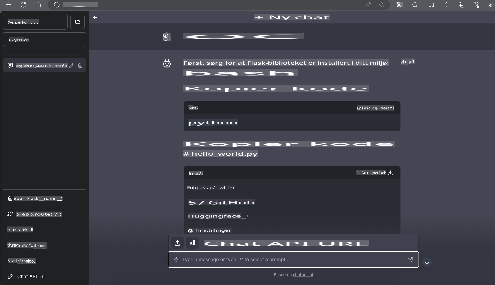

# **Inference Phi-3 i Nvidia Jetson**

Nvidia Jetson er en serie innebygde dataplattformer fra Nvidia. Modellene Jetson TK1, TX1 og TX2 har alle en Tegra-prosessor (eller SoC) fra Nvidia som integrerer en ARM-arkitektur prosessor (CPU). Jetson er et system med lavt strømforbruk og er designet for å akselerere maskinlæringsapplikasjoner. Nvidia Jetson brukes av profesjonelle utviklere for å skape banebrytende AI-produkter på tvers av alle bransjer, og av studenter og entusiaster for praktisk AI-læring og spennende prosjekter. SLM distribueres på edge-enheter som Jetson, noe som muliggjør bedre implementering av industrielle generative AI-applikasjonsscenarier.

## Distribusjon på NVIDIA Jetson:
Utviklere som arbeider med autonome roboter og innebygde enheter kan dra nytte av Phi-3 Mini. Phi-3s relativt lille størrelse gjør den ideell for edge-distribusjon. Parametrene er nøye justert under trening for å sikre høy nøyaktighet i svarene.

### TensorRT-LLM Optimalisering:
NVIDIAs [TensorRT-LLM-bibliotek](https://github.com/NVIDIA/TensorRT-LLM?WT.mc_id=aiml-138114-kinfeylo) optimaliserer inferens av store språkmodeller. Det støtter Phi-3 Minis lange kontekstvindu, og forbedrer både gjennomstrømning og ventetid. Optimaliseringene inkluderer teknikker som LongRoPE, FP8 og inflight batching.

### Tilgjengelighet og distribusjon:
Utviklere kan utforske Phi-3 Mini med 128K kontekstvindu på [NVIDIAs AI](https://www.nvidia.com/en-us/ai-data-science/generative-ai/). Den er pakket som en NVIDIA NIM, en mikrotjeneste med et standard API som kan distribueres hvor som helst. I tillegg finnes [TensorRT-LLM-implementasjonene på GitHub](https://github.com/NVIDIA/TensorRT-LLM).

## **1. Forberedelser**

a. Jetson Orin NX / Jetson NX

b. JetPack 5.1.2+
   
c. Cuda 11.8
   
d. Python 3.8+

## **2. Kjøre Phi-3 på Jetson**

Vi kan velge [Ollama](https://ollama.com) eller [LlamaEdge](https://llamaedge.com)

Hvis du ønsker å bruke gguf både i skyen og på edge-enheter samtidig, kan LlamaEdge forstås som WasmEdge (WasmEdge er en lett, høyytelses, skalerbar WebAssembly-runtime som passer for skybaserte, edge og desentraliserte applikasjoner. Den støtter serverløse applikasjoner, innebygde funksjoner, mikrotjenester, smarte kontrakter og IoT-enheter. Du kan distribuere ggufs kvantitative modell til edge-enheter og skyen via LlamaEdge).


Her er trinnene for å bruke det:

1. Installer og last ned relevante biblioteker og filer

```bash

curl -sSf https://raw.githubusercontent.com/WasmEdge/WasmEdge/master/utils/install.sh | bash -s -- --plugin wasi_nn-ggml

curl -LO https://github.com/LlamaEdge/LlamaEdge/releases/latest/download/llama-api-server.wasm

curl -LO https://github.com/LlamaEdge/chatbot-ui/releases/latest/download/chatbot-ui.tar.gz

tar xzf chatbot-ui.tar.gz

```

**Merk**: llama-api-server.wasm og chatbot-ui må være i samme katalog

2. Kjør skriptene i terminalen

```bash

wasmedge --dir .:. --nn-preload default:GGML:AUTO:{Your gguf path} llama-api-server.wasm -p phi-3-chat

```

Her er kjøreresultatet:



***Eksempelkode*** [Phi-3 mini WASM Notebook Sample](https://github.com/Azure-Samples/Phi-3MiniSamples/tree/main/wasm)

Oppsummert representerer Phi-3 Mini et stort skritt fremover innen språkmodellering, med en kombinasjon av effektivitet, kontekstforståelse og NVIDIAs optimaliseringsevner. Enten du bygger roboter eller edge-applikasjoner, er Phi-3 Mini et kraftig verktøy du bør kjenne til.

**Ansvarsfraskrivelse**:  
Dette dokumentet er oversatt ved hjelp av maskinbaserte AI-oversettelsestjenester. Selv om vi tilstreber nøyaktighet, vær oppmerksom på at automatiske oversettelser kan inneholde feil eller unøyaktigheter. Det originale dokumentet på sitt opprinnelige språk bør betraktes som den autoritative kilden. For kritisk informasjon anbefales profesjonell menneskelig oversettelse. Vi er ikke ansvarlige for eventuelle misforståelser eller feiltolkninger som oppstår ved bruk av denne oversettelsen.