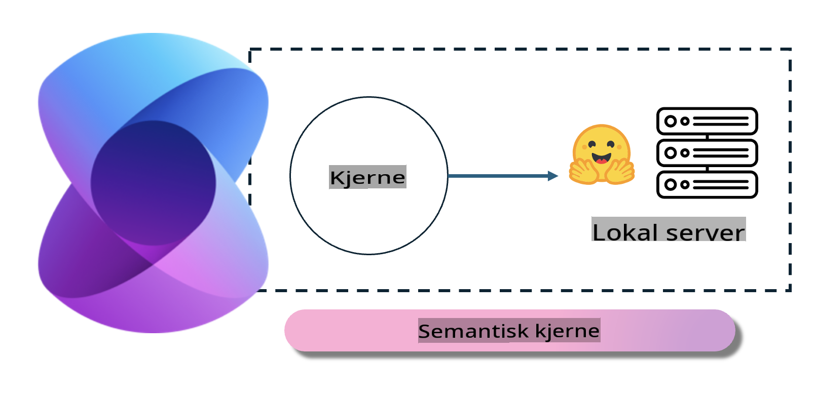
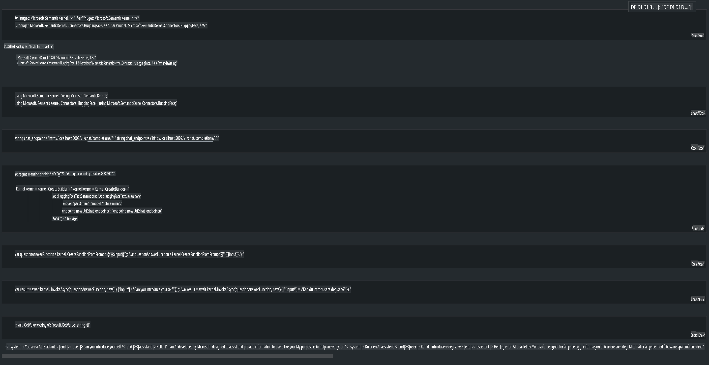

# **Inference Phi-3 på lokal server**

Vi kan kjøre Phi-3 på en lokal server. Brukere kan velge [Ollama](https://ollama.com) eller [LM Studio](https://llamaedge.com)-løsninger, eller de kan skrive sin egen kode. Du kan koble Phi-3s lokale tjenester til [Semantic Kernel](https://github.com/microsoft/semantic-kernel?WT.mc_id=aiml-138114-kinfeylo) eller [Langchain](https://www.langchain.com/) for å bygge Copilot-applikasjoner.

## **Bruke Semantic Kernel for å få tilgang til Phi-3-mini**

I Copilot-applikasjoner lager vi applikasjoner gjennom Semantic Kernel / LangChain. Denne typen rammeverk er vanligvis kompatibel med Azure OpenAI Service / OpenAI-modeller, og kan også støtte open source-modeller på Hugging Face og lokale modeller. Hva gjør vi hvis vi ønsker å bruke Semantic Kernel for å få tilgang til Phi-3-mini? Ved å bruke .NET som eksempel, kan vi kombinere det med Hugging Face Connector i Semantic Kernel. Som standard kan det tilpasses modell-ID-en på Hugging Face (første gang du bruker det, vil modellen bli lastet ned fra Hugging Face, noe som kan ta lang tid). Du kan også koble til en lokal tjeneste du har satt opp selv. Mellom disse to alternativene anbefaler vi det siste, fordi det gir høyere grad av autonomi, spesielt i bedriftsapplikasjoner.

Som vist i figuren, kan tilgang til lokale tjenester gjennom Semantic Kernel enkelt kobles til en selvbygget Phi-3-mini-modellserver. Her er kjøreresultatet:

***Eksempelkode*** https://github.com/kinfey/Phi3MiniSamples/tree/main/semantickernel

**Ansvarsfraskrivelse**:  
Dette dokumentet er oversatt ved hjelp av maskinbaserte AI-oversettelsestjenester. Selv om vi tilstreber nøyaktighet, vennligst vær oppmerksom på at automatiserte oversettelser kan inneholde feil eller unøyaktigheter. Det originale dokumentet på sitt opprinnelige språk bør anses som den autoritative kilden. For kritisk informasjon anbefales profesjonell menneskelig oversettelse. Vi er ikke ansvarlige for misforståelser eller feiltolkninger som oppstår ved bruk av denne oversettelsen.