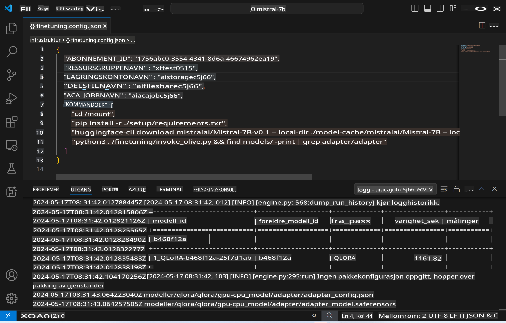
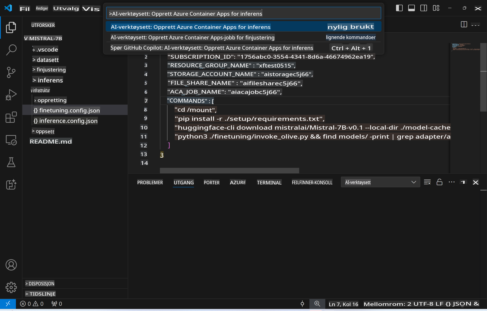
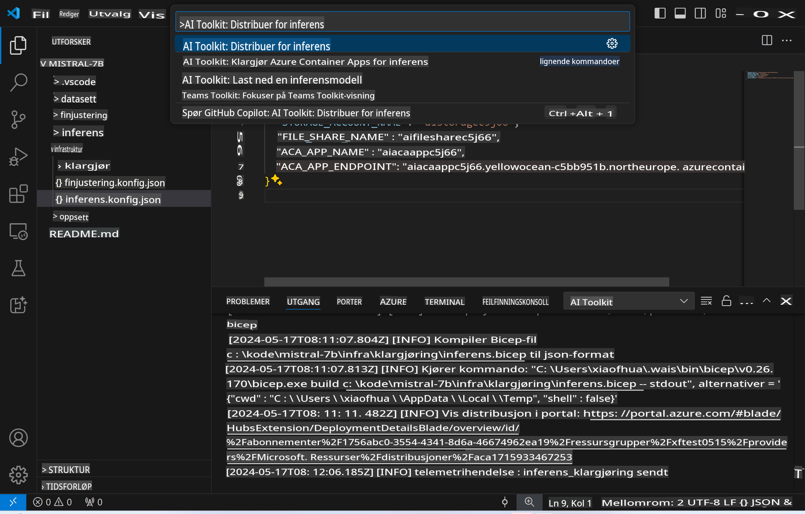
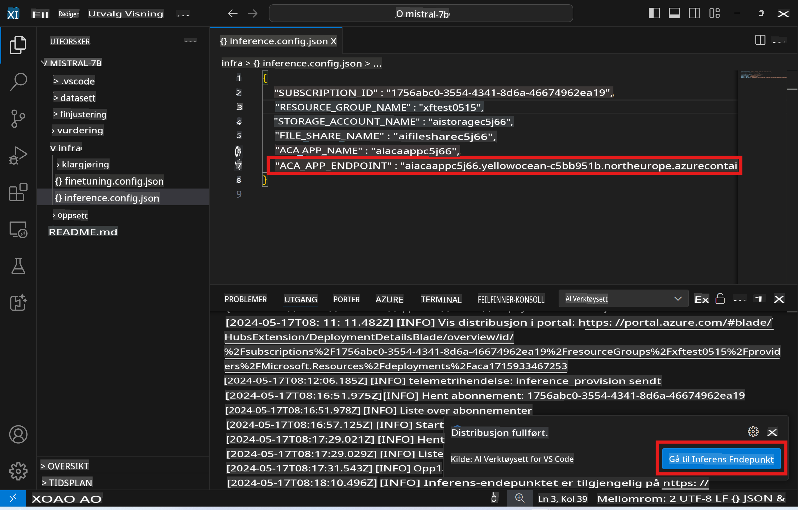

# Fjerninferens med den finjusterte modellen

Etter at adapterne er trent i det eksterne miljøet, kan du bruke en enkel Gradio-applikasjon for å samhandle med modellen.



### Klargjør Azure-ressurser
Du må sette opp Azure-ressurser for fjerninferens ved å kjøre `AI Toolkit: Provision Azure Container Apps for inference` fra kommandopaletten. Under oppsettet vil du bli bedt om å velge Azure-abonnementet og ressursgruppen din.  

   
Som standard bør abonnementet og ressursgruppen for inferens være de samme som ble brukt for finjustering. Inferensen vil bruke det samme Azure Container App-miljøet og få tilgang til modellen og adapteren som er lagret i Azure Files, generert under finjusteringsprosessen.

## Bruk av AI Toolkit

### Distribusjon for inferens  
Hvis du ønsker å oppdatere inferenskoden eller laste inn inferensmodellen på nytt, kan du kjøre kommandoen `AI Toolkit: Deploy for inference`. Dette vil synkronisere den nyeste koden din med ACA og starte instansen på nytt.  



Etter at distribusjonen er fullført, er modellen klar for evaluering via denne endepunktet.

### Tilgang til inferens-API

Du kan få tilgang til inferens-API-et ved å klikke på knappen "*Gå til inferensendepunkt*" som vises i VSCode-varslingen. Alternativt finner du web-API-endepunktet under `ACA_APP_ENDPOINT` i `./infra/inference.config.json` og i utdata-panelet.



> **Merk:** Det kan ta noen minutter før inferensendepunktet er fullt operativt.

## Inferenskomponenter inkludert i malen
 
| Mappe | Innhold |
| ------ |--------- |
| `infra` | Inneholder alle nødvendige konfigurasjoner for fjernoperasjoner. |
| `infra/provision/inference.parameters.json` | Inneholder parametere for bicep-maler, brukt til å klargjøre Azure-ressurser for inferens. |
| `infra/provision/inference.bicep` | Inneholder maler for å klargjøre Azure-ressurser for inferens. |
| `infra/inference.config.json` | Konfigurasjonsfilen generert av `AI Toolkit: Provision Azure Container Apps for inference`-kommandoen. Den brukes som input for andre fjernkommandoer i paletten. |

### Bruk av AI Toolkit for å konfigurere Azure Resource Provision
Konfigurer [AI Toolkit](https://marketplace.visualstudio.com/items?itemName=ms-windows-ai-studio.windows-ai-studio)

Klargjør Azure Container Apps for inferens` command.

You can find configuration parameters in `./infra/provision/inference.parameters.json` file. Here are the details:
| Parameter | Description |
| --------- |------------ |
| `defaultCommands` | This is the commands to initiate a web API. |
| `maximumInstanceCount` | This parameter sets the maximum capacity of GPU instances. |
| `location` | This is the location where Azure resources are provisioned. The default value is the same as the chosen resource group's location. |
| `storageAccountName`, `fileShareName` `acaEnvironmentName`, `acaEnvironmentStorageName`, `acaAppName`,  `acaLogAnalyticsName` | These parameters are used to name the Azure resources for provision. By default, they will be same to the fine-tuning resource name. You can input a new, unused resource name to create your own custom-named resources, or you can input the name of an already existing Azure resource if you'd prefer to use that. For details, refer to the section [Using existing Azure Resources](../../../../../md/01.Introduction/03). |

### Using Existing Azure Resources

By default, the inference provision use the same Azure Container App Environment, Storage Account, Azure File Share, and Azure Log Analytics that were used for fine-tuning. A separate Azure Container App is created solely for the inference API. 

If you have customized the Azure resources during the fine-tuning step or want to use your own existing Azure resources for inference, specify their names in the `./infra/inference.parameters.json`-filen. Deretter kjører du `AI Toolkit: Provision Azure Container Apps for inference`-kommandoen fra kommandopaletten. Dette oppdaterer spesifiserte ressurser og oppretter eventuelle manglende ressurser.

For eksempel, hvis du har et eksisterende Azure-container-miljø, bør `./infra/finetuning.parameters.json` se slik ut:

```json
{
    "$schema": "https://schema.management.azure.com/schemas/2019-04-01/deploymentParameters.json#",
    "contentVersion": "1.0.0.0",
    "parameters": {
      ...
      "acaEnvironmentName": {
        "value": "<your-aca-env-name>"
      },
      "acaEnvironmentStorageName": {
        "value": null
      },
      ...
    }
  }
```

### Manuell klargjøring  
Hvis du foretrekker å konfigurere Azure-ressursene manuelt, kan du bruke de medfølgende bicep-filene i `./infra/provision` folders. If you have already set up and configured all the Azure resources without using the AI Toolkit command palette, you can simply enter the resource names in the `inference.config.json`-filen.

For eksempel:

```json
{
  "SUBSCRIPTION_ID": "<your-subscription-id>",
  "RESOURCE_GROUP_NAME": "<your-resource-group-name>",
  "STORAGE_ACCOUNT_NAME": "<your-storage-account-name>",
  "FILE_SHARE_NAME": "<your-file-share-name>",
  "ACA_APP_NAME": "<your-aca-name>",
  "ACA_APP_ENDPOINT": "<your-aca-endpoint>"
}
```

**Ansvarsfraskrivelse**:  
Dette dokumentet er oversatt ved hjelp av maskinbaserte AI-oversettingstjenester. Selv om vi bestreber oss på nøyaktighet, vær oppmerksom på at automatiserte oversettelser kan inneholde feil eller unøyaktigheter. Det originale dokumentet på sitt opprinnelige språk bør betraktes som den autoritative kilden. For kritisk informasjon anbefales profesjonell menneskelig oversettelse. Vi er ikke ansvarlige for eventuelle misforståelser eller feiltolkninger som oppstår ved bruk av denne oversettelsen.