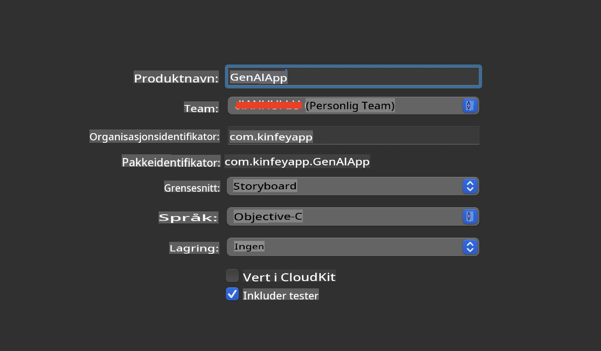
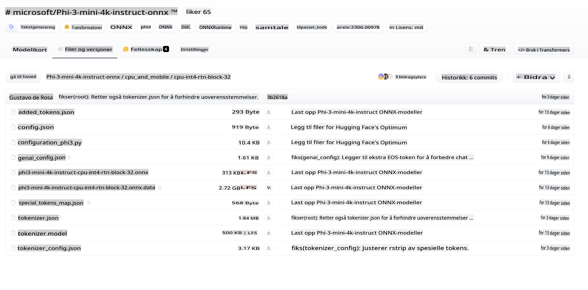
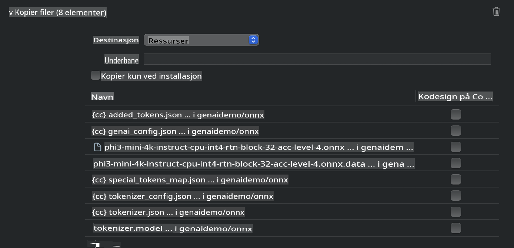
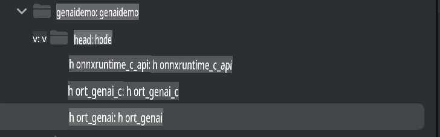
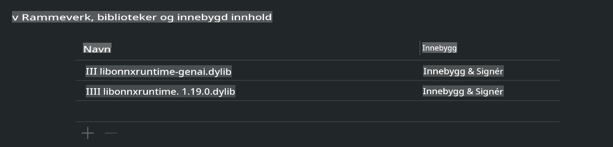
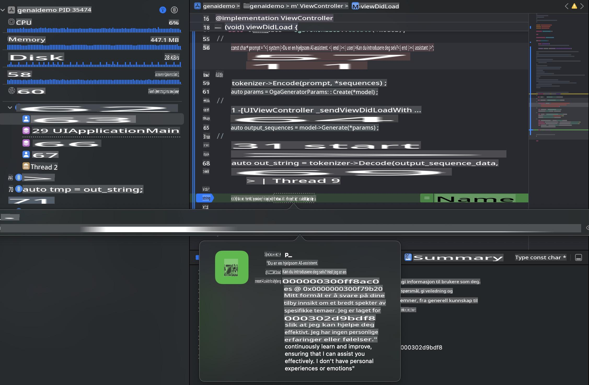

# **Inferens Phi-3 på iOS**

Phi-3-mini er en ny serie modeller fra Microsoft som muliggjør implementering av store språkmodeller (LLMs) på edge-enheter og IoT-enheter. Phi-3-mini er tilgjengelig for iOS, Android og edge-enheter, noe som gjør det mulig å bruke generativ AI i BYOD-miljøer. Eksempelet nedenfor viser hvordan du kan implementere Phi-3-mini på iOS.

## **1. Forberedelser**

- **a.** macOS 14+
- **b.** Xcode 15+
- **c.** iOS SDK 17.x (iPhone 14 A16 eller nyere)
- **d.** Installer Python 3.10+ (Conda anbefales)
- **e.** Installer Python-biblioteket: `python-flatbuffers`
- **f.** Installer CMake

### Semantic Kernel og inferens

Semantic Kernel er et applikasjonsrammeverk som lar deg lage applikasjoner kompatible med Azure OpenAI Service, OpenAI-modeller og til og med lokale modeller. Ved å bruke Semantic Kernel til å få tilgang til lokale tjenester, kan du enkelt integrere din egenhostede Phi-3-mini-modelltjener.

### Kjøring av kvantiserte modeller med Ollama eller LlamaEdge

Mange brukere foretrekker å bruke kvantiserte modeller for å kjøre modeller lokalt. [Ollama](https://ollama.com) og [LlamaEdge](https://llamaedge.com) gjør det mulig å bruke ulike kvantiserte modeller:

#### **Ollama**

Du kan kjøre `ollama run phi3` direkte eller konfigurere det offline. Lag en Modelfile med banen til din `gguf`-fil. Eksempelkode for å kjøre Phi-3-mini kvantisert modell:

```gguf
FROM {Add your gguf file path}
TEMPLATE \"\"\"<|user|> .Prompt<|end|> <|assistant|>\"\"\"
PARAMETER stop <|end|>
PARAMETER num_ctx 4096
```

#### **LlamaEdge**

Hvis du ønsker å bruke `gguf` både i skyen og på edge-enheter samtidig, er LlamaEdge et godt alternativ.

## **2. Kompilering av ONNX Runtime for iOS**

```bash

git clone https://github.com/microsoft/onnxruntime.git

cd onnxruntime

./build.sh --build_shared_lib --ios --skip_tests --parallel --build_dir ./build_ios --ios --apple_sysroot iphoneos --osx_arch arm64 --apple_deploy_target 17.5 --cmake_generator Xcode --config Release

cd ../

```

### **Merk**

- **a.** Før kompilering, sørg for at Xcode er riktig konfigurert og sett det som aktiv utviklingskatalog i terminalen:

    ```bash
    sudo xcode-select -switch /Applications/Xcode.app/Contents/Developer
    ```

- **b.** ONNX Runtime må kompileres for ulike plattformer. For iOS kan du kompilere for `arm64` or `x86_64`.

- **c.** Det anbefales å bruke den nyeste iOS SDK-en for kompilering. Du kan imidlertid også bruke en eldre versjon hvis du trenger kompatibilitet med tidligere SDK-er.

## **3. Kompilering av Generativ AI med ONNX Runtime for iOS**

> **Merk:** Siden Generativ AI med ONNX Runtime er i forhåndsvisning, vær oppmerksom på mulige endringer.

```bash

git clone https://github.com/microsoft/onnxruntime-genai
 
cd onnxruntime-genai
 
mkdir ort
 
cd ort
 
mkdir include
 
mkdir lib
 
cd ../
 
cp ../onnxruntime/include/onnxruntime/core/session/onnxruntime_c_api.h ort/include
 
cp ../onnxruntime/build_ios/Release/Release-iphoneos/libonnxruntime*.dylib* ort/lib
 
export OPENCV_SKIP_XCODEBUILD_FORCE_TRYCOMPILE_DEBUG=1
 
python3 build.py --parallel --build_dir ./build_ios --ios --ios_sysroot iphoneos --ios_arch arm64 --ios_deployment_target 17.5 --cmake_generator Xcode --cmake_extra_defines CMAKE_XCODE_ATTRIBUTE_CODE_SIGNING_ALLOWED=NO

```

## **4. Opprett en App-applikasjon i Xcode**

Jeg valgte Objective-C som utviklingsmetode for appen, fordi Objective-C er bedre kompatibelt med Generativ AI ved bruk av ONNX Runtime C++ API. Selvfølgelig kan du også gjøre de nødvendige kallene gjennom Swift bridging.



## **5. Kopier ONNX kvantisert INT4-modell til App-applikasjonsprosjektet**

Vi må importere INT4-kvantisert modell i ONNX-format, som må lastes ned først.



Etter nedlasting må den legges til i Resources-mappen i prosjektet i Xcode.



## **6. Legge til C++ API i ViewControllers**

> **Merk:**

- **a.** Legg til de tilsvarende C++-header-filene i prosjektet.

  

- **b.** Inkluder `onnxruntime-genai` dynamic library in Xcode.

  

- **c.** Use the C Samples code for testing. You can also add additional features like ChatUI for more functionality.

- **d.** Since you need to use C++ in your project, rename `ViewController.m` to `ViewController.mm` for å aktivere Objective-C++-støtte.

```objc

    NSString *llmPath = [[NSBundle mainBundle] resourcePath];
    char const *modelPath = llmPath.cString;

    auto model =  OgaModel::Create(modelPath);

    auto tokenizer = OgaTokenizer::Create(*model);

    const char* prompt = "<|system|>You are a helpful AI assistant.<|end|><|user|>Can you introduce yourself?<|end|><|assistant|>";

    auto sequences = OgaSequences::Create();
    tokenizer->Encode(prompt, *sequences);

    auto params = OgaGeneratorParams::Create(*model);
    params->SetSearchOption("max_length", 100);
    params->SetInputSequences(*sequences);

    auto output_sequences = model->Generate(*params);
    const auto output_sequence_length = output_sequences->SequenceCount(0);
    const auto* output_sequence_data = output_sequences->SequenceData(0);
    auto out_string = tokenizer->Decode(output_sequence_data, output_sequence_length);
    
    auto tmp = out_string;

```

## **7. Kjøre applikasjonen**

Når oppsettet er fullført, kan du kjøre applikasjonen for å se resultatene av Phi-3-mini-modellens inferens.



For mer eksempelkode og detaljerte instruksjoner, besøk [Phi-3 Mini Samples repository](https://github.com/Azure-Samples/Phi-3MiniSamples/tree/main/ios).

**Ansvarsfraskrivelse**:  
Dette dokumentet er oversatt ved hjelp av maskinbaserte AI-oversettelsestjenester. Selv om vi tilstreber nøyaktighet, vennligst vær oppmerksom på at automatiserte oversettelser kan inneholde feil eller unøyaktigheter. Det originale dokumentet på sitt opprinnelige språk bør betraktes som den autoritative kilden. For kritisk informasjon anbefales profesjonell menneskelig oversettelse. Vi er ikke ansvarlige for misforståelser eller feiltolkninger som oppstår ved bruk av denne oversettelsen.