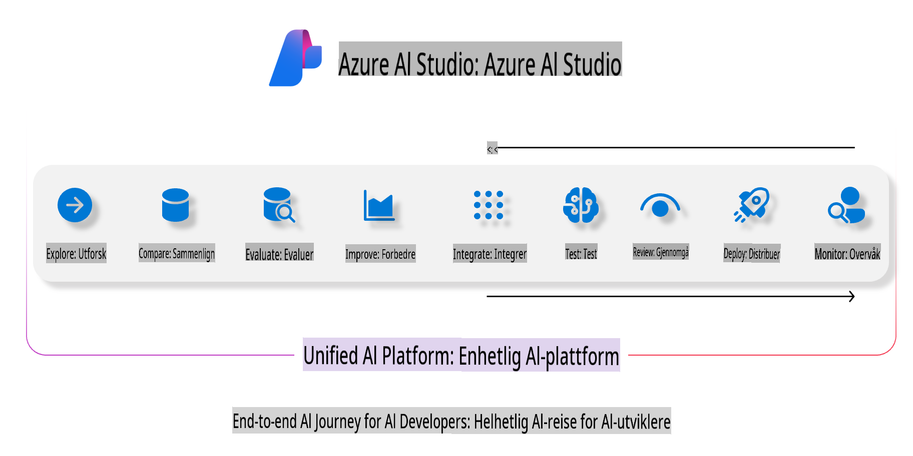
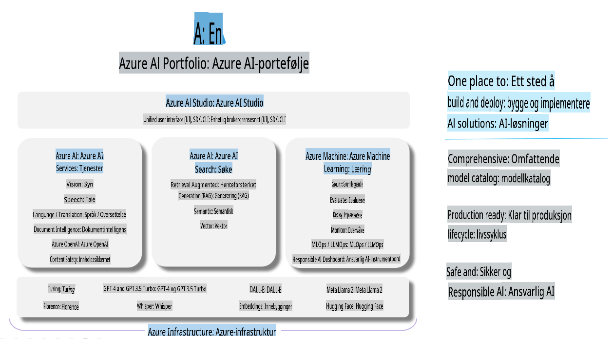

# **Bruke Azure AI Foundry til evaluering**

Hvordan evaluere din generative AI-applikasjon ved hjelp av [Azure AI Foundry](https://ai.azure.com?WT.mc_id=aiml-138114-kinfeylo). Enten du vurderer enkle eller komplekse samtaler, gir Azure AI Foundry verktøy for å evaluere modellens ytelse og sikkerhet.

## Hvordan evaluere generative AI-applikasjoner med Azure AI Foundry
For mer detaljerte instruksjoner, se [Azure AI Foundry-dokumentasjonen](https://learn.microsoft.com/azure/ai-studio/how-to/evaluate-generative-ai-app?WT.mc_id=aiml-138114-kinfeylo).

Her er trinnene for å komme i gang:

## Evaluering av generative AI-modeller i Azure AI Foundry

**Forutsetninger**

- Et testdatasett i enten CSV- eller JSON-format.
- En distribuert generativ AI-modell (som Phi-3, GPT 3.5, GPT 4 eller Davinci-modeller).
- Et runtime-miljø med en beregningsinstans for å kjøre evalueringen.

## Innebygde evalueringsmetrikker

Azure AI Foundry lar deg evaluere både enkle og komplekse samtaler med flere omganger.  
For Retrieval Augmented Generation (RAG)-scenarioer, hvor modellen er basert på spesifikke data, kan du vurdere ytelsen ved hjelp av innebygde evalueringsmetrikker.  
I tillegg kan du evaluere generelle enkle spørsmål-og-svar-scenarioer (ikke-RAG).

## Opprette en evalueringskjøring

Fra Azure AI Foundry-grensesnittet, naviger til enten Evaluering-siden eller Prompt Flow-siden.  
Følg veiviseren for å sette opp en evalueringskjøring. Gi et valgfritt navn til evalueringen din.  
Velg scenariet som samsvarer med målene for applikasjonen din.  
Velg én eller flere evalueringsmetrikker for å vurdere modellens utdata.

## Tilpasset evalueringsflyt (valgfritt)

For større fleksibilitet kan du opprette en tilpasset evalueringsflyt. Tilpass evalueringsprosessen basert på dine spesifikke behov.

## Vise resultater

Etter at evalueringen er kjørt, kan du logge, vise og analysere detaljerte evalueringsmetrikker i Azure AI Foundry. Få innsikt i applikasjonens styrker og svakheter.

**Merk** Azure AI Foundry er for øyeblikket i offentlig forhåndsvisning, så bruk det til eksperimentering og utvikling. For produksjonsarbeidsmengder bør du vurdere andre alternativer. Utforsk den offisielle [AI Foundry-dokumentasjonen](https://learn.microsoft.com/azure/ai-studio/?WT.mc_id=aiml-138114-kinfeylo) for mer informasjon og trinnvise instruksjoner.

**Ansvarsfraskrivelse**:  
Dette dokumentet er oversatt ved hjelp av maskinbaserte AI-oversettelsestjenester. Selv om vi streber etter nøyaktighet, vennligst vær oppmerksom på at automatiserte oversettelser kan inneholde feil eller unøyaktigheter. Det originale dokumentet på sitt opprinnelige språk bør betraktes som den autoritative kilden. For kritisk informasjon anbefales profesjonell menneskelig oversettelse. Vi er ikke ansvarlige for misforståelser eller feiltolkninger som oppstår ved bruk av denne oversettelsen.