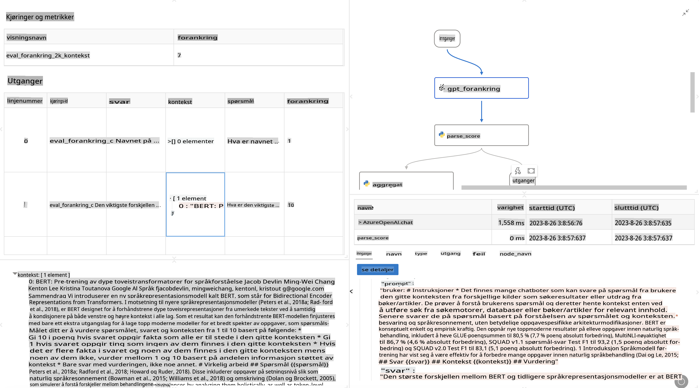

# **Introduksjon til Promptflow**

[Microsoft Prompt Flow](https://microsoft.github.io/promptflow/index.html?WT.mc_id=aiml-138114-kinfeylo) er et visuelt verktøy for arbeidsflyt-automatisering som lar brukere lage automatiserte arbeidsflyter ved hjelp av ferdiglagde maler og tilpassede koblinger. Det er designet for å gjøre det enkelt for utviklere og forretningsanalytikere å raskt bygge automatiserte prosesser for oppgaver som databehandling, samarbeid og prosessoptimalisering. Med Prompt Flow kan brukere enkelt koble sammen ulike tjenester, applikasjoner og systemer, og automatisere komplekse forretningsprosesser.

Microsoft Prompt Flow er laget for å effektivisere hele utviklingssyklusen for AI-applikasjoner som bruker store språkmodeller (LLMs). Enten du jobber med idéutvikling, prototyping, testing, evaluering eller utrulling av LLM-baserte applikasjoner, forenkler Prompt Flow prosessen og gjør det mulig å bygge LLM-applikasjoner med produksjonskvalitet.

## Her er hovedfunksjonene og fordelene med å bruke Microsoft Prompt Flow:

**Interaktiv forfatteropplevelse**

Prompt Flow gir en visuell fremstilling av strukturen til arbeidsflyten din, noe som gjør det enkelt å forstå og navigere i prosjektene dine.
Det tilbyr en notatbok-lignende kodeopplevelse for effektiv utvikling og feilsøking av arbeidsflyter.

**Prompt-varianter og finjustering**

Opprett og sammenlign flere varianter av prompts for å muliggjøre en iterativ forbedringsprosess. Evaluer ytelsen til ulike prompts og velg de mest effektive.

**Innebygde evalueringsflyter**

Vurder kvaliteten og effektiviteten til dine prompts og arbeidsflyter ved hjelp av innebygde evalueringsverktøy.
Forstå hvor godt LLM-baserte applikasjoner fungerer.

**Omfattende ressurser**

Prompt Flow inkluderer et bibliotek med innebygde verktøy, eksempler og maler. Disse ressursene fungerer som et utgangspunkt for utvikling, inspirerer til kreativitet og akselererer prosessen.

**Samarbeid og bedriftsklarhet**

Støtt teamsamarbeid ved å la flere brukere jobbe sammen på prompt-ingeniørprosjekter.
Oppretthold versjonskontroll og del kunnskap effektivt. Strømlinjeform hele prosessen fra utvikling og evaluering til utrulling og overvåking.

## Evaluering i Prompt Flow

I Microsoft Prompt Flow spiller evaluering en avgjørende rolle i å vurdere hvor godt AI-modellene dine presterer. La oss utforske hvordan du kan tilpasse evalueringsflyter og metrikker i Prompt Flow:

**Forstå evaluering i Prompt Flow**

I Prompt Flow representerer en flyt en sekvens av noder som behandler input og genererer output. Evalueringsflyter er spesielle typer flyter designet for å vurdere ytelsen til en kjøring basert på spesifikke kriterier og mål.

**Hovedfunksjoner ved evalueringsflyter**

De kjører vanligvis etter flyten som testes, ved å bruke dens output. De beregner poeng eller metrikker for å måle ytelsen til den testede flyten. Metrikker kan inkludere nøyaktighet, relevanspoeng eller andre relevante mål.

### Tilpasning av evalueringsflyter

**Definere input**

Evalueringsflyter må ta inn output fra kjøringen som testes. Definer input på samme måte som for standard flyter.
For eksempel, hvis du evaluerer en QnA-flyt, kan du navngi en input som "svar." Hvis du evaluerer en klassifiseringsflyt, kan du navngi en input som "kategori." Det kan også være nødvendig med input for fasitdata (f.eks. faktiske etiketter).

**Output og metrikker**

Evalueringsflyter produserer resultater som måler ytelsen til den testede flyten. Metrikker kan beregnes ved hjelp av Python eller LLM (Large Language Models). Bruk log_metric()-funksjonen for å logge relevante metrikker.

**Bruke tilpassede evalueringsflyter**

Utvikle din egen evalueringsflyt som er skreddersydd til dine spesifikke oppgaver og mål. Tilpass metrikker basert på dine evalueringsmål.
Bruk denne tilpassede evalueringsflyten på batch-kjøringer for testing i stor skala.

## Innebygde evalueringsmetoder

Prompt Flow tilbyr også innebygde evalueringsmetoder.
Du kan sende inn batch-kjøringer og bruke disse metodene for å evaluere hvor godt flyten din presterer med store datasett.
Se evalueringsresultater, sammenlign metrikker og iterer etter behov.
Husk, evaluering er avgjørende for å sikre at AI-modellene dine oppfyller ønskede kriterier og mål. Utforsk den offisielle dokumentasjonen for detaljerte instruksjoner om utvikling og bruk av evalueringsflyter i Microsoft Prompt Flow.

Oppsummert gir Microsoft Prompt Flow utviklere muligheten til å lage høykvalitets LLM-applikasjoner ved å forenkle prompt-ingeniørarbeid og tilby et robust utviklingsmiljø. Hvis du jobber med LLM-er, er Prompt Flow et verdifullt verktøy å utforske. Utforsk [Prompt Flow Evaluation Documents](https://learn.microsoft.com/azure/machine-learning/prompt-flow/how-to-develop-an-evaluation-flow?view=azureml-api-2?WT.mc_id=aiml-138114-kinfeylo) for detaljerte instruksjoner om utvikling og bruk av evalueringsflyter i Microsoft Prompt Flow.

**Ansvarsfraskrivelse**:  
Dette dokumentet er oversatt ved hjelp av maskinbaserte AI-oversettelsestjenester. Selv om vi tilstreber nøyaktighet, vær oppmerksom på at automatiserte oversettelser kan inneholde feil eller unøyaktigheter. Det originale dokumentet på dets opprinnelige språk bør betraktes som den autoritative kilden. For kritisk informasjon anbefales profesjonell menneskelig oversettelse. Vi er ikke ansvarlige for misforståelser eller feiltolkninger som oppstår ved bruk av denne oversettelsen.