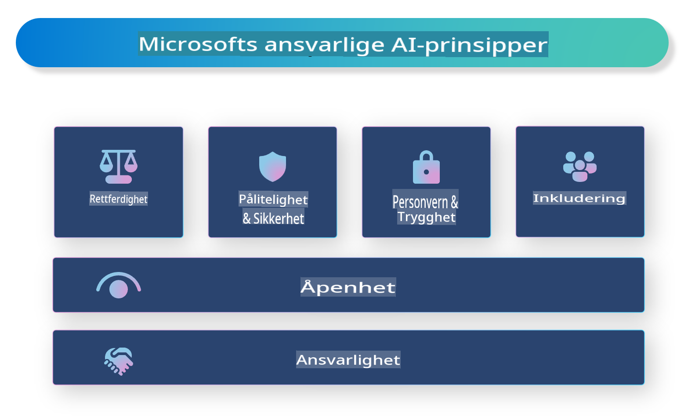

# **Introduksjon til Ansvarlig AI**

[Microsoft Responsible AI](https://www.microsoft.com/ai/responsible-ai?WT.mc_id=aiml-138114-kinfeylo) er et initiativ som har som mål å hjelpe utviklere og organisasjoner med å bygge AI-systemer som er transparente, pålitelige og ansvarlige. Initiativet gir veiledning og ressurser for å utvikle ansvarlige AI-løsninger som er i tråd med etiske prinsipper, som personvern, rettferdighet og åpenhet. Vi skal også utforske noen av utfordringene og beste praksis knyttet til å bygge ansvarlige AI-systemer.

## Oversikt over Microsoft Responsible AI

**Etiske prinsipper**

Microsoft Responsible AI er basert på et sett med etiske prinsipper, som personvern, rettferdighet, åpenhet, ansvarlighet og sikkerhet. Disse prinsippene er utviklet for å sikre at AI-systemer utvikles på en etisk og ansvarlig måte.

**Transparent AI**

Microsoft Responsible AI legger vekt på betydningen av åpenhet i AI-systemer. Dette inkluderer å gi klare forklaringer på hvordan AI-modeller fungerer, samt sikre at datasett og algoritmer er offentlig tilgjengelige.

**Ansvarlig AI**

[Microsoft Responsible AI](https://www.microsoft.com/ai/responsible-ai?WT.mc_id=aiml-138114-kinfeylo) fremmer utviklingen av ansvarlige AI-systemer som kan gi innsikt i hvordan AI-modeller tar beslutninger. Dette kan hjelpe brukere med å forstå og stole på resultatene fra AI-systemer.

**Inkludering**

AI-systemer bør designes for å være til nytte for alle. Microsoft har som mål å skape inkluderende AI som tar hensyn til ulike perspektiver og unngår skjevhet eller diskriminering.

**Pålitelighet og sikkerhet**

Det er avgjørende å sikre at AI-systemer er pålitelige og trygge. Microsoft fokuserer på å bygge robuste modeller som presterer konsekvent og unngår skadelige konsekvenser.

**Rettferdighet i AI**

Microsoft Responsible AI erkjenner at AI-systemer kan videreføre skjevheter hvis de trenes på skjevt datasett eller algoritmer. Initiativet gir veiledning for å utvikle rettferdige AI-systemer som ikke diskriminerer basert på faktorer som rase, kjønn eller alder.

**Personvern og sikkerhet**

Microsoft Responsible AI understreker viktigheten av å beskytte brukernes personvern og datasikkerhet i AI-systemer. Dette inkluderer å implementere sterk datakryptering og tilgangskontroller, samt regelmessig gjennomgå AI-systemer for sårbarheter.

**Ansvar og forpliktelse**

Microsoft Responsible AI fremmer ansvar og forpliktelse i utvikling og bruk av AI. Dette inkluderer å sikre at utviklere og organisasjoner er klar over de potensielle risikoene knyttet til AI-systemer og tar tiltak for å redusere disse risikoene.

## Beste praksis for å bygge ansvarlige AI-systemer

**Utvikle AI-modeller med mangfoldige datasett**

For å unngå skjevhet i AI-systemer er det viktig å bruke mangfoldige datasett som representerer et bredt spekter av perspektiver og erfaringer.

**Bruk forklarbare AI-teknikker**

Forklarbare AI-teknikker kan hjelpe brukere med å forstå hvordan AI-modeller tar beslutninger, noe som kan øke tilliten til systemet.

**Utfør regelmessige revisjoner av AI-systemer for sårbarheter**

Regelmessige revisjoner av AI-systemer kan bidra til å identifisere potensielle risikoer og sårbarheter som må håndteres.

**Implementer sterk datakryptering og tilgangskontroller**

Datakryptering og tilgangskontroller kan bidra til å beskytte brukernes personvern og sikkerhet i AI-systemer.

**Følg etiske prinsipper i AI-utvikling**

Å følge etiske prinsipper som rettferdighet, åpenhet og ansvarlighet kan bidra til å bygge tillit til AI-systemer og sikre at de utvikles på en ansvarlig måte.

## Bruk av AI Foundry for Ansvarlig AI

[Azure AI Foundry](https://ai.azure.com?WT.mc_id=aiml-138114-kinfeylo) er en kraftig plattform som lar utviklere og organisasjoner raskt lage intelligente, avanserte, markedsklare og ansvarlige applikasjoner. Her er noen nøkkelfunksjoner og muligheter i Azure AI Foundry:

**Ferdige API-er og modeller**

Azure AI Foundry tilbyr forhåndsbygde og tilpassbare API-er og modeller. Disse dekker et bredt spekter av AI-oppgaver, inkludert generativ AI, naturlig språkprosessering for samtaler, søk, overvåking, oversettelse, tale, visjon og beslutningstaking.

**Prompt Flow**

Prompt flow i Azure AI Foundry gjør det mulig å lage samtale-AI-opplevelser. Det lar deg designe og administrere samtaleflyter, noe som gjør det enklere å bygge chatboter, virtuelle assistenter og andre interaktive applikasjoner.

**Retrieval Augmented Generation (RAG)**

RAG er en teknikk som kombinerer tilnærminger basert på gjenfinning og generering. Den forbedrer kvaliteten på genererte svar ved å utnytte både eksisterende kunnskap (gjenfinning) og kreativ generering (generering).

**Evaluering og overvåkingsmetrikker for generativ AI**

Azure AI Foundry gir verktøy for å evaluere og overvåke generative AI-modeller. Du kan vurdere deres ytelse, rettferdighet og andre viktige metrikker for å sikre ansvarlig implementering. I tillegg, hvis du har opprettet et dashbord, kan du bruke det kodefrie grensesnittet i Azure Machine Learning Studio til å tilpasse og generere et Ansvarlig AI-dashbord og tilhørende scorekort basert på [Responsible AI Toolbox](https://responsibleaitoolbox.ai/?WT.mc_id=aiml-138114-kinfeylo) Python-bibliotekene. Dette scorekortet hjelper deg med å dele viktige innsikter relatert til rettferdighet, funksjonsbetydning og andre hensyn ved ansvarlig implementering med både tekniske og ikke-tekniske interessenter.

For å bruke AI Foundry med ansvarlig AI kan du følge disse beste praksisene:

**Definer problemet og målene for AI-systemet ditt**

Før du starter utviklingsprosessen, er det viktig å tydelig definere problemet eller målet som AI-systemet ditt skal løse. Dette vil hjelpe deg med å identifisere dataene, algoritmene og ressursene som trengs for å bygge en effektiv modell.

**Samle inn og forhåndsbehandle relevante data**

Kvaliteten og mengden av data som brukes til å trene et AI-system, kan ha en betydelig innvirkning på ytelsen. Derfor er det viktig å samle inn relevante data, rense dem, forhåndsbehandle dem og sikre at de er representative for befolkningen eller problemet du prøver å løse.

**Velg passende evalueringsmetoder**

Det finnes ulike evalueringsalgoritmer tilgjengelig. Det er viktig å velge den mest passende algoritmen basert på dataene og problemet ditt.

**Evaluer og tolk modellen**

Når du har bygget en AI-modell, er det viktig å evaluere ytelsen ved hjelp av passende metrikker og tolke resultatene på en transparent måte. Dette vil hjelpe deg med å identifisere eventuelle skjevheter eller begrensninger i modellen og gjøre forbedringer der det er nødvendig.

**Sørg for åpenhet og forklarbarhet**

AI-systemer bør være transparente og forklarbare slik at brukerne kan forstå hvordan de fungerer og hvordan beslutninger tas. Dette er spesielt viktig for applikasjoner som har stor innvirkning på menneskers liv, som helsevesen, finans og rettssystemer.

**Overvåk og oppdater modellen**

AI-systemer bør kontinuerlig overvåkes og oppdateres for å sikre at de forblir nøyaktige og effektive over tid. Dette krever løpende vedlikehold, testing og opplæring av modellen.

Avslutningsvis er Microsoft Responsible AI et initiativ som har som mål å hjelpe utviklere og organisasjoner med å bygge AI-systemer som er transparente, pålitelige og ansvarlige. Husk at implementering av ansvarlig AI er avgjørende, og Azure AI Foundry har som mål å gjøre det praktisk for organisasjoner. Ved å følge etiske prinsipper og beste praksis kan vi sikre at AI-systemer utvikles og implementeres på en ansvarlig måte som gagner samfunnet som helhet.

**Ansvarsfraskrivelse**:  
Dette dokumentet er oversatt ved hjelp av maskinbaserte AI-oversettingstjenester. Selv om vi streber etter nøyaktighet, vær oppmerksom på at automatiserte oversettelser kan inneholde feil eller unøyaktigheter. Det originale dokumentet på dets opprinnelige språk bør anses som den autoritative kilden. For kritisk informasjon anbefales profesjonell menneskelig oversettelse. Vi er ikke ansvarlige for misforståelser eller feiltolkninger som oppstår ved bruk av denne oversettelsen.