# Finjuster og integrer tilpassede Phi-3-modeller med Prompt Flow i Azure AI Foundry

Dette ende-til-ende (E2E) eksemplet er basert på guiden "[Fine-Tune and Integrate Custom Phi-3 Models with Prompt Flow in Azure AI Foundry](https://techcommunity.microsoft.com/t5/educator-developer-blog/fine-tune-and-integrate-custom-phi-3-models-with-prompt-flow-in/ba-p/4191726?WT.mc_id=aiml-137032-kinfeylo)" fra Microsoft Tech Community. Det introduserer prosessene for finjustering, distribusjon og integrering av tilpassede Phi-3-modeller med Prompt Flow i Azure AI Foundry. 
I motsetning til E2E-eksemplet "[Fine-Tune and Integrate Custom Phi-3 Models with Prompt Flow](./E2E_Phi-3-FineTuning_PromptFlow_Integration.md)", som innebar å kjøre kode lokalt, fokuserer denne opplæringen helt på å finjustere og integrere modellen din innenfor Azure AI / ML Studio.

## Oversikt

I dette E2E-eksemplet vil du lære hvordan du finjusterer Phi-3-modellen og integrerer den med Prompt Flow i Azure AI Foundry. Ved å utnytte Azure AI / ML Studio vil du etablere en arbeidsflyt for distribusjon og bruk av tilpassede AI-modeller. Dette E2E-eksemplet er delt inn i tre scenarier:

**Scenario 1: Sett opp Azure-ressurser og forbered deg på finjustering**

**Scenario 2: Finjuster Phi-3-modellen og distribuer i Azure Machine Learning Studio**

**Scenario 3: Integrer med Prompt Flow og samtal med din tilpassede modell i Azure AI Foundry**

Her er en oversikt over dette E2E-eksemplet.

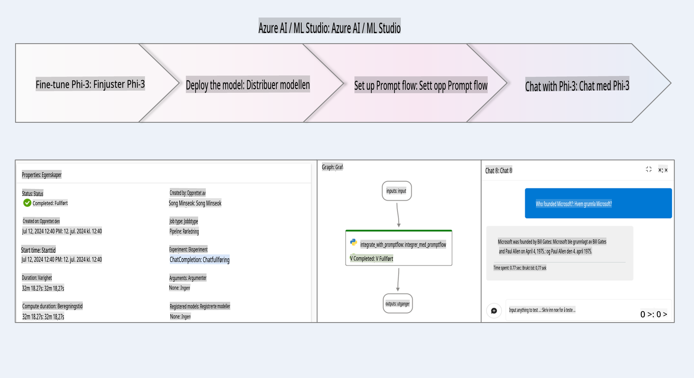

### Innholdsfortegnelse

1. **[Scenario 1: Sett opp Azure-ressurser og forbered deg på finjustering](../../../../../../md/02.Application/01.TextAndChat/Phi3)**
    - [Opprett et Azure Machine Learning Workspace](../../../../../../md/02.Application/01.TextAndChat/Phi3)
    - [Be om GPU-kvoter i Azure-abonnement](../../../../../../md/02.Application/01.TextAndChat/Phi3)
    - [Legg til rolletilordning](../../../../../../md/02.Application/01.TextAndChat/Phi3)
    - [Sett opp prosjekt](../../../../../../md/02.Application/01.TextAndChat/Phi3)
    - [Forbered datasett for finjustering](../../../../../../md/02.Application/01.TextAndChat/Phi3)

1. **[Scenario 2: Finjuster Phi-3-modellen og distribuer i Azure Machine Learning Studio](../../../../../../md/02.Application/01.TextAndChat/Phi3)**
    - [Finjuster Phi-3-modellen](../../../../../../md/02.Application/01.TextAndChat/Phi3)
    - [Distribuer den finjusterte Phi-3-modellen](../../../../../../md/02.Application/01.TextAndChat/Phi3)

1. **[Scenario 3: Integrer med Prompt Flow og samtal med din tilpassede modell i Azure AI Foundry](../../../../../../md/02.Application/01.TextAndChat/Phi3)**
    - [Integrer den tilpassede Phi-3-modellen med Prompt Flow](../../../../../../md/02.Application/01.TextAndChat/Phi3)
    - [Samtal med din tilpassede Phi-3-modell](../../../../../../md/02.Application/01.TextAndChat/Phi3)

## Scenario 1: Sett opp Azure-ressurser og forbered deg på finjustering

### Opprett et Azure Machine Learning Workspace

1. Skriv *azure machine learning* i **søkelinjen** øverst på portalens side og velg **Azure Machine Learning** fra alternativene som vises.

    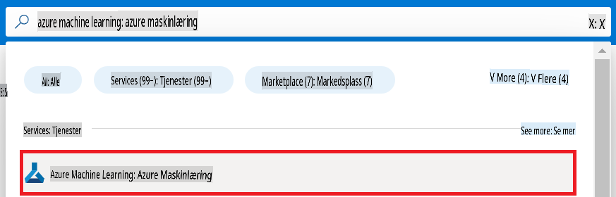

2. Velg **+ Opprett** fra navigasjonsmenyen.

3. Velg **Nytt arbeidsområde** fra navigasjonsmenyen.

    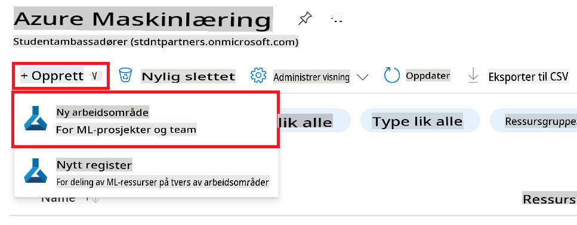

4. Utfør følgende oppgaver:

    - Velg ditt Azure **Abonnement**.
    - Velg **Ressursgruppe** som skal brukes (opprett en ny om nødvendig).
    - Angi **Arbeidsområdenavn**. Det må være en unik verdi.
    - Velg **Regionen** du ønsker å bruke.
    - Velg **Lagringskonto** som skal brukes (opprett en ny om nødvendig).
    - Velg **Key vault** som skal brukes (opprett en ny om nødvendig).
    - Velg **Application insights** som skal brukes (opprett en ny om nødvendig).
    - Velg **Container registry** som skal brukes (opprett en ny om nødvendig).

    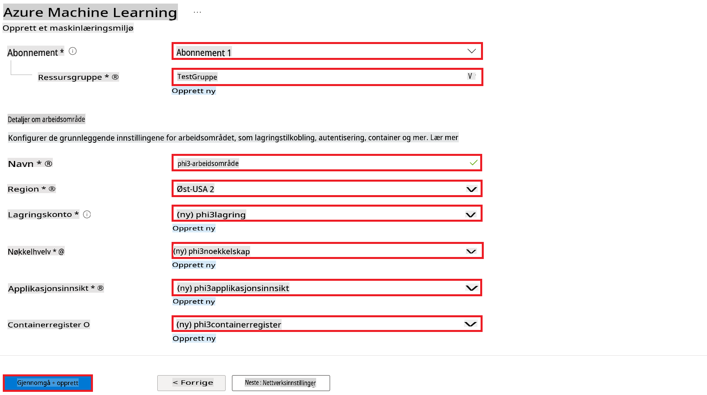

5. Velg **Gjennomgå + Opprett**.

6. Velg **Opprett**.

### Be om GPU-kvoter i Azure-abonnement

I denne opplæringen vil du lære hvordan du finjusterer og distribuerer en Phi-3-modell ved hjelp av GPU-er. For finjustering vil du bruke *Standard_NC24ads_A100_v4*-GPU, som krever en kvoteforespørsel. For distribusjon vil du bruke *Standard_NC6s_v3*-GPU, som også krever en kvoteforespørsel.

> [!NOTE]
>
> Bare Pay-As-You-Go-abonnementer (standard abonnementstype) er kvalifisert for GPU-allokering; fordelsabonnementer støttes for øyeblikket ikke.

1. Gå til [Azure ML Studio](https://ml.azure.com/home?wt.mc_id=studentamb_279723).

1. Utfør følgende oppgaver for å be om *Standard NCADSA100v4 Family*-kvote:

    - Velg **Kvote** fra venstre sidemeny.
    - Velg **Virtuell maskinfamilie** som skal brukes. For eksempel velg **Standard NCADSA100v4 Family Cluster Dedicated vCPUs**, som inkluderer *Standard_NC24ads_A100_v4*-GPU.
    - Velg **Be om kvote** fra navigasjonsmenyen.

        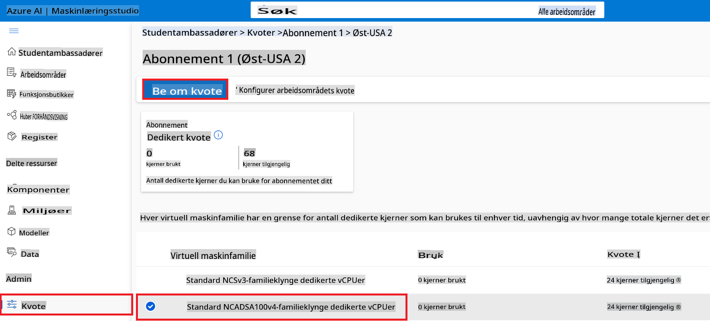

    - På siden for kvoteforespørsel, skriv inn **Ny kjernegrense** du ønsker å bruke. For eksempel 24.
    - På siden for kvoteforespørsel, velg **Send inn** for å be om GPU-kvoten.

1. Utfør følgende oppgaver for å be om *Standard NCSv3 Family*-kvote:

    - Velg **Kvote** fra venstre sidemeny.
    - Velg **Virtuell maskinfamilie** som skal brukes. For eksempel velg **Standard NCSv3 Family Cluster Dedicated vCPUs**, som inkluderer *Standard_NC6s_v3*-GPU.
    - Velg **Be om kvote** fra navigasjonsmenyen.
    - På siden for kvoteforespørsel, skriv inn **Ny kjernegrense** du ønsker å bruke. For eksempel 24.
    - På siden for kvoteforespørsel, velg **Send inn** for å be om GPU-kvoten.

### Legg til rolletilordning

For å finjustere og distribuere modellene dine må du først opprette en Bruker Tilordnet Administrert Identitet (UAI) og tildele den nødvendige tillatelser. Denne UAI-en vil bli brukt til autentisering under distribusjonen.

#### Opprett Bruker Tilordnet Administrert Identitet (UAI)

1. Skriv *managed identities* i **søkelinjen** øverst på portalens side og velg **Managed Identities** fra alternativene som vises.

    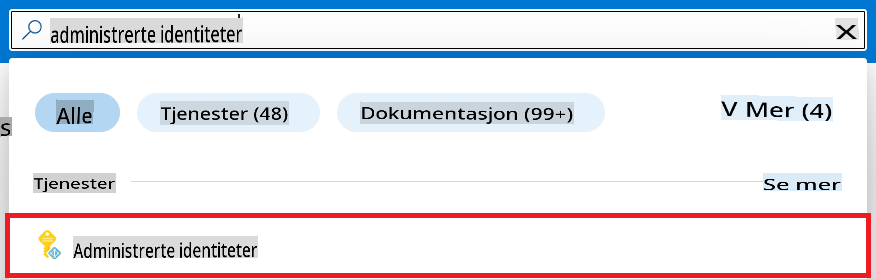

1. Velg **+ Opprett**.

    

1. Utfør følgende oppgaver:

    - Velg ditt Azure **Abonnement**.
    - Velg **Ressursgruppe** som skal brukes (opprett en ny om nødvendig).
    - Velg **Regionen** du ønsker å bruke.
    - Angi **Navn**. Det må være en unik verdi.

    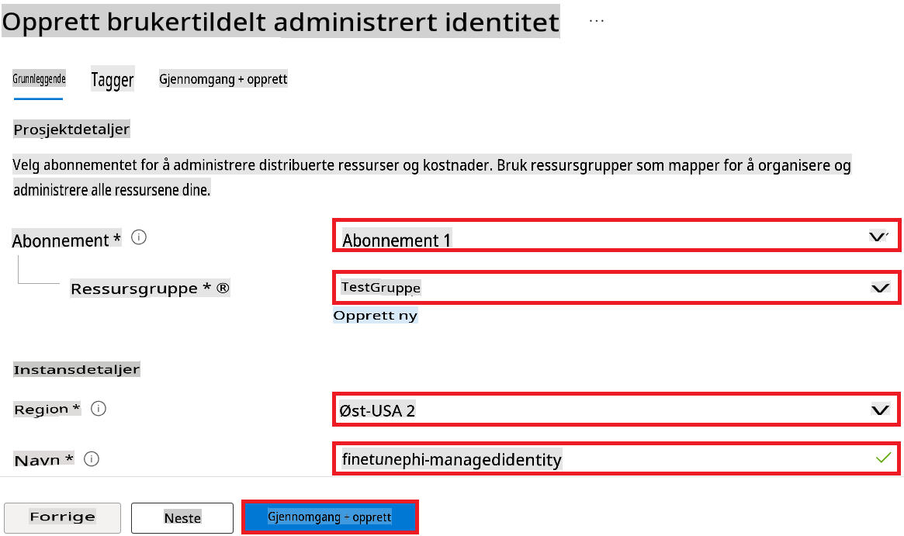

1. Velg **Gjennomgå + opprett**.

1. Velg **+ Opprett**.

#### Legg til Contributor-rolletilordning til Administrert Identitet

1. Naviger til ressursen for Administrert Identitet som du opprettet.

1. Velg **Azure rolletilordninger** fra venstre sidemeny.

1. Velg **+Legg til rolletilordning** fra navigasjonsmenyen.

1. På siden for Legg til rolletilordning, utfør følgende oppgaver:
    - Velg **Omfang** til **Ressursgruppe**.
    - Velg ditt Azure **Abonnement**.
    - Velg **Ressursgruppe** som skal brukes.
    - Velg **Rolle** til **Contributor**.

    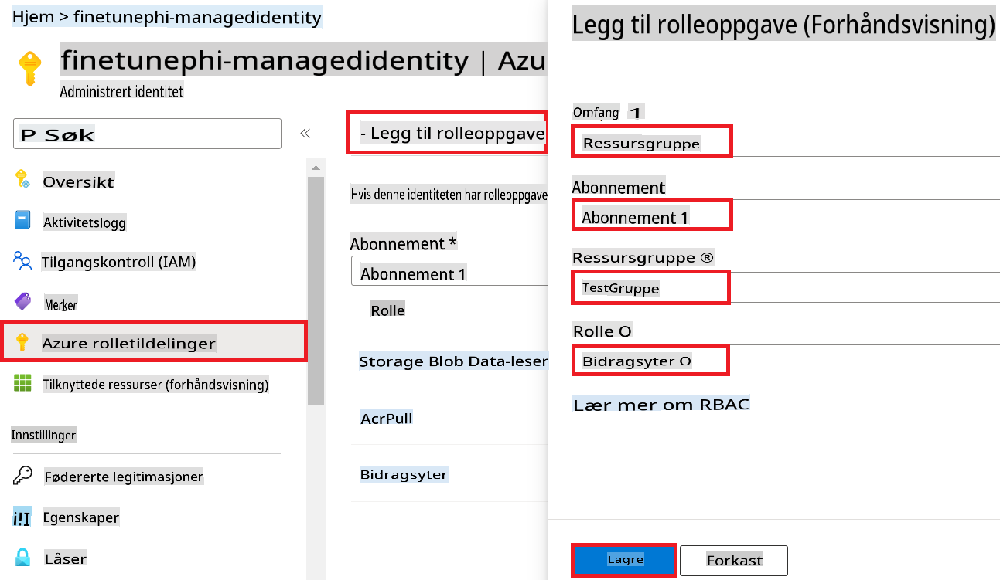

2. Velg **Lagre**.

#### Legg til Storage Blob Data Reader-rolletilordning til Administrert Identitet

1. Skriv *storage accounts* i **søkelinjen** øverst på portalens side og velg **Storage accounts** fra alternativene som vises.

    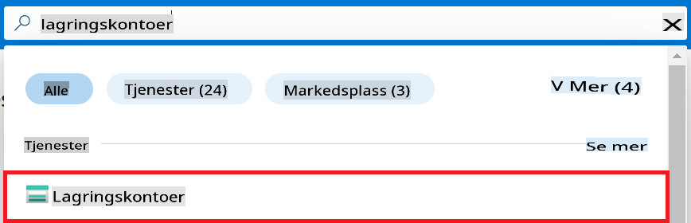

1. Velg lagringskontoen som er tilknyttet Azure Machine Learning-arbeidsområdet du opprettet. For eksempel *finetunephistorage*.

1. Utfør følgende oppgaver for å navigere til Legg til rolletilordning-siden:

    - Naviger til Azure Storage-kontoen som du opprettet.
    - Velg **Tilgangskontroll (IAM)** fra venstre sidemeny.
    - Velg **+ Legg til** fra navigasjonsmenyen.
    - Velg **Legg til rolletilordning** fra navigasjonsmenyen.

    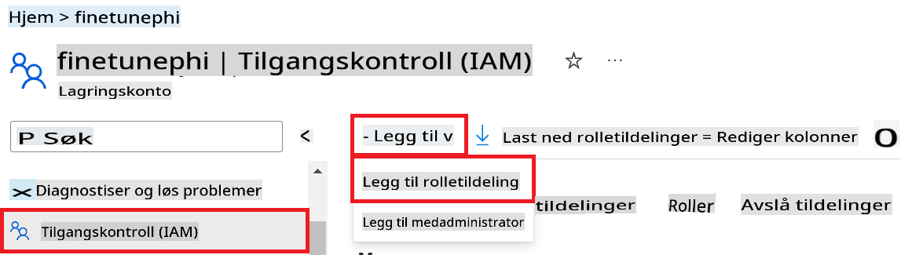

1. På siden for Legg til rolletilordning, utfør følgende oppgaver:

    - På Rolle-siden, skriv *Storage Blob Data Reader* i **søkelinjen** og velg **Storage Blob Data Reader** fra alternativene som vises.
    - På Rolle-siden, velg **Neste**.
    - På Medlemmer-siden, velg **Tildel tilgang til** **Administrert identitet**.
    - På Medlemmer-siden, velg **+ Velg medlemmer**.
    - På Velg administrerte identiteter-siden, velg ditt Azure **Abonnement**.
    - På Velg administrerte identiteter-siden, velg **Administrert identitet** til **Administrer Identitet**.
    - På Velg administrerte identiteter-siden, velg den Administrerte Identiteten du opprettet. For eksempel *finetunephi-managedidentity*.
    - På Velg administrerte identiteter-siden, velg **Velg**.

    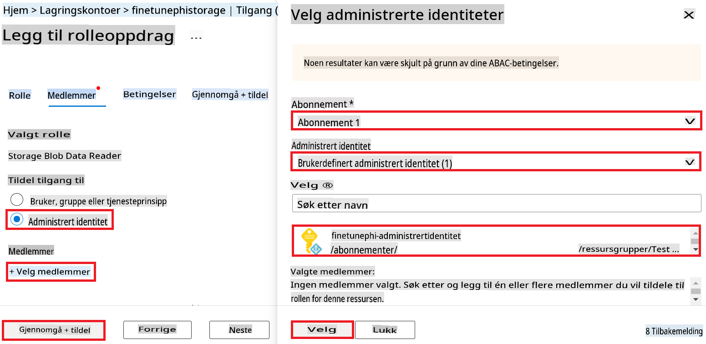

1. Velg **Gjennomgå + tildel**.

#### Legg til AcrPull-rolletilordning til Administrert Identitet

1. Skriv *container registries* i **søkelinjen** øverst på portalens side og velg **Container registries** fra alternativene som vises.

    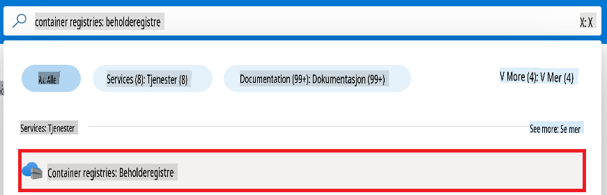

1. Velg containerregisteret som er tilknyttet Azure Machine Learning-arbeidsområdet. For eksempel *finetunephicontainerregistry*.

1. Utfør følgende oppgaver for å navigere til Legg til rolletilordning-siden:

    - Velg **Tilgangskontroll (IAM)** fra venstre sidemeny.
    - Velg **+ Legg til** fra navigasjonsmenyen.
    - Velg **Legg til rolletilordning** fra navigasjonsmenyen.

1. På siden for Legg til rolletilordning, utfør følgende oppgaver:

    - På Rolle-siden, skriv *AcrPull* i **søkelinjen** og velg **AcrPull** fra alternativene som vises.
    - På Rolle-siden, velg **Neste**.
    - På Medlemmer-siden, velg **Tildel tilgang til** **Administrert identitet**.
    - På Medlemmer-siden, velg **+ Velg medlemmer**.
    - På Velg administrerte identiteter-siden, velg ditt Azure **Abonnement**.
    - På Velg administrerte identiteter-siden, velg **Administrert identitet** til **Administrer Identitet**.
    - På Velg administrerte identiteter-siden, velg den Administrerte Identiteten du opprettet. For eksempel *finetunephi-managedidentity*.
    - På Velg administrerte identiteter-siden, velg **Velg**.
    - Velg **Gjennomgå + tildel**.

### Sett opp prosjekt

For å laste ned datasettene som trengs for finjustering, må du sette opp et lokalt miljø.

I denne øvelsen vil du:

- Opprette en mappe å arbeide i.
- Opprette et virtuelt miljø.
- Installere nødvendige pakker.
- Opprette en *download_dataset.py*-fil for å laste ned datasettet.

#### Opprett en mappe å arbeide i

1. Åpne et terminalvindu og skriv følgende kommando for å opprette en mappe kalt *finetune-phi* i standardstien.

    ```console
    mkdir finetune-phi
    ```

2. Skriv følgende kommando i terminalen for å navigere til *finetune-phi*-mappen du opprettet.

    ```console
    cd finetune-phi
    ```

#### Opprett et virtuelt miljø

1. Skriv følgende kommando i terminalen for å opprette et virtuelt miljø kalt *.venv*.

    ```console
    python -m venv .venv
    ```

2. Skriv følgende kommando i terminalen for å aktivere det virtuelle miljøet.

    ```console
    .venv\Scripts\activate.bat
    ```

> [!NOTE]
> Hvis det fungerte, skal du se *(.venv)* foran kommandoprompten.

#### Installer nødvendige pakker

1. Skriv følgende kommandoer i terminalen for å installere nødvendige pakker.

    ```console
    pip install datasets==2.19.1
    ```

#### Opprett `download_dataset.py`

> [!NOTE]
> Komplett mappeoversikt:
>
> ```text
> └── YourUserName
> .    └── finetune-phi
> .        └── download_dataset.py
> ```

1. Åpne **Visual Studio Code**.

1. Velg **Fil** fra menylinjen.

1. Velg **Åpne mappe**.

1. Velg *finetune-phi*-mappen du opprettet, som ligger på *C:\Users\yourUserName\finetune-phi*.

    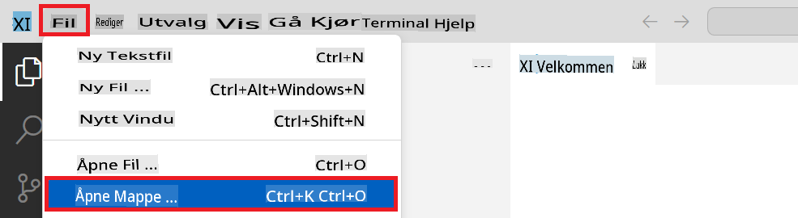

1. I venstre panel i Visual Studio Code, høyreklikk og velg **Ny fil** for å opprette en ny fil kalt *download_dataset.py*.

    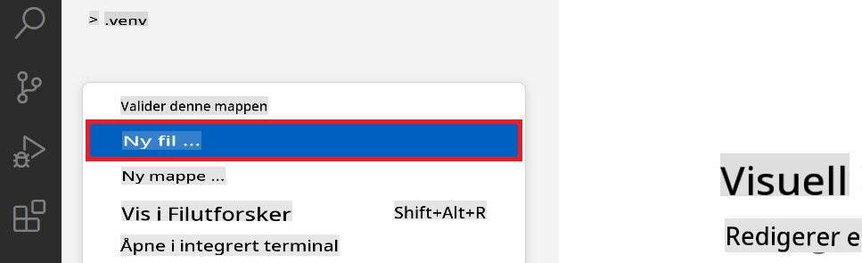

### Forbered datasett for finjustering

I denne øvelsen vil du kjøre *download_dataset.py*-filen for å laste ned *ultrachat_200k*-datasett til ditt lokale miljø. Deretter vil du bruke dette datasettet til å finjustere Phi-3-modellen i Azure Machine Learning.

I denne øvelsen vil du:

- Legge til kode i *download_dataset.py*-filen for å laste ned datasettet.
- Kjøre *download_dataset.py*-filen for å laste ned datasettet til ditt lokale miljø.

#### Last ned datasettet ditt med *download_dataset.py*

1. Åpne *download_dataset.py*-filen i Visual Studio Code.

1. Legg til følgende kode i *download_dataset.py*-filen.

    ```python
    import json
    import os
    from datasets import load_dataset

    def load_and_split_dataset(dataset_name, config_name, split_ratio):
        """
        Load and split a dataset.
        """
        # Load the dataset with the specified name, configuration, and split ratio
        dataset = load_dataset(dataset_name, config_name, split=split_ratio)
        print(f"Original dataset size: {len(dataset)}")
        
        # Split the dataset into train and test sets (80% train, 20% test)
        split_dataset = dataset.train_test_split(test_size=0.2)
        print(f"Train dataset size: {len(split_dataset['train'])}")
        print(f"Test dataset size: {len(split_dataset['test'])}")
        
        return split_dataset

    def save_dataset_to_jsonl(dataset, filepath):
        """
        Save a dataset to a JSONL file.
        """
        # Create the directory if it does not exist
        os.makedirs(os.path.dirname(filepath), exist_ok=True)
        
        # Open the file in write mode
        with open(filepath, 'w', encoding='utf-8') as f:
            # Iterate over each record in the dataset
            for record in dataset:
                # Dump the record as a JSON object and write it to the file
                json.dump(record, f)
                # Write a newline character to separate records
                f.write('\n')
        
        print(f"Dataset saved to {filepath}")

    def main():
        """
        Main function to load, split, and save the dataset.
        """
        # Load and split the ULTRACHAT_200k dataset with a specific configuration and split ratio
        dataset = load_and_split_dataset("HuggingFaceH4/ultrachat_200k", 'default', 'train_sft[:1%]')
        
        # Extract the train and test datasets from the split
        train_dataset = dataset['train']
        test_dataset = dataset['test']

        # Save the train dataset to a JSONL file
        save_dataset_to_jsonl(train_dataset, "data/train_data.jsonl")
        
        # Save the test dataset to a separate JSONL file
        save_dataset_to_jsonl(test_dataset, "data/test_data.jsonl")

    if __name__ == "__main__":
        main()

    ```

1. Skriv følgende kommando i terminalen for å kjøre skriptet og laste ned datasettet til ditt lokale miljø.

    ```console
    python download_dataset.py
    ```

1. Bekreft at datasettet ble lagret vellykket i din lokale *finetune-phi/data*-mappe.

> [!NOTE]
>
> #### Merknad om datasettstørrelse og tid for finjustering
>
> I denne opplæringen bruker du bare 1 % av datasettet (`split='train[:1%]'`). Dette reduserer betydelig mengden data og fremskynder både opplastings- og finjusteringsprosessene. Du kan justere prosentandelen for å finne den rette balansen mellom treningstid og modellens ytelse. Å bruke
1. Besøk [Azure ML Studio](https://ml.azure.com/home?wt.mc_id=studentamb_279723).

1. Velg **Compute** fra menyen på venstre side.

1. Velg **Compute clusters** fra navigasjonsmenyen.

1. Velg **+ New**.

    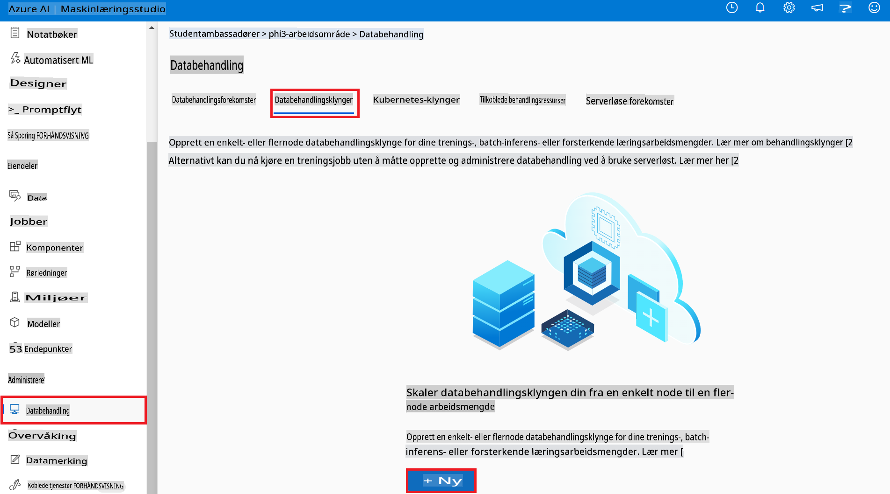

1. Utfør følgende oppgaver:

    - Velg **Region** du ønsker å bruke.
    - Velg **Virtual machine tier** som **Dedicated**.
    - Velg **Virtual machine type** som **GPU**.
    - Velg **Virtual machine size** filteret til **Select from all options**.
    - Velg **Virtual machine size** som **Standard_NC24ads_A100_v4**.

    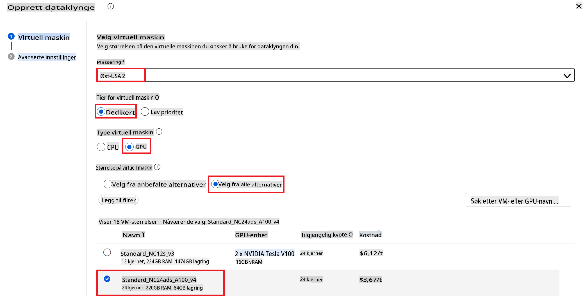

1. Velg **Next**.

1. Utfør følgende oppgaver:

    - Skriv inn **Compute name**. Dette må være en unik verdi.
    - Sett **Minimum number of nodes** til **0**.
    - Sett **Maximum number of nodes** til **1**.
    - Sett **Idle seconds before scale down** til **120**.

    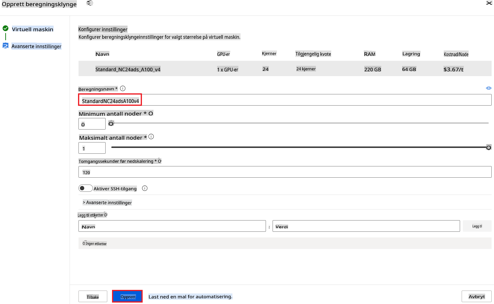

1. Velg **Create**.

#### Finjuster Phi-3-modellen

1. Besøk [Azure ML Studio](https://ml.azure.com/home?wt.mc_id=studentamb_279723).

1. Velg Azure Machine Learning-arbeidsområdet du opprettet.

    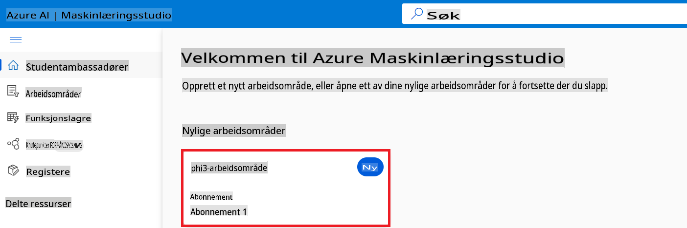

1. Utfør følgende oppgaver:

    - Velg **Model catalog** fra menyen på venstre side.
    - Skriv *phi-3-mini-4k* i **søkefeltet** og velg **Phi-3-mini-4k-instruct** fra alternativene som dukker opp.

    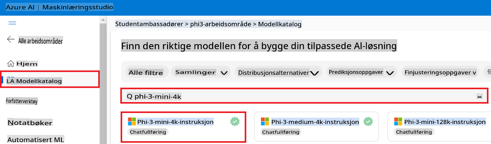

1. Velg **Fine-tune** fra navigasjonsmenyen.

    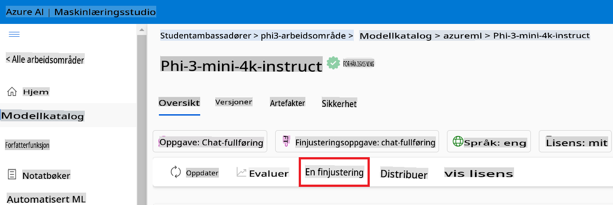

1. Utfør følgende oppgaver:

    - Velg **Select task type** som **Chat completion**.
    - Velg **+ Select data** for å laste opp **Traning data**.
    - Velg valideringsdatatypen til **Provide different validation data**.
    - Velg **+ Select data** for å laste opp **Validation data**.

    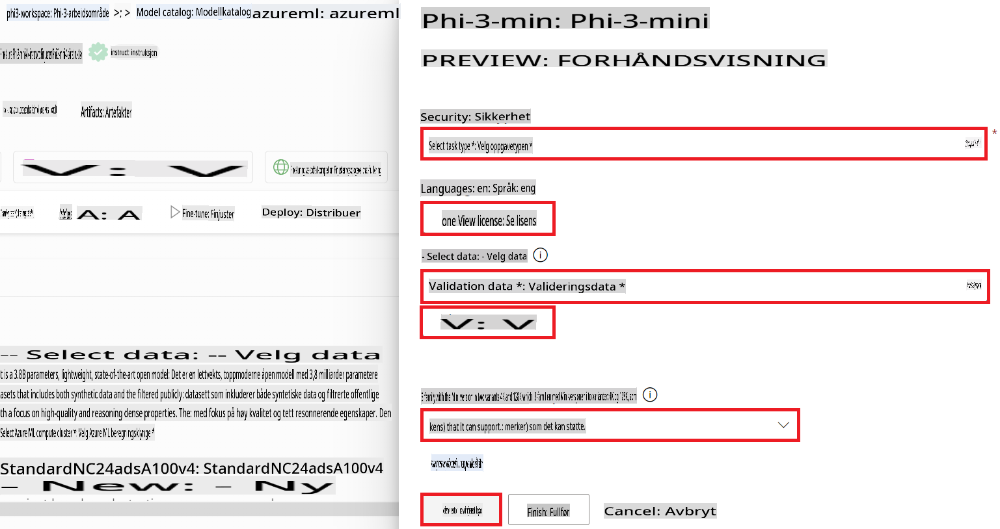

    > [!TIP]
    >
    > Du kan velge **Advanced settings** for å tilpasse konfigurasjoner som **learning_rate** og **lr_scheduler_type** for å optimalisere finjusteringsprosessen etter dine spesifikke behov.

1. Velg **Finish**.

1. I denne øvelsen har du med hell finjustert Phi-3-modellen ved hjelp av Azure Machine Learning. Vær oppmerksom på at finjusteringsprosessen kan ta betydelig tid. Etter å ha startet finjusteringsjobben, må du vente til den er fullført. Du kan overvåke statusen til finjusteringsjobben ved å navigere til Jobs-fanen på venstre side av ditt Azure Machine Learning-arbeidsområde. I neste serie vil du distribuere den finjusterte modellen og integrere den med Prompt flow.

    

### Distribuer den finjusterte Phi-3-modellen

For å integrere den finjusterte Phi-3-modellen med Prompt flow, må du distribuere modellen for å gjøre den tilgjengelig for sanntidsinfernser. Denne prosessen innebærer å registrere modellen, opprette et online endepunkt og distribuere modellen.

I denne øvelsen vil du:

- Registrere den finjusterte modellen i Azure Machine Learning-arbeidsområdet.
- Opprette et online endepunkt.
- Distribuere den registrerte finjusterte Phi-3-modellen.

#### Registrer den finjusterte modellen

1. Besøk [Azure ML Studio](https://ml.azure.com/home?wt.mc_id=studentamb_279723).

1. Velg Azure Machine Learning-arbeidsområdet du opprettet.

    

1. Velg **Models** fra menyen på venstre side.
1. Velg **+ Register**.
1. Velg **From a job output**.

    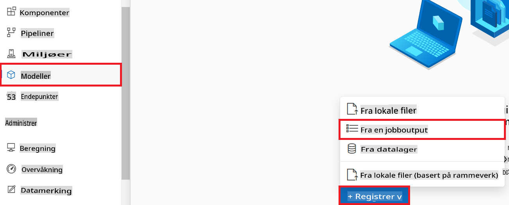

1. Velg jobben du opprettet.

    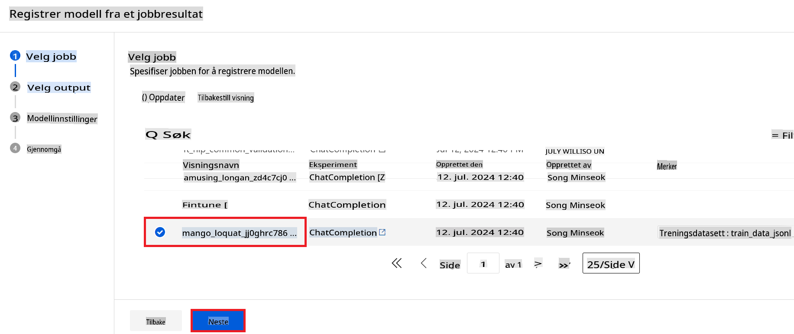

1. Velg **Next**.

1. Velg **Model type** som **MLflow**.

1. Sørg for at **Job output** er valgt; dette bør velges automatisk.

    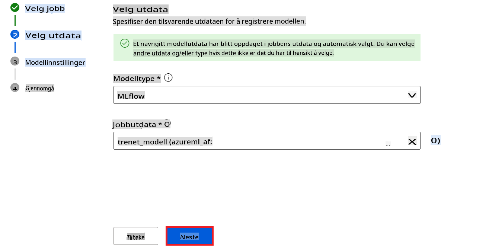

2. Velg **Next**.

3. Velg **Register**.

    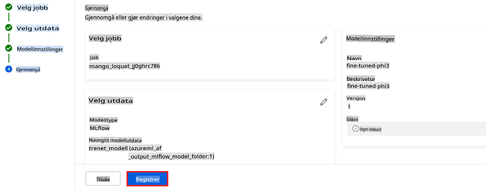

4. Du kan se din registrerte modell ved å navigere til **Models**-menyen fra venstre side.

    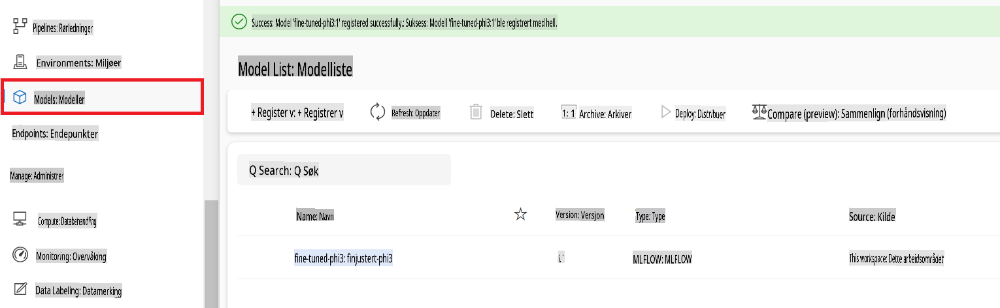

#### Distribuer den finjusterte modellen

1. Naviger til Azure Machine Learning-arbeidsområdet du opprettet.

1. Velg **Endpoints** fra menyen på venstre side.

1. Velg **Real-time endpoints** fra navigasjonsmenyen.

    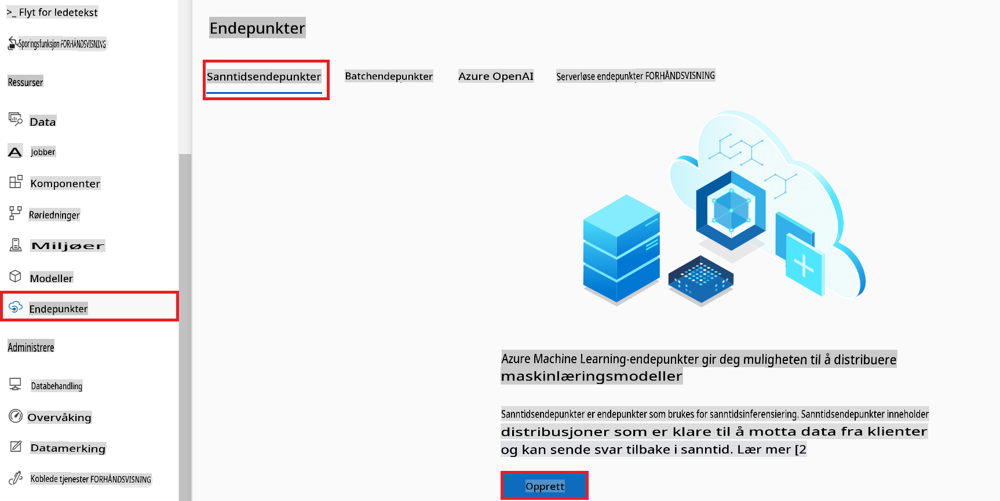

1. Velg **Create**.

1. Velg den registrerte modellen du opprettet.

    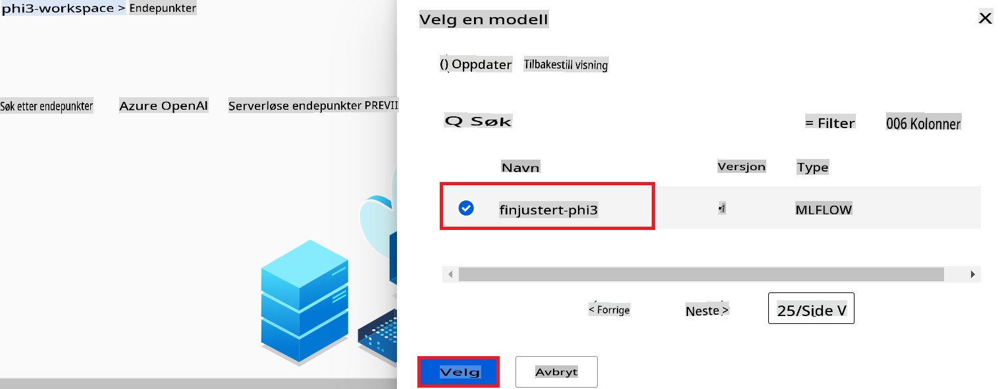

1. Velg **Select**.

1. Utfør følgende oppgaver:

    - Velg **Virtual machine** som *Standard_NC6s_v3*.
    - Velg **Instance count** du ønsker å bruke. For eksempel, *1*.
    - Velg **Endpoint** til **New** for å opprette et nytt endepunkt.
    - Skriv inn **Endpoint name**. Dette må være en unik verdi.
    - Skriv inn **Deployment name**. Dette må være en unik verdi.

    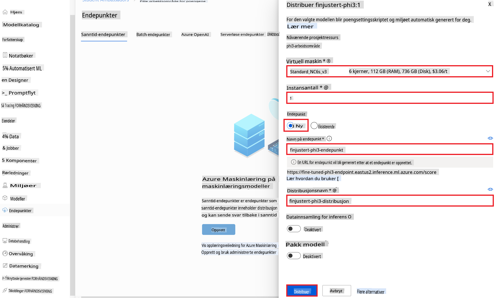

1. Velg **Deploy**.

> [!WARNING]
> For å unngå ekstra kostnader på kontoen din, sørg for å slette det opprettede endepunktet i Azure Machine Learning-arbeidsområdet.
>

#### Sjekk distribusjonsstatus i Azure Machine Learning-arbeidsområdet

1. Naviger til Azure Machine Learning-arbeidsområdet du opprettet.

1. Velg **Endpoints** fra menyen på venstre side.

1. Velg endepunktet du opprettet.

    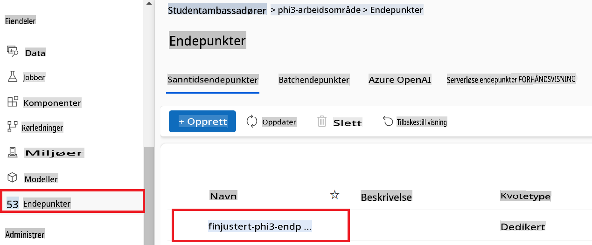

1. På denne siden kan du administrere endepunktene under distribusjonsprosessen.

> [!NOTE]
> Når distribusjonen er fullført, sørg for at **Live traffic** er satt til **100%**. Hvis det ikke er det, velg **Update traffic** for å justere trafikkinnstillingene. Merk at du ikke kan teste modellen hvis trafikken er satt til 0%.
>
> 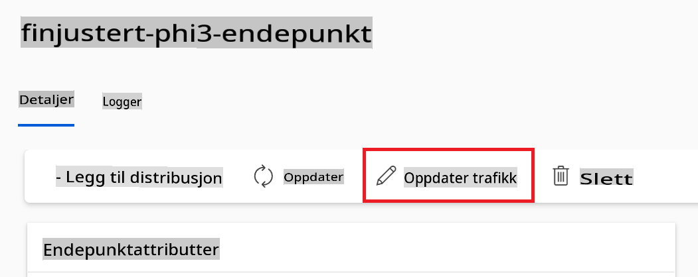
>

## Scenario 3: Integrer med Prompt flow og chat med din tilpassede modell i Azure AI Foundry

### Integrer den tilpassede Phi-3-modellen med Prompt flow

Etter å ha distribuert din finjusterte modell, kan du nå integrere den med Prompt flow for å bruke modellen i sanntidsapplikasjoner, noe som muliggjør en rekke interaktive oppgaver med din tilpassede Phi-3-modell.

I denne øvelsen vil du:

- Opprette Azure AI Foundry Hub.
- Opprette Azure AI Foundry Project.
- Opprette Prompt flow.
- Legge til en tilpasset tilkobling for den finjusterte Phi-3-modellen.
- Sette opp Prompt flow for å chatte med din tilpassede Phi-3-modell.

> [!NOTE]
> Du kan også integrere med Prompt flow ved hjelp av Azure ML Studio. Den samme integrasjonsprosessen kan brukes i Azure ML Studio.

#### Opprett Azure AI Foundry Hub

Du må opprette en Hub før du oppretter prosjektet. En Hub fungerer som en Resource Group, som lar deg organisere og administrere flere prosjekter innen Azure AI Foundry.

1. Besøk [Azure AI Foundry](https://ai.azure.com/?WT.mc_id=aiml-137032-kinfeylo).

1. Velg **All hubs** fra menyen på venstre side.

1. Velg **+ New hub** fra navigasjonsmenyen.

    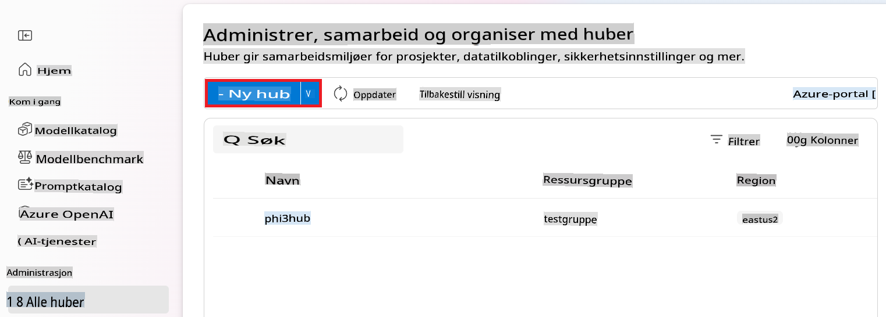

1. Utfør følgende oppgaver:

    - Skriv inn **Hub name**. Dette må være en unik verdi.
    - Velg din Azure **Subscription**.
    - Velg **Resource group** du vil bruke (opprett en ny om nødvendig).
    - Velg **Location** du ønsker å bruke.
    - Velg **Connect Azure AI Services** du vil bruke (opprett en ny om nødvendig).
    - Velg **Connect Azure AI Search** til **Skip connecting**.

    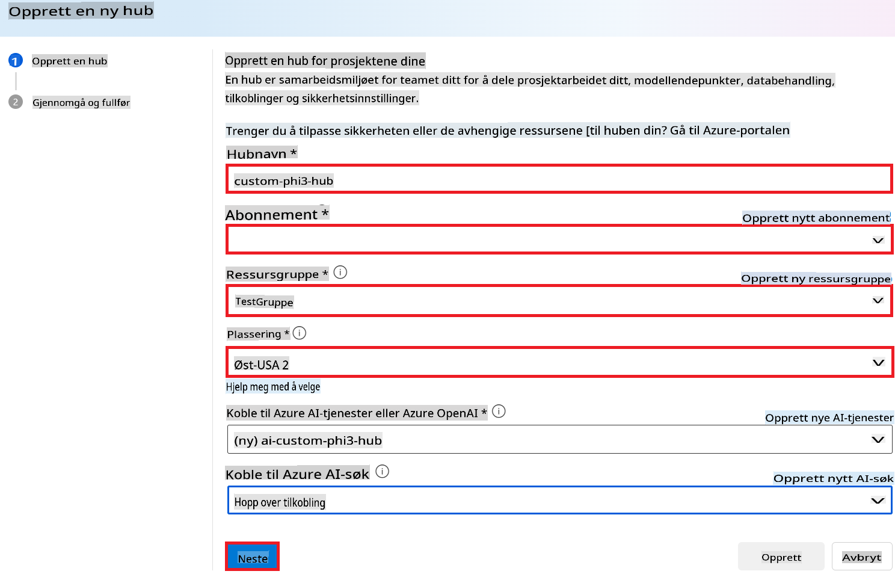

1. Velg **Next**.

#### Opprett Azure AI Foundry Project

1. I Hub-en du opprettet, velg **All projects** fra menyen på venstre side.

1. Velg **+ New project** fra navigasjonsmenyen.

    

1. Skriv inn **Project name**. Dette må være en unik verdi.

    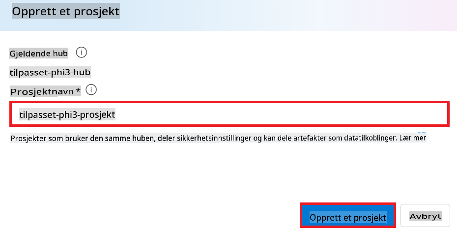

1. Velg **Create a project**.

#### Legg til en tilpasset tilkobling for den finjusterte Phi-3-modellen

For å integrere din tilpassede Phi-3-modell med Prompt flow, må du lagre modellens endepunkt og nøkkel i en tilpasset tilkobling. Denne oppsettet sikrer tilgang til din tilpassede Phi-3-modell i Prompt flow.

#### Sett API-nøkkel og endepunkt-URI for den finjusterte Phi-3-modellen

1. Besøk [Azure ML Studio](https://ml.azure.com/home?WT.mc_id=aiml-137032-kinfeylo).

1. Naviger til Azure Machine Learning-arbeidsområdet du opprettet.

1. Velg **Endpoints** fra menyen på venstre side.

    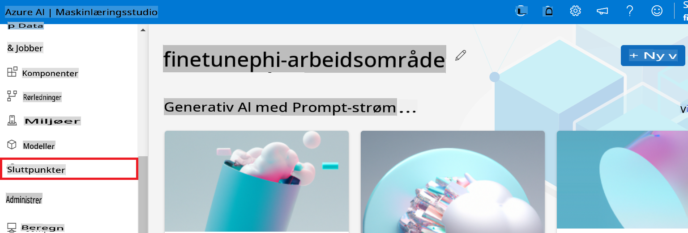

1. Velg endepunktet du opprettet.

    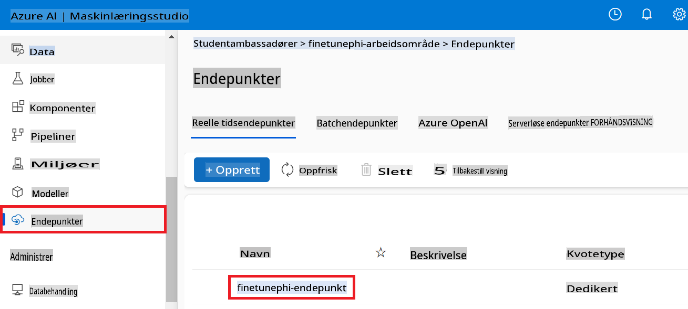

1. Velg **Consume** fra navigasjonsmenyen.

1. Kopier din **REST endpoint** og **Primary key**.
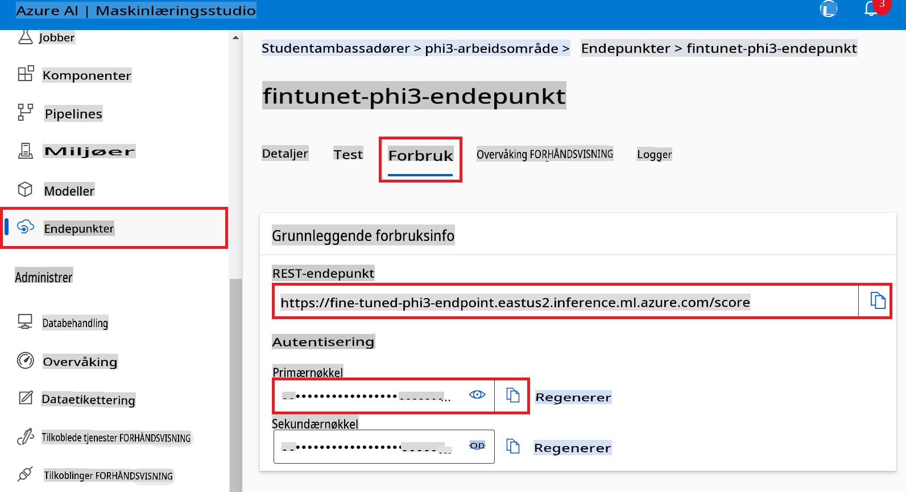

#### Legg til den tilpassede tilkoblingen

1. Gå til [Azure AI Foundry](https://ai.azure.com/?WT.mc_id=aiml-137032-kinfeylo).

1. Naviger til Azure AI Foundry-prosjektet du opprettet.

1. I prosjektet du opprettet, velg **Innstillinger** fra menyen til venstre.

1. Velg **+ Ny tilkobling**.

    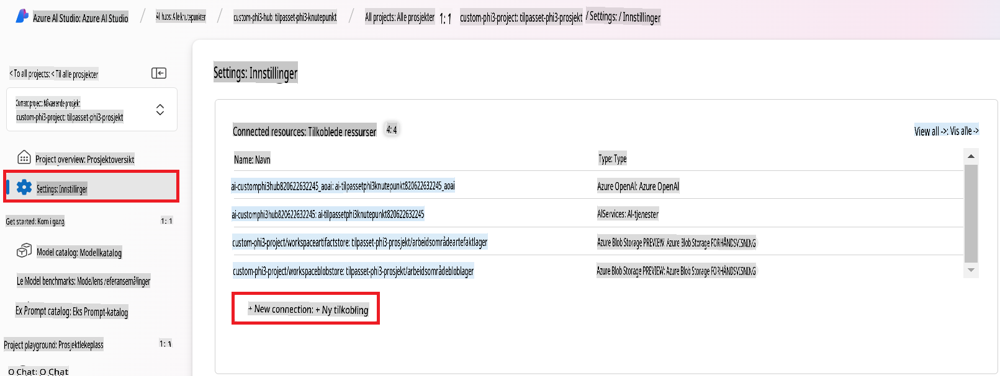

1. Velg **Tilpassede nøkler** fra navigasjonsmenyen.

    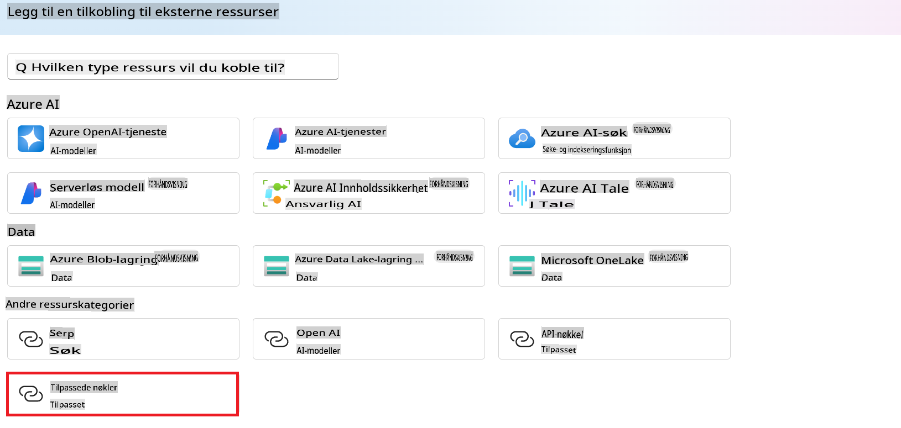

1. Utfør følgende oppgaver:

    - Velg **+ Legg til nøkkel-verdi-par**.
    - For nøkkelnavnet, skriv **endpoint** og lim inn endepunktet du kopierte fra Azure ML Studio i verdifeltet.
    - Velg **+ Legg til nøkkel-verdi-par** igjen.
    - For nøkkelnavnet, skriv **key** og lim inn nøkkelen du kopierte fra Azure ML Studio i verdifeltet.
    - Etter at nøklene er lagt til, velg **er hemmelig** for å hindre at nøkkelen blir eksponert.

    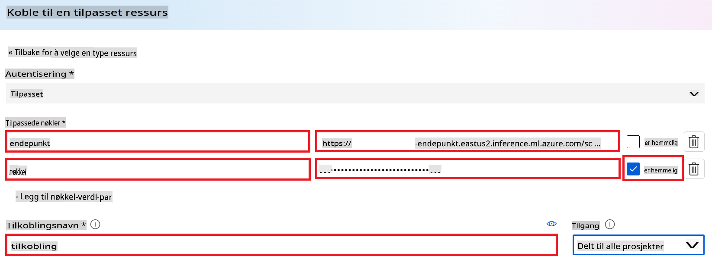

1. Velg **Legg til tilkobling**.

#### Opprett Prompt flow

Du har lagt til en tilpasset tilkobling i Azure AI Foundry. Nå skal vi opprette en Prompt flow ved hjelp av følgende trinn. Deretter kobler du denne Prompt flow til den tilpassede tilkoblingen slik at du kan bruke den finjusterte modellen i Prompt flow.

1. Naviger til Azure AI Foundry-prosjektet du opprettet.

1. Velg **Prompt flow** fra menyen til venstre.

1. Velg **+ Opprett** fra navigasjonsmenyen.

    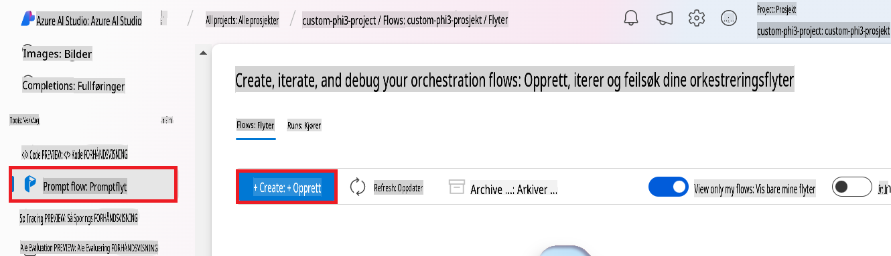

1. Velg **Chat flow** fra navigasjonsmenyen.

    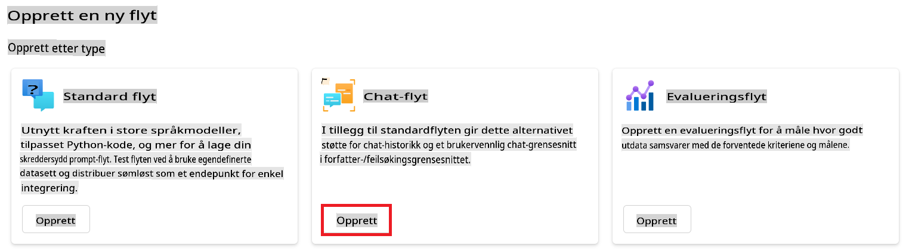

1. Angi **Mappenavn** som skal brukes.

    

2. Velg **Opprett**.

#### Sett opp Prompt flow for å chatte med din tilpassede Phi-3-modell

Du må integrere den finjusterte Phi-3-modellen i en Prompt flow. Men den eksisterende Prompt flow som tilbys er ikke designet for dette formålet. Derfor må du redesigne Prompt flow for å muliggjøre integrasjon av den tilpassede modellen.

1. I Prompt flow, utfør følgende oppgaver for å bygge om den eksisterende flyten:

    - Velg **Råfilmodus**.
    - Slett all eksisterende kode i *flow.dag.yml*-filen.
    - Legg til følgende kode i *flow.dag.yml*-filen.

        ```yml
        inputs:
          input_data:
            type: string
            default: "Who founded Microsoft?"

        outputs:
          answer:
            type: string
            reference: ${integrate_with_promptflow.output}

        nodes:
        - name: integrate_with_promptflow
          type: python
          source:
            type: code
            path: integrate_with_promptflow.py
          inputs:
            input_data: ${inputs.input_data}
        ```

    - Velg **Lagre**.

    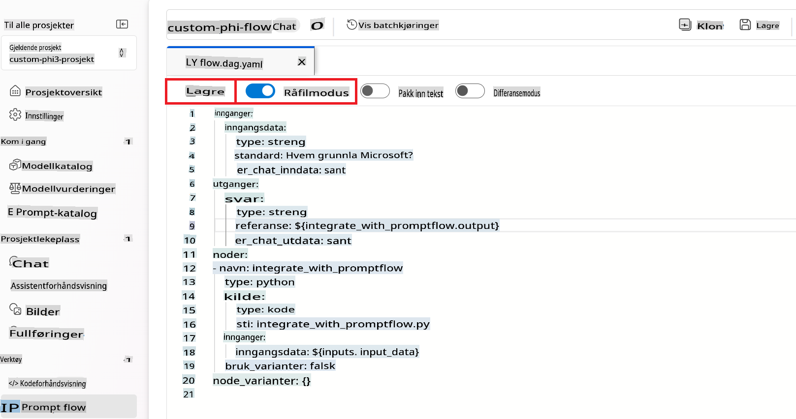

1. Legg til følgende kode i *integrate_with_promptflow.py*-filen for å bruke den tilpassede Phi-3-modellen i Prompt flow.

    ```python
    import logging
    import requests
    from promptflow import tool
    from promptflow.connections import CustomConnection

    # Logging setup
    logging.basicConfig(
        format="%(asctime)s - %(levelname)s - %(name)s - %(message)s",
        datefmt="%Y-%m-%d %H:%M:%S",
        level=logging.DEBUG
    )
    logger = logging.getLogger(__name__)

    def query_phi3_model(input_data: str, connection: CustomConnection) -> str:
        """
        Send a request to the Phi-3 model endpoint with the given input data using Custom Connection.
        """

        # "connection" is the name of the Custom Connection, "endpoint", "key" are the keys in the Custom Connection
        endpoint_url = connection.endpoint
        api_key = connection.key

        headers = {
            "Content-Type": "application/json",
            "Authorization": f"Bearer {api_key}"
        }
        data = {
            "input_data": {
                "input_string": [
                    {"role": "user", "content": input_data}
                ],
                "parameters": {
                    "temperature": 0.7,
                    "max_new_tokens": 128
                }
            }
        }
        try:
            response = requests.post(endpoint_url, json=data, headers=headers)
            response.raise_for_status()
            
            # Log the full JSON response
            logger.debug(f"Full JSON response: {response.json()}")

            result = response.json()["output"]
            logger.info("Successfully received response from Azure ML Endpoint.")
            return result
        except requests.exceptions.RequestException as e:
            logger.error(f"Error querying Azure ML Endpoint: {e}")
            raise

    @tool
    def my_python_tool(input_data: str, connection: CustomConnection) -> str:
        """
        Tool function to process input data and query the Phi-3 model.
        """
        return query_phi3_model(input_data, connection)

    ```

    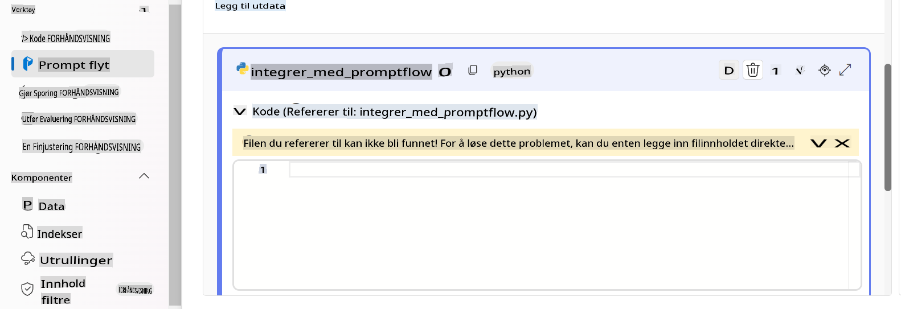

> [!NOTE]
> For mer detaljert informasjon om bruk av Prompt flow i Azure AI Foundry, kan du se [Prompt flow i Azure AI Foundry](https://learn.microsoft.com/azure/ai-studio/how-to/prompt-flow).

1. Velg **Chat input**, **Chat output** for å aktivere chat med modellen din.

    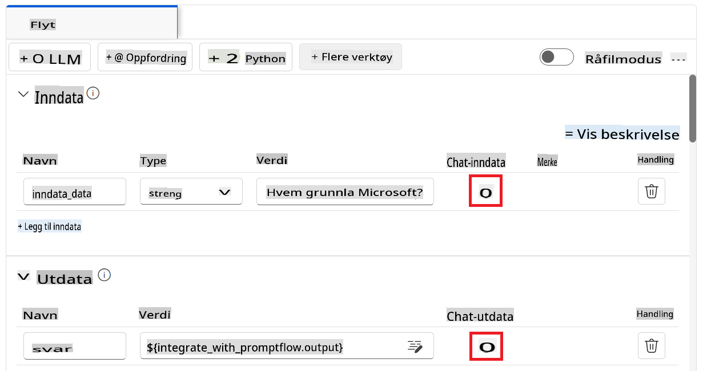

1. Nå er du klar til å chatte med din tilpassede Phi-3-modell. I neste øvelse vil du lære hvordan du starter Prompt flow og bruker den til å chatte med din finjusterte Phi-3-modell.

> [!NOTE]
>
> Den ombygde flyten skal se ut som bildet nedenfor:
>
> 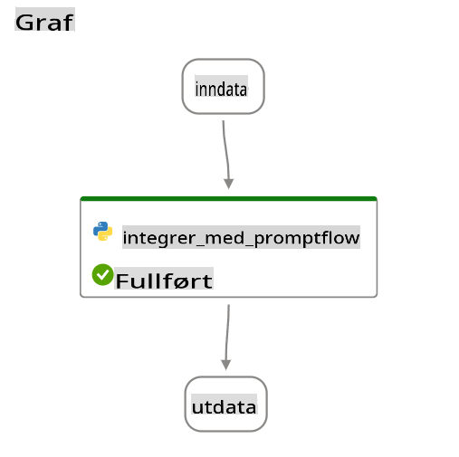
>

### Chat med din tilpassede Phi-3-modell

Nå som du har finjustert og integrert din tilpassede Phi-3-modell med Prompt flow, er du klar til å begynne å samhandle med den. Denne øvelsen vil veilede deg gjennom prosessen med å sette opp og starte en chat med modellen din ved hjelp av Prompt flow. Ved å følge disse trinnene vil du kunne utnytte den fulle kapasiteten til din finjusterte Phi-3-modell for ulike oppgaver og samtaler.

- Chat med din tilpassede Phi-3-modell ved hjelp av Prompt flow.

#### Start Prompt flow

1. Velg **Start beregningsøkter** for å starte Prompt flow.

    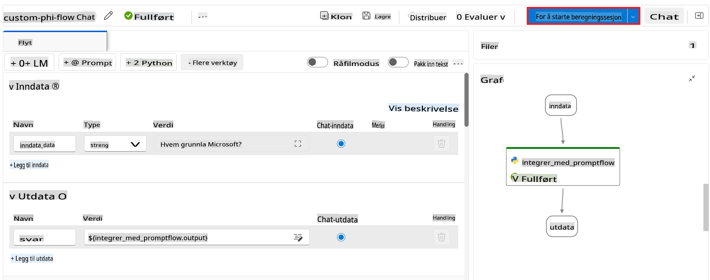

1. Velg **Valider og analyser input** for å fornye parametere.

    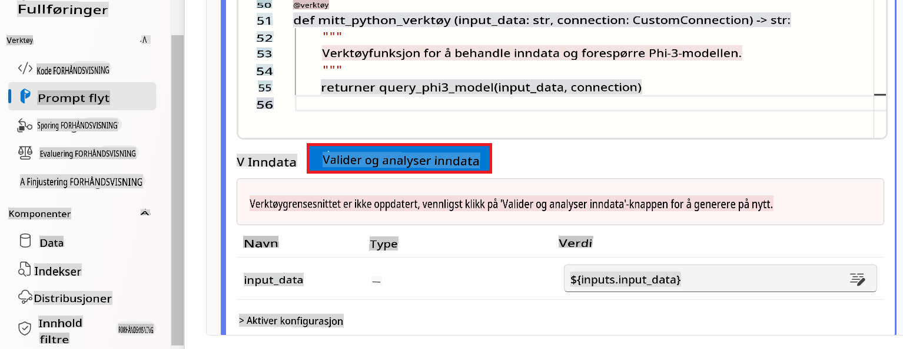

1. Velg **Verdien** til **tilkoblingen** til den tilpassede tilkoblingen du opprettet. For eksempel *connection*.

    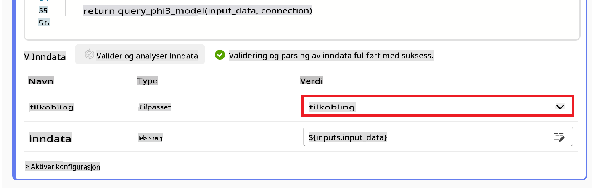

#### Chat med din tilpassede modell

1. Velg **Chat**.

    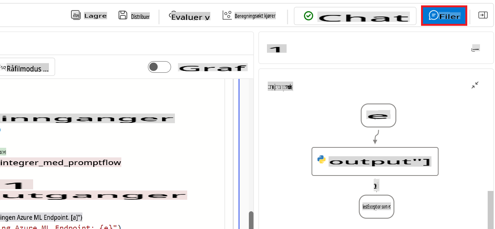

1. Her er et eksempel på resultatene: Nå kan du chatte med din tilpassede Phi-3-modell. Det anbefales å stille spørsmål basert på dataene som ble brukt til finjustering.

    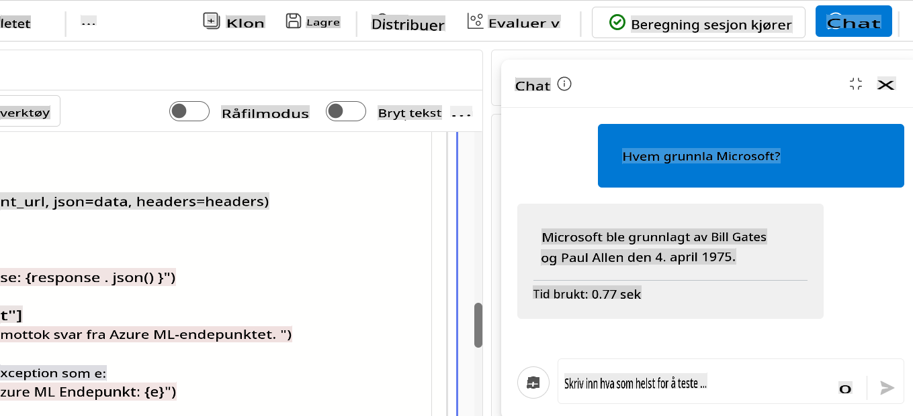

**Ansvarsfraskrivelse**:  
Dette dokumentet er oversatt ved hjelp av maskinbaserte AI-oversettelsestjenester. Selv om vi tilstreber nøyaktighet, vennligst vær oppmerksom på at automatiserte oversettelser kan inneholde feil eller unøyaktigheter. Det originale dokumentet på dets opprinnelige språk bør betraktes som den autoritative kilden. For kritisk informasjon anbefales profesjonell menneskelig oversettelse. Vi er ikke ansvarlige for misforståelser eller feiltolkninger som oppstår ved bruk av denne oversettelsen.