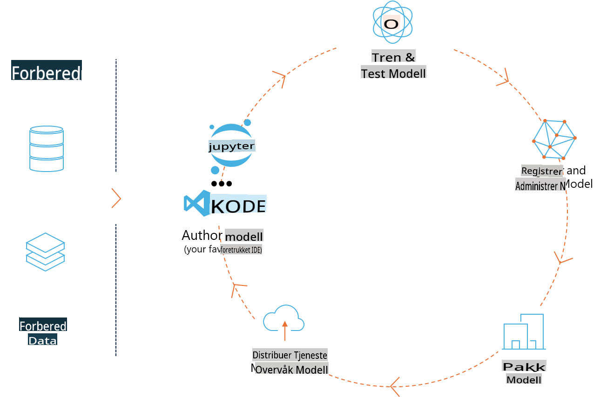
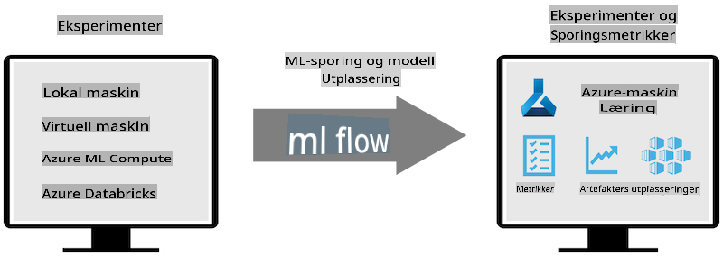
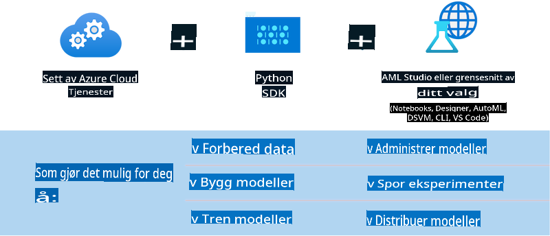

# MLflow

[MLflow](https://mlflow.org/) er en åpen plattform designet for å håndtere hele livssyklusen til maskinlæring.



MLFlow brukes til å administrere ML-livssyklusen, inkludert eksperimentering, reproduksjon, utrulling og en sentral modellregister. MLFlow tilbyr for tiden fire komponenter:

- **MLflow Tracking:** Registrer og søk etter eksperimenter, kode, datakonfigurasjon og resultater.
- **MLflow Projects:** Pakk inn data science-kode i et format som kan kjøres på hvilken som helst plattform.
- **MLflow Models:** Rull ut maskinlæringsmodeller i ulike serveringsmiljøer.
- **Model Registry:** Lagre, kommenter og administrer modeller i et sentralt depot.

Det inkluderer funksjoner for å spore eksperimenter, pakke kode i reproducerbare kjøringer og dele og distribuere modeller. MLFlow er integrert i Databricks og støtter en rekke ML-biblioteker, noe som gjør det bibliotek-uavhengig. Det kan brukes med hvilket som helst maskinlæringsbibliotek og i hvilket som helst programmeringsspråk, siden det tilbyr en REST API og CLI for enkelhet.



Nøkkelfunksjoner i MLFlow inkluderer:

- **Eksperimentsporing:** Registrer og sammenlign parametere og resultater.
- **Modelladministrasjon:** Rull ut modeller til ulike serverings- og inferensplattformer.
- **Modellregister:** Administrer livssyklusen til MLFlow-modeller sammen, inkludert versjonering og kommentarer.
- **Prosjekter:** Pakk ML-kode for deling eller produksjonsbruk.

MLFlow støtter også MLOps-syklusen, som inkluderer å forberede data, registrere og administrere modeller, pakke modeller for kjøring, distribuere tjenester og overvåke modeller. Målet er å forenkle prosessen fra prototype til produksjonsarbeidsflyt, spesielt i sky- og edge-miljøer.

## E2E Scenario - Bygge en wrapper og bruke Phi-3 som en MLFlow-modell

I dette E2E-eksemplet vil vi demonstrere to forskjellige tilnærminger til å bygge en wrapper rundt Phi-3 small language model (SLM) og deretter kjøre den som en MLFlow-modell enten lokalt eller i skyen, f.eks. i Azure Machine Learning workspace.



| Prosjekt | Beskrivelse | Plassering |
| ------------ | ----------- | -------- |
| Transformer Pipeline | Transformer Pipeline er det enkleste alternativet for å bygge en wrapper hvis du vil bruke en HuggingFace-modell med MLFlow sitt eksperimentelle transformers-flavour. | [**TransformerPipeline.ipynb**](../../../../../../code/06.E2E/E2E_Phi-3-MLflow_TransformerPipeline.ipynb) |
| Custom Python Wrapper | På tidspunktet for skriving støttet ikke transformer pipeline MLFlow-wrappergenerering for HuggingFace-modeller i ONNX-format, selv ikke med det eksperimentelle optimum Python-pakken. For slike tilfeller kan du bygge din egen tilpassede Python-wrapper for MLFlow-modus. | [**CustomPythonWrapper.ipynb**](../../../../../../code/06.E2E/E2E_Phi-3-MLflow_CustomPythonWrapper.ipynb) |

## Prosjekt: Transformer Pipeline

1. Du trenger relevante Python-pakker fra MLFlow og HuggingFace:

    ``` Python
    import mlflow
    import transformers
    ```

2. Deretter bør du starte en transformer pipeline ved å referere til den målrettede Phi-3-modellen i HuggingFace-registeret. Som det fremgår av _Phi-3-mini-4k-instruct_ sin modellkort, er oppgaven av typen "Tekstgenerering":

    ``` Python
    pipeline = transformers.pipeline(
        task = "text-generation",
        model = "microsoft/Phi-3-mini-4k-instruct"
    )
    ```

3. Nå kan du lagre transformer pipeline for Phi-3-modellen i MLFlow-format og legge til ekstra detaljer som målartefaktbanen, spesifikke modellkonfigurasjonsinnstillinger og inferens-API-type:

    ``` Python
    model_info = mlflow.transformers.log_model(
        transformers_model = pipeline,
        artifact_path = "phi3-mlflow-model",
        model_config = model_config,
        task = "llm/v1/chat"
    )
    ```

## Prosjekt: Custom Python Wrapper

1. Her kan vi bruke Microsofts [ONNX Runtime generate() API](https://github.com/microsoft/onnxruntime-genai) for inferens av ONNX-modellen og for koding/avkoding av tokens. Du må velge _onnxruntime_genai_-pakken for din målmaskin, med eksemplet nedenfor som retter seg mot CPU:

    ``` Python
    import mlflow
    from mlflow.models import infer_signature
    import onnxruntime_genai as og
    ```

1. Vår tilpassede klasse implementerer to metoder: _load_context()_ for å initialisere **ONNX-modellen** til Phi-3 Mini 4K Instruct, **generatorparametere** og **tokenizer**; og _predict()_ for å generere utgangstokens for den angitte prompten:

    ``` Python
    class Phi3Model(mlflow.pyfunc.PythonModel):
        def load_context(self, context):
            # Retrieving model from the artifacts
            model_path = context.artifacts["phi3-mini-onnx"]
            model_options = {
                 "max_length": 300,
                 "temperature": 0.2,         
            }
        
            # Defining the model
            self.phi3_model = og.Model(model_path)
            self.params = og.GeneratorParams(self.phi3_model)
            self.params.set_search_options(**model_options)
            
            # Defining the tokenizer
            self.tokenizer = og.Tokenizer(self.phi3_model)
    
        def predict(self, context, model_input):
            # Retrieving prompt from the input
            prompt = model_input["prompt"][0]
            self.params.input_ids = self.tokenizer.encode(prompt)
    
            # Generating the model's response
            response = self.phi3_model.generate(self.params)
    
            return self.tokenizer.decode(response[0][len(self.params.input_ids):])
    ```

1. Nå kan du bruke _mlflow.pyfunc.log_model()_-funksjonen for å generere en tilpasset Python-wrapper (i pickle-format) for Phi-3-modellen, sammen med den originale ONNX-modellen og nødvendige avhengigheter:

    ``` Python
    model_info = mlflow.pyfunc.log_model(
        artifact_path = artifact_path,
        python_model = Phi3Model(),
        artifacts = {
            "phi3-mini-onnx": "cpu_and_mobile/cpu-int4-rtn-block-32-acc-level-4",
        },
        input_example = input_example,
        signature = infer_signature(input_example, ["Run"]),
        extra_pip_requirements = ["torch", "onnxruntime_genai", "numpy"],
    )
    ```

## Signaturer for genererte MLFlow-modeller

1. I trinn 3 av Transformer Pipeline-prosjektet ovenfor, satte vi MLFlow-modellens oppgave til "_llm/v1/chat_". En slik instruksjon genererer en API-wrapper for modellen, kompatibel med OpenAI’s Chat API som vist nedenfor:

    ``` Python
    {inputs: 
      ['messages': Array({content: string (required), name: string (optional), role: string (required)}) (required), 'temperature': double (optional), 'max_tokens': long (optional), 'stop': Array(string) (optional), 'n': long (optional), 'stream': boolean (optional)],
    outputs: 
      ['id': string (required), 'object': string (required), 'created': long (required), 'model': string (required), 'choices': Array({finish_reason: string (required), index: long (required), message: {content: string (required), name: string (optional), role: string (required)} (required)}) (required), 'usage': {completion_tokens: long (required), prompt_tokens: long (required), total_tokens: long (required)} (required)],
    params: 
      None}
    ```

1. Som et resultat kan du sende inn prompten din i følgende format:

    ``` Python
    messages = [{"role": "user", "content": "What is the capital of Spain?"}]
    ```

1. Deretter kan du bruke OpenAI API-kompatibel etterprosessering, f.eks. _response[0][‘choices’][0][‘message’][‘content’]_, for å formatere utgangen din til noe som dette:

    ``` JSON
    Question: What is the capital of Spain?
    
    Answer: The capital of Spain is Madrid. It is the largest city in Spain and serves as the political, economic, and cultural center of the country. Madrid is located in the center of the Iberian Peninsula and is known for its rich history, art, and architecture, including the Royal Palace, the Prado Museum, and the Plaza Mayor.
    
    Usage: {'prompt_tokens': 11, 'completion_tokens': 73, 'total_tokens': 84}
    ```

1. I trinn 3 av Custom Python Wrapper-prosjektet ovenfor, lar vi MLFlow-pakken generere modellens signatur fra et gitt inndataeksempel. Signaturen til vår MLFlow-wrapper vil se slik ut:

    ``` Python
    {inputs: 
      ['prompt': string (required)],
    outputs: 
      [string (required)],
    params: 
      None}
    ```

1. Så prompten vår må inneholde nøkkelen "prompt" i ordboken, som dette:

    ``` Python
    {"prompt": "<|system|>You are a stand-up comedian.<|end|><|user|>Tell me a joke about atom<|end|><|assistant|>",}
    ```

1. Modellens utdata vil deretter bli levert i string-format:

    ``` JSON
    Alright, here's a little atom-related joke for you!
    
    Why don't electrons ever play hide and seek with protons?
    
    Because good luck finding them when they're always "sharing" their electrons!
    
    Remember, this is all in good fun, and we're just having a little atomic-level humor!
    ```

**Ansvarsfraskrivelse**:  
Dette dokumentet er oversatt ved hjelp av maskinbaserte AI-oversettelsestjenester. Selv om vi tilstreber nøyaktighet, vennligst vær oppmerksom på at automatiserte oversettelser kan inneholde feil eller unøyaktigheter. Det originale dokumentet på sitt opprinnelige språk bør betraktes som den autoritative kilden. For kritisk informasjon anbefales profesjonell menneskelig oversettelse. Vi er ikke ansvarlige for eventuelle misforståelser eller feiltolkninger som oppstår ved bruk av denne oversettelsen.