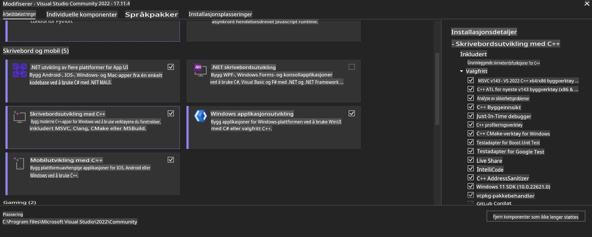
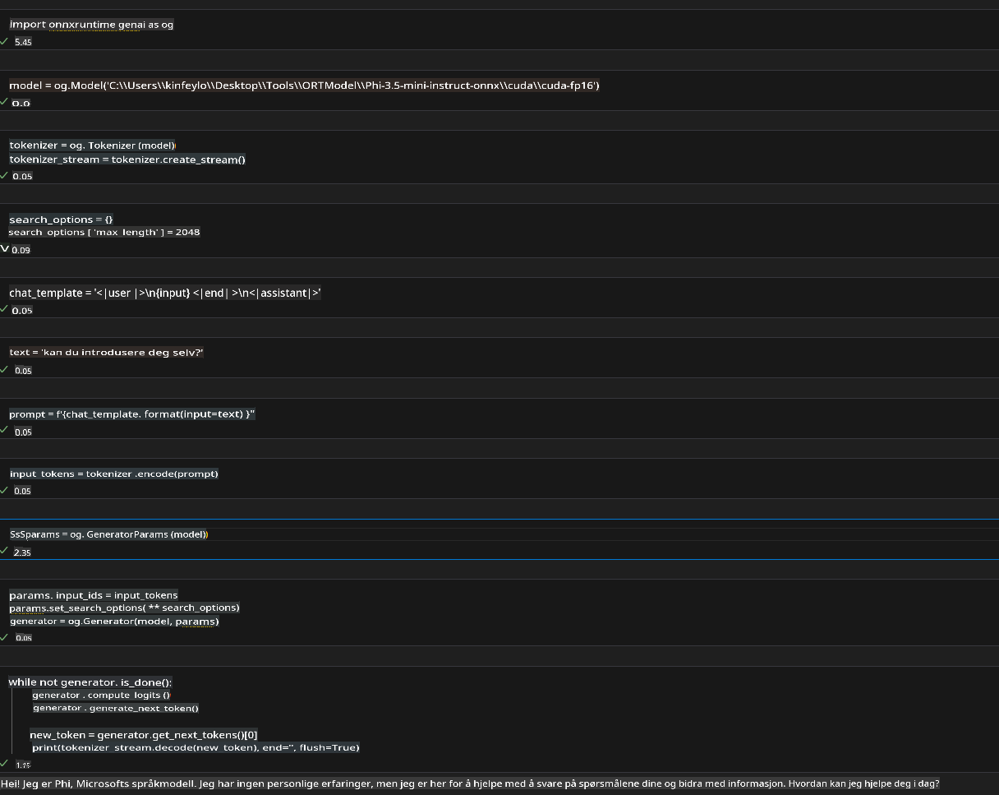
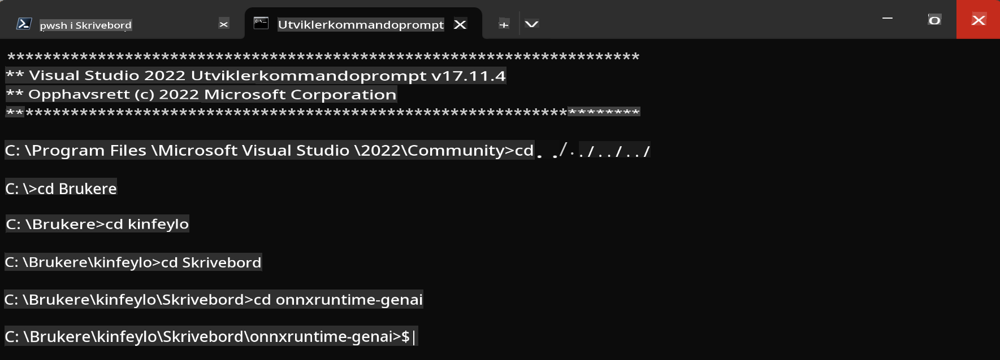

# **Retningslinjer for OnnxRuntime GenAI Windows GPU**

Denne veiledningen gir trinn for oppsett og bruk av ONNX Runtime (ORT) med GPU-er på Windows. Den er designet for å hjelpe deg med å utnytte GPU-akselerasjon for modellene dine, og forbedre ytelse og effektivitet.

Dokumentet gir veiledning om:

- Miljøoppsett: Instruksjoner for installasjon av nødvendige avhengigheter som CUDA, cuDNN og ONNX Runtime.
- Konfigurasjon: Hvordan konfigurere miljøet og ONNX Runtime for effektiv bruk av GPU-ressurser.
- Optimaliseringstips: Råd om hvordan du kan finjustere GPU-innstillingene for optimal ytelse.

### **1. Python 3.10.x /3.11.8**

   ***Merk*** Vi foreslår å bruke [miniforge](https://github.com/conda-forge/miniforge/releases/latest/download/Miniforge3-Windows-x86_64.exe) som ditt Python-miljø.

   ```bash

   conda create -n pydev python==3.11.8

   conda activate pydev

   ```

   ***Påminnelse*** Hvis du har installert noen Python ONNX-biblioteker, må du avinstallere dem.

### **2. Installer CMake med winget**

   ```bash

   winget install -e --id Kitware.CMake

   ```

### **3. Installer Visual Studio 2022 - Desktoputvikling med C++**

   ***Merk*** Hvis du ikke ønsker å kompilere, kan du hoppe over dette trinnet.



### **4. Installer NVIDIA-driver**

1. **NVIDIA GPU-driver** [https://www.nvidia.com/en-us/drivers/](https://www.nvidia.com/en-us/drivers/)

2. **NVIDIA CUDA 12.4** [https://developer.nvidia.com/cuda-12-4-0-download-archive](https://developer.nvidia.com/cuda-12-4-0-download-archive)

3. **NVIDIA CUDNN 9.4** [https://developer.nvidia.com/cudnn-downloads](https://developer.nvidia.com/cudnn-downloads)

***Påminnelse*** Bruk standardinnstillinger under installasjonsprosessen.

### **5. Sett opp NVIDIA-miljø**

Kopier NVIDIA CUDNN 9.4 lib, bin, include til NVIDIA CUDA 12.4 lib, bin, include.

- Kopier *'C:\Program Files\NVIDIA\CUDNN\v9.4\bin\12.6'*-filer til *'C:\Program Files\NVIDIA GPU Computing Toolkit\CUDA\v12.4\bin*.

- Kopier *'C:\Program Files\NVIDIA\CUDNN\v9.4\include\12.6'*-filer til *'C:\Program Files\NVIDIA GPU Computing Toolkit\CUDA\v12.4\include*.

- Kopier *'C:\Program Files\NVIDIA\CUDNN\v9.4\lib\12.6'*-filer til *'C:\Program Files\NVIDIA GPU Computing Toolkit\CUDA\v12.4\lib\x64'*.

### **6. Last ned Phi-3.5-mini-instruct-onnx**

   ```bash

   winget install -e --id Git.Git

   winget install -e --id GitHub.GitLFS

   git lfs install

   git clone https://huggingface.co/microsoft/Phi-3.5-mini-instruct-onnx

   ```

### **7. Kjør InferencePhi35Instruct.ipynb**

   Åpne [Notebook](../../../../../../code/09.UpdateSamples/Aug/ortgpu-phi35-instruct.ipynb) og kjør den.



### **8. Kompiler ORT GenAI GPU**

   ***Merk*** 
   
   1. Avinstaller først alle ONNX-, ONNX Runtime- og ONNX Runtime-GenAI-relaterte biblioteker.

   ```bash

   pip list 
   
   ```

   Deretter avinstallerer du alle ONNX Runtime-biblioteker, som for eksempel:

   ```bash

   pip uninstall onnxruntime

   pip uninstall onnxruntime-genai

   pip uninstall onnxruntume-genai-cuda
   
   ```

   2. Sjekk støtte for Visual Studio-utvidelser.

   Sjekk C:\Program Files\NVIDIA GPU Computing Toolkit\CUDA\v12.4\extras for å sikre at C:\Program Files\NVIDIA GPU Computing Toolkit\CUDA\v12.4\extras\visual_studio_integration finnes. 
   
   Hvis ikke, sjekk andre CUDA Toolkit-driver-mapper og kopier visual_studio_integration-mappen og innholdet til C:\Program Files\NVIDIA GPU Computing Toolkit\CUDA\v12.4\extras\visual_studio_integration.

   - Hvis du ikke ønsker å kompilere, kan du hoppe over dette trinnet.

   ```bash

   git clone https://github.com/microsoft/onnxruntime-genai

   ```

   - Last ned [https://github.com/microsoft/onnxruntime/releases/download/v1.19.2/onnxruntime-win-x64-gpu-1.19.2.zip](https://github.com/microsoft/onnxruntime/releases/download/v1.19.2/onnxruntime-win-x64-gpu-1.19.2.zip).

   - Pakk ut onnxruntime-win-x64-gpu-1.19.2.zip, gi mappen navnet **ort**, og kopier ort-mappen til onnxruntime-genai.

   - Bruk Windows Terminal, gå til Developer Command Prompt for VS 2022 og naviger til onnxruntime-genai.



   - Kompiler med ditt Python-miljø.

   ```bash

   cd onnxruntime-genai

   python build.py --use_cuda  --cuda_home "C:\Program Files\NVIDIA GPU Computing Toolkit\CUDA\v12.4" --config Release
 

   cd build/Windows/Release/Wheel

   pip install .whl

   ```

**Ansvarsfraskrivelse**:  
Dette dokumentet er oversatt ved hjelp av maskinbaserte AI-oversettelsestjenester. Selv om vi tilstreber nøyaktighet, vær oppmerksom på at automatiske oversettelser kan inneholde feil eller unøyaktigheter. Det originale dokumentet på sitt opprinnelige språk bør anses som den autoritative kilden. For kritisk informasjon anbefales profesjonell menneskelig oversettelse. Vi er ikke ansvarlige for misforståelser eller feiltolkninger som oppstår ved bruk av denne oversettelsen.