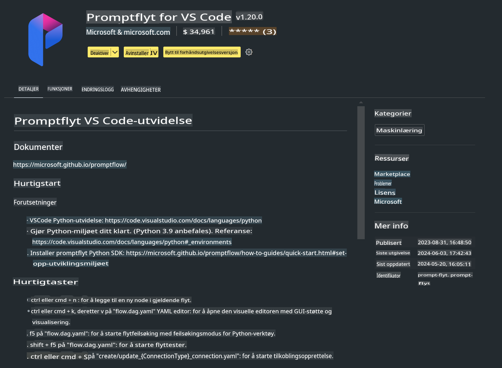

# **Lab 0 - Installasjon**

Når vi går inn i Laben, må vi konfigurere det relevante miljøet:

### **1. Python 3.11+**

Det anbefales å bruke miniforge for å konfigurere Python-miljøet ditt.

For å konfigurere miniforge, vennligst se [https://github.com/conda-forge/miniforge](https://github.com/conda-forge/miniforge)

Etter å ha konfigurert miniforge, kjør følgende kommando i Power Shell:

```bash

conda create -n pyenv python==3.11.8 -y

conda activate pyenv

```

### **2. Installer Prompt flow SDK**

I Lab 1 bruker vi Prompt flow, så du må konfigurere Prompt flow SDK.

```bash

pip install promptflow --upgrade

```

Du kan sjekke promptflow SDK med denne kommandoen:

```bash

pf --version

```

### **3. Installer Visual Studio Code Prompt flow-utvidelse**



### **4. Intel NPU-akselerasjonsbibliotek**

Intels nyeste generasjons prosessorer støtter NPU. Hvis du ønsker å bruke NPU for å kjøre LLMs / SLMs lokalt, kan du bruke ***Intel NPU-akselerasjonsbibliotek***. Hvis du vil vite mer, kan du lese [https://github.com/microsoft/PhiCookBook/blob/main/md/01.Introduction/03/AIPC_Inference.md](https://github.com/microsoft/PhiCookBook/blob/main/md/01.Introduction/03/AIPC_Inference.md).

Installer Intel NPU-akselerasjonsbibliotek i bash:

```bash

pip install intel-npu-acceleration-library

```

***Merk***: Vennligst merk at dette biblioteket støtter transformers ***4.40.2***, bekreft versjonen.

### **5. Andre Python-biblioteker**

Lag requirements.txt og legg til dette innholdet:

```txt

notebook
numpy 
scipy 
scikit-learn 
matplotlib 
pandas 
pillow 
graphviz

```

### **6. Installer NVM**

Installer nvm i PowerShell:

```bash

winget install -e --id CoreyButler.NVMforWindows

```

Installer nodejs 18.20:

```bash

nvm install 18.20.0

nvm use 18.20.0

```

### **7. Installer utviklingsstøtte for Visual Studio Code**

```bash

npm install --global yo generator-code

```

Gratulerer! Du har konfigurert SDK-en med suksess. Gå videre til de praktiske stegene.

**Ansvarsfraskrivelse**:  
Dette dokumentet er oversatt ved hjelp av maskinbaserte AI-oversettingstjenester. Selv om vi tilstreber nøyaktighet, ber vi deg være oppmerksom på at automatiserte oversettelser kan inneholde feil eller unøyaktigheter. Det originale dokumentet på dets opprinnelige språk bør anses som den autoritative kilden. For kritisk informasjon anbefales profesjonell menneskelig oversettelse. Vi er ikke ansvarlige for misforståelser eller feiltolkninger som oppstår ved bruk av denne oversettelsen.