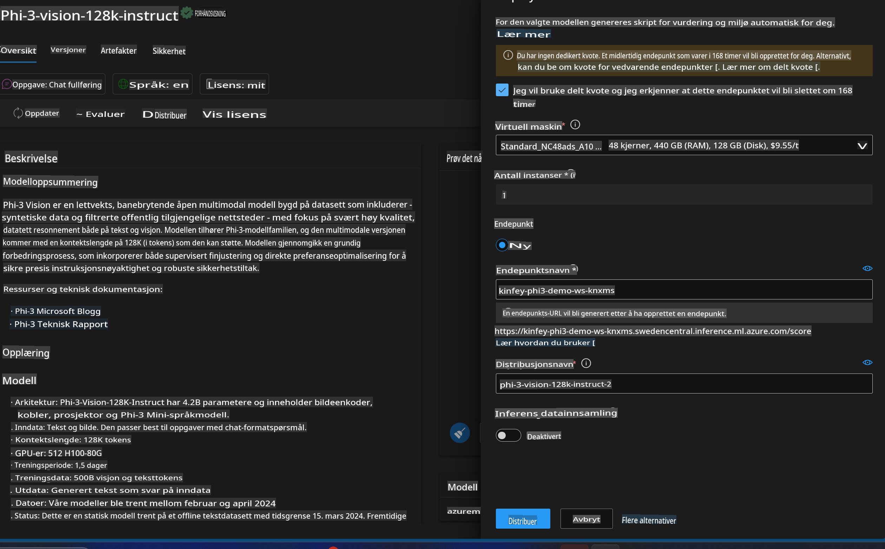
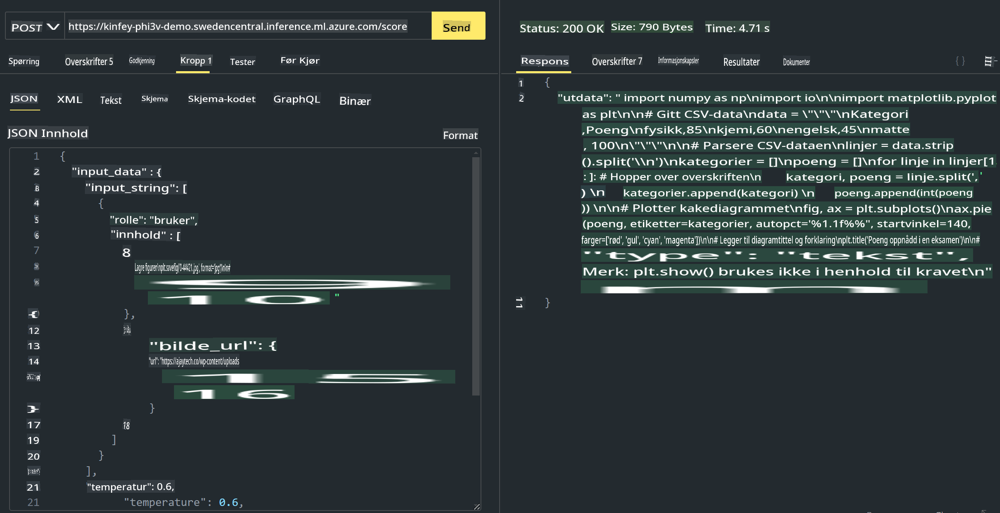

# **Lab 3 - Distribuer Phi-3-Vision på Azure Machine Learning Service**

Vi bruker NPU for å fullføre produksjonsdistribusjonen av lokal kode, og deretter ønsker vi å introdusere muligheten til å bruke PHI-3-VISION for å generere kode fra bilder.

I denne veiledningen kan vi raskt bygge en Model As Service Phi-3 Vision-tjeneste i Azure Machine Learning Service.

***Merk***: Phi-3 Vision krever datakraft for å generere innhold raskere. Vi trenger skybasert datakraft for å oppnå dette.


### **1. Opprett Azure Machine Learning Service**

Vi må opprette en Azure Machine Learning Service i Azure-portalen. Hvis du vil lære hvordan, kan du besøke denne lenken [https://learn.microsoft.com/azure/machine-learning/quickstart-create-resources?view=azureml-api-2](https://learn.microsoft.com/azure/machine-learning/quickstart-create-resources?view=azureml-api-2)


### **2. Velg Phi-3 Vision i Azure Machine Learning Service**


### **3. Distribuer Phi-3-Vision i Azure**




### **4. Test Endepunkt i Postman**




***Merk***

1. Parameterne som skal sendes, må inkludere Authorization, azureml-model-deployment og Content-Type. Du må sjekke distribusjonsinformasjonen for å få tak i disse.

2. For å sende parametere må Phi-3-Vision bruke en bildelenke. Vennligst se på metoden for å sende parametere som brukes av GPT-4-Vision, som for eksempel:

```json

{
  "input_data":{
    "input_string":[
      {
        "role":"user",
        "content":[ 
          {
            "type": "text",
            "text": "You are a Python coding assistant.Please create Python code for image "
          },
          {
              "type": "image_url",
              "image_url": {
                "url": "https://ajaytech.co/wp-content/uploads/2019/09/index.png"
              }
          }
        ]
      }
    ],
    "parameters":{
          "temperature": 0.6,
          "top_p": 0.9,
          "do_sample": false,
          "max_new_tokens": 2048
    }
  }
}

```

3. Bruk Post-metoden for å kalle **/score**.

**Gratulerer**! Du har fullført den raske distribusjonen av PHI-3-VISION og prøvd hvordan du kan bruke bilder til å generere kode. Neste steg er å bygge applikasjoner ved å kombinere NPU-er og skyen.

**Ansvarsfraskrivelse**:  
Dette dokumentet er oversatt ved hjelp av maskinbaserte AI-oversettelsestjenester. Selv om vi bestreber oss på nøyaktighet, vær oppmerksom på at automatiserte oversettelser kan inneholde feil eller unøyaktigheter. Det originale dokumentet på sitt opprinnelige språk bør betraktes som den autoritative kilden. For kritisk informasjon anbefales profesjonell menneskelig oversettelse. Vi er ikke ansvarlige for eventuelle misforståelser eller feiltolkninger som oppstår ved bruk av denne oversettelsen.