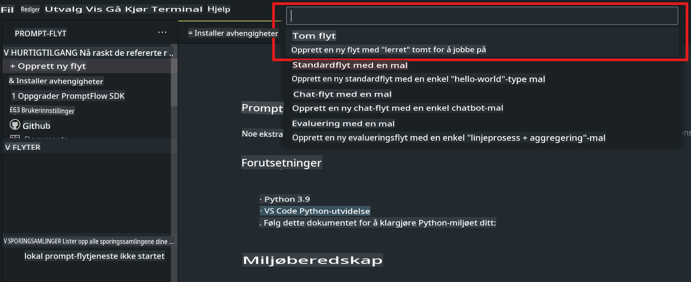
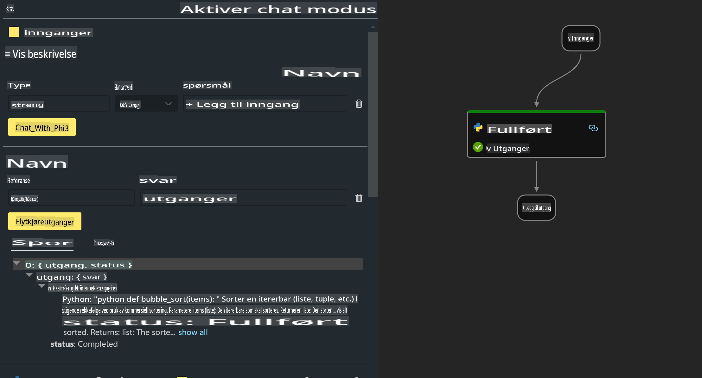

# **Lab 2 - Kjør Prompt flow med Phi-3-mini i AIPC**

## **Hva er Prompt flow**

Prompt flow er et sett med utviklingsverktøy designet for å forenkle hele utviklingssyklusen for AI-applikasjoner basert på LLM, fra idéutvikling, prototyping, testing, evaluering til produksjonsdistribusjon og overvåking. Det gjør prompt engineering mye enklere og lar deg bygge LLM-applikasjoner med produksjonskvalitet.

Med Prompt flow kan du:

- Lage flyter som kobler sammen LLM-er, prompts, Python-kode og andre verktøy i en kjørbar arbeidsflyt.

- Feilsøke og iterere flytene dine, spesielt interaksjonen med LLM-er, uten problemer.

- Evaluere flytene dine og beregne kvalitets- og ytelsesmetrikker med større datasett.

- Integrere testing og evaluering i ditt CI/CD-system for å sikre kvaliteten på flyten din.

- Distribuere flytene dine til den tjenesteplattformen du velger, eller enkelt integrere dem i appens kodebase.

- (Valgfritt, men sterkt anbefalt) Samarbeide med teamet ditt ved å bruke skyversjonen av Prompt flow i Azure AI.


## **Bygge genereringskodeflyter på Apple Silicon**

***Merk***: Hvis du ikke har fullført miljøinstallasjonen, vennligst besøk [Lab 0 -Installasjoner](./01.Installations.md)

1. Åpne Prompt flow-utvidelsen i Visual Studio Code og opprett et tomt flytprosjekt.



2. Legg til Input- og Output-parametere og legg til Python-kode som ny flyt.



Du kan referere til denne strukturen (flow.dag.yaml) for å konstruere flyten din.

```yaml

inputs:
  prompt:
    type: string
    default: Write python code for Fibonacci serie. Please use markdown as output
outputs:
  result:
    type: string
    reference: ${gen_code_by_phi3.output}
nodes:
- name: gen_code_by_phi3
  type: python
  source:
    type: code
    path: gen_code_by_phi3.py
  inputs:
    prompt: ${inputs.prompt}


```

3. Kvantifisere phi-3-mini

Vi ønsker å kjøre SLM bedre på lokale enheter. Generelt kvantifiserer vi modellen (INT4, FP16, FP32).

```bash

python -m mlx_lm.convert --hf-path microsoft/Phi-3-mini-4k-instruct

```

**Merk:** standardmappen er mlx_model.

4. Legg til kode i ***Chat_With_Phi3.py***.

```python


from promptflow import tool

from mlx_lm import load, generate


# The inputs section will change based on the arguments of the tool function, after you save the code
# Adding type to arguments and return value will help the system show the types properly
# Please update the function name/signature per need
@tool
def my_python_tool(prompt: str) -> str:

    model_id = './mlx_model_phi3_mini'

    model, tokenizer = load(model_id)

    # <|user|>\nWrite python code for Fibonacci serie. Please use markdown as output<|end|>\n<|assistant|>

    response = generate(model, tokenizer, prompt="<|user|>\n" + prompt  + "<|end|>\n<|assistant|>", max_tokens=2048, verbose=True)

    return response


```

4. Du kan teste flyten fra Debug eller Run for å sjekke om genereringskoden fungerer som den skal.


5. Kjør flyten som utviklings-API i terminalen.

```

pf flow serve --source ./ --port 8080 --host localhost   

```

Du kan teste det i Postman / Thunder Client.


### **Merk**

1. Første kjøring tar lang tid. Det anbefales å laste ned phi-3-modellen fra Hugging Face CLI.

2. Med tanke på den begrensede regnekraften til Intel NPU, anbefales det å bruke Phi-3-mini-4k-instruct.

3. Vi bruker Intel NPU-akselerasjon for å kvantisere INT4-konvertering, men hvis du kjører tjenesten på nytt, må du slette cache- og nc_workshop-mappene.


## **Ressurser**

1. Lær Promptflow [https://microsoft.github.io/promptflow/](https://microsoft.github.io/promptflow/)

2. Lær Intel NPU-akselerasjon [https://github.com/intel/intel-npu-acceleration-library](https://github.com/intel/intel-npu-acceleration-library)

3. Eksempelkode, last ned [Local NPU Agent Sample Code](../../../../../../../../../code/07.Lab/01/AIPC/local-npu-agent)

**Ansvarsfraskrivelse**:  
Dette dokumentet er oversatt ved hjelp av maskinbaserte AI-oversettelsestjenester. Selv om vi tilstreber nøyaktighet, vennligst vær oppmerksom på at automatiserte oversettelser kan inneholde feil eller unøyaktigheter. Det originale dokumentet på dets opprinnelige språk bør anses som den autoritative kilden. For kritisk informasjon anbefales profesjonell menneskelig oversettelse. Vi er ikke ansvarlige for eventuelle misforståelser eller feiltolkninger som oppstår ved bruk av denne oversettelsen.