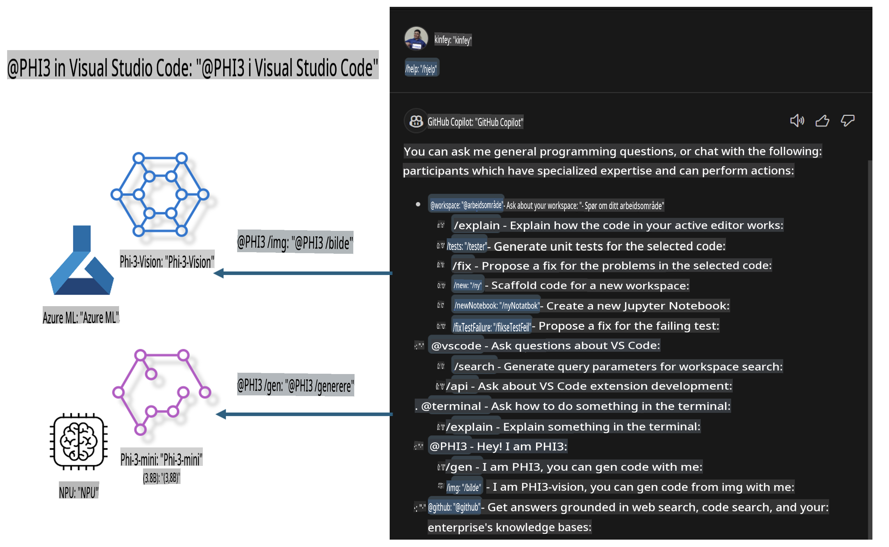

# **Bygg din egen Visual Studio Code GitHub Copilot Chat med Microsoft Phi-3-familien**

Har du brukt arbeidsområdeagenten i GitHub Copilot Chat? Ønsker du å lage din egen kodeagent for teamet ditt? Denne praktiske laben har som mål å kombinere den åpne kildekodemodellen for å lage en bedriftsnivå kodeagent.

## **Grunnlag**

### **Hvorfor velge Microsoft Phi-3**

Phi-3 er en serie med modeller, inkludert phi-3-mini, phi-3-small og phi-3-medium, basert på forskjellige treningsparametere for tekstgenerering, dialogfullføring og kodegenerering. Det finnes også phi-3-vision, som er basert på Vision. Den er egnet for bedrifter eller ulike team som ønsker å lage offline generative AI-løsninger.

Anbefalt lesing: [https://github.com/microsoft/PhiCookBook/blob/main/md/01.Introduction/01/01.PhiFamily.md](https://github.com/microsoft/PhiCookBook/blob/main/md/01.Introduction/01/01.PhiFamily.md)

### **Microsoft GitHub Copilot Chat**

GitHub Copilot Chat-utvidelsen gir deg et chatgrensesnitt som lar deg samhandle med GitHub Copilot og motta svar på kode-relaterte spørsmål direkte i VS Code, uten at du trenger å navigere i dokumentasjon eller søke på nettfora.

Copilot Chat kan bruke syntaksutheving, innrykk og andre formateringsfunksjoner for å gjøre svarene tydeligere. Avhengig av brukerens spørsmål kan resultatet inneholde lenker til konteksten Copilot brukte for å generere et svar, som kildekodefiler eller dokumentasjon, eller knapper for tilgang til funksjonalitet i VS Code.

- Copilot Chat integreres i utviklerflyten din og gir deg hjelp der du trenger det:

- Start en samtale direkte fra editoren eller terminalen for hjelp mens du koder

- Bruk Chat-visningen for å ha en AI-assistent tilgjengelig til enhver tid

- Start Quick Chat for å stille et raskt spørsmål og fortsette med det du gjør

Du kan bruke GitHub Copilot Chat i ulike situasjoner, som:

- Besvare spørsmål om hvordan du best løser et problem

- Forklare andres kode og foreslå forbedringer

- Foreslå kodeforbedringer

- Generere enhetstester

- Generere kodedokumentasjon

Anbefalt lesing: [https://code.visualstudio.com/docs/copilot/copilot-chat](https://code.visualstudio.com/docs/copilot/copilot-chat?WT.mc_id=aiml-137032-kinfeylo)

### **Microsoft GitHub Copilot Chat @workspace**

Referansen **@workspace** i Copilot Chat lar deg stille spørsmål om hele kodebasen din. Basert på spørsmålet henter Copilot intelligent relevante filer og symboler, som den deretter bruker som lenker og kodeeksempler i svaret.

For å svare på spørsmålet ditt søker **@workspace** gjennom de samme kildene som en utvikler ville brukt når de navigerer i en kodebase i VS Code:

- Alle filer i arbeidsområdet, unntatt filer som ignoreres av en .gitignore-fil

- Katalogstrukturen med nestede mapper og filnavn

- GitHubs kodeindeks, hvis arbeidsområdet er et GitHub-repositorium og indeksert av kodesøk

- Symboler og definisjoner i arbeidsområdet

- Valgt tekst eller synlig tekst i den aktive editoren

Merk: .gitignore ignoreres hvis du har en fil åpen eller har valgt tekst i en ignorert fil.

Anbefalt lesing: [https://code.visualstudio.com/docs/copilot/workspace-context](https://code.visualstudio.com/docs/copilot/workspace-context?WT.mc_id=aiml-137032-kinfeylo)

## **Lær mer om denne laben**

GitHub Copilot har i stor grad forbedret programmeringseffektiviteten i bedrifter, og alle bedrifter ønsker å tilpasse funksjonene til GitHub Copilot. Mange bedrifter har tilpasset utvidelser som ligner på GitHub Copilot basert på sine egne forretningsscenarier og åpne kildekodemodeller. For bedrifter er tilpassede utvidelser enklere å kontrollere, men dette påvirker også brukeropplevelsen. Tross alt har GitHub Copilot sterkere funksjoner for generelle scenarier og profesjonalitet. Hvis opplevelsen kan holdes konsistent, vil det være bedre å tilpasse bedriftens egen utvidelse. GitHub Copilot Chat gir relevante API-er for bedrifter for å utvide Chat-opplevelsen. Å opprettholde en konsistent opplevelse og ha tilpassede funksjoner gir en bedre brukeropplevelse.

Denne laben bruker hovedsakelig Phi-3-modellen kombinert med lokal NPU og Azure hybrid for å bygge en tilpasset agent i GitHub Copilot Chat ***@PHI3*** for å hjelpe bedriftsutviklere med å fullføre kodegenerering***(@PHI3 /gen)*** og generere kode basert på bilder ***(@PHI3 /img)***.

### ***Merk:*** 

Denne laben er for øyeblikket implementert i AIPC for Intel CPU og Apple Silicon. Vi vil fortsette å oppdatere Qualcomm-versjonen av NPU.

## **Lab**

| Navn | Beskrivelse | AIPC | Apple |
| ------------ | ----------- | -------- |-------- |
| Lab0 - Installeringer(✅) | Konfigurer og installer relaterte miljøer og verktøy | [Gå](./HOL/AIPC/01.Installations.md) |[Gå](./HOL/Apple/01.Installations.md) |
| Lab1 - Kjør Prompt flow med Phi-3-mini (✅) | Kombinert med AIPC / Apple Silicon, bruk lokal NPU for å lage kodegenerering gjennom Phi-3-mini | [Gå](./HOL/AIPC/02.PromptflowWithNPU.md) |  [Gå](./HOL/Apple/02.PromptflowWithMLX.md) |
| Lab2 - Distribuer Phi-3-vision på Azure Machine Learning Service(✅) | Generer kode ved å distribuere Phi-3-vision-modellen fra Azure Machine Learning Service sin modellkatalog | [Gå](./HOL/AIPC/03.DeployPhi3VisionOnAzure.md) |[Gå](./HOL/Apple/03.DeployPhi3VisionOnAzure.md) |
| Lab3 - Opprett en @phi-3-agent i GitHub Copilot Chat(✅)  | Opprett en tilpasset Phi-3-agent i GitHub Copilot Chat for å fullføre kodegenerering, grafgenerering, RAG, osv. | [Gå](./HOL/AIPC/04.CreatePhi3AgentInVSCode.md) | [Gå](./HOL/Apple/04.CreatePhi3AgentInVSCode.md) |
| Eksempelkode (✅)  | Last ned eksempelkode | [Gå](../../../../../../../code/07.Lab/01/AIPC) | [Gå](../../../../../../../code/07.Lab/01/Apple) |

## **Ressurser**

1. Phi-3 Cookbook [https://github.com/microsoft/Phi-3CookBook](https://github.com/microsoft/Phi-3CookBook)

2. Lær mer om GitHub Copilot [https://learn.microsoft.com/training/paths/copilot/](https://learn.microsoft.com/training/paths/copilot/?WT.mc_id=aiml-137032-kinfeylo)

3. Lær mer om GitHub Copilot Chat [https://learn.microsoft.com/training/paths/accelerate-app-development-using-github-copilot/](https://learn.microsoft.com/training/paths/accelerate-app-development-using-github-copilot/?WT.mc_id=aiml-137032-kinfeylo)

4. Lær mer om GitHub Copilot Chat API [https://code.visualstudio.com/api/extension-guides/chat](https://code.visualstudio.com/api/extension-guides/chat?WT.mc_id=aiml-137032-kinfeylo)

5. Lær mer om Azure AI Foundry [https://learn.microsoft.com/training/paths/create-custom-copilots-ai-studio/](https://learn.microsoft.com/training/paths/create-custom-copilots-ai-studio/?WT.mc_id=aiml-137032-kinfeylo)

6. Lær mer om Azure AI Foundry sin modellkatalog [https://learn.microsoft.com/azure/ai-studio/how-to/model-catalog-overview](https://learn.microsoft.com/azure/ai-studio/how-to/model-catalog-overview)

**Ansvarsfraskrivelse**:  
Dette dokumentet er oversatt ved hjelp av maskinbaserte AI-oversettelsestjenester. Selv om vi streber etter nøyaktighet, vær oppmerksom på at automatiserte oversettelser kan inneholde feil eller unøyaktigheter. Det originale dokumentet på sitt opprinnelige språk bør anses som den autoritative kilden. For kritisk informasjon anbefales profesjonell menneskelig oversettelse. Vi er ikke ansvarlige for eventuelle misforståelser eller feiltolkninger som oppstår ved bruk av denne oversettelsen.