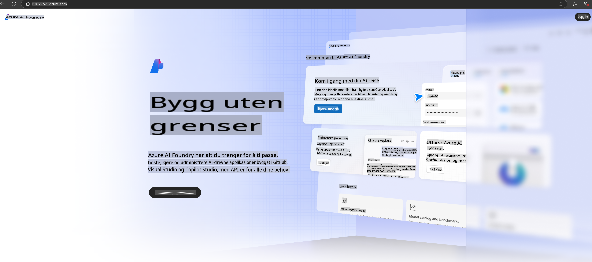

# **Bruke Phi-3 i Azure AI Foundry**

Med utviklingen av Generativ AI håper vi å bruke en samlet plattform for å administrere ulike LLM- og SLM-modeller, integrere bedriftsdata, utføre finjustering/RAG-operasjoner, og evaluere forskjellige forretningsområder etter integrering av LLM og SLM. Dette gjør at generativ AI kan implementeres bedre i smarte applikasjoner. [Azure AI Foundry](https://ai.azure.com) er en bedriftsplattform for generative AI-applikasjoner.

Med Azure AI Foundry kan du evaluere svar fra store språkmodeller (LLM) og orkestrere komponenter for prompt-applikasjoner ved hjelp av prompt flow for bedre ytelse. Plattformen gir skalerbarhet som gjør det enkelt å gå fra proof of concept til full produksjon. Kontinuerlig overvåking og forbedring sikrer langsiktig suksess.

Vi kan raskt distribuere Phi-3-modellen på Azure AI Foundry gjennom enkle trinn, og deretter bruke Azure AI Foundry til å utføre relaterte oppgaver som Playground/Chat, finjustering, evaluering og mer.

## **1. Forberedelser**

Hvis du allerede har [Azure Developer CLI](https://learn.microsoft.com/azure/developer/azure-developer-cli/overview?WT.mc_id=aiml-138114-kinfeylo) installert på maskinen din, kan du bruke denne malen ved å kjøre en enkel kommando i en ny mappe.

## Manuell Opprettelse

Å opprette et Microsoft Azure AI Foundry-prosjekt og -hub er en utmerket måte å organisere og administrere AI-arbeidet ditt på. Her er en steg-for-steg-guide for å komme i gang:

### Opprette et Prosjekt i Azure AI Foundry

1. **Gå til Azure AI Foundry**: Logg inn på Azure AI Foundry-portalen.
2. **Opprett et Prosjekt**:
   - Hvis du er i et prosjekt, velg "Azure AI Foundry" øverst til venstre på siden for å gå til Hjem-siden.
   - Velg "+ Opprett prosjekt".
   - Skriv inn et navn for prosjektet.
   - Hvis du allerede har en hub, vil den velges som standard. Hvis du har tilgang til flere huber, kan du velge en annen fra rullegardinmenyen. Hvis du vil opprette en ny hub, velg "Opprett ny hub" og skriv inn et navn.
   - Velg "Opprett".

### Opprette en Hub i Azure AI Foundry

1. **Gå til Azure AI Foundry**: Logg inn med Azure-kontoen din.
2. **Opprett en Hub**:
   - Velg Administrasjonssenter fra menyen til venstre.
   - Velg "Alle ressurser", klikk på pilen ved siden av "+ Nytt prosjekt", og velg "+ Ny hub".
   - I dialogboksen "Opprett en ny hub" skriver du inn et navn for huben din (f.eks. contoso-hub) og tilpasser de andre feltene etter behov.
   - Velg "Neste", gjennomgå informasjonen, og velg deretter "Opprett".

For mer detaljerte instruksjoner kan du se den offisielle [Microsoft-dokumentasjonen](https://learn.microsoft.com/azure/ai-studio/how-to/create-projects).

Etter vellykket opprettelse kan du få tilgang til studioet du opprettet via [ai.azure.com](https://ai.azure.com/).

Det kan være flere prosjekter i én AI Foundry. Opprett et prosjekt i AI Foundry for å forberede deg.

Opprett Azure AI Foundry [QuickStarts](https://learn.microsoft.com/azure/ai-studio/quickstarts/get-started-code).

## **2. Distribuere en Phi-modell i Azure AI Foundry**

Klikk på Utforsk-alternativet i prosjektet for å gå inn i Model Catalog og velg Phi-3.

Velg Phi-3-mini-4k-instruct.

Klikk på 'Deploy' for å distribuere Phi-3-mini-4k-instruct-modellen.

> [!NOTE]
>
> Du kan velge datakraft ved distribusjon.

## **3. Playground Chat Phi i Azure AI Foundry**

Gå til distribusjonssiden, velg Playground, og chat med Phi-3 i Azure AI Foundry.

## **4. Distribuere Modellen fra Azure AI Foundry**

For å distribuere en modell fra Azure Model Catalog kan du følge disse trinnene:

- Logg inn på Azure AI Foundry.
- Velg modellen du vil distribuere fra modellkatalogen i Azure AI Foundry.
- På modellens Detaljside velger du Distribuer og deretter Serverless API med Azure AI Content Safety.
- Velg prosjektet der du vil distribuere modellene dine. For å bruke Serverless API-tilbudet må arbeidsområdet ditt være i East US 2- eller Sweden Central-regionen. Du kan tilpasse distribusjonsnavnet.
- I distribusjonsveiviseren velger du Priser og vilkår for å lære om kostnader og bruksbetingelser.
- Velg Distribuer. Vent til distribusjonen er klar, og du blir omdirigert til Distribusjonssiden.
- Velg Åpne i playground for å begynne å samhandle med modellen.
- Du kan gå tilbake til Distribusjonssiden, velge distribusjonen, og merke deg endepunktets mål-URL og hemmelige nøkkel, som du kan bruke til å kalle distribusjonen og generere svar.
- Du finner alltid detaljene for endepunktet, URL-en og tilgangsnøklene ved å navigere til Bygg-fanen og velge Distribusjoner fra Komponenter-seksjonen.

> [!NOTE]
> Vær oppmerksom på at kontoen din må ha Azure AI Developer-rollerettigheter på Ressursgruppen for å utføre disse trinnene.

## **5. Bruke Phi API i Azure AI Foundry**

Du kan få tilgang til https://{Ditt prosjektnavn}.region.inference.ml.azure.com/swagger.json gjennom Postman GET og kombinere det med nøkkelen for å lære om de tilgjengelige grensesnittene.

Du kan enkelt få forespørselsparametere, samt svarparametere.

**Ansvarsfraskrivelse**:  
Dette dokumentet er oversatt ved hjelp av maskinbaserte AI-oversettelsestjenester. Selv om vi tilstreber nøyaktighet, vær oppmerksom på at automatiserte oversettelser kan inneholde feil eller unøyaktigheter. Det originale dokumentet på sitt opprinnelige språk bør betraktes som den autoritative kilden. For kritisk informasjon anbefales profesjonell menneskelig oversettelse. Vi er ikke ansvarlige for eventuelle misforståelser eller feiltolkninger som oppstår ved bruk av denne oversettelsen.