# Finjustering av Phi-3 med Azure AI Foundry

La oss utforske hvordan du kan finjustere Microsofts Phi-3 Mini-språkmodell ved hjelp av Azure AI Foundry. Finjustering lar deg tilpasse Phi-3 Mini til spesifikke oppgaver, noe som gjør den enda mer kraftfull og kontekstbevisst.

## Viktige hensyn

- **Muligheter:** Hvilke modeller kan finjusteres? Hva kan basis-modellen trenes opp til å gjøre?
- **Kostnad:** Hva er prismodellen for finjustering?
- **Tilpasning:** Hvor mye kan jeg endre på basis-modellen – og på hvilke måter?
- **Brukervennlighet:** Hvordan foregår finjusteringen – må jeg skrive tilpasset kode? Må jeg stille med egen maskinkapasitet?
- **Sikkerhet:** Finjusterte modeller kan ha sikkerhetsrisikoer – finnes det noen mekanismer for å beskytte mot utilsiktet skade?

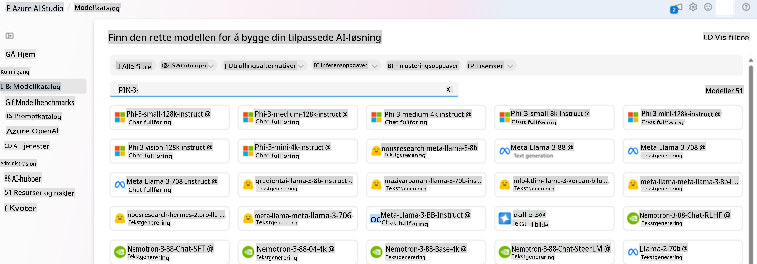

## Forberedelse til finjustering

### Forutsetninger

> [!NOTE]
> For Phi-3-modellene er pay-as-you-go-modellen for finjustering kun tilgjengelig for hubs opprettet i **East US 2**-regioner.

- Et Azure-abonnement. Hvis du ikke har et Azure-abonnement, opprett en [betalt Azure-konto](https://azure.microsoft.com/pricing/purchase-options/pay-as-you-go) for å komme i gang.

- Et [AI Foundry-prosjekt](https://ai.azure.com?WT.mc_id=aiml-138114-kinfeylo).
- Azure rollebasert tilgangskontroll (Azure RBAC) brukes for å gi tilgang til operasjoner i Azure AI Foundry. For å utføre stegene i denne artikkelen må brukerkontoen din ha rollen __Azure AI Developer__ på ressursgruppen.

### Registrering av abonnementstilbyder

Bekreft at abonnementet er registrert hos `Microsoft.Network`-tilbyderen.

1. Logg inn på [Azure-portalen](https://portal.azure.com).
2. Velg **Abonnementer** fra menyen til venstre.
3. Velg abonnementet du vil bruke.
4. Velg **AI-prosjektinnstillinger** > **Ressursleverandører** fra menyen til venstre.
5. Bekreft at **Microsoft.Network** er oppført som en ressursleverandør. Hvis ikke, legg den til.

### Forberedelse av data

Forbered trenings- og valideringsdataene dine for å finjustere modellen. Trenings- og valideringsdatasettet skal inneholde input- og output-eksempler som viser hvordan du ønsker at modellen skal prestere.

Sørg for at alle treningsdataene følger det forventede formatet for inferens. For effektiv finjustering, bruk et balansert og mangfoldig datasett.

Dette innebærer å opprettholde en god balanse i dataene, inkludere ulike scenarier, og jevnlig oppdatere treningsdataene for å reflektere virkelige forhold. Dette vil til slutt gi mer nøyaktige og balanserte modellresponser.

Ulike typer modeller krever ulike formater for treningsdata.

### Chat-komplettering

Trenings- og valideringsdataene du bruker **må** være formatert som et JSON Lines (JSONL)-dokument. For `Phi-3-mini-128k-instruct` må finjusteringsdatasettet være i det samtaleformatet som brukes av Chat completions API.

### Eksempel på filformat

```json
    {"messages": [{"role": "system", "content": "You are an Xbox customer support agent whose primary goal is to help users with issues they are experiencing with their Xbox devices. You are friendly and concise. You only provide factual answers to queries, and do not provide answers that are not related to Xbox."}, {"role": "user", "content": "Is Xbox better than PlayStation?"}, {"role": "assistant", "content": "I apologize, but I cannot provide personal opinions. My primary job is to assist you with any issues related to your Xbox device. Do you have any Xbox-related issues that need addressing?"}]}
    {"messages": [{"role": "system", "content": "You are an Xbox customer support agent whose primary goal is to help users with issues they are experiencing with their Xbox devices. You are friendly and concise. You only provide factual answers to queries, and do not provide answers that are not related to Xbox."}, {"role": "user", "content": "Can I play PC games on my Xbox?"}, {"role": "assistant", "content": "While Xbox consoles don't natively support PC games, they can play an array of Xbox games, many of which are also available on PC. Can I assist you with finding games compatible with your Xbox device?"}]}
    {"messages": [{"role": "system", "content": "You are an Xbox customer support agent whose primary goal is to help users with issues they are experiencing with their Xbox devices. You are friendly and concise. You only provide factual answers to queries, and do not provide answers that are not related to Xbox."}, {"role": "user", "content": "I'm having trouble connecting my Xbox to the Wi-Fi."}, {"role": "assistant", "content": "No worries, let's go through the network settings on your Xbox. Can you please tell me what happens when you try to connect it to the Wi-Fi?"}]}
```

Den støttede filtypen er JSON Lines. Filene lastes opp til standard datalager og gjøres tilgjengelige i prosjektet ditt.

## Finjustering av Phi-3 med Azure AI Foundry

Azure AI Foundry lar deg tilpasse store språkmodeller til dine egne datasett ved hjelp av en prosess kjent som finjustering. Finjustering gir betydelig verdi ved å muliggjøre tilpasning og optimalisering for spesifikke oppgaver og applikasjoner. Dette fører til bedre ytelse, kostnadseffektivitet, redusert forsinkelse og skreddersydde resultater.

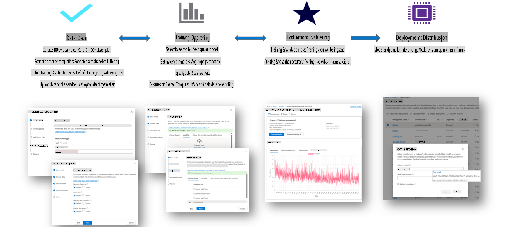

### Opprett et nytt prosjekt

1. Logg inn på [Azure AI Foundry](https://ai.azure.com).

2. Velg **+Nytt prosjekt** for å opprette et nytt prosjekt i Azure AI Foundry.

    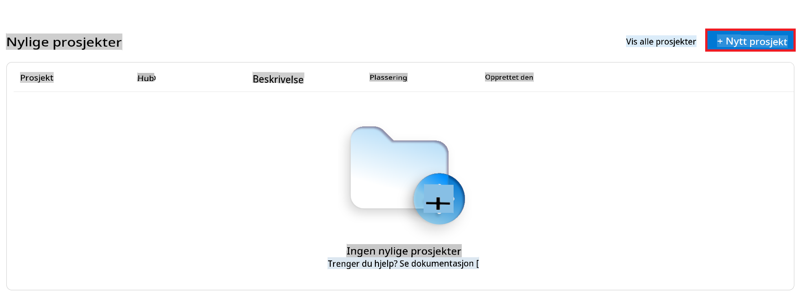

3. Utfør følgende oppgaver:

    - Angi et unikt **Hub-navn** for prosjektet.
    - Velg **Hub** du vil bruke (opprett en ny hvis nødvendig).

    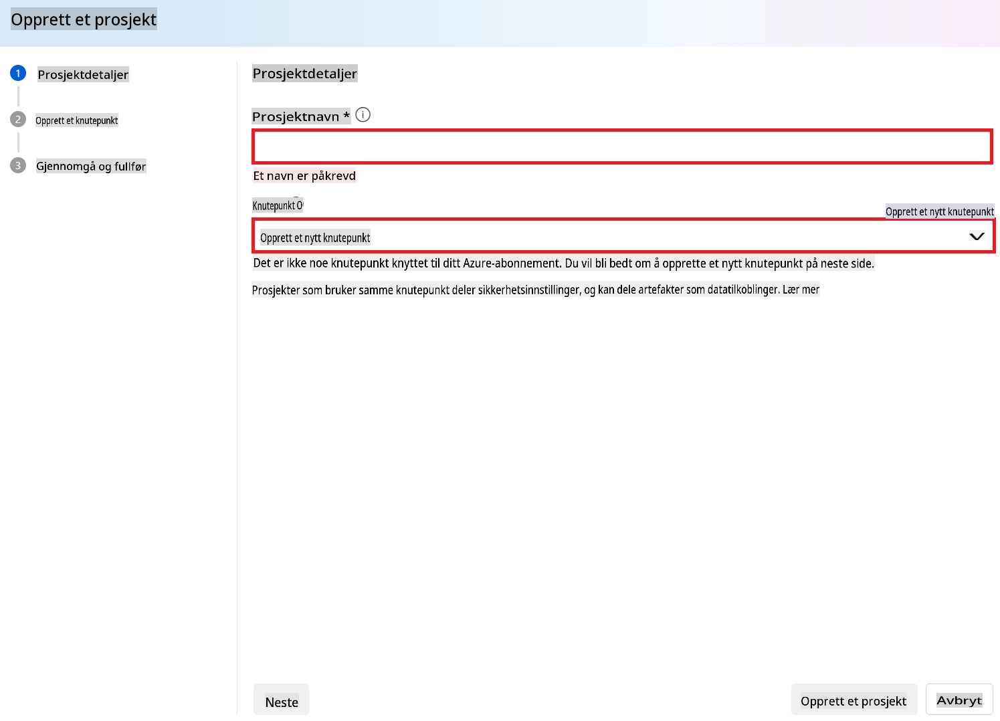

4. Utfør følgende oppgaver for å opprette en ny hub:

    - Angi et unikt **Hub-navn**.
    - Velg din Azure **Abonnement**.
    - Velg **Ressursgruppe** (opprett en ny hvis nødvendig).
    - Velg **Lokasjon** du ønsker å bruke.
    - Velg **Koble til Azure AI Services** (opprett en ny hvis nødvendig).
    - Velg **Koble til Azure AI Search** og velg **Hopp over tilkobling**.

    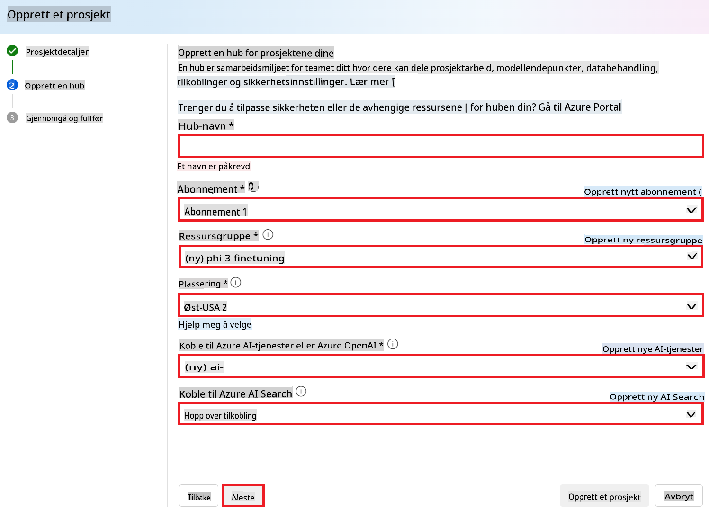

5. Velg **Neste**.
6. Velg **Opprett et prosjekt**.

### Forberedelse av data

Før finjustering, samle inn eller opprett et datasett som er relevant for oppgaven din, for eksempel samtaleinstruksjoner, spørsmål-svar-par eller annen relevant tekstdata. Rens og forbehandle dataene ved å fjerne støy, håndtere manglende verdier og tokenisere teksten.

### Finjuster Phi-3-modeller i Azure AI Foundry

> [!NOTE]
> Finjustering av Phi-3-modeller støttes foreløpig kun i prosjekter lokalisert i East US 2.

1. Velg **Modellkatalog** fra menyen til venstre.

2. Skriv *phi-3* i **søkelinjen** og velg Phi-3-modellen du vil bruke.

    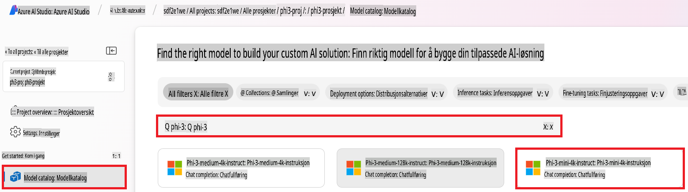

3. Velg **Finjuster**.

    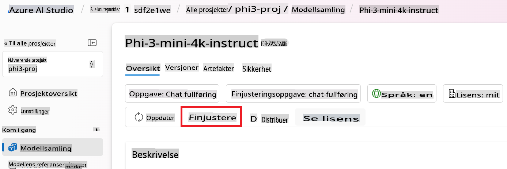

4. Angi et navn for **Finjustert modell**.

    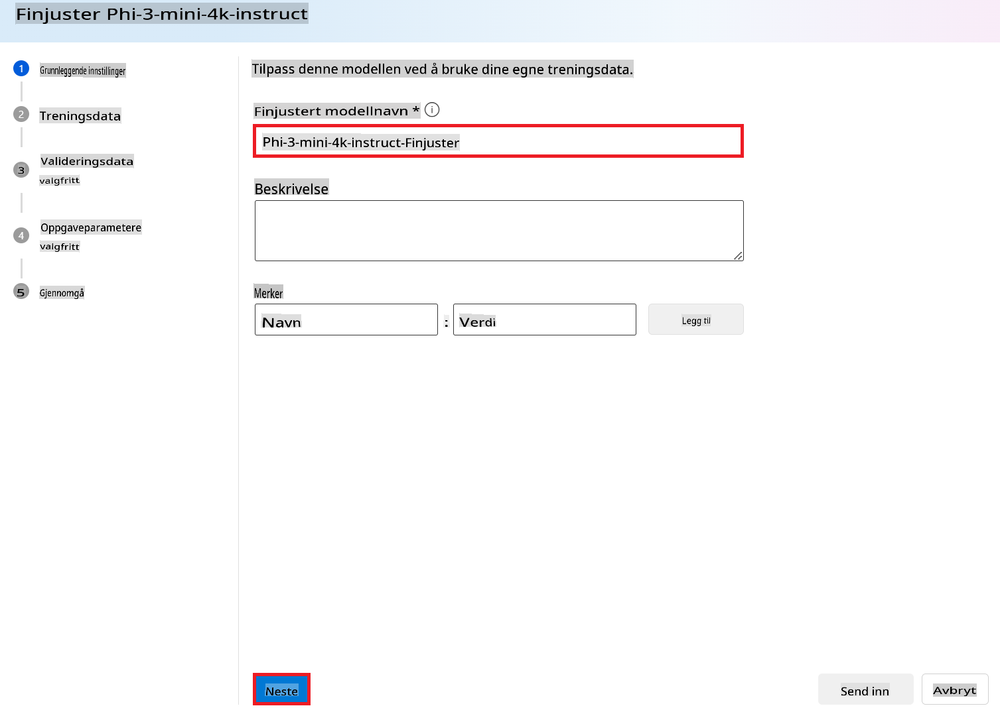

5. Velg **Neste**.

6. Utfør følgende oppgaver:

    - Velg **Oppgave-type** som **Chat-komplettering**.
    - Velg **Treningsdata** du ønsker å bruke. Du kan laste det opp gjennom Azure AI Foundry eller fra ditt lokale miljø.

    

7. Velg **Neste**.

8. Last opp **Valideringsdata** du ønsker å bruke, eller velg **Automatisk splitting av treningsdata**.

    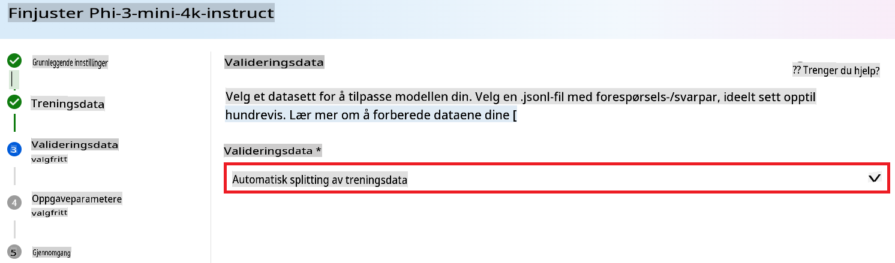

9. Velg **Neste**.

10. Utfør følgende oppgaver:

    - Velg **Batch-størrelse multipliserer** du ønsker å bruke.
    - Velg **Læringsrate** du ønsker å bruke.
    - Velg antall **Epoker** du ønsker å bruke.

    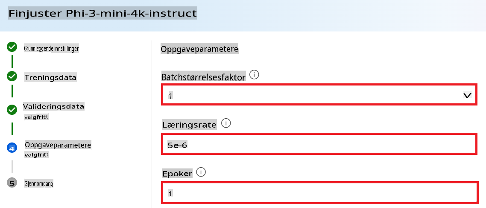

11. Velg **Send inn** for å starte finjusteringsprosessen.

    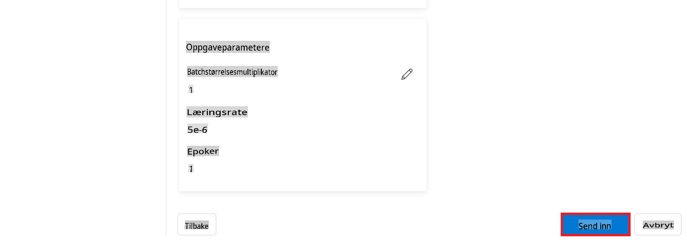

12. Når modellen din er finjustert, vil statusen vises som **Fullført**, som vist på bildet nedenfor. Nå kan du distribuere modellen og bruke den i din egen applikasjon, i testmiljøet eller i prompt flow. For mer informasjon, se [Hvordan distribuere Phi-3-modeller med Azure AI Foundry](https://learn.microsoft.com/azure/ai-studio/how-to/deploy-models-phi-3?tabs=phi-3-5&pivots=programming-language-python).

    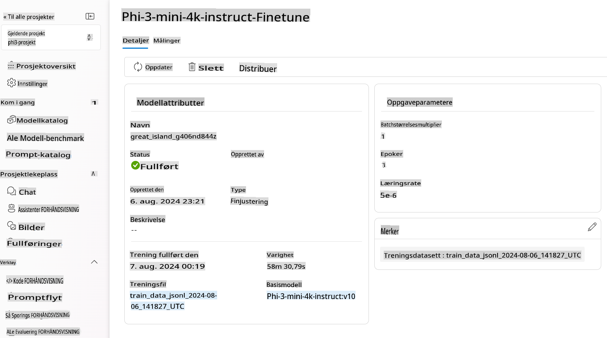

> [!NOTE]
> For mer detaljert informasjon om finjustering av Phi-3, besøk [Finjuster Phi-3-modeller i Azure AI Foundry](https://learn.microsoft.com/azure/ai-studio/how-to/fine-tune-phi-3?tabs=phi-3-mini).

## Rydding opp i finjusterte modeller

Du kan slette en finjustert modell fra listen over finjusterte modeller i [Azure AI Foundry](https://ai.azure.com) eller fra modellens detaljside. Velg den finjusterte modellen du vil slette fra siden for finjustering, og trykk deretter på Slett-knappen for å fjerne modellen.

> [!NOTE]
> Du kan ikke slette en tilpasset modell hvis den har en eksisterende distribusjon. Du må først slette modellens distribusjon før du kan slette den tilpassede modellen.

## Kostnad og kvoter

### Kostnads- og kvotebetraktninger for Phi-3-modeller finjustert som en tjeneste

Phi-modeller finjustert som en tjeneste tilbys av Microsoft og er integrert med Azure AI Foundry. Du finner prisinformasjonen når du [distribuerer](https://learn.microsoft.com/azure/ai-studio/how-to/deploy-models-phi-3?tabs=phi-3-5&pivots=programming-language-python) eller finjusterer modellene under fanen for Pris og vilkår i distribusjonsveiviseren.

## Innholdsfiltrering

Modeller distribuert som en tjeneste med pay-as-you-go er beskyttet av Azure AI Content Safety. Når de distribueres til sanntidsendepunkter, kan du velge å deaktivere denne funksjonen. Med Azure AI Content Safety aktivert, vil både prompt og respons passere gjennom en rekke klassifiseringsmodeller som har som mål å oppdage og forhindre skadelig innhold. Systemet for innholdsfiltrering oppdager og tar affære mot spesifikke kategorier av potensielt skadelig innhold i både input og output. Les mer om [Azure AI Content Safety](https://learn.microsoft.com/azure/ai-studio/concepts/content-filtering).

**Finjusteringskonfigurasjon**

Hyperparametere: Definer hyperparametere som læringsrate, batch-størrelse og antall trenings-epoker.

**Tapfunksjon**

Velg en passende tapfunksjon for oppgaven din (f.eks. kryssentropi).

**Optimaliseringsalgoritme**

Velg en optimaliseringsalgoritme (f.eks. Adam) for gradientoppdateringer under trening.

**Finjusteringsprosess**

- Last inn forhåndstrent modell: Last inn Phi-3 Mini-sjekkpunktet.
- Legg til tilpassede lag: Legg til oppgavespesifikke lag (f.eks. klassifikasjonshode for samtaleinstruksjoner).

**Tren modellen**
Finjuster modellen ved hjelp av det forberedte datasettet ditt. Overvåk treningsprogresjonen og juster hyperparametere etter behov.

**Evaluering og validering**

Valideringssett: Del opp dataene dine i trenings- og valideringssett.

**Evaluer ytelsen**

Bruk målemetoder som nøyaktighet, F1-score eller perplexity for å vurdere modellens ytelse.

## Lagre finjustert modell

**Sjekkpunkt**
Lagre sjekkpunktet for den finjusterte modellen for fremtidig bruk.

## Distribusjon

- Distribuer som en webtjeneste: Distribuer den finjusterte modellen din som en webtjeneste i Azure AI Foundry.
- Test endepunktet: Send testforespørsler til det distribuerte endepunktet for å bekrefte funksjonaliteten.

## Iterasjon og forbedring

Iterer: Hvis ytelsen ikke er tilfredsstillende, iterer ved å justere hyperparametere, legge til mer data eller finjustere for flere epoker.

## Overvåk og forbedre

Overvåk kontinuerlig modellens oppførsel og gjør forbedringer etter behov.

## Tilpass og utvid

Tilpassede oppgaver: Phi-3 Mini kan finjusteres for ulike oppgaver utover samtaleinstruksjoner. Utforsk andre bruksområder!
Eksperimenter: Prøv ulike arkitekturer, lagkombinasjoner og teknikker for å forbedre ytelsen.

> [!NOTE]
> Finjustering er en iterativ prosess. Eksperimenter, lær og tilpass modellen din for å oppnå de beste resultatene for din spesifikke oppgave!

**Ansvarsfraskrivelse**:  
Dette dokumentet er oversatt ved hjelp av maskinbaserte AI-oversettelsestjenester. Selv om vi tilstreber nøyaktighet, vær oppmerksom på at automatiserte oversettelser kan inneholde feil eller unøyaktigheter. Det originale dokumentet på sitt opprinnelige språk bør betraktes som den autoritative kilden. For kritisk informasjon anbefales profesjonell menneskelig oversettelse. Vi er ikke ansvarlige for eventuelle misforståelser eller feiltolkninger som oppstår ved bruk av denne oversettelsen.