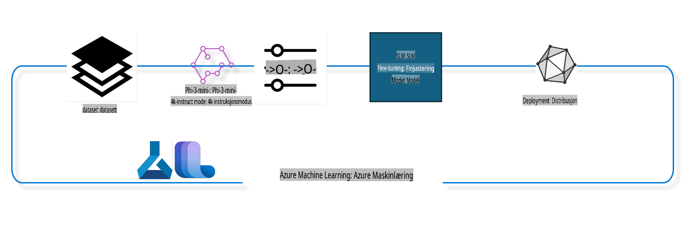

## Hvordan bruke chat-kompletteringskomponenter fra Azure ML-systemregisteret for å finjustere en modell

I dette eksemplet skal vi finjustere Phi-3-mini-4k-instruct-modellen for å fullføre en samtale mellom to personer ved hjelp av ultrachat_200k-datasettet.



Eksemplet viser hvordan du kan utføre finjustering ved hjelp av Azure ML SDK og Python, og deretter distribuere den finjusterte modellen til et online endepunkt for sanntidsinferens.

### Treningsdata

Vi skal bruke ultrachat_200k-datasettet. Dette er en sterkt filtrert versjon av UltraChat-datasettet og ble brukt til å trene Zephyr-7B-β, en avansert 7B-chatmodell.

### Modell

Vi skal bruke Phi-3-mini-4k-instruct-modellen for å vise hvordan brukeren kan finjustere en modell for chat-kompletteringsoppgaver. Hvis du har åpnet denne notatboken fra et spesifikt modellkort, husk å erstatte det spesifikke modellnavnet.

### Oppgaver

- Velg en modell for finjustering.
- Velg og utforsk treningsdata.
- Konfigurer finjusteringsjobben.
- Kjør finjusteringsjobben.
- Gjennomgå trenings- og evalueringsmetrikker.
- Registrer den finjusterte modellen.
- Distribuer den finjusterte modellen for sanntidsinferens.
- Rydd opp i ressurser.

## 1. Sett opp forutsetninger

- Installer avhengigheter.
- Koble til AzureML Workspace. Les mer på sett opp SDK-autentisering. Erstatt <WORKSPACE_NAME>, <RESOURCE_GROUP> og <SUBSCRIPTION_ID> nedenfor.
- Koble til AzureML systemregister.
- Angi et valgfritt eksperimentnavn.
- Sjekk eller opprett beregningsressurser.

> [!NOTE]
> Krav: En enkelt GPU-node kan ha flere GPU-kort. For eksempel, i én node av Standard_NC24rs_v3 er det 4 NVIDIA V100 GPU-er, mens i Standard_NC12s_v3 er det 2 NVIDIA V100 GPU-er. Se dokumentasjonen for mer informasjon. Antallet GPU-kort per node settes i parameteren gpus_per_node nedenfor. Å sette denne verdien korrekt vil sikre utnyttelse av alle GPU-er i noden. Anbefalte GPU-beregnings-SKU-er finner du her og her.

### Python-biblioteker

Installer avhengigheter ved å kjøre cellen nedenfor. Dette er ikke et valgfritt trinn hvis du kjører i et nytt miljø.

```bash
pip install azure-ai-ml
pip install azure-identity
pip install datasets==2.9.0
pip install mlflow
pip install azureml-mlflow
```

### Samhandling med Azure ML

1. Dette Python-skriptet brukes til å samhandle med Azure Machine Learning (Azure ML)-tjenesten. Her er en oversikt over hva det gjør:

    - Importerer nødvendige moduler fra azure.ai.ml, azure.identity og azure.ai.ml.entities-pakkene. Importerer også time-modulen.

    - Prøver å autentisere ved hjelp av DefaultAzureCredential(), som gir en forenklet autentiseringsopplevelse for raskt å starte utvikling av applikasjoner i Azure-skyen. Hvis dette feiler, faller det tilbake til InteractiveBrowserCredential(), som gir en interaktiv innloggingsprompt.

    - Oppretter en MLClient-instans ved hjelp av from_config-metoden, som leser konfigurasjonen fra standard konfigurasjonsfil (config.json). Hvis dette feiler, oppretter det en MLClient-instans ved manuelt å oppgi subscription_id, resource_group_name og workspace_name.

    - Oppretter en annen MLClient-instans, denne gangen for Azure ML-registeret kalt "azureml". Dette registeret er der modeller, finjusteringsrørledninger og miljøer lagres.

    - Setter eksperimentnavnet til "chat_completion_Phi-3-mini-4k-instruct".

    - Genererer et unikt tidsstempel ved å konvertere nåværende tid (i sekunder siden epoken, som et flyttall) til et heltall og deretter til en streng. Dette tidsstempelet kan brukes til å lage unike navn og versjoner.

    ```python
    # Import necessary modules from Azure ML and Azure Identity
    from azure.ai.ml import MLClient
    from azure.identity import (
        DefaultAzureCredential,
        InteractiveBrowserCredential,
    )
    from azure.ai.ml.entities import AmlCompute
    import time  # Import time module
    
    # Try to authenticate using DefaultAzureCredential
    try:
        credential = DefaultAzureCredential()
        credential.get_token("https://management.azure.com/.default")
    except Exception as ex:  # If DefaultAzureCredential fails, use InteractiveBrowserCredential
        credential = InteractiveBrowserCredential()
    
    # Try to create an MLClient instance using the default config file
    try:
        workspace_ml_client = MLClient.from_config(credential=credential)
    except:  # If that fails, create an MLClient instance by manually providing the details
        workspace_ml_client = MLClient(
            credential,
            subscription_id="<SUBSCRIPTION_ID>",
            resource_group_name="<RESOURCE_GROUP>",
            workspace_name="<WORKSPACE_NAME>",
        )
    
    # Create another MLClient instance for the Azure ML registry named "azureml"
    # This registry is where models, fine-tuning pipelines, and environments are stored
    registry_ml_client = MLClient(credential, registry_name="azureml")
    
    # Set the experiment name
    experiment_name = "chat_completion_Phi-3-mini-4k-instruct"
    
    # Generate a unique timestamp that can be used for names and versions that need to be unique
    timestamp = str(int(time.time()))
    ```

## 2. Velg en grunnmodell for finjustering

1. Phi-3-mini-4k-instruct er en lettvektsmodell med 3,8 milliarder parametere, bygget på datasett brukt for Phi-2. Modellen tilhører Phi-3-modellfamilien, og Mini-versjonen kommer i to varianter: 4K og 128K, som er kontekstens lengde (i tokens) den kan støtte. Vi må finjustere modellen for vårt spesifikke formål for å kunne bruke den. Du kan bla gjennom disse modellene i Model Catalog i AzureML Studio, ved å filtrere etter chat-kompletteringsoppgaver. I dette eksemplet bruker vi Phi-3-mini-4k-instruct-modellen. Hvis du har åpnet denne notatboken for en annen modell, erstatt modellnavn og versjon tilsvarende.

    > [!NOTE]
    > Modellens id-egenskap. Dette vil bli sendt som input til finjusteringsjobben. Dette er også tilgjengelig som Asset ID-feltet på modelsiden i AzureML Studio Model Catalog.

2. Dette Python-skriptet samhandler med Azure Machine Learning (Azure ML)-tjenesten. Her er en oversikt over hva det gjør:

    - Setter model_name til "Phi-3-mini-4k-instruct".

    - Bruker get-metoden til models-egenskapen til registry_ml_client-objektet for å hente den nyeste versjonen av modellen med det spesifiserte navnet fra Azure ML-registeret. Get-metoden kalles med to argumenter: modellnavnet og en etikett som spesifiserer at den nyeste versjonen av modellen skal hentes.

    - Skriver en melding til konsollen som angir navnet, versjonen og id-en til modellen som skal brukes for finjustering. Format-metoden til strengen brukes til å sette inn modellens navn, versjon og id i meldingen. Navn, versjon og id til modellen nås som egenskaper til foundation_model-objektet.

    ```python
    # Set the model name
    model_name = "Phi-3-mini-4k-instruct"
    
    # Get the latest version of the model from the Azure ML registry
    foundation_model = registry_ml_client.models.get(model_name, label="latest")
    
    # Print the model name, version, and id
    # This information is useful for tracking and debugging
    print(
        "\n\nUsing model name: {0}, version: {1}, id: {2} for fine tuning".format(
            foundation_model.name, foundation_model.version, foundation_model.id
        )
    )
    ```

## 3. Opprett en beregningsressurs som skal brukes med jobben

Finjusteringsjobben fungerer KUN med GPU-beregningsressurser. Størrelsen på ressursen avhenger av hvor stor modellen er, og i de fleste tilfeller kan det være utfordrende å identifisere riktig ressurs for jobben. I denne cellen veileder vi brukeren til å velge riktig ressurs for jobben.

> [!NOTE]
> Ressursene som er listet opp nedenfor fungerer med den mest optimaliserte konfigurasjonen. Eventuelle endringer i konfigurasjonen kan føre til Cuda Out Of Memory-feil. I slike tilfeller kan du prøve å oppgradere ressursen til en større størrelse.

> [!NOTE]
> Når du velger compute_cluster_size nedenfor, må du forsikre deg om at ressursen er tilgjengelig i din ressursgruppe. Hvis en bestemt ressurs ikke er tilgjengelig, kan du sende inn en forespørsel om å få tilgang til ressursen.

### Sjekk om modellen støtter finjustering

1. Dette Python-skriptet samhandler med en Azure Machine Learning (Azure ML)-modell. Her er en oversikt over hva det gjør:

    - Importerer ast-modulen, som gir funksjoner for å behandle trær i Pythons abstrakte syntaksgrammatikk.

    - Sjekker om foundation_model-objektet (som representerer en modell i Azure ML) har en tag kalt finetune_compute_allow_list. Tager i Azure ML er nøkkel-verdi-par som du kan opprette og bruke for å filtrere og sortere modeller.

    - Hvis finetune_compute_allow_list-taggen er tilstede, bruker det ast.literal_eval-funksjonen til trygt å analysere taggens verdi (en streng) til en Python-liste. Denne listen tildeles deretter til computes_allow_list-variabelen. Deretter skriver det ut en melding som indikerer at en ressurs bør opprettes fra listen.

    - Hvis finetune_compute_allow_list-taggen ikke er tilstede, settes computes_allow_list til None, og det skrives ut en melding som indikerer at finetune_compute_allow_list-taggen ikke er en del av modellens metadata.

    - Oppsummert sjekker dette skriptet etter en spesifikk tag i modellens metadata, konverterer taggens verdi til en liste hvis den finnes, og gir tilbakemelding til brukeren deretter.

    ```python
    # Import the ast module, which provides functions to process trees of the Python abstract syntax grammar
    import ast
    
    # Check if the 'finetune_compute_allow_list' tag is present in the model's tags
    if "finetune_compute_allow_list" in foundation_model.tags:
        # If the tag is present, use ast.literal_eval to safely parse the tag's value (a string) into a Python list
        computes_allow_list = ast.literal_eval(
            foundation_model.tags["finetune_compute_allow_list"]
        )  # convert string to python list
        # Print a message indicating that a compute should be created from the list
        print(f"Please create a compute from the above list - {computes_allow_list}")
    else:
        # If the tag is not present, set computes_allow_list to None
        computes_allow_list = None
        # Print a message indicating that the 'finetune_compute_allow_list' tag is not part of the model's tags
        print("`finetune_compute_allow_list` is not part of model tags")
    ```

### Sjekk beregningsinstans

1. Dette Python-skriptet samhandler med Azure Machine Learning (Azure ML)-tjenesten og utfører flere kontroller på en beregningsinstans. Her er en oversikt over hva det gjør:

    - Prøver å hente beregningsinstansen med navnet lagret i compute_cluster fra Azure ML-arbeidsområdet. Hvis beregningsinstansens provisioning state er "failed", kaster det en ValueError.

    - Sjekker om computes_allow_list ikke er None. Hvis det ikke er det, konverterer det alle beregningsstørrelsene i listen til små bokstaver og sjekker om størrelsen på den nåværende beregningsinstansen er i listen. Hvis ikke, kaster det en ValueError.

    - Hvis computes_allow_list er None, sjekker det om størrelsen på beregningsinstansen er i en liste over ikke-støttede GPU VM-størrelser. Hvis det er det, kaster det en ValueError.

    - Henter en liste over alle tilgjengelige beregningsstørrelser i arbeidsområdet. Deretter itererer det over denne listen, og for hver beregningsstørrelse sjekker det om navnet samsvarer med størrelsen på den nåværende beregningsinstansen. Hvis det gjør det, henter det antall GPU-er for den beregningsstørrelsen og setter gpu_count_found til True.

    - Hvis gpu_count_found er True, skriver det ut antall GPU-er i beregningsinstansen. Hvis gpu_count_found er False, kaster det en ValueError.

    - Oppsummert utfører dette skriptet flere kontroller på en beregningsinstans i et Azure ML-arbeidsområde, inkludert kontroll av provisioning state, størrelse mot en tillatt liste eller en nektet liste, og antall GPU-er den har.

    ```python
    # Print the exception message
    print(e)
    # Raise a ValueError if the compute size is not available in the workspace
    raise ValueError(
        f"WARNING! Compute size {compute_cluster_size} not available in workspace"
    )
    
    # Retrieve the compute instance from the Azure ML workspace
    compute = workspace_ml_client.compute.get(compute_cluster)
    # Check if the provisioning state of the compute instance is "failed"
    if compute.provisioning_state.lower() == "failed":
        # Raise a ValueError if the provisioning state is "failed"
        raise ValueError(
            f"Provisioning failed, Compute '{compute_cluster}' is in failed state. "
            f"please try creating a different compute"
        )
    
    # Check if computes_allow_list is not None
    if computes_allow_list is not None:
        # Convert all compute sizes in computes_allow_list to lowercase
        computes_allow_list_lower_case = [x.lower() for x in computes_allow_list]
        # Check if the size of the compute instance is in computes_allow_list_lower_case
        if compute.size.lower() not in computes_allow_list_lower_case:
            # Raise a ValueError if the size of the compute instance is not in computes_allow_list_lower_case
            raise ValueError(
                f"VM size {compute.size} is not in the allow-listed computes for finetuning"
            )
    else:
        # Define a list of unsupported GPU VM sizes
        unsupported_gpu_vm_list = [
            "standard_nc6",
            "standard_nc12",
            "standard_nc24",
            "standard_nc24r",
        ]
        # Check if the size of the compute instance is in unsupported_gpu_vm_list
        if compute.size.lower() in unsupported_gpu_vm_list:
            # Raise a ValueError if the size of the compute instance is in unsupported_gpu_vm_list
            raise ValueError(
                f"VM size {compute.size} is currently not supported for finetuning"
            )
    
    # Initialize a flag to check if the number of GPUs in the compute instance has been found
    gpu_count_found = False
    # Retrieve a list of all available compute sizes in the workspace
    workspace_compute_sku_list = workspace_ml_client.compute.list_sizes()
    available_sku_sizes = []
    # Iterate over the list of available compute sizes
    for compute_sku in workspace_compute_sku_list:
        available_sku_sizes.append(compute_sku.name)
        # Check if the name of the compute size matches the size of the compute instance
        if compute_sku.name.lower() == compute.size.lower():
            # If it does, retrieve the number of GPUs for that compute size and set gpu_count_found to True
            gpus_per_node = compute_sku.gpus
            gpu_count_found = True
    # If gpu_count_found is True, print the number of GPUs in the compute instance
    if gpu_count_found:
        print(f"Number of GPU's in compute {compute.size}: {gpus_per_node}")
    else:
        # If gpu_count_found is False, raise a ValueError
        raise ValueError(
            f"Number of GPU's in compute {compute.size} not found. Available skus are: {available_sku_sizes}."
            f"This should not happen. Please check the selected compute cluster: {compute_cluster} and try again."
        )
    ```
### Konfigurere Pipeline

Dette Python-skriptet definerer og konfigurerer en maskinlæringspipeline ved hjelp av Azure Machine Learning SDK. Her er en oversikt over hva det gjør:

1. Importerer nødvendige moduler fra Azure AI ML SDK.  
2. Henter en pipeline-komponent kalt "chat_completion_pipeline" fra registeret.  
3. Definerer en pipeline-jobb ved hjelp av `@pipeline` decorator and the function `create_pipeline`. The name of the pipeline is set to `pipeline_display_name`.

1. Inside the `create_pipeline` function, it initializes the fetched pipeline component with various parameters, including the model path, compute clusters for different stages, dataset splits for training and testing, the number of GPUs to use for fine-tuning, and other fine-tuning parameters.

1. It maps the output of the fine-tuning job to the output of the pipeline job. This is done so that the fine-tuned model can be easily registered, which is required to deploy the model to an online or batch endpoint.

1. It creates an instance of the pipeline by calling the `create_pipeline` function.

1. It sets the `force_rerun` setting of the pipeline to `True`, meaning that cached results from previous jobs will not be used.

1. It sets the `continue_on_step_failure` setting of the pipeline to `False`, som betyr at pipelinen stopper hvis noen steg feiler.  

Oppsummert definerer og konfigurerer dette skriptet en maskinlæringspipeline for en chat-kompletteringsoppgave ved hjelp av Azure Machine Learning SDK.  

```python
    # Import necessary modules from the Azure AI ML SDK
    from azure.ai.ml.dsl import pipeline
    from azure.ai.ml import Input
    
    # Fetch the pipeline component named "chat_completion_pipeline" from the registry
    pipeline_component_func = registry_ml_client.components.get(
        name="chat_completion_pipeline", label="latest"
    )
    
    # Define the pipeline job using the @pipeline decorator and the function create_pipeline
    # The name of the pipeline is set to pipeline_display_name
    @pipeline(name=pipeline_display_name)
    def create_pipeline():
        # Initialize the fetched pipeline component with various parameters
        # These include the model path, compute clusters for different stages, dataset splits for training and testing, the number of GPUs to use for fine-tuning, and other fine-tuning parameters
        chat_completion_pipeline = pipeline_component_func(
            mlflow_model_path=foundation_model.id,
            compute_model_import=compute_cluster,
            compute_preprocess=compute_cluster,
            compute_finetune=compute_cluster,
            compute_model_evaluation=compute_cluster,
            # Map the dataset splits to parameters
            train_file_path=Input(
                type="uri_file", path="./ultrachat_200k_dataset/train_sft.jsonl"
            ),
            test_file_path=Input(
                type="uri_file", path="./ultrachat_200k_dataset/test_sft.jsonl"
            ),
            # Training settings
            number_of_gpu_to_use_finetuning=gpus_per_node,  # Set to the number of GPUs available in the compute
            **finetune_parameters
        )
        return {
            # Map the output of the fine tuning job to the output of pipeline job
            # This is done so that we can easily register the fine tuned model
            # Registering the model is required to deploy the model to an online or batch endpoint
            "trained_model": chat_completion_pipeline.outputs.mlflow_model_folder
        }
    
    # Create an instance of the pipeline by calling the create_pipeline function
    pipeline_object = create_pipeline()
    
    # Don't use cached results from previous jobs
    pipeline_object.settings.force_rerun = True
    
    # Set continue on step failure to False
    # This means that the pipeline will stop if any step fails
    pipeline_object.settings.continue_on_step_failure = False
    ```  

### Send inn jobben

1. Dette Python-skriptet sender inn en maskinlæringspipeline-jobb til et Azure Machine Learning-arbeidsområde og venter deretter på at jobben skal fullføres. Her er en oversikt over hva det gjør:

   - Bruker metoden `create_or_update` fra `jobs`-objektet i `workspace_ml_client` for å sende inn pipeline-jobben. Pipelinjen som skal kjøres, spesifiseres av `pipeline_object`, og eksperimentet som jobben tilhører, spesifiseres av `experiment_name`.  
   - Kaller metoden `stream` fra `jobs`-objektet i `workspace_ml_client` for å vente på at pipeline-jobben skal bli ferdig. Jobben som skal overvåkes, spesifiseres av `name`-attributtet til `pipeline_job`-objektet.  

Oppsummert sender dette skriptet inn en maskinlæringspipeline-jobb til et Azure Machine Learning-arbeidsområde og venter på at jobben skal fullføres.  

```python
    # Submit the pipeline job to the Azure Machine Learning workspace
    # The pipeline to be run is specified by pipeline_object
    # The experiment under which the job is run is specified by experiment_name
    pipeline_job = workspace_ml_client.jobs.create_or_update(
        pipeline_object, experiment_name=experiment_name
    )
    
    # Wait for the pipeline job to complete
    # The job to wait for is specified by the name attribute of the pipeline_job object
    workspace_ml_client.jobs.stream(pipeline_job.name)
    ```  

## 6. Registrere den finjusterte modellen i arbeidsområdet

Vi skal registrere modellen fra utdataene til finjusteringsjobben. Dette vil spore koblingen mellom den finjusterte modellen og finjusteringsjobben. Finjusteringsjobben sporer også koblingen til grunnmodellen, dataene og treningskoden.  

### Registrere ML-modellen

1. Dette Python-skriptet registrerer en maskinlæringsmodell som ble trent i en Azure Machine Learning-pipeline. Her er en oversikt over hva det gjør:

   - Importerer nødvendige moduler fra Azure AI ML SDK.  
   - Sjekker om `trained_model`-utdata er tilgjengelige fra pipeline-jobben ved å kalle metoden `get` fra `jobs`-objektet i `workspace_ml_client` og få tilgang til `outputs`-attributtet.  
   - Konstruerer en sti til den trente modellen ved å formatere en streng med navnet på pipeline-jobben og navnet på utdataene ("trained_model").  
   - Definerer et navn for den finjusterte modellen ved å legge til "-ultrachat-200k" til det opprinnelige modellnavnet og erstatte eventuelle skråstreker med bindestreker.  
   - Forbereder å registrere modellen ved å opprette et `Model`-objekt med ulike parametere, inkludert stien til modellen, typen modell (MLflow-modell), modellens navn og versjon, og en beskrivelse av modellen.  
   - Registrerer modellen ved å kalle metoden `create_or_update` fra `models`-objektet i `workspace_ml_client` med `Model`-objektet som argument.  
   - Skriver ut den registrerte modellen.  

Oppsummert registrerer dette skriptet en maskinlæringsmodell som ble trent i en Azure Machine Learning-pipeline.  

```python
    # Import necessary modules from the Azure AI ML SDK
    from azure.ai.ml.entities import Model
    from azure.ai.ml.constants import AssetTypes
    
    # Check if the `trained_model` output is available from the pipeline job
    print("pipeline job outputs: ", workspace_ml_client.jobs.get(pipeline_job.name).outputs)
    
    # Construct a path to the trained model by formatting a string with the name of the pipeline job and the name of the output ("trained_model")
    model_path_from_job = "azureml://jobs/{0}/outputs/{1}".format(
        pipeline_job.name, "trained_model"
    )
    
    # Define a name for the fine-tuned model by appending "-ultrachat-200k" to the original model name and replacing any slashes with hyphens
    finetuned_model_name = model_name + "-ultrachat-200k"
    finetuned_model_name = finetuned_model_name.replace("/", "-")
    
    print("path to register model: ", model_path_from_job)
    
    # Prepare to register the model by creating a Model object with various parameters
    # These include the path to the model, the type of the model (MLflow model), the name and version of the model, and a description of the model
    prepare_to_register_model = Model(
        path=model_path_from_job,
        type=AssetTypes.MLFLOW_MODEL,
        name=finetuned_model_name,
        version=timestamp,  # Use timestamp as version to avoid version conflict
        description=model_name + " fine tuned model for ultrachat 200k chat-completion",
    )
    
    print("prepare to register model: \n", prepare_to_register_model)
    
    # Register the model by calling the create_or_update method of the models object in the workspace_ml_client with the Model object as the argument
    registered_model = workspace_ml_client.models.create_or_update(
        prepare_to_register_model
    )
    
    # Print the registered model
    print("registered model: \n", registered_model)
    ```  

## 7. Distribuer den finjusterte modellen til et online endepunkt

Online endepunkter gir en varig REST API som kan integreres med applikasjoner som trenger å bruke modellen.  

### Administrere endepunkt

1. Dette Python-skriptet oppretter et administrert online endepunkt i Azure Machine Learning for en registrert modell. Her er en oversikt over hva det gjør:

   - Importerer nødvendige moduler fra Azure AI ML SDK.  
   - Definerer et unikt navn for det online endepunktet ved å legge til et tidsstempel til strengen "ultrachat-completion-".  
   - Forbereder å opprette det online endepunktet ved å opprette et `ManagedOnlineEndpoint`-objekt med ulike parametere, inkludert navnet på endepunktet, en beskrivelse av endepunktet og autentiseringsmodus ("key").  
   - Oppretter det online endepunktet ved å kalle metoden `begin_create_or_update` fra `workspace_ml_client` med `ManagedOnlineEndpoint`-objektet som argument. Venter deretter på at opprettelsen skal fullføres ved å kalle metoden `wait`.  

Oppsummert oppretter dette skriptet et administrert online endepunkt i Azure Machine Learning for en registrert modell.  

```python
    # Import necessary modules from the Azure AI ML SDK
    from azure.ai.ml.entities import (
        ManagedOnlineEndpoint,
        ManagedOnlineDeployment,
        ProbeSettings,
        OnlineRequestSettings,
    )
    
    # Define a unique name for the online endpoint by appending a timestamp to the string "ultrachat-completion-"
    online_endpoint_name = "ultrachat-completion-" + timestamp
    
    # Prepare to create the online endpoint by creating a ManagedOnlineEndpoint object with various parameters
    # These include the name of the endpoint, a description of the endpoint, and the authentication mode ("key")
    endpoint = ManagedOnlineEndpoint(
        name=online_endpoint_name,
        description="Online endpoint for "
        + registered_model.name
        + ", fine tuned model for ultrachat-200k-chat-completion",
        auth_mode="key",
    )
    
    # Create the online endpoint by calling the begin_create_or_update method of the workspace_ml_client with the ManagedOnlineEndpoint object as the argument
    # Then wait for the creation operation to complete by calling the wait method
    workspace_ml_client.begin_create_or_update(endpoint).wait()
    ```  

> [!NOTE]  
> Du finner en liste over SKU-er som støttes for distribusjon her: [Managed online endpoints SKU list](https://learn.microsoft.com/azure/machine-learning/reference-managed-online-endpoints-vm-sku-list)  

### Distribuere ML-modell

1. Dette Python-skriptet distribuerer en registrert maskinlæringsmodell til et administrert online endepunkt i Azure Machine Learning. Her er en oversikt over hva det gjør:

   - Importerer `ast`-modulen, som gir funksjoner for å behandle Python-syntakstrær.  
   - Setter instanstypen for distribusjonen til "Standard_NC6s_v3".  
   - Sjekker om `inference_compute_allow_list`-taggen er til stede i grunnmodellen. Hvis den er det, konverterer den taggverdien fra en streng til en Python-liste og tildeler den til `inference_computes_allow_list`. Hvis ikke, settes `inference_computes_allow_list` til `None`.  
   - Sjekker om den spesifiserte instanstypen er i tillatelseslisten. Hvis ikke, skriver den ut en melding som ber brukeren velge en instanstype fra tillatelseslisten.  
   - Forbereder å opprette distribusjonen ved å opprette et `ManagedOnlineDeployment`-objekt med ulike parametere, inkludert navnet på distribusjonen, navnet på endepunktet, modellens ID, instanstype og antall, innstillinger for liveness-probe og forespørselsinnstillinger.  
   - Oppretter distribusjonen ved å kalle metoden `begin_create_or_update` fra `workspace_ml_client` med `ManagedOnlineDeployment`-objektet som argument. Venter deretter på at opprettelsen skal fullføres ved å kalle metoden `wait`.  
   - Setter trafikken til endepunktet til å dirigere 100 % av trafikken til "demo"-distribusjonen.  
   - Oppdaterer endepunktet ved å kalle metoden `begin_create_or_update` fra `workspace_ml_client` med `endpoint`-objektet som argument. Venter deretter på at oppdateringen skal fullføres ved å kalle metoden `result`.  

Oppsummert distribuerer dette skriptet en registrert maskinlæringsmodell til et administrert online endepunkt i Azure Machine Learning.  

```python
    # Import the ast module, which provides functions to process trees of the Python abstract syntax grammar
    import ast
    
    # Set the instance type for the deployment
    instance_type = "Standard_NC6s_v3"
    
    # Check if the `inference_compute_allow_list` tag is present in the foundation model
    if "inference_compute_allow_list" in foundation_model.tags:
        # If it is, convert the tag value from a string to a Python list and assign it to `inference_computes_allow_list`
        inference_computes_allow_list = ast.literal_eval(
            foundation_model.tags["inference_compute_allow_list"]
        )
        print(f"Please create a compute from the above list - {computes_allow_list}")
    else:
        # If it's not, set `inference_computes_allow_list` to `None`
        inference_computes_allow_list = None
        print("`inference_compute_allow_list` is not part of model tags")
    
    # Check if the specified instance type is in the allow list
    if (
        inference_computes_allow_list is not None
        and instance_type not in inference_computes_allow_list
    ):
        print(
            f"`instance_type` is not in the allow listed compute. Please select a value from {inference_computes_allow_list}"
        )
    
    # Prepare to create the deployment by creating a `ManagedOnlineDeployment` object with various parameters
    demo_deployment = ManagedOnlineDeployment(
        name="demo",
        endpoint_name=online_endpoint_name,
        model=registered_model.id,
        instance_type=instance_type,
        instance_count=1,
        liveness_probe=ProbeSettings(initial_delay=600),
        request_settings=OnlineRequestSettings(request_timeout_ms=90000),
    )
    
    # Create the deployment by calling the `begin_create_or_update` method of the `workspace_ml_client` with the `ManagedOnlineDeployment` object as the argument
    # Then wait for the creation operation to complete by calling the `wait` method
    workspace_ml_client.online_deployments.begin_create_or_update(demo_deployment).wait()
    
    # Set the traffic of the endpoint to direct 100% of the traffic to the "demo" deployment
    endpoint.traffic = {"demo": 100}
    
    # Update the endpoint by calling the `begin_create_or_update` method of the `workspace_ml_client` with the `endpoint` object as the argument
    # Then wait for the update operation to complete by calling the `result` method
    workspace_ml_client.begin_create_or_update(endpoint).result()
    ```  

## 8. Test endepunktet med eksempeldata

Vi vil hente noen eksempeldata fra testdatasettet og sende dem til det online endepunktet for inferens. Vi vil deretter vise de scorede etikettene sammen med de faktiske etikettene.  

### Lese resultatene

1. Dette Python-skriptet leser en JSON Lines-fil inn i en pandas DataFrame, tar et tilfeldig utvalg, og tilbakestiller indeksen. Her er en oversikt over hva det gjør:

   - Leser filen `./ultrachat_200k_dataset/test_gen.jsonl` inn i en pandas DataFrame. Funksjonen `read_json` brukes med argumentet `lines=True`, siden filen er i JSON Lines-format, hvor hver linje er et separat JSON-objekt.  
   - Tar et tilfeldig utvalg av én rad fra DataFrame. Funksjonen `sample` brukes med argumentet `n=1` for å spesifisere antall tilfeldige rader som skal velges.  
   - Tilbakestiller indeksen til DataFrame. Funksjonen `reset_index` brukes med argumentet `drop=True` for å fjerne den opprinnelige indeksen og erstatte den med en ny indeks med standard heltallsverdier.  
   - Viser de første to radene i DataFrame ved hjelp av funksjonen `head` med argumentet `2`. Men siden DataFrame kun inneholder én rad etter utvalget, vil dette bare vise den ene raden.  

Oppsummert leser dette skriptet en JSON Lines-fil inn i en pandas DataFrame, tar et tilfeldig utvalg av én rad, tilbakestiller indeksen og viser den første raden.  

```python
    # Import pandas library
    import pandas as pd
    
    # Read the JSON Lines file './ultrachat_200k_dataset/test_gen.jsonl' into a pandas DataFrame
    # The 'lines=True' argument indicates that the file is in JSON Lines format, where each line is a separate JSON object
    test_df = pd.read_json("./ultrachat_200k_dataset/test_gen.jsonl", lines=True)
    
    # Take a random sample of 1 row from the DataFrame
    # The 'n=1' argument specifies the number of random rows to select
    test_df = test_df.sample(n=1)
    
    # Reset the index of the DataFrame
    # The 'drop=True' argument indicates that the original index should be dropped and replaced with a new index of default integer values
    # The 'inplace=True' argument indicates that the DataFrame should be modified in place (without creating a new object)
    test_df.reset_index(drop=True, inplace=True)
    
    # Display the first 2 rows of the DataFrame
    # However, since the DataFrame only contains one row after the sampling, this will only display that one row
    test_df.head(2)
    ```  

### Opprette JSON-objekt

1. Dette Python-skriptet oppretter et JSON-objekt med spesifikke parametere og lagrer det i en fil. Her er en oversikt over hva det gjør:

   - Importerer `json`-modulen, som gir funksjoner for å arbeide med JSON-data.  
   - Oppretter en ordbok `parameters` med nøkler og verdier som representerer parametere for en maskinlæringsmodell. Nøklene er "temperature", "top_p", "do_sample" og "max_new_tokens", og deres tilsvarende verdier er henholdsvis 0.6, 0.9, True og 200.  
   - Oppretter en annen ordbok `test_json` med to nøkler: "input_data" og "params". Verdien av "input_data" er en annen ordbok med nøklene "input_string" og "parameters". Verdien av "input_string" er en liste som inneholder den første meldingen fra `test_df` DataFrame. Verdien av "parameters" er ordboken `parameters` opprettet tidligere. Verdien av "params" er en tom ordbok.  
   - Åpner en fil med navnet `sample_score.json`.  

```python
    # Import the json module, which provides functions to work with JSON data
    import json
    
    # Create a dictionary `parameters` with keys and values that represent parameters for a machine learning model
    # The keys are "temperature", "top_p", "do_sample", and "max_new_tokens", and their corresponding values are 0.6, 0.9, True, and 200 respectively
    parameters = {
        "temperature": 0.6,
        "top_p": 0.9,
        "do_sample": True,
        "max_new_tokens": 200,
    }
    
    # Create another dictionary `test_json` with two keys: "input_data" and "params"
    # The value of "input_data" is another dictionary with keys "input_string" and "parameters"
    # The value of "input_string" is a list containing the first message from the `test_df` DataFrame
    # The value of "parameters" is the `parameters` dictionary created earlier
    # The value of "params" is an empty dictionary
    test_json = {
        "input_data": {
            "input_string": [test_df["messages"][0]],
            "parameters": parameters,
        },
        "params": {},
    }
    
    # Open a file named `sample_score.json` in the `./ultrachat_200k_dataset` directory in write mode
    with open("./ultrachat_200k_dataset/sample_score.json", "w") as f:
        # Write the `test_json` dictionary to the file in JSON format using the `json.dump` function
        json.dump(test_json, f)
    ```  

### Kalle endepunkt

1. Dette Python-skriptet kaller et online endepunkt i Azure Machine Learning for å score en JSON-fil. Her er en oversikt over hva det gjør:

   - Kaller metoden `invoke` fra `online_endpoints`-egenskapen til `workspace_ml_client`-objektet. Denne metoden brukes til å sende en forespørsel til et online endepunkt og få et svar.  
   - Spesifiserer navnet på endepunktet og distribusjonen med argumentene `endpoint_name` og `deployment_name`. I dette tilfellet lagres endepunktnavnet i variabelen `online_endpoint_name`, og distribusjonsnavnet er "demo".  
   - Spesifiserer stien til JSON-filen som skal scores, med argumentet `request_file`. I dette tilfellet er filen `./ultrachat_200k_dataset/sample_score.json`.  
   - Lagrer svaret fra endepunktet i variabelen `response`.  
   - Skriver ut det rå svaret.  

Oppsummert kaller dette skriptet et online endepunkt i Azure Machine Learning for å score en JSON-fil og skriver ut svaret.  

```python
    # Invoke the online endpoint in Azure Machine Learning to score the `sample_score.json` file
    # The `invoke` method of the `online_endpoints` property of the `workspace_ml_client` object is used to send a request to an online endpoint and get a response
    # The `endpoint_name` argument specifies the name of the endpoint, which is stored in the `online_endpoint_name` variable
    # The `deployment_name` argument specifies the name of the deployment, which is "demo"
    # The `request_file` argument specifies the path to the JSON file to be scored, which is `./ultrachat_200k_dataset/sample_score.json`
    response = workspace_ml_client.online_endpoints.invoke(
        endpoint_name=online_endpoint_name,
        deployment_name="demo",
        request_file="./ultrachat_200k_dataset/sample_score.json",
    )
    
    # Print the raw response from the endpoint
    print("raw response: \n", response, "\n")
    ```  

## 9. Slett det online endepunktet

1. Husk å slette det online endepunktet, ellers vil du fortsette å bli belastet for beregningen som brukes av endepunktet. Denne linjen med Python-kode sletter et online endepunkt i Azure Machine Learning. Her er en oversikt over hva det gjør:

   - Kaller metoden `begin_delete` fra `online_endpoints`-egenskapen til `workspace_ml_client`-objektet. Denne metoden brukes til å starte slettingen av et online endepunkt.  
   - Spesifiserer navnet på endepunktet som skal slettes, med argumentet `name`. I dette tilfellet lagres endepunktnavnet i variabelen `online_endpoint_name`.  
   - Kaller metoden `wait` for å vente på at slettingen skal fullføres. Dette er en blokkerende operasjon, noe som betyr at skriptet ikke vil fortsette før slettingen er ferdig.  

Oppsummert starter denne kodelinjen slettingen av et online endepunkt i Azure Machine Learning og venter på at operasjonen skal fullføres.  

```python
    # Delete the online endpoint in Azure Machine Learning
    # The `begin_delete` method of the `online_endpoints` property of the `workspace_ml_client` object is used to start the deletion of an online endpoint
    # The `name` argument specifies the name of the endpoint to be deleted, which is stored in the `online_endpoint_name` variable
    # The `wait` method is called to wait for the deletion operation to complete. This is a blocking operation, meaning that it will prevent the script from continuing until the deletion is finished
    workspace_ml_client.online_endpoints.begin_delete(name=online_endpoint_name).wait()
    ```  

**Ansvarsfraskrivelse**:  
Dette dokumentet er oversatt ved hjelp av maskinbaserte AI-oversettelsestjenester. Selv om vi bestreber oss på nøyaktighet, vennligst vær oppmerksom på at automatiserte oversettelser kan inneholde feil eller unøyaktigheter. Det originale dokumentet på sitt opprinnelige språk bør betraktes som den autoritative kilden. For kritisk informasjon anbefales profesjonell menneskelig oversettelse. Vi er ikke ansvarlige for eventuelle misforståelser eller feiltolkninger som oppstår ved bruk av denne oversettelsen.