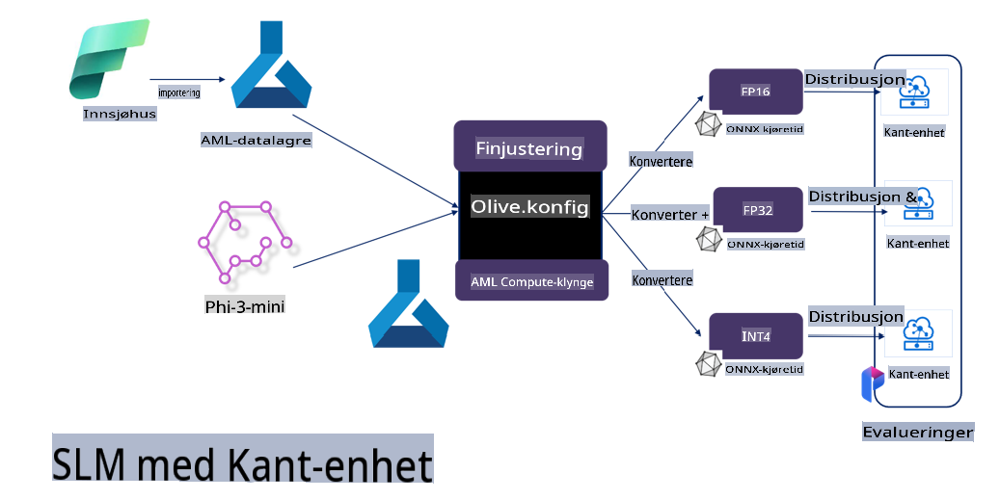

# **Finjustering av Phi-3 med Microsoft Olive**

[Olive](https://github.com/microsoft/OLive?WT.mc_id=aiml-138114-kinfeylo) er et brukervennlig verktøy for maskinvarebevisst modelloptimalisering som samler bransjeledende teknikker innen modellkompresjon, optimalisering og kompilering.

Det er designet for å forenkle prosessen med å optimalisere maskinlæringsmodeller, slik at de utnytter spesifikke maskinvarearkitekturer mest mulig effektivt.

Enten du jobber med skybaserte applikasjoner eller kant-enheter, gjør Olive det enkelt og effektivt å optimalisere modellene dine.

## Nøkkelfunksjoner:
- Olive samler og automatiserer optimaliseringsteknikker for ønsket maskinvaremål.
- Ingen enkelt optimaliseringsteknikk passer til alle scenarier, så Olive muliggjør fleksibilitet ved at bransjeeksperter kan integrere sine egne innovasjoner.

## Reduser arbeidsmengden for utviklere:
- Utviklere må ofte lære seg og bruke flere maskinvareleverandørspesifikke verktøykjeder for å klargjøre og optimalisere trenede modeller for distribusjon.
- Olive forenkler denne opplevelsen ved å automatisere optimaliseringsteknikker for ønsket maskinvare.

## Klar-til-bruk ende-til-ende-optimaliseringsløsning:

Ved å kombinere og justere integrerte teknikker tilbyr Olive en samlet løsning for ende-til-ende-optimalisering.
Den tar hensyn til begrensninger som nøyaktighet og forsinkelse mens den optimaliserer modeller.

## Bruke Microsoft Olive til finjustering

Microsoft Olive er et svært brukervennlig, åpen kildekode-verktøy for modelloptimalisering som kan brukes både til finjustering og referanse innen generativ kunstig intelligens. Med enkel konfigurasjon, kombinert med bruk av små, åpne kildekode-språkmodeller og relaterte kjøremiljøer (AzureML / lokal GPU, CPU, DirectML), kan du automatisk optimalisere modellen for finjustering eller referanse og finne den beste modellen for distribusjon i skyen eller på kant-enheter. Dette gir bedrifter mulighet til å bygge sine egne bransjespesifikke modeller både lokalt og i skyen.


## Finjustering av Phi-3 med Microsoft Olive 



## Phi-3 Olive Eksempelkode og Demo
I dette eksemplet vil du bruke Olive til å:

- Finjustere en LoRA-adapter for å klassifisere fraser som Tristhet, Glede, Frykt og Overraskelse.
- Slå sammen adapterens vekter med grunnmodellen.
- Optimalisere og kvantisere modellen til int4.

[Eksempelkode](../../code/03.Finetuning/olive-ort-example/README.md)

### Installere Microsoft Olive

Installasjonen av Microsoft Olive er veldig enkel og kan gjøres for CPU, GPU, DirectML og Azure ML.

```bash
pip install olive-ai
```

Hvis du ønsker å kjøre en ONNX-modell med en CPU, kan du bruke

```bash
pip install olive-ai[cpu]
```

Hvis du ønsker å kjøre en ONNX-modell med en GPU, kan du bruke

```python
pip install olive-ai[gpu]
```

Hvis du ønsker å bruke Azure ML, bruk

```python
pip install git+https://github.com/microsoft/Olive#egg=olive-ai[azureml]
```

**Merk**
Krav til operativsystem: Ubuntu 20.04 / 22.04 

### **Microsoft Olives Config.json**

Etter installasjon kan du konfigurere modellspesifikke innstillinger gjennom konfigurasjonsfilen, inkludert data, beregning, trening, distribusjon og modellgenerering.

**1. Data**

På Microsoft Olive kan du trene på lokale data og skydata, og dette kan konfigureres i innstillingene.

*Lokale dataoppsett*

Du kan enkelt sette opp datasettet som skal brukes til finjustering, vanligvis i json-format, og tilpasse det med en datamal. Dette må justeres basert på modellens krav (for eksempel tilpasse det til formatet som kreves av Microsoft Phi-3-mini. Hvis du har andre modeller, vennligst referer til formatene som kreves for finjustering av disse modellene).

```json

    "data_configs": [
        {
            "name": "dataset_default_train",
            "type": "HuggingfaceContainer",
            "load_dataset_config": {
                "params": {
                    "data_name": "json", 
                    "data_files":"dataset/dataset-classification.json",
                    "split": "train"
                }
            },
            "pre_process_data_config": {
                "params": {
                    "dataset_type": "corpus",
                    "text_cols": [
                            "phrase",
                            "tone"
                    ],
                    "text_template": "### Text: {phrase}\n### The tone is:\n{tone}",
                    "corpus_strategy": "join",
                    "source_max_len": 2048,
                    "pad_to_max_len": false,
                    "use_attention_mask": false
                }
            }
        }
    ],
```

**Oppsett for skydata**

Ved å koble Azure AI Studio/Azure Machine Learning Services datalager til data i skyen, kan du velge ulike datakilder via Microsoft Fabric og Azure Data som støtte for finjustering.

```json

    "data_configs": [
        {
            "name": "dataset_default_train",
            "type": "HuggingfaceContainer",
            "load_dataset_config": {
                "params": {
                    "data_name": "json", 
                    "data_files": {
                        "type": "azureml_datastore",
                        "config": {
                            "azureml_client": {
                                "subscription_id": "Your Azure Subscrition ID",
                                "resource_group": "Your Azure Resource Group",
                                "workspace_name": "Your Azure ML Workspaces name"
                            },
                            "datastore_name": "workspaceblobstore",
                            "relative_path": "Your train_data.json Azure ML Location"
                        }
                    },
                    "split": "train"
                }
            },
            "pre_process_data_config": {
                "params": {
                    "dataset_type": "corpus",
                    "text_cols": [
                            "Question",
                            "Best Answer"
                    ],
                    "text_template": "<|user|>\n{Question}<|end|>\n<|assistant|>\n{Best Answer}\n<|end|>",
                    "corpus_strategy": "join",
                    "source_max_len": 2048,
                    "pad_to_max_len": false,
                    "use_attention_mask": false
                }
            }
        }
    ],
    
```

**2. Beregningskonfigurasjon**

Hvis du ønsker å bruke lokale ressurser, kan du gjøre dette direkte. For å bruke ressursene til Azure AI Studio / Azure Machine Learning Service må relevante Azure-parametere, som navnet på beregningsressursen, konfigureres.

```json

    "systems": {
        "aml": {
            "type": "AzureML",
            "config": {
                "accelerators": ["gpu"],
                "hf_token": true,
                "aml_compute": "Your Azure AI Studio / Azure Machine Learning Service Compute Name",
                "aml_docker_config": {
                    "base_image": "Your Azure AI Studio / Azure Machine Learning Service docker",
                    "conda_file_path": "conda.yaml"
                }
            }
        },
        "azure_arc": {
            "type": "AzureML",
            "config": {
                "accelerators": ["gpu"],
                "aml_compute": "Your Azure AI Studio / Azure Machine Learning Service Compute Name",
                "aml_docker_config": {
                    "base_image": "Your Azure AI Studio / Azure Machine Learning Service docker",
                    "conda_file_path": "conda.yaml"
                }
            }
        }
    },
```

***Merk***

Siden dette kjøres gjennom en container på Azure AI Studio / Azure Machine Learning Service, må det nødvendige miljøet konfigureres. Dette gjøres i conda.yaml-miljøet.

```yaml

name: project_environment
channels:
  - defaults
dependencies:
  - python=3.8.13
  - pip=22.3.1
  - pip:
      - einops
      - accelerate
      - azure-keyvault-secrets
      - azure-identity
      - bitsandbytes
      - datasets
      - huggingface_hub
      - peft
      - scipy
      - sentencepiece
      - torch>=2.2.0
      - transformers
      - git+https://github.com/microsoft/Olive@jiapli/mlflow_loading_fix#egg=olive-ai[gpu]
      - --extra-index-url https://aiinfra.pkgs.visualstudio.com/PublicPackages/_packaging/ORT-Nightly/pypi/simple/ 
      - ort-nightly-gpu==1.18.0.dev20240307004
      - --extra-index-url https://aiinfra.pkgs.visualstudio.com/PublicPackages/_packaging/onnxruntime-genai/pypi/simple/
      - onnxruntime-genai-cuda

    

```

**3. Velg din SLM**

Du kan bruke modeller direkte fra Hugging Face, eller kombinere med Model Catalog i Azure AI Studio / Azure Machine Learning for å velge modellen du vil bruke. I eksempelet nedenfor brukes Microsoft Phi-3-mini som eksempel.

Hvis du har modellen lokalt, kan du bruke denne metoden:

```json

    "input_model":{
        "type": "PyTorchModel",
        "config": {
            "hf_config": {
                "model_name": "model-cache/microsoft/phi-3-mini",
                "task": "text-generation",
                "model_loading_args": {
                    "trust_remote_code": true
                }
            }
        }
    },
```

Hvis du ønsker å bruke en modell fra Azure AI Studio / Azure Machine Learning Service, kan du bruke denne metoden:

```json

    "input_model":{
        "type": "PyTorchModel",
        "config": {
            "model_path": {
                "type": "azureml_registry_model",
                "config": {
                    "name": "microsoft/Phi-3-mini-4k-instruct",
                    "registry_name": "azureml-msr",
                    "version": "11"
                }
            },
             "model_file_format": "PyTorch.MLflow",
             "hf_config": {
                "model_name": "microsoft/Phi-3-mini-4k-instruct",
                "task": "text-generation",
                "from_pretrained_args": {
                    "trust_remote_code": true
                }
            }
        }
    },
```

**Merk:**
Vi må integrere med Azure AI Studio / Azure Machine Learning Service, så når du setter opp modellen, vennligst referer til versjonsnummeret og tilhørende navn.

Alle modeller på Azure må settes til PyTorch.MLflow.

Du må ha en Hugging Face-konto og knytte nøkkelen til nøkkelverdien i Azure AI Studio / Azure Machine Learning.

**4. Algoritme**

Microsoft Olive har godt integrerte Lora- og QLora-finjusteringsalgoritmer. Du trenger bare å konfigurere relevante parametere. Her brukes QLora som eksempel.

```json
        "lora": {
            "type": "LoRA",
            "config": {
                "target_modules": [
                    "o_proj",
                    "qkv_proj"
                ],
                "double_quant": true,
                "lora_r": 64,
                "lora_alpha": 64,
                "lora_dropout": 0.1,
                "train_data_config": "dataset_default_train",
                "eval_dataset_size": 0.3,
                "training_args": {
                    "seed": 0,
                    "data_seed": 42,
                    "per_device_train_batch_size": 1,
                    "per_device_eval_batch_size": 1,
                    "gradient_accumulation_steps": 4,
                    "gradient_checkpointing": false,
                    "learning_rate": 0.0001,
                    "num_train_epochs": 3,
                    "max_steps": 10,
                    "logging_steps": 10,
                    "evaluation_strategy": "steps",
                    "eval_steps": 187,
                    "group_by_length": true,
                    "adam_beta2": 0.999,
                    "max_grad_norm": 0.3
                }
            }
        },
```

Hvis du ønsker kvantiseringskonvertering, støtter Microsoft Olives hovedgren allerede onnxruntime-genai-metoden. Du kan sette det opp etter behov:

1. Slå sammen adaptervektene med grunnmodellen.
2. Konverter modellen til en ONNX-modell med ønsket presisjon via ModelBuilder.

For eksempel konvertering til kvantisert INT4:

```json

        "merge_adapter_weights": {
            "type": "MergeAdapterWeights"
        },
        "builder": {
            "type": "ModelBuilder",
            "config": {
                "precision": "int4"
            }
        }
```

**Merk** 
- Hvis du bruker QLoRA, støttes ikke kvantiseringskonvertering med ONNXRuntime-genai foreløpig.

- Det er viktig å merke seg at du kan tilpasse de ovennevnte trinnene etter behov. Det er ikke nødvendig å konfigurere alle trinnene fullstendig. Avhengig av dine behov kan du bruke algoritmetrinnene uten finjustering. Til slutt må du konfigurere relevante motorer.

```json

    "engine": {
        "log_severity_level": 0,
        "host": "aml",
        "target": "aml",
        "search_strategy": false,
        "execution_providers": ["CUDAExecutionProvider"],
        "cache_dir": "../model-cache/models/phi3-finetuned/cache",
        "output_dir" : "../model-cache/models/phi3-finetuned"
    }
```

**5. Fullført finjustering**

På kommandolinjen, kjør følgende i katalogen som inneholder olive-config.json:

```bash
olive run --config olive-config.json  
```

**Ansvarsfraskrivelse**:  
Dette dokumentet er oversatt ved hjelp av maskinbaserte AI-oversettelsestjenester. Selv om vi bestreber oss på nøyaktighet, vær oppmerksom på at automatiserte oversettelser kan inneholde feil eller unøyaktigheter. Det originale dokumentet på dets opprinnelige språk bør betraktes som den autoritative kilden. For kritisk informasjon anbefales profesjonell menneskelig oversettelse. Vi er ikke ansvarlige for eventuelle misforståelser eller feiltolkninger som oppstår ved bruk av denne oversettelsen.