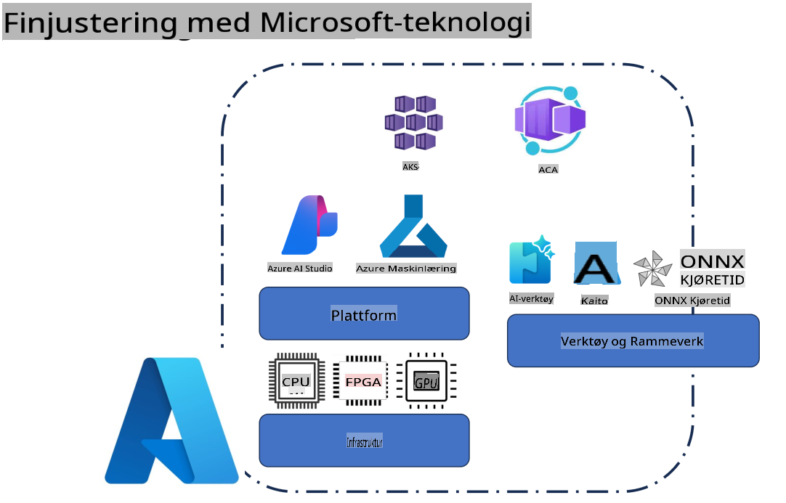
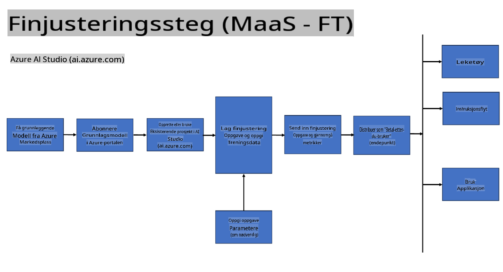
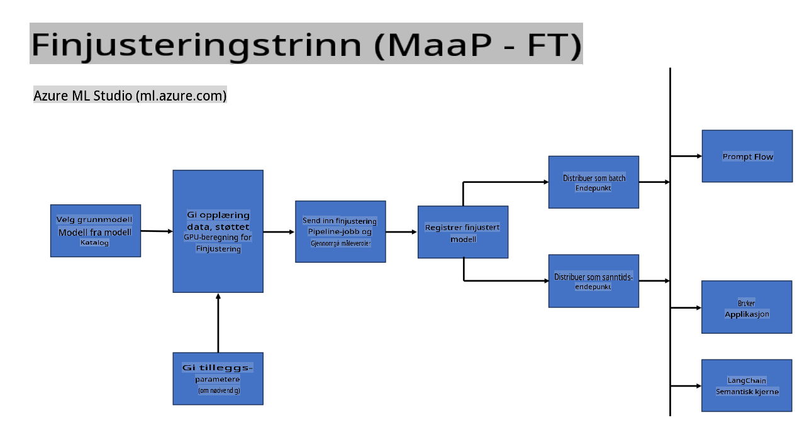
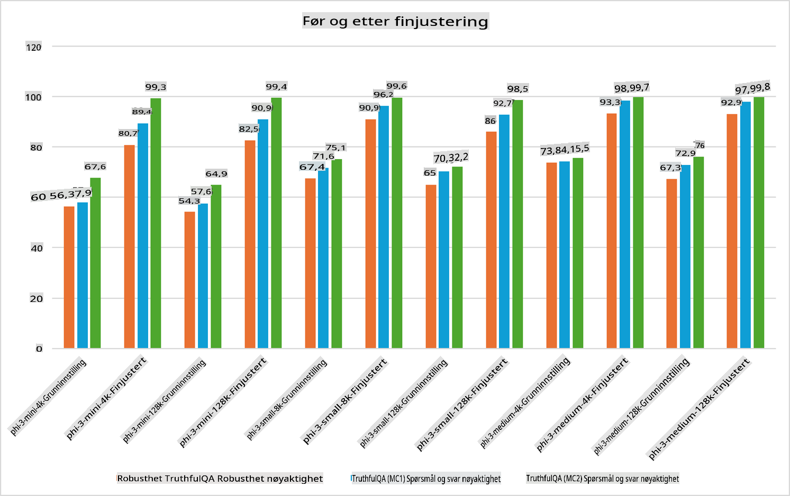

## Finjusteringsscenarier

**Plattform** Dette inkluderer ulike teknologier som Azure AI Foundry, Azure Machine Learning, AI Tools, Kaito og ONNX Runtime.

**Infrastruktur** Dette inkluderer CPU og FPGA, som er avgjørende for finjusteringsprosessen. La meg vise deg ikonene for hver av disse teknologiene.

**Verktøy og rammeverk** Dette inkluderer ONNX Runtime og ONNX Runtime. La meg vise deg ikonene for hver av disse teknologiene.
[Sett inn ikoner for ONNX Runtime og ONNX Runtime]

Finjusteringsprosessen med Microsoft-teknologier involverer ulike komponenter og verktøy. Ved å forstå og bruke disse teknologiene kan vi effektivt finjustere applikasjonene våre og skape bedre løsninger.

## Modell som en tjeneste

Finjuster modellen ved hjelp av en vertet finjusteringsløsning, uten behov for å opprette og administrere beregningsressurser.

Serverløs finjustering er tilgjengelig for Phi-3-mini- og Phi-3-medium-modeller, noe som gjør det mulig for utviklere raskt og enkelt å tilpasse modellene for sky- og kant-scenarier uten å måtte arrangere beregningsressurser. Vi har også annonsert at Phi-3-small nå er tilgjengelig gjennom vår Models-as-a-Service-løsning, slik at utviklere raskt og enkelt kan komme i gang med AI-utvikling uten å måtte administrere underliggende infrastruktur.

## Modell som en plattform

Brukere administrerer sine egne beregningsressurser for å finjustere modellene sine.

[Eksempel på finjustering](https://github.com/Azure/azureml-examples/blob/main/sdk/python/foundation-models/system/finetune/chat-completion/chat-completion.ipynb)

## Finjusteringsscenarier

| | | | | | | |
|-|-|-|-|-|-|-|
|Scenario|LoRA|QLoRA|PEFT|DeepSpeed|ZeRO|DORA|
|Tilpasse forhåndstrente LLM-er til spesifikke oppgaver eller domener|Ja|Ja|Ja|Ja|Ja|Ja|
|Finjustering for NLP-oppgaver som tekstklassifisering, navngitt enhetsgjenkjenning og maskinoversettelse|Ja|Ja|Ja|Ja|Ja|Ja|
|Finjustering for QA-oppgaver|Ja|Ja|Ja|Ja|Ja|Ja|
|Finjustering for å generere menneskelignende svar i chatbots|Ja|Ja|Ja|Ja|Ja|Ja|
|Finjustering for å generere musikk, kunst eller andre former for kreativitet|Ja|Ja|Ja|Ja|Ja|Ja|
|Redusere beregnings- og økonomiske kostnader|Ja|Ja|Nei|Ja|Ja|Nei|
|Redusere minnebruk|Nei|Ja|Nei|Ja|Ja|Ja|
|Bruke færre parametere for effektiv finjustering|Nei|Ja|Ja|Nei|Nei|Ja|
|Minneeffektiv form for dataparallellisme som gir tilgang til den samlede GPU-minnet til alle tilgjengelige GPU-enheter|Nei|Nei|Nei|Ja|Ja|Ja|

## Eksempler på finjusteringsytelse

**Ansvarsfraskrivelse**:  
Dette dokumentet er oversatt ved hjelp av maskinbaserte AI-oversettelsestjenester. Selv om vi tilstreber nøyaktighet, vær oppmerksom på at automatiserte oversettelser kan inneholde feil eller unøyaktigheter. Det originale dokumentet på sitt opprinnelige språk bør betraktes som den autoritative kilden. For kritisk informasjon anbefales profesjonell menneskelig oversettelse. Vi er ikke ansvarlige for misforståelser eller feiltolkninger som oppstår ved bruk av denne oversettelsen.