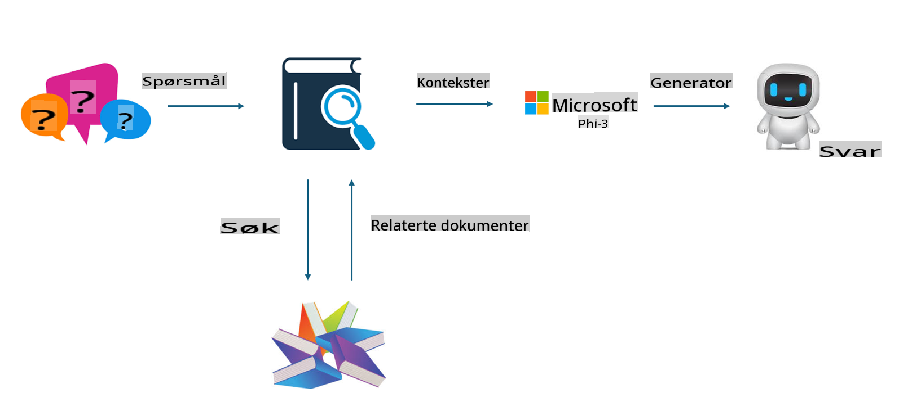

## Finetuning vs RAG

## Retrieval Augmented Generation

RAG er datainnhenting + tekstgenerering. Strukturerte og ustrukturerte data fra virksomheten lagres i en vektordatabank. Når man søker etter relevant innhold, blir en relevant oppsummering og innhold funnet for å danne en kontekst, og tekstgenereringsevnen til LLM/SLM kombineres for å generere innhold.

## RAG-prosess

## Finetuning
Finetuning er en forbedring av en eksisterende modell. Det er ikke nødvendig å starte med modellens algoritme, men data må kontinuerlig samles inn. Hvis du ønsker mer presis terminologi og språkbruk i bransjeapplikasjoner, er finetuning et bedre valg. Men hvis dataene dine endres ofte, kan finetuning bli komplisert.

## Hvordan velge
Hvis svaret vårt krever innføring av eksterne data, er RAG det beste valget.

Hvis du trenger å levere stabil og presis bransjekunnskap, vil finetuning være et godt valg. RAG prioriterer å hente relevant innhold, men kan noen ganger mangle spesialiserte nyanser.

Finetuning krever et høykvalitets datasett, og hvis det bare er et lite omfang av data, vil det ikke gjøre stor forskjell. RAG er mer fleksibelt.  
Finetuning er som en "svart boks", en form for metafysikk, og det er vanskelig å forstå de interne mekanismene. Men RAG gjør det enklere å finne kilden til dataene, og dermed effektivt justere hallusinasjoner eller innholdsfeil og gi bedre transparens.

**Ansvarsfraskrivelse**:  
Dette dokumentet er oversatt ved hjelp av maskinbaserte AI-oversettingstjenester. Selv om vi tilstreber nøyaktighet, vær oppmerksom på at automatiske oversettelser kan inneholde feil eller unøyaktigheter. Det originale dokumentet på sitt opprinnelige språk bør betraktes som den autoritative kilden. For kritisk informasjon anbefales profesjonell menneskelig oversettelse. Vi er ikke ansvarlige for misforståelser eller feiltolkninger som oppstår ved bruk av denne oversettelsen.