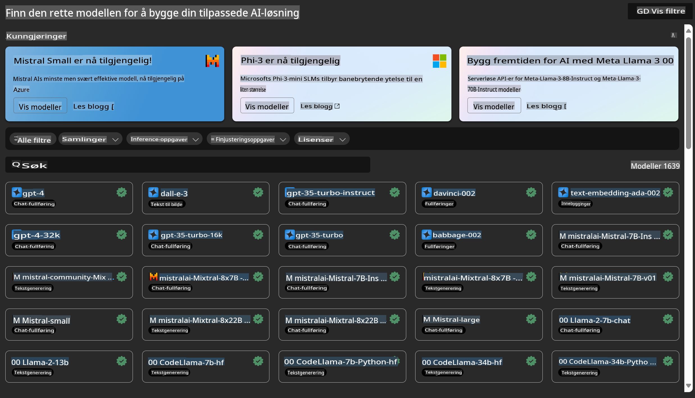
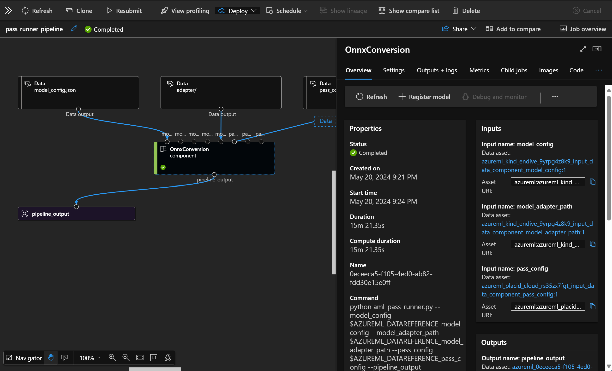

# **Introduksjon til Azure Machine Learning-tjenesten**

[Azure Machine Learning](https://ml.azure.com?WT.mc_id=aiml-138114-kinfeylo) er en skytjeneste som hjelper med å akselerere og administrere livssyklusen til maskinlæringsprosjekter.

ML-spesialister, dataforskere og ingeniører kan bruke den i sine daglige arbeidsprosesser for å:

- Trene og distribuere modeller.
- Administrere maskinlæringsoperasjoner (MLOps).
- Du kan opprette en modell i Azure Machine Learning eller bruke en modell bygget på en åpen kildekodeplattform, som PyTorch, TensorFlow eller scikit-learn.
- MLOps-verktøy hjelper deg med å overvåke, trene på nytt og distribuere modeller.

## Hvem er Azure Machine Learning for?

**Dataforskere og ML-ingeniører**

De kan bruke verktøy for å akselerere og automatisere sine daglige arbeidsprosesser.  
Azure ML tilbyr funksjoner for rettferdighet, forklarbarhet, sporing og revisjonsmuligheter.

**Applikasjonsutviklere**

De kan sømløst integrere modeller i applikasjoner eller tjenester.

**Plattformutviklere**

De har tilgang til et robust sett med verktøy støttet av holdbare Azure Resource Manager API-er.  
Disse verktøyene gjør det mulig å bygge avanserte ML-verktøy.

**Bedrifter**

Når de jobber i Microsoft Azure-skyen, drar bedrifter nytte av kjent sikkerhet og rollebasert tilgangskontroll.  
Sett opp prosjekter for å kontrollere tilgang til beskyttede data og spesifikke operasjoner.

## Produktivitet for hele teamet
ML-prosjekter krever ofte et team med varierte ferdigheter for å bygge og vedlikeholde.

Azure ML tilbyr verktøy som lar deg:
- Samarbeide med teamet ditt via delte notatbøker, databehandlingsressurser, serverløs databehandling, data og miljøer.
- Utvikle modeller med rettferdighet, forklarbarhet, sporing og revisjonsmuligheter for å oppfylle krav til sporbarhet og revisjon.
- Distribuere ML-modeller raskt og enkelt i stor skala, og administrere og styre dem effektivt med MLOps.
- Kjøre maskinlæringsarbeidsbelastninger hvor som helst med innebygd styring, sikkerhet og samsvar.

## Krysskompatible plattformverktøy

Alle på et ML-team kan bruke sine foretrukne verktøy for å få jobben gjort.  
Enten du kjører raske eksperimenter, hyperparameter-tuning, bygger pipelines eller administrerer inferenser, kan du bruke kjente grensesnitt, inkludert:
- Azure Machine Learning Studio
- Python SDK (v2)
- Azure CLI (v2)
- Azure Resource Manager REST API-er

Når du forbedrer modeller og samarbeider gjennom utviklingssyklusen, kan du dele og finne ressurser, data og målinger i Azure Machine Learning Studio-grensesnittet.

## **LLM/SLM i Azure ML**

Azure ML har lagt til mange funksjoner relatert til LLM/SLM, som kombinerer LLMOps og SLMOps for å skape en bedriftsomfattende teknologi-plattform for generativ kunstig intelligens.

### **Model Catalog**

Bedriftsbrukere kan distribuere ulike modeller basert på ulike forretningsscenarier gjennom Model Catalog og tilby tjenester som Model as Service for at bedriftsutviklere eller brukere skal få tilgang.

Model Catalog i Azure Machine Learning Studio er knutepunktet for å oppdage og bruke et bredt spekter av modeller som lar deg bygge applikasjoner for generativ AI.  
Model Catalog inneholder hundrevis av modeller fra leverandører som Azure OpenAI-tjenesten, Mistral, Meta, Cohere, Nvidia, Hugging Face, inkludert modeller trent av Microsoft. Modeller fra andre leverandører enn Microsoft er definert som Ikke-Microsoft-produkter i Microsofts produktvilkår og er underlagt vilkårene som følger med modellen.

### **Job Pipeline**

Kjernen i en maskinlæringspipeline er å dele opp en komplett maskinlæringsoppgave i en flertrinns arbeidsflyt.  
Hvert trinn er en håndterbar komponent som kan utvikles, optimaliseres, konfigureres og automatiseres individuelt.  
Trinnene er koblet sammen gjennom veldefinerte grensesnitt. Tjenesten Azure Machine Learning Pipeline orkestrerer automatisk alle avhengigheter mellom pipeline-trinn.

Ved finjustering av SLM/LLM kan vi administrere dataene, treningsprosessene og genereringsprosessene våre gjennom Pipeline.

### **Prompt flow**

Fordeler med å bruke Azure Machine Learning Prompt Flow  
Azure Machine Learning Prompt Flow tilbyr en rekke fordeler som hjelper brukere med å gå fra idé til eksperimentering og til slutt produksjonsklare applikasjoner basert på LLM:

**Smidighet i prompt-engineering**

- Interaktiv forfatteropplevelse: Azure Machine Learning Prompt Flow gir en visuell representasjon av flytens struktur, slik at brukerne enkelt kan forstå og navigere i prosjektene sine. Det tilbyr også en notatbok-lignende kodeopplevelse for effektiv utvikling og feilsøking av flyter.
- Varianter for prompt-tuning: Brukere kan lage og sammenligne flere varianter av prompts, noe som legger til rette for en iterativ forbedringsprosess.
- Evaluering: Innebygde evalueringsflyter lar brukerne vurdere kvaliteten og effektiviteten til sine prompts og flyter.
- Omfattende ressurser: Azure Machine Learning Prompt Flow inkluderer et bibliotek med innebygde verktøy, eksempler og maler som fungerer som et utgangspunkt for utvikling, inspirerer til kreativitet og akselererer prosessen.

**Bedriftsklarhet for applikasjoner basert på LLM**

- Samarbeid: Azure Machine Learning Prompt Flow støtter samarbeid i team, slik at flere brukere kan jobbe sammen på prompt-engineering-prosjekter, dele kunnskap og opprettholde versjonskontroll.
- Alt-i-ett-plattform: Azure Machine Learning Prompt Flow strømlinjeformer hele prosessen med prompt-engineering, fra utvikling og evaluering til distribusjon og overvåking. Brukere kan enkelt distribuere flytene sine som Azure Machine Learning-endepunkter og overvåke ytelsen i sanntid, noe som sikrer optimal drift og kontinuerlig forbedring.
- Azure Machine Learning bedriftsløsninger: Prompt Flow utnytter Azure Machine Learning sine robuste løsninger for bedriftsklarhet, og gir et sikkert, skalerbart og pålitelig grunnlag for utvikling, eksperimentering og distribusjon av flyter.

Med Azure Machine Learning Prompt Flow kan brukere frigjøre smidigheten i prompt-engineering, samarbeide effektivt og dra nytte av løsninger på bedriftsnivå for vellykket utvikling og distribusjon av applikasjoner basert på LLM.

Ved å kombinere datakraften, dataene og de ulike komponentene i Azure ML, kan bedriftsutviklere enkelt bygge sine egne kunstige intelligensapplikasjoner.

**Ansvarsfraskrivelse**:  
Dette dokumentet er oversatt ved hjelp av maskinbaserte AI-oversettelsestjenester. Selv om vi tilstreber nøyaktighet, vær oppmerksom på at automatiserte oversettelser kan inneholde feil eller unøyaktigheter. Det originale dokumentet på sitt opprinnelige språk bør anses som den autoritative kilden. For kritisk informasjon anbefales profesjonell menneskelig oversettelse. Vi er ikke ansvarlige for eventuelle misforståelser eller feiltolkninger som oppstår ved bruk av denne oversettelsen.