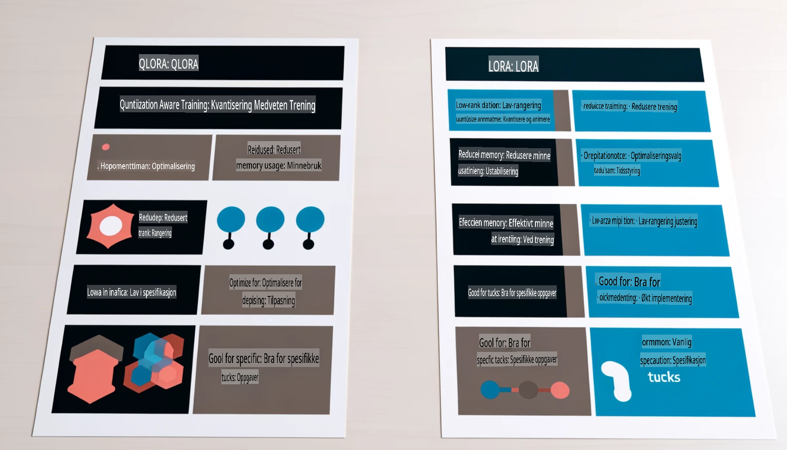

# **La Phi-3 bli en bransjeekspert**

For å integrere Phi-3-modellen i en bransje, må du legge til bransjespesifikke data i Phi-3-modellen. Vi har to forskjellige alternativer: RAG (Retrieval Augmented Generation) og Fine Tuning.

## **RAG vs Fine-Tuning**

### **Retrieval Augmented Generation**

RAG kombinerer datainnhenting og tekstgenerering. Bedriftens strukturerte og ustrukturerte data lagres i en vektordatabank. Når relevant innhold søkes opp, blir en sammenfatning og innhold hentet for å danne en kontekst, som kombineres med tekstgenereringsevnen til LLM/SLM for å produsere innhold.

### **Fine-tuning**

Fine-tuning innebærer å forbedre en eksisterende modell. Det er ikke nødvendig å starte med modellalgoritmen, men det kreves kontinuerlig oppsamling av data. Hvis du ønsker mer presis terminologi og språkbruk i bruksområder for industrien, er fine-tuning et bedre valg. Men hvis dataene dine endres ofte, kan fine-tuning bli komplisert.

### **Hvordan velge**

1. Hvis svaret vårt krever bruk av eksterne data, er RAG det beste valget.

2. Hvis du trenger å levere stabil og presis bransjekunnskap, vil fine-tuning være et godt valg. RAG prioriterer å hente relevant innhold, men kan av og til mangle spesialiserte nyanser.

3. Fine-tuning krever et høykvalitets datasett, og hvis det kun er et lite omfang av data, vil det ikke utgjøre en stor forskjell. RAG er mer fleksibel.

4. Fine-tuning er som en "svart boks", vanskelig å forstå mekanismene bak. Men RAG gjør det enklere å spore datakilden, noe som hjelper med å justere feil eller innholdsforvrengninger og gir bedre åpenhet.

### **Scenarier**

1. Vertikale bransjer som krever spesifikke faguttrykk og formuleringer: ***Fine-tuning*** er det beste valget.

2. Spørsmål-og-svar-systemer som krever sammensetning av ulike kunnskapspunkter: ***RAG*** er det beste valget.

3. Kombinasjon av automatiserte forretningsprosesser: ***RAG + Fine-tuning*** er det beste valget.

## **Hvordan bruke RAG**

En vektordatabank er en samling data lagret i matematisk form. Vektordatabanker gjør det enklere for maskinlæringsmodeller å huske tidligere innspill, slik at maskinlæring kan brukes til søk, anbefalinger og tekstgenerering. Data kan identifiseres basert på likhetsmål i stedet for eksakte treff, noe som gjør det mulig for datamodeller å forstå konteksten.

Vektordatabanker er nøkkelen til å realisere RAG. Vi kan konvertere data til vektorlager gjennom vektormodeller som text-embedding-3, jina-ai-embedding, osv.

Lær mer om å lage RAG-applikasjoner [https://github.com/microsoft/Phi-3CookBook](https://github.com/microsoft/Phi-3CookBook?WT.mc_id=aiml-138114-kinfeylo)

## **Hvordan bruke Fine-tuning**

Vanlige algoritmer i Fine-tuning er Lora og QLora. Hvordan velge?
- [Lær mer med denne eksempelsnotatboken](../../../../code/04.Finetuning/Phi_3_Inference_Finetuning.ipynb)
- [Eksempel på Python FineTuning Script](../../../../code/04.Finetuning/FineTrainingScript.py)

### **Lora og QLora**

LoRA (Low-Rank Adaptation) og QLoRA (Quantized Low-Rank Adaptation) er begge teknikker som brukes for å finjustere store språkmodeller (LLMs) ved hjelp av Parameter Efficient Fine Tuning (PEFT). PEFT-teknikker er designet for å trene modeller mer effektivt enn tradisjonelle metoder.  
LoRA er en selvstendig finjusteringsteknikk som reduserer minnebruken ved å bruke en lav-rang tilnærming på vektoppdateringsmatrisen. Det gir rask treningstid og opprettholder ytelse som er nær tradisjonelle finjusteringsmetoder.  

QLoRA er en utvidet versjon av LoRA som inkluderer kvantiseringsteknikker for å ytterligere redusere minnebruken. QLoRA kvantiserer presisjonen til vektparameterne i den forhåndstrente LLM til 4-bit presisjon, som er mer minneeffektiv enn LoRA. Imidlertid er QLoRA-trening omtrent 30 % tregere enn LoRA-trening på grunn av de ekstra kvantiserings- og dekvantiseringsprosessene.  

QLoRA bruker LoRA som et tillegg for å korrigere feil som oppstår under kvantiseringen. QLoRA gjør det mulig å finjustere massive modeller med milliarder av parametere på relativt små, lett tilgjengelige GPU-er. For eksempel kan QLoRA finjustere en modell med 70 milliarder parametere som vanligvis krever 36 GPU-er, med bare 2.

**Ansvarsfraskrivelse**:  
Dette dokumentet er oversatt ved hjelp av maskinbaserte AI-oversettelsestjenester. Selv om vi bestreber oss på nøyaktighet, vær oppmerksom på at automatiserte oversettelser kan inneholde feil eller unøyaktigheter. Det originale dokumentet på sitt opprinnelige språk bør betraktes som den autoritative kilden. For kritisk informasjon anbefales profesjonell menneskelig oversettelse. Vi er ikke ansvarlige for misforståelser eller feiltolkninger som oppstår ved bruk av denne oversettelsen.