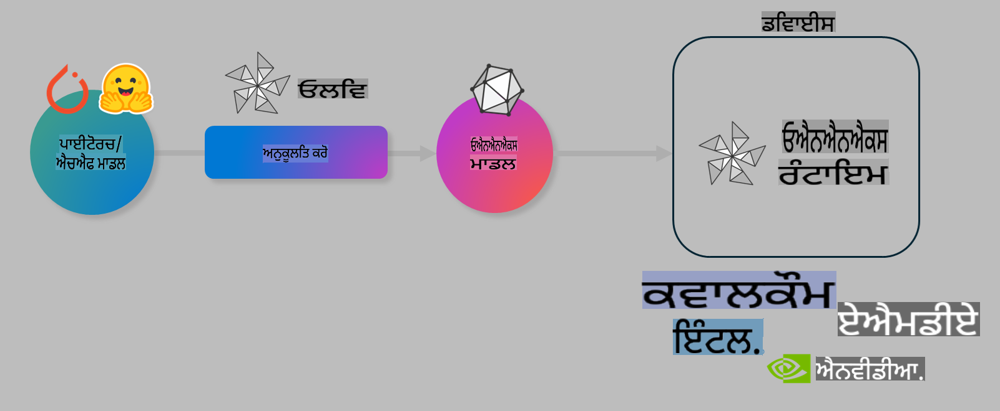

# ਲੈਬ: ਡਿਵਾਈਸ 'ਤੇ ਇਨਫਰੈਂਸ ਲਈ AI ਮਾਡਲਾਂ ਨੂੰ ਓਪਟੀਮਾਈਜ਼ ਕਰੋ

## ਜਾਣ ਪਛਾਣ

> [!IMPORTANT]  
> ਇਸ ਲੈਬ ਲਈ **Nvidia A10 ਜਾਂ A100 GPU** ਦੀ ਲੋੜ ਹੈ, ਜਿਸ ਨਾਲ ਸੰਬੰਧਿਤ ਡਰਾਈਵਰ ਅਤੇ CUDA ਟੂਲਕਿਟ (ਵਰਜਨ 12+ ਉੱਤੇ) ਇੰਸਟਾਲ ਹੋਣੀ ਚਾਹੀਦੀ ਹੈ।

> [!NOTE]  
> ਇਹ ਇੱਕ **35 ਮਿੰਟਾਂ ਦੀ ਲੈਬ** ਹੈ ਜੋ ਤੁਹਾਨੂੰ OLIVE ਦੀ ਵਰਤੋਂ ਕਰਕੇ ਡਿਵਾਈਸ 'ਤੇ ਇਨਫਰੈਂਸ ਲਈ ਮਾਡਲਾਂ ਨੂੰ ਓਪਟੀਮਾਈਜ਼ ਕਰਨ ਦੇ ਮੁੱਖ ਸੰਕਲਪਾਂ ਦਾ ਹੱਥ-ਅਨੁਭਵ ਪ੍ਰਦਾਨ ਕਰੇਗੀ।

## ਸਿਖਣ ਦੇ ਉਦੇਸ਼

ਇਸ ਲੈਬ ਦੇ ਅੰਤ ਤੱਕ, ਤੁਸੀਂ OLIVE ਦੀ ਵਰਤੋਂ ਕਰਕੇ ਇਹ ਕਰਨ ਦੇ ਯੋਗ ਹੋਵੋਗੇ:

- AWQ ਕਵਾਂਟਾਈਜ਼ੇਸ਼ਨ ਤਰੀਕੇ ਦੀ ਵਰਤੋਂ ਕਰਦੇ ਹੋਏ ਇੱਕ AI ਮਾਡਲ ਨੂੰ ਕਵਾਂਟਾਈਜ਼ ਕਰਨਾ।  
- ਖਾਸ ਟਾਸਕ ਲਈ AI ਮਾਡਲ ਨੂੰ ਫਾਈਨ-ਟਿਊਨ ਕਰਨਾ।  
- ONNX Runtime 'ਤੇ ਪ੍ਰਭਾਵਸ਼ਾਲੀ ਡਿਵਾਈਸ-ਆਧਾਰਿਤ ਇਨਫਰੈਂਸ ਲਈ LoRA ਐਡਪਟਰ (ਫਾਈਨ-ਟਿਊਨ ਮਾਡਲ) ਤਿਆਰ ਕਰਨਾ।  

### Olive ਕੀ ਹੈ

Olive (*O*NNX *live*) ਇੱਕ ਮਾਡਲ ਓਪਟੀਮਾਈਜ਼ੇਸ਼ਨ ਟੂਲਕਿਟ ਹੈ ਜਿਸ ਨਾਲ CLI ਜੁੜਿਆ ਹੋਇਆ ਹੈ। ਇਹ ਤੁਹਾਨੂੰ ONNX Runtime +++https://onnxruntime.ai+++ ਲਈ ਮਾਡਲ ਡਿਪਲੌਇਮੈਂਟ ਕਰਨ ਯੋਗ ਬਣਾਉਂਦਾ ਹੈ।  

  

Olive ਵਿੱਚ ਆਮ ਤੌਰ 'ਤੇ PyTorch ਜਾਂ Hugging Face ਮਾਡਲ ਇਨਪੁੱਟ ਹੁੰਦਾ ਹੈ ਅਤੇ ਨਤੀਜੇ ਵਜੋਂ ਇੱਕ ਓਪਟੀਮਾਈਜ਼ਡ ONNX ਮਾਡਲ ਮਿਲਦਾ ਹੈ, ਜੋ ONNX Runtime ਚਲਾਉਣ ਵਾਲੇ ਡਿਵਾਈਸ (ਡਿਪਲੌਇਮੈਂਟ ਟਾਰਗੇਟ) 'ਤੇ ਕਾਰਗਰ ਹੁੰਦਾ ਹੈ। Olive ਮਾਡਲ ਨੂੰ ਡਿਪਲੌਇਮੈਂਟ ਟਾਰਗੇਟ ਦੇ AI ਐਕਸੈਲੇਰੇਟਰ (NPU, GPU, CPU) ਲਈ ਓਪਟੀਮਾਈਜ਼ ਕਰਦਾ ਹੈ, ਜੋ ਕਿ Qualcomm, AMD, Nvidia ਜਾਂ Intel ਵਰਗੇ ਹਾਰਡਵੇਅਰ ਵੇਂਡਰ ਦੁਆਰਾ ਪ੍ਰਦਾਨ ਕੀਤਾ ਗਿਆ ਹੁੰਦਾ ਹੈ।  

Olive ਇੱਕ *ਵਰਕਫਲੋ* ਚਲਾਉਂਦਾ ਹੈ, ਜੋ ਕਿ ਵਿਅਕਤੀਗਤ ਮਾਡਲ ਓਪਟੀਮਾਈਜ਼ੇਸ਼ਨ ਟਾਸਕਾਂ ਦੇ ਆਰਡਰ ਕੀਤੇ ਸਿਲਸਿਲੇ (*ਪਾਸੇ*) 'ਤੇ ਆਧਾਰਿਤ ਹੁੰਦਾ ਹੈ। ਉਦਾਹਰਣ ਲਈ: ਮਾਡਲ ਕੰਪ੍ਰੈਸ਼ਨ, ਗ੍ਰਾਫ ਕੈਪਚਰ, ਕਵਾਂਟਾਈਜ਼ੇਸ਼ਨ, ਗ੍ਰਾਫ ਓਪਟੀਮਾਈਜ਼ੇਸ਼ਨ। ਹਰ ਪਾਸ ਵਿੱਚ ਕੁਝ ਪੈਰਾਮੀਟਰ ਹੁੰਦੇ ਹਨ ਜੋ ਸਹੀ ਮੈਟ੍ਰਿਕਸ (ਜਿਵੇਂ ਕਿ ਐਕਯੁਰੇਸੀ ਅਤੇ ਲੈਟੈਂਸੀ) ਪ੍ਰਾਪਤ ਕਰਨ ਲਈ ਟਿਊਨ ਕੀਤੇ ਜਾ ਸਕਦੇ ਹਨ। Olive ਇੱਕ ਖੋਜ ਰਣਨੀਤੀ ਵਰਤਦਾ ਹੈ ਜੋ ਇੱਕ-ਇੱਕ ਕਰਕੇ ਜਾਂ ਕੁਝ ਪਾਸਿਆਂ ਨੂੰ ਇੱਕਠੇ ਟਿਊਨ ਕਰਨ ਲਈ ਖੋਜ ਅਲਗੋਰਿਥਮ ਵਰਤਦਾ ਹੈ।  

#### Olive ਦੇ ਫਾਇਦੇ  

- **ਟ੍ਰਾਇਲ ਅਤੇ ਐਰਰ ਦੇ ਥੱਕਾਵਟ ਭਰੇ ਪ੍ਰਯੋਗਾਂ ਤੋਂ ਛੁਟਕਾਰਾ** ਅਤੇ ਸਮੇਂ ਦੀ ਬਚਤ: ਗ੍ਰਾਫ ਓਪਟੀਮਾਈਜ਼ੇਸ਼ਨ, ਕੰਪ੍ਰੈਸ਼ਨ ਅਤੇ ਕਵਾਂਟਾਈਜ਼ੇਸ਼ਨ ਲਈ ਆਪਣੀਆਂ ਗੁਣਵੱਤਾ ਅਤੇ ਪ੍ਰਦਰਸ਼ਨ ਪਾਬੰਦੀਆਂ ਨੂੰ ਪਰਿਭਾਸ਼ਿਤ ਕਰੋ ਅਤੇ Olive ਨੂੰ ਤੁਹਾਡੇ ਲਈ ਸਭ ਤੋਂ ਵਧੀਆ ਮਾਡਲ ਲੱਭਣ ਦਿਓ।  
- **40+ ਬਿਲਟ-ਇਨ ਮਾਡਲ ਓਪਟੀਮਾਈਜ਼ੇਸ਼ਨ ਕੰਪੋਨੈਂਟਸ**, ਜੋ ਕਵਾਂਟਾਈਜ਼ੇਸ਼ਨ, ਕੰਪ੍ਰੈਸ਼ਨ, ਗ੍ਰਾਫ ਓਪਟੀਮਾਈਜ਼ੇਸ਼ਨ ਅਤੇ ਫਾਈਨ-ਟਿਊਨਿੰਗ ਵਿੱਚ ਕੱਟਿੰਗ-ਐਜ ਤਕਨੀਕਾਂ ਨੂੰ ਕਵਰ ਕਰਦੇ ਹਨ।  
- ਆਮ ਮਾਡਲ ਓਪਟੀਮਾਈਜ਼ੇਸ਼ਨ ਟਾਸਕਾਂ ਲਈ **ਸੌਖੀ CLI**। ਉਦਾਹਰਣ ਲਈ, olive quantize, olive auto-opt, olive finetune।  
- ਮਾਡਲ ਪੈਕੇਜਿੰਗ ਅਤੇ ਡਿਪਲੌਇਮੈਂਟ ਸਿਸਟਮ ਵਿੱਚ ਸ਼ਾਮਲ।  
- **ਮਲਟੀ LoRA ਸਰਵਿੰਗ** ਲਈ ਮਾਡਲ ਤਿਆਰ ਕਰਨ ਦੀ ਸਹੂਲਤ।  
- YAML/JSON ਦੀ ਵਰਤੋਂ ਕਰਕੇ ਵਰਕਫਲੋਜ਼ ਬਣਾਓ, ਮਾਡਲ ਓਪਟੀਮਾਈਜ਼ੇਸ਼ਨ ਅਤੇ ਡਿਪਲੌਇਮੈਂਟ ਟਾਸਕਾਂ ਨੂੰ ਆਰਕੇਸਟ੍ਰੇਟ ਕਰਨ ਲਈ।  
- **Hugging Face** ਅਤੇ **Azure AI** ਇੰਟੀਗ੍ਰੇਸ਼ਨ।  
- **ਕੈਸ਼ਿੰਗ** ਮਕੈਨਿਜ਼ਮ ਨਾਲ **ਖਰਚੇ ਘਟਾਓ**।  

## ਲੈਬ ਨਿਰਦੇਸ਼

> [!NOTE]  
> ਕਿਰਪਾ ਕਰਕੇ ਯਕੀਨੀ ਬਣਾਓ ਕਿ ਤੁਸੀਂ ਆਪਣਾ Azure AI Hub ਅਤੇ ਪ੍ਰੋਜੈਕਟ ਪ੍ਰੋਵਿਜ਼ਨ ਕੀਤਾ ਹੈ ਅਤੇ ਆਪਣਾ A100 ਕੰਪਿਊਟ ਲੈਬ 1 ਦੇ ਅਨੁਸਾਰ ਸੈਟਅੱਪ ਕੀਤਾ ਹੈ।  

### ਕਦਮ 0: ਆਪਣੇ Azure AI ਕੰਪਿਊਟ ਨਾਲ ਕਨੈਕਟ ਕਰੋ  

ਤੁਸੀਂ **VS Code** ਵਿੱਚ ਰਿਮੋਟ ਫੀਚਰ ਦੀ ਵਰਤੋਂ ਕਰਕੇ ਆਪਣੇ Azure AI ਕੰਪਿਊਟ ਨਾਲ ਕਨੈਕਟ ਕਰੋਗੇ।  

1. ਆਪਣਾ **VS Code** ਡੈਸਕਟਾਪ ਐਪ ਖੋਲ੍ਹੋ।  
1. **Shift+Ctrl+P** ਦਬਾ ਕੇ **ਕਮਾਂਡ ਪੈਲੇਟ** ਖੋਲ੍ਹੋ।  
1. ਕਮਾਂਡ ਪੈਲੇਟ ਵਿੱਚ **AzureML - remote: Connect to compute instance in New Window** ਲੱਭੋ।  
1. ਸਕਰੀਨ ਉੱਤੇ ਦਿੱਤੇ ਨਿਰਦੇਸ਼ਾਂ ਦੀ ਪਾਲਣਾ ਕਰੋ। ਇਸ ਵਿੱਚ ਤੁਹਾਡੇ Azure Subscription, Resource Group, Project ਅਤੇ Compute Name ਦੀ ਚੋਣ ਸ਼ਾਮਲ ਹੋਵੇਗੀ ਜੋ ਤੁਸੀਂ ਲੈਬ 1 ਵਿੱਚ ਸੈਟਅੱਪ ਕੀਤਾ ਸੀ।  
1. ਜਦੋਂ ਤੁਸੀਂ ਆਪਣੇ Azure ML Compute ਨੋਡ ਨਾਲ ਕਨੈਕਟ ਹੋ ਜਾਓਗੇ, ਤਾਂ ਇਹ **Visual Code ਦੇ ਤਲਵੇ ਖੱਬੇ ਕੋਨੇ ਵਿੱਚ** ਦਿਖਾਈ ਦੇਵੇਗਾ `><Azure ML: Compute Name`।  

### ਕਦਮ 1: ਇਸ ਰਿਪੋ ਨੂੰ ਕਲੋਨ ਕਰੋ  

VS Code ਵਿੱਚ, **Ctrl+J** ਦਬਾ ਕੇ ਨਵਾਂ ਟਰਮੀਨਲ ਖੋਲ੍ਹੋ ਅਤੇ ਇਸ ਰਿਪੋ ਨੂੰ ਕਲੋਨ ਕਰੋ।  

ਟਰਮੀਨਲ ਵਿੱਚ ਤੁਹਾਨੂੰ ਇਹ ਪ੍ਰਾਮਪਟ ਦਿਖਾਈ ਦੇਵੇਗਾ:  

```
azureuser@computername:~/cloudfiles/code$ 
```  
ਸੋਲੂਸ਼ਨ ਕਲੋਨ ਕਰੋ:  

```bash
cd ~/localfiles
git clone https://github.com/microsoft/phi-3cookbook.git
```  

### ਕਦਮ 2: ਫੋਲਡਰ VS Code ਵਿੱਚ ਖੋਲ੍ਹੋ  

ਸੰਬੰਧਿਤ ਫੋਲਡਰ 'ਚ VS Code ਖੋਲ੍ਹਣ ਲਈ ਟਰਮੀਨਲ ਵਿੱਚ ਹੇਠਾਂ ਦਿੱਤਾ ਕਮਾਂਡ ਚਲਾਓ, ਜੋ ਨਵੀਂ ਵਿੰਡੋ ਖੋਲ੍ਹੇਗਾ:  

```bash
code phi-3cookbook/code/04.Finetuning/Olive-lab
```  

ਵਿਕਲਪਕ ਤੌਰ 'ਤੇ, ਤੁਸੀਂ **File** > **Open Folder** ਦੀ ਚੋਣ ਕਰਕੇ ਫੋਲਡਰ ਖੋਲ੍ਹ ਸਕਦੇ ਹੋ।  

### ਕਦਮ 3: Dependencies  

Azure AI Compute Instance 'ਚ VS Code ਦੇ ਟਰਮੀਨਲ ਵਿੰਡੋ (ਸੁਝਾਅ: **Ctrl+J**) 'ਚ ਹੇਠਾਂ ਦਿੱਤੇ ਕਮਾਂਡ ਚਲਾਓ ਤਾਂ ਜੋ dependencies ਇੰਸਟਾਲ ਹੋ ਸਕਣ:  

```bash
conda create -n olive-ai python=3.11 -y
conda activate olive-ai
pip install -r requirements.txt
az extension remove -n azure-cli-ml
az extension add -n ml
```  

> [!NOTE]  
> ਸਾਰੀਆਂ dependencies ਇੰਸਟਾਲ ਕਰਨ ਵਿੱਚ ਲਗਭਗ **5 ਮਿੰਟਾਂ** ਲਗਣਗੇ।  

ਇਸ ਲੈਬ ਵਿੱਚ ਤੁਸੀਂ ਮਾਡਲਾਂ ਨੂੰ ਡਾਊਨਲੋਡ ਅਤੇ ਅਪਲੋਡ ਕਰੋਗੇ Azure AI Model catalog ਵਿੱਚ। ਮਾਡਲ ਕੈਟਾਲਾਗ ਤੱਕ ਪਹੁੰਚ ਕਰਨ ਲਈ, ਤੁਹਾਨੂੰ ਹੇਠਾਂ ਦਿੱਤਾ ਕਮਾਂਡ ਚਲਾ ਕੇ Azure ਵਿੱਚ ਲੌਗਇਨ ਕਰਨ ਦੀ ਲੋੜ ਹੋਵੇਗੀ:  

```bash
az login
```  

> [!NOTE]  
> ਲੌਗਇਨ ਸਮੇਂ ਤੁਹਾਨੂੰ ਆਪਣੀ subscription ਚੁਣਣ ਲਈ ਕਿਹਾ ਜਾਵੇਗਾ। ਇਹ ਯਕੀਨੀ ਬਣਾਓ ਕਿ ਤੁਸੀਂ ਇਸ ਲੈਬ ਲਈ ਪ੍ਰਦਾਨ ਕੀਤੀ ਗਈ subscription ਸੈੱਟ ਕਰੋ।  

### ਕਦਮ 4: Olive ਕਮਾਂਡ ਚਲਾਓ  

Azure AI Compute Instance 'ਚ VS Code ਦੇ ਟਰਮੀਨਲ ਵਿੰਡੋ (ਸੁਝਾਅ: **Ctrl+J**) 'ਚ ਯਕੀਨੀ ਬਣਾਓ ਕਿ `olive-ai` ਕਾਂਡਾ ਐਨਵਾਇਰਨਮੈਂਟ ਐਕਟੀਵੇਟ ਹੈ:  

```bash
conda activate olive-ai
```  

ਫਿਰ, ਹੇਠਾਂ ਦਿੱਤੀਆਂ Olive ਕਮਾਂਡਾਂ ਨੂੰ ਕਮਾਂਡ ਲਾਈਨ 'ਤੇ ਚਲਾਓ।  

1. **ਡਾਟਾ ਦੀ ਜਾਂਚ ਕਰੋ:** ਇਸ ਉਦਾਹਰਣ ਵਿੱਚ, ਤੁਸੀਂ Phi-3.5-Mini ਮਾਡਲ ਨੂੰ ਫਾਈਨ-ਟਿਊਨ ਕਰਨ ਜਾ ਰਹੇ ਹੋ ਤਾਂ ਜੋ ਇਹ ਯਾਤਰਾ ਨਾਲ ਸਬੰਧਤ ਸਵਾਲਾਂ ਦੇ ਜਵਾਬ ਦੇਣ ਵਿੱਚ ਮਾਹਰ ਹੋ ਜਾਵੇ। ਹੇਠਾਂ ਦਿੱਤਾ ਕੋਡ ਡਾਟਾਸੈੱਟ ਦੇ ਪਹਿਲੇ ਕੁਝ ਰਿਕਾਰਡ ਦਿਖਾਉਂਦਾ ਹੈ, ਜੋ JSON ਲਾਈਨਸ ਫਾਰਮੈਟ ਵਿੱਚ ਹਨ:  

    ```bash
    head data/data_sample_travel.jsonl
    ```  

1. **ਮਾਡਲ ਨੂੰ ਕਵਾਂਟਾਈਜ਼ ਕਰੋ:** ਮਾਡਲ ਨੂੰ ਟ੍ਰੇਨ ਕਰਨ ਤੋਂ ਪਹਿਲਾਂ, ਤੁਸੀਂ ਹੇਠਾਂ ਦਿੱਤੇ ਕਮਾਂਡ ਦੀ ਵਰਤੋਂ ਕਰਕੇ ਕਵਾਂਟਾਈਜ਼ ਕਰੋ, ਜੋ Active Aware Quantization (AWQ) +++https://arxiv.org/abs/2306.00978+++ ਤਕਨੀਕ ਦੀ ਵਰਤੋਂ ਕਰਦਾ ਹੈ। AWQ ਮਾਡਲ ਦੇ ਵੇਟਸ ਨੂੰ ਕਵਾਂਟਾਈਜ਼ ਕਰਦਾ ਹੈ ਜਦੋਂ ਇਨਫਰੈਂਸ ਦੌਰਾਨ ਐਕਟੀਵੇਸ਼ਨਸ ਦੇ ਡਾਟਾ ਡਿਸਟ੍ਰਿਬਿਊਸ਼ਨ ਨੂੰ ਧਿਆਨ ਵਿੱਚ ਰੱਖਿਆ ਜਾਂਦਾ ਹੈ।  

    ```bash
    olive quantize \
       --model_name_or_path microsoft/Phi-3.5-mini-instruct \
       --trust_remote_code \
       --algorithm awq \
       --output_path models/phi/awq \
       --log_level 1
    ```  

    **~8 ਮਿੰਟਾਂ** ਲਗਣਗੇ AWQ ਕਵਾਂਟਾਈਜ਼ੇਸ਼ਨ ਪੂਰਾ ਕਰਨ ਲਈ, ਜੋ **ਮਾਡਲ ਦਾ ਆਕਾਰ ~7.5GB ਤੋਂ ਘਟਾ ਕੇ ~2.5GB ਕਰ ਦੇਵੇਗਾ।**  

    ਇਸ ਲੈਬ ਵਿੱਚ, ਅਸੀਂ ਤੁਹਾਨੂੰ Hugging Face ਤੋਂ ਮਾਡਲ ਇਨਪੁੱਟ ਕਰਨ ਦਾ ਤਰੀਕਾ ਦਿਖਾ ਰਹੇ ਹਾਂ (ਉਦਾਹਰਣ ਲਈ: `microsoft/Phi-3.5-mini-instruct`). However, Olive also allows you to input models from the Azure AI catalog by updating the `model_name_or_path` argument to an Azure AI asset ID (for example:  `azureml://registries/azureml/models/Phi-3.5-mini-instruct/versions/4`). 

1. **Train the model:** Next, the `olive finetune` ਕਮਾਂਡ ਕਵਾਂਟਾਈਜ਼ਡ ਮਾਡਲ ਨੂੰ ਫਾਈਨ-ਟਿਊਨ ਕਰਦਾ ਹੈ। ਕਵਾਂਟਾਈਜ਼ੇਸ਼ਨ ਤੋਂ ਪਹਿਲਾਂ ਫਾਈਨ-ਟਿਊਨਿੰਗ ਕਰਨਾ ਵਧੀਆ ਐਕਯੁਰੇਸੀ ਦਿੰਦਾ ਹੈ ਕਿਉਂਕਿ ਫਾਈਨ-ਟਿਊਨਿੰਗ ਪ੍ਰਕਿਰਿਆ ਕਵਾਂਟਾਈਜ਼ੇਸ਼ਨ ਨਾਲ ਹੋਈ ਕੁਝ ਹਾਨੀ ਨੂੰ ਰਿਕਵਰ ਕਰ ਲੈਂਦੀ ਹੈ।  

    ```bash
    olive finetune \
        --method lora \
        --model_name_or_path models/phi/awq \
        --data_files "data/data_sample_travel.jsonl" \
        --data_name "json" \
        --text_template "<|user|>\n{prompt}<|end|>\n<|assistant|>\n{response}<|end|>" \
        --max_steps 100 \
        --output_path ./models/phi/ft \
        --log_level 1
    ```  

    **~6 ਮਿੰਟਾਂ** ਲਗਣਗੇ 100 ਸਟੈਪ ਦੇ ਨਾਲ ਫਾਈਨ-ਟਿਊਨਿੰਗ ਪੂਰਾ ਕਰਨ ਲਈ।  

1. **ਓਪਟੀਮਾਈਜ਼ ਕਰੋ:** ਮਾਡਲ ਨੂੰ ਟ੍ਰੇਨ ਕਰਨ ਤੋਂ ਬਾਅਦ, ਹੁਣ ਤੁਸੀਂ Olive ਦੀ `auto-opt` command, which will capture the ONNX graph and automatically perform a number of optimizations to improve the model performance for CPU by compressing the model and doing fusions. It should be noted, that you can also optimize for other devices such as NPU or GPU by just updating the `--device` and `--provider` ਆਰਗਯੂਮੈਂਟ ਦੀ ਵਰਤੋਂ ਕਰਕੇ ਮਾਡਲ ਨੂੰ ਓਪਟੀਮਾਈਜ਼ ਕਰੋ - ਪਰ ਇਸ ਲੈਬ ਦੇ ਮਕਸਦ ਲਈ ਅਸੀਂ CPU ਵਰਤਾਂਗੇ।  

    ```bash
    olive auto-opt \
       --model_name_or_path models/phi/ft/model \
       --adapter_path models/phi/ft/adapter \
       --device cpu \
       --provider CPUExecutionProvider \
       --use_ort_genai \
       --output_path models/phi/onnx-ao \
       --log_level 1
    ```  

    **~5 ਮਿੰਟਾਂ** ਲਗਣਗੇ ਓਪਟੀਮਾਈਜ਼ੇਸ਼ਨ ਪੂਰਾ ਕਰਨ ਲਈ।  

### ਕਦਮ 5: ਮਾਡਲ ਇਨਫਰੈਂਸ ਦੀ ਤੇਜ਼ ਟੈਸਟਿੰਗ  

ਮਾਡਲ ਦੀ ਇਨਫਰੈਂਸ ਟੈਸਟ ਕਰਨ ਲਈ, ਆਪਣੇ ਫੋਲਡਰ ਵਿੱਚ ਇੱਕ Python ਫਾਈਲ ਬਣਾਓ ਜਿਸ ਦਾ ਨਾਮ **app.py** ਹੋਵੇ ਅਤੇ ਹੇਠਾਂ ਦਿੱਤਾ ਕੋਡ ਕਾਪੀ-ਪੇਸਟ ਕਰੋ:  

```python
import onnxruntime_genai as og
import numpy as np

print("loading model and adapters...", end="", flush=True)
model = og.Model("models/phi/onnx-ao/model")
adapters = og.Adapters(model)
adapters.load("models/phi/onnx-ao/model/adapter_weights.onnx_adapter", "travel")
print("DONE!")

tokenizer = og.Tokenizer(model)
tokenizer_stream = tokenizer.create_stream()

params = og.GeneratorParams(model)
params.set_search_options(max_length=100, past_present_share_buffer=False)
user_input = "what is the best thing to see in chicago"
params.input_ids = tokenizer.encode(f"<|user|>\n{user_input}<|end|>\n<|assistant|>\n")

generator = og.Generator(model, params)

generator.set_active_adapter(adapters, "travel")

print(f"{user_input}")

while not generator.is_done():
    generator.compute_logits()
    generator.generate_next_token()

    new_token = generator.get_next_tokens()[0]
    print(tokenizer_stream.decode(new_token), end='', flush=True)

print("\n")
```  

ਕੋਡ ਨੂੰ ਚਲਾਉਣ ਲਈ ਹੇਠਾਂ ਦਿੱਤਾ ਕਮਾਂਡ ਚਲਾਓ:  

```bash
python app.py
```  

### ਕਦਮ 6: ਮਾਡਲ ਨੂੰ Azure AI 'ਤੇ ਅਪਲੋਡ ਕਰੋ  

ਮਾਡਲ ਨੂੰ Azure AI ਮਾਡਲ ਰਿਪੋਜ਼ਟਰੀ 'ਤੇ ਅਪਲੋਡ ਕਰਨ ਨਾਲ ਮਾਡਲ ਤੁਹਾਡੇ ਵਿਕਾਸ ਟੀਮ ਦੇ ਹੋਰ ਮੈਂਬਰਾਂ ਨਾਲ ਸਾਂਝਾ ਕੀਤਾ ਜਾ ਸਕਦਾ ਹੈ ਅਤੇ ਮਾਡਲ ਦਾ ਵਰਜਨ ਕੰਟਰੋਲ ਵੀ ਸੰਭਾਲਿਆ ਜਾ ਸਕਦਾ ਹੈ। ਮਾਡਲ ਨੂੰ ਅਪਲੋਡ ਕਰਨ ਲਈ ਹੇਠਾਂ ਦਿੱਤਾ ਕਮਾਂਡ ਚਲਾਓ:  

> [!NOTE]  
> `{}` ਨੂੰ `resourceGroup` ਅਤੇ Azure AI Project name ਨਾਲ ਅਪਡੇਟ ਕਰੋ, ਅਤੇ ਹੇਠਾਂ ਦਿੱਤਾ ਕਮਾਂਡ ਚਲਾਓ:  

```
az ml workspace show
```  

ਜਾਂ +++ai.azure.com+++ 'ਤੇ ਜਾ ਕੇ **management center** > **project** > **overview** ਦੀ ਚੋਣ ਕਰੋ।  

`{}` ਪਲੇਸਹੋਲਡਰ ਨੂੰ ਆਪਣੇ resource group ਅਤੇ Azure AI Project Name ਨਾਲ ਅਪਡੇਟ ਕਰੋ।  

```bash
az ml model create \
    --name ft-for-travel \
    --version 1 \
    --path ./models/phi/onnx-ao \
    --resource-group {RESOURCE_GROUP_NAME} \
    --workspace-name {PROJECT_NAME}
```  
ਤੁਸੀਂ ਆਪਣਾ ਅਪਲੋਡ ਕੀਤਾ ਮਾਡਲ ਦੇਖ ਸਕਦੇ ਹੋ ਅਤੇ ਇਸਨੂੰ https://ml.azure.com/model/list 'ਤੇ ਡਿਪਲੌਇ ਕਰ ਸਕਦੇ ਹੋ।  

**ਅਸਵੀਕਾਰਨ**:  
ਇਹ ਦਸਤਾਵੇਜ਼ ਮਸ਼ੀਨ-ਅਧਾਰਿਤ AI ਅਨੁਵਾਦ ਸੇਵਾਵਾਂ ਦੀ ਵਰਤੋਂ ਕਰਕੇ ਅਨੁਵਾਦਿਤ ਕੀਤਾ ਗਿਆ ਹੈ। ਜਦੋਂ ਕਿ ਅਸੀਂ ਸਹੀ ਹੋਣ ਦੀ ਕੋਸ਼ਿਸ਼ ਕਰਦੇ ਹਾਂ, ਕਿਰਪਾ ਕਰਕੇ ਧਿਆਨ ਦਿਓ ਕਿ ਸਵੈਚਾਲਿਤ ਅਨੁਵਾਦਾਂ ਵਿੱਚ ਗਲਤੀਆਂ ਜਾਂ ਅਸੁਚਜਤਾਵਾਂ ਹੋ ਸਕਦੀਆਂ ਹਨ। ਇਸ ਦੀ ਮੂਲ ਭਾਸ਼ਾ ਵਿੱਚ ਮੌਜੂਦ ਮੂਲ ਦਸਤਾਵੇਜ਼ ਨੂੰ ਅਧਿਕਾਰਕ ਸਰੋਤ ਮੰਨਿਆ ਜਾਣਾ ਚਾਹੀਦਾ ਹੈ। ਮਹੱਤਵਪੂਰਨ ਜਾਣਕਾਰੀ ਲਈ, ਪੇਸ਼ੇਵਰ ਮਨੁੱਖੀ ਅਨੁਵਾਦ ਦੀ ਸਿਫਾਰਸ਼ ਕੀਤੀ ਜਾਂਦੀ ਹੈ। ਇਸ ਅਨੁਵਾਦ ਦੇ ਇਸਤੇਮਾਲ ਤੋਂ ਪੈਦਾ ਹੋਣ ਵਾਲੀਆਂ ਕੋਈ ਵੀ ਗਲਤ ਫਹਿਮੀਆਂ ਜਾਂ ਗਲਤ ਵਿਆਖਿਆਵਾਂ ਲਈ ਅਸੀਂ ਜ਼ਿੰਮੇਵਾਰ ਨਹੀਂ ਹਾਂ।