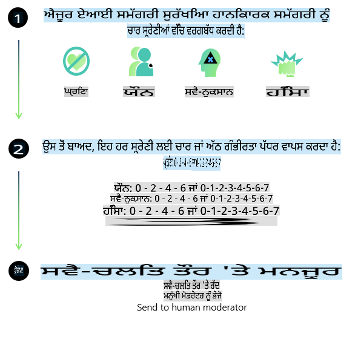
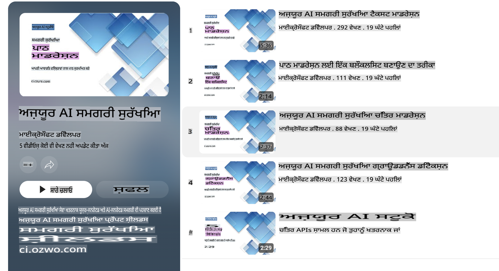

# ਫਾਈ ਮਾਡਲਾਂ ਲਈ AI ਸੁਰੱਖਿਆ

ਫਾਈ ਮਾਡਲਾਂ ਦੇ ਪਰਿਵਾਰ ਨੂੰ [ਮਾਈਕਰੋਸਾਫਟ ਰਿਸਪਾਂਸਬਲ AI ਸਟੈਂਡਰਡ](https://query.prod.cms.rt.microsoft.com/cms/api/am/binary/RE5cmFl) ਦੇ ਅਨੁਸਾਰ ਵਿਕਸਿਤ ਕੀਤਾ ਗਿਆ ਹੈ, ਜੋ ਕਿ ਕਮਪਨੀ-ਵਿਆਪੀ ਲਾਜ਼ਮੀ ਮਾਪਦੰਡਾਂ ਦਾ ਸੈੱਟ ਹੈ। ਇਹ ਮਾਪਦੰਡ ਹੇਠ ਲਿਖੇ ਛੇ ਸਿਧਾਂਤਾਂ 'ਤੇ ਆਧਾਰਿਤ ਹਨ: ਜਵਾਬਦੇਹੀ, ਪਾਰਦਰਸ਼ਤਾ, ਨਿਆਂਪੂਰਨਤਾ, ਭਰੋਸੇਯੋਗਤਾ ਅਤੇ ਸੁਰੱਖਿਆ, ਨਿੱਜਤਾ ਅਤੇ ਸੁਰੱਖਿਆ, ਅਤੇ ਸ਼ਾਮਿਲਤਾ। ਇਹ ਸਾਰੇ ਸਿਧਾਂਤ [ਮਾਈਕਰੋਸਾਫਟ ਦੇ ਜ਼ਿੰਮੇਵਾਰ AI ਦੇ ਸਿਧਾਂਤਾਂ](https://www.microsoft.com/ai/responsible-ai) ਨੂੰ ਰੂਪ ਦੇਂਦੇ ਹਨ।

ਪਿਛਲੇ ਫਾਈ ਮਾਡਲਾਂ ਵਾਂਗ ਹੀ, ਇੱਕ ਬਹੁ-ਪੱਖੀ ਸੁਰੱਖਿਆ ਮੁਲਾਂਕਣ ਅਤੇ ਸੁਰੱਖਿਆ ਪੋਸਟ-ਟ੍ਰੇਨਿੰਗ ਪਹੁੰਚ ਅਪਨਾਈ ਗਈ ਸੀ। ਇਸ ਰਿਲੀਜ਼ ਦੀ ਬਹੁ-ਭਾਸ਼ਾਈ ਸਮਰੱਥਾ ਨੂੰ ਧਿਆਨ ਵਿੱਚ ਰੱਖਦੇ ਹੋਏ ਵਾਧੂ ਕਦਮ ਚੁੱਕੇ ਗਏ। ਸਾਡੇ ਸੁਰੱਖਿਆ ਟ੍ਰੇਨਿੰਗ ਅਤੇ ਮੁਲਾਂਕਣ ਦੇ ਪਹੁੰਚੇ, ਜਿਸ ਵਿੱਚ ਕਈ ਭਾਸ਼ਾਵਾਂ ਅਤੇ ਜੋਖਮ ਸ਼੍ਰੇਣੀਆਂ ਵਿੱਚ ਟੈਸਟਿੰਗ ਸ਼ਾਮਲ ਹੈ, ਨੂੰ [ਫਾਈ ਸੁਰੱਖਿਆ ਪੋਸਟ-ਟ੍ਰੇਨਿੰਗ ਪੇਪਰ](https://arxiv.org/abs/2407.13833) ਵਿੱਚ ਵਿਆਖਿਆ ਕੀਤੀ ਗਈ ਹੈ। ਜਦੋਂ ਕਿ ਫਾਈ ਮਾਡਲ ਇਸ ਪਹੁੰਚ ਤੋਂ ਲਾਭ ਪ੍ਰਾਪਤ ਕਰਦੇ ਹਨ, ਡਿਵੈਲਪਰਾਂ ਨੂੰ ਚਾਹੀਦਾ ਹੈ ਕਿ ਉਹ ਜ਼ਿੰਮੇਵਾਰ AI ਦੇ ਸਭ ਤੋਂ ਵਧੀਆ ਅਭਿਆਸ ਅਪਨਾਉਣ, ਅਤੇ ਆਪਣੇ ਖਾਸ ਉਪਯੋਗਤਾ ਅਤੇ ਸੱਭਿਆਚਾਰਕ ਅਤੇ ਭਾਸ਼ਾਈ ਸੰਦਰਭ ਨਾਲ ਜੁੜੇ ਜੋਖਮਾਂ ਦੀ ਮੈਪਿੰਗ, ਮਾਪ ਅਤੇ ਨਿਬਾਰਨ ਕਰਨ ਲਈ ਕਦਮ ਚੁੱਕਣ।

## ਸਭ ਤੋਂ ਵਧੀਆ ਅਭਿਆਸ

ਹੋਰ ਮਾਡਲਾਂ ਵਾਂਗ, ਫਾਈ ਮਾਡਲਾਂ ਵਿੱਚ ਵੀ ਅਨਿਆਇਕ, ਅਭਰੋਸੇਯੋਗ ਜਾਂ ਅਪਮਾਨਜਨਕ ਵਿਹਾਰ ਕਰਨ ਦੀ ਸੰਭਾਵਨਾ ਹੈ।

SLM ਅਤੇ LLM ਦੇ ਕੁਝ ਸੀਮਿਤ ਵਿਹਾਰ, ਜਿਨ੍ਹਾਂ ਬਾਰੇ ਤੁਹਾਨੂੰ ਜਾਗਰੂਕ ਹੋਣਾ ਚਾਹੀਦਾ ਹੈ, ਵਿੱਚ ਸ਼ਾਮਲ ਹਨ:

- **ਸੇਵਾ ਦੀ ਗੁਣਵੱਤਾ:** ਫਾਈ ਮਾਡਲ ਮੁੱਖ ਤੌਰ 'ਤੇ ਅੰਗਰੇਜ਼ੀ ਪਾਠ 'ਤੇ ਟ੍ਰੇਨ ਕੀਤੇ ਗਏ ਹਨ। ਅੰਗਰੇਜ਼ੀ ਤੋਂ ਇਲਾਵਾ ਹੋਰ ਭਾਸ਼ਾਵਾਂ ਵਿੱਚ ਪ੍ਰਦਰਸ਼ਨ ਘੱਟ ਹੋ ਸਕਦਾ ਹੈ। ਜਿਨ੍ਹਾਂ ਅੰਗਰੇਜ਼ੀ ਭਾਸ਼ਾਵਾਂ ਦੀ ਟ੍ਰੇਨਿੰਗ ਡੇਟਾ ਵਿੱਚ ਘੱਟ ਨੁਮਾਇੰਦਗੀ ਹੈ, ਉਹਨਾਂ ਵਿੱਚ ਮਿਆਰੀ ਅਮਰੀਕੀ ਅੰਗਰੇਜ਼ੀ ਦੇ ਮੁਕਾਬਲੇ ਘੱਟ ਪ੍ਰਦਰਸ਼ਨ ਹੋ ਸਕਦਾ ਹੈ।
- **ਨੁਕਸਾਨਾਂ ਦੀ ਨੁਮਾਇੰਦਗੀ ਅਤੇ ਸਟੀਰਿਓਟਾਈਪਸ ਦਾ ਮਜ਼ਬੂਤੀ ਦੇਣਾ:** ਇਹ ਮਾਡਲ ਕੁਝ ਲੋਕ ਸਮੂਹਾਂ ਨੂੰ ਜ਼ਿਆਦਾ ਜਾਂ ਘੱਟ ਦਰਸਾ ਸਕਦੇ ਹਨ, ਕੁਝ ਸਮੂਹਾਂ ਦੀ ਨੁਮਾਇੰਦਗੀ ਨੂੰ ਮਿਟਾ ਸਕਦੇ ਹਨ, ਜਾਂ ਹਾਨੀਕਾਰਕ ਜਾਂ ਨਕਾਰਾਤਮਕ ਸਟੀਰਿਓਟਾਈਪਸ ਨੂੰ ਮਜ਼ਬੂਤ ਕਰ ਸਕਦੇ ਹਨ। ਸੁਰੱਖਿਆ ਪੋਸਟ-ਟ੍ਰੇਨਿੰਗ ਦੇ ਬਾਵਜੂਦ, ਇਹ ਸੀਮਾਵਾਂ ਅਜੇ ਵੀ ਮੌਜੂਦ ਹੋ ਸਕਦੀਆਂ ਹਨ, ਕਿਉਂਕਿ ਵੱਖ-ਵੱਖ ਸਮੂਹਾਂ ਦੀ ਨੁਮਾਇੰਦਗੀ ਦੇ ਪੱਧਰ ਜਾਂ ਸਟੀਰਿਓਟਾਈਪਸ ਦੇ ਉਦਾਹਰਣਾਂ ਦੀ ਪ੍ਰਚਲਿਤਤਾ ਟ੍ਰੇਨਿੰਗ ਡੇਟਾ ਵਿੱਚ ਅਸਲੀ ਦੁਨੀਆ ਦੇ ਰੁਝਾਨਾਂ ਅਤੇ ਸਮਾਜਿਕ ਪੱਖਪਾਤਾਂ ਨੂੰ ਦਰਸਾਉਂਦੀਆਂ ਹਨ।
- **ਗਲਤ ਜਾਂ ਅਪਮਾਨਜਨਕ ਸਮੱਗਰੀ:** ਇਹ ਮਾਡਲ ਹੋਰ ਕਿਸਮ ਦੀ ਗਲਤ ਜਾਂ ਅਪਮਾਨਜਨਕ ਸਮੱਗਰੀ ਤਿਆਰ ਕਰ ਸਕਦੇ ਹਨ, ਜੋ ਕਿ ਸੰਵੇਦਨਸ਼ੀਲ ਸੰਦਰਭਾਂ ਲਈ ਤਿਆਰ ਕਰਨ ਤੋਂ ਬਿਨਾਂ ਵਰਤਣ ਲਈ ਅਨੁਕੂਲ ਨਹੀਂ ਹੋ ਸਕਦੀ।
- **ਜਾਣਕਾਰੀ ਦੀ ਭਰੋਸੇਯੋਗਤਾ:** ਭਾਸ਼ਾ ਮਾਡਲ ਅਸੰਗਤ ਸਮੱਗਰੀ ਜਾ ਨਕਲੀ ਜਾਣਕਾਰੀ ਪੈਦਾ ਕਰ ਸਕਦੇ ਹਨ, ਜੋ ਸਹੀ ਲੱਗ ਸਕਦੀ ਹੈ ਪਰ ਅਸਲ ਵਿੱਚ ਗਲਤ ਜਾਂ ਪੁਰਾਣੀ ਹੈ।
- **ਕੋਡ ਲਈ ਸੀਮਿਤ ਸਕੋਪ:** ਫਾਈ-3 ਟ੍ਰੇਨਿੰਗ ਡੇਟਾ ਦਾ ਵੱਡਾ ਹਿੱਸਾ ਪਾਇਥਨ 'ਤੇ ਆਧਾਰਿਤ ਹੈ ਅਤੇ ਇਸ ਵਿੱਚ "typing, math, random, collections, datetime, itertools" ਵਰਗੇ ਆਮ ਪੈਕੇਜ ਸ਼ਾਮਲ ਹਨ। ਜੇ ਮਾਡਲ ਹੋਰ ਪੈਕੇਜ ਜਾਂ ਹੋਰ ਭਾਸ਼ਾਵਾਂ ਵਿੱਚ ਸਕ੍ਰਿਪਟ ਤਿਆਰ ਕਰਦੇ ਹਨ, ਤਾਂ ਅਸੀਂ ਸਖਤ ਸਿਫਾਰਸ਼ ਕਰਦੇ ਹਾਂ ਕਿ ਉਪਭੋਗਤਾ ਸਾਰੇ API ਦੀ ਵਰਤੋਂ ਨੂੰ ਮੈਨੂਅਲ ਤੌਰ 'ਤੇ ਜਾਂਚਣ।

ਡਿਵੈਲਪਰਾਂ ਨੂੰ ਜ਼ਿੰਮੇਵਾਰ AI ਦੇ ਸਭ ਤੋਂ ਵਧੀਆ ਅਭਿਆਸ ਅਪਨਾਉਣ ਚਾਹੀਦੇ ਹਨ ਅਤੇ ਇਹ ਸੁਨਿਸ਼ਚਿਤ ਕਰਨ ਲਈ ਜ਼ਿੰਮੇਵਾਰ ਹਨ ਕਿ ਖਾਸ ਉਪਯੋਗਤਾ ਸਬੰਧਤ ਕਾਨੂੰਨਾਂ ਅਤੇ ਨਿਯਮਾਂ (ਜਿਵੇਂ ਕਿ ਨਿੱਜਤਾ, ਵਪਾਰ, ਆਦਿ) ਦੇ ਅਨੁਸਾਰ ਹੈ।

## ਜ਼ਿੰਮੇਵਾਰ AI ਵਿਚਾਰ

ਹੋਰ ਭਾਸ਼ਾ ਮਾਡਲਾਂ ਵਾਂਗ, ਫਾਈ ਮਾਡਲਾਂ ਵਿੱਚ ਵੀ ਅਨਿਆਇਕ, ਅਭਰੋਸੇਯੋਗ ਜਾਂ ਅਪਮਾਨਜਨਕ ਵਿਹਾਰ ਕਰਨ ਦੀ ਸੰਭਾਵਨਾ ਹੈ। ਕੁਝ ਸੀਮਾਵਾਂ, ਜਿਨ੍ਹਾਂ ਬਾਰੇ ਜਾਗਰੂਕ ਹੋਣਾ ਚਾਹੀਦਾ ਹੈ, ਵਿੱਚ ਸ਼ਾਮਲ ਹਨ:

**ਸੇਵਾ ਦੀ ਗੁਣਵੱਤਾ:** ਫਾਈ ਮਾਡਲ ਮੁੱਖ ਤੌਰ 'ਤੇ ਅੰਗਰੇਜ਼ੀ ਪਾਠ 'ਤੇ ਟ੍ਰੇਨ ਕੀਤੇ ਗਏ ਹਨ। ਅੰਗਰੇਜ਼ੀ ਤੋਂ ਇਲਾਵਾ ਹੋਰ ਭਾਸ਼ਾਵਾਂ ਵਿੱਚ ਪ੍ਰਦਰਸ਼ਨ ਘੱਟ ਹੋ ਸਕਦਾ ਹੈ। ਜਿਨ੍ਹਾਂ ਅੰਗਰੇਜ਼ੀ ਭਾਸ਼ਾਵਾਂ ਦੀ ਟ੍ਰੇਨਿੰਗ ਡੇਟਾ ਵਿੱਚ ਘੱਟ ਨੁਮਾਇੰਦਗੀ ਹੈ, ਉਹਨਾਂ ਵਿੱਚ ਮਿਆਰੀ ਅਮਰੀਕੀ ਅੰਗਰੇਜ਼ੀ ਦੇ ਮੁਕਾਬਲੇ ਘੱਟ ਪ੍ਰਦਰਸ਼ਨ ਹੋ ਸਕਦਾ ਹੈ।

**ਨੁਕਸਾਨਾਂ ਦੀ ਨੁਮਾਇੰਦਗੀ ਅਤੇ ਸਟੀਰਿਓਟਾਈਪਸ ਦਾ ਮਜ਼ਬੂਤੀ ਦੇਣਾ:** ਇਹ ਮਾਡਲ ਕੁਝ ਲੋਕ ਸਮੂਹਾਂ ਨੂੰ ਜ਼ਿਆਦਾ ਜਾਂ ਘੱਟ ਦਰਸਾ ਸਕਦੇ ਹਨ, ਕੁਝ ਸਮੂਹਾਂ ਦੀ ਨੁਮਾਇੰਦਗੀ ਨੂੰ ਮਿਟਾ ਸਕਦੇ ਹਨ, ਜਾਂ ਹਾਨੀਕਾਰਕ ਜਾਂ ਨਕਾਰਾਤਮਕ ਸਟੀਰਿਓਟਾਈਪਸ ਨੂੰ ਮਜ਼ਬੂਤ ਕਰ ਸਕਦੇ ਹਨ। ਸੁਰੱਖਿਆ ਪੋਸਟ-ਟ੍ਰੇਨਿੰਗ ਦੇ ਬਾਵਜੂਦ, ਇਹ ਸੀਮਾਵਾਂ ਅਜੇ ਵੀ ਮੌਜੂਦ ਹੋ ਸਕਦੀਆਂ ਹਨ, ਕਿਉਂਕਿ ਵੱਖ-ਵੱਖ ਸਮੂਹਾਂ ਦੀ ਨੁਮਾਇੰਦਗੀ ਦੇ ਪੱਧਰ ਜਾਂ ਸਟੀਰਿਓਟਾਈਪਸ ਦੇ ਉਦਾਹਰਣਾਂ ਦੀ ਪ੍ਰਚਲਿਤਤਾ ਟ੍ਰੇਨਿੰਗ ਡੇਟਾ ਵਿੱਚ ਅਸਲੀ ਦੁਨੀਆ ਦੇ ਰੁਝਾਨਾਂ ਅਤੇ ਸਮਾਜਿਕ ਪੱਖਪਾਤਾਂ ਨੂੰ ਦਰਸਾਉਂਦੀਆਂ ਹਨ।

**ਗਲਤ ਜਾਂ ਅਪਮਾਨਜਨਕ ਸਮੱਗਰੀ:** ਇਹ ਮਾਡਲ ਹੋਰ ਕਿਸਮ ਦੀ ਗਲਤ ਜਾਂ ਅਪਮਾਨਜਨਕ ਸਮੱਗਰੀ ਤਿਆਰ ਕਰ ਸਕਦੇ ਹਨ, ਜੋ ਕਿ ਸੰਵੇਦਨਸ਼ੀਲ ਸੰਦਰਭਾਂ ਲਈ ਤਿਆਰ ਕਰਨ ਤੋਂ ਬਿਨਾਂ ਵਰਤਣ ਲਈ ਅਨੁਕੂਲ ਨਹੀਂ ਹੋ ਸਕਦੀ।

**ਜਾਣਕਾਰੀ ਦੀ ਭਰੋਸੇਯੋਗਤਾ:** ਭਾਸ਼ਾ ਮਾਡਲ ਅਸੰਗਤ ਸਮੱਗਰੀ ਜਾ ਨਕਲੀ ਜਾਣਕਾਰੀ ਪੈਦਾ ਕਰ ਸਕਦੇ ਹਨ, ਜੋ ਸਹੀ ਲੱਗ ਸਕਦੀ ਹੈ ਪਰ ਅਸਲ ਵਿੱਚ ਗਲਤ ਜਾਂ ਪੁਰਾਣੀ ਹੈ।

**ਕੋਡ ਲਈ ਸੀਮਿਤ ਸਕੋਪ:** ਫਾਈ-3 ਟ੍ਰੇਨਿੰਗ ਡੇਟਾ ਦਾ ਵੱਡਾ ਹਿੱਸਾ ਪਾਇਥਨ 'ਤੇ ਆਧਾਰਿਤ ਹੈ ਅਤੇ ਇਸ ਵਿੱਚ "typing, math, random, collections, datetime, itertools" ਵਰਗੇ ਆਮ ਪੈਕੇਜ ਸ਼ਾਮਲ ਹਨ। ਜੇ ਮਾਡਲ ਹੋਰ ਪੈਕੇਜ ਜਾਂ ਹੋਰ ਭਾਸ਼ਾਵਾਂ ਵਿੱਚ ਸਕ੍ਰਿਪਟ ਤਿਆਰ ਕਰਦੇ ਹਨ, ਤਾਂ ਅਸੀਂ ਸਖਤ ਸਿਫਾਰਸ਼ ਕਰਦੇ ਹਾਂ ਕਿ ਉਪਭੋਗਤਾ ਸਾਰੇ API ਦੀ ਵਰਤੋਂ ਨੂੰ ਮੈਨੂਅਲ ਤੌਰ 'ਤੇ ਜਾਂਚਣ।

ਡਿਵੈਲਪਰਾਂ ਨੂੰ ਜ਼ਿੰਮੇਵਾਰ AI ਦੇ ਸਭ ਤੋਂ ਵਧੀਆ ਅਭਿਆਸ ਅਪਨਾਉਣ ਚਾਹੀਦੇ ਹਨ ਅਤੇ ਇਹ ਸੁਨਿਸ਼ਚਿਤ ਕਰਨ ਲਈ ਜ਼ਿੰਮੇਵਾਰ ਹਨ ਕਿ ਖਾਸ ਉਪਯੋਗਤਾ ਸਬੰਧਤ ਕਾਨੂੰਨਾਂ ਅਤੇ ਨਿਯਮਾਂ (ਜਿਵੇਂ ਕਿ ਨਿੱਜਤਾ, ਵਪਾਰ, ਆਦਿ) ਦੇ ਅਨੁਸਾਰ ਹੈ। ਗੰਭੀਰ ਵਿਚਾਰ ਲਈ ਖੇਤਰ ਸ਼ਾਮਲ ਹਨ:

**ਵੰਡ:** ਮਾਡਲ ਉਹਨਾਂ ਸਥਿਤੀਆਂ ਲਈ ਉਚਿਤ ਨਹੀਂ ਹੋ ਸਕਦੇ, ਜਿਨ੍ਹਾਂ ਦਾ ਕਾਨੂੰਨੀ ਸਥਿਤੀ, ਸਰੋਤਾਂ ਜਾਂ ਜ਼ਿੰਦਗੀ ਦੇ ਮੌਕੇਆਂ 'ਤੇ ਮਹੱਤਵਪੂਰਨ ਅਸਰ ਹੋ ਸਕਦਾ ਹੈ (ਉਦਾਹਰਣ: ਘਰ, ਨੌਕਰੀ, ਕਰਜ਼ਾ ਆਦਿ) ਬਿਨਾਂ ਹੋਰ ਮੁਲਾਂਕਣ ਅਤੇ ਵਾਧੂ ਪੱਖਪਾਤ ਘਟਾਉਣ ਦੀਆਂ ਤਕਨੀਕਾਂ ਦੇ।

**ਉੱਚ-ਜੋਖਮ ਵਾਲੀਆਂ ਸਥਿਤੀਆਂ:** ਡਿਵੈਲਪਰਾਂ ਨੂੰ ਇਹ ਮੁਲਾਂਕਣ ਕਰਨਾ ਚਾਹੀਦਾ ਹੈ ਕਿ ਕੀ ਮਾਡਲ ਉਹਨਾਂ ਉੱਚ-ਜੋਖਮ ਵਾਲੀਆਂ ਸਥਿਤੀਆਂ ਲਈ ਉਚਿਤ ਹਨ, ਜਿੱਥੇ ਅਨਿਆਇਕ, ਅਭਰੋਸੇਯੋਗ ਜਾਂ ਅਪਮਾਨਜਨਕ ਨਤੀਜੇ ਬਹੁਤ ਮਹਿੰਗੇ ਜਾਂ ਨੁਕਸਾਨਦਾਇਕ ਹੋ ਸਕਦੇ ਹਨ। ਇਸ ਵਿੱਚ ਉਹ ਸਥਿਤੀਆਂ ਸ਼ਾਮਲ ਹਨ ਜਿੱਥੇ ਸਹੀ ਜਾਣਕਾਰੀ ਅਤੇ ਭਰੋਸੇਯੋਗਤਾ ਮਹੱਤਵਪੂਰਨ ਹੈ (ਉਦਾਹਰਣ: ਕਾਨੂੰਨੀ ਜਾਂ ਸਿਹਤ ਸੰਬੰਧੀ ਸਲਾਹ)। ਐਪਲੀਕੇਸ਼ਨ ਪੱਧਰ 'ਤੇ ਵਾਧੂ ਸੁਰੱਖਿਆ ਦੇ ਕਦਮ ਲਾਗੂ ਕੀਤੇ ਜਾਣ ਚਾਹੀਦੇ ਹਨ।

**ਗਲਤ ਜਾਣਕਾਰੀ:** ਮਾਡਲ ਗਲਤ ਜਾਣਕਾਰੀ ਤਿਆਰ ਕਰ ਸਕਦੇ ਹਨ। ਡਿਵੈਲਪਰਾਂ ਨੂੰ ਪਾਰਦਰਸ਼ਤਾ ਦੇ ਸਭ ਤੋਂ ਵਧੀਆ ਅਭਿਆਸ ਅਪਨਾਉਣੇ ਚਾਹੀਦੇ ਹਨ ਅਤੇ ਅੰਤਮ ਉਪਭੋਗਤਾਵਾਂ ਨੂੰ ਜਾਣਕਾਰੀ ਦੇਣੀ ਚਾਹੀਦੀ ਹੈ ਕਿ ਉਹ AI ਸਿਸਟਮ ਨਾਲ ਸੰਚਾਰ ਕਰ ਰਹੇ ਹਨ। ਐਪਲੀਕੇਸ਼ਨ ਪੱਧਰ 'ਤੇ, ਡਿਵੈਲਪਰ ਪ੍ਰਤੀਕ੍ਰਿਆ ਦੇ ਮਕੈਨਿਜ਼ਮ ਅਤੇ ਪਾਈਪਲਾਈਨ ਬਣਾਉਣ ਲਈ ਕੰਮ ਕਰ ਸਕਦੇ ਹਨ, ਜਿਨ੍ਹਾਂ ਨਾਲ ਨਤੀਜੇ ਖਾਸ ਸੰਦਰਭ ਵਿੱਚ ਸਹੀ ਜਾਣਕਾਰੀ ਨਾਲ ਜੁੜੇ ਹੋਣ, ਜਿਸ ਨੂੰ ਰਿਟਰੀਵਲ ਅਗਮੈਂਟੇਡ ਜਨਰੇਸ਼ਨ (RAG) ਕਿਹਾ ਜਾਂਦਾ ਹੈ।

**ਹਾਨੀਕਾਰਕ ਸਮੱਗਰੀ ਦੀ ਰਚਨਾ:** ਡਿਵੈਲਪਰਾਂ ਨੂੰ ਸੰਦਰਭ ਲਈ ਨਤੀਜਿਆਂ ਦੀ ਜਾਂਚ ਕਰਨੀ ਚਾਹੀਦੀ ਹੈ ਅਤੇ ਆਪਣੇ ਉਪਯੋਗਤਾ ਲਈ ਉਪਲਬਧ ਸੁਰੱਖਿਆ ਕਲਾਸੀਫਾਇਰ ਜਾਂ ਕਸਟਮ ਹੱਲ ਵਰਤਣੇ ਚਾਹੀਦੇ ਹਨ।

**ਗਲਤ ਵਰਤੋਂ:** ਧੋਖਾ, ਸਪੈਮ, ਜਾਂ ਮਾਲਵੇਅਰ ਤਿਆਰ ਕਰਨ ਵਰਗੀਆਂ ਹੋਰ ਗਲਤ ਵਰਤੋਂ ਸੰਭਵ ਹੋ ਸਕਦੀਆਂ ਹਨ, ਅਤੇ ਡਿਵੈਲਪਰਾਂ ਨੂੰ ਇਹ ਯਕੀਨੀ ਬਣਾਉਣਾ ਚਾਹੀਦਾ ਹੈ ਕਿ ਉਨ੍ਹਾਂ ਦੀਆਂ ਐਪਲੀਕੇਸ਼ਨਾਂ ਲਾਗੂ ਕਾਨੂੰਨਾਂ ਅਤੇ ਨਿਯਮਾਂ ਦਾ ਉਲੰਘਣ ਨਹੀਂ ਕਰਦੀਆਂ।

### ਫਾਈਨਟਿਊਨਿੰਗ ਅਤੇ AI ਸਮੱਗਰੀ ਸੁਰੱਖਿਆ

ਮਾਡਲ ਨੂੰ ਫਾਈਨਟਿਊਨ ਕਰਨ ਤੋਂ ਬਾਅਦ, ਅਸੀਂ ਸਖਤ ਸਿਫਾਰਸ਼ ਕਰਦੇ ਹਾਂ ਕਿ [ਅਜ਼ੂਰ AI ਸਮੱਗਰੀ ਸੁਰੱਖਿਆ](https://learn.microsoft.com/azure/ai-services/content-safety/overview) ਦੇ ਉਪਾਇ ਲਾਏ ਜਾਣ, ਤਾਂ ਜੋ ਮਾਡਲਾਂ ਦੁਆਰਾ ਤਿਆਰ ਕੀਤੀ ਸਮੱਗਰੀ ਦੀ ਨਿਗਰਾਨੀ ਕੀਤੀ ਜਾ ਸਕੇ, ਅਤੇ ਸੰਭਾਵਿਤ ਜੋਖਮ, ਖਤਰੇ ਅਤੇ ਗੁਣਵੱਤਾ ਦੇ ਮਸਲੇ ਪਛਾਣੇ ਅਤੇ ਰੋਕੇ ਜਾ ਸਕਣ।

[ਅਜ਼ੂਰ AI ਸਮੱਗਰੀ ਸੁਰੱਖਿਆ](https://learn.microsoft.com/azure/ai-services/content-safety/overview) ਟੈਕਸਟ ਅਤੇ ਚਿੱਤਰ ਸਮੱਗਰੀ ਦੋਨੋਂ ਨੂੰ ਸਹਾਇਕ ਹੈ। ਇਸਨੂੰ ਕਲਾਉਡ, ਡਿਸਕਨੈਕਟਡ ਕੰਟੇਨਰਾਂ, ਅਤੇ ਐਜ/ਐਮਬੈਡਡ ਡਿਵਾਈਸਾਂ 'ਤੇ ਤਿਆਰ ਕੀਤਾ ਜਾ ਸਕਦਾ ਹੈ।

## ਅਜ਼ੂਰ AI ਸਮੱਗਰੀ ਸੁਰੱਖਿਆ ਦਾ ਝਲਕਿਆ

ਅਜ਼ੂਰ AI ਸਮੱਗਰੀ ਸੁਰੱਖਿਆ ਇੱਕ ਸਾਰਿਆਂ ਲਈ ਇੱਕੋ ਜਿਹਾ ਹੱਲ ਨਹੀਂ ਹੈ; ਇਸਨੂੰ ਵਪਾਰਾਂ ਦੀਆਂ ਖਾਸ ਨੀਤੀਆਂ ਦੇ ਅਨੁਕੂਲ ਕੀਤਾ ਜਾ ਸਕਦਾ ਹੈ। ਵਧੇਰੇ, ਇਸਦੇ ਬਹੁ-ਭਾਸ਼ਾਈ ਮਾਡਲ ਇਸਨੂੰ ਕਈ ਭਾਸ਼ਾਵਾਂ ਨੂੰ ਇੱਕੋ ਸਮੇਂ ਸਮਝਣ ਦੇ ਯੋਗ ਬਣਾਉਂਦੇ ਹਨ।

- **ਅਜ਼ੂਰ AI ਸਮੱਗਰੀ ਸੁਰੱਖਿਆ**
- **ਮਾਈਕਰੋਸਾਫਟ ਡਿਵੈਲਪਰ**
- **5 ਵੀਡੀਓਜ਼**

ਅਜ਼ੂਰ AI ਸਮੱਗਰੀ ਸੁਰੱਖਿਆ ਸੇਵਾ ਐਪਲੀਕੇਸ਼ਨਾਂ ਅਤੇ ਸੇਵਾਵਾਂ ਵਿੱਚ ਉਪਭੋਗਤਾਵਾਂ ਦੁਆਰਾ ਤਿਆਰ ਕੀਤੀ ਗਈ ਅਤੇ AI-ਤਿਆਰ ਕੀਤੀ ਗਈ ਹਾਨੀਕਾਰਕ ਸਮੱਗਰੀ ਦਾ ਪਤਾ ਲਾਉਂਦੀ ਹੈ। ਇਸ ਵਿੱਚ ਟੈਕਸਟ ਅਤੇ ਚਿੱਤਰ API ਸ਼ਾਮਲ ਹਨ, ਜੋ ਤੁਹਾਨੂੰ ਹਾਨੀਕਾਰਕ ਜਾਂ ਅਨੁਕੂਲ ਨਹੀਂ ਸਮੱਗਰੀ ਦਾ ਪਤਾ ਲਗਾਉਣ ਵਿੱਚ ਸਹਾਇਕ ਹੁੰਦੇ ਹਨ।

[AI ਸਮੱਗਰੀ ਸੁਰੱਖਿਆ ਪਲੇਲਿਸਟ](https://www.youtube.com/playlist?list=PLlrxD0HtieHjaQ9bJjyp1T7FeCbmVcPkQ)

**ਅਸਵੀਕਰਤੀ**:  
ਇਹ ਦਸਤਾਵੇਜ਼ ਮਸ਼ੀਨ-ਅਧਾਰਿਤ AI ਅਨੁਵਾਦ ਸੇਵਾਵਾਂ ਦੀ ਵਰਤੋਂ ਕਰਕੇ ਅਨੁਵਾਦ ਕੀਤਾ ਗਿਆ ਹੈ। ਜਦੋਂ ਕਿ ਅਸੀਂ ਸਹੀ ਹੋਣ ਦੀ ਕੋਸ਼ਿਸ਼ ਕਰਦੇ ਹਾਂ, ਕਿਰਪਾ ਕਰਕੇ ਜ਼ਰੂਰ ਧਿਆਨ ਰੱਖੋ ਕਿ ਆਟੋਮੈਟਿਕ ਅਨੁਵਾਦਾਂ ਵਿੱਚ ਗਲਤੀਆਂ ਜਾਂ ਅਸੁਣਤਾ ਹੋ ਸਕਦੀ ਹੈ। ਮੂਲ ਦਸਤਾਵੇਜ਼ ਨੂੰ ਉਸਦੀ ਮੂਲ ਭਾਸ਼ਾ ਵਿੱਚ ਅਧਿਕਾਰਤ ਸਰੋਤ ਮੰਨਿਆ ਜਾਣਾ ਚਾਹੀਦਾ ਹੈ। ਮਹੱਤਵਪੂਰਨ ਜਾਣਕਾਰੀ ਲਈ, ਪੇਸ਼ੇਵਰ ਮਨੁੱਖੀ ਅਨੁਵਾਦ ਦੀ ਸਿਫਾਰਸ਼ ਕੀਤੀ ਜਾਂਦੀ ਹੈ। ਇਸ ਅਨੁਵਾਦ ਦੇ ਉਪਯੋਗ ਤੋਂ ਪੈਦਾ ਹੋਈ ਕਿਸੇ ਵੀ ਗਲਤਫਹਮੀ ਜਾਂ ਗਲਤ ਵਿਆਖਿਆ ਲਈ ਅਸੀਂ ਜ਼ਿੰਮੇਵਾਰ ਨਹੀਂ ਹਾਂ।