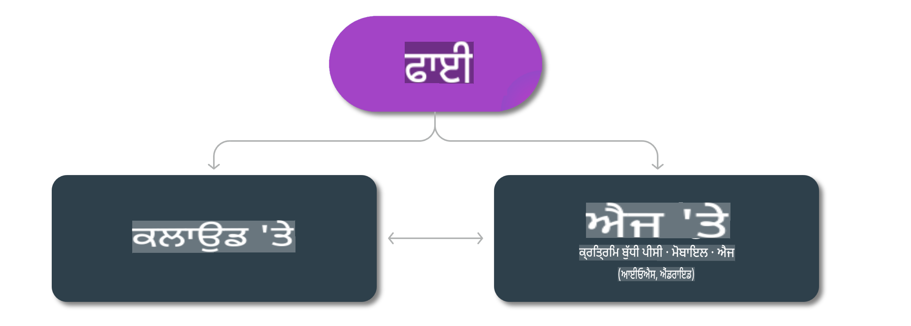

# ਫਾਈ ਮਾਡਲ ਅਤੇ ਪਲੇਟਫਾਰਮਾਂ 'ਤੇ ਉਪਲਬਧਤਾ

## ਏਜ ਅਤੇ ਕਲਾਊਡ ਸਿਨਾਰਿਓਜ਼

## ਮਾਡਲ ਉਪਲਬਧਤਾ ਅਤੇ ਸਰੋਤ

| | | | | | | | | |
|-|-|-|-|-|-|-|-|-|
|ਮਾਡਲ|ਇਨਪੁਟ|ਸਮੱਗਰੀ ਦੀ ਲੰਬਾਈ|Azure AI (MaaS)|Azure ML (MaaP)|ONNX|Hugging Face|Ollama|Nvidia NIM|
|Phi-3-vision-128k-instruct|ਟੈਕਸਟ+ਚਿੱਤਰ|128k|[ਪਲੇਗਰਾਊਂਡ ਅਤੇ ਡਿਪਲੌਇਮੈਂਟ](https://ai.azure.com/explore/models/Phi-3-vision-128k-instruct/version/2/registry/azureml)|[ਪਲੇਗਰਾਊਂਡ, ਡਿਪਲੌਇਮੈਂਟ ਅਤੇ ਫਾਈਨਟਿਊਨਿੰਗ](https://ml.azure.com/registries/azureml/models/Phi-3-vision-128k-instruct/version/2)|[CUDA](https://huggingface.co/microsoft/Phi-3-vision-128k-instruct-onnx-cuda/tree/main),[CPU](https://huggingface.co/microsoft/Phi-3-vision-128k-instruct-onnx-cpu/tree/main), [DirectML](https://huggingface.co/microsoft/Phi-3-vision-128k-instruct-onnx-directml/tree/main)|[ਡਾਊਨਲੋਡ ਕਰੋ](https://huggingface.co/microsoft/Phi-3-vision-128k-instruct)|-NA-|[NIM APIs](https://build.nvidia.com/microsoft/phi-3-vision-128k-instruct)|
|Phi-3-mini-4k-instruct|ਟੈਕਸਟ|4k|[ਪਲੇਗਰਾਊਂਡ ਅਤੇ ਡਿਪਲੌਇਮੈਂਟ](https://aka.ms/phi3-mini-4k-azure-ml)|[ਪਲੇਗਰਾਊਂਡ, ਡਿਪਲੌਇਮੈਂਟ](https://aka.ms/phi3-mini-4k-azure-ml) ਅਤੇ ਫਾਈਨਟਿਊਨਿੰਗ|[CUDA](https://huggingface.co/microsoft/Phi-3-mini-4k-instruct-onnx), [ਵੈੱਬ](https://huggingface.co/microsoft/Phi-3-mini-4k-instruct-onnx)|[ਪਲੇਗਰਾਊਂਡ ਅਤੇ ਡਾਊਨਲੋਡ](https://huggingface.co/chat/models/microsoft/Phi-3-mini-4k-instruct)|[GGUF](https://huggingface.co/microsoft/Phi-3-mini-4k-instruct-gguf)|[NIM APIs](https://build.nvidia.com/microsoft/phi-3-mini-4k)|
|Phi-3-mini-128k-instruct|ਟੈਕਸਟ|128k|[ਪਲੇਗਰਾਊਂਡ ਅਤੇ ਡਿਪਲੌਇਮੈਂਟ](https://ai.azure.com/explore/models/Phi-3-mini-128k-instruct/version/9/registry/azureml)|[ਪਲੇਗਰਾਊਂਡ, ਡਿਪਲੌਇਮੈਂਟ](https://ai.azure.com/explore/models/Phi-3-mini-128k-instruct/version/9/registry/azureml) ਅਤੇ ਫਾਈਨਟਿਊਨਿੰਗ|[CUDA](https://huggingface.co/microsoft/Phi-3-mini-128k-instruct-onnx)|[ਡਾਊਨਲੋਡ ਕਰੋ](https://huggingface.co/microsoft/Phi-3-mini-128k-instruct-onnx)|-NA-|[NIM APIs](https://build.nvidia.com/microsoft/phi-3-mini)|
|Phi-3-small-8k-instruct|ਟੈਕਸਟ|8k|[ਪਲੇਗਰਾਊਂਡ ਅਤੇ ਡਿਪਲੌਇਮੈਂਟ](https://ml.azure.com/registries/azureml/models/Phi-3-small-8k-instruct/version/2)|[ਪਲੇਗਰਾਊਂਡ, ਡਿਪਲੌਇਮੈਂਟ](https://ai.azure.com/explore/models/Phi-3-small-8k-instruct/version/2/registry/azureml) ਅਤੇ ਫਾਈਨਟਿਊਨਿੰਗ|[CUDA](https://huggingface.co/microsoft/Phi-3-small-8k-instruct-onnx-cuda)|[ਡਾਊਨਲੋਡ ਕਰੋ](https://huggingface.co/microsoft/Phi-3-small-8k-instruct-onnx-cuda)|-NA-|[NIM APIs](https://build.nvidia.com/microsoft/phi-3-small-8k-instruct?docker=false)|
|Phi-3-small-128k-instruct|ਟੈਕਸਟ|128k|[ਪਲੇਗਰਾਊਂਡ ਅਤੇ ਡਿਪਲੌਇਮੈਂਟ](https://ai.azure.com/explore/models/Phi-3-small-128k-instruct/version/2/registry/azureml)|[ਪਲੇਗਰਾਊਂਡ, ਡਿਪਲੌਇਮੈਂਟ](https://ml.azure.com/registries/azureml/models/Phi-3-small-128k-instruct/version/2) ਅਤੇ ਫਾਈਨਟਿਊਨਿੰਗ|[CUDA](https://huggingface.co/microsoft/Phi-3-medium-128k-instruct-onnx-cuda)|[ਡਾਊਨਲੋਡ ਕਰੋ](https://huggingface.co/microsoft/Phi-3-small-128k-instruct)|-NA-|[NIM APIs](https://build.nvidia.com/microsoft/phi-3-small-128k-instruct?docker=false)|
|Phi-3-medium-4k-instruct|ਟੈਕਸਟ|4k|[Playground ਅਤੇ Deployment](https://huggingface.co/microsoft/Phi-3-medium-4k-instruct)|[Playground, Deployment](https://ml.azure.com/registries/azureml/models/Phi-3-medium-4k-instruct/version/2) ਅਤੇ Finetuning|[CUDA](https://huggingface.co/microsoft/Phi-3-medium-4k-instruct-onnx-cuda/tree/main), [CPU](https://huggingface.co/microsoft/Phi-3-medium-4k-instruct-onnx-cpu/tree/main), [DirectML](https://huggingface.co/microsoft/Phi-3-medium-4k-instruct-onnx-directml/tree/main)|[Download](https://huggingface.co/microsoft/Phi-3-medium-4k-instruct)|-NA-|[NIM APIs](https://build.nvidia.com/microsoft/phi-3-medium-4k-instruct?docker=false)|
|Phi-3-medium-128k-instruct|ਟੈਕਸਟ|128k|[Playground ਅਤੇ Deployment](https://ai.azure.com/explore/models/Phi-3-medium-128k-instruct/version/2)|[Playground, Deployment](https://ml.azure.com/registries/azureml/models/Phi-3-medium-128k-instruct/version/2) ਅਤੇ Finetuning|[CUDA](https://huggingface.co/microsoft/Phi-3-medium-128k-instruct-onnx-cuda/tree/main), [CPU](https://huggingface.co/microsoft/Phi-3-medium-128k-instruct-onnx-cpu/tree/main), [DirectML](https://huggingface.co/microsoft/Phi-3-medium-128k-instruct-onnx-directml/tree/main)|[Download](https://huggingface.co/microsoft/Phi-3-medium-128k-instruct)|-NA-|-NA-|

**ਅਸਵੀਕਰਤੀ**:  
ਇਹ ਦਸਤਾਵੇਜ਼ ਮਸ਼ੀਨ-ਆਧਾਰਿਤ AI ਅਨੁਵਾਦ ਸੇਵਾਵਾਂ ਦੀ ਵਰਤੋਂ ਕਰਕੇ ਅਨੁਵਾਦ ਕੀਤਾ ਗਿਆ ਹੈ। ਜਦੋਂ ਕਿ ਅਸੀਂ ਸਹੀ ਹੋਣ ਦਾ ਯਤਨ ਕਰਦੇ ਹਾਂ, ਕਿਰਪਾ ਕਰਕੇ ਧਿਆਨ ਦਿਓ ਕਿ ਆਟੋਮੈਟਿਕ ਅਨੁਵਾਦਾਂ ਵਿੱਚ ਗਲਤੀਆਂ ਜਾਂ ਅਸੁੱਚਤਾਵਾਂ ਹੋ ਸਕਦੀਆਂ ਹਨ। ਇਸਦੀ ਮੂਲ ਭਾਸ਼ਾ ਵਿੱਚ ਮੌਜੂਦ ਮੂਲ ਦਸਤਾਵੇਜ਼ ਨੂੰ ਪ੍ਰਮਾਣਿਕ ਸਰੋਤ ਮੰਨਿਆ ਜਾਣਾ ਚਾਹੀਦਾ ਹੈ। ਮਹੱਤਵਪੂਰਨ ਜਾਣਕਾਰੀ ਲਈ, ਪੇਸ਼ੇਵਰ ਮਨੁੱਖੀ ਅਨੁਵਾਦ ਦੀ ਸਿਫਾਰਸ਼ ਕੀਤੀ ਜਾਂਦੀ ਹੈ। ਅਸੀਂ ਇਸ ਅਨੁਵਾਦ ਦੇ ਉਪਯੋਗ ਨਾਲ ਪੈਦਾ ਹੋਣ ਵਾਲੇ ਕਿਸੇ ਵੀ ਗਲਤ ਫਹਿਮੀ ਜਾਂ ਗਲਤ ਵਿਆਖਿਆ ਲਈ ਜ਼ਿੰਮੇਵਾਰ ਨਹੀਂ ਹਾਂ।