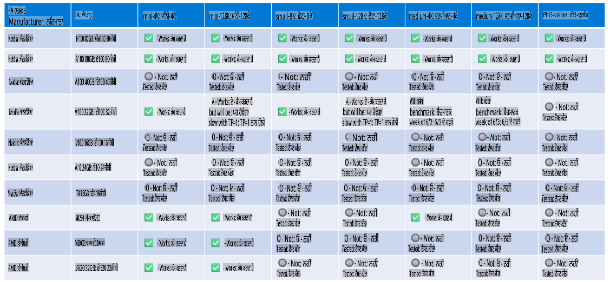

# ਫਾਈ ਹਾਰਡਵੇਅਰ ਸਪੋਰਟ

ਮਾਈਕਰੋਸਾਫਟ ਫਾਈ ਨੂੰ ONNX Runtime ਲਈ ਆਪਟੀਮਾਈਜ਼ ਕੀਤਾ ਗਿਆ ਹੈ ਅਤੇ ਇਹ Windows DirectML ਨੂੰ ਸਪੋਰਟ ਕਰਦਾ ਹੈ। ਇਹ ਵੱਖ-ਵੱਖ ਹਾਰਡਵੇਅਰ ਪ੍ਰਕਾਰਾਂ, ਜਿਵੇਂ ਕਿ GPUs, CPUs, ਅਤੇ ਇੱਥੇ ਤੱਕ ਕਿ ਮੋਬਾਈਲ ਡਿਵਾਈਸਾਂ 'ਤੇ ਵੀ ਚੰਗਾ ਕੰਮ ਕਰਦਾ ਹੈ।

## ਡਿਵਾਈਸ ਹਾਰਡਵੇਅਰ  
ਖਾਸ ਤੌਰ 'ਤੇ, ਸਮਰਥਿਤ ਹਾਰਡਵੇਅਰ ਵਿੱਚ ਸ਼ਾਮਲ ਹਨ:

- GPU SKU: RTX 4090 (DirectML)  
- GPU SKU: 1 A100 80GB (CUDA)  
- CPU SKU: Standard F64s v2 (64 vCPUs, 128 GiB ਮੈਮੋਰੀ)

## ਮੋਬਾਈਲ SKU

- ਐਂਡਰਾਇਡ - ਸੈਮਸੰਗ ਗੈਲੈਕਸੀ S21  
- ਐਪਲ ਆਈਫੋਨ 14 ਜਾਂ ਉੱਚਾ A16/A17 ਪ੍ਰੋਸੈਸਰ  

## ਫਾਈ ਹਾਰਡਵੇਅਰ ਸਪੈਸਿਫਿਕੇਸ਼ਨ

- ਘੱਟੋ-ਘੱਟ ਸੰਰਚਨਾ ਦੀ ਲੋੜ।  
- Windows: DirectX 12-ਸਮਰਥਿਤ GPU ਅਤੇ ਘੱਟੋ-ਘੱਟ 4GB ਦੀ ਸੰਯੁਕਤ ਰੈਮ  

CUDA: NVIDIA GPU ਜਿਸਦੀ Compute Capability >= 7.02 ਹੋਵੇ  



## ਕਈ GPUs 'ਤੇ onnxruntime ਚਲਾਉਣਾ

ਵਰਤਮਾਨ ਵਿੱਚ ਉਪਲਬਧ ਫਾਈ ONNX ਮਾਡਲ ਸਿਰਫ 1 GPU ਲਈ ਹਨ। ਫਾਈ ਮਾਡਲ ਲਈ ਮਲਟੀ-GPU ਸਪੋਰਟ ਮੁਮਕਿਨ ਹੈ, ਪਰ ORT ਨਾਲ 2 GPU ਇਹ ਗਾਰੰਟੀ ਨਹੀਂ ਦਿੰਦਾ ਕਿ ਇਹ 2 ORT ਇੰਸਟੈਂਸ ਦੇ ਮੁਕਾਬਲੇ ਵਧੇਰੇ ਔਟਪੁੱਟ ਦੇਵੇਗਾ। ਕਿਰਪਾ ਕਰਕੇ ਨਵੀਆਂ ਅਪਡੇਟਾਂ ਲਈ [ONNX Runtime](https://onnxruntime.ai/) ਵੇਖੋ।  

[Build 2024 the GenAI ONNX Team](https://youtu.be/WLW4SE8M9i8?si=EtG04UwDvcjunyfC) 'ਤੇ ਇਹ ਐਲਾਨ ਕੀਤਾ ਗਿਆ ਕਿ ਉਨ੍ਹਾਂ ਨੇ ਫਾਈ ਮਾਡਲਾਂ ਲਈ ਮਲਟੀ-GPU ਦੀ ਬਜਾਏ ਮਲਟੀ-ਇੰਸਟੈਂਸ ਸਮਰਥਨ ਸ਼ੁਰੂ ਕੀਤਾ ਹੈ।  

ਇਸ ਸਮੇਂ ਇਹ ਤੁਹਾਨੂੰ CUDA_VISIBLE_DEVICES ਐਨਵਾਇਰਮੈਂਟ ਵੈਰੀਏਬਲ ਨਾਲ ਇੱਕ onnxruntime ਜਾਂ onnxruntime-genai ਇੰਸਟੈਂਸ ਚਲਾਉਣ ਦੀ ਆਗਿਆ ਦਿੰਦਾ ਹੈ, ਇਸ ਤਰ੍ਹਾਂ:

```Python
CUDA_VISIBLE_DEVICES=0 python infer.py
CUDA_VISIBLE_DEVICES=1 python infer.py
```

ਫਾਈ ਨੂੰ ਹੋਰ ਖੋਜਣ ਲਈ [Azure AI Foundry](https://ai.azure.com) 'ਤੇ ਜਾਓ।

**ਅਸਵੀਕਤੀ**:  
ਇਹ ਦਸਤਾਵੇਜ਼ ਮਸ਼ੀਨ ਅਧਾਰਿਤ AI ਅਨੁਵਾਦ ਸੇਵਾਵਾਂ ਦੀ ਵਰਤੋਂ ਕਰਕੇ ਅਨੁਵਾਦ ਕੀਤਾ ਗਿਆ ਹੈ। ਅਸੀਂ ਸਹੀ ਹੋਣ ਦੀ ਪੂਰੀ ਕੋਸ਼ਿਸ਼ ਕਰਦੇ ਹਾਂ, ਪਰ ਕਿਰਪਾ ਕਰਕੇ ਧਿਆਨ ਦਿਓ ਕਿ ਆਟੋਮੈਟਿਕ ਅਨੁਵਾਦਾਂ ਵਿੱਚ ਗਲਤੀਆਂ ਜਾਂ ਅਸੁਚੱਜੇ ਤੱਥ ਹੋ ਸਕਦੇ ਹਨ। ਇਸ ਦੀ ਮੂਲ ਭਾਸ਼ਾ ਵਿੱਚ ਮੌਜੂਦ ਅਸਲੀ ਦਸਤਾਵੇਜ਼ ਨੂੰ ਅਧਿਕਾਰਕ ਸਰੋਤ ਮੰਨਿਆ ਜਾਣਾ ਚਾਹੀਦਾ ਹੈ। ਮਹੱਤਵਪੂਰਨ ਜਾਣਕਾਰੀ ਲਈ, ਪੇਸ਼ੇਵਰ ਮਨੁੱਖੀ ਅਨੁਵਾਦ ਦੀ ਸਿਫਾਰਿਸ਼ ਕੀਤੀ ਜਾਂਦੀ ਹੈ। ਇਸ ਅਨੁਵਾਦ ਦੇ ਉਪਯੋਗ ਤੋਂ ਪੈਦਾ ਹੋਣ ਵਾਲੇ ਕਿਸੇ ਵੀ ਗਲਤ ਫਹਿਮੀ ਜਾਂ ਗਲਤ ਵਿਆਖਿਆ ਲਈ ਅਸੀਂ ਜ਼ਿੰਮੇਵਾਰ ਨਹੀਂ ਹਾਂ। 