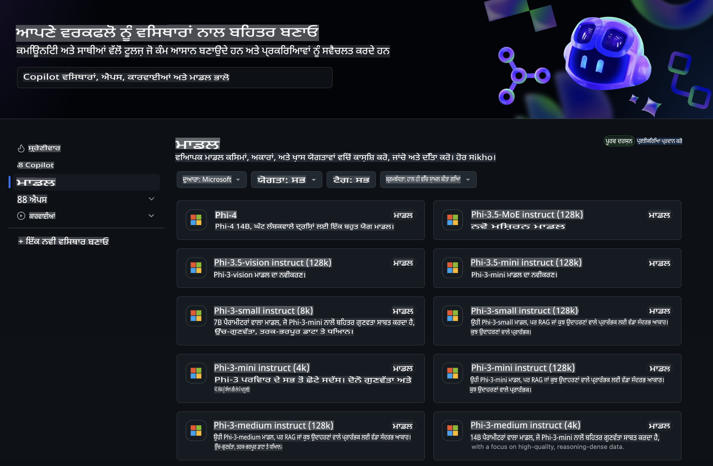
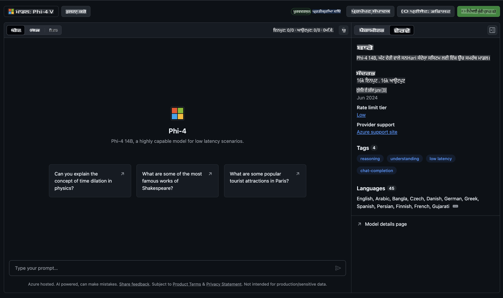
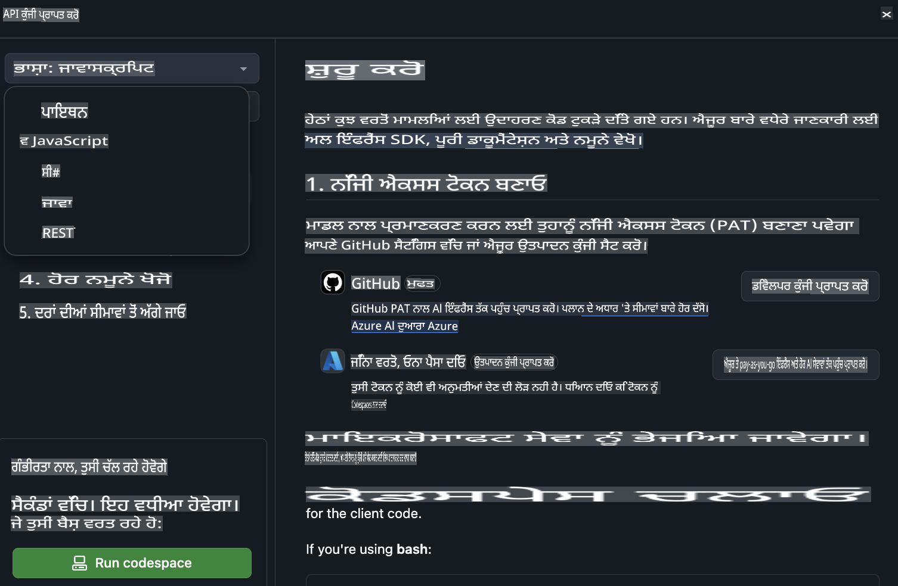
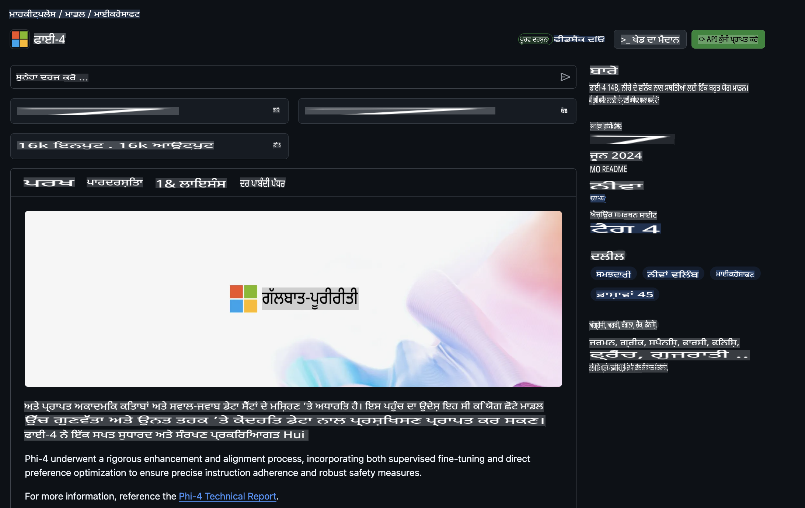

## ਗਿਟਹੱਬ ਮਾਡਲਜ਼ ਵਿੱਚ ਫਾਈ ਪਰਿਵਾਰ

[ਗਿਟਹੱਬ ਮਾਡਲਜ਼](https://github.com/marketplace/models) ਵਿੱਚ ਤੁਹਾਡਾ ਸਵਾਗਤ ਹੈ! ਅਸੀਂ ਸਾਰਾ ਸੈੱਟਅੱਪ ਕਰ ਦਿੱਤਾ ਹੈ ਅਤੇ ਤੁਸੀਂ Azure AI ਉੱਤੇ ਹੋਸਟ ਕੀਤੇ AI ਮਾਡਲਜ਼ ਦੀ ਖੋਜ ਕਰ ਸਕਦੇ ਹੋ।



ਗਿਟਹੱਬ ਮਾਡਲਜ਼ 'ਤੇ ਉਪਲਬਧ ਮਾਡਲਜ਼ ਬਾਰੇ ਹੋਰ ਜਾਣਕਾਰੀ ਲਈ, [ਗਿਟਹੱਬ ਮਾਡਲ ਮਾਰਕੀਟਪਲੇਸ](https://github.com/marketplace/models) ਵੇਖੋ।

## ਉਪਲਬਧ ਮਾਡਲਜ਼

ਹਰ ਮਾਡਲ ਲਈ ਇੱਕ ਸਮਰਪਿਤ ਪਲੇਗ੍ਰਾਊਂਡ ਅਤੇ ਨਮੂਨਾ ਕੋਡ ਉਪਲਬਧ ਹੈ।



### ਗਿਟਹੱਬ ਮਾਡਲ ਕੈਟਾਲਾਗ ਵਿੱਚ ਫਾਈ ਪਰਿਵਾਰ

- [Phi-4](https://github.com/marketplace/models/azureml/Phi-4)

- [Phi-3.5-MoE instruct (128k)](https://github.com/marketplace/models/azureml/Phi-3-5-MoE-instruct)

- [Phi-3.5-vision instruct (128k)](https://github.com/marketplace/models/azureml/Phi-3-5-vision-instruct)

- [Phi-3.5-mini instruct (128k)](https://github.com/marketplace/models/azureml/Phi-3-5-mini-instruct)

- [Phi-3-Medium-128k-Instruct](https://github.com/marketplace/models/azureml/Phi-3-medium-128k-instruct)

- [Phi-3-medium-4k-instruct](https://github.com/marketplace/models/azureml/Phi-3-medium-4k-instruct)

- [Phi-3-mini-128k-instruct](https://github.com/marketplace/models/azureml/Phi-3-mini-128k-instruct)

- [Phi-3-mini-4k-instruct](https://github.com/marketplace/models/azureml/Phi-3-mini-4k-instruct)

- [Phi-3-small-128k-instruct](https://github.com/marketplace/models/azureml/Phi-3-small-128k-instruct)

- [Phi-3-small-8k-instruct](https://github.com/marketplace/models/azureml/Phi-3-small-8k-instruct)

## ਸ਼ੁਰੂਆਤ

ਕੁਝ ਬੁਨਿਆਦੀ ਉਦਾਹਰਣ ਤਿਆਰ ਹਨ ਜੋ ਤੁਸੀਂ ਚਲਾ ਸਕਦੇ ਹੋ। ਇਹ ਉਦਾਹਰਣ ਤੁਹਾਨੂੰ ਸੈਂਪਲ ਡਾਇਰੈਕਟਰੀ ਵਿੱਚ ਮਿਲਣਗੇ। ਜੇ ਤੁਸੀਂ ਆਪਣੇ ਮਨਪਸੰਦ ਭਾਸ਼ਾ ਵਿੱਚ ਜਲਦੀ ਕੂਦਣਾ ਚਾਹੁੰਦੇ ਹੋ, ਤਾਂ ਤੁਸੀਂ ਹੇਠਾਂ ਦਿੱਤੀਆਂ ਭਾਸ਼ਾਵਾਂ ਵਿੱਚ ਉਦਾਹਰਣ ਲੱਭ ਸਕਦੇ ਹੋ:

- Python  
- JavaScript  
- C#  
- Java  
- cURL  

ਇਸ ਤੋਂ ਇਲਾਵਾ, ਸੈਂਪਲ ਅਤੇ ਮਾਡਲ ਚਲਾਉਣ ਲਈ ਇੱਕ ਸਮਰਪਿਤ ਕੋਡਸਪੇਸ ਐਨਵਾਇਰਨਮੈਂਟ ਵੀ ਉਪਲਬਧ ਹੈ।  



## ਨਮੂਨਾ ਕੋਡ

ਹੇਠਾਂ ਕੁਝ ਵਰਤੋਂ ਦੇ ਕੇਸਾਂ ਲਈ ਉਦਾਹਰਣ ਕੋਡ ਦਿੱਤਾ ਗਿਆ ਹੈ। Azure AI Inference SDK ਬਾਰੇ ਹੋਰ ਜਾਣਕਾਰੀ ਲਈ, ਪੂਰੀ ਦਸਤਾਵੇਜ਼ ਅਤੇ ਸੈਂਪਲ ਵੇਖੋ।  

## ਸੈਟਅੱਪ  

1. ਪ੍ਰਸਨਲ ਐਕਸੈਸ ਟੋਕਨ ਬਣਾਓ  
ਤੁਹਾਨੂੰ ਟੋਕਨ ਨੂੰ ਕੋਈ ਵੀ ਅਧਿਕਾਰ ਦੇਣ ਦੀ ਲੋੜ ਨਹੀਂ ਹੈ। ਧਿਆਨ ਦਿਓ ਕਿ ਟੋਕਨ ਇੱਕ ਮਾਈਕਰੋਸਾਫਟ ਸੇਵਾ ਨੂੰ ਭੇਜਿਆ ਜਾਵੇਗਾ।  

ਹੇਠਾਂ ਦਿੱਤੇ ਕੋਡ ਸੈਗਮੈਂਟਾਂ ਦੀ ਵਰਤੋਂ ਕਰਨ ਲਈ, ਇੱਕ ਐਨਵਾਇਰਨਮੈਂਟ ਵੈਰੀਏਬਲ ਬਣਾਓ ਅਤੇ ਆਪਣੇ ਟੋਕਨ ਨੂੰ ਕਲਾਇੰਟ ਕੋਡ ਲਈ ਕੁੰਜੀ ਵਜੋਂ ਸੈਟ ਕਰੋ।  

ਜੇ ਤੁਸੀਂ ਬੈਸ਼ ਵਰਤ ਰਹੇ ਹੋ:  
```
export GITHUB_TOKEN="<your-github-token-goes-here>"
```  
ਜੇ ਤੁਸੀਂ ਪਾਵਰਸ਼ੈਲ ਵਿੱਚ ਹੋ:  
```
$Env:GITHUB_TOKEN="<your-github-token-goes-here>"
```  

ਜੇ ਤੁਸੀਂ Windows ਕਮਾਂਡ ਪ੍ਰਾਂਪਟ ਵਰਤ ਰਹੇ ਹੋ:  
```
set GITHUB_TOKEN=<your-github-token-goes-here>
```  

## Python ਨਮੂਨਾ  

### Dependencies ਇੰਸਟਾਲ ਕਰੋ  
pip ਦੀ ਵਰਤੋਂ ਕਰਕੇ Azure AI Inference SDK ਇੰਸਟਾਲ ਕਰੋ (ਲੋੜ: Python >=3.8):  

```
pip install azure-ai-inference
```  

### ਇੱਕ ਬੁਨਿਆਦੀ ਕੋਡ ਸੈਂਪਲ ਚਲਾਓ  

ਇਹ ਸੈਂਪਲ ਚੈਟ ਕਮਪੀਟੀਸ਼ਨ API ਲਈ ਇੱਕ ਬੁਨਿਆਦੀ ਕਾਲ ਦਿਖਾਉਂਦਾ ਹੈ। ਇਹ GitHub AI ਮਾਡਲ ਇਨਫਰੈਂਸ ਐਂਡਪੌਇੰਟ ਅਤੇ ਤੁਹਾਡੇ GitHub ਟੋਕਨ ਦੀ ਵਰਤੋਂ ਕਰ ਰਿਹਾ ਹੈ। ਕਾਲ ਸਮਕਾਲੀ ਹੈ।  

```python
import os
from azure.ai.inference import ChatCompletionsClient
from azure.ai.inference.models import SystemMessage, UserMessage
from azure.core.credentials import AzureKeyCredential

endpoint = "https://models.inference.ai.azure.com"
model_name = "Phi-4"
token = os.environ["GITHUB_TOKEN"]

client = ChatCompletionsClient(
    endpoint=endpoint,
    credential=AzureKeyCredential(token),
)

response = client.complete(
    messages=[
        UserMessage(content="I have $20,000 in my savings account, where I receive a 4% profit per year and payments twice a year. Can you please tell me how long it will take for me to become a millionaire? Also, can you please explain the math step by step as if you were explaining it to an uneducated person?"),
    ],
    temperature=0.4,
    top_p=1.0,
    max_tokens=2048,
    model=model_name
)

print(response.choices[0].message.content)
```  

### ਇੱਕ ਬਹੁ-ਟਰਨ ਗੱਲਬਾਤ ਚਲਾਓ  

ਇਹ ਸੈਂਪਲ ਚੈਟ ਕਮਪੀਟੀਸ਼ਨ API ਨਾਲ ਇੱਕ ਬਹੁ-ਟਰਨ ਗੱਲਬਾਤ ਦਿਖਾਉਂਦਾ ਹੈ। ਜਦੋਂ ਤੁਸੀਂ ਮਾਡਲ ਨੂੰ ਇੱਕ ਚੈਟ ਐਪਲੀਕੇਸ਼ਨ ਲਈ ਵਰਤ ਰਹੇ ਹੋ, ਤਾਂ ਤੁਹਾਨੂੰ ਉਸ ਗੱਲਬਾਤ ਦੇ ਇਤਿਹਾਸ ਨੂੰ ਪ੍ਰਬੰਧਿਤ ਕਰਨਾ ਪਵੇਗਾ ਅਤੇ ਮਾਡਲ ਨੂੰ ਨਵੀਨਤਮ ਸੁਨੇਹੇ ਭੇਜਣੇ ਪੈਣਗੇ।  

```
import os
from azure.ai.inference import ChatCompletionsClient
from azure.ai.inference.models import AssistantMessage, SystemMessage, UserMessage
from azure.core.credentials import AzureKeyCredential

token = os.environ["GITHUB_TOKEN"]
endpoint = "https://models.inference.ai.azure.com"
# Replace Model_Name
model_name = "Phi-4"

client = ChatCompletionsClient(
    endpoint=endpoint,
    credential=AzureKeyCredential(token),
)

messages = [
    SystemMessage(content="You are a helpful assistant."),
    UserMessage(content="What is the capital of France?"),
    AssistantMessage(content="The capital of France is Paris."),
    UserMessage(content="What about Spain?"),
]

response = client.complete(messages=messages, model=model_name)

print(response.choices[0].message.content)
```  

### ਆਉਟਪੁੱਟ ਨੂੰ ਸਟ੍ਰੀਮ ਕਰੋ  

ਵਧੀਆ ਯੂਜ਼ਰ ਅਨੁਭਵ ਲਈ, ਤੁਸੀਂ ਮਾਡਲ ਦੇ ਜਵਾਬ ਨੂੰ ਸਟ੍ਰੀਮ ਕਰਨਾ ਚਾਹੋਗੇ ਤਾਂ ਜੋ ਪਹਿਲਾ ਟੋਕਨ ਜਲਦੀ ਦਿਖਾਈ ਦੇਵੇ ਅਤੇ ਲੰਬੇ ਜਵਾਬਾਂ ਲਈ ਉਡੀਕ ਕਰਨ ਦੀ ਲੋੜ ਨਾ ਪਵੇ।  

```
import os
from azure.ai.inference import ChatCompletionsClient
from azure.ai.inference.models import SystemMessage, UserMessage
from azure.core.credentials import AzureKeyCredential

token = os.environ["GITHUB_TOKEN"]
endpoint = "https://models.inference.ai.azure.com"
# Replace Model_Name
model_name = "Phi-4"

client = ChatCompletionsClient(
    endpoint=endpoint,
    credential=AzureKeyCredential(token),
)

response = client.complete(
    stream=True,
    messages=[
        SystemMessage(content="You are a helpful assistant."),
        UserMessage(content="Give me 5 good reasons why I should exercise every day."),
    ],
    model=model_name,
)

for update in response:
    if update.choices:
        print(update.choices[0].delta.content or "", end="")

client.close()
```  

## ਗਿਟਹੱਬ ਮਾਡਲਜ਼ ਲਈ ਮੁਫਤ ਵਰਤੋਂ ਅਤੇ ਰੇਟ ਲਿਮਟਸ  



[ਪਲੇਗ੍ਰਾਊਂਡ ਅਤੇ ਮੁਫਤ API ਵਰਤੋਂ ਲਈ ਰੇਟ ਲਿਮਟਸ](https://docs.github.com/en/github-models/prototyping-with-ai-models#rate-limits) ਤੁਹਾਨੂੰ ਮਾਡਲਜ਼ ਦੀ ਪਰਖ ਕਰਨ ਅਤੇ ਆਪਣੀ AI ਐਪਲੀਕੇਸ਼ਨ ਦਾ ਪ੍ਰੋਟੋਟਾਈਪ ਬਣਾਉਣ ਵਿੱਚ ਮਦਦ ਕਰਨ ਲਈ ਹਨ। ਜੇ ਤੁਸੀਂ ਇਹ ਸੀਮਾਵਾਂ ਪਾਰ ਕਰਦੇ ਹੋ, ਜਾਂ ਆਪਣੀ ਐਪਲੀਕੇਸ਼ਨ ਨੂੰ ਸਕੇਲ ਕਰਨਾ ਚਾਹੁੰਦੇ ਹੋ, ਤਾਂ ਤੁਹਾਨੂੰ Azure ਖਾਤੇ ਤੋਂ ਸਰੋਤ ਪ੍ਰਬੰਧਿਤ ਕਰਨੇ ਪੈਣਗੇ ਅਤੇ ਉੱਥੇ ਤੋਂ ਪ੍ਰਮਾਣਿਕਤਾ ਪ੍ਰਾਪਤ ਕਰਨੀ ਪਵੇਗੀ। ਤੁਹਾਨੂੰ ਆਪਣੇ ਕੋਡ ਵਿੱਚ ਹੋਰ ਕੁਝ ਵੀ ਬਦਲਣ ਦੀ ਲੋੜ ਨਹੀਂ ਹੈ। ਇਸ ਲਿੰਕ ਦੀ ਵਰਤੋਂ ਕਰਕੇ ਜਾਣੋ ਕਿ Azure AI ਵਿੱਚ ਮੁਫਤ ਟੀਅਰ ਸੀਮਾਵਾਂ ਤੋਂ ਅੱਗੇ ਕਿਵੇਂ ਜਾਏ।  

### ਖੁਲਾਸੇ  

ਯਾਦ ਰੱਖੋ ਕਿ ਮਾਡਲ ਨਾਲ ਅੰਤਰਕਿਰਿਆ ਕਰਦੇ ਸਮੇਂ ਤੁਸੀਂ AI ਨਾਲ ਪ੍ਰਯੋਗ ਕਰ ਰਹੇ ਹੋ, ਇਸ ਲਈ ਸਮੱਗਰੀ ਵਿੱਚ ਗਲਤੀਆਂ ਹੋ ਸਕਦੀਆਂ ਹਨ।  

ਇਹ ਵਿਸ਼ੇਸ਼ਤਾ ਵੱਖ-ਵੱਖ ਸੀਮਾਵਾਂ (ਜਿਵੇਂ ਕਿ ਪ੍ਰਤੀ ਮਿੰਟ ਬੇਨਤੀ, ਪ੍ਰਤੀ ਦਿਨ ਬੇਨਤੀ, ਪ੍ਰਤੀ ਬੇਨਤੀ ਟੋਕਨ, ਅਤੇ ਸਮਕਾਲੀ ਬੇਨਤੀਆਂ) ਦੇ ਅਧੀਨ ਹੈ ਅਤੇ ਇਹ ਉਤਪਾਦਨ ਉਦੇਸ਼ਾਂ ਲਈ ਡਿਜ਼ਾਈਨ ਨਹੀਂ ਕੀਤੀ ਗਈ।  

GitHub ਮਾਡਲਜ਼ Azure AI Content Safety ਦੀ ਵਰਤੋਂ ਕਰਦੇ ਹਨ। ਇਹ ਫਿਲਟਰ GitHub ਮਾਡਲਜ਼ ਦੇ ਅਨੁਭਵ ਦਾ ਹਿੱਸਾ ਵਜੋਂ ਬੰਦ ਨਹੀਂ ਕੀਤੇ ਜਾ ਸਕਦੇ। ਜੇ ਤੁਸੀਂ ਮਾਡਲਜ਼ ਨੂੰ ਇੱਕ ਭੁਗਤਾਨੀ ਸੇਵਾ ਦੇ ਰੂਪ ਵਿੱਚ ਵਰਤਣ ਦਾ ਫੈਸਲਾ ਕਰਦੇ ਹੋ, ਤਾਂ ਕਿਰਪਾ ਕਰਕੇ ਆਪਣੇ ਸਮੱਗਰੀ ਫਿਲਟਰਾਂ ਨੂੰ ਆਪਣੇ ਲੋੜਾਂ ਦੇ ਅਨੁਸਾਰ ਸੰਰਚਿਤ ਕਰੋ।  

ਇਹ ਸੇਵਾ GitHub ਦੇ ਪ੍ਰੀ-ਰਿਲੀਜ਼ ਸ਼ਰਤਾਂ ਦੇ ਅਧੀਨ ਹੈ।  

**ਅਸਵੀਕਤੀ**:  
ਇਹ ਦਸਤਾਵੇਜ਼ ਮਸ਼ੀਨ-ਅਧਾਰਿਤ AI ਅਨੁਵਾਦ ਸੇਵਾਵਾਂ ਦੀ ਵਰਤੋਂ ਕਰਕੇ ਅਨੁਵਾਦਿਤ ਕੀਤਾ ਗਿਆ ਹੈ। ਅਸੀਂ ਸਹੀ ਹੋਣ ਦੀ ਕੋਸ਼ਿਸ਼ ਕਰਦੇ ਹਾਂ, ਪਰ ਕਿਰਪਾ ਕਰਕੇ ਧਿਆਨ ਦਿਓ ਕਿ ਆਟੋਮੈਟਿਕ ਅਨੁਵਾਦਾਂ ਵਿੱਚ ਗਲਤੀਆਂ ਜਾਂ ਅਸੁਚੱਜੇਪਣ ਹੋ ਸਕਦੇ ਹਨ। ਮੂਲ ਦਸਤਾਵੇਜ਼ ਨੂੰ ਇਸਦੀ ਮੂਲ ਭਾਸ਼ਾ ਵਿੱਚ ਅਧਿਕਾਰਤ ਸਰੋਤ ਮੰਨਿਆ ਜਾਣਾ ਚਾਹੀਦਾ ਹੈ। ਮਹੱਤਵਪੂਰਨ ਜਾਣਕਾਰੀ ਲਈ, ਪੇਸ਼ੇਵਰ ਮਨੁੱਖੀ ਅਨੁਵਾਦ ਦੀ ਸਿਫਾਰਸ਼ ਕੀਤੀ ਜਾਂਦੀ ਹੈ। ਇਸ ਅਨੁਵਾਦ ਦੀ ਵਰਤੋਂ ਤੋਂ ਪੈਦਾ ਹੋਣ ਵਾਲੀਆਂ ਕਿਸੇ ਵੀ ਗਲਤਫਹਮੀਆਂ ਜਾਂ ਗਲਤ ਵਿਆਖਿਆਵਾਂ ਲਈ ਅਸੀਂ ਜ਼ਿੰਮੇਵਾਰ ਨਹੀਂ ਹਾਂ।