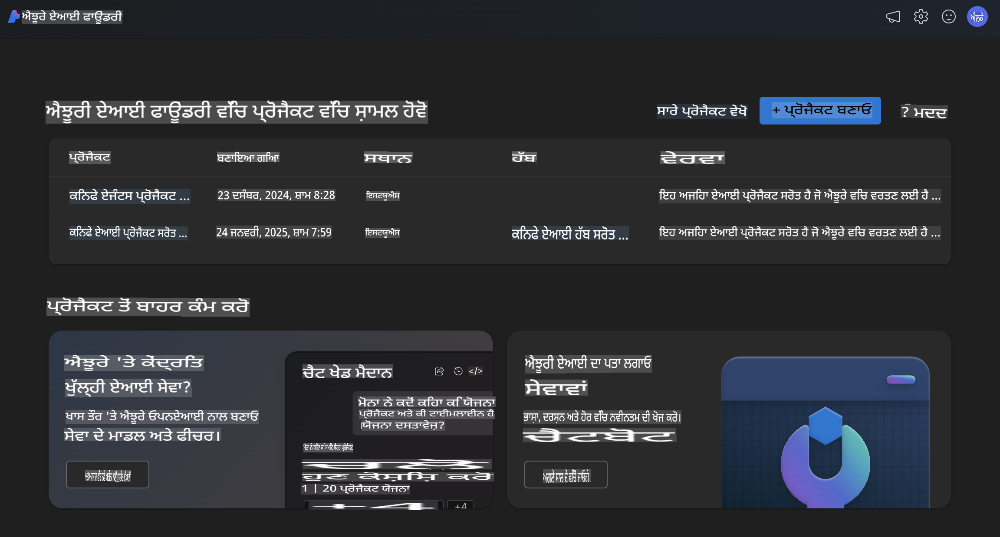
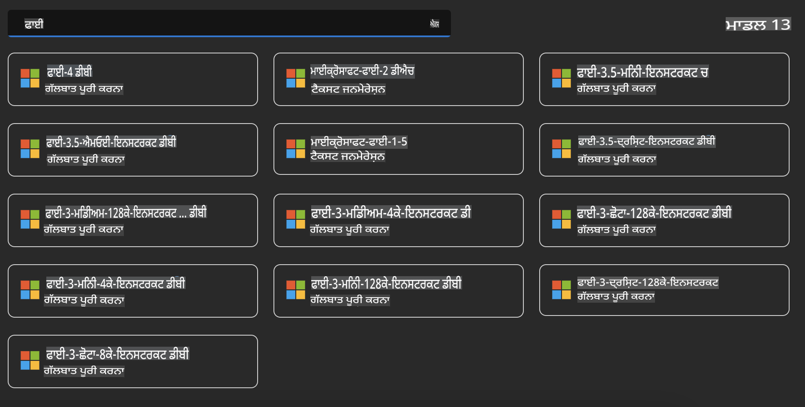
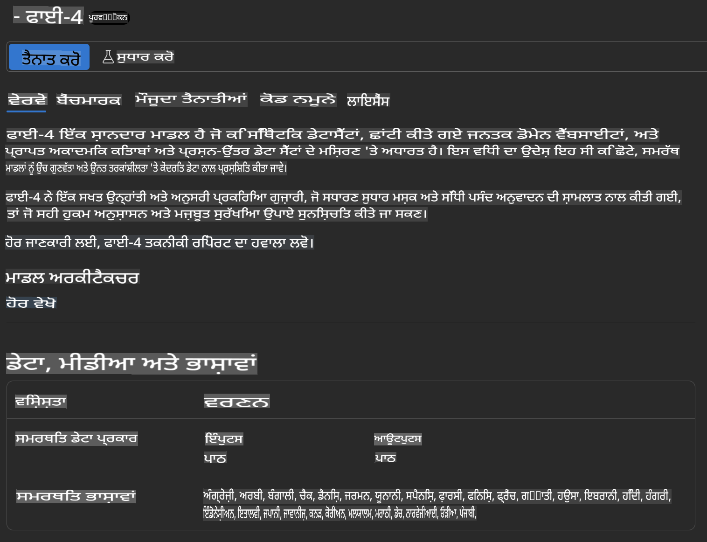
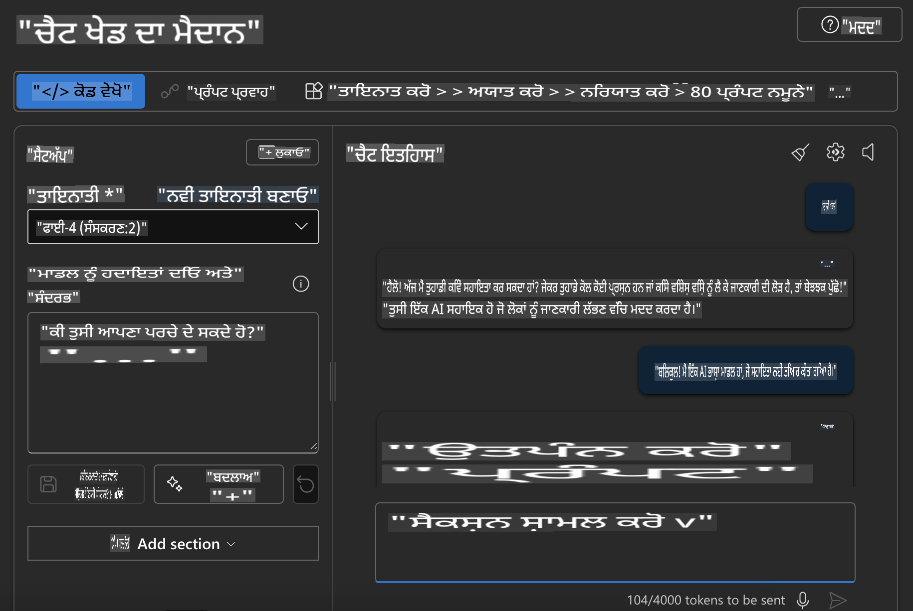

## ਐਜ਼ੂਰ ਏਆਈ ਫਾਊਂਡਰੀ ਵਿੱਚ ਫਾਈ ਫੈਮਿਲੀ

[ਐਜ਼ੂਰ ਏਆਈ ਫਾਊਂਡਰੀ](https://ai.azure.com) ਇੱਕ ਭਰੋਸੇਮੰਦ ਪਲੇਟਫਾਰਮ ਹੈ ਜੋ ਡਿਵੈਲਪਰਾਂ ਨੂੰ ਏਆਈ ਦੀ ਸੁਰੱਖਿਅਤ, ਸੁਰੱਖਿਅਤ ਅਤੇ ਜ਼ਿੰਮੇਵਾਰ ਤਰੀਕੇ ਨਾਲ ਨਵੀਨਤਾ ਕਰਨ ਅਤੇ ਭਵਿੱਖ ਨੂੰ ਰੂਪ ਦੇਣ ਦੇ ਯੋਗ ਬਣਾਉਂਦਾ ਹੈ।  

[ਐਜ਼ੂਰ ਏਆਈ ਫਾਊਂਡਰੀ](https://ai.azure.com) ਨੂੰ ਡਿਵੈਲਪਰਾਂ ਲਈ ਤਿਆਰ ਕੀਤਾ ਗਿਆ ਹੈ:

- ਇੱਕ ਏਂਟਰਪ੍ਰਾਈਜ਼-ਗਰੇਡ ਪਲੇਟਫਾਰਮ 'ਤੇ ਜਨਰੇਟਿਵ ਏਆਈ ਐਪਲੀਕੇਸ਼ਨ ਬਣਾਉਣ ਲਈ।
- ਜ਼ਿੰਮੇਵਾਰ ਏਆਈ ਅਭਿਆਸਾਂ ਦੇ ਅਧਾਰ 'ਤੇ ਅਗਾਂਹ ਵਧਣ, ਬਣਾਉਣ, ਟੈਸਟ ਕਰਨ ਅਤੇ ਡਿਪਲੌਇ ਕਰਨ ਲਈ ਅਧੁਨਿਕ ਏਆਈ ਟੂਲਸ ਅਤੇ ਐਮਐਲ ਮਾਡਲਾਂ ਦੀ ਵਰਤੋਂ ਕਰਦੇ ਹੋਏ।
- ਐਪਲੀਕੇਸ਼ਨ ਡਿਵੈਲਪਮੈਂਟ ਦੇ ਪੂਰੇ ਜੀਵਨ ਚੱਕਰ ਲਈ ਟੀਮ ਦੇ ਨਾਲ ਸਹਿਯੋਗ ਕਰਨ ਲਈ।

ਐਜ਼ੂਰ ਏਆਈ ਫਾਊਂਡਰੀ ਨਾਲ, ਤੁਸੀਂ ਮਾਡਲਾਂ, ਸੇਵਾਵਾਂ ਅਤੇ ਸਮਰੱਥਾਵਾਂ ਦੀ ਵਿਆਪਕ ਸ਼੍ਰੇਣੀ ਦੀ ਪੜਚੋਲ ਕਰ ਸਕਦੇ ਹੋ ਅਤੇ ਆਪਣੇ ਲਕਸ਼ਾਂ ਦੀ ਸਭ ਤੋਂ ਵਧੀਆ ਸੇਵਾ ਕਰਨ ਵਾਲੀਆਂ ਏਆਈ ਐਪਲੀਕੇਸ਼ਨ ਬਣਾਉਣ ਲਈ ਸ਼ੁਰੂਆਤ ਕਰ ਸਕਦੇ ਹੋ। ਐਜ਼ੂਰ ਏਆਈ ਫਾਊਂਡਰੀ ਪਲੇਟਫਾਰਮ ਸਬੂਤ-ਅਵਲੋਕਨ ਤੋਂ ਪੂਰੀ ਤਰ੍ਹਾਂ ਵਿਕਸਿਤ ਉਤਪਾਦਨ ਐਪਲੀਕੇਸ਼ਨ ਵਿੱਚ ਬਦਲਣ ਲਈ ਸਕੇਲਬਿਲਟੀ ਨੂੰ ਆਸਾਨ ਬਣਾਉਂਦਾ ਹੈ। ਲਗਾਤਾਰ ਨਿਗਰਾਨੀ ਅਤੇ ਸੁਧਾਰ ਲੰਬੇ ਸਮੇਂ ਦੀ ਸਫਲਤਾ ਲਈ ਸਹਾਇਕ ਹਨ।  



ਐਜ਼ੂਰ ਏਆਈ ਫਾਊਂਡਰੀ ਵਿੱਚ ਐਜ਼ੂਰ AOAI ਸੇਵਾ ਦੀ ਵਰਤੋਂ ਕਰਨ ਦੇ ਇਲਾਵਾ, ਤੁਸੀਂ ਐਜ਼ੂਰ ਏਆਈ ਫਾਊਂਡਰੀ ਮਾਡਲ ਕੈਟਾਲਾਗ ਵਿੱਚ ਤੀਜੀ ਪੱਖੀ ਮਾਡਲਾਂ ਦੀ ਵੀ ਵਰਤੋਂ ਕਰ ਸਕਦੇ ਹੋ। ਇਹ ਇੱਕ ਚੰਗਾ ਵਿਕਲਪ ਹੈ ਜੇਕਰ ਤੁਸੀਂ ਐਜ਼ੂਰ ਏਆਈ ਫਾਊਂਡਰੀ ਨੂੰ ਆਪਣੇ ਏਆਈ ਹੱਲ ਪਲੇਟਫਾਰਮ ਵਜੋਂ ਵਰਤਣਾ ਚਾਹੁੰਦੇ ਹੋ।  

ਅਸੀਂ ਐਜ਼ੂਰ ਏਆਈ ਫਾਊਂਡਰੀ ਵਿੱਚ ਮਾਡਲ ਕੈਟਾਲਾਗ ਰਾਹੀਂ ਫਾਈ ਫੈਮਿਲੀ ਮਾਡਲਾਂ ਨੂੰ ਜਲਦੀ ਡਿਪਲੌਇ ਕਰ ਸਕਦੇ ਹਾਂ।  



### **ਐਜ਼ੂਰ ਏਆਈ ਫਾਊਂਡਰੀ ਵਿੱਚ ਫਾਈ-4 ਡਿਪਲੌਇ ਕਰੋ**  



### **ਐਜ਼ੂਰ ਏਆਈ ਫਾਊਂਡਰੀ ਪਲੇਗ੍ਰਾਊਂਡ ਵਿੱਚ ਫਾਈ-4 ਦੀ ਟੈਸਟਿੰਗ ਕਰੋ**  



### **ਐਜ਼ੂਰ ਏਆਈ ਫਾਊਂਡਰੀ ਫਾਈ-4 ਨੂੰ ਕਾਲ ਕਰਨ ਲਈ ਪਾਈਥਨ ਕੋਡ ਚਲਾਉਣਾ**  

```python

import os  
import base64
from openai import AzureOpenAI  
from azure.identity import DefaultAzureCredential, get_bearer_token_provider  
        
endpoint = os.getenv("ENDPOINT_URL", "Your Azure AOAI Service Endpoint")  
deployment = os.getenv("DEPLOYMENT_NAME", "Phi-4")  
      
token_provider = get_bearer_token_provider(  
    DefaultAzureCredential(),  
    "https://cognitiveservices.azure.com/.default"  
)  
  
client = AzureOpenAI(  
    azure_endpoint=endpoint,  
    azure_ad_token_provider=token_provider,  
    api_version="2024-05-01-preview",  
)  
  

chat_prompt = [
    {
        "role": "system",
        "content": "You are an AI assistant that helps people find information."
    },
    {
        "role": "user",
        "content": "can you introduce yourself"
    }
] 
    
# Include speech result if speech is enabled  
messages = chat_prompt 

completion = client.chat.completions.create(  
    model=deployment,  
    messages=messages,
    max_tokens=800,  
    temperature=0.7,  
    top_p=0.95,  
    frequency_penalty=0,  
    presence_penalty=0,
    stop=None,  
    stream=False  
)  
  
print(completion.to_json())  

```  

**ਅਸਵੀਕਾਰਨਾ**:  
ਇਹ ਦਸਤਾਵੇਜ਼ ਮਸ਼ੀਨ ਅਧਾਰਿਤ AI ਅਨੁਵਾਦ ਸੇਵਾਵਾਂ ਦੀ ਵਰਤੋਂ ਕਰਕੇ ਅਨੁਵਾਦ ਕੀਤਾ ਗਿਆ ਹੈ। ਜਦੋਂ ਕਿ ਅਸੀਂ ਸਹੀ ਹੋਣ ਦੀ ਕੋਸ਼ਿਸ਼ ਕਰਦੇ ਹਾਂ, ਕਿਰਪਾ ਕਰਕੇ ਧਿਆਨ ਦਿਓ ਕਿ ਸਵੈਚਾਲਿਤ ਅਨੁਵਾਦਾਂ ਵਿੱਚ ਗਲਤੀਆਂ ਜਾਂ ਅਸੁਚਤਤਾਵਾਂ ਹੋ ਸਕਦੀਆਂ ਹਨ। ਇਸ ਦੀ ਮੂਲ ਭਾਸ਼ਾ ਵਿੱਚ ਮੌਜੂਦ ਮੂਲ ਦਸਤਾਵੇਜ਼ ਨੂੰ ਅਧਿਕਾਰਕ ਸਰੋਤ ਮੰਨਿਆ ਜਾਣਾ ਚਾਹੀਦਾ ਹੈ। ਮਹੱਤਵਪੂਰਨ ਜਾਣਕਾਰੀ ਲਈ, ਪੇਸ਼ੇਵਰ ਮਨੁੱਖੀ ਅਨੁਵਾਦ ਦੀ ਸਿਫਾਰਸ਼ ਕੀਤੀ ਜਾਂਦੀ ਹੈ। ਇਸ ਅਨੁਵਾਦ ਦੇ ਪ੍ਰਯੋਗ ਤੋਂ ਪੈਦਾ ਹੋਣ ਵਾਲੀਆਂ ਕਿਸੇ ਵੀ ਗਲਤਫਹਮੀਆਂ ਜਾਂ ਗਲਤ ਵਿਆਖਿਆਵਾਂ ਲਈ ਅਸੀਂ ਜ਼ਿੰਮੇਵਾਰ ਨਹੀਂ ਹਾਂ।