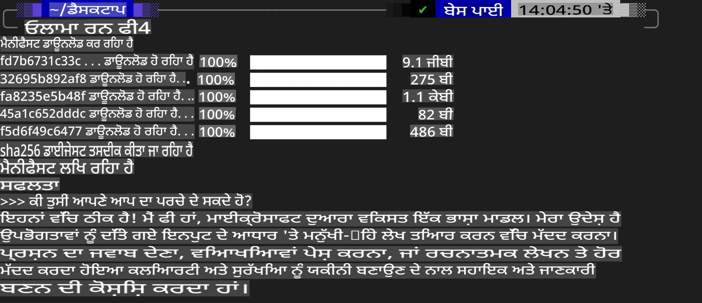
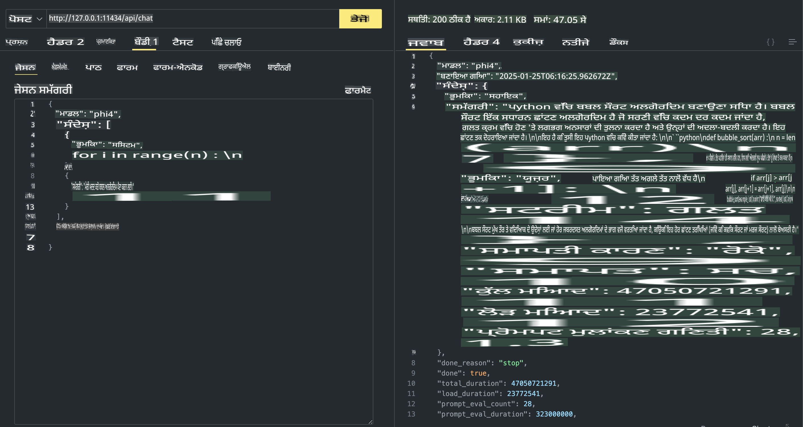

## Phi Family in Ollama

[Ollama](https://ollama.com) ਸਧਾਰਨ ਸਕ੍ਰਿਪਟਾਂ ਰਾਹੀਂ ਲੋਕਾਂ ਨੂੰ ਖੁੱਲ੍ਹੇ ਸਰੋਤ LLM ਜਾਂ SLM ਨੂੰ ਸਿੱਧੇ ਤੌਰ 'ਤੇ ਡਿਪਲੋਇ ਕਰਨ ਦੀ ਸਹੂਲਤ ਦਿੰਦਾ ਹੈ ਅਤੇ ਸਥਾਨਕ Copilot ਐਪਲੀਕੇਸ਼ਨ ਸਿਨਾਰੀਓਜ਼ ਲਈ API ਬਣਾਉਣ ਵਿੱਚ ਵੀ ਮਦਦ ਕਰਦਾ ਹੈ।

## **1. ਇੰਸਟਾਲੇਸ਼ਨ**

Ollama Windows, macOS ਅਤੇ Linux 'ਤੇ ਚਲਾਉਣ ਲਈ ਸਹਾਇਕ ਹੈ। ਤੁਸੀਂ ਇਸ ਲਿੰਕ ([https://ollama.com/download](https://ollama.com/download)) ਰਾਹੀਂ Ollama ਇੰਸਟਾਲ ਕਰ ਸਕਦੇ ਹੋ। ਸਫਲ ਇੰਸਟਾਲੇਸ਼ਨ ਤੋਂ ਬਾਅਦ, ਤੁਸੀਂ ਟਰਮੀਨਲ ਵਿੰਡੋ ਰਾਹੀਂ ਸਿੱਧੇ Ollama ਸਕ੍ਰਿਪਟ ਦੀ ਵਰਤੋਂ ਕਰਕੇ Phi-3 ਨੂੰ ਕਾਲ ਕਰ ਸਕਦੇ ਹੋ। ਤੁਸੀਂ Ollama ਵਿੱਚ ਸਾਰੀਆਂ [ਉਪਲਬਧ ਲਾਇਬ੍ਰੇਰੀਆਂ](https://ollama.com/library) ਵੇਖ ਸਕਦੇ ਹੋ। ਜੇ ਤੁਸੀਂ ਇਸ ਰਿਪੋਜ਼ਟਰੀ ਨੂੰ Codespace ਵਿੱਚ ਖੋਲ੍ਹਦੇ ਹੋ, ਤਾਂ ਇਸ ਵਿੱਚ ਪਹਿਲਾਂ ਹੀ Ollama ਇੰਸਟਾਲ ਹੋਵੇਗਾ।

```bash

ollama run phi4

```

> [!NOTE]
> ਮਾਡਲ ਪਹਿਲੀ ਵਾਰ ਚਲਾਉਣ ਵੇਲੇ ਡਾਊਨਲੋਡ ਹੋਵੇਗਾ। ਬੇਸ਼ਕ, ਤੁਸੀਂ ਸਿੱਧੇ ਡਾਊਨਲੋਡ ਕੀਤੇ ਗਏ Phi-4 ਮਾਡਲ ਨੂੰ ਵੀ ਨਿਰਧਾਰਿਤ ਕਰ ਸਕਦੇ ਹੋ। ਅਸੀਂ WSL ਨੂੰ ਉਦਾਹਰਣ ਵਜੋਂ ਮਾਡਲ ਚਲਾਉਣ ਲਈ ਕਮਾਂਡ ਦਿਖਾਉਂਦੇ ਹਾਂ। ਮਾਡਲ ਸਫਲਤਾਪੂਰਵਕ ਡਾਊਨਲੋਡ ਹੋਣ ਤੋਂ ਬਾਅਦ, ਤੁਸੀਂ ਸਿੱਧੇ ਟਰਮੀਨਲ 'ਤੇ ਇੰਟਰੈਕਟ ਕਰ ਸਕਦੇ ਹੋ।



## **2. Ollama ਤੋਂ phi-4 API ਨੂੰ ਕਾਲ ਕਰੋ**

ਜੇ ਤੁਸੀਂ Ollama ਦੁਆਰਾ ਜਨਰੇਟ ਕੀਤੀ Phi-4 API ਨੂੰ ਕਾਲ ਕਰਨਾ ਚਾਹੁੰਦੇ ਹੋ, ਤਾਂ ਤੁਸੀਂ ਟਰਮੀਨਲ ਵਿੱਚ ਇਹ ਕਮਾਂਡ ਵਰਤ ਕੇ Ollama ਸਰਵਰ ਸ਼ੁਰੂ ਕਰ ਸਕਦੇ ਹੋ।

```bash

ollama serve

```

> [!NOTE]
> ਜੇ ਤੁਸੀਂ MacOS ਜਾਂ Linux ਚਲਾ ਰਹੇ ਹੋ, ਤਾਂ ਕ੍ਰਿਪਾ ਧਿਆਨ ਦਿਓ ਕਿ ਤੁਸੀਂ ਇਹ ਗਲਤੀ ਵੇਖ ਸਕਦੇ ਹੋ **"Error: listen tcp 127.0.0.1:11434: bind: address already in use"**। ਇਹ ਗਲਤੀ ਕਮਾਂਡ ਚਲਾਉਣ ਵੇਲੇ ਆ ਸਕਦੀ ਹੈ। ਤੁਸੀਂ ਇਸ ਗਲਤੀ ਨੂੰ ਅਣਡਿੱਠਾ ਕਰ ਸਕਦੇ ਹੋ, ਕਿਉਂਕਿ ਇਹ ਆਮ ਤੌਰ 'ਤੇ ਦੱਸਦਾ ਹੈ ਕਿ ਸਰਵਰ ਪਹਿਲਾਂ ਹੀ ਚੱਲ ਰਿਹਾ ਹੈ, ਜਾਂ ਤੁਸੀਂ Ollama ਨੂੰ ਰੋਕ ਕੇ ਮੁੜ ਸ਼ੁਰੂ ਕਰ ਸਕਦੇ ਹੋ:

**macOS**

```bash

brew services restart ollama

```

**Linux**

```bash

sudo systemctl stop ollama

```

Ollama ਦੋ API ਸਪੋਰਟ ਕਰਦਾ ਹੈ: ਜਨਰੇਟ ਅਤੇ ਚੈਟ। ਤੁਸੀਂ ਆਪਣੀਆਂ ਜ਼ਰੂਰਤਾਂ ਮੁਤਾਬਕ Ollama ਦੁਆਰਾ ਪ੍ਰਦਾਨ ਕੀਤੇ ਮਾਡਲ API ਨੂੰ ਕਾਲ ਕਰ ਸਕਦੇ ਹੋ, ਸਥਾਨਕ ਸਰਵਰ 'ਤੇ 11434 ਪੋਰਟ 'ਤੇ ਰਨ ਕਰਦੇ ਹੋਏ ਰਿਕਵੇਸਟ ਭੇਜ ਕੇ।

**ਚੈਟ**

```bash

curl http://127.0.0.1:11434/api/chat -d '{
  "model": "phi3",
  "messages": [
    {
      "role": "system",
      "content": "Your are a python developer."
    },
    {
      "role": "user",
      "content": "Help me generate a bubble algorithm"
    }
  ],
  "stream": false
  
}'

This is the result in Postman



## Additional Resources

Check the list of available models in Ollama in [their library](https://ollama.com/library).

Pull your model from the Ollama server using this command

```bash
ollama pull phi4
```

Run the model using this command

```bash
ollama run phi4
```

***Note:*** Visit this link [https://github.com/ollama/ollama/blob/main/docs/api.md](https://github.com/ollama/ollama/blob/main/docs/api.md) to learn more

## Calling Ollama from Python

You can use `requests` or `urllib3` to make requests to the local server endpoints used above. However, a popular way to use Ollama in Python is via the [openai](https://pypi.org/project/openai/) SDK, since Ollama provides OpenAI-compatible server endpoints as well.

Here is an example for phi3-mini:

```python
import openai

client = openai.OpenAI(
    base_url="http://localhost:11434/v1",
    api_key="nokeyneeded",
)

response = client.chat.completions.create(
    model="phi4",
    temperature=0.7,
    n=1,
    messages=[
        {"role": "system", "content": "You are a helpful assistant."},
        {"role": "user", "content": "Write a haiku about a hungry cat"},
    ],
)

print("Response:")
print(response.choices[0].message.content)
```

## Calling Ollama from JavaScript 

```javascript
// Phi-4 ਨਾਲ ਇੱਕ ਫਾਈਲ ਦਾ ਸਾਰ ਲਿਖਣ ਦਾ ਉਦਾਹਰਣ
script({
    model: "ollama:phi4",
    title: "Summarize with Phi-4",
    system: ["system"],
})

// ਸਾਰ ਲਿਖਣ ਦਾ ਉਦਾਹਰਣ
const file = def("FILE", env.files)
$`Summarize ${file} in a single paragraph.`
```

## Calling Ollama from C#

Create a new C# Console application and add the following NuGet package:

```bash
dotnet add package Microsoft.SemanticKernel --version 1.34.0
```

Then replace this code in the `Program.cs` file

```csharp
using Microsoft.SemanticKernel;
using Microsoft.SemanticKernel.ChatCompletion;

// ਸਥਾਨਕ Ollama ਸਰਵਰ ਐਂਡਪੌਇੰਟ ਦੀ ਵਰਤੋਂ ਕਰਕੇ ਚੈਟ ਕਮਪਲੀਸ਼ਨ ਸਰਵਿਸ ਸ਼ਾਮਲ ਕਰੋ
#pragma warning disable SKEXP0001, SKEXP0003, SKEXP0010, SKEXP0011, SKEXP0050, SKEXP0052
builder.AddOpenAIChatCompletion(
    modelId: "phi4",
    endpoint: new Uri("http://localhost:11434/"),
    apiKey: "non required");

// ਚੈਟ ਸਰਵਿਸ ਨੂੰ ਇੱਕ ਸਧਾਰਨ ਪ੍ਰੌਮਪਟ ਭੇਜੋ
string prompt = "Write a joke about kittens";
var response = await kernel.InvokePromptAsync(prompt);
Console.WriteLine(response.GetValue<string>());
```

Run the app with the command:

```bash
dotnet run

**ਅਸਵੀਕਤੀ**:  
ਇਹ ਦਸਤਾਵੇਜ਼ ਮਸ਼ੀਨ ਅਧਾਰਿਤ AI ਅਨੁਵਾਦ ਸੇਵਾਵਾਂ ਦੀ ਵਰਤੋਂ ਕਰਕੇ ਅਨੁਵਾਦ ਕੀਤਾ ਗਿਆ ਹੈ। ਜਦੋਂ ਕਿ ਅਸੀਂ ਸਹੀ ਹੋਣ ਦਾ ਯਤਨ ਕਰਦੇ ਹਾਂ, ਕਿਰਪਾ ਕਰਕੇ ਧਿਆਨ ਦਿਓ ਕਿ ਸਵੈਚਾਲਿਤ ਅਨੁਵਾਦਾਂ ਵਿੱਚ ਗਲਤੀਆਂ ਜਾਂ ਅਸੁਚੱਜੇ ਪਾਸੇ ਹੋ ਸਕਦੇ ਹਨ। ਮੂਲ ਦਸਤਾਵੇਜ਼ ਨੂੰ ਇਸਦੀ ਮੂਲ ਭਾਸ਼ਾ ਵਿੱਚ ਅਧਿਕਾਰਕ ਸਰੋਤ ਮੰਨਿਆ ਜਾਣਾ ਚਾਹੀਦਾ ਹੈ। ਮਹੱਤਵਪੂਰਨ ਜਾਣਕਾਰੀ ਲਈ, ਪੇਸ਼ੇਵਰ ਮਨੁੱਖੀ ਅਨੁਵਾਦ ਦੀ ਸਿਫਾਰਸ਼ ਕੀਤੀ ਜਾਂਦੀ ਹੈ। ਅਸੀਂ ਇਸ ਅਨੁਵਾਦ ਦੇ ਇਸਤੇਮਾਲ ਨਾਲ ਹੋਣ ਵਾਲੇ ਕਿਸੇ ਵੀ ਗਲਤਫਹਿਮੀ ਜਾਂ ਗਲਤ ਵਿਆਖਿਆ ਲਈ ਜ਼ਿੰਮੇਵਾਰ ਨਹੀਂ ਹਾਂ।