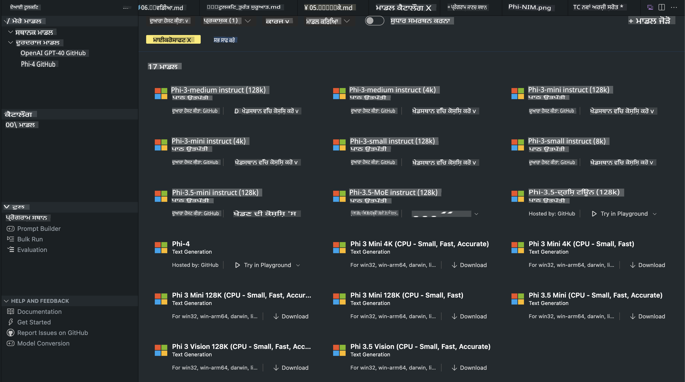
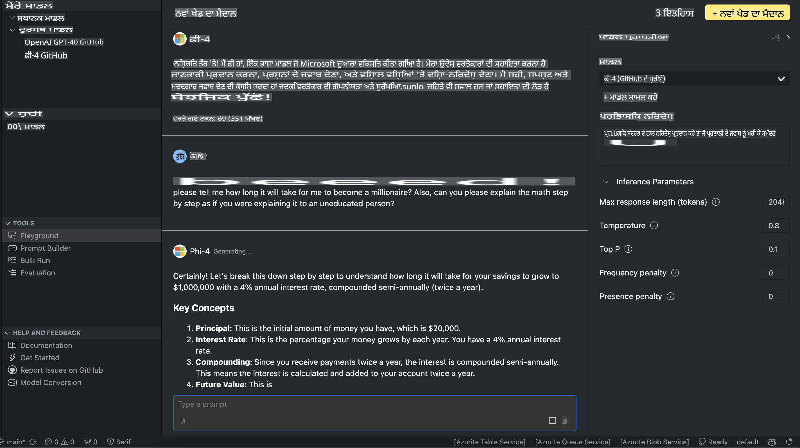

# AITK ਵਿੱਚ ਫਾਈ ਪਰਿਵਾਰ

[AI Toolkit for VS Code](https://marketplace.visualstudio.com/items?itemName=ms-windows-ai-studio.windows-ai-studio) ਜਨਰੇਟਿਵ AI ਐਪ ਡਿਵੈਲਪਮੈਂਟ ਨੂੰ ਸੌਖਾ ਬਣਾਉਂਦਾ ਹੈ। ਇਹ ਕੱਟਿੰਗ-ਐਜ AI ਡਿਵੈਲਪਮੈਂਟ ਟੂਲਜ਼ ਅਤੇ ਮਾਡਲਾਂ ਨੂੰ Azure AI Foundry Catalog ਅਤੇ Hugging Face ਵਰਗੇ ਹੋਰ ਕੈਟਾਲਾਗਜ਼ ਤੋਂ ਇਕੱਠਾ ਕਰਦਾ ਹੈ। ਤੁਸੀਂ GitHub Models ਅਤੇ Azure AI Foundry Model Catalogs ਦੇ ਜ਼ਰੀਏ ਚਲਾਏ ਜਾ ਰਹੇ AI ਮਾਡਲ ਕੈਟਾਲਾਗ ਨੂੰ ਬਰਾਊਜ਼ ਕਰ ਸਕੋਗੇ, ਉਨ੍ਹਾਂ ਨੂੰ ਲੋਕਲ ਜਾਂ ਰਿਮੋਟ ਡਾਊਨਲੋਡ ਕਰ ਸਕਦੇ ਹੋ, ਫਾਈਨ-ਟਿਊਨ ਕਰ ਸਕਦੇ ਹੋ, ਟੈਸਟ ਕਰ ਸਕਦੇ ਹੋ ਅਤੇ ਉਨ੍ਹਾਂ ਨੂੰ ਆਪਣੀ ਐਪਲੀਕੇਸ਼ਨ ਵਿੱਚ ਵਰਤ ਸਕਦੇ ਹੋ।

AI Toolkit Preview ਲੋਕਲ ਚਲਾਇਆ ਜਾਵੇਗਾ। ਲੋਕਲ ਇੰਫਰੈਂਸ ਜਾਂ ਫਾਈਨ-ਟਿਊਨ, ਜੋ ਮਾਡਲ ਤੁਸੀਂ ਚੁਣਦੇ ਹੋ ਉਸ 'ਤੇ ਨਿਰਭਰ ਕਰਦਾ ਹੈ, ਤੁਹਾਨੂੰ NVIDIA CUDA GPU ਵਰਗੇ GPU ਦੀ ਲੋੜ ਹੋ ਸਕਦੀ ਹੈ। ਤੁਸੀਂ GitHub Models ਨੂੰ ਸਿੱਧੇ AITK ਨਾਲ ਵੀ ਚਲਾ ਸਕਦੇ ਹੋ।

## ਸ਼ੁਰੂਆਤ ਕਰ ਰਹੇ ਹੋ

[Windows ਲਈ Linux Subsystem ਇੰਸਟਾਲ ਕਰਨ ਬਾਰੇ ਹੋਰ ਜਾਣੋ](https://learn.microsoft.com/windows/wsl/install?WT.mc_id=aiml-137032-kinfeylo)

ਅਤੇ [ਡਿਫੌਲਟ ਡਿਸਟ੍ਰੀਬਿਊਸ਼ਨ ਬਦਲਣ](https://learn.microsoft.com/windows/wsl/install#change-the-default-linux-distribution-installed) ਬਾਰੇ ਜਾਣਕਾਰੀ ਪ੍ਰਾਪਤ ਕਰੋ।

[AI Toolkit GitHub Repo](https://github.com/microsoft/vscode-ai-toolkit/)

- Windows, Linux, macOS
  
- Windows ਅਤੇ Linux ਦੋਹਾਂ 'ਤੇ ਫਾਈਨਟਿਊਨਿੰਗ ਲਈ ਤੁਹਾਨੂੰ ਇੱਕ Nvidia GPU ਦੀ ਲੋੜ ਹੋਵੇਗੀ। ਇਸ ਤੋਂ ਇਲਾਵਾ, **Windows** ਲਈ Ubuntu ਡਿਸਟ੍ਰੋ 18.4 ਜਾਂ ਵੱਧ ਦੇ ਨਾਲ Linux ਲਈ ਸਬਸਿਸਟਮ ਦੀ ਲੋੜ ਹੈ। [Windows ਲਈ Linux Subsystem ਇੰਸਟਾਲ ਕਰਨ ਬਾਰੇ ਹੋਰ ਜਾਣੋ](https://learn.microsoft.com/windows/wsl/install) ਅਤੇ [ਡਿਫੌਲਟ ਡਿਸਟ੍ਰੀਬਿਊਸ਼ਨ ਬਦਲਣ](https://learn.microsoft.com/windows/wsl/install#change-the-default-linux-distribution-installed) ਬਾਰੇ ਜਾਣਕਾਰੀ ਪ੍ਰਾਪਤ ਕਰੋ।

### AI Toolkit ਇੰਸਟਾਲ ਕਰੋ

AI Toolkit ਇੱਕ [Visual Studio Code Extension](https://code.visualstudio.com/docs/setup/additional-components#_vs-code-extensions) ਦੇ ਰੂਪ ਵਿੱਚ ਆਉਂਦਾ ਹੈ, ਇਸ ਲਈ ਤੁਹਾਨੂੰ ਪਹਿਲਾਂ [VS Code](https://code.visualstudio.com/docs/setup/windows?WT.mc_id=aiml-137032-kinfeylo) ਇੰਸਟਾਲ ਕਰਨਾ ਪਵੇਗਾ ਅਤੇ [VS Marketplace](https://marketplace.visualstudio.com/items?itemName=ms-windows-ai-studio.windows-ai-studio) ਤੋਂ AI Toolkit ਡਾਊਨਲੋਡ ਕਰਨਾ ਪਵੇਗਾ।  
[Visual Studio Marketplace ਵਿੱਚ AI Toolkit ਉਪਲਬਧ ਹੈ](https://marketplace.visualstudio.com/items?itemName=ms-windows-ai-studio.windows-ai-studio) ਅਤੇ ਇਸ ਨੂੰ ਕਿਸੇ ਹੋਰ VS Code ਐਕਸਟੈਂਸ਼ਨ ਵਾਂਗ ਇੰਸਟਾਲ ਕੀਤਾ ਜਾ ਸਕਦਾ ਹੈ।  

ਜੇਕਰ ਤੁਹਾਨੂੰ VS Code ਐਕਸਟੈਂਸ਼ਨ ਇੰਸਟਾਲ ਕਰਨ ਵਿੱਚ ਮਦਦ ਚਾਹੀਦੀ ਹੈ, ਤਾਂ ਹੇਠਾਂ ਦਿੱਤੇ ਕਦਮਾਂ ਦੀ ਪਾਲਣਾ ਕਰੋ:

### ਸਾਈਨ ਇਨ ਕਰੋ

1. VS Code ਵਿੱਚ Activity Bar ਵਿੱਚ **Extensions** ਚੁਣੋ।
1. Extensions ਖੋਜ ਬਾਰ ਵਿੱਚ "AI Toolkit" ਟਾਈਪ ਕਰੋ।
1. "AI Toolkit for Visual Studio Code" ਚੁਣੋ।
1. **Install** ਚੁਣੋ।

ਹੁਣ ਤੁਸੀਂ ਐਕਸਟੈਂਸ਼ਨ ਵਰਤਣ ਲਈ ਤਿਆਰ ਹੋ!

ਤੁਹਾਨੂੰ GitHub ਵਿੱਚ ਸਾਈਨ ਇਨ ਕਰਨ ਲਈ ਕਿਹਾ ਜਾਵੇਗਾ, ਇਸ ਲਈ ਜਾਰੀ ਰੱਖਣ ਲਈ "Allow" 'ਤੇ ਕਲਿੱਕ ਕਰੋ। ਤੁਹਾਨੂੰ GitHub ਸਾਈਨ ਇਨ ਪੇਜ 'ਤੇ ਰੀਡਾਇਰੈਕਟ ਕੀਤਾ ਜਾਵੇਗਾ।

ਕਿਰਪਾ ਕਰਕੇ ਸਾਈਨ ਇਨ ਕਰੋ ਅਤੇ ਪ੍ਰਕਿਰਿਆ ਦੇ ਕਦਮਾਂ ਦੀ ਪਾਲਣਾ ਕਰੋ। ਸਫਲ ਤੌਰ 'ਤੇ ਪੂਰਾ ਹੋਣ ਤੋਂ ਬਾਅਦ, ਤੁਹਾਨੂੰ ਵਾਪਸ VS Code 'ਤੇ ਰੀਡਾਇਰੈਕਟ ਕੀਤਾ ਜਾਵੇਗਾ।

ਜਦੋਂ ਐਕਸਟੈਂਸ਼ਨ ਇੰਸਟਾਲ ਹੋ ਜਾਵੇਗਾ, ਤਾਂ ਤੁਹਾਨੂੰ ਆਪਣੀ Activity Bar ਵਿੱਚ AI Toolkit ਆਈਕਨ ਦਿਖਾਈ ਦੇਵੇਗਾ।

ਚਲੋ ਉਪਲਬਧ ਕਾਰਵਾਈਆਂ ਦੀ ਪੜਚੋਲ ਕਰੀਏ!

### ਉਪਲਬਧ ਕਾਰਵਾਈਆਂ

AI Toolkit ਦਾ ਪ੍ਰਾਇਮਰੀ ਸਾਈਡਬਾਰ ਇਸ ਤਰ੍ਹਾਂ ਆਯੋਜਿਤ ਹੈ:  

- **Models**
- **Resources**
- **Playground**  
- **Fine-tuning**
- **Evaluation**

Resources ਸੈਕਸ਼ਨ ਵਿੱਚ ਉਪਲਬਧ ਹਨ। ਸ਼ੁਰੂਆਤ ਕਰਨ ਲਈ **Model Catalog** ਚੁਣੋ।

### ਕੈਟਾਲਾਗ ਤੋਂ ਮਾਡਲ ਡਾਊਨਲੋਡ ਕਰੋ

ਜਦੋਂ ਤੁਸੀਂ VS Code ਸਾਈਡ ਬਾਰ ਤੋਂ AI Toolkit ਲਾਂਚ ਕਰਦੇ ਹੋ, ਤਾਂ ਤੁਸੀਂ ਹੇਠਾਂ ਦਿੱਤੇ ਵਿਕਲਪਾਂ ਵਿੱਚੋਂ ਚੁਣ ਸਕਦੇ ਹੋ:



- **Model Catalog** ਤੋਂ ਸਹਾਇਕ ਮਾਡਲ ਲੱਭੋ ਅਤੇ ਲੋਕਲ ਡਾਊਨਲੋਡ ਕਰੋ
- **Model Playground** ਵਿੱਚ ਮਾਡਲ ਇੰਫਰੈਂਸ ਟੈਸਟ ਕਰੋ
- **Model Fine-tuning** ਵਿੱਚ ਲੋਕਲ ਜਾਂ ਰਿਮੋਟ ਤੌਰ 'ਤੇ ਮਾਡਲ ਫਾਈਨ-ਟਿਊਨ ਕਰੋ
- AI Toolkit ਲਈ ਕਮਾਂਡ ਪੈਲੇਟ ਰਾਹੀਂ ਕਲਾਉਡ ਵਿੱਚ ਫਾਈਨ-ਟਿਊਨ ਮਾਡਲ ਡਿਪਲੌਇ ਕਰੋ
- ਮਾਡਲਾਂ ਦਾ ਮੁਲਾਂਕਣ ਕਰੋ

> [!NOTE]
>
> **GPU Vs CPU**
>
> ਤੁਸੀਂ ਮਾਡਲ ਕਾਰਡਾਂ ਵਿੱਚ ਮਾਡਲ ਦਾ ਆਕਾਰ, ਪਲੇਟਫਾਰਮ ਅਤੇ ਐਕਸਿਲਰੇਟਰ ਪ੍ਰਕਾਰ (CPU, GPU) ਦੇਖੋਗੇ। **Windows ਡਿਵਾਈਸਾਂ ਜਿਨ੍ਹਾਂ ਕੋਲ ਘੱਟੋ-ਘੱਟ ਇੱਕ GPU ਹੈ** ਉਨ੍ਹਾਂ 'ਤੇ ਵਧੀਆ ਪ੍ਰਦਰਸ਼ਨ ਲਈ, ਉਹ ਮਾਡਲ ਵਰਜਨ ਚੁਣੋ ਜੋ ਸਿਰਫ Windows ਨੂੰ ਟਾਰਗੇਟ ਕਰਦੇ ਹਨ।
>
> ਇਹ ਇਹ ਯਕੀਨੀ ਬਣਾਉਂਦਾ ਹੈ ਕਿ ਤੁਹਾਡੇ ਕੋਲ DirectML ਐਕਸਿਲਰੇਟਰ ਲਈ ਇੱਕ ਮਾਡਲ ਹੈ ਜੋ ਵਧੀਆ ਤਰੀਕੇ ਨਾਲ ਅਨੁਕੂਲਿਤ ਹੈ।
>
> ਮਾਡਲ ਨਾਮ ਇਸ ਫਾਰਮੈਟ ਵਿੱਚ ਹਨ:
>
> - `{model_name}-{accelerator}-{quantization}-{format}`।
>
> ਇਹ ਜਾਣਨ ਲਈ ਕਿ ਤੁਹਾਡੇ Windows ਡਿਵਾਈਸ 'ਤੇ GPU ਹੈ ਜਾਂ ਨਹੀਂ, **Task Manager** ਖੋਲ੍ਹੋ ਅਤੇ ਫਿਰ **Performance** ਟੈਬ ਚੁਣੋ। ਜੇਕਰ ਤੁਹਾਡੇ ਕੋਲ GPU ਹਨ, ਤਾਂ ਉਹ "GPU 0" ਜਾਂ "GPU 1" ਵਰਗੇ ਨਾਮਾਂ ਹੇਠ ਲਿਸਟ ਕੀਤੇ ਜਾਣਗੇ।

### ਮਾਡਲ ਨੂੰ Playground ਵਿੱਚ ਚਲਾਓ

ਸਾਰੇ ਪੈਰਾਮੀਟਰ ਸੈਟ ਕਰਨ ਤੋਂ ਬਾਅਦ, **Generate Project** 'ਤੇ ਕਲਿੱਕ ਕਰੋ।

ਜਦੋਂ ਤੁਹਾਡਾ ਮਾਡਲ ਡਾਊਨਲੋਡ ਹੋ ਜਾਵੇ, ਤਾਂ ਕੈਟਾਲਾਗ ਵਿੱਚ ਮਾਡਲ ਕਾਰਡ 'ਤੇ **Load in Playground** ਚੁਣੋ:

- ਮਾਡਲ ਡਾਊਨਲੋਡ ਸ਼ੁਰੂ ਕਰੋ
- ਸਾਰੇ ਜ਼ਰੂਰੀ ਪ੍ਰੀਰੀਕੁਇਜ਼ਿਟਸ ਅਤੇ ਡਿਪੈਂਡੈਂਸੀਜ਼ ਇੰਸਟਾਲ ਕਰੋ
- VS Code ਵਰਕਸਪੇਸ ਬਣਾਓ



### ਆਪਣੇ ਐਪਲੀਕੇਸ਼ਨ ਵਿੱਚ REST API ਵਰਤੋ

AI Toolkit ਇੱਕ ਲੋਕਲ REST API ਵੈਬ ਸਰਵਰ **ਪੋਰਟ 5272** 'ਤੇ ਲਿਆਉਂਦਾ ਹੈ ਜੋ [OpenAI chat completions ਫਾਰਮੈਟ](https://platform.openai.com/docs/api-reference/chat/create) ਨੂੰ ਵਰਤਦਾ ਹੈ।  

ਇਸ ਨਾਲ ਤੁਸੀਂ ਆਪਣੇ ਐਪਲੀਕੇਸ਼ਨ ਨੂੰ ਲੋਕਲ ਟੈਸਟ ਕਰ ਸਕਦੇ ਹੋ ਬਿਨਾਂ ਕਲਾਉਡ AI ਮਾਡਲ ਸੇਵਾ 'ਤੇ ਨਿਰਭਰ ਕੀਤੇ। ਉਦਾਹਰਣ ਲਈ, ਹੇਠਾਂ ਦਿੱਤੀ JSON ਫਾਈਲ ਦਿਖਾਉਂਦੀ ਹੈ ਕਿ ਰਿਕਵੇਸਟ ਦੇ ਬਾਡੀ ਨੂੰ ਕਿਵੇਂ ਕਨਫਿਗਰ ਕੀਤਾ ਜਾਵੇ:

```json
{
    "model": "Phi-4",
    "messages": [
        {
            "role": "user",
            "content": "what is the golden ratio?"
        }
    ],
    "temperature": 0.7,
    "top_p": 1,
    "top_k": 10,
    "max_tokens": 100,
    "stream": true
}
```

ਤੁਸੀਂ REST API ਨੂੰ (ਕਹੋ ਕਿ) [Postman](https://www.postman.com/) ਜਾਂ CURL (Client URL) ਯੂਟਿਲਿਟੀ ਦੀ ਵਰਤੋਂ ਕਰਕੇ ਟੈਸਟ ਕਰ ਸਕਦੇ ਹੋ:

```bash
curl -vX POST http://127.0.0.1:5272/v1/chat/completions -H 'Content-Type: application/json' -d @body.json
```

### OpenAI ਕਲਾਇੰਟ ਲਾਇਬ੍ਰੇਰੀ ਨੂੰ Python ਵਿੱਚ ਵਰਤਣਾ

```python
from openai import OpenAI

client = OpenAI(
    base_url="http://127.0.0.1:5272/v1/", 
    api_key="x" # required for the API but not used
)

chat_completion = client.chat.completions.create(
    messages=[
        {
            "role": "user",
            "content": "what is the golden ratio?",
        }
    ],
    model="Phi-4",
)

print(chat_completion.choices[0].message.content)
```

### Azure OpenAI ਕਲਾਇੰਟ ਲਾਇਬ੍ਰੇਰੀ ਨੂੰ .NET ਵਿੱਚ ਵਰਤਣਾ

NuGet ਦੀ ਵਰਤੋਂ ਕਰਕੇ ਆਪਣੇ ਪ੍ਰੋਜੈਕਟ ਵਿੱਚ [Azure OpenAI ਕਲਾਇੰਟ ਲਾਇਬ੍ਰੇਰੀ ਲਈ .NET](https://www.nuget.org/packages/Azure.AI.OpenAI/) ਸ਼ਾਮਲ ਕਰੋ:

```bash
dotnet add {project_name} package Azure.AI.OpenAI --version 1.0.0-beta.17
```

ਆਪਣੇ ਪ੍ਰੋਜੈਕਟ ਵਿੱਚ **OverridePolicy.cs** ਨਾਂ ਦੀ ਇੱਕ C# ਫਾਈਲ ਸ਼ਾਮਲ ਕਰੋ ਅਤੇ ਹੇਠਾਂ ਦਿੱਤਾ ਕੋਡ ਪੇਸਟ ਕਰੋ:

```csharp
// OverridePolicy.cs
using Azure.Core.Pipeline;
using Azure.Core;

internal partial class OverrideRequestUriPolicy(Uri overrideUri)
    : HttpPipelineSynchronousPolicy
{
    private readonly Uri _overrideUri = overrideUri;

    public override void OnSendingRequest(HttpMessage message)
    {
        message.Request.Uri.Reset(_overrideUri);
    }
}
```

ਅਗਲੇ ਕਦਮ ਵਿੱਚ, ਹੇਠਾਂ ਦਿੱਤਾ ਕੋਡ ਆਪਣੇ **Program.cs** ਫਾਈਲ ਵਿੱਚ ਪੇਸਟ ਕਰੋ:

```csharp
// Program.cs
using Azure.AI.OpenAI;

Uri localhostUri = new("http://localhost:5272/v1/chat/completions");

OpenAIClientOptions clientOptions = new();
clientOptions.AddPolicy(
    new OverrideRequestUriPolicy(localhostUri),
    Azure.Core.HttpPipelinePosition.BeforeTransport);
OpenAIClient client = new(openAIApiKey: "unused", clientOptions);

ChatCompletionsOptions options = new()
{
    DeploymentName = "Phi-4",
    Messages =
    {
        new ChatRequestSystemMessage("You are a helpful assistant. Be brief and succinct."),
        new ChatRequestUserMessage("What is the golden ratio?"),
    }
};

StreamingResponse<StreamingChatCompletionsUpdate> streamingChatResponse
    = await client.GetChatCompletionsStreamingAsync(options);

await foreach (StreamingChatCompletionsUpdate chatChunk in streamingChatResponse)
{
    Console.Write(chatChunk.ContentUpdate);
}
```


## AI Toolkit ਨਾਲ ਫਾਈਨ ਟਿਊਨਿੰਗ

- ਮਾਡਲ ਖੋਜ ਅਤੇ Playground ਨਾਲ ਸ਼ੁਰੂ ਕਰੋ।
- ਲੋਕਲ ਕੰਪਿਊਟਿੰਗ ਸਰੋਤਾਂ ਦੀ ਵਰਤੋਂ ਕਰਕੇ ਮਾਡਲ ਫਾਈਨ-ਟਿਊਨਿੰਗ ਅਤੇ ਇੰਫਰੈਂਸ।
- Azure ਸਰੋਤਾਂ ਦੀ ਵਰਤੋਂ ਕਰਕੇ ਰਿਮੋਟ ਫਾਈਨ-ਟਿਊਨਿੰਗ ਅਤੇ ਇੰਫਰੈਂਸ।

[AI Toolkit ਨਾਲ ਫਾਈਨ ਟਿਊਨਿੰਗ](../../03.FineTuning/Finetuning_VSCodeaitoolkit.md)

## AI Toolkit Q&A ਸਰੋਤ

ਕਿਰਪਾ ਕਰਕੇ ਸਭ ਤੋਂ ਆਮ ਮੁੱਦਿਆਂ ਅਤੇ ਉਨ੍ਹਾਂ ਦੇ ਹੱਲਾਂ ਲਈ ਸਾਡੀ [Q&A ਪੇਜ](https://github.com/microsoft/vscode-ai-toolkit/blob/main/archive/QA.md) ਨੂੰ ਵੇਖੋ।

**ਅਸਵੀਕਰਤੀ**:  
ਇਹ ਦਸਤਾਵੇਜ਼ ਮਸ਼ੀਨ-ਆਧਾਰਿਤ AI ਅਨੁਵਾਦ ਸੇਵਾਵਾਂ ਦੀ ਵਰਤੋਂ ਕਰਕੇ ਅਨੁਵਾਦਿਤ ਕੀਤਾ ਗਿਆ ਹੈ। ਜਦੋਂ ਕਿ ਅਸੀਂ ਸਹੀ ਹੋਣ ਦਾ ਯਤਨ ਕਰਦੇ ਹਾਂ, ਕਿਰਪਾ ਕਰਕੇ ਧਿਆਨ ਦਿਓ ਕਿ ਸਵੈਚਾਲਿਤ ਅਨੁਵਾਦਾਂ ਵਿੱਚ ਗਲਤੀਆਂ ਜਾਂ ਅਸੁਚੱਜੇਪਣ ਹੋ ਸਕਦੇ ਹਨ। ਮੂਲ ਦਸਤਾਵੇਜ਼ ਨੂੰ ਇਸਦੀ ਮੂਲ ਭਾਸ਼ਾ ਵਿੱਚ ਪ੍ਰਾਧਾਨ ਸਰੋਤ ਮੰਨਿਆ ਜਾਣਾ ਚਾਹੀਦਾ ਹੈ। ਮਹੱਤਵਪੂਰਨ ਜਾਣਕਾਰੀ ਲਈ, ਪੇਸ਼ੇਵਰ ਮਨੁੱਖੀ ਅਨੁਵਾਦ ਦੀ ਸਿਫਾਰਸ਼ ਕੀਤੀ ਜਾਂਦੀ ਹੈ। ਅਸੀਂ ਇਸ ਅਨੁਵਾਦ ਦੇ ਇਸਤੇਮਾਲ ਤੋਂ ਪੈਦਾ ਹੋਣ ਵਾਲੀਆਂ ਕਿਸੇ ਵੀ ਗਲਤਫਹਮੀਆਂ ਜਾਂ ਗਲਤ ਵਿਆਖਿਆਵਾਂ ਲਈ ਜ਼ਿੰਮੇਵਾਰ ਨਹੀਂ ਹਾਂ।