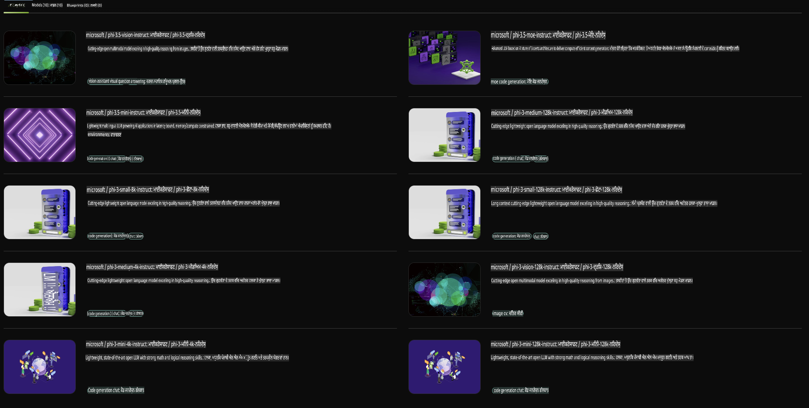

## NVIDIA NIM ਵਿੱਚ ਫਾਈ ਫੈਮਿਲੀ

NVIDIA NIM ਇੱਕ ਅਸਾਨ-ਵਰਤੋਂ ਯੋਗ ਮਾਈਕ੍ਰੋਸਰਵਿਸਿਜ਼ ਦਾ ਸੈੱਟ ਹੈ ਜੋ ਜਨਰੇਟਿਵ AI ਮਾਡਲਾਂ ਨੂੰ ਕਲਾਊਡ, ਡਾਟਾ ਸੈਂਟਰ, ਅਤੇ ਵਰਕਸਟੇਸ਼ਨ ਵਿੱਚ ਤੇਜ਼ੀ ਨਾਲ ਤੈਨਾਤ ਕਰਨ ਲਈ ਡਿਜ਼ਾਈਨ ਕੀਤਾ ਗਿਆ ਹੈ। NIM ਮਾਡਲ ਫੈਮਿਲੀ ਅਤੇ ਪ੍ਰਤੀ ਮਾਡਲ ਅਧਾਰ 'ਤੇ ਵਰਗਬੱਧ ਹਨ। ਉਦਾਹਰਣ ਵਜੋਂ, ਵੱਡੇ ਭਾਸ਼ਾਈ ਮਾਡਲਾਂ (LLMs) ਲਈ NVIDIA NIM ਆਧੁਨਿਕ LLMs ਦੀ ਤਾਕਤ ਨੂੰ ਉੱਦਮ ਐਪਲੀਕੇਸ਼ਨਾਂ ਤੱਕ ਲਿਆਉਂਦਾ ਹੈ, ਜੋ ਬੇਮਿਸਾਲ ਨੈਚੁਰਲ ਲੈਂਗਵੇਜ ਪ੍ਰੋਸੈਸਿੰਗ ਅਤੇ ਸਮਝਣ ਦੀਆਂ ਯੋਗਤਾਵਾਂ ਪ੍ਰਦਾਨ ਕਰਦਾ ਹੈ।

NIM IT ਅਤੇ DevOps ਟੀਮਾਂ ਲਈ ਆਪਣੇ ਪ੍ਰਬੰਧਤ ਵਾਤਾਵਰਣਾਂ ਵਿੱਚ ਵੱਡੇ ਭਾਸ਼ਾਈ ਮਾਡਲਾਂ (LLMs) ਨੂੰ ਖੁਦ ਹੋਸਟ ਕਰਨਾ ਆਸਾਨ ਬਣਾ ਦਿੰਦਾ ਹੈ, ਜਦੋਂ ਕਿ ਡਿਵੈਲਪਰਾਂ ਨੂੰ ਉਦਯੋਗ ਮਾਪਦੰਡ APIs ਪ੍ਰਦਾਨ ਕਰਦਾ ਹੈ, ਜੋ ਉਨ੍ਹਾਂ ਨੂੰ ਸ਼ਕਤੀਸ਼ਾਲੀ ਕੋਪਾਈਲਟਸ, ਚੈਟਬੋਟਸ, ਅਤੇ AI ਸਹਾਇਕ ਬਣਾਉਣ ਦੀ ਆਗਿਆ ਦਿੰਦੇ ਹਨ ਜੋ ਉਨ੍ਹਾਂ ਦੇ ਕਾਰੋਬਾਰ ਨੂੰ ਬਦਲ ਸਕਦੇ ਹਨ। NVIDIA ਦੇ ਅਤਿ-ਆਧੁਨਿਕ GPU ਐਕਸਿਲਰੇਸ਼ਨ ਅਤੇ ਸਕੇਲੇਬਲ ਡਿਪਲੋਇਮੈਂਟ ਦਾ ਲਾਭ ਲੈਂਦੇ ਹੋਏ, NIM ਬੇਮਿਸਾਲ ਪ੍ਰਦਰਸ਼ਨ ਨਾਲ ਇਨਫਰੈਂਸ ਤੱਕ ਸਭ ਤੋਂ ਤੇਜ਼ ਰਸਤਾ ਪੇਸ਼ ਕਰਦਾ ਹੈ।

ਤੁਸੀਂ NVIDIA NIM ਦਾ ਵਰਤੋਂ ਕਰਕੇ ਫਾਈ ਫੈਮਿਲੀ ਮਾਡਲਾਂ ਲਈ ਇਨਫਰੈਂਸ ਕਰ ਸਕਦੇ ਹੋ।



### **ਸੈਂਪਲ - NVIDIA NIM ਵਿੱਚ Phi-3-Vision**

ਕਲਪਨਾ ਕਰੋ ਕਿ ਤੁਹਾਡੇ ਕੋਲ ਇੱਕ ਚਿੱਤਰ ਹੈ (`demo.png`) ਅਤੇ ਤੁਸੀਂ Python ਕੋਡ ਬਣਾਉਣਾ ਚਾਹੁੰਦੇ ਹੋ ਜੋ ਇਸ ਚਿੱਤਰ ਨੂੰ ਪ੍ਰੋਸੈਸ ਕਰਦਾ ਹੈ ਅਤੇ ਇਸਦਾ ਨਵਾਂ ਵਰਜਨ ਸੇਵ ਕਰਦਾ ਹੈ (`phi-3-vision.jpg`)।

ਉਪਰੋਕਤ ਕੋਡ ਇਸ ਪ੍ਰਕਿਰਿਆ ਨੂੰ ਆਟੋਮੇਟ ਕਰਦਾ ਹੈ:

1. ਵਾਤਾਵਰਣ ਅਤੇ ਲੋੜੀਂਦੇ ਕੌਂਫਿਗਰੇਸ਼ਨ ਸੈੱਟ ਕਰਨਾ।
2. ਮਾਡਲ ਨੂੰ ਜ਼ਰੂਰੀ Python ਕੋਡ ਬਣਾਉਣ ਦੇ ਨਿਰਦੇਸ਼ ਦੇਣ ਲਈ ਇੱਕ ਪ੍ਰਾਂਪਟ ਬਣਾਉਣਾ।
3. ਪ੍ਰਾਂਪਟ ਨੂੰ ਮਾਡਲ ਨੂੰ ਭੇਜਣਾ ਅਤੇ ਬਣਾਇਆ ਗਿਆ ਕੋਡ ਪ੍ਰਾਪਤ ਕਰਨਾ।
4. ਬਣਾਇਆ ਗਿਆ ਕੋਡ ਕੱਢਣਾ ਅਤੇ ਚਲਾਉਣਾ।
5. ਮੂਲ ਅਤੇ ਪ੍ਰੋਸੈਸ ਕੀਤੇ ਚਿੱਤਰ ਦਿਖਾਉਣਾ।

ਇਹ ਪਹੁੰਚ ਚਿੱਤਰ ਪ੍ਰੋਸੈਸਿੰਗ ਕੰਮਾਂ ਨੂੰ ਆਟੋਮੇਟ ਕਰਨ ਲਈ AI ਦੀ ਤਾਕਤ ਦਾ ਲਾਭ ਲੈਂਦੀ ਹੈ, ਜਿਸ ਨਾਲ ਤੁਹਾਡੇ ਲਕਸ਼ ਪੂਰੇ ਕਰਨਾ ਆਸਾਨ ਅਤੇ ਤੇਜ਼ ਬਣ ਜਾਂਦਾ ਹੈ।

[ਸੈਂਪਲ ਕੋਡ ਹੱਲ](../../../../../code/06.E2E/E2E_Nvidia_NIM_Phi3_Vision.ipynb)

ਆਓ ਪੂਰੇ ਕੋਡ ਨੂੰ ਕਦਮ-ਦਰ-ਕਦਮ ਵਿਖੇ ਸਮਝੀਏ:

1. **ਲੋੜੀਂਦਾ ਪੈਕੇਜ ਇੰਸਟਾਲ ਕਰੋ**:
    ```python
    !pip install langchain_nvidia_ai_endpoints -U
    ```
    ਇਹ ਕਮਾਂਡ `langchain_nvidia_ai_endpoints` ਪੈਕੇਜ ਦਾ ਸਭ ਤੋਂ ਨਵਾਂ ਵਰਜਨ ਇੰਸਟਾਲ ਕਰਦੀ ਹੈ।

2. **ਲੋੜੀਂਦੇ ਮੋਡੀਊਲਜ਼ ਇੰਪੋਰਟ ਕਰੋ**:
    ```python
    from langchain_nvidia_ai_endpoints import ChatNVIDIA
    import getpass
    import os
    import base64
    ```
    ਇਹ ਇੰਪੋਰਟ NVIDIA AI ਐਂਡਪੋਇੰਟਸ ਨਾਲ ਇੰਟਰੈਕਟ ਕਰਨ, ਪਾਸਵਰਡ ਨੂੰ ਸੁਰੱਖਿਅਤ ਢੰਗ ਨਾਲ ਹੈਂਡਲ ਕਰਨ, ਓਪਰੇਟਿੰਗ ਸਿਸਟਮ ਨਾਲ ਇੰਟਰੈਕਟ ਕਰਨ, ਅਤੇ ਡਾਟਾ ਨੂੰ ਬੇਸ64 ਫਾਰਮੈਟ ਵਿੱਚ ਐਨਕੋਡ/ਡੀਕੋਡ ਕਰਨ ਲਈ ਲੋੜੀਂਦੇ ਮੋਡੀਊਲ ਲਿਆਉਂਦੇ ਹਨ।

3. **API ਕੀ ਸੈੱਟ ਕਰੋ**:
    ```python
    if not os.getenv("NVIDIA_API_KEY"):
        os.environ["NVIDIA_API_KEY"] = getpass.getpass("Enter your NVIDIA API key: ")
    ```
    ਇਹ ਕੋਡ ਜਾਂਚਦਾ ਹੈ ਕਿ `NVIDIA_API_KEY` ਵਾਤਾਵਰਣ ਵੈਰੀਏਬਲ ਸੈੱਟ ਹੈ ਕਿ ਨਹੀਂ। ਜੇ ਨਹੀਂ, ਤਾਂ ਇਹ ਯੂਜ਼ਰ ਨੂੰ ਆਪਣੀ API ਕੀ ਸੁਰੱਖਿਅਤ ਢੰਗ ਨਾਲ ਦਰਜ ਕਰਨ ਲਈ ਕਹਿੰਦਾ ਹੈ।

4. **ਮਾਡਲ ਅਤੇ ਚਿੱਤਰ ਦਾ ਪਾਥ ਪਰਿਭਾਸ਼ਿਤ ਕਰੋ**:
    ```python
    model = 'microsoft/phi-3-vision-128k-instruct'
    chat = ChatNVIDIA(model=model)
    img_path = './imgs/demo.png'
    ```
    ਇਹ ਵਰਤੋਂ ਕਰਨ ਲਈ ਮਾਡਲ ਸੈੱਟ ਕਰਦਾ ਹੈ, ਦਿੱਤੇ ਗਏ ਮਾਡਲ ਨਾਲ `ChatNVIDIA` ਦਾ ਇੱਕ ਇੰਸਟੈਂਸ ਬਣਾਉਂਦਾ ਹੈ, ਅਤੇ ਚਿੱਤਰ ਫਾਈਲ ਦੇ ਪਾਥ ਨੂੰ ਪਰਿਭਾਸ਼ਿਤ ਕਰਦਾ ਹੈ।

5. **ਟੈਕਸਟ ਪ੍ਰਾਂਪਟ ਬਣਾਓ**:
    ```python
    text = "Please create Python code for image, and use plt to save the new picture under imgs/ and name it phi-3-vision.jpg."
    ```
    ਇਹ ਇੱਕ ਟੈਕਸਟ ਪ੍ਰਾਂਪਟ ਪਰਿਭਾਸ਼ਿਤ ਕਰਦਾ ਹੈ ਜੋ ਮਾਡਲ ਨੂੰ ਚਿੱਤਰ ਨੂੰ ਪ੍ਰੋਸੈਸ ਕਰਨ ਲਈ Python ਕੋਡ ਬਣਾਉਣ ਦੇ ਨਿਰਦੇਸ਼ ਦਿੰਦਾ ਹੈ।

6. **ਚਿੱਤਰ ਨੂੰ ਬੇਸ64 ਵਿੱਚ ਐਨਕੋਡ ਕਰੋ**:
    ```python
    with open(img_path, "rb") as f:
        image_b64 = base64.b64encode(f.read()).decode()
    image = f''
    ```
    ਇਹ ਕੋਡ ਚਿੱਤਰ ਫਾਈਲ ਨੂੰ ਪੜ੍ਹਦਾ ਹੈ, ਇਸਨੂੰ ਬੇਸ64 ਵਿੱਚ ਐਨਕੋਡ ਕਰਦਾ ਹੈ, ਅਤੇ ਐਨਕੋਡ ਕੀਤੇ ਡਾਟਾ ਨਾਲ ਇੱਕ HTML ਚਿੱਤਰ ਟੈਗ ਬਣਾਉਂਦਾ ਹੈ।

7. **ਟੈਕਸਟ ਅਤੇ ਚਿੱਤਰ ਨੂੰ ਪ੍ਰਾਂਪਟ ਵਿੱਚ ਜੋੜੋ**:
    ```python
    prompt = f"{text} {image}"
    ```
    ਇਹ ਟੈਕਸਟ ਪ੍ਰਾਂਪਟ ਅਤੇ HTML ਚਿੱਤਰ ਟੈਗ ਨੂੰ ਇੱਕ ਸਿੰਗਲ ਸਟਰਿੰਗ ਵਿੱਚ ਜੋੜਦਾ ਹੈ।

8. **ChatNVIDIA ਦੀ ਵਰਤੋਂ ਕਰਕੇ ਕੋਡ ਬਣਾਓ**:
    ```python
    code = ""
    for chunk in chat.stream(prompt):
        print(chunk.content, end="")
        code += chunk.content
    ```
    ਇਹ ਕੋਡ ਪ੍ਰਾਂਪਟ ਨੂੰ `ChatNVIDIA` model and collects the generated code in chunks, printing and appending each chunk to the `code` ਸਟਰਿੰਗ ਨੂੰ ਭੇਜਦਾ ਹੈ।

9. **ਬਣਾਈ ਗਈ ਸਮਗਰੀ ਤੋਂ Python ਕੋਡ ਕੱਢੋ**:
    ```python
    begin = code.index('```python') + 9
    code = code[begin:]
    end = code.index('```')
    code = code[:end]
    ```
    ਇਹ ਬਣਾਈ ਗਈ ਸਮਗਰੀ ਵਿੱਚੋਂ ਅਸਲ Python ਕੋਡ ਕੱਢਦਾ ਹੈ ਅਤੇ ਮਾਰਕਡਾਊਨ ਫਾਰਮੈਟਿੰਗ ਨੂੰ ਹਟਾਉਂਦਾ ਹੈ।

10. **ਬਣਾਇਆ ਗਿਆ ਕੋਡ ਚਲਾਓ**:
    ```python
    import subprocess
    result = subprocess.run(["python", "-c", code], capture_output=True)
    ```
    ਇਹ ਕੱਢੇ ਗਏ Python ਕੋਡ ਨੂੰ ਇੱਕ ਸਬਪ੍ਰੋਸੈਸ ਵਜੋਂ ਚਲਾਉਂਦਾ ਹੈ ਅਤੇ ਇਸਦੀ ਆਉਟਪੁਟ ਕੈਪਚਰ ਕਰਦਾ ਹੈ।

11. **ਚਿੱਤਰ ਦਿਖਾਓ**:
    ```python
    from IPython.display import Image, display
    display(Image(filename='./imgs/phi-3-vision.jpg'))
    display(Image(filename='./imgs/demo.png'))
    ```
    ਇਹ ਲਾਈਨਾਂ `IPython.display` ਮੋਡੀਊਲ ਦੀ ਵਰਤੋਂ ਕਰਕੇ ਚਿੱਤਰ ਦਿਖਾਉਂਦੀਆਂ ਹਨ।

**ਅਸਵੀਕਾਰਣਯੋਗ**:  
ਇਹ ਦਸਤਾਵੇਜ਼ ਮਸ਼ੀਨ ਅਧਾਰਿਤ AI ਅਨੁਵਾਦ ਸੇਵਾਵਾਂ ਦੀ ਵਰਤੋਂ ਕਰਕੇ ਅਨੁਵਾਦਿਤ ਕੀਤਾ ਗਿਆ ਹੈ। ਜਦੋਂ ਕਿ ਅਸੀਂ ਸਹੀ ਹੋਣ ਦੀ ਕੋਸ਼ਿਸ਼ ਕਰਦੇ ਹਾਂ, ਕਿਰਪਾ ਕਰਕੇ ਧਿਆਨ ਦਿਓ ਕਿ ਸਵੈਚਾਲਿਤ ਅਨੁਵਾਦਾਂ ਵਿੱਚ ਗਲਤੀਆਂ ਜਾਂ ਅਸੁੱਤਰ ਹੋ ਸਕਦੇ ਹਨ। ਮੂਲ ਦਸਤਾਵੇਜ਼ ਨੂੰ ਇਸਦੀ ਮੂਲ ਭਾਸ਼ਾ ਵਿੱਚ ਪ੍ਰਮਾਣਿਕ ਸਰੋਤ ਮੰਨਿਆ ਜਾਣਾ ਚਾਹੀਦਾ ਹੈ। ਮਹੱਤਵਪੂਰਨ ਜਾਣਕਾਰੀ ਲਈ, ਪੇਸ਼ੇਵਰ ਮਨੁੱਖੀ ਅਨੁਵਾਦ ਦੀ ਸਿਫਾਰਸ਼ ਕੀਤੀ ਜਾਂਦੀ ਹੈ। ਇਸ ਅਨੁਵਾਦ ਦੇ ਉਪਯੋਗ ਤੋਂ ਪੈਦਾ ਹੋਣ ਵਾਲੇ ਕਿਸੇ ਵੀ ਗਲਤ ਫਹਿਮੀ ਜਾਂ ਗਲਤ ਵਿਆਖਿਆ ਲਈ ਅਸੀਂ ਜ਼ਿੰਮੇਵਾਰ ਨਹੀਂ ਹਾਂ।