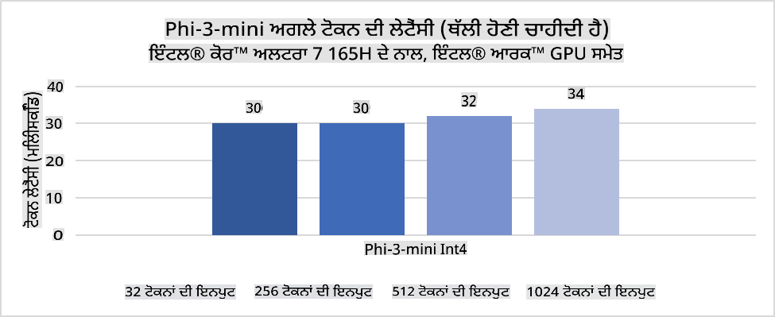
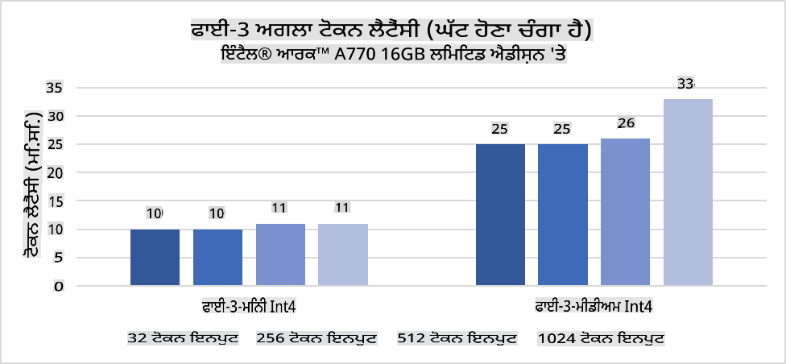
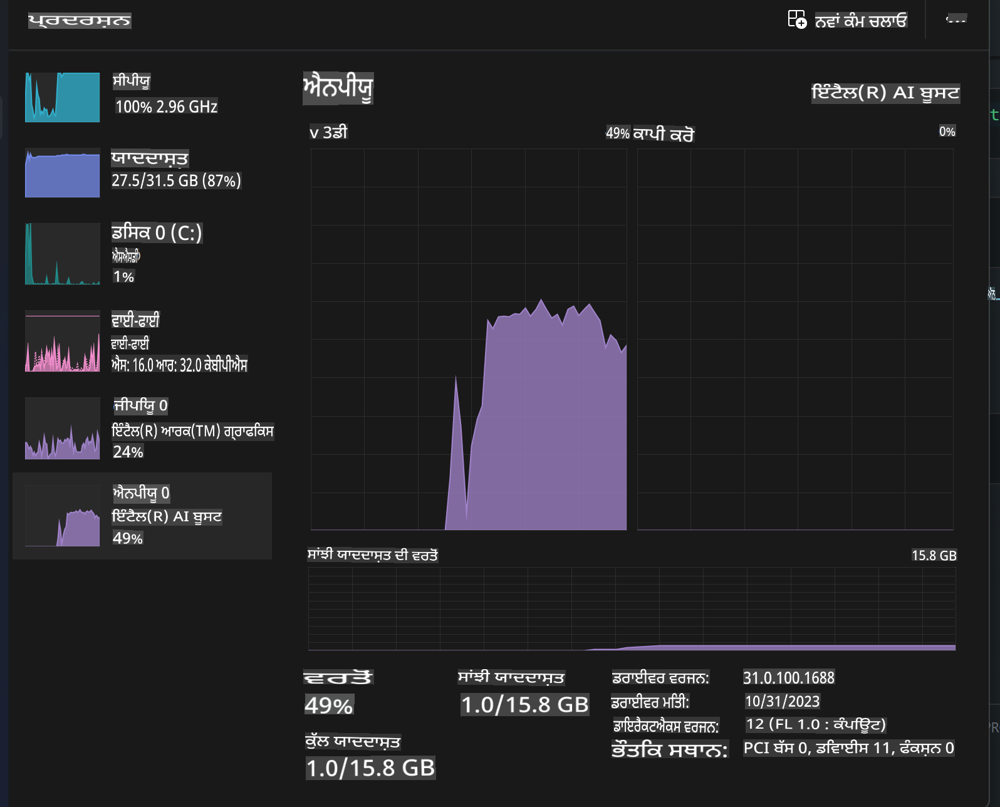
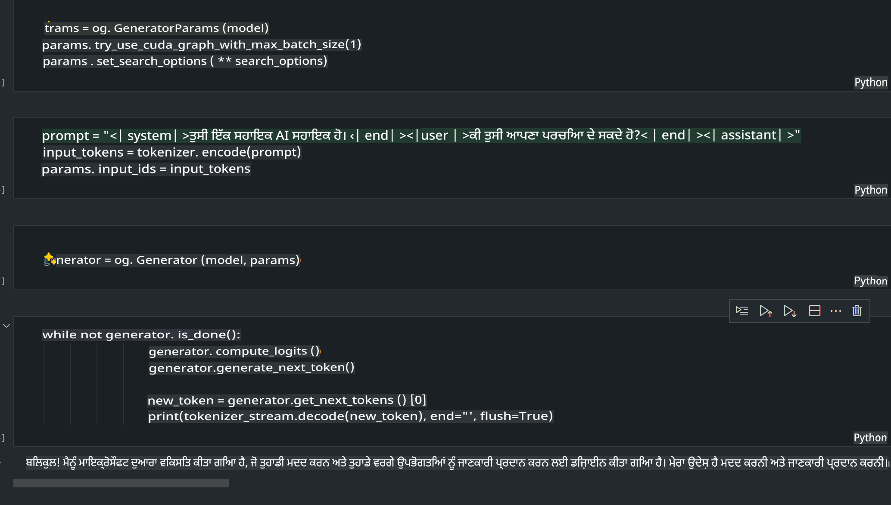
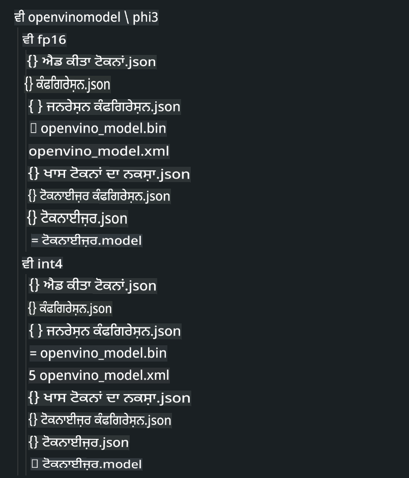
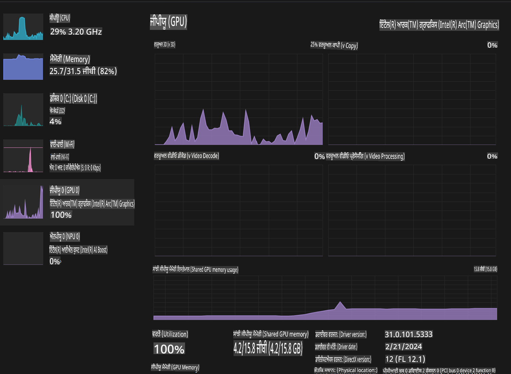

# **AI ਪੀਸੀ ਵਿੱਚ Phi-3 ਦੀ ਇੰਫਰੈਂਸ**

ਜਨਰੇਟਿਵ AI ਵਿੱਚ ਤਰੱਕੀ ਅਤੇ ਐਜ ਡਿਵਾਈਸਾਂ ਦੀ ਹਾਰਡਵੇਅਰ ਸਮਰੱਥਾਵਾਂ ਵਿੱਚ ਸੁਧਾਰ ਨਾਲ, ਹੁਣ ਵਧੇਰੇ ਜਨਰੇਟਿਵ AI ਮਾਡਲਾਂ ਨੂੰ ਯੂਜ਼ਰਾਂ ਦੇ Bring Your Own Device (BYOD) ਡਿਵਾਈਸਾਂ ਵਿੱਚ ਇੰਟੀਗ੍ਰੇਟ ਕੀਤਾ ਜਾ ਸਕਦਾ ਹੈ। AI PCs ਇਨ੍ਹਾਂ ਮਾਡਲਾਂ ਵਿੱਚ ਸ਼ਾਮਲ ਹਨ। 2024 ਤੋਂ ਸ਼ੁਰੂ ਕਰਕੇ, Intel, AMD, ਅਤੇ Qualcomm ਨੇ ਪੀਸੀ ਨਿਰਮਾਤਾਵਾਂ ਨਾਲ ਮਿਲ ਕੇ ਐਸੇ AI PCs ਪੇਸ਼ ਕਰਨ ਲਈ ਸਹਿਯੋਗ ਕੀਤਾ ਹੈ ਜੋ ਹਾਰਡਵੇਅਰ ਸੋਧਾਂ ਰਾਹੀਂ ਲੋਕਲ ਜਨਰੇਟਿਵ AI ਮਾਡਲਾਂ ਨੂੰ ਤੈਨਾਤ ਕਰਨ ਦੀ ਸਹੂਲਤ ਦਿੰਦੇ ਹਨ। ਇਸ ਚਰਚਾ ਵਿੱਚ, ਅਸੀਂ Intel AI PCs 'ਤੇ ਧਿਆਨ ਕੇਂਦ੍ਰਿਤ ਕਰਾਂਗੇ ਅਤੇ ਦੇਖਾਂਗੇ ਕਿ Intel AI PC 'ਤੇ Phi-3 ਨੂੰ ਕਿਵੇਂ ਤੈਨਾਤ ਕੀਤਾ ਜਾ ਸਕਦਾ ਹੈ।

### NPU ਕੀ ਹੈ?

NPU (ਨਿਊਰਲ ਪ੍ਰੋਸੈਸਿੰਗ ਯੂਨਿਟ) ਇੱਕ ਖਾਸ ਤੌਰ 'ਤੇ ਡਿਜ਼ਾਈਨ ਕੀਤਾ ਗਿਆ ਪ੍ਰੋਸੈਸਰ ਜਾਂ ਪ੍ਰੋਸੈਸਿੰਗ ਯੂਨਿਟ ਹੁੰਦਾ ਹੈ ਜੋ ਵੱਡੇ SoC 'ਤੇ ਨਿਊਰਲ ਨੈਟਵਰਕ ਦੇ ਆਪਰੇਸ਼ਨ ਅਤੇ AI ਕਾਰਜਾਂ ਨੂੰ ਤੇਜ਼ ਕਰਨ ਲਈ ਬਣਾਇਆ ਗਿਆ ਹੁੰਦਾ ਹੈ। ਜਨਰਲ-ਪਰਪਜ਼ CPUs ਅਤੇ GPUs ਦੇ ਵਿਰੁੱਧ, NPUs ਡਾਟਾ-ਚਲਿਤ ਪੈਰਾਲਲ ਕੰਪਿਊਟਿੰਗ ਲਈ ਢੰਗ ਨਾਲ ਢਲਿਆ ਹੁੰਦਾ ਹੈ, ਜਿਸ ਨਾਲ ਇਹ ਵਿਸ਼ਾਲ ਮਲਟੀਮੀਡੀਆ ਡਾਟਾ (ਜਿਵੇਂ ਕਿ ਵੀਡੀਓ ਅਤੇ ਚਿੱਤਰ) ਅਤੇ ਨਿਊਰਲ ਨੈਟਵਰਕ ਲਈ ਡਾਟਾ ਪ੍ਰੋਸੈਸਿੰਗ ਵਿੱਚ ਬਹੁਤ ਕੁਸ਼ਲ ਹੁੰਦਾ ਹੈ। ਇਹ ਖਾਸ ਤੌਰ 'ਤੇ AI-ਸੰਬੰਧਿਤ ਕਾਰਜਾਂ, ਜਿਵੇਂ ਕਿ ਬੋਲੀ ਦੀ ਪਹਿਚਾਣ, ਵੀਡੀਓ ਕਾਲਾਂ ਵਿੱਚ ਬੈਕਗਰਾਊਂਡ ਬਲਰਿੰਗ, ਅਤੇ ਚਿੱਤਰ ਜਾਂ ਵੀਡੀਓ ਸੰਪਾਦਨ ਪ੍ਰਕਿਰਿਆਵਾਂ ਜਿਵੇਂ ਕਿ ਆਬਜੈਕਟ ਡਿਟੈਕਸ਼ਨ ਲਈ ਬਹੁਤ ਹੀ ਯੋਗ ਹੁੰਦਾ ਹੈ।

## NPU ਅਤੇ GPU ਦਾ ਤੁਲਨਾਤਮਕ ਅਧਿਐਨ

ਹਾਲਾਂਕਿ ਬਹੁਤ ਸਾਰੇ AI ਅਤੇ ਮਸ਼ੀਨ ਲਰਨਿੰਗ ਵਰਕਲੋਡ GPUs 'ਤੇ ਚਲਦੇ ਹਨ, ਪਰ GPUs ਅਤੇ NPUs ਵਿਚਕਾਰ ਇੱਕ ਮਹੱਤਵਪੂਰਨ ਅੰਤਰ ਹੈ।  
GPUs ਆਪਣੇ ਪੈਰਾਲਲ ਕੰਪਿਊਟਿੰਗ ਸਮਰੱਥਾਵਾਂ ਲਈ ਜਾਣੇ ਜਾਂਦੇ ਹਨ, ਪਰ ਹਰ GPU ਗ੍ਰਾਫਿਕਸ ਪ੍ਰੋਸੈਸਿੰਗ ਤੋਂ ਇਲਾਵਾ ਹਮੇਸ਼ਾ ਕੁਸ਼ਲ ਨਹੀਂ ਹੁੰਦੇ। ਦੂਜੇ ਪਾਸੇ, NPUs ਨਿਊਰਲ ਨੈਟਵਰਕ ਆਪਰੇਸ਼ਨ ਵਿੱਚ ਸ਼ਾਮਲ ਜਟਿਲ ਗਣਨਾਵਾਂ ਲਈ ਖਾਸ ਤੌਰ 'ਤੇ ਬਣਾਏ ਜਾਂਦੇ ਹਨ, ਜਿਸ ਨਾਲ ਇਹ AI ਕਾਰਜਾਂ ਲਈ ਬਹੁਤ ਪ੍ਰਭਾਵਸ਼ਾਲੀ ਬਣ ਜਾਂਦੇ ਹਨ।

ਸੰਖੇਪ ਵਿੱਚ, NPUs ਉਹ ਗਣਿਤ ਵਿਦਵਾਨ ਹਨ ਜੋ AI ਦੀ ਗਣਨਾ ਨੂੰ ਬੇਹੱਦ ਤੇਜ਼ ਕਰਦੇ ਹਨ, ਅਤੇ ਇਹ ਉਭਰ ਰਹੇ AI PCs ਦੇ ਯੁੱਗ ਵਿੱਚ ਇੱਕ ਮੁੱਖ ਭੂਮਿਕਾ ਨਿਭਾਉਂਦੇ ਹਨ!

***ਇਹ ਉਦਾਹਰਣ Intel ਦੇ ਨਵੇਂ Intel Core Ultra ਪ੍ਰੋਸੈਸਰ 'ਤੇ ਆਧਾਰਿਤ ਹੈ।***

## **1. NPU ਦੀ ਵਰਤੋਂ ਕਰਕੇ Phi-3 ਮਾਡਲ ਚਲਾਓ**

Intel® NPU ਡਿਵਾਈਸ ਇੱਕ AI ਇੰਫਰੈਂਸ ਐਕਸਲੇਰੇਟਰ ਹੈ ਜੋ Intel ਦੇ ਕਲਾਇੰਟ CPUs ਨਾਲ ਇੰਟੀਗ੍ਰੇਟ ਕੀਤਾ ਗਿਆ ਹੈ, ਜੋ Intel® Core™ Ultra ਪ੍ਰੋਸੈਸਰ ਜਨਰੇਸ਼ਨ (ਜਿਸਨੂੰ ਪਹਿਲਾਂ ਮੀਟੀਅੋਰ ਲੇਕ ਕਿਹਾ ਜਾਂਦਾ ਸੀ) ਤੋਂ ਸ਼ੁਰੂ ਹੁੰਦਾ ਹੈ। ਇਹ ਕ੍ਰਿਤ੍ਰਿਮ ਨਿਊਰਲ ਨੈਟਵਰਕ ਕਾਰਜਾਂ ਦੀ energy-efficient ਤਰੀਕੇ ਨਾਲ ਪ੍ਰਕਿਰਿਆ ਕਰਨ ਯੋਗ ਬਣਾਉਂਦਾ ਹੈ।





**Intel NPU Acceleration Library**

Intel NPU Acceleration Library [https://github.com/intel/intel-npu-acceleration-library](https://github.com/intel/intel-npu-acceleration-library) ਇੱਕ Python ਲਾਇਬ੍ਰੇਰੀ ਹੈ ਜੋ ਤੁਹਾਡੇ ਐਪਲੀਕੇਸ਼ਨਾਂ ਦੀ ਕੁਸ਼ਲਤਾ ਨੂੰ ਵਧਾਉਣ ਲਈ ਤਿਆਰ ਕੀਤੀ ਗਈ ਹੈ। ਇਹ ਲਾਇਬ੍ਰੇਰੀ Intel Neural Processing Unit (NPU) ਦੀ ਸਮਰੱਥਾਵਾਂ ਨੂੰ ਵਰਤ ਕੇ ਉਚ-ਗਤੀ ਵਾਲੀਆਂ ਗਣਨਾਵਾਂ ਕਰਨ ਲਈ ਤਿਆਰ ਕੀਤੀ ਗਈ ਹੈ। ਇਹ ਕੇਵਲ ਅਨੁਕੂਲ ਹਾਰਡਵੇਅਰ 'ਤੇ ਕੰਮ ਕਰਦੀ ਹੈ।

AI PC 'ਤੇ Intel® Core™ Ultra ਪ੍ਰੋਸੈਸਰ ਦੁਆਰਾ ਚਲਾਏ ਗਏ Phi-3-mini ਦਾ ਉਦਾਹਰਣ।


Python ਲਾਇਬ੍ਰੇਰੀ ਨੂੰ pip ਨਾਲ ਇੰਸਟਾਲ ਕਰੋ

```bash

   pip install intel-npu-acceleration-library

```

***Note*** ਪ੍ਰਾਜੈਕਟ ਅਜੇ ਵਿਕਾਸ ਦੇ ਅਧੀਨ ਹੈ, ਪਰ ਰੈਫਰੈਂਸ ਮਾਡਲ ਪਹਿਲਾਂ ਹੀ ਬਹੁਤ ਪੂਰਾ ਹੈ।

### **Intel NPU Acceleration Library ਨਾਲ Phi-3 ਚਲਾਉਣਾ**

Intel NPU ਐਕਸਲੇਰੇਸ਼ਨ ਦੀ ਵਰਤੋਂ ਕਰਕੇ, ਇਹ ਲਾਇਬ੍ਰੇਰੀ ਰਵਾਇਤੀ ਕੋਡਿੰਗ ਪ੍ਰਕਿਰਿਆ ਨੂੰ ਪ੍ਰਭਾਵਿਤ ਨਹੀਂ ਕਰਦੀ। ਤੁਹਾਨੂੰ ਕੇਵਲ ਇਸ ਲਾਇਬ੍ਰੇਰੀ ਦੀ ਵਰਤੋਂ ਕਰਕੇ ਮੂਲ Phi-3 ਮਾਡਲ ਨੂੰ ਕੁਆੰਟਾਈਜ਼ ਕਰਨਾ ਹੈ, ਜਿਵੇਂ FP16, INT8, INT4, ਆਦਿ।

```python
from transformers import AutoTokenizer, pipeline,TextStreamer
from intel_npu_acceleration_library import NPUModelForCausalLM, int4
from intel_npu_acceleration_library.compiler import CompilerConfig
import warnings

model_id = "microsoft/Phi-3-mini-4k-instruct"

compiler_conf = CompilerConfig(dtype=int4)
model = NPUModelForCausalLM.from_pretrained(
    model_id, use_cache=True, config=compiler_conf, attn_implementation="sdpa"
).eval()

tokenizer = AutoTokenizer.from_pretrained(model_id)

text_streamer = TextStreamer(tokenizer, skip_prompt=True)
```

ਕੁਆੰਟਾਈਜ਼ੇਸ਼ਨ ਸਫਲ ਹੋਣ ਤੋਂ ਬਾਅਦ, NPU ਨੂੰ ਕਾਲ ਕਰਨ ਲਈ ਪ੍ਰਕਿਰਿਆ ਜਾਰੀ ਰੱਖੋ ਅਤੇ Phi-3 ਮਾਡਲ ਚਲਾਓ।

```python
generation_args = {
   "max_new_tokens": 1024,
   "return_full_text": False,
   "temperature": 0.3,
   "do_sample": False,
   "streamer": text_streamer,
}

pipe = pipeline(
   "text-generation",
   model=model,
   tokenizer=tokenizer,
)

query = "<|system|>You are a helpful AI assistant.<|end|><|user|>Can you introduce yourself?<|end|><|assistant|>"

with warnings.catch_warnings():
    warnings.simplefilter("ignore")
    pipe(query, **generation_args)
```

ਕੋਡ ਚਲਾਉਣ ਦੌਰਾਨ, ਅਸੀਂ ਟਾਸਕ ਮੈਨੇਜਰ ਰਾਹੀਂ NPU ਦੀ ਚਾਲੂ ਹਾਲਤ ਦੇਖ ਸਕਦੇ ਹਾਂ।



***Samples*** : [AIPC_NPU_DEMO.ipynb](../../../../../code/03.Inference/AIPC/AIPC_NPU_DEMO.ipynb)

## **2. DirectML + ONNX Runtime ਨਾਲ Phi-3 ਮਾਡਲ ਚਲਾਓ**

### **DirectML ਕੀ ਹੈ?**

[DirectML](https://github.com/microsoft/DirectML) DirectX 12 ਲਈ ਇੱਕ ਉੱਚ-ਪ੍ਰਦਰਸ਼ਨ ਵਾਲੀ, ਹਾਰਡਵੇਅਰ-ਐਕਸਲੇਰੇਟਿਡ ਲਾਇਬ੍ਰੇਰੀ ਹੈ ਜੋ ਮਸ਼ੀਨ ਲਰਨਿੰਗ ਲਈ ਬਣਾਈ ਗਈ ਹੈ। DirectML ਵੱਖ-ਵੱਖ ਹਾਰਡਵੇਅਰ ਅਤੇ ਡਰਾਈਵਰਾਂ 'ਤੇ GPU ਐਕਸਲੇਰੇਸ਼ਨ ਪ੍ਰਦਾਨ ਕਰਦਾ ਹੈ, ਜਿਨ੍ਹਾਂ ਵਿੱਚ AMD, Intel, NVIDIA, ਅਤੇ Qualcomm ਵਰਗੇ ਵੇਂਡਰਾਂ ਦੇ ਸਾਰੇ DirectX 12-capable GPUs ਸ਼ਾਮਲ ਹਨ।

ਜੇਕਰ ਇਕੱਲੇ ਵਰਤਿਆ ਜਾਵੇ, DirectML API ਇੱਕ ਨੀਚਲੇ ਪੱਧਰ ਦੀ DirectX 12 ਲਾਇਬ੍ਰੇਰੀ ਹੈ ਅਤੇ ਉੱਚ-ਪ੍ਰਦਰਸ਼ਨ, ਘੱਟ-ਲੇਟੈਂਸੀ ਵਾਲੇ ਐਪਲੀਕੇਸ਼ਨਾਂ ਲਈ ਯੋਗ ਹੈ, ਜਿਵੇਂ ਕਿ ਫਰੇਮਵਰਕ, ਗੇਮਜ਼, ਅਤੇ ਹੋਰ ਰੀਅਲ-ਟਾਈਮ ਐਪਲੀਕੇਸ਼ਨ। DirectML ਦੀ Direct3D 12 ਨਾਲ ਸਹਜ ਅੰਤਰਕਿਰਿਆ ਅਤੇ ਇਸ ਦੀ ਘੱਟ ਓਵਰਹੈੱਡ ਅਤੇ ਹਾਰਡਵੇਅਰ 'ਤੇ ਸਥਿਰਤਾ DirectML ਨੂੰ ਮਸ਼ੀਨ ਲਰਨਿੰਗ ਕਾਰਜਾਂ ਨੂੰ ਤੇਜ਼ ਕਰਨ ਲਈ ਆਦਰਸ਼ ਬਣਾਉਂਦਾ ਹੈ।

***Note***: ਨਵਾਂ DirectML ਪਹਿਲਾਂ ਹੀ NPU ਦਾ ਸਮਰਥਨ ਕਰਦਾ ਹੈ (https://devblogs.microsoft.com/directx/introducing-neural-processor-unit-npu-support-in-directml-developer-preview/)।

### DirectML ਅਤੇ CUDA ਦੇ ਸਮਰੱਥਾਵਾਂ ਅਤੇ ਪ੍ਰਦਰਸ਼ਨ ਦੀ ਤੁਲਨਾ:

**DirectML** ਮਸ਼ੀਨ ਲਰਨਿੰਗ ਲਈ Microsoft ਦੁਆਰਾ ਵਿਕਸਿਤ ਇੱਕ ਲਾਇਬ੍ਰੇਰੀ ਹੈ।  
- DX12-ਅਧਾਰਿਤ: DirectML DirectX 12 (DX12) 'ਤੇ ਆਧਾਰਿਤ ਹੈ, ਜੋ GPUs 'ਤੇ ਵਿਆਪਕ ਹਾਰਡਵੇਅਰ ਸਮਰਥਨ ਪ੍ਰਦਾਨ ਕਰਦਾ ਹੈ।  
- ਵਿਆਪਕ ਸਮਰਥਨ: ਇਹ ਕਿਸੇ ਵੀ DX12 ਸਮਰਥਿਤ GPU 'ਤੇ ਕੰਮ ਕਰ ਸਕਦਾ ਹੈ।  
- ਚਿੱਤਰ ਪ੍ਰਕਿਰਿਆ: ਇਹ ਚਿੱਤਰ ਪਛਾਣ ਅਤੇ ਆਬਜੈਕਟ ਡਿਟੈਕਸ਼ਨ ਵਰਗੇ ਕਾਰਜਾਂ ਲਈ ਯੋਗ ਹੈ।  
- ਸਹਿਜ ਸੈਟਅੱਪ: ਇਸਨੂੰ ਸੈਟਅੱਪ ਕਰਨਾ ਸੌਖਾ ਹੈ।  

**CUDA** NVIDIA ਦਾ ਪੈਰਾਲਲ ਕੰਪਿਊਟਿੰਗ ਪਲੇਟਫਾਰਮ ਹੈ।  
- NVIDIA-ਖਾਸ: CUDA ਸਿਰਫ NVIDIA GPUs ਲਈ ਤਿਆਰ ਕੀਤਾ ਗਿਆ ਹੈ।  
- ਬਹੁਤ ਹੀ ਅਨੁਕੂਲਿਤ: ਇਹ GPU-ਐਕਸਲੇਰੇਟਿਡ ਕਾਰਜਾਂ ਲਈ ਬਹੁਤ ਵਧੀਆ ਹੈ।  
- ਵਿਆਪਕ ਵਰਤੋਂ: ਬਹੁਤ ਸਾਰੇ ਮਸ਼ੀਨ ਲਰਨਿੰਗ ਫਰੇਮਵਰਕ ਇਸਦਾ ਸਮਰਥਨ ਕਰਦੇ ਹਨ।  

### DirectML ਅਤੇ CUDA ਵਿਚੋਂ ਚੋਣ

ਤੁਹਾਡੀ ਚੋਣ ਤੁਹਾਡੇ ਕੇਸ ਅਤੇ ਹਾਰਡਵੇਅਰ ਉਪਲਬਧਤਾ 'ਤੇ ਨਿਰਭਰ ਕਰਦੀ ਹੈ। ਜੇ ਤੁਹਾਨੂੰ ਵਿਆਪਕ ਸਮਰਥਨ ਚਾਹੀਦਾ ਹੈ, ਤਾਂ DirectML ਵਧੀਆ ਚੋਣ ਹੋ ਸਕਦੀ ਹੈ। NVIDIA GPUs ਲਈ CUDA ਬਿਹਤਰ ਰਹੇਗਾ।  

### **Generative AI ONNX Runtime ਨਾਲ**

Generative AI ਦੇ ਯੁੱਗ ਵਿੱਚ, AI ਮਾਡਲਾਂ ਦੀ ਪੋਰਟੇਬਿਲਿਟੀ ਬਹੁਤ ਮਹੱਤਵਪੂਰਨ ਹੈ। ONNX Runtime ਸਹਿਜ ਤੌਰ 'ਤੇ ਵੱਖ-ਵੱਖ ਡਿਵਾਈਸਾਂ 'ਤੇ ਮਾਡਲ ਤੈਨਾਤ ਕਰ ਸਕਦਾ ਹੈ। ਇਹ ਪਾਇਥਨ, C#, C/C++ ਵਰਗੇ API ਰਾਹੀਂ ਮਾਡਲ ਇੰਫਰੈਂਸ ਕਰਨ ਦੀ ਸਹੂਲਤ ਦਿੰਦਾ ਹੈ। iPhone 'ਤੇ C++ ਦੀ ਵਰਤੋਂ ਕੀਤੀ ਜਾ ਸਕਦੀ ਹੈ।  

[Sample Code](https://github.com/Azure-Samples/Phi-3MiniSamples/tree/main/onnx)

***Generative AI ਲਈ ONNX Runtime ਲਾਇਬ੍ਰੇਰੀ ਨੂੰ ਕੰਪਾਇਲ ਕਰੋ***

```bash

winget install --id=Kitware.CMake  -e

git clone https://github.com/microsoft/onnxruntime.git

cd .\onnxruntime\

./build.bat --build_shared_lib --skip_tests --parallel --use_dml --config Release

cd ../

git clone https://github.com/microsoft/onnxruntime-genai.git

cd .\onnxruntime-genai\

mkdir ort

cd ort

mkdir include

mkdir lib

copy ..\onnxruntime\include\onnxruntime\core\providers\dml\dml_provider_factory.h ort\include

copy ..\onnxruntime\include\onnxruntime\core\session\onnxruntime_c_api.h ort\include

copy ..\onnxruntime\build\Windows\Release\Release\*.dll ort\lib

copy ..\onnxruntime\build\Windows\Release\Release\onnxruntime.lib ort\lib

python build.py --use_dml


```

**ਲਾਇਬ੍ਰੇਰੀ ਇੰਸਟਾਲ ਕਰੋ**

```bash

pip install .\onnxruntime_genai_directml-0.3.0.dev0-cp310-cp310-win_amd64.whl

```

ਇਹ ਚਲਾਉਣ ਦਾ ਨਤੀਜਾ ਹੈ:



***Samples*** : [AIPC_DirectML_DEMO.ipynb](../../../../../code/03.Inference/AIPC/AIPC_DirectML_DEMO.ipynb)

## **3. Intel OpenVINO ਨਾਲ Phi-3 ਮਾਡਲ ਚਲਾਓ**

### **OpenVINO ਕੀ ਹੈ?**

[OpenVINO](https://github.com/openvinotoolkit/openvino) ਡੀਪ ਲਰਨਿੰਗ ਮਾਡਲਾਂ ਨੂੰ ਅਨੁਕੂਲਿਤ ਕਰਨ ਅਤੇ ਤੈਨਾਤ ਕਰਨ ਲਈ ਇੱਕ ਖੁੱਲ੍ਹਾ ਸਰੋਤ ਟੂਲਕਿਟ ਹੈ। ਇਹ ਡੀਪ ਲਰਨਿੰਗ ਦੇ ਵਿਜ਼ਨ, ਆਡੀਓ, ਅਤੇ ਭਾਸ਼ਾ ਮਾਡਲਾਂ ਲਈ ਪ੍ਰਦਰਸ਼ਨ ਨੂੰ ਵਧਾਉਂਦਾ ਹੈ। OpenVINO CPU ਅਤੇ GPU ਨਾਲ ਮਿਲ ਕੇ Phi-3 ਮਾਡਲ ਚਲਾਉਣ ਲਈ ਵਰਤਿਆ ਜਾ ਸਕਦਾ ਹੈ।

***Note***: ਇਸ ਸਮੇਂ, OpenVINO NPU ਨੂੰ ਸਮਰਥਨ ਨਹੀਂ ਕਰਦਾ।

### **OpenVINO ਲਾਇਬ੍ਰੇਰੀ ਇੰਸਟਾਲ ਕਰੋ**

```bash

 pip install git+https://github.com/huggingface/optimum-intel.git

 pip install git+https://github.com/openvinotoolkit/nncf.git

 pip install openvino-nightly

```

### **OpenVINO ਨਾਲ Phi-3 ਚਲਾਉਣਾ**

NPU ਵਾਂਗ, OpenVINO ਕੁਆੰਟਾਈਜ਼ ਮਾਡਲਾਂ ਰਾਹੀਂ ਜਨਰੇਟਿਵ AI ਮਾਡਲਾਂ ਨੂੰ ਕਾਲ ਕਰਦਾ ਹੈ। ਸਾਨੂੰ ਪਹਿਲਾਂ Phi-3 ਮਾਡਲ ਨੂੰ ਕੁਆੰਟਾਈਜ਼ ਕਰਨਾ ਪਵੇਗਾ ਅਤੇ optimum-cli ਰਾਹੀਂ ਕਮਾਂਡ ਲਾਈਨ 'ਤੇ ਇਹ ਪ੍ਰਕਿਰਿਆ ਪੂਰੀ ਕਰਨੀ ਪਵੇਗੀ।

**INT4**

```bash

optimum-cli export openvino --model "microsoft/Phi-3-mini-4k-instruct" --task text-generation-with-past --weight-format int4 --group-size 128 --ratio 0.6  --sym  --trust-remote-code ./openvinomodel/phi3/int4

```

**FP16**

```bash

optimum-cli export openvino --model "microsoft/Phi-3-mini-4k-instruct" --task text-generation-with-past --weight-format fp16 --trust-remote-code ./openvinomodel/phi3/fp16

```

ਬਦਲੇ ਹੋਏ ਫਾਰਮੈਟ ਦਾ ਨਮੂਨਾ:



ਮਾਡਲ ਪਾਥ (model_dir), ਸੰਬੰਧਿਤ ਸੰਰਚਨਾ (ov_config = {"PERFORMANCE_HINT": "LATENCY", "NUM_STREAMS": "1", "CACHE_DIR": ""}), ਅਤੇ ਹਾਰਡਵੇਅਰ ਐਕਸਲੇਰੇਟਿਡ ਡਿਵਾਈਸ (GPU.0) ਨੂੰ OVModelForCausalLM ਰਾਹੀਂ ਲੋਡ ਕਰੋ।

```python

ov_model = OVModelForCausalLM.from_pretrained(
     model_dir,
     device='GPU.0',
     ov_config=ov_config,
     config=AutoConfig.from_pretrained(model_dir, trust_remote_code=True),
     trust_remote_code=True,
)

```

ਕੋਡ ਚਲਾਉਣ ਦੌਰਾਨ, ਅਸੀਂ ਟਾਸਕ ਮੈਨੇਜਰ ਰਾਹੀਂ GPU ਦੀ ਚਾਲੂ ਹਾਲਤ ਦੇਖ ਸਕਦੇ ਹਾਂ।



***Samples*** : [AIPC_OpenVino_Demo.ipynb](../../../../../code/03.Inference/AIPC/AIPC_OpenVino_Demo.ipynb)

### ***Note*** : ਉਪਰੋਕਤ ਤਿੰਨ ਤਰੀਕੇ ਆਪਣੇ-ਆਪਣੇ ਫਾਇਦੇ ਰੱਖਦੇ ਹਨ, ਪਰ AI PC ਇੰਫਰੈਂਸ ਲਈ NPU ਐਕਸਲੇਰੇਸ਼ਨ ਦੀ ਸਿਫਾਰਸ਼ ਕੀਤੀ ਜਾਂਦੀ ਹੈ।

**ਬੇਅਧੀਨ**:  
ਇਹ ਦਸਤਾਵੇਜ਼ ਮਸ਼ੀਨ-ਆਧਾਰਿਤ AI ਅਨੁਵਾਦ ਸੇਵਾਵਾਂ ਦੀ ਵਰਤੋਂ ਕਰਕੇ ਅਨੁਵਾਦ ਕੀਤਾ ਗਿਆ ਹੈ। ਜਦੋਂ ਕਿ ਅਸੀਂ ਸਹੀ ਹੋਣ ਦਾ ਯਤਨ ਕਰਦੇ ਹਾਂ, ਕਿਰਪਾ ਕਰਕੇ ਧਿਆਨ ਦਿਓ ਕਿ ਸਵੈਚਾਲਿਤ ਅਨੁਵਾਦਾਂ ਵਿੱਚ ਗਲਤੀਆਂ ਜਾਂ ਅਸਥਿਰਤਾਵਾਂ ਹੋ ਸਕਦੀਆਂ ਹਨ। ਇਸ ਦੀ ਮੂਲ ਭਾਸ਼ਾ ਵਿੱਚ ਮੌਜੂਦ ਮੂਲ ਦਸਤਾਵੇਜ਼ ਨੂੰ ਅਧਿਕਾਰਕ ਸਰੋਤ ਮੰਨਿਆ ਜਾਣਾ ਚਾਹੀਦਾ ਹੈ। ਮਹੱਤਵਪੂਰਨ ਜਾਣਕਾਰੀ ਲਈ, ਪੇਸ਼ੇਵਰ ਮਨੁੱਖੀ ਅਨੁਵਾਦ ਦੀ ਸਿਫਾਰਸ਼ ਕੀਤੀ ਜਾਂਦੀ ਹੈ। ਇਸ ਅਨੁਵਾਦ ਦੇ ਪ੍ਰਯੋਗ ਤੋਂ ਪੈਦਾ ਹੋਣ ਵਾਲੀਆਂ ਕਿਸੇ ਵੀ ਗਲਤਫਹਮੀਆਂ ਜਾਂ ਗਲਤ ਵਿਆਖਿਆਵਾਂ ਲਈ ਅਸੀਂ ਜ਼ਿੰਮੇਵਾਰ ਨਹੀਂ ਹਾਂ।