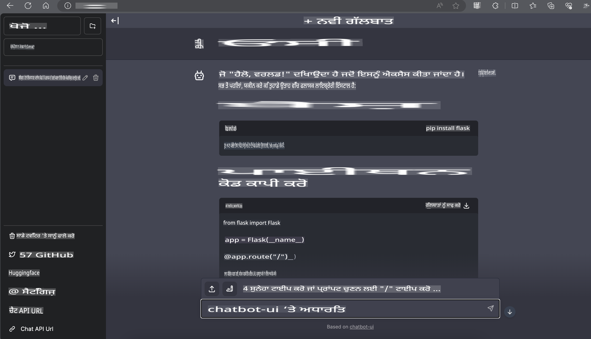

# **Nvidia Jetson ਵਿੱਚ Phi-3 ਦੀ ਵਰਤੋਂ**

Nvidia Jetson Nvidia ਵੱਲੋਂ ਇੱਕ ਐਮਬੈਡਡ ਕੰਪਿਊਟਿੰਗ ਬੋਰਡ ਦੀ ਲੜੀ ਹੈ। Jetson TK1, TX1 ਅਤੇ TX2 ਮਾਡਲ ਸਭ ਇੱਕ Tegra ਪ੍ਰੋਸੈਸਰ (ਜਾਂ SoC) ਨਾਲ ਲੈਸ ਹਨ, ਜੋ ਕਿ Nvidia ਵੱਲੋਂ ਇੱਕ ARM ਆਰਕੀਟੈਕਚਰ ਸੈਂਟਰਲ ਪ੍ਰੋਸੈਸਿੰਗ ਯੂਨਿਟ (CPU) ਨੂੰ ਇਕੱਠਾ ਕਰਦਾ ਹੈ। Jetson ਇੱਕ ਘੱਟ ਪਾਵਰ ਵਾਲਾ ਸਿਸਟਮ ਹੈ ਜੋ ਮਸ਼ੀਨ ਲਰਨਿੰਗ ਐਪਲੀਕੇਸ਼ਨ ਨੂੰ ਤੇਜ਼ੀ ਦੇ ਨਾਲ ਚਲਾਉਣ ਲਈ ਡਿਜ਼ਾਈਨ ਕੀਤਾ ਗਿਆ ਹੈ। Nvidia Jetson ਨੂੰ ਪੇਸ਼ੇਵਰ ਡਿਵੈਲਪਰਾਂ ਦੁਆਰਾ ਹਰ ਉਦਯੋਗ ਵਿੱਚ ਨਵੇਂ AI ਉਤਪਾਦ ਬਣਾਉਣ ਲਈ ਵਰਤਿਆ ਜਾਂਦਾ ਹੈ, ਅਤੇ ਵਿਦਿਆਰਥੀਆਂ ਅਤੇ ਹੌਬੀਸਟਾਂ ਦੁਆਰਾ ਹੱਥ-ਓਨ AI ਸਿੱਖਣ ਅਤੇ ਸ਼ਾਨਦਾਰ ਪ੍ਰੋਜੈਕਟ ਬਣਾਉਣ ਲਈ। SLM ਨੂੰ ਐਜ ਡਿਵਾਈਸਾਂ ਵਿੱਚ ਵਰਤਿਆ ਜਾਂਦਾ ਹੈ, ਜਿਵੇਂ ਕਿ Jetson, ਜੋ ਉਦਯੋਗਿਕ ਜਨਰੇਟਿਵ AI ਐਪਲੀਕੇਸ਼ਨ ਸਕੀਮਾਂ ਦੀ ਬਿਹਤਰ ਅਮਲਦਾਰੀ ਨੂੰ ਯਕੀਨੀ ਬਣਾਏਗਾ।

## NVIDIA Jetson 'ਤੇ ਡਿਪਲੋਇਮੈਂਟ:
ਆਟੋਨੋਮਸ ਰੋਬੋਟਿਕਸ ਅਤੇ ਐਮਬੈਡਡ ਡਿਵਾਈਸਾਂ 'ਤੇ ਕੰਮ ਕਰ ਰਹੇ ਡਿਵੈਲਪਰ Phi-3 Mini ਤੋਂ ਲਾਭ ਉਠਾ ਸਕਦੇ ਹਨ। Phi-3 ਦਾ ਛੋਟਾ ਆਕਾਰ ਇਸਨੂੰ ਐਜ ਡਿਪਲੋਇਮੈਂਟ ਲਈ ਆਦਰਸ਼ ਬਣਾਉਂਦਾ ਹੈ। ਟ੍ਰੇਨਿੰਗ ਦੌਰਾਨ ਪੈਰਾਮੀਟਰਾਂ ਨੂੰ ਧਿਆਨ ਨਾਲ ਟਿਊਨ ਕੀਤਾ ਗਿਆ ਹੈ, ਜੋ ਉੱਚ ਸਹੀ ਜਵਾਬ ਯਕੀਨੀ ਬਣਾਉਂਦਾ ਹੈ।

### TensorRT-LLM ਅਪਟੀਮਾਈਜ਼ੇਸ਼ਨ:
NVIDIA ਦੀ [TensorRT-LLM ਲਾਇਬ੍ਰੇਰੀ](https://github.com/NVIDIA/TensorRT-LLM?WT.mc_id=aiml-138114-kinfeylo) ਵੱਡੇ ਲੈਂਗਵੇਜ ਮਾਡਲ ਇੰਫਰੈਂਸ ਨੂੰ ਅਪਟੀਮਾਈਜ਼ ਕਰਦੀ ਹੈ। ਇਹ Phi-3 Mini ਦੇ ਲੰਮੇ ਸੰਦਰਭ ਵਿੰਡੋ ਨੂੰ ਸਹਾਰਾ ਦਿੰਦੀ ਹੈ, ਜੋ throughput ਅਤੇ latency ਦੋਹਾਂ ਨੂੰ ਬਿਹਤਰ ਬਣਾਉਂਦੀ ਹੈ। ਅਪਟੀਮਾਈਜ਼ੇਸ਼ਨ ਵਿੱਚ LongRoPE, FP8, ਅਤੇ inflight batching ਵਰਗੀਆਂ ਤਕਨੀਕਾਂ ਸ਼ਾਮਲ ਹਨ।

### ਉਪਲਬਧਤਾ ਅਤੇ ਡਿਪਲੋਇਮੈਂਟ:
ਡਿਵੈਲਪਰ [NVIDIA ਦੇ AI](https://www.nvidia.com/en-us/ai-data-science/generative-ai/) 'ਤੇ 128K ਸੰਦਰਭ ਵਿੰਡੋ ਨਾਲ Phi-3 Mini ਦੀ ਖੋਜ ਕਰ ਸਕਦੇ ਹਨ। ਇਹ NVIDIA NIM ਦੇ ਰੂਪ ਵਿੱਚ ਪੈਕ ਕੀਤਾ ਗਿਆ ਹੈ, ਜੋ ਕਿ ਇੱਕ ਮਾਈਕਰੋਸਰਵਿਸ ਹੈ ਜਿਸ ਵਿੱਚ ਇੱਕ ਸਟੈਂਡਰਡ API ਹੈ ਅਤੇ ਕਿਤੇ ਵੀ ਡਿਪਲੋਇ ਕੀਤਾ ਜਾ ਸਕਦਾ ਹੈ। ਇਲਾਵਾ, [GitHub 'ਤੇ TensorRT-LLM ਇੰਪਲੀਮੈਂਟੇਸ਼ਨ](https://github.com/NVIDIA/TensorRT-LLM) ਵੀ ਉਪਲਬਧ ਹਨ।

## **1. ਤਿਆਰੀ**

a. Jetson Orin NX / Jetson NX

b. JetPack 5.1.2+

c. Cuda 11.8

d. Python 3.8+

## **2. Jetson 'ਤੇ Phi-3 ਚਲਾਉਣਾ**

ਅਸੀਂ [Ollama](https://ollama.com) ਜਾਂ [LlamaEdge](https://llamaedge.com) ਦੀ ਚੋਣ ਕਰ ਸਕਦੇ ਹਾਂ।

ਜੇ ਤੁਸੀਂ ਕਲਾਊਡ ਅਤੇ ਐਜ ਡਿਵਾਈਸਾਂ 'ਤੇ ਇੱਕੋ ਸਮੇਂ gguf ਵਰਤਣਾ ਚਾਹੁੰਦੇ ਹੋ, ਤਾਂ LlamaEdge ਨੂੰ WasmEdge ਵਜੋਂ ਸਮਝਿਆ ਜਾ ਸਕਦਾ ਹੈ (WasmEdge ਇੱਕ ਹਲਕਾ, ਉੱਚ-ਕਾਰਗੁਜ਼ਾਰੀ, ਸਕੇਲਬਲ WebAssembly ਰਨਟਾਈਮ ਹੈ ਜੋ ਕਲਾਊਡ ਨੇਟਿਵ, ਐਜ ਅਤੇ ਡਿਸੈਂਟ੍ਰਲਾਈਜ਼ਡ ਐਪਲੀਕੇਸ਼ਨ ਲਈ ਉਚਿਤ ਹੈ। ਇਹ ਸਰਵਰਲੈੱਸ ਐਪਲੀਕੇਸ਼ਨ, ਐਮਬੈਡਡ ਫੰਕਸ਼ਨ, ਮਾਈਕਰੋਸਰਵਿਸ, ਸਮਾਰਟ ਕਾਂਟ੍ਰੈਕਟ ਅਤੇ IoT ਡਿਵਾਈਸਾਂ ਦਾ ਸਮਰਥਨ ਕਰਦਾ ਹੈ। ਤੁਸੀਂ gguf ਦੇ ਮਾਤਰਾ ਮਾਡਲ ਨੂੰ LlamaEdge ਰਾਹੀਂ ਐਜ ਡਿਵਾਈਸਾਂ ਅਤੇ ਕਲਾਊਡ 'ਤੇ ਡਿਪਲੋਇ ਕਰ ਸਕਦੇ ਹੋ।


ਇਹ ਰਹੇ ਵਰਤੋਂ ਦੇ ਕਦਮ:

1. ਸੰਬੰਧਤ ਲਾਇਬ੍ਰੇਰੀਆਂ ਅਤੇ ਫਾਇਲਾਂ ਨੂੰ ਇੰਸਟਾਲ ਅਤੇ ਡਾਊਨਲੋਡ ਕਰੋ।

```bash

curl -sSf https://raw.githubusercontent.com/WasmEdge/WasmEdge/master/utils/install.sh | bash -s -- --plugin wasi_nn-ggml

curl -LO https://github.com/LlamaEdge/LlamaEdge/releases/latest/download/llama-api-server.wasm

curl -LO https://github.com/LlamaEdge/chatbot-ui/releases/latest/download/chatbot-ui.tar.gz

tar xzf chatbot-ui.tar.gz

```

**ਨੋਟ**: llama-api-server.wasm ਅਤੇ chatbot-ui ਨੂੰ ਇੱਕੋ ਡਾਇਰੈਕਟਰੀ ਵਿੱਚ ਹੋਣਾ ਚਾਹੀਦਾ ਹੈ।

2. ਟਰਮੀਨਲ ਵਿੱਚ ਸਕ੍ਰਿਪਟ ਚਲਾਓ।

```bash

wasmedge --dir .:. --nn-preload default:GGML:AUTO:{Your gguf path} llama-api-server.wasm -p phi-3-chat

```

ਇਹ ਰਿਹਾ ਚਲਾਉਣ ਦਾ ਨਤੀਜਾ:



***ਨਮੂਨਾ ਕੋਡ*** [Phi-3 Mini WASM ਨੋਟਬੁੱਕ ਨਮੂਨਾ](https://github.com/Azure-Samples/Phi-3MiniSamples/tree/main/wasm)

ਸੰਖੇਪ ਵਿੱਚ, Phi-3 Mini ਭਾਸ਼ਾ ਮਾਡਲਿੰਗ ਵਿੱਚ ਇੱਕ ਵੱਡੀ ਤਰੱਕੀ ਦਾ ਪ੍ਰਤੀਕ ਹੈ, ਜੋ ਪ੍ਰਭਾਵਸ਼ਾਲੀ ਕਾਰਗੁਜ਼ਾਰੀ, ਸੰਦਰਭ ਜਾਗਰੂਕਤਾ, ਅਤੇ NVIDIA ਦੀ ਅਪਟੀਮਾਈਜ਼ੇਸ਼ਨ ਕੁਸ਼ਲਤਾ ਨੂੰ ਮਿਲਾਉਂਦਾ ਹੈ। ਚਾਹੇ ਤੁਸੀਂ ਰੋਬੋਟ ਬਣਾ ਰਹੇ ਹੋ ਜਾਂ ਐਜ ਐਪਲੀਕੇਸ਼ਨ, Phi-3 Mini ਇੱਕ ਸ਼ਕਤੀਸ਼ਾਲੀ ਟੂਲ ਹੈ ਜਿਸ ਤੋਂ ਜਾਣੂ ਹੋਣਾ ਚਾਹੀਦਾ ਹੈ।

**ਅਸਵੀਕਰਤੀ**:  
ਇਹ ਦਸਤਾਵੇਜ਼ ਮਸ਼ੀਨ-ਅਧਾਰਿਤ AI ਅਨੁਵਾਦ ਸੇਵਾਵਾਂ ਦੀ ਵਰਤੋਂ ਕਰਕੇ ਅਨੁਵਾਦ ਕੀਤਾ ਗਿਆ ਹੈ। ਜਦੋਂ ਕਿ ਅਸੀਂ ਸਹੀ ਹੋਣ ਦਾ ਯਤਨ ਕਰਦੇ ਹਾਂ, ਕਿਰਪਾ ਕਰਕੇ ਧਿਆਨ ਦਿਓ ਕਿ ਆਟੋਮੈਟਿਕ ਅਨੁਵਾਦਾਂ ਵਿੱਚ ਗਲਤੀਆਂ ਜਾਂ ਅਸੁੱਤੀਆਂ ਹੋ ਸਕਦੀਆਂ ਹਨ। ਇਸ ਦੀ ਮੂਲ ਭਾਸ਼ਾ ਵਿੱਚ ਮੌਜੂਦ ਅਸਲ ਦਸਤਾਵੇਜ਼ ਨੂੰ ਅਧਿਕਾਰਕ ਸਰੋਤ ਮੰਨਿਆ ਜਾਣਾ ਚਾਹੀਦਾ ਹੈ। ਮਹੱਤਵਪੂਰਨ ਜਾਣਕਾਰੀ ਲਈ, ਪੇਸ਼ੇਵਰ ਮਨੁੱਖੀ ਅਨੁਵਾਦ ਦੀ ਸਿਫਾਰਸ਼ ਕੀਤੀ ਜਾਂਦੀ ਹੈ। ਇਸ ਅਨੁਵਾਦ ਦੀ ਵਰਤੋਂ ਤੋਂ ਪੈਦਾ ਹੋਣ ਵਾਲੇ ਕਿਸੇ ਵੀ ਗਲਤਫਹਿਮੀ ਜਾਂ ਗਲਤ ਵਿਆਖਿਆ ਲਈ ਅਸੀਂ ਜ਼ਿੰਮੇਵਾਰ ਨਹੀਂ ਹਾਂ।