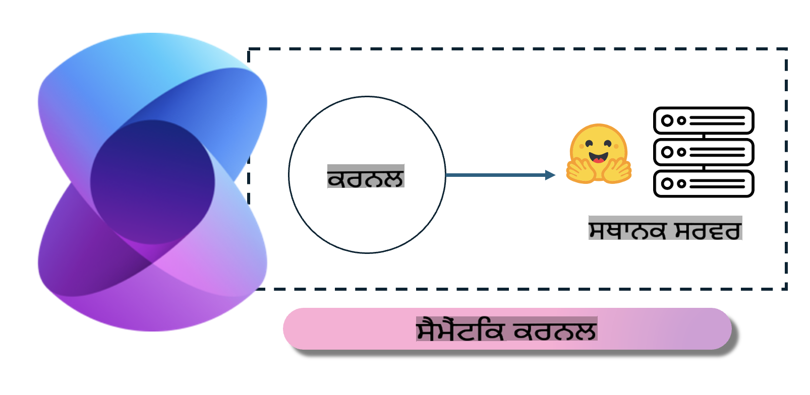
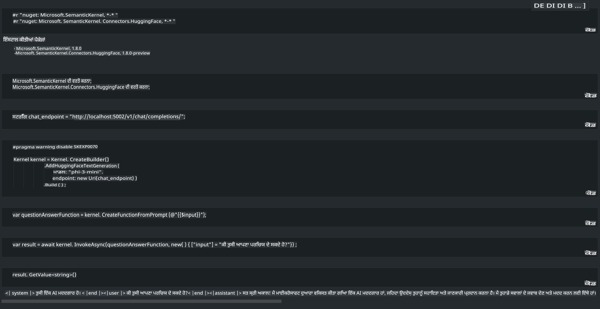

# **ਲੋਕਲ ਸਰਵਰ 'ਤੇ Phi-3 ਦੀ ਇਨਫਰੈਂਸ**

ਅਸੀਂ Phi-3 ਨੂੰ ਇੱਕ ਲੋਕਲ ਸਰਵਰ 'ਤੇ ਡਿਪਲੋਇ ਕਰ ਸਕਦੇ ਹਾਂ। ਯੂਜ਼ਰ [Ollama](https://ollama.com) ਜਾਂ [LM Studio](https://llamaedge.com) ਦੇ ਹੱਲ ਚੁਣ ਸਕਦੇ ਹਨ, ਜਾਂ ਆਪਣਾ ਕੋਡ ਲਿਖ ਸਕਦੇ ਹਨ। ਤੁਸੀਂ [Semantic Kernel](https://github.com/microsoft/semantic-kernel?WT.mc_id=aiml-138114-kinfeylo) ਜਾਂ [Langchain](https://www.langchain.com/) ਰਾਹੀਂ Phi-3 ਦੀਆਂ ਲੋਕਲ ਸੇਵਾਵਾਂ ਨਾਲ ਜੁੜ ਕੇ Copilot ਐਪਲੀਕੇਸ਼ਨ ਤਿਆਰ ਕਰ ਸਕਦੇ ਹੋ।

## **Phi-3-mini ਤੱਕ ਪਹੁੰਚ ਲਈ Semantic Kernel ਦੀ ਵਰਤੋਂ ਕਰੋ**

Copilot ਐਪਲੀਕੇਸ਼ਨ ਵਿੱਚ, ਅਸੀਂ Semantic Kernel / LangChain ਰਾਹੀਂ ਐਪਲੀਕੇਸ਼ਨ ਤਿਆਰ ਕਰਦੇ ਹਾਂ। ਇਸ ਕਿਸਮ ਦਾ ਐਪਲੀਕੇਸ਼ਨ ਫਰੇਮਵਰਕ ਆਮ ਤੌਰ 'ਤੇ Azure OpenAI Service / OpenAI ਮਾਡਲ ਨਾਲ ਅਨੁਕੂਲ ਹੁੰਦਾ ਹੈ ਅਤੇ Hugging Face ਅਤੇ ਲੋਕਲ ਮਾਡਲ ਵਰਗੇ ਖੁੱਲ੍ਹੇ ਸਰੋਤ ਮਾਡਲਾਂ ਦਾ ਵੀ ਸਮਰਥਨ ਕਰਦਾ ਹੈ। ਜੇ ਅਸੀਂ Semantic Kernel ਦੀ ਵਰਤੋਂ ਕਰਕੇ Phi-3-mini ਤੱਕ ਪਹੁੰਚਣਾ ਚਾਹੀਏ ਤਾਂ ਕੀ ਕਰਨਾ ਚਾਹੀਦਾ ਹੈ? .NET ਨੂੰ ਉਦਾਹਰਣ ਵਜੋਂ ਵਰਤਦੇ ਹੋਏ, ਅਸੀਂ ਇਸਨੂੰ Semantic Kernel ਵਿੱਚ Hugging Face Connector ਨਾਲ ਜੋੜ ਸਕਦੇ ਹਾਂ। ਡਿਫਾਲਟ ਤੌਰ 'ਤੇ, ਇਹ Hugging Face 'ਤੇ ਮਾਡਲ id ਨਾਲ ਮਿਲਦਾ ਹੈ (ਪਹਿਲੀ ਵਾਰ ਵਰਤਣ 'ਤੇ, ਮਾਡਲ Hugging Face ਤੋਂ ਡਾਊਨਲੋਡ ਕੀਤਾ ਜਾਵੇਗਾ, ਜਿਸ ਵਿੱਚ ਸਮਾਂ ਲੱਗਦਾ ਹੈ)। ਤੁਸੀਂ ਲੋਕਲ ਸੇਵਾ ਨਾਲ ਵੀ ਜੁੜ ਸਕਦੇ ਹੋ। ਦੋਨੋਂ ਦੀ ਤੁਲਨਾ ਕਰਨ 'ਤੇ, ਅਸੀਂ ਦੂਜੇ ਹੱਲ ਦੀ ਸਿਫਾਰਿਸ਼ ਕਰਦੇ ਹਾਂ ਕਿਉਂਕਿ ਇਹ ਵਧੇਰੇ ਖੁਦਮੁਖਤਿਆਰ ਹੈ, ਖਾਸ ਕਰਕੇ ਕਾਰੋਬਾਰੀ ਐਪਲੀਕੇਸ਼ਨਾਂ ਵਿੱਚ।

ਚਿੱਤਰ ਤੋਂ ਦਿਖਾਈ ਦਿੰਦਾ ਹੈ ਕਿ Semantic Kernel ਰਾਹੀਂ ਲੋਕਲ ਸੇਵਾਵਾਂ ਤੱਕ ਪਹੁੰਚ ਕਰਨਾ ਆਸਾਨੀ ਨਾਲ ਖੁਦ-ਤਿਆਰ ਕੀਤੇ Phi-3-mini ਮਾਡਲ ਸਰਵਰ ਨਾਲ ਕਨੈਕਟ ਕਰ ਸਕਦਾ ਹੈ। ਇੱਥੇ ਚਲਾਉਣ ਦੇ ਨਤੀਜੇ ਹਨ:

***ਨਮੂਨਾ ਕੋਡ*** https://github.com/kinfey/Phi3MiniSamples/tree/main/semantickernel

**ਅਸਵੀਕਰਤੀ**:  
ਇਹ ਦਸਤਾਵੇਜ਼ ਮਸ਼ੀਨ ਅਧਾਰਿਤ AI ਅਨੁਵਾਦ ਸੇਵਾਵਾਂ ਦੀ ਵਰਤੋਂ ਕਰਕੇ ਅਨੁਵਾਦਿਤ ਕੀਤਾ ਗਿਆ ਹੈ। ਅਸੀਂ ਸਹੀ ਹੋਣ ਦਾ ਯਤਨ ਕਰਦੇ ਹਾਂ, ਪਰ ਕਿਰਪਾ ਕਰਕੇ ਧਿਆਨ ਦਿਓ ਕਿ ਆਟੋਮੇਟੇਡ ਅਨੁਵਾਦਾਂ ਵਿੱਚ ਗਲਤੀਆਂ ਜਾਂ ਅਸੁਣਤਾਂ ਹੋ ਸਕਦੀਆਂ ਹਨ। ਮੂਲ ਦਸਤਾਵੇਜ਼ ਨੂੰ ਇਸਦੀ ਮੂਲ ਭਾਸ਼ਾ ਵਿੱਚ ਅਧਿਕਾਰਕ ਸਰੋਤ ਮੰਨਿਆ ਜਾਣਾ ਚਾਹੀਦਾ ਹੈ। ਮਹੱਤਵਪੂਰਨ ਜਾਣਕਾਰੀ ਲਈ, ਪੇਸ਼ੇਵਰ ਮਨੁੱਖੀ ਅਨੁਵਾਦ ਦੀ ਸਿਫਾਰਸ਼ ਕੀਤੀ ਜਾਂਦੀ ਹੈ। ਇਸ ਅਨੁਵਾਦ ਦੇ ਉਪਯੋਗ ਤੋਂ ਪੈਦਾ ਹੋਣ ਵਾਲੇ ਕਿਸੇ ਵੀ ਗਲਤ ਫਹਿਮੀ ਜਾਂ ਗਲਤ ਵਿਆਖਿਆ ਲਈ ਅਸੀਂ ਜ਼ਿੰਮੇਵਾਰ ਨਹੀਂ ਹਾਂ।