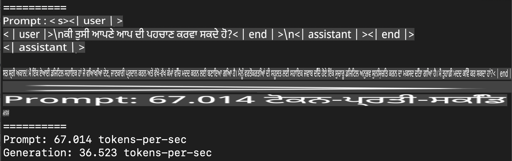
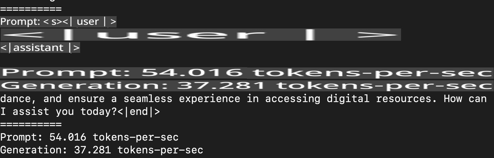
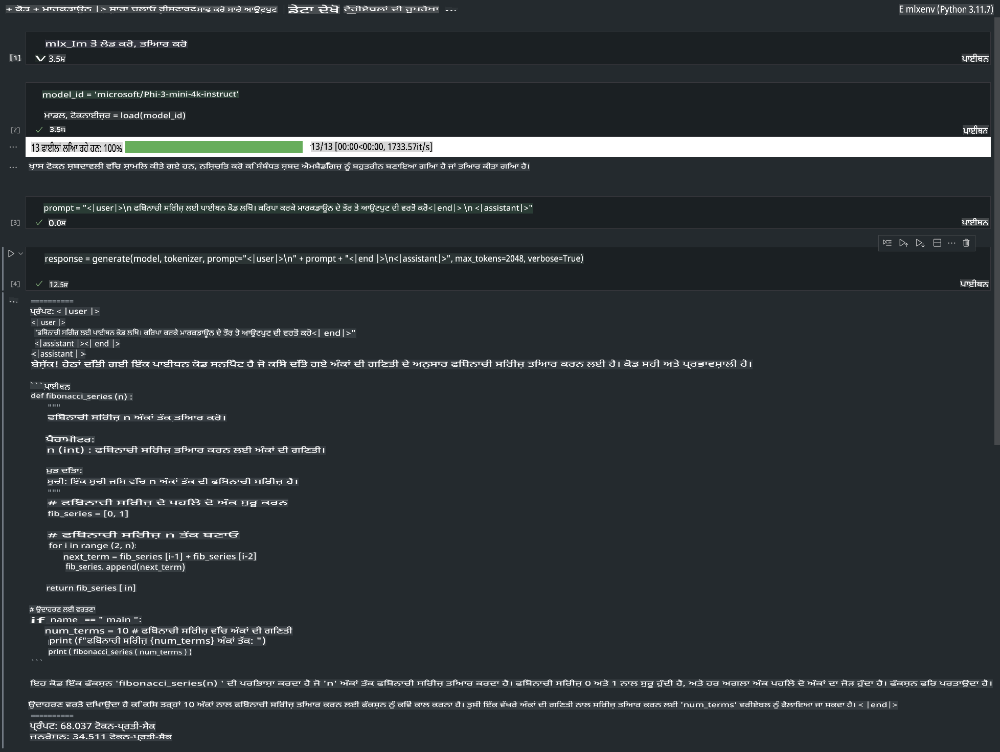

# **ਐਪਲ MLX ਫਰੇਮਵਰਕ ਨਾਲ Phi-3 ਦਾ ਇਨਫਰੈਂਸ**

## **MLX ਫਰੇਮਵਰਕ ਕੀ ਹੈ**

MLX ਇੱਕ ਐਰੇ ਫਰੇਮਵਰਕ ਹੈ ਜੋ ਐਪਲ ਸਿਲਿਕਾਨ ਉੱਤੇ ਮਸ਼ੀਨ ਲਰਨਿੰਗ ਖੋਜ ਲਈ ਬਣਾਇਆ ਗਿਆ ਹੈ। ਇਹ ਐਪਲ ਮਸ਼ੀਨ ਲਰਨਿੰਗ ਰਿਸਰਚ ਦੁਆਰਾ ਪ੍ਰਸਤੁਤ ਕੀਤਾ ਗਿਆ ਹੈ।

MLX ਮਸ਼ੀਨ ਲਰਨਿੰਗ ਖੋਜਕਰਤਾਵਾਂ ਲਈ ਖਾਸ ਤੌਰ 'ਤੇ ਡਿਜ਼ਾਈਨ ਕੀਤਾ ਗਿਆ ਹੈ। ਇਹ ਫਰੇਮਵਰਕ ਵਰਤਣ ਲਈ ਆਸਾਨ ਹੈ ਪਰ ਮਾਡਲ ਨੂੰ ਟ੍ਰੇਨ ਅਤੇ ਡਿਪਲੋਇ ਕਰਨ ਵਿੱਚ ਫਿਰ ਵੀ ਪ੍ਰਭਾਵਸ਼ਾਲੀ ਹੈ। ਫਰੇਮਵਰਕ ਦੀ ਡਿਜ਼ਾਈਨ ਵੀ ਸਿਧੀ ਅਤੇ ਸਪਸ਼ਟ ਹੈ। ਸਾਡੇ ਉਦੇਸ਼ ਹੈ ਕਿ ਖੋਜਕਰਤਾ ਇਸਨੂੰ ਤੇਜ਼ੀ ਨਾਲ ਨਵੇਂ ਵਿਚਾਰਾਂ ਦੀ ਖੋਜ ਕਰਨ ਲਈ ਆਸਾਨੀ ਨਾਲ ਵਧਾ ਸਕਣ।

ਐਲਐਲਐਮਜ਼ ਨੂੰ ਐਪਲ ਸਿਲਿਕਾਨ ਡਿਵਾਈਸਾਂ 'ਤੇ MLX ਰਾਹੀਂ ਤੇਜ਼ ਕੀਤਾ ਜਾ ਸਕਦਾ ਹੈ, ਅਤੇ ਮਾਡਲ ਨੂੰ ਬਹੁਤ ਹੀ ਆਸਾਨੀ ਨਾਲ ਸਥਾਨਕ ਤੌਰ 'ਤੇ ਚਲਾਇਆ ਜਾ ਸਕਦਾ ਹੈ।

## **MLX ਦੀ ਵਰਤੋਂ ਕਰਕੇ Phi-3-mini ਦਾ ਇਨਫਰੈਂਸ**

### **1. ਆਪਣਾ MLX ਵਾਤਾਵਰਣ ਸੈਟ ਕਰੋ**

1. Python 3.11.x
2. MLX ਲਾਇਬ੍ਰੇਰੀ ਇੰਸਟਾਲ ਕਰੋ

```bash

pip install mlx-lm

```

### **2. MLX ਨਾਲ ਟਰਮੀਨਲ ਵਿੱਚ Phi-3-mini ਚਲਾਉਣਾ**

```bash

python -m mlx_lm.generate --model microsoft/Phi-3-mini-4k-instruct --max-token 2048 --prompt  "<|user|>\nCan you introduce yourself<|end|>\n<|assistant|>"

```

ਨਤੀਜਾ (ਮੇਰਾ ਵਾਤਾਵਰਣ Apple M1 Max,64GB ਹੈ) ਇਹ ਹੈ:



### **3. MLX ਨਾਲ ਟਰਮੀਨਲ ਵਿੱਚ Phi-3-mini ਨੂੰ ਕਵਾਂਟਾਈਜ਼ ਕਰਨਾ**

```bash

python -m mlx_lm.convert --hf-path microsoft/Phi-3-mini-4k-instruct

```

***ਨੋਟ:*** ਮਾਡਲ ਨੂੰ mlx_lm.convert ਰਾਹੀਂ ਕਵਾਂਟਾਈਜ਼ ਕੀਤਾ ਜਾ ਸਕਦਾ ਹੈ, ਅਤੇ ਡਿਫੌਲਟ ਕਵਾਂਟਾਈਜ਼ੇਸ਼ਨ INT4 ਹੈ। ਇਸ ਉਦਾਹਰਣ ਵਿੱਚ Phi-3-mini ਨੂੰ INT4 ਵਿੱਚ ਕਵਾਂਟਾਈਜ਼ ਕੀਤਾ ਗਿਆ ਹੈ।

ਮਾਡਲ ਨੂੰ mlx_lm.convert ਰਾਹੀਂ ਕਵਾਂਟਾਈਜ਼ ਕੀਤਾ ਜਾ ਸਕਦਾ ਹੈ, ਅਤੇ ਡਿਫੌਲਟ ਕਵਾਂਟਾਈਜ਼ੇਸ਼ਨ INT4 ਹੈ। ਇਸ ਉਦਾਹਰਣ ਵਿੱਚ Phi-3-mini ਨੂੰ INT4 ਵਿੱਚ ਕਵਾਂਟਾਈਜ਼ ਕੀਤਾ ਗਿਆ ਹੈ। ਕਵਾਂਟਾਈਜ਼ੇਸ਼ਨ ਤੋਂ ਬਾਅਦ, ਇਸਨੂੰ ਡਿਫੌਲਟ ਡਾਇਰੈਕਟਰੀ ./mlx_model ਵਿੱਚ ਸਟੋਰ ਕੀਤਾ ਜਾਵੇਗਾ।

ਅਸੀਂ MLX ਨਾਲ ਕਵਾਂਟਾਈਜ਼ ਕੀਤੇ ਮਾਡਲ ਨੂੰ ਟਰਮੀਨਲ ਵਿੱਚ ਟੈਸਟ ਕਰ ਸਕਦੇ ਹਾਂ।

```bash

python -m mlx_lm.generate --model ./mlx_model/ --max-token 2048 --prompt  "<|user|>\nCan you introduce yourself<|end|>\n<|assistant|>"

```

ਨਤੀਜਾ ਇਹ ਹੈ:



### **4. Jupyter Notebook ਵਿੱਚ MLX ਨਾਲ Phi-3-mini ਚਲਾਉਣਾ**



***ਨੋਟ:*** ਕਿਰਪਾ ਕਰਕੇ ਇਹ ਉਦਾਹਰਣ ਪੜ੍ਹੋ [ਇਸ ਲਿੰਕ 'ਤੇ ਕਲਿੱਕ ਕਰੋ](../../../../../code/03.Inference/MLX/MLX_DEMO.ipynb)

## **ਸਰੋਤ**

1. ਐਪਲ MLX ਫਰੇਮਵਰਕ ਬਾਰੇ ਜਾਣੋ [https://ml-explore.github.io](https://ml-explore.github.io/mlx/build/html/index.html)

2. ਐਪਲ MLX GitHub ਰਿਪੋ [https://github.com/ml-explore](https://github.com/ml-explore)

**ਅਸਵੀਕਾਰ:**
ਇਹ ਦਸਤਾਵੇਜ਼ ਮਸ਼ੀਨ-ਅਧਾਰਿਤ AI ਅਨੁਵਾਦ ਸੇਵਾਵਾਂ ਦੀ ਵਰਤੋਂ ਕਰਕੇ ਅਨੁਵਾਦਿਤ ਕੀਤਾ ਗਿਆ ਹੈ। ਜਦੋਂ ਕਿ ਅਸੀਂ ਸਹੀ ਹੋਣ ਦੀ ਕੋਸ਼ਿਸ਼ ਕਰਦੇ ਹਾਂ, ਕਿਰਪਾ ਕਰਕੇ ਧਿਆਨ ਵਿੱਚ ਰੱਖੋ ਕਿ ਸਵੈਚਾਲਿਤ ਅਨੁਵਾਦਾਂ ਵਿੱਚ ਗਲਤੀਆਂ ਜਾਂ ਅਸੁਨਸਾਰੀ ਹੋ ਸਕਦੀ ਹੈ। ਮੂਲ ਦਸਤਾਵੇਜ਼ ਨੂੰ ਇਸਦੀ ਮੂਲ ਭਾਸ਼ਾ ਵਿੱਚ ਅਧਿਕਾਰਤ ਸਰੋਤ ਮੰਨਿਆ ਜਾਣਾ ਚਾਹੀਦਾ ਹੈ। ਮਹੱਤਵਪੂਰਨ ਜਾਣਕਾਰੀ ਲਈ, ਪੇਸ਼ੇਵਰ ਮਨੁੱਖੀ ਅਨੁਵਾਦ ਦੀ ਸਿਫਾਰਿਸ਼ ਕੀਤੀ ਜਾਂਦੀ ਹੈ। ਇਸ ਅਨੁਵਾਦ ਦੀ ਵਰਤੋਂ ਤੋਂ ਪੈਦਾ ਹੋਣ ਵਾਲੇ ਕਿਸੇ ਵੀ ਗਲਤਫਹਿਮੀ ਜਾਂ ਗਲਤ ਵਿਆਖਿਆ ਲਈ ਅਸੀਂ ਜ਼ਿੰਮੇਵਾਰ ਨਹੀਂ ਹਾਂ।