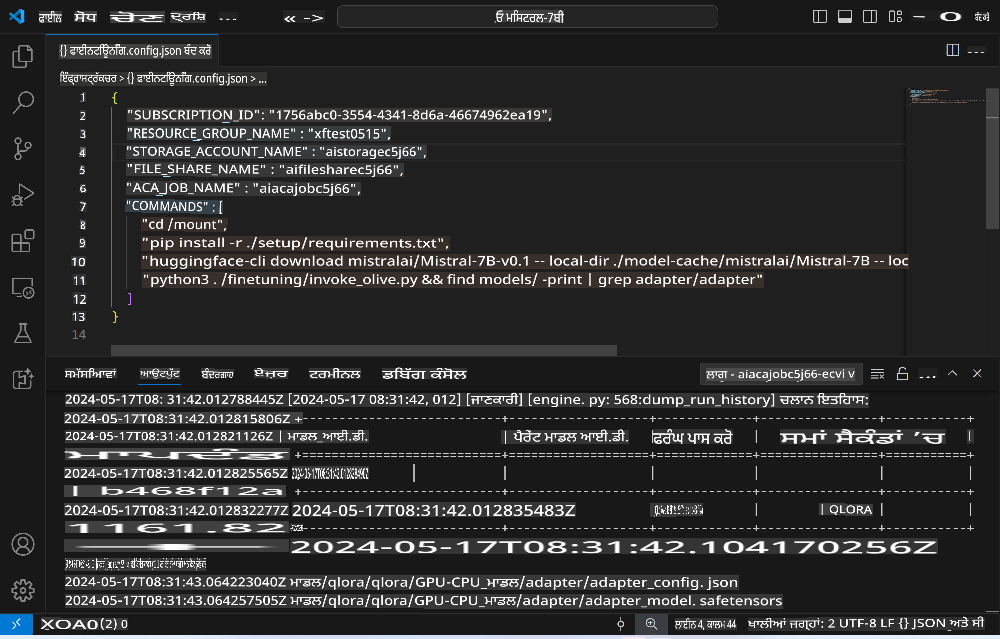
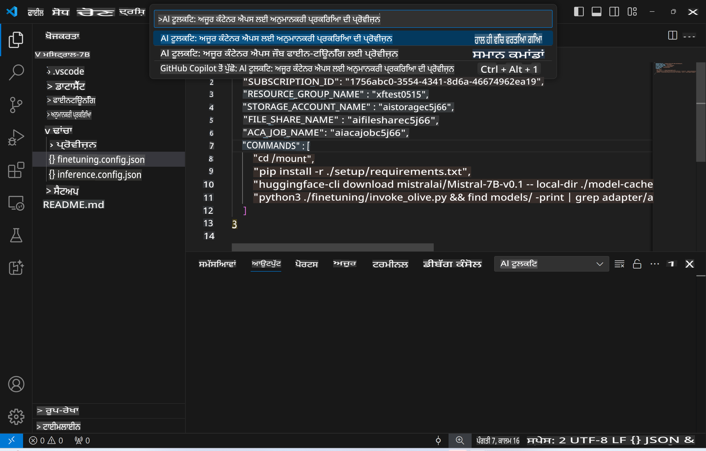
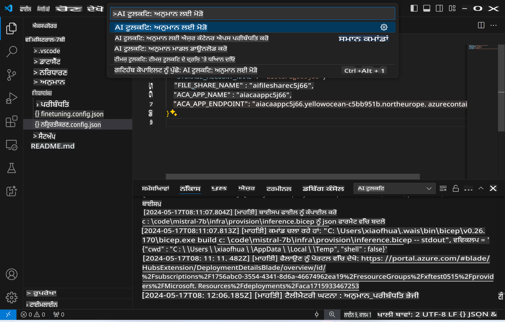
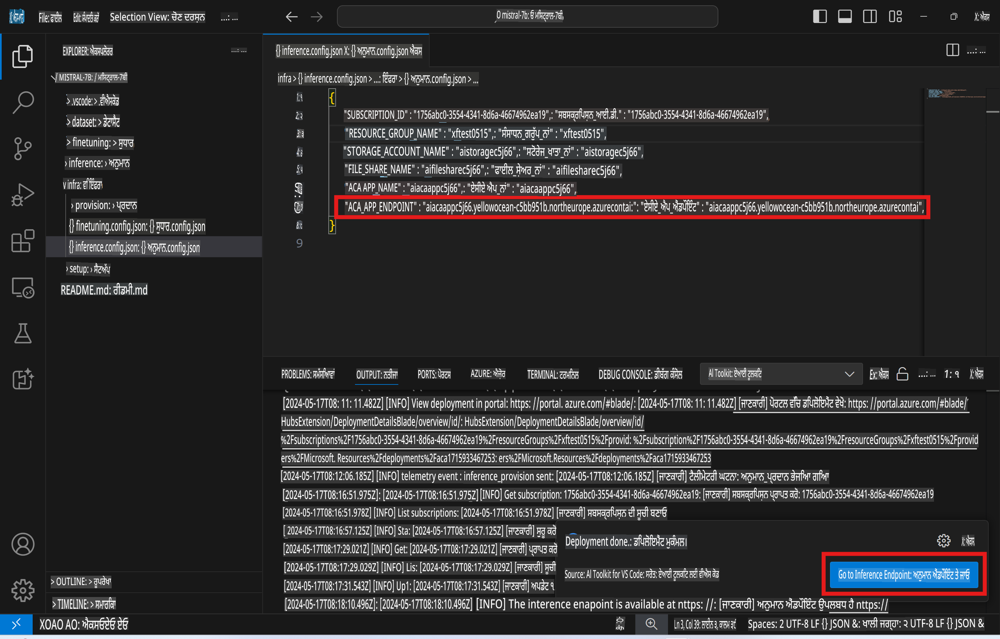

# ਰਿਮੋਟ ਇਨਫਰੈਂਸਿੰਗ ਫਾਈਨ-ਟਿਊਨ ਮਾਡਲ ਨਾਲ

ਜਦੋਂ ਰਿਮੋਟ ਵਾਤਾਵਰਣ ਵਿੱਚ ਐਡਾਪਟਰਾਂ ਦੀ ਟ੍ਰੇਨਿੰਗ ਹੋ ਜਾਂਦੀ ਹੈ, ਤਾਂ ਮਾਡਲ ਨਾਲ ਇੰਟਰੈਕਟ ਕਰਨ ਲਈ ਇੱਕ ਸਧਾਰਨ Gradio ਐਪਲੀਕੇਸ਼ਨ ਦੀ ਵਰਤੋਂ ਕਰੋ।



### Azure ਸਰੋਤ ਸੈੱਟ ਅੱਪ ਕਰੋ
ਰਿਮੋਟ ਇਨਫਰੈਂਸ ਲਈ Azure ਸਰੋਤ ਸੈੱਟ ਅੱਪ ਕਰਨ ਲਈ, ਕਮਾਂਡ ਪੈਲੇਟ ਤੋਂ `AI Toolkit: Provision Azure Container Apps for inference` ਚਲਾਓ। ਇਸ ਦੌਰਾਨ, ਤੁਹਾਨੂੰ ਆਪਣੀ Azure Subscription ਅਤੇ resource group ਚੁਣਨ ਲਈ ਕਿਹਾ ਜਾਵੇਗਾ।  

   
ਮੂਲ ਰੂਪ ਵਿੱਚ, ਇਨਫਰੈਂਸ ਲਈ subscription ਅਤੇ resource group ਉਹੀ ਹੋਣੇ ਚਾਹੀਦੇ ਹਨ ਜੋ ਫਾਈਨ-ਟਿਊਨ ਲਈ ਵਰਤੇ ਗਏ ਸਨ। ਇਨਫਰੈਂਸ ਲਈ ਉਹੀ Azure Container App Environment ਵਰਤੀ ਜਾਵੇਗੀ ਅਤੇ ਮਾਡਲ ਅਤੇ ਮਾਡਲ ਐਡਾਪਟਰ ਨੂੰ Azure Files ਵਿੱਚ ਪਹੁੰਚ ਪ੍ਰਾਪਤ ਹੋਵੇਗੀ, ਜੋ ਕਿ ਫਾਈਨ-ਟਿਊਨਿੰਗ ਦੌਰਾਨ ਬਣਾਈ ਗਈ ਸੀ। 

## AI Toolkit ਦੀ ਵਰਤੋਂ 

### ਇਨਫਰੈਂਸ ਲਈ ਡਿਪਲੌਇਮੈਂਟ  
ਜੇ ਤੁਸੀਂ ਇਨਫਰੈਂਸ ਕੋਡ ਨੂੰ ਦੁਬਾਰਾ ਸੋਧਣਾ ਜਾਂ ਇਨਫਰੈਂਸ ਮਾਡਲ ਨੂੰ ਦੁਬਾਰਾ ਲੋਡ ਕਰਨਾ ਚਾਹੁੰਦੇ ਹੋ, ਤਾਂ `AI Toolkit: Deploy for inference` ਕਮਾਂਡ ਚਲਾਓ। ਇਸ ਨਾਲ ਤੁਹਾਡਾ ਨਵਾਂ ਕੋਡ ACA ਨਾਲ ਸਿੰਕ ਹੋ ਜਾਵੇਗਾ ਅਤੇ ਰੀਪਲਿਕਾ ਰੀਸਟਾਰਟ ਹੋ ਜਾਵੇਗਾ।  



ਡਿਪਲੌਇਮੈਂਟ ਸਫਲਤਾਪੂਰਵਕ ਪੂਰਾ ਹੋਣ ਤੋਂ ਬਾਅਦ, ਮਾਡਲ ਹੁਣ ਇਸ ਐਂਡਪੋਇੰਟ ਦੀ ਵਰਤੋਂ ਕਰਕੇ ਮੁਲਾਂਕਨ ਲਈ ਤਿਆਰ ਹੈ।

### ਇਨਫਰੈਂਸ API ਤੱਕ ਪਹੁੰਚ

ਤੁਸੀਂ VSCode ਨੋਟੀਫਿਕੇਸ਼ਨ ਵਿੱਚ ਦਰਸਾਏ "*Go to Inference Endpoint*" ਬਟਨ 'ਤੇ ਕਲਿਕ ਕਰਕੇ ਇਨਫਰੈਂਸ API ਤੱਕ ਪਹੁੰਚ ਕਰ ਸਕਦੇ ਹੋ। ਵਿਵਕਲਪਕ ਤੌਰ 'ਤੇ, ਵੈੱਬ API ਐਂਡਪੋਇੰਟ `ACA_APP_ENDPOINT` ਵਿੱਚ `./infra/inference.config.json` ਅਤੇ ਆਉਟਪੁੱਟ ਪੈਨਲ ਵਿੱਚ ਮਿਲੇਗਾ।



> **ਨੋਟ:** ਇਨਫਰੈਂਸ ਐਂਡਪੋਇੰਟ ਨੂੰ ਪੂਰੀ ਤਰ੍ਹਾਂ ਚਾਲੂ ਹੋਣ ਵਿੱਚ ਕੁਝ ਮਿੰਟ ਲੱਗ ਸਕਦੇ ਹਨ।

## ਟੈਂਪਲੇਟ ਵਿੱਚ ਸ਼ਾਮਲ ਇਨਫਰੈਂਸ ਕੌਂਪੋਨੈਂਟ 

| ਫੋਲਡਰ | ਸਮੱਗਰੀ |
| ------ |--------- |
| `infra` | ਰਿਮੋਟ ਓਪਰੇਸ਼ਨ ਲਈ ਸਾਰੀਆਂ ਲੋੜੀਂਦੀਆਂ ਕਨਫਿਗਰੇਸ਼ਨਾਂ ਸ਼ਾਮਲ ਹਨ। |
| `infra/provision/inference.parameters.json` | ਬਾਈਸੈਪ ਟੈਂਪਲੇਟ ਲਈ ਪੈਰਾਮੀਟਰ ਰੱਖਦਾ ਹੈ, ਜੋ ਇਨਫਰੈਂਸ ਲਈ Azure ਸਰੋਤ ਸੈੱਟ ਅੱਪ ਕਰਨ ਲਈ ਵਰਤੇ ਜਾਂਦੇ ਹਨ। |
| `infra/provision/inference.bicep` | ਇਨਫਰੈਂਸ ਲਈ Azure ਸਰੋਤ ਸੈੱਟ ਅੱਪ ਕਰਨ ਦੇ ਟੈਂਪਲੇਟ ਸ਼ਾਮਲ ਹਨ। |
| `infra/inference.config.json` | ਕਨਫਿਗਰੇਸ਼ਨ ਫਾਈਲ, ਜੋ `AI Toolkit: Provision Azure Container Apps for inference` ਕਮਾਂਡ ਦੁਆਰਾ ਬਣਾਈ ਜਾਂਦੀ ਹੈ। ਇਹ ਹੋਰ ਰਿਮੋਟ ਕਮਾਂਡ ਪੈਲੇਟ ਲਈ ਇਨਪੁਟ ਵਜੋਂ ਵਰਤੀ ਜਾਂਦੀ ਹੈ। |

### AI Toolkit ਦੀ ਵਰਤੋਂ ਕਰਕੇ Azure ਸਰੋਤ ਪ੍ਰੋਵਿਜ਼ਨਿੰਗ ਕਨਫਿਗਰ ਕਰਨਾ
[AI Toolkit](https://marketplace.visualstudio.com/items?itemName=ms-windows-ai-studio.windows-ai-studio) ਕਨਫਿਗਰ ਕਰੋ।

ਇਨਫਰੈਂਸ ਲਈ Azure Container Apps ਪ੍ਰੋਵਿਜ਼ਨ ਕਰੋ` command.

You can find configuration parameters in `./infra/provision/inference.parameters.json` file. Here are the details:
| Parameter | Description |
| --------- |------------ |
| `defaultCommands` | This is the commands to initiate a web API. |
| `maximumInstanceCount` | This parameter sets the maximum capacity of GPU instances. |
| `location` | This is the location where Azure resources are provisioned. The default value is the same as the chosen resource group's location. |
| `storageAccountName`, `fileShareName` `acaEnvironmentName`, `acaEnvironmentStorageName`, `acaAppName`,  `acaLogAnalyticsName` | These parameters are used to name the Azure resources for provision. By default, they will be same to the fine-tuning resource name. You can input a new, unused resource name to create your own custom-named resources, or you can input the name of an already existing Azure resource if you'd prefer to use that. For details, refer to the section [Using existing Azure Resources](../../../../../md/01.Introduction/03). |

### Using Existing Azure Resources

By default, the inference provision use the same Azure Container App Environment, Storage Account, Azure File Share, and Azure Log Analytics that were used for fine-tuning. A separate Azure Container App is created solely for the inference API. 

If you have customized the Azure resources during the fine-tuning step or want to use your own existing Azure resources for inference, specify their names in the `./infra/inference.parameters.json` ਫਾਈਲ। ਫਿਰ, ਕਮਾਂਡ ਪੈਲੇਟ ਤੋਂ `AI Toolkit: Provision Azure Container Apps for inference` ਕਮਾਂਡ ਚਲਾਓ। ਇਹ ਕਿਸੇ ਵੀ ਨਿਰਧਾਰਤ ਸਰੋਤਾਂ ਨੂੰ ਅਪਡੇਟ ਕਰਦਾ ਹੈ ਅਤੇ ਜੇਕਰ ਕੁਝ ਗੁੰਮ ਹੈ, ਤਾਂ ਉਹਨਾਂ ਨੂੰ ਬਣਾਉਂਦਾ ਹੈ।

ਉਦਾਹਰਨ ਲਈ, ਜੇ ਤੁਹਾਡੇ ਕੋਲ ਪਹਿਲਾਂ ਤੋਂ ਹੀ ਇੱਕ ਮੌਜੂਦਾ Azure ਕਨਟੇਨਰ ਵਾਤਾਵਰਣ ਹੈ, ਤਾਂ ਤੁਹਾਡੀ `./infra/finetuning.parameters.json` ਇਸ ਤਰ੍ਹਾਂ ਹੋਣੀ ਚਾਹੀਦੀ ਹੈ:

```json
{
    "$schema": "https://schema.management.azure.com/schemas/2019-04-01/deploymentParameters.json#",
    "contentVersion": "1.0.0.0",
    "parameters": {
      ...
      "acaEnvironmentName": {
        "value": "<your-aca-env-name>"
      },
      "acaEnvironmentStorageName": {
        "value": null
      },
      ...
    }
  }
```

### ਹੱਥੋਂ ਪ੍ਰੋਵਿਜ਼ਨ  
ਜੇ ਤੁਸੀਂ Azure ਸਰੋਤਾਂ ਨੂੰ ਮੈਨੁਅਲ ਤਰੀਕੇ ਨਾਲ ਕਨਫਿਗਰ ਕਰਨਾ ਚਾਹੁੰਦੇ ਹੋ, ਤਾਂ ਤੁਸੀਂ `./infra/provision` folders. If you have already set up and configured all the Azure resources without using the AI Toolkit command palette, you can simply enter the resource names in the `inference.config.json` ਫਾਈਲ ਵਿੱਚ ਦਿੱਤੇ ਗਏ ਬਾਈਸੈਪ ਫਾਈਲਾਂ ਦੀ ਵਰਤੋਂ ਕਰ ਸਕਦੇ ਹੋ।

ਉਦਾਹਰਨ ਲਈ:

```json
{
  "SUBSCRIPTION_ID": "<your-subscription-id>",
  "RESOURCE_GROUP_NAME": "<your-resource-group-name>",
  "STORAGE_ACCOUNT_NAME": "<your-storage-account-name>",
  "FILE_SHARE_NAME": "<your-file-share-name>",
  "ACA_APP_NAME": "<your-aca-name>",
  "ACA_APP_ENDPOINT": "<your-aca-endpoint>"
}
```

**ਅਸਵੀਕਰਤੀ**:  
ਇਹ ਦਸਤਾਵੇਜ਼ ਮਸ਼ੀਨ ਅਧਾਰਿਤ AI ਅਨੁਵਾਦ ਸੇਵਾਵਾਂ ਦੀ ਵਰਤੋਂ ਕਰਕੇ ਅਨੁਵਾਦ ਕੀਤਾ ਗਿਆ ਹੈ। ਜਦੋਂ ਕਿ ਅਸੀਂ ਸਹੀ ਹੋਣ ਦੀ ਪੂਰੀ ਕੋਸ਼ਿਸ਼ ਕਰਦੇ ਹਾਂ, ਕਿਰਪਾ ਕਰਕੇ ਧਿਆਨ ਦਿਓ ਕਿ ਸਵੈਚਾਲਿਤ ਅਨੁਵਾਦਾਂ ਵਿੱਚ ਗਲਤੀਆਂ ਜਾਂ ਅਸੁਸੰਗਤੀਆਂ ਹੋ ਸਕਦੀਆਂ ਹਨ। ਮੂਲ ਦਸਤਾਵੇਜ਼, ਜੋ ਇਸਦੀ ਮੂਲ ਭਾਸ਼ਾ ਵਿੱਚ ਹੈ, ਨੂੰ ਅਧਿਕਾਰਤ ਸਰੋਤ ਮੰਨਿਆ ਜਾਣਾ ਚਾਹੀਦਾ ਹੈ। ਮਹੱਤਵਪੂਰਨ ਜਾਣਕਾਰੀ ਲਈ, ਪੇਸ਼ੇਵਰ ਮਨੁੱਖੀ ਅਨੁਵਾਦ ਦੀ ਸਿਫਾਰਸ਼ ਕੀਤੀ ਜਾਂਦੀ ਹੈ। ਇਸ ਅਨੁਵਾਦ ਦੀ ਵਰਤੋਂ ਤੋਂ ਪੈਦਾ ਹੋਣ ਵਾਲੇ ਕਿਸੇ ਵੀ ਗਲਤ ਫਹਿਮੀਆਂ ਜਾਂ ਗਲਤ ਵਿਆਖਿਆਵਾਂ ਲਈ ਅਸੀਂ ਜ਼ਿੰਮੇਵਾਰ ਨਹੀਂ ਹਾਂ।