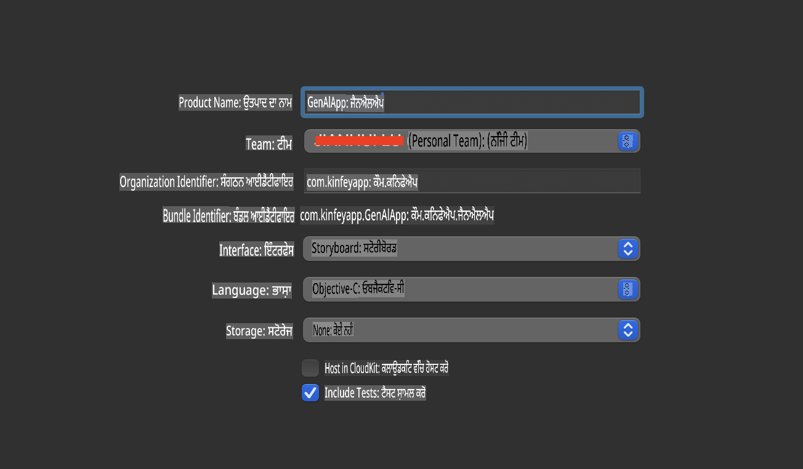
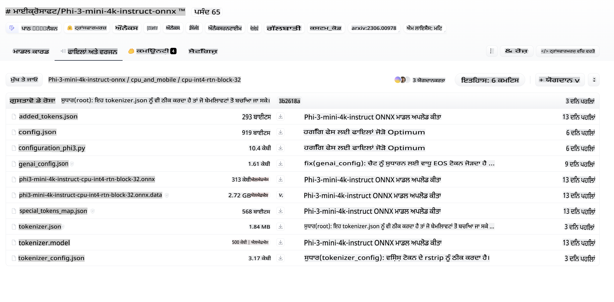
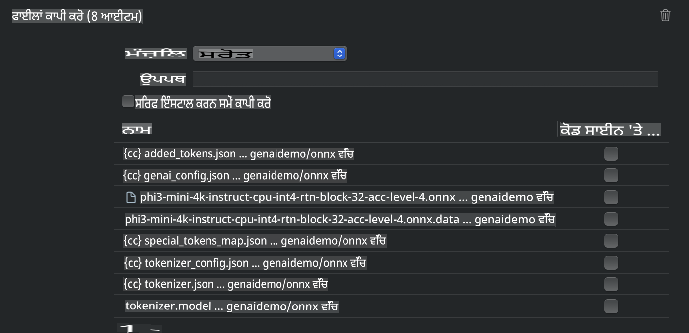
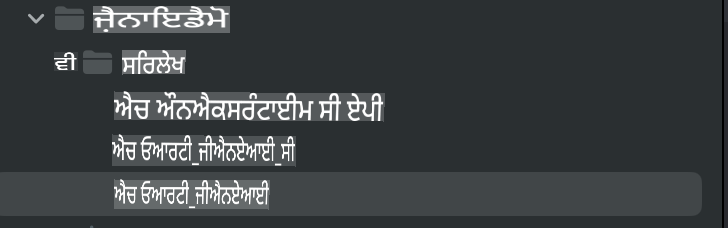
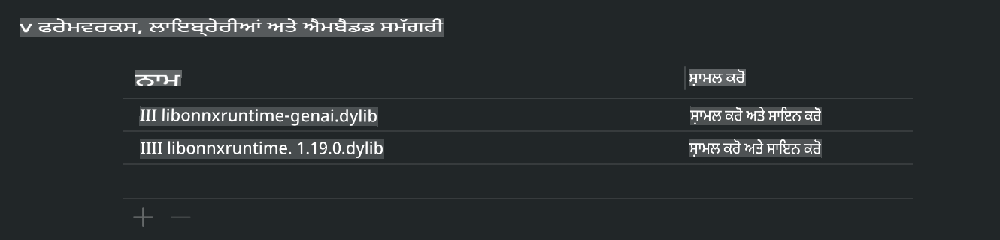
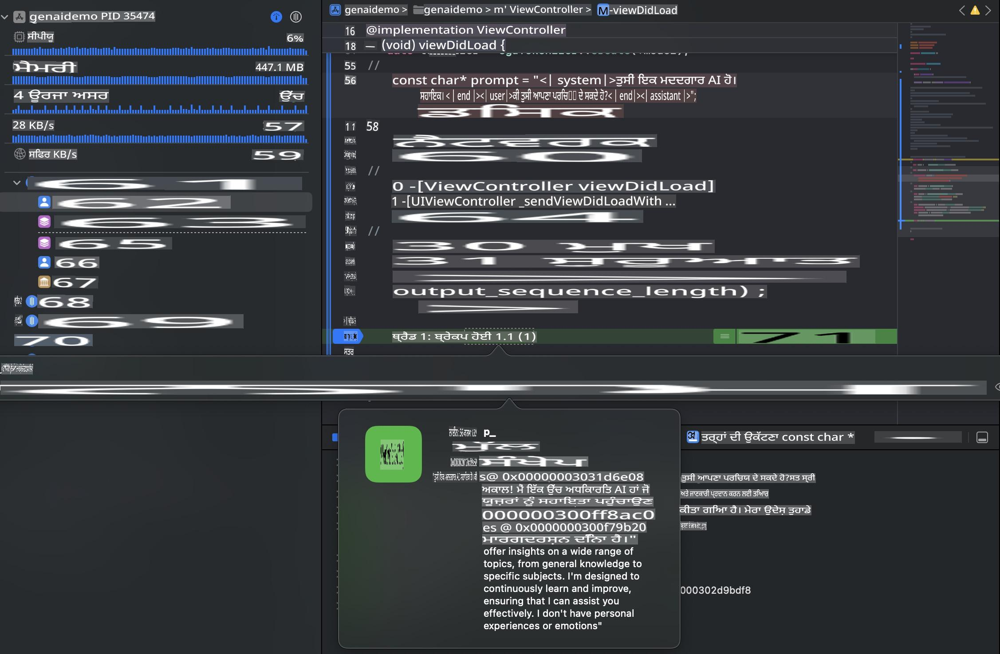

# **iOS ਵਿੱਚ Phi-3 ਦੀ ਅਨੁਮਾਨ ਲਗਾਉਣਾ**

Phi-3-mini ਮਾਈਕ੍ਰੋਸੌਫਟ ਦੇ ਨਵੇਂ ਮਾਡਲ ਸ੍ਰਿੰਖਲਾ ਵਿੱਚੋਂ ਇੱਕ ਹੈ, ਜੋ ਵੱਡੇ ਭਾਸ਼ਾ ਮਾਡਲ (LLMs) ਨੂੰ ਐਜ ਡਿਵਾਈਸ ਅਤੇ IoT ਡਿਵਾਈਸਾਂ 'ਤੇ ਡਿਪਲੋਇ ਕਰਨ ਦੀ ਸਮਰਥਾ ਦਿੰਦੀ ਹੈ। Phi-3-mini iOS, Android, ਅਤੇ Edge Device ਡਿਪਲੋਇਮੈਂਟ ਲਈ ਉਪਲਬਧ ਹੈ, ਜਿਸ ਨਾਲ BYOD ਮਾਹੌਲ ਵਿੱਚ ਜਨਰੇਟਿਵ AI ਨੂੰ ਡਿਪਲੋਇ ਕੀਤਾ ਜਾ ਸਕਦਾ ਹੈ। ਹੇਠਾਂ ਦਿੱਤਾ ਉਦਾਹਰਣ ਦਿਖਾਉਂਦਾ ਹੈ ਕਿ iOS 'ਤੇ Phi-3-mini ਨੂੰ ਕਿਵੇਂ ਡਿਪਲੋਇ ਕੀਤਾ ਜਾ ਸਕਦਾ ਹੈ।

## **1. ਤਿਆਰੀ**

- **a.** macOS 14+  
- **b.** Xcode 15+  
- **c.** iOS SDK 17.x (iPhone 14 A16 ਜਾਂ ਵੱਧ)  
- **d.** Python 3.10+ ਇੰਸਟਾਲ ਕਰੋ (Conda ਦੀ ਸਿਫਾਰਿਸ਼ ਕੀਤੀ ਜਾਂਦੀ ਹੈ)  
- **e.** Python ਲਾਇਬ੍ਰੇਰੀ ਇੰਸਟਾਲ ਕਰੋ: `python-flatbuffers`  
- **f.** CMake ਇੰਸਟਾਲ ਕਰੋ  

### ਸੈਮਾਂਟਿਕ Kernel ਅਤੇ ਅਨੁਮਾਨ

ਸੈਮਾਂਟਿਕ Kernel ਇੱਕ ਐਪਲੀਕੇਸ਼ਨ ਫਰੇਮਵਰਕ ਹੈ ਜੋ ਤੁਹਾਨੂੰ ਐਪਲੀਕੇਸ਼ਨ ਬਣਾਉਣ ਦੀ ਆਗਿਆ ਦਿੰਦਾ ਹੈ ਜੋ Azure OpenAI Service, OpenAI ਮਾਡਲਾਂ ਅਤੇ ਇਥੋਂ ਤੱਕ ਵੀ ਸਥਾਨਕ ਮਾਡਲਾਂ ਨਾਲ ਅਨੁਕੂਲ ਹੁੰਦੇ ਹਨ। ਸੈਮਾਂਟਿਕ Kernel ਰਾਹੀਂ ਸਥਾਨਕ ਸੇਵਾਵਾਂ ਤੱਕ ਪਹੁੰਚ ਤੁਹਾਡੇ ਸਵੈ-ਹੋਸਟ ਕੀਤੇ Phi-3-mini ਮਾਡਲ ਸਰਵਰ ਨਾਲ ਆਸਾਨੀ ਨਾਲ ਇਕੀਕਰਨ ਨੂੰ ਯਕੀਨੀ ਬਣਾਉਂਦੀ ਹੈ।

### Ollama ਜਾਂ LlamaEdge ਨਾਲ Quantized ਮਾਡਲਾਂ ਨੂੰ ਕਾਲ ਕਰਨਾ

ਕਈ ਯੂਜ਼ਰ ਸਥਾਨਕ ਤੌਰ 'ਤੇ ਮਾਡਲ ਚਲਾਉਣ ਲਈ Quantized ਮਾਡਲਾਂ ਦੀ ਵਰਤੋਂ ਕਰਨਾ ਪਸੰਦ ਕਰਦੇ ਹਨ। [Ollama](https://ollama.com) ਅਤੇ [LlamaEdge](https://llamaedge.com) ਯੂਜ਼ਰਾਂ ਨੂੰ ਵੱਖ-ਵੱਖ Quantized ਮਾਡਲਾਂ ਨੂੰ ਕਾਲ ਕਰਨ ਦੀ ਆਗਿਆ ਦਿੰਦੇ ਹਨ:

#### **Ollama**

ਤੁਸੀਂ `ollama run phi3` ਨੂੰ ਸਿੱਧਾ ਚਲਾ ਸਕਦੇ ਹੋ ਜਾਂ ਇਸਨੂੰ ਆਫਲਾਈਨ ਕਾਨਫਿਗਰ ਕਰ ਸਕਦੇ ਹੋ। ਆਪਣੇ `gguf` ਫਾਈਲ ਦੇ ਰਸਤੇ ਨਾਲ ਇੱਕ Modelfile ਬਣਾਓ। Phi-3-mini Quantized ਮਾਡਲ ਚਲਾਉਣ ਲਈ ਨਮੂਨਾ ਕੋਡ:

```gguf
FROM {Add your gguf file path}
TEMPLATE \"\"\"<|user|> .Prompt<|end|> <|assistant|>\"\"\"
PARAMETER stop <|end|>
PARAMETER num_ctx 4096
```

#### **LlamaEdge**

ਜੇਕਰ ਤੁਸੀਂ `gguf` ਨੂੰ ਕਲਾਊਡ ਅਤੇ ਐਜ ਡਿਵਾਈਸਾਂ ਦੋਵਾਂ 'ਤੇ ਇੱਕੋ ਸਮੇਂ ਵਰਤਣਾ ਚਾਹੁੰਦੇ ਹੋ, ਤਾਂ LlamaEdge ਇੱਕ ਵਧੀਆ ਵਿਕਲਪ ਹੈ।

## **2. iOS ਲਈ ONNX Runtime ਕਾਂਪਾਇਲ ਕਰਨਾ**

```bash

git clone https://github.com/microsoft/onnxruntime.git

cd onnxruntime

./build.sh --build_shared_lib --ios --skip_tests --parallel --build_dir ./build_ios --ios --apple_sysroot iphoneos --osx_arch arm64 --apple_deploy_target 17.5 --cmake_generator Xcode --config Release

cd ../

```

### **ਨੋਟਿਸ**

- **a.** ਕਾਂਪਾਇਲ ਕਰਨ ਤੋਂ ਪਹਿਲਾਂ, ਯਕੀਨੀ ਬਣਾਓ ਕਿ Xcode ਸਹੀ ਤਰੀਕੇ ਨਾਲ ਕਨਫਿਗਰ ਕੀਤਾ ਗਿਆ ਹੈ ਅਤੇ ਇਸਨੂੰ ਟਰਮੀਨਲ ਵਿੱਚ ਐਕਟਿਵ ਡਿਵੈਲਪਰ ਡਾਇਰੈਕਟਰੀ ਵਜੋਂ ਸੈਟ ਕਰੋ:

    ```bash
    sudo xcode-select -switch /Applications/Xcode.app/Contents/Developer
    ```

- **b.** ONNX Runtime ਨੂੰ ਵੱਖ-ਵੱਖ ਪਲੇਟਫਾਰਮਾਂ ਲਈ ਕਾਂਪਾਇਲ ਕਰਨ ਦੀ ਲੋੜ ਹੈ। iOS ਲਈ, ਤੁਸੀਂ `arm64` or `x86_64` ਲਈ ਕਾਂਪਾਇਲ ਕਰ ਸਕਦੇ ਹੋ।

- **c.** ਕਾਂਪਾਇਲ ਕਰਨ ਲਈ ਨਵੇਂ ਤੋਂ ਨਵੇਂ iOS SDK ਦੀ ਵਰਤੋਂ ਕਰਨ ਦੀ ਸਿਫਾਰਿਸ਼ ਕੀਤੀ ਜਾਂਦੀ ਹੈ। ਹਾਲਾਂਕਿ, ਜੇ ਤੁਹਾਨੂੰ ਪਿਛਲੇ SDKs ਨਾਲ ਅਨੁਕੂਲਤਾ ਦੀ ਲੋੜ ਹੈ ਤਾਂ ਤੁਸੀਂ ਪੁਰਾਣੇ ਵਰਜਨ ਦੀ ਵਰਤੋਂ ਵੀ ਕਰ ਸਕਦੇ ਹੋ।

## **3. iOS ਲਈ ONNX Runtime ਨਾਲ Generative AI ਕਾਂਪਾਇਲ ਕਰਨਾ**

> **ਨੋਟ:** ਕਿਉਂਕਿ ONNX Runtime ਨਾਲ Generative AI ਪ੍ਰੀਵਿਊ ਵਿੱਚ ਹੈ, ਕਿਰਪਾ ਕਰਕੇ ਸੰਭਾਵਿਤ ਬਦਲਾਵਾਂ ਤੋਂ ਸਚੇਤ ਰਹੋ।

```bash

git clone https://github.com/microsoft/onnxruntime-genai
 
cd onnxruntime-genai
 
mkdir ort
 
cd ort
 
mkdir include
 
mkdir lib
 
cd ../
 
cp ../onnxruntime/include/onnxruntime/core/session/onnxruntime_c_api.h ort/include
 
cp ../onnxruntime/build_ios/Release/Release-iphoneos/libonnxruntime*.dylib* ort/lib
 
export OPENCV_SKIP_XCODEBUILD_FORCE_TRYCOMPILE_DEBUG=1
 
python3 build.py --parallel --build_dir ./build_ios --ios --ios_sysroot iphoneos --ios_arch arm64 --ios_deployment_target 17.5 --cmake_generator Xcode --cmake_extra_defines CMAKE_XCODE_ATTRIBUTE_CODE_SIGNING_ALLOWED=NO

```

## **4. Xcode ਵਿੱਚ ਇੱਕ ਐਪ ਐਪਲੀਕੇਸ਼ਨ ਬਣਾਉਣਾ**

ਮੈਂ ਐਪ ਵਿਕਾਸ ਵਿਧੀ ਵਜੋਂ Objective-C ਨੂੰ ਚੁਣਿਆ, ਕਿਉਂਕਿ ONNX Runtime C++ API ਨਾਲ Generative AI ਦੀ ਵਰਤੋਂ ਕਰਦੇ ਹੋਏ, Objective-C ਬਿਹਤਰ ਅਨੁਕੂਲ ਹੈ। ਜ਼ਾਹਰ ਹੈ, ਤੁਸੀਂ Swift ਬ੍ਰਿਜਿੰਗ ਰਾਹੀਂ ਸੰਬੰਧਿਤ ਕਾਲਾਂ ਪੂਰੀਆਂ ਕਰ ਸਕਦੇ ਹੋ।



## **5. ONNX Quantized INT4 ਮਾਡਲ ਨੂੰ ਐਪ ਐਪਲੀਕੇਸ਼ਨ ਪ੍ਰੋਜੈਕਟ ਵਿੱਚ ਕਾਪੀ ਕਰਨਾ**

ਸਾਨੂੰ ONNX ਫਾਰਮੈਟ ਵਿੱਚ INT4 Quantization ਮਾਡਲ ਨੂੰ ਇੰਪੋਰਟ ਕਰਨ ਦੀ ਲੋੜ ਹੈ, ਜਿਸਨੂੰ ਪਹਿਲਾਂ ਡਾਊਨਲੋਡ ਕਰਨਾ ਪਵੇਗਾ।



ਡਾਊਨਲੋਡ ਕਰਨ ਤੋਂ ਬਾਅਦ, ਤੁਹਾਨੂੰ ਇਸਨੂੰ Xcode ਵਿੱਚ ਪ੍ਰੋਜੈਕਟ ਦੇ Resources ਡਾਇਰੈਕਟਰੀ ਵਿੱਚ ਸ਼ਾਮਲ ਕਰਨਾ ਪਵੇਗਾ।



## **6. ViewControllers ਵਿੱਚ C++ API ਸ਼ਾਮਲ ਕਰਨਾ**

> **ਨੋਟਿਸ:**

- **a.** ਪ੍ਰੋਜੈਕਟ ਵਿੱਚ ਸੰਬੰਧਿਤ C++ ਹੈਡਰ ਫਾਈਲਾਂ ਸ਼ਾਮਲ ਕਰੋ।

  

- **b.** `onnxruntime-genai` dynamic library in Xcode.

  

- **c.** Use the C Samples code for testing. You can also add additional features like ChatUI for more functionality.

- **d.** Since you need to use C++ in your project, rename `ViewController.m` to `ViewController.mm` ਨੂੰ ਸ਼ਾਮਲ ਕਰੋ ਤਾਂ ਜੋ Objective-C++ ਸਹਾਇਤਾ ਯਕੀਨੀ ਬਣਾਈ ਜਾ ਸਕੇ।

```objc

    NSString *llmPath = [[NSBundle mainBundle] resourcePath];
    char const *modelPath = llmPath.cString;

    auto model =  OgaModel::Create(modelPath);

    auto tokenizer = OgaTokenizer::Create(*model);

    const char* prompt = "<|system|>You are a helpful AI assistant.<|end|><|user|>Can you introduce yourself?<|end|><|assistant|>";

    auto sequences = OgaSequences::Create();
    tokenizer->Encode(prompt, *sequences);

    auto params = OgaGeneratorParams::Create(*model);
    params->SetSearchOption("max_length", 100);
    params->SetInputSequences(*sequences);

    auto output_sequences = model->Generate(*params);
    const auto output_sequence_length = output_sequences->SequenceCount(0);
    const auto* output_sequence_data = output_sequences->SequenceData(0);
    auto out_string = tokenizer->Decode(output_sequence_data, output_sequence_length);
    
    auto tmp = out_string;

```

## **7. ਐਪਲੀਕੇਸ਼ਨ ਚਲਾਉਣਾ**

ਜਦੋਂ ਸੈਟਅਪ ਪੂਰਾ ਹੋ ਜਾਵੇ, ਤਾਂ ਤੁਸੀਂ Phi-3-mini ਮਾਡਲ ਅਨੁਮਾਨ ਦੇ ਨਤੀਜੇ ਦੇਖਣ ਲਈ ਐਪਲੀਕੇਸ਼ਨ ਚਲਾ ਸਕਦੇ ਹੋ।



ਹੋਰ ਨਮੂਨਾ ਕੋਡ ਅਤੇ ਵਿਸਥਾਰ ਵਿੱਚ ਹਦਾਇਤਾਂ ਲਈ, [Phi-3 Mini Samples repository](https://github.com/Azure-Samples/Phi-3MiniSamples/tree/main/ios) 'ਤੇ ਜਾਓ।

**ਬਿਆਨ**:  
ਇਹ ਦਸਤਾਵੇਜ਼ ਮਸ਼ੀਨ-ਆਧਾਰਿਤ AI ਅਨੁਵਾਦ ਸੇਵਾਵਾਂ ਦੀ ਵਰਤੋਂ ਕਰਕੇ ਅਨੁਵਾਦਿਤ ਕੀਤਾ ਗਿਆ ਹੈ। ਜਦੋਂ ਕਿ ਅਸੀਂ ਸਹੀ ਹੋਣ ਲਈ ਕੋਸ਼ਿਸ਼ ਕਰਦੇ ਹਾਂ, ਕਿਰਪਾ ਕਰਕੇ ਧਿਆਨ ਰੱਖੋ ਕਿ ਸਵੈਚਾਲਿਤ ਅਨੁਵਾਦਾਂ ਵਿੱਚ ਗਲਤੀਆਂ ਜਾਂ ਅਸੁੱਤਰ ਹੋ ਸਕਦੇ ਹਨ। ਮੂਲ ਭਾਸ਼ਾ ਵਿੱਚ ਮੌਜੂਦ ਮੂਲ ਦਸਤਾਵੇਜ਼ ਨੂੰ ਅਧਿਕਾਰਤ ਸਰੋਤ ਮੰਨਿਆ ਜਾਣਾ ਚਾਹੀਦਾ ਹੈ। ਮਹੱਤਵਪੂਰਨ ਜਾਣਕਾਰੀ ਲਈ, ਪੇਸ਼ੇਵਰ ਮਨੁੱਖੀ ਅਨੁਵਾਦ ਦੀ ਸਿਫਾਰਿਸ਼ ਕੀਤੀ ਜਾਂਦੀ ਹੈ। ਇਸ ਅਨੁਵਾਦ ਦੀ ਵਰਤੋਂ ਤੋਂ ਪੈਦਾ ਹੋਣ ਵਾਲੇ ਕਿਸੇ ਵੀ ਗਲਤਫਹਿਮੀ ਜਾਂ ਗਲਤ ਵਿਆਖਿਆ ਲਈ ਅਸੀਂ ਜ਼ਿੰਮੇਵਾਰ ਨਹੀਂ ਹਾਂ।