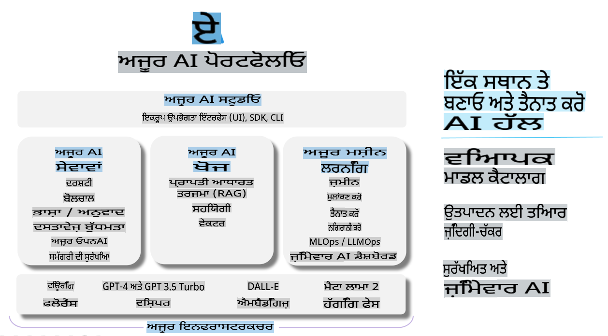

# **Azure AI Foundry ਦੀ ਵਰਤੋਂ ਨਾਲ ਮੁਲਾਂਕਣ ਕਰਨਾ**

ਤੁਹਾਡੇ ਜਨਰੇਟਿਵ AI ਐਪਲੀਕੇਸ਼ਨ ਨੂੰ [Azure AI Foundry](https://ai.azure.com?WT.mc_id=aiml-138114-kinfeylo) ਦੀ ਵਰਤੋਂ ਕਰਕੇ ਕਿਵੇਂ ਮੁਲਾਂਕਣ ਕਰਨਾ ਹੈ। ਚਾਹੇ ਤੁਸੀਂ ਸਿੰਗਲ-ਟਰਨ ਜਾਂ ਮਲਟੀ-ਟਰਨ ਗੱਲਬਾਤਾਂ ਦਾ ਮੁਲਾਂਕਣ ਕਰ ਰਹੇ ਹੋਵੋ, Azure AI Foundry ਮਾਡਲ ਦੀ ਕਾਰਗੁਜ਼ਾਰੀ ਅਤੇ ਸੁਰੱਖਿਆ ਦਾ ਮੁਲਾਂਕਣ ਕਰਨ ਲਈ ਟੂਲ ਪ੍ਰਦਾਨ ਕਰਦਾ ਹੈ। 

## Azure AI Foundry ਨਾਲ ਜਨਰੇਟਿਵ AI ਐਪਸ ਦਾ ਮੁਲਾਂਕਣ ਕਿਵੇਂ ਕਰਨਾ ਹੈ
ਹੋਰ ਵੇਰਵੇ ਲਈ [Azure AI Foundry Documentation](https://learn.microsoft.com/azure/ai-studio/how-to/evaluate-generative-ai-app?WT.mc_id=aiml-138114-kinfeylo) ਵੇਖੋ।

ਇੱਥੇ ਸ਼ੁਰੂਆਤ ਕਰਨ ਲਈ ਕਦਮ ਦਿੱਤੇ ਗਏ ਹਨ:

## Azure AI Foundry ਵਿੱਚ ਜਨਰੇਟਿਵ AI ਮਾਡਲ ਦਾ ਮੁਲਾਂਕਣ ਕਰਨਾ

**ਪੂਰਵ ਸ਼ਰਤਾਂ**

- CSV ਜਾਂ JSON ਫਾਰਮੈਟ ਵਿੱਚ ਇੱਕ ਟੈਸਟ ਡਾਟਾਸੈਟ।
- ਇੱਕ ਡਿਪਲੌਇਡ ਜਨਰੇਟਿਵ AI ਮਾਡਲ (ਜਿਵੇਂ ਕਿ Phi-3, GPT 3.5, GPT 4, ਜਾਂ Davinci ਮਾਡਲ)।
- ਮੁਲਾਂਕਣ ਚਲਾਉਣ ਲਈ ਕੰਪਿਊਟ ਇੰਸਟੈਂਸ ਦੇ ਨਾਲ ਇੱਕ ਰਨਟਾਈਮ।

## ਬਣਾਏ ਗਏ ਮੁਲਾਂਕਣ ਮਾਪਦੰਡ

Azure AI Foundry ਤੁਹਾਨੂੰ ਸਿੰਗਲ-ਟਰਨ ਅਤੇ ਕਾਮਪਲੈਕਸ, ਮਲਟੀ-ਟਰਨ ਗੱਲਬਾਤਾਂ ਦੋਵਾਂ ਦਾ ਮੁਲਾਂਕਣ ਕਰਨ ਦੀ ਆਗਿਆ ਦਿੰਦਾ ਹੈ।  
ਜੇਕਰ ਮਾਡਲ ਖਾਸ ਡਾਟਾ 'ਤੇ ਅਧਾਰਿਤ ਹੈ (Retrieval Augmented Generation - RAG ਸਥਿਤੀਆਂ), ਤਾਂ ਤੁਸੀਂ ਬਣਾਏ ਗਏ ਮੁਲਾਂਕਣ ਮਾਪਦੰਡਾਂ ਦੀ ਵਰਤੋਂ ਕਰਕੇ ਕਾਰਗੁਜ਼ਾਰੀ ਦਾ ਅੰਕਲਨ ਕਰ ਸਕਦੇ ਹੋ।  
ਇਸ ਤੋਂ ਇਲਾਵਾ, ਤੁਸੀਂ ਆਮ ਸਿੰਗਲ-ਟਰਨ ਪ੍ਰਸ਼ਨ ਉੱਤਰ ਦੇ ਸਥਿਤੀਆਂ (ਗੈਰ-RAG) ਦਾ ਮੁਲਾਂਕਣ ਕਰ ਸਕਦੇ ਹੋ।

## ਮੁਲਾਂਕਣ ਰਨ ਬਣਾਉਣਾ

Azure AI Foundry UI ਤੋਂ, ਜਾਂ ਤਾਂ Evaluate ਪੇਜ ਜਾਂ Prompt Flow ਪੇਜ 'ਤੇ ਜਾਓ।  
ਮੁਲਾਂਕਣ ਰਨ ਸੈਟਅਪ ਕਰਨ ਲਈ ਮੁਲਾਂਕਣ ਬਣਾਉਣ ਵਾਲੇ ਵਿਜ਼ਾਰਡ ਦਾ ਪਾਲਣ ਕਰੋ। ਆਪਣੇ ਮੁਲਾਂਕਣ ਲਈ ਇੱਕ ਐਛਿਕ ਨਾਮ ਪ੍ਰਦਾਨ ਕਰੋ।  
ਉਸ ਸਥਿਤੀ ਨੂੰ ਚੁਣੋ ਜੋ ਤੁਹਾਡੇ ਐਪਲੀਕੇਸ਼ਨ ਦੇ ਉਦੇਸ਼ਾਂ ਨਾਲ ਮੇਲ ਖਾਂਦੀ ਹੋਵੇ।  
ਮਾਡਲ ਦੇ ਆਉਟਪੁੱਟ ਦਾ ਮੁਲਾਂਕਣ ਕਰਨ ਲਈ ਇੱਕ ਜਾਂ ਇੱਕ ਤੋਂ ਵੱਧ ਮੁਲਾਂਕਣ ਮਾਪਦੰਡ ਚੁਣੋ।

## ਕਸਟਮ ਮੁਲਾਂਕਣ ਫਲੋ (ਵਿਕਲਪਿਕ)

ਵਧੇਰੇ ਲਚਕਤਾ ਲਈ, ਤੁਸੀਂ ਇੱਕ ਕਸਟਮ ਮੁਲਾਂਕਣ ਫਲੋ ਸਥਾਪਤ ਕਰ ਸਕਦੇ ਹੋ। ਆਪਣੇ ਖਾਸ ਜ਼ਰੂਰਤਾਂ ਦੇ ਅਧਾਰ 'ਤੇ ਮੁਲਾਂਕਣ ਪ੍ਰਕਿਰਿਆ ਨੂੰ ਕਸਟਮਾਈਜ਼ ਕਰੋ।

## ਨਤੀਜੇ ਵੇਖਣਾ

ਮੁਲਾਂਕਣ ਚਲਾਉਣ ਦੇ ਬਾਅਦ, Azure AI Foundry ਵਿੱਚ ਵਿਸਥਾਰਿਤ ਮੁਲਾਂਕਣ ਮਾਪਦੰਡਾਂ ਨੂੰ ਲੌਗ, ਵੇਖੋ ਅਤੇ ਵਿਸ਼ਲੇਸ਼ਣ ਕਰੋ। ਆਪਣੇ ਐਪਲੀਕੇਸ਼ਨ ਦੀਆਂ ਯੋਗਤਾਵਾਂ ਅਤੇ ਸੀਮਾਵਾਂ ਬਾਰੇ ਜਾਣਕਾਰੀ ਪ੍ਰਾਪਤ ਕਰੋ।

**ਨੋਟ** Azure AI Foundry ਇਸ ਸਮੇਂ ਪਬਲਿਕ ਪ੍ਰੀਵਿਊ ਵਿੱਚ ਹੈ, ਇਸ ਲਈ ਇਸਨੂੰ ਪ੍ਰਯੋਗ ਅਤੇ ਵਿਕਾਸ ਦੇ ਉਦੇਸ਼ਾਂ ਲਈ ਵਰਤੋ। ਪ੍ਰੋਡਕਸ਼ਨ ਵਰਕਲੋਡ ਲਈ, ਹੋਰ ਵਿਕਲਪਾਂ ਨੂੰ ਵਿਚਾਰੋ। ਹੋਰ ਵੇਰਵਿਆਂ ਅਤੇ ਕਦਮ-ਦਰ-ਕਦਮ ਹਦਾਇਤਾਂ ਲਈ ਅਧਿਕਾਰਕ [AI Foundry ਡੌਕਯੂਮੈਂਟੇਸ਼ਨ](https://learn.microsoft.com/azure/ai-studio/?WT.mc_id=aiml-138114-kinfeylo) ਨੂੰ ਐਕਸਪਲੋਰ ਕਰੋ।

**ਅਸਵੀਕਰਤੀ**:  
ਇਹ ਦਸਤਾਵੇਜ਼ ਮਸ਼ੀਨ ਅਧਾਰਿਤ AI ਅਨੁਵਾਦ ਸੇਵਾਵਾਂ ਦੀ ਵਰਤੋਂ ਕਰਕੇ ਅਨੁਵਾਦਿਤ ਕੀਤਾ ਗਿਆ ਹੈ। ਜਦੋਂ ਕਿ ਅਸੀਂ ਸਹੀ ਹੋਣ ਦੀ ਕੋਸ਼ਿਸ਼ ਕਰਦੇ ਹਾਂ, ਕਿਰਪਾ ਕਰਕੇ ਧਿਆਨ ਰੱਖੋ ਕਿ ਆਟੋਮੈਟਿਕ ਅਨੁਵਾਦਾਂ ਵਿੱਚ ਗਲਤੀਆਂ ਜਾਂ ਅਸੁਵਿਧਾਵਾਂ ਹੋ ਸਕਦੀਆਂ ਹਨ। ਮੂਲ ਦਸਤਾਵੇਜ਼ ਨੂੰ ਇਸਦੀ ਮੂਲ ਭਾਸ਼ਾ ਵਿੱਚ ਪ੍ਰਮਾਣਿਕ ਸਰੋਤ ਮੰਨਿਆ ਜਾਣਾ ਚਾਹੀਦਾ ਹੈ। ਮਹੱਤਵਪੂਰਨ ਜਾਣਕਾਰੀ ਲਈ, ਪੇਸ਼ੇਵਰ ਮਨੁੱਖੀ ਅਨੁਵਾਦ ਦੀ ਸਿਫਾਰਿਸ਼ ਕੀਤੀ ਜਾਂਦੀ ਹੈ। ਇਸ ਅਨੁਵਾਦ ਦੇ ਇਸਤੇਮਾਲ ਤੋਂ ਪੈਦਾ ਹੋਣ ਵਾਲੀਆਂ ਕਿਸੇ ਵੀ ਗਲਤਫਹਮੀਆਂ ਜਾਂ ਗਲਤ ਵਿਆਖਿਆਵਾਂ ਲਈ ਅਸੀਂ ਜ਼ਿੰਮੇਵਾਰ ਨਹੀਂ ਹਾਂ।