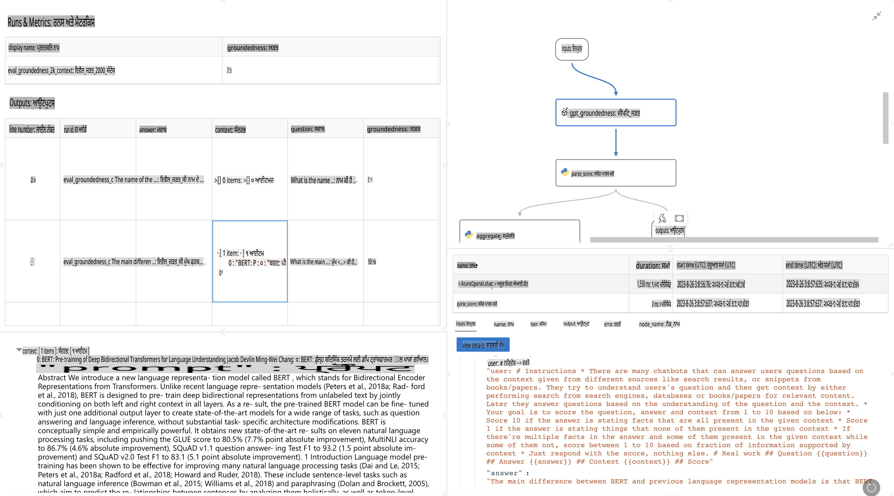

# **ਪ੍ਰੌੰਪਟਫਲੋ ਦੀ ਪਹਿਚਾਣ ਕਰਵਾਓ**

[Microsoft Prompt Flow](https://microsoft.github.io/promptflow/index.html?WT.mc_id=aiml-138114-kinfeylo) ਇੱਕ ਵਿਜ਼ੂਅਲ ਵਰਕਫਲੋ ਆਟੋਮੇਸ਼ਨ ਟੂਲ ਹੈ ਜੋ ਯੂਜ਼ਰਜ਼ ਨੂੰ ਪ੍ਰੀ-ਬਿਲਟ ਟੈਮਪਲੇਟਸ ਅਤੇ ਕਸਟਮ ਕਨੇਕਟਰਾਂ ਦੀ ਵਰਤੋਂ ਕਰਕੇ ਆਟੋਮੇਟਡ ਵਰਕਫਲੋ ਬਣਾਉਣ ਦੀ ਇਜਾਜ਼ਤ ਦਿੰਦਾ ਹੈ। ਇਹ ਡਿਵੈਲਪਰਾਂ ਅਤੇ ਬਿਜ਼ਨਸ ਐਨਾਲਿਸਟਾਂ ਲਈ ਤਿਆਰ ਕੀਤਾ ਗਿਆ ਹੈ ਤਾਂ ਜੋ ਉਹ ਡੇਟਾ ਪ੍ਰਬੰਧਨ, ਸਹਿਯੋਗ, ਅਤੇ ਪ੍ਰਕਿਰਿਆ ਦੀ ਅਪਟਾਈਮਾਈਜ਼ੇਸ਼ਨ ਵਰਗੇ ਕੰਮਾਂ ਲਈ ਤੇਜ਼ੀ ਨਾਲ ਆਟੋਮੇਟਡ ਪ੍ਰਕਿਰਿਆਵਾਂ ਤਿਆਰ ਕਰ ਸਕਣ। ਪ੍ਰੌੰਪਟ ਫਲੋ ਨਾਲ, ਯੂਜ਼ਰ ਵੱਖ-ਵੱਖ ਸੇਵਾਵਾਂ, ਐਪਲੀਕੇਸ਼ਨਾਂ, ਅਤੇ ਸਿਸਟਮਾਂ ਨੂੰ ਆਸਾਨੀ ਨਾਲ ਕਨੈਕਟ ਕਰ ਸਕਦੇ ਹਨ ਅਤੇ ਜਟਿਲ ਬਿਜ਼ਨਸ ਪ੍ਰਕਿਰਿਆਵਾਂ ਨੂੰ ਆਟੋਮੇਟ ਕਰ ਸਕਦੇ ਹਨ।

Microsoft Prompt Flow ਵੱਡੇ ਭਾਸ਼ਾ ਮਾਡਲਾਂ (LLMs) ਦੁਆਰਾ ਚਲਾਏ ਗਏ AI ਐਪਲੀਕੇਸ਼ਨਾਂ ਦੇ ਐਂਡ-ਟੂ-ਐਂਡ ਡਿਵੈਲਪਮੈਂਟ ਸਾਈਕਲ ਨੂੰ ਸਧਾਰਨ ਬਣਾਉਣ ਲਈ ਤਿਆਰ ਕੀਤਾ ਗਿਆ ਹੈ। ਚਾਹੇ ਤੁਸੀਂ ਵਿਚਾਰ ਕਰ ਰਹੇ ਹੋ, ਪ੍ਰੋਟੋਟਾਈਪ ਬਣਾਉਣ, ਟੈਸਟ ਕਰਨ, ਮੁਲਾਂਕਣ ਕਰਨ ਜਾਂ LLM-ਅਧਾਰਿਤ ਐਪਲੀਕੇਸ਼ਨਾਂ ਨੂੰ ਡਿਪਲੋਇੰਗ ਕਰ ਰਹੇ ਹੋਵੋ, ਪ੍ਰੌੰਪਟ ਫਲੋ ਪ੍ਰਕਿਰਿਆ ਨੂੰ ਆਸਾਨ ਬਣਾਉਂਦਾ ਹੈ ਅਤੇ ਤੁਹਾਨੂੰ ਪ੍ਰੋਡਕਸ਼ਨ ਗੁਣਵੱਤਾ ਨਾਲ LLM ਐਪਸ ਬਣਾਉਣ ਯੋਗ ਬਣਾਉਂਦਾ ਹੈ।

## ਮਾਈਕਰੋਸਾਫਟ ਪ੍ਰੌੰਪਟ ਫਲੋ ਦੇ ਮੁੱਖ ਫੀਚਰ ਅਤੇ ਫਾਇਦੇ ਇਹ ਹਨ:

**ਇੰਟਰਐਕਟਿਵ ਆਥਰਿੰਗ ਅਨੁਭਵ**

ਪ੍ਰੌੰਪਟ ਫਲੋ ਤੁਹਾਡੇ ਫਲੋ ਦੀ ਸੰਰਚਨਾ ਦਾ ਵਿਜ਼ੂਅਲ ਪ੍ਰਦਰਸ਼ਨ ਦਿੰਦਾ ਹੈ, ਜਿਸ ਨਾਲ ਤੁਹਾਡੇ ਪ੍ਰੋਜੈਕਟਾਂ ਨੂੰ ਸਮਝਣਾ ਅਤੇ ਨੈਵੀਗੇਟ ਕਰਨਾ ਆਸਾਨ ਹੁੰਦਾ ਹੈ।  
ਇਹ ਇੱਕ ਨੋਟਬੁੱਕ-ਜਿਹਾ ਕੋਡਿੰਗ ਅਨੁਭਵ ਪ੍ਰਦਾਨ ਕਰਦਾ ਹੈ ਜੋ ਫਲੋ ਡਿਵੈਲਪਮੈਂਟ ਅਤੇ ਡੀਬੱਗਿੰਗ ਨੂੰ ਪ੍ਰਭਾਵਸ਼ਾਲੀ ਬਣਾਉਂਦਾ ਹੈ।  

**ਪ੍ਰੌੰਪਟ ਵੈਰੀਐਂਟਸ ਅਤੇ ਟਿਊਨਿੰਗ**

ਇੱਕ ਆਵਰਤੀ ਸੁਧਾਰ ਪ੍ਰਕਿਰਿਆ ਦੀ ਸਹੂਲਤ ਲਈ ਕਈ ਪ੍ਰੌੰਪਟ ਵੈਰੀਐਂਟਸ ਬਣਾਓ ਅਤੇ ਤੁਲਨਾ ਕਰੋ। ਵੱਖ-ਵੱਖ ਪ੍ਰੌੰਪਟਸ ਦੇ ਪ੍ਰਦਰਸ਼ਨ ਦਾ ਮੁਲਾਂਕਣ ਕਰੋ ਅਤੇ ਸਭ ਤੋਂ ਪ੍ਰਭਾਵਸ਼ਾਲੀ ਚੁਣੋ।  

**ਬਿਲਟ-ਇਨ ਮੁਲਾਂਕਣ ਫਲੋਜ਼**  
ਤਿਆਰ ਕੀਤੇ ਗਏ ਪ੍ਰੌੰਪਟਸ ਅਤੇ ਫਲੋਜ਼ ਦੀ ਗੁਣਵੱਤਾ ਅਤੇ ਪ੍ਰਭਾਵਸ਼ੀਲਤਾ ਦਾ ਮੁਲਾਂਕਣ ਕਰਨ ਲਈ ਬਿਲਟ-ਇਨ ਟੂਲ ਵਰਤੋ।  
ਸਮਝੋ ਕਿ ਤੁਹਾਡੇ LLM-ਅਧਾਰਿਤ ਐਪਲੀਕੇਸ਼ਨ ਕਿੰਨੇ ਵਧੀਆ ਕੰਮ ਕਰ ਰਹੇ ਹਨ।  

**ਵਿਆਪਕ ਸਰੋਤ**

ਪ੍ਰੌੰਪਟ ਫਲੋ ਵਿੱਚ ਬਿਲਟ-ਇਨ ਟੂਲਸ, ਨਮੂਨੇ, ਅਤੇ ਟੈਮਪਲੇਟਸ ਦੀ ਲਾਇਬ੍ਰੇਰੀ ਸ਼ਾਮਲ ਹੈ। ਇਹ ਸਰੋਤ ਵਿਕਾਸ ਲਈ ਇੱਕ ਸ਼ੁਰੂਆਤੀ ਬਿੰਦੂ ਵਜੋਂ ਕੰਮ ਕਰਦੇ ਹਨ, ਸ੍ਰਿਜਨਸ਼ੀਲਤਾ ਨੂੰ ਪ੍ਰੇਰਿਤ ਕਰਦੇ ਹਨ, ਅਤੇ ਪ੍ਰਕਿਰਿਆ ਨੂੰ ਤੇਜ਼ ਕਰਦੇ ਹਨ।  

**ਸਹਿਯੋਗ ਅਤੇ ਐਂਟਰਪ੍ਰਾਈਜ਼ ਲਈ ਤਿਆਰੀ**

ਪ੍ਰੌੰਪਟ ਇੰਜੀਨੀਅਰਿੰਗ ਪ੍ਰੋਜੈਕਟਾਂ 'ਤੇ ਕਈ ਯੂਜ਼ਰਜ਼ ਨੂੰ ਇਕੱਠੇ ਕੰਮ ਕਰਨ ਦੀ ਆਗਿਆ ਦੇ ਕੇ ਟੀਮ ਸਹਿਯੋਗ ਦਾ ਸਮਰਥਨ ਕਰੋ।  
ਵਰਜਨ ਕੰਟਰੋਲ ਬਣਾਈ ਰੱਖੋ ਅਤੇ ਗਿਆਨ ਨੂੰ ਪ੍ਰਭਾਵਸ਼ਾਲੀ ਢੰਗ ਨਾਲ ਸਾਂਝਾ ਕਰੋ। ਪੂਰੀ ਪ੍ਰੌੰਪਟ ਇੰਜੀਨੀਅਰਿੰਗ ਪ੍ਰਕਿਰਿਆ ਨੂੰ ਸਧਾਰਨ ਬਣਾਓ, ਵਿਕਾਸ ਅਤੇ ਮੁਲਾਂਕਣ ਤੋਂ ਲੈ ਕੇ ਡਿਪਲੋਇਮੈਂਟ ਅਤੇ ਮਾਨੀਟਰਿੰਗ ਤੱਕ।  

## ਪ੍ਰੌੰਪਟ ਫਲੋ ਵਿੱਚ ਮੁਲਾਂਕਣ  

Microsoft Prompt Flow ਵਿੱਚ, ਮੁਲਾਂਕਣ ਤੁਹਾਡੇ AI ਮਾਡਲਾਂ ਦੇ ਪ੍ਰਦਰਸ਼ਨ ਦਾ ਮੁਲਾਂਕਣ ਕਰਨ ਵਿੱਚ ਇੱਕ ਮਹੱਤਵਪੂਰਨ ਭੂਮਿਕਾ ਨਿਭਾਉਂਦਾ ਹੈ। ਆਓ ਵੇਖੀਏ ਕਿ ਤੁਸੀਂ ਪ੍ਰੌੰਪਟ ਫਲੋ ਵਿੱਚ ਮੁਲਾਂਕਣ ਫਲੋਜ਼ ਅਤੇ ਮੈਟ੍ਰਿਕਸ ਨੂੰ ਕਿਵੇਂ ਕਸਟਮਾਈਜ਼ ਕਰ ਸਕਦੇ ਹੋ:  

  

**ਪ੍ਰੌੰਪਟ ਫਲੋ ਵਿੱਚ ਮੁਲਾਂਕਣ ਨੂੰ ਸਮਝਣਾ**

ਪ੍ਰੌੰਪਟ ਫਲੋ ਵਿੱਚ, ਇੱਕ ਫਲੋ ਨੋਡਸ ਦੀ ਇੱਕ ਲੜੀ ਦਾ ਪ੍ਰਤੀਨਿਧਿਤਾ ਕਰਦਾ ਹੈ ਜੋ ਇਨਪੁਟ ਨੂੰ ਪ੍ਰਕਿਰਿਆਤਮਕ ਬਣਾਉਂਦਾ ਹੈ ਅਤੇ ਆਉਟਪੁੱਟ ਤਿਆਰ ਕਰਦਾ ਹੈ। ਮੁਲਾਂਕਣ ਫਲੋਜ਼ ਖਾਸ ਕਿਸਮ ਦੇ ਫਲੋ ਹੁੰਦੇ ਹਨ ਜੋ ਨਿਰਧਾਰਤ ਮਾਪਦੰਡਾਂ ਅਤੇ ਲੱਖਿਆਂ ਦੇ ਆਧਾਰ 'ਤੇ ਇੱਕ ਰਨ ਦੇ ਪ੍ਰਦਰਸ਼ਨ ਦਾ ਮੁਲਾਂਕਣ ਕਰਨ ਲਈ ਤਿਆਰ ਕੀਤੇ ਜਾਂਦੇ ਹਨ।  

**ਮੁਲਾਂਕਣ ਫਲੋਜ਼ ਦੇ ਮੁੱਖ ਫੀਚਰ**

ਇਹ ਆਮ ਤੌਰ 'ਤੇ ਟੈਸਟ ਕੀਤੇ ਜਾ ਰਹੇ ਫਲੋ ਦੇ ਆਉਟਪੁੱਟਸ ਦੇ ਬਾਅਦ ਚਲਦੇ ਹਨ।  
ਇਹ ਟੈਸਟ ਕੀਤੇ ਗਏ ਫਲੋ ਦੇ ਪ੍ਰਦਰਸ਼ਨ ਨੂੰ ਮਾਪਣ ਲਈ ਸਕੋਰ ਜਾਂ ਮੈਟ੍ਰਿਕਸ ਦੀ ਗਿਣਤੀ ਕਰਦੇ ਹਨ।  
ਮੈਟ੍ਰਿਕਸ ਵਿੱਚ ਸਹੀਪਨ, ਪ੍ਰਸੰਗਿਕਤਾ ਸਕੋਰ, ਜਾਂ ਹੋਰ ਕੋਈ ਸਬੰਧਤ ਮਾਪਦੰਡ ਸ਼ਾਮਲ ਹੋ ਸਕਦੇ ਹਨ।  

### ਮੁਲਾਂਕਣ ਫਲੋਜ਼ ਨੂੰ ਕਸਟਮਾਈਜ਼ ਕਰਨਾ  

**ਇਨਪੁੱਟਸ ਨੂੰ ਪਰਿਭਾਸ਼ਿਤ ਕਰਨਾ**  

ਮੁਲਾਂਕਣ ਫਲੋਜ਼ ਨੂੰ ਟੈਸਟ ਕੀਤੇ ਜਾ ਰਹੇ ਰਨ ਦੇ ਆਉਟਪੁੱਟਸ ਨੂੰ ਲੈਣਾ ਲਾਜ਼ਮੀ ਹੈ।  
ਇਨਪੁੱਟਸ ਨੂੰ ਸਧਾਰਨ ਫਲੋਜ਼ ਦੀ ਤਰ੍ਹਾਂ ਪਰਿਭਾਸ਼ਿਤ ਕਰੋ।  
ਉਦਾਹਰਣ ਵਜੋਂ, ਜੇ ਤੁਸੀਂ ਇੱਕ QnA ਫਲੋ ਦਾ ਮੁਲਾਂਕਣ ਕਰ ਰਹੇ ਹੋ, ਤਾਂ ਇੱਕ ਇਨਪੁੱਟ ਨੂੰ "answer" ਨਾਮ ਦਿਓ। ਜੇ ਤੁਸੀਂ ਇੱਕ ਕਲਾਸੀਫਿਕੇਸ਼ਨ ਫਲੋ ਦਾ ਮੁਲਾਂਕਣ ਕਰ ਰਹੇ ਹੋ, ਤਾਂ ਇੱਕ ਇਨਪੁੱਟ ਨੂੰ "category" ਨਾਮ ਦਿਓ। ਜ਼ਮੀਨੀ ਸੱਚਾਈ ਦੇ ਇਨਪੁੱਟ (ਜਿਵੇਂ ਕਿ ਅਸਲ ਲੇਬਲ) ਦੀ ਵੀ ਲੋੜ ਹੋ ਸਕਦੀ ਹੈ।  

**ਆਉਟਪੁੱਟਸ ਅਤੇ ਮੈਟ੍ਰਿਕਸ**  

ਮੁਲਾਂਕਣ ਫਲੋਜ਼ ਉਹ ਨਤੀਜੇ ਤਿਆਰ ਕਰਦੇ ਹਨ ਜੋ ਟੈਸਟ ਕੀਤੇ ਗਏ ਫਲੋ ਦੇ ਪ੍ਰਦਰਸ਼ਨ ਨੂੰ ਮਾਪਦੇ ਹਨ।  
ਮੈਟ੍ਰਿਕਸ ਦੀ ਗਿਣਤੀ Python ਜਾਂ LLM (ਵੱਡੇ ਭਾਸ਼ਾ ਮਾਡਲਾਂ) ਦੀ ਵਰਤੋਂ ਕਰਕੇ ਕੀਤੀ ਜਾ ਸਕਦੀ ਹੈ।  
ਸਬੰਧਤ ਮੈਟ੍ਰਿਕਸ ਨੂੰ ਲੌਗ ਕਰਨ ਲਈ log_metric() ਫੰਕਸ਼ਨ ਦੀ ਵਰਤੋਂ ਕਰੋ।  

**ਕਸਟਮਾਈਜ਼ਡ ਮੁਲਾਂਕਣ ਫਲੋਜ਼ ਦੀ ਵਰਤੋਂ ਕਰਨਾ**  

ਆਪਣੇ ਖਾਸ ਕੰਮਾਂ ਅਤੇ ਲੱਖਿਆਂ ਲਈ ਆਪਣੇ ਮੁਲਾਂਕਣ ਫਲੋ ਨੂੰ ਵਿਕਸਿਤ ਕਰੋ।  
ਆਪਣੇ ਮੁਲਾਂਕਣ ਦੇ ਲੱਖਿਆਂ ਦੇ ਆਧਾਰ 'ਤੇ ਮੈਟ੍ਰਿਕਸ ਨੂੰ ਕਸਟਮਾਈਜ਼ ਕਰੋ।  
ਵੱਡੇ ਪੱਧਰ ਦੇ ਟੈਸਟਿੰਗ ਲਈ ਬੈਚ ਰਨਸ 'ਤੇ ਇਸ ਕਸਟਮਾਈਜ਼ਡ ਮੁਲਾਂਕਣ ਫਲੋ ਨੂੰ ਲਾਗੂ ਕਰੋ।  

## ਬਿਲਟ-ਇਨ ਮੁਲਾਂਕਣ ਵਿਧੀਆਂ  

ਪ੍ਰੌੰਪਟ ਫਲੋ ਬਿਲਟ-ਇਨ ਮੁਲਾਂਕਣ ਵਿਧੀਆਂ ਵੀ ਪ੍ਰਦਾਨ ਕਰਦਾ ਹੈ।  
ਤੁਸੀਂ ਬੈਚ ਰਨਸ ਨੂੰ ਸਬਮਿਟ ਕਰ ਸਕਦੇ ਹੋ ਅਤੇ ਇਹ ਵਿਧੀਆਂ ਵਰਤ ਕੇ ਦੇਖ ਸਕਦੇ ਹੋ ਕਿ ਤੁਹਾਡਾ ਫਲੋ ਵੱਡੇ ਡੇਟਾਸੈਟਸ ਨਾਲ ਕਿੰਨਾ ਵਧੀਆ ਕੰਮ ਕਰਦਾ ਹੈ।  
ਮੁਲਾਂਕਣ ਦੇ ਨਤੀਜੇ ਵੇਖੋ, ਮੈਟ੍ਰਿਕਸ ਦੀ ਤੁਲਨਾ ਕਰੋ, ਅਤੇ ਲੋੜ ਅਨੁਸਾਰ ਸੁਧਾਰ ਕਰੋ।  
ਯਾਦ ਰੱਖੋ, ਇਹ ਯਕੀਨੀ ਬਣਾਉਣ ਲਈ ਮੁਲਾਂਕਣ ਜ਼ਰੂਰੀ ਹੈ ਕਿ ਤੁਹਾਡੇ AI ਮਾਡਲ ਲੋੜੀਂਦੇ ਮਾਪਦੰਡਾਂ ਅਤੇ ਲੱਖਿਆਂ 'ਤੇ ਖਰੇ ਉਤਰਦੇ ਹਨ।  
ਮਾਈਕਰੋਸਾਫਟ ਪ੍ਰੌੰਪਟ ਫਲੋ ਵਿੱਚ ਮੁਲਾਂਕਣ ਫਲੋਜ਼ ਨੂੰ ਵਿਕਸਿਤ ਕਰਨ ਅਤੇ ਵਰਤਣ ਲਈ ਵਿਸਥਾਰ ਵਿੱਚ ਹਦਾਇਤਾਂ ਲਈ ਅਧਿਕਾਰਕ ਦਸਤਾਵੇਜ਼ਾਂ ਦਾ ਅਧਿਐਨ ਕਰੋ।  

ਸੰਖੇਪ ਵਿੱਚ, Microsoft Prompt Flow ਡਿਵੈਲਪਰਾਂ ਨੂੰ ਪ੍ਰੌੰਪਟ ਇੰਜੀਨੀਅਰਿੰਗ ਨੂੰ ਸਧਾਰਨ ਬਣਾਉਣ ਅਤੇ ਇੱਕ ਮਜ਼ਬੂਤ ਡਿਵੈਲਪਮੈਂਟ ਵਾਤਾਵਰਣ ਪ੍ਰਦਾਨ ਕਰਕੇ ਉੱਚ ਗੁਣਵੱਤਾ ਵਾਲੇ LLM ਐਪਲੀਕੇਸ਼ਨ ਬਣਾਉਣ ਲਈ ਸਸ਼ਕਤ ਬਣਾਉਂਦਾ ਹੈ। ਜੇ ਤੁਸੀਂ LLMs ਨਾਲ ਕੰਮ ਕਰ ਰਹੇ ਹੋ, ਤਾਂ ਪ੍ਰੌੰਪਟ ਫਲੋ ਇੱਕ ਕੀਮਤੀ ਟੂਲ ਹੈ ਜਿਸਨੂੰ ਤੁਸੀਂ ਜ਼ਰੂਰ ਐਕਸਪਲੋਰ ਕਰੋ।  
ਮਾਈਕਰੋਸਾਫਟ ਪ੍ਰੌੰਪਟ ਫਲੋ ਵਿੱਚ ਮੁਲਾਂਕਣ ਫਲੋਜ਼ ਨੂੰ ਵਿਕਸਿਤ ਕਰਨ ਅਤੇ ਵਰਤਣ ਲਈ ਵਿਸਥਾਰ ਵਿੱਚ ਹਦਾਇਤਾਂ ਲਈ [ਪ੍ਰੌੰਪਟ ਫਲੋ ਮੁਲਾਂਕਣ ਦਸਤਾਵੇਜ਼ਾਂ](https://learn.microsoft.com/azure/machine-learning/prompt-flow/how-to-develop-an-evaluation-flow?view=azureml-api-2?WT.mc_id=aiml-138114-kinfeylo) ਦਾ ਅਧਿਐਨ ਕਰੋ।  

**ਅਸਵੀਕਰਨ**:  
ਇਹ ਦਸਤਾਵੇਜ਼ ਮਸ਼ੀਨ-ਅਧਾਰਿਤ AI ਅਨੁਵਾਦ ਸੇਵਾਵਾਂ ਦੀ ਵਰਤੋਂ ਕਰਕੇ ਅਨੁਵਾਦਿਤ ਕੀਤਾ ਗਿਆ ਹੈ। ਅਸੀਂ ਸਹੀ ਹੋਣ ਦਾ ਯਤਨ ਕਰਦੇ ਹਾਂ, ਪਰ ਕਿਰਪਾ ਕਰਕੇ ਧਿਆਨ ਦਿਓ ਕਿ ਆਟੋਮੈਟਿਕ ਅਨੁਵਾਦਾਂ ਵਿੱਚ ਗਲਤੀਆਂ ਜਾਂ ਅਸੁਚੱਜੇ ਪਾਸੇ ਹੋਣ ਦੀ ਸੰਭਾਵਨਾ ਹੋ ਸਕਦੀ ਹੈ। ਮੂਲ ਦਸਤਾਵੇਜ਼ ਨੂੰ ਇਸਦੀ ਮੂਲ ਭਾਸ਼ਾ ਵਿੱਚ ਅਧਿਕਾਰਕ ਸਰੋਤ ਮੰਨਿਆ ਜਾਣਾ ਚਾਹੀਦਾ ਹੈ। ਮਹੱਤਵਪੂਰਨ ਜਾਣਕਾਰੀ ਲਈ, ਪੇਸ਼ੇਵਰ ਮਨੁੱਖੀ ਅਨੁਵਾਦ ਦੀ ਸਿਫਾਰਿਸ਼ ਕੀਤੀ ਜਾਂਦੀ ਹੈ। ਇਸ ਅਨੁਵਾਦ ਦੀ ਵਰਤੋਂ ਤੋਂ ਪੈਦਾ ਹੋਣ ਵਾਲੀਆਂ ਕਿਸੇ ਵੀ ਗਲਤਫਹਮੀਆਂ ਜਾਂ ਗਲਤ ਵਿਆਖਿਆਵਾਂ ਲਈ ਅਸੀਂ ਜ਼ਿੰਮੇਵਾਰ ਨਹੀਂ ਹਾਂ।