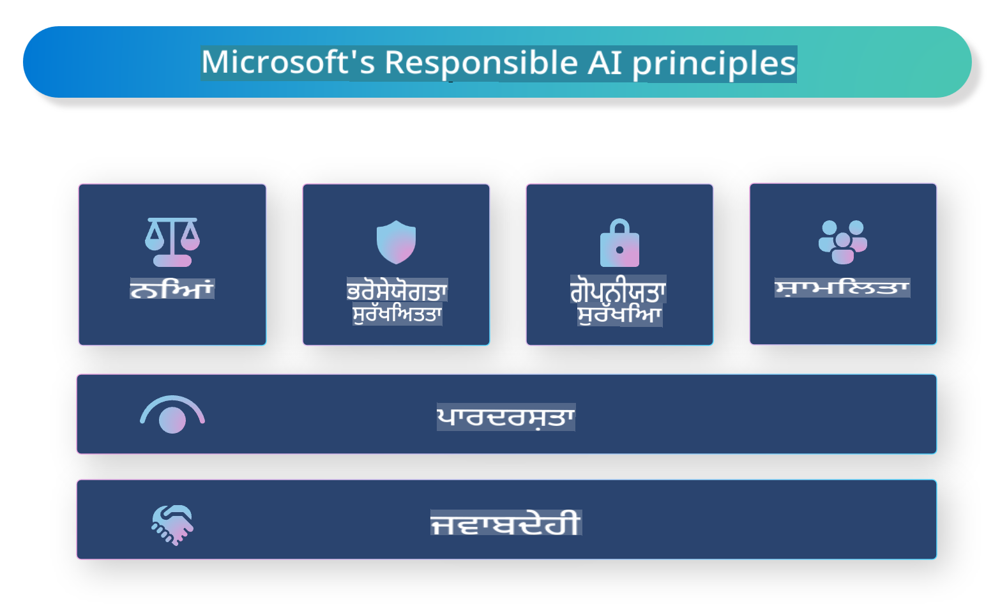

# **ਜਵਾਬਦੇਹ AI ਨਾਲ ਪਛਾਣ ਕਰਵਾਉਣਾ**

[Microsoft Responsible AI](https://www.microsoft.com/ai/responsible-ai?WT.mc_id=aiml-138114-kinfeylo) ਇੱਕ ਪਹਲ ਹੈ ਜੋ ਵਿਕਾਸਕਾਰਾਂ ਅਤੇ ਸੰਗਠਨਾਂ ਨੂੰ ਪਾਰਦਰਸ਼ੀ, ਭਰੋਸੇਯੋਗ ਅਤੇ ਜਵਾਬਦੇਹ AI ਸਿਸਟਮ ਬਣਾਉਣ ਵਿੱਚ ਮਦਦ ਕਰਨ ਲਈ ਹੈ। ਇਹ ਪਹਲ ਨੈਤਿਕ ਸਿਧਾਂਤਾਂ ਜਿਵੇਂ ਕਿ ਗੋਪਨੀਯਤਾ, ਨਿਆਂ ਅਤੇ ਪਾਰਦਰਸ਼ਤਾ ਦੇ ਅਨੁਕੂਲ ਜਵਾਬਦੇਹ AI ਹੱਲਾਂ ਵਿਕਸਿਤ ਕਰਨ ਲਈ ਦਿਸ਼ਾ-ਨਿਰਦੇਸ਼ ਅਤੇ ਸਰੋਤ ਪ੍ਰਦਾਨ ਕਰਦੀ ਹੈ। ਅਸੀਂ ਜਵਾਬਦੇਹ AI ਸਿਸਟਮ ਬਣਾਉਣ ਨਾਲ ਜੁੜੀਆਂ ਕੁਝ ਚੁਣੌਤੀਆਂ ਅਤੇ ਵਧੀਆ ਅਭਿਆਸਾਂ ਦਾ ਵੀ ਪੜਤਾਲ ਕਰਾਂਗੇ।

## Microsoft Responsible AI ਦਾ ਝਲਕੀਆਂ

**ਨੈਤਿਕ ਸਿਧਾਂਤ**

Microsoft Responsible AI ਗੋਪਨੀਯਤਾ, ਨਿਆਂ, ਪਾਰਦਰਸ਼ਤਾ, ਜਵਾਬਦੇਹੀ ਅਤੇ ਸੁਰੱਖਿਆ ਵਰਗੇ ਨੈਤਿਕ ਸਿਧਾਂਤਾਂ ਦੁਆਰਾ ਗਾਈਡ ਕੀਤਾ ਜਾਂਦਾ ਹੈ। ਇਹ ਸਿਧਾਂਤ ਇਹ ਯਕੀਨੀ ਬਣਾਉਣ ਲਈ ਡਿਜ਼ਾਈਨ ਕੀਤੇ ਗਏ ਹਨ ਕਿ AI ਸਿਸਟਮ ਨੈਤਿਕ ਅਤੇ ਜਵਾਬਦੇਹ ਢੰਗ ਨਾਲ ਵਿਕਸਿਤ ਕੀਤੇ ਗਏ ਹਨ।

**ਪਾਰਦਰਸ਼ੀ AI**

Microsoft Responsible AI AI ਸਿਸਟਮਾਂ ਵਿੱਚ ਪਾਰਦਰਸ਼ਤਾ ਦੀ ਮਹੱਤਤਾ ਉੱਤੇ ਜ਼ੋਰ ਦਿੰਦਾ ਹੈ। ਇਸ ਵਿੱਚ AI ਮਾਡਲਾਂ ਕਿਵੇਂ ਕੰਮ ਕਰਦੇ ਹਨ ਇਸ ਬਾਰੇ ਸਪੱਸ਼ਟ ਵਿਆਖਿਆਵਾਂ ਪ੍ਰਦਾਨ ਕਰਨਾ ਅਤੇ ਡਾਟਾ ਸਰੋਤਾਂ ਅਤੇ ਐਲਗੋਰਿਦਮ ਨੂੰ ਸਾਰਵਜਨਿਕ ਤੌਰ 'ਤੇ ਉਪਲਬਧ ਕਰਾਉਣਾ ਸ਼ਾਮਲ ਹੈ।

**ਜਵਾਬਦੇਹ AI**

[Microsoft Responsible AI](https://www.microsoft.com/ai/responsible-ai?WT.mc_id=aiml-138114-kinfeylo) ਜਵਾਬਦੇਹ AI ਸਿਸਟਮਾਂ ਦੇ ਵਿਕਾਸ ਨੂੰ ਬਢਾਵਾ ਦਿੰਦਾ ਹੈ, ਜੋ ਇਹ ਦਰਸਾਉਣ ਦੀ ਸਮਰੱਥਾ ਰੱਖਦੇ ਹਨ ਕਿ AI ਮਾਡਲ ਕਿਵੇਂ ਫੈਸਲੇ ਲੈਂਦੇ ਹਨ। ਇਹ ਯੂਜ਼ਰਾਂ ਦੀ ਮਦਦ ਕਰ ਸਕਦਾ ਹੈ ਕਿ ਉਹ AI ਸਿਸਟਮਾਂ ਦੇ ਨਤੀਜਿਆਂ ਨੂੰ ਸਮਝਣ ਅਤੇ ਭਰੋਸਾ ਕਰਨ।

**ਸਮਾਵੇਸ਼ਤਾ**

AI ਸਿਸਟਮਾਂ ਨੂੰ ਹਰ ਕਿਸੇ ਲਈ ਲਾਭਦਾਇਕ ਬਣਾਇਆ ਜਾਣਾ ਚਾਹੀਦਾ ਹੈ। Microsoft ਸਮਾਵੇਸ਼ੀ AI ਬਣਾਉਣ ਦੀ ਕੋਸ਼ਿਸ਼ ਕਰਦਾ ਹੈ ਜੋ ਵੱਖ-ਵੱਖ ਨਜ਼ਰੀਏਆਂ ਨੂੰ ਧਿਆਨ ਵਿੱਚ ਰੱਖਦਾ ਹੈ ਅਤੇ ਪੱਖਪਾਤ ਜਾਂ ਭੇਦਭਾਵ ਤੋਂ ਬਚਦਾ ਹੈ।

**ਭਰੋਸੇਯੋਗਤਾ ਅਤੇ ਸੁਰੱਖਿਆ**

AI ਸਿਸਟਮਾਂ ਦੀ ਭਰੋਸੇਯੋਗਤਾ ਅਤੇ ਸੁਰੱਖਿਆ ਨੂੰ ਯਕੀਨੀ ਬਣਾਉਣਾ ਬਹੁਤ ਜ਼ਰੂਰੀ ਹੈ। Microsoft ਮਜ਼ਬੂਤ ਮਾਡਲ ਬਣਾਉਣ ਉੱਤੇ ਧਿਆਨ ਕੇਂਦਰਿਤ ਕਰਦਾ ਹੈ ਜੋ ਲਗਾਤਾਰ ਕਾਰਗਰਤਾ ਨਾਲ ਕੰਮ ਕਰਦੇ ਹਨ ਅਤੇ ਨੁਕਸਾਨਪ੍ਰਦ ਨਤੀਜਿਆਂ ਤੋਂ ਬਚਦੇ ਹਨ।

**AI ਵਿੱਚ ਨਿਆਂ**

Microsoft Responsible AI ਇਹ ਮੰਨਦਾ ਹੈ ਕਿ AI ਸਿਸਟਮ ਪੱਖਪਾਤ ਨੂੰ ਵਧਾ ਸਕਦੇ ਹਨ ਜੇਕਰ ਉਹ ਪੱਖਪਾਤ ਵਾਲੇ ਡਾਟਾ ਜਾਂ ਐਲਗੋਰਿਦਮ 'ਤੇ ਟ੍ਰੇਨ ਕੀਤੇ ਗਏ ਹਨ। ਇਹ ਪਹਲ ਨਿਆਂਪੂਰਨ AI ਸਿਸਟਮਾਂ ਦੇ ਵਿਕਾਸ ਲਈ ਦਿਸ਼ਾ-ਨਿਰਦੇਸ਼ ਪ੍ਰਦਾਨ ਕਰਦੀ ਹੈ ਜੋ ਨਸਲ, ਲਿੰਗ ਜਾਂ ਉਮਰ ਵਰਗੇ ਕਾਰਕਾਂ ਦੇ ਆਧਾਰ 'ਤੇ ਭੇਦਭਾਵ ਨਹੀਂ ਕਰਦੇ।

**ਗੋਪਨੀਯਤਾ ਅਤੇ ਸੁਰੱਖਿਆ**

Microsoft Responsible AI AI ਸਿਸਟਮਾਂ ਵਿੱਚ ਯੂਜ਼ਰ ਗੋਪਨੀਯਤਾ ਅਤੇ ਡਾਟਾ ਸੁਰੱਖਿਆ ਦੀ ਰੱਖਿਆ ਕਰਨ ਦੀ ਮਹੱਤਤਾ 'ਤੇ ਜ਼ੋਰ ਦਿੰਦਾ ਹੈ। ਇਸ ਵਿੱਚ ਮਜ਼ਬੂਤ ਡਾਟਾ ਇਨਕ੍ਰਿਪਸ਼ਨ ਅਤੇ ਐਕਸੇਸ ਕੰਟਰੋਲ ਲਾਗੂ ਕਰਨਾ ਅਤੇ AI ਸਿਸਟਮਾਂ ਦੀ ਕਮਜ਼ੋਰੀਆਂ ਲਈ ਨਿਯਮਿਤ ਤੌਰ 'ਤੇ ਆਡਿਟ ਕਰਨਾ ਸ਼ਾਮਲ ਹੈ।

**ਜਵਾਬਦੇਹੀ ਅਤੇ ਜਿੰਮੇਵਾਰੀ**

Microsoft Responsible AI AI ਦੇ ਵਿਕਾਸ ਅਤੇ ਤੈਨਾਤੀ ਵਿੱਚ ਜਵਾਬਦੇਹੀ ਅਤੇ ਜਿੰਮੇਵਾਰੀ ਨੂੰ ਉਤਸ਼ਾਹਿਤ ਕਰਦਾ ਹੈ। ਇਸ ਵਿੱਚ ਇਹ ਯਕੀਨੀ ਬਣਾਉਣਾ ਸ਼ਾਮਲ ਹੈ ਕਿ ਵਿਕਾਸਕਾਰ ਅਤੇ ਸੰਗਠਨ AI ਸਿਸਟਮਾਂ ਨਾਲ ਜੁੜੇ ਸੰਭਾਵਿਤ ਖਤਰਿਆਂ ਤੋਂ ਵਾਕਫ ਹਨ ਅਤੇ ਉਹਨਾਂ ਖਤਰਿਆਂ ਨੂੰ ਘਟਾਉਣ ਲਈ ਕਦਮ ਚੁੱਕਦੇ ਹਨ।

## ਜਵਾਬਦੇਹ AI ਸਿਸਟਮ ਬਣਾਉਣ ਲਈ ਵਧੀਆ ਅਭਿਆਸ

**ਵੱਖ-ਵੱਖ ਡਾਟਾ ਸੈੱਟਾਂ ਨਾਲ AI ਮਾਡਲ ਵਿਕਸਿਤ ਕਰੋ**

AI ਸਿਸਟਮਾਂ ਵਿੱਚ ਪੱਖਪਾਤ ਤੋਂ ਬਚਣ ਲਈ, ਇਹ ਮਹੱਤਵਪੂਰਨ ਹੈ ਕਿ ਵੱਖ-ਵੱਖ ਨਜ਼ਰੀਏ ਅਤੇ ਅਨੁਭਵਾਂ ਨੂੰ ਦਰਸਾਉਣ ਵਾਲੇ ਡਾਟਾ ਸੈੱਟਾਂ ਦੀ ਵਰਤੋਂ ਕੀਤੀ ਜਾਵੇ।

**Explainable AI ਤਕਨਾਲੋਜੀਆਂ ਦੀ ਵਰਤੋਂ ਕਰੋ**

Explainable AI ਤਕਨਾਲੋਜੀਆਂ ਯੂਜ਼ਰਾਂ ਨੂੰ ਇਹ ਸਮਝਣ ਵਿੱਚ ਮਦਦ ਕਰ ਸਕਦੀਆਂ ਹਨ ਕਿ AI ਮਾਡਲ ਕਿਵੇਂ ਫੈਸਲੇ ਲੈਂਦੇ ਹਨ, ਜੋ ਸਿਸਟਮ ਵਿੱਚ ਭਰੋਸਾ ਵਧਾ ਸਕਦਾ ਹੈ।

**ਨਿਯਮਿਤ ਤੌਰ 'ਤੇ AI ਸਿਸਟਮਾਂ ਦੀ ਆਡਿਟ ਕਰੋ**

AI ਸਿਸਟਮਾਂ ਦੀ ਨਿਯਮਿਤ ਆਡਿਟ ਸੰਭਾਵਿਤ ਖਤਰਿਆਂ ਅਤੇ ਕਮਜ਼ੋਰੀਆਂ ਦੀ ਪਛਾਣ ਕਰਨ ਵਿੱਚ ਮਦਦ ਕਰ ਸਕਦੀ ਹੈ, ਜਿਨ੍ਹਾਂ ਦਾ ਹੱਲ ਲੱਭਣ ਦੀ ਲੋੜ ਹੈ।

**ਮਜ਼ਬੂਤ ਡਾਟਾ ਇਨਕ੍ਰਿਪਸ਼ਨ ਅਤੇ ਐਕਸੇਸ ਕੰਟਰੋਲ ਲਾਗੂ ਕਰੋ**

ਡਾਟਾ ਇਨਕ੍ਰਿਪਸ਼ਨ ਅਤੇ ਐਕਸੇਸ ਕੰਟਰੋਲ ਯੂਜ਼ਰ ਗੋਪਨੀਯਤਾ ਅਤੇ ਸੁਰੱਖਿਆ ਦੀ ਰੱਖਿਆ ਕਰਨ ਵਿੱਚ ਮਦਦ ਕਰ ਸਕਦੇ ਹਨ।

**AI ਵਿਕਾਸ ਵਿੱਚ ਨੈਤਿਕ ਸਿਧਾਂਤਾਂ ਦੀ ਪਾਲਣਾ ਕਰੋ**

ਨਿਆਂ, ਪਾਰਦਰਸ਼ਤਾ ਅਤੇ ਜਵਾਬਦੇਹੀ ਵਰਗੇ ਨੈਤਿਕ ਸਿਧਾਂਤਾਂ ਦੀ ਪਾਲਣਾ ਕਰਨਾ AI ਸਿਸਟਮਾਂ ਵਿੱਚ ਭਰੋਸਾ ਬਣਾਉਣ ਅਤੇ ਇਹ ਯਕੀਨੀ ਬਣਾਉਣ ਵਿੱਚ ਮਦਦ ਕਰ ਸਕਦਾ ਹੈ ਕਿ ਉਹ ਜਵਾਬਦੇਹ ਢੰਗ ਨਾਲ ਵਿਕਸਿਤ ਕੀਤੇ ਗਏ ਹਨ।

## ਜਵਾਬਦੇਹ AI ਲਈ AI Foundry ਦੀ ਵਰਤੋਂ

[Azure AI Foundry](https://ai.azure.com?WT.mc_id=aiml-138114-kinfeylo) ਇੱਕ ਸ਼ਕਤੀਸ਼ਾਲੀ ਪਲੇਟਫਾਰਮ ਹੈ ਜੋ ਵਿਕਾਸਕਾਰਾਂ ਅਤੇ ਸੰਗਠਨਾਂ ਨੂੰ ਤੇਜ਼ੀ ਨਾਲ ਬੁੱਧੀਮਾਨ, ਅਧੁਨਿਕ, ਬਾਜ਼ਾਰ-ਤਿਆਰ ਅਤੇ ਜਵਾਬਦੇਹ ਐਪਲੀਕੇਸ਼ਨ ਬਣਾਉਣ ਦੀ ਆਗਿਆ ਦਿੰਦਾ ਹੈ। ਇੱਥੇ ਕੁਝ ਮੁੱਖ ਵਿਸ਼ੇਸ਼ਤਾਵਾਂ ਅਤੇ ਸਮਰੱਥਾਵਾਂ ਹਨ:

**Out-of-the-Box APIs ਅਤੇ ਮਾਡਲ**

Azure AI Foundry ਪੂਰਵ-ਨਿਰਮਿਤ ਅਤੇ ਕਸਟਮਾਈਜ਼ ਕਰਨ ਯੋਗ APIs ਅਤੇ ਮਾਡਲ ਪ੍ਰਦਾਨ ਕਰਦਾ ਹੈ। ਇਹ ਬਹੁਤ ਸਾਰੇ AI ਕਾਰਜਾਂ ਨੂੰ ਕਵਰ ਕਰਦੇ ਹਨ, ਜਿਵੇਂ ਕਿ ਜਨਰੇਟਿਵ AI, ਗੱਲਬਾਤ ਲਈ ਪ੍ਰਾਕ੍ਰਿਤਿਕ ਭਾਸ਼ਾ ਪ੍ਰੋਸੈਸਿੰਗ, ਖੋਜ, ਨਿਗਰਾਨੀ, ਅਨੁਵਾਦ, ਭਾਸ਼ਣ, ਵਿਜ਼ਨ ਅਤੇ ਫੈਸਲਾ ਲੈਣਾ।

**Prompt Flow**

Azure AI Foundry ਵਿੱਚ Prompt Flow ਤੁਹਾਨੂੰ ਗੱਲਬਾਤ ਵਾਲੇ AI ਅਨੁਭਵ ਬਣਾਉਣ ਦੇ ਯੋਗ ਬਣਾਉਂਦਾ ਹੈ। ਇਹ ਤੁਹਾਨੂੰ ਗੱਲਬਾਤ ਦੇ ਪ੍ਰਵਾਹ ਡਿਜ਼ਾਈਨ ਕਰਨ ਅਤੇ ਪ੍ਰਬੰਧਿਤ ਕਰਨ ਦੀ ਆਗਿਆ ਦਿੰਦਾ ਹੈ, ਜਿਸ ਨਾਲ ਚੈਟਬੋਟ, ਵਰਚੁਅਲ ਅਸਿਸਟੈਂਟ ਅਤੇ ਹੋਰ ਇੰਟਰੈਕਟਿਵ ਐਪਲੀਕੇਸ਼ਨ ਬਣਾਉਣਾ ਆਸਾਨ ਹੋ ਜਾਂਦਾ ਹੈ।

**Retrieval Augmented Generation (RAG)**

RAG ਇੱਕ ਤਕਨੀਕ ਹੈ ਜੋ ਰਿਟਰੀਵਲ-ਅਧਾਰਤ ਅਤੇ ਜਨਰੇਟਿਵ-ਅਧਾਰਤ ਪਹੁੰਚਾਂ ਨੂੰ ਜੋੜਦੀ ਹੈ। ਇਹ ਪਹਲੋਂ ਹੀ ਮੌਜੂਦ ਗਿਆਨ (ਰਿਟਰੀਵਲ) ਅਤੇ ਰਚਨਾਤਮਕ ਜਨਰੇਸ਼ਨ (ਜਨਰੇਸ਼ਨ) ਦੋਵਾਂ ਨੂੰ ਵਰਤ ਕੇ ਪੈਦਾ ਕੀਤੀਆਂ ਜਵਾਬਾਂ ਦੀ ਗੁਣਵੱਤਾ ਨੂੰ ਵਧਾਉਂਦਾ ਹੈ।

**ਜਨਰੇਟਿਵ AI ਲਈ ਮੁਲਾਂਕਣ ਅਤੇ ਨਿਗਰਾਨੀ ਮਾਪਦੰਡ**

Azure AI Foundry ਜਨਰੇਟਿਵ AI ਮਾਡਲਾਂ ਦੀ ਮੁਲਾਂਕਣ ਅਤੇ ਨਿਗਰਾਨੀ ਲਈ ਟੂਲ ਪ੍ਰਦਾਨ ਕਰਦਾ ਹੈ। ਤੁਸੀਂ ਇਹਨਾਂ ਦੀ ਪ੍ਰਦਰਸ਼ਨ, ਨਿਆਂ ਅਤੇ ਹੋਰ ਮਹੱਤਵਪੂਰਨ ਮਾਪਦੰਡਾਂ ਦਾ ਮੁਲਾਂਕਣ ਕਰ ਸਕਦੇ ਹੋ ਤਾਂ ਜੋ ਜਵਾਬਦੇਹ ਤੈਨਾਤੀ ਨੂੰ ਯਕੀਨੀ ਬਣਾਇਆ ਜਾ ਸਕੇ। ਇਸ ਤੋਂ ਇਲਾਵਾ, ਜੇ ਤੁਸੀਂ ਇੱਕ ਡੈਸ਼ਬੋਰਡ ਬਣਾਇਆ ਹੈ, ਤਾਂ ਤੁਸੀਂ Azure Machine Learning Studio ਵਿੱਚ ਕੋਈ ਕੋਡ ਨਾ ਲਿਖਣ ਵਾਲੇ UI ਦੀ ਵਰਤੋਂ ਕਰਕੇ ਇੱਕ Responsible AI Dashboard ਅਤੇ ਜੁੜੇ ਸਕੋਰਕਾਰਡ ਨੂੰ ਕਸਟਮਾਈਜ਼ ਅਤੇ ਪੈਦਾ ਕਰ ਸਕਦੇ ਹੋ। ਇਹ ਸਕੋਰਕਾਰਡ ਤੁਹਾਨੂੰ ਨਿਆਂ, ਫੀਚਰ ਮਹੱਤਤਾ ਅਤੇ ਹੋਰ ਜਵਾਬਦੇਹ ਤੈਨਾਤੀ ਦੇ ਵਿਚਾਰਾਂ ਨਾਲ ਜੁੜੇ ਮੁੱਖ ਅੰਕ ਸ਼ੇਅਰ ਕਰਨ ਵਿੱਚ ਮਦਦ ਕਰਦਾ ਹੈ, ਚਾਹੇ ਉਹ ਤਕਨੀਕੀ ਹੋਣ ਜਾਂ ਗੈਰ-ਤਕਨੀਕੀ ਸਟੇਕਹੋਲਡਰ।

ਜਵਾਬਦੇਹ AI ਨਾਲ AI Foundry ਦੀ ਵਰਤੋਂ ਕਰਨ ਲਈ ਤੁਸੀਂ ਇਹ ਵਧੀਆ ਅਭਿਆਸ ਅਪਣਾਓ:

**ਆਪਣੇ AI ਸਿਸਟਮ ਦੀ ਸਮੱਸਿਆ ਅਤੇ ਉਦੇਸ਼ ਨਿਰਧਾਰਤ ਕਰੋ**

ਵਿਕਾਸ ਦੀ ਪ੍ਰਕਿਰਿਆ ਸ਼ੁਰੂ ਕਰਨ ਤੋਂ ਪਹਿਲਾਂ, ਇਹ ਸਪੱਸ਼ਟ ਤੌਰ 'ਤੇ ਨਿਰਧਾਰਤ ਕਰਨਾ ਮਹੱਤਵਪੂਰਨ ਹੈ ਕਿ ਤੁਹਾਡਾ AI ਸਿਸਟਮ ਕਿਸ ਸਮੱਸਿਆ ਜਾਂ ਉਦੇਸ਼ ਨੂੰ ਹੱਲ ਕਰਨ ਦਾ ਲਕਸ਼ ਹੈ। ਇਹ ਤੁਹਾਨੂੰ ਇੱਕ ਪ੍ਰਭਾਵਸ਼ਾਲੀ ਮਾਡਲ ਬਣਾਉਣ ਲਈ ਲੋੜੀਂਦੇ ਡਾਟਾ, ਐਲਗੋਰਿਦਮ ਅਤੇ ਸਰੋਤਾਂ ਦੀ ਪਛਾਣ ਕਰਨ ਵਿੱਚ ਮਦਦ ਕਰੇਗਾ।

**ਸੰਬੰਧਤ ਡਾਟਾ ਇਕੱਠਾ ਕਰੋ ਅਤੇ ਪ੍ਰੀ-ਪ੍ਰੋਸੈਸ ਕਰੋ**

AI ਸਿਸਟਮ ਦੇ ਟ੍ਰੇਨਿੰਗ ਵਿੱਚ ਵਰਤੇ ਗਏ ਡਾਟਾ ਦੀ ਗੁਣਵੱਤਾ ਅਤੇ ਮਾਤਰਾ ਇਸਦੀ ਪ੍ਰਦਰਸ਼ਨ 'ਤੇ ਮਹੱਤਵਪੂਰਨ ਪ੍ਰਭਾਵ ਪਾ ਸਕਦੀ ਹੈ। ਇਸ ਲਈ, ਸੰਬੰਧਤ ਡਾਟਾ ਇਕੱਠਾ ਕਰਨਾ, ਸਾਫ ਕਰਨਾ, ਪ੍ਰੀ-ਪ੍ਰੋਸੈਸ ਕਰਨਾ ਅਤੇ ਇਹ ਯਕੀਨੀ ਬਣਾਉਣਾ ਕਿ ਇਹ ਤੁਹਾਡੇ ਹੱਲ ਕਰਨ ਵਾਲੀ ਆਬਾਦੀ ਜਾਂ ਸਮੱਸਿਆ ਦਾ ਪ੍ਰਤੀਨਿਧਿਤਾ ਕਰਦਾ ਹੈ, ਬਹੁਤ ਜ਼ਰੂਰੀ ਹੈ।

**ਉਚਿਤ ਮੁਲਾਂਕਣ ਚੁਣੋ**

ਬਹੁਤ ਸਾਰੇ ਮੁਲਾਂਕਣ ਐਲਗੋਰਿਦਮ ਉਪਲਬਧ ਹਨ। ਇਹ ਮਹੱਤਵਪੂਰਨ ਹੈ ਕਿ ਤੁਹਾਡੇ ਡਾਟਾ ਅਤੇ ਸਮੱਸਿਆ ਦੇ ਆਧਾਰ 'ਤੇ ਸਭ ਤੋਂ ਉਚਿਤ ਐਲਗੋਰਿਦਮ ਦੀ ਚੋਣ ਕੀਤੀ ਜਾਵੇ।

**ਮਾਡਲ ਦਾ ਮੁਲਾਂਕਣ ਅਤੇ ਵਿਆਖਿਆ ਕਰੋ**

ਜਦੋਂ ਤੁਸੀਂ ਇੱਕ AI ਮਾਡਲ ਬਣਾਉਂਦੇ ਹੋ, ਤਾਂ ਇਹ ਮਹੱਤਵਪੂਰਨ ਹੈ ਕਿ ਇਸਦੀ ਪ੍ਰਦਰਸ਼ਨ ਨੂੰ ਉਚਿਤ ਮਾਪਦੰਡਾਂ ਦੀ ਵਰਤੋਂ ਕਰਕੇ ਮੁਲਾਂਕਣ ਕੀਤਾ ਜਾਵੇ ਅਤੇ ਨਤੀਜਿਆਂ ਨੂੰ ਪਾਰਦਰਸ਼ੀ ਢੰਗ ਨਾਲ ਵਿਆਖਿਆ ਕੀਤਾ ਜਾਵੇ। ਇਹ ਤੁਹਾਨੂੰ ਮਾਡਲ ਵਿੱਚ ਕਿਸੇ ਵੀ ਪੱਖਪਾਤ ਜਾਂ ਸੀਮਾਵਾਂ ਦੀ ਪਛਾਣ ਕਰਨ ਵਿੱਚ ਮਦਦ ਕਰੇਗਾ ਅਤੇ ਜਿੱਥੇ ਜ਼ਰੂਰੀ ਹੋਵੇ ਉੱਥੇ ਸੁਧਾਰ ਲਿਆ ਸਕੇਗਾ।

**ਪਾਰਦਰਸ਼ਤਾ ਅਤੇ Explainability ਨੂੰ ਯਕੀਨੀ ਬਣਾਓ**

AI ਸਿਸਟਮ ਪਾਰਦਰਸ਼ੀ ਅਤੇ Explainable ਹੋਣੇ ਚਾਹੀਦੇ ਹਨ ਤਾਂ ਜੋ ਯੂਜ਼ਰ ਇਹ ਸਮਝ ਸਕਣ ਕਿ ਇਹ ਕਿਵੇਂ ਕੰਮ ਕਰਦੇ ਹਨ ਅਤੇ ਫੈਸਲੇ ਕਿਵੇਂ ਲੈਂਦੇ ਹਨ। ਇਹ ਖਾਸ ਕਰਕੇ ਉਹਨਾਂ ਐਪਲੀਕੇਸ਼ਨਾਂ ਲਈ ਮਹੱਤਵਪੂਰਨ ਹੈ ਜੋ ਮਨੁੱਖੀ ਜ਼ਿੰਦਗੀਆਂ 'ਤੇ ਮਹੱਤਵਪੂਰਨ ਪ੍ਰਭਾਵ ਪਾਉਂਦੀਆਂ ਹਨ, ਜਿਵੇਂ ਕਿ ਸਿਹਤ, ਵਿੱਤੀ ਸੇਵਾਵਾਂ ਅਤੇ ਕਾਨੂੰਨੀ ਸਿਸਟਮ।

**ਮਾਡਲ ਦੀ ਨਿਗਰਾਨੀ ਅਤੇ ਅਪਡੇਟ ਕਰੋ**

AI ਸਿਸਟਮਾਂ ਨੂੰ ਲਗਾਤਾਰ ਨਿਗਰਾਨੀ ਅਤੇ ਅਪਡੇਟ ਕੀਤਾ ਜਾਣਾ ਚਾਹੀਦਾ ਹੈ ਤਾਂ ਜੋ ਇਹ ਯਕੀਨੀ ਬਣਾਇਆ ਜਾ ਸਕੇ ਕਿ ਉਹ ਸਮੇਂ ਦੇ ਨਾਲ ਸਹੀ ਅਤੇ ਪ੍ਰਭਾਵਸ਼ਾਲੀ ਰਹਿੰਦੇ ਹਨ। ਇਸ ਲਈ ਮਾਡਲ ਦੀ ਨਿਰੰਤਰ ਰਖ-ਰਖਾਵ, ਟੈਸਟਿੰਗ ਅਤੇ ਰੀ-ਟ੍ਰੇਨਿੰਗ ਦੀ ਲੋੜ ਹੁੰਦੀ ਹੈ।

ਅੰਤ ਵਿੱਚ, Microsoft Responsible AI ਇੱਕ ਪਹਲ ਹੈ ਜੋ ਵਿਕਾਸਕਾਰਾਂ ਅਤੇ ਸੰਗਠਨਾਂ ਨੂੰ ਪਾਰਦਰਸ਼ੀ, ਭਰੋਸੇਯੋਗ ਅਤੇ ਜਵਾਬਦੇਹ AI ਸਿਸਟਮ ਬਣਾਉਣ ਵਿੱਚ ਮਦਦ ਕਰਨ ਲਈ ਹੈ। ਯਾਦ ਰੱਖੋ ਕਿ ਜਵਾਬਦੇਹ AI ਨੂੰ ਲਾਗੂ ਕਰਨਾ ਬਹੁਤ ਮਹੱਤਵਪੂਰਨ ਹੈ, ਅਤੇ Azure AI Foundry ਇਸਨੂੰ ਸੰਗਠਨਾਂ ਲਈ ਵਿਆਹਾਰਿਕ ਬਣਾਉਣ ਦਾ ਲਕਸ਼ ਰੱਖਦਾ ਹੈ। ਨੈਤਿਕ ਸਿਧਾਂਤਾਂ ਅਤੇ ਵਧੀਆ ਅਭਿਆਸਾਂ ਦੀ ਪਾਲਣਾ ਕਰਕੇ, ਅਸੀਂ ਇਹ ਯਕੀਨੀ ਬਣਾਉਂਦਿਆਂ ਕਿ AI ਸਿਸਟਮ ਜਵਾਬਦੇਹ ਢੰਗ ਨਾਲ ਵਿਕਸਿਤ ਅਤੇ ਤੈਨਾਤ ਕੀਤੇ ਗਏ ਹਨ, ਸਮਾਜ ਨੂੰ ਸਮੁੱਚੇ ਤੌਰ 'ਤੇ ਲਾਭ ਪਹੁੰਚਾ ਸਕਦੇ ਹਾਂ।

**ਅਸਵੀਕਰਤੀਕਰਨ**:  
ਇਹ ਦਸਤਾਵੇਜ਼ ਮਸ਼ੀਨ-ਅਧਾਰਿਤ AI ਅਨੁਵਾਦ ਸੇਵਾਵਾਂ ਦੀ ਵਰਤੋਂ ਕਰਕੇ ਅਨੁਵਾਦ ਕੀਤਾ ਗਿਆ ਹੈ। ਜਦੋਂ ਕਿ ਅਸੀਂ ਸਹੀ ਹੋਣ ਦੀ ਕੋਸ਼ਿਸ਼ ਕਰਦੇ ਹਾਂ, ਕਿਰਪਾ ਕਰਕੇ ਧਿਆਨ ਦਿਓ ਕਿ ਆਟੋਮੈਟਿਕ ਅਨੁਵਾਦਾਂ ਵਿੱਚ ਗਲਤੀਆਂ ਜਾਂ ਅਸੁੱਤਰ ਹੋ ਸਕਦੇ ਹਨ। ਮੂਲ ਦਸਤਾਵੇਜ਼ ਨੂੰ ਇਸ ਦੀ ਮੂਲ ਭਾਸ਼ਾ ਵਿੱਚ ਪ੍ਰਮੁੱਖ ਸਰੋਤ ਮੰਨਿਆ ਜਾਣਾ ਚਾਹੀਦਾ ਹੈ। ਮਹੱਤਵਪੂਰਨ ਜਾਣਕਾਰੀ ਲਈ, ਪੇਸ਼ੇਵਰ ਮਨੁੱਖੀ ਅਨੁਵਾਦ ਦੀ ਸਿਫਾਰਿਸ਼ ਕੀਤੀ ਜਾਂਦੀ ਹੈ। ਅਸੀਂ ਇਸ ਅਨੁਵਾਦ ਦੀ ਵਰਤੋਂ ਤੋਂ ਪੈਦਾ ਹੋਣ ਵਾਲੀਆਂ ਕਿਸੇ ਵੀ ਗਲਤਫਹਮੀਆਂ ਜਾਂ ਗਲਤ ਵਿਆਖਿਆਵਾਂ ਲਈ ਜ਼ਿੰਮੇਵਾਰ ਨਹੀਂ ਹਾਂ।