# ਮਾਈਕਰੋਸਾਫਟ ਦੇ ਜ਼ਿੰਮੇਵਾਰ AI ਨੀਤੀਆਂ 'ਤੇ ਧਿਆਨ ਕੇਂਦਰਿਤ ਕਰਕੇ Azure AI Foundry ਵਿੱਚ Fine-tuned Phi-3 / Phi-3.5 ਮਾਡਲ ਦਾ ਮੁਲਾਂਕਨ ਕਰੋ

ਇਹ ਅੰਤ-ਤੱਕ-ਅੰਤ (E2E) ਨਮੂਨਾ ਮਾਈਕਰੋਸਾਫਟ ਟੈਕ ਕਮਿਊਨਿਟੀ ਦੀ ਗਾਈਡ "[Evaluate Fine-tuned Phi-3 / 3.5 Models in Azure AI Foundry Focusing on Microsoft's Responsible AI](https://techcommunity.microsoft.com/t5/educator-developer-blog/evaluate-fine-tuned-phi-3-3-5-models-in-azure-ai-studio-focusing/ba-p/4227850?WT.mc_id=aiml-137032-kinfeylo)" 'ਤੇ ਆਧਾਰਿਤ ਹੈ।

## ਝਲਕ

### Azure AI Foundry ਵਿੱਚ Fine-tuned Phi-3 / Phi-3.5 ਮਾਡਲ ਦੀ ਸੁਰੱਖਿਆ ਅਤੇ ਪ੍ਰਦਰਸ਼ਨ ਦਾ ਮੁਲਾਂਕਨ ਕਿਵੇਂ ਕਰ ਸਕਦੇ ਹੋ?

ਕਈ ਵਾਰ ਮਾਡਲ ਨੂੰ Fine-tune ਕਰਨ ਨਾਲ ਅਣਚਾਹੀਆਂ ਜਾਂ ਅਣਚਾਹੀਆਂ ਪ੍ਰਤੀਕ੍ਰਿਆਵਾਂ ਹੋ ਸਕਦੀਆਂ ਹਨ। ਇਹ ਯਕੀਨੀ ਬਣਾਉਣ ਲਈ ਕਿ ਮਾਡਲ ਸੁਰੱਖਿਅਤ ਅਤੇ ਪ੍ਰਭਾਵਸ਼ਾਲੀ ਰਹਿੰਦਾ ਹੈ, ਇਹ ਜ਼ਰੂਰੀ ਹੈ ਕਿ ਮਾਡਲ ਦੇ ਹਾਨਿਕਾਰਕ ਸਮੱਗਰੀ ਪੈਦਾ ਕਰਨ ਦੇ ਸੰਭਾਵਨਾਵਾਂ ਅਤੇ ਸਹੀ, ਸਬੰਧਤ ਅਤੇ ਸੰਗਠਿਤ ਜਵਾਬ ਪੈਦਾ ਕਰਨ ਦੀ ਯੋਗਤਾ ਦਾ ਮੁਲਾਂਕਨ ਕੀਤਾ ਜਾਵੇ। ਇਸ ਟਿਊਟੋਰਿਅਲ ਵਿੱਚ, ਤੁਸੀਂ ਸਿੱਖੋਗੇ ਕਿ Azure AI Foundry ਵਿੱਚ Prompt flow ਨਾਲ ਜੋੜੇ Fine-tuned Phi-3 / Phi-3.5 ਮਾਡਲ ਦੀ ਸੁਰੱਖਿਆ ਅਤੇ ਪ੍ਰਦਰਸ਼ਨ ਦਾ ਮੁਲਾਂਕਨ ਕਿਵੇਂ ਕਰਨਾ ਹੈ।

ਹੇਠਾਂ Azure AI Foundry ਦਾ ਮੁਲਾਂਕਨ ਪ੍ਰਕਿਰਿਆ ਦਿੱਤਾ ਗਿਆ ਹੈ।

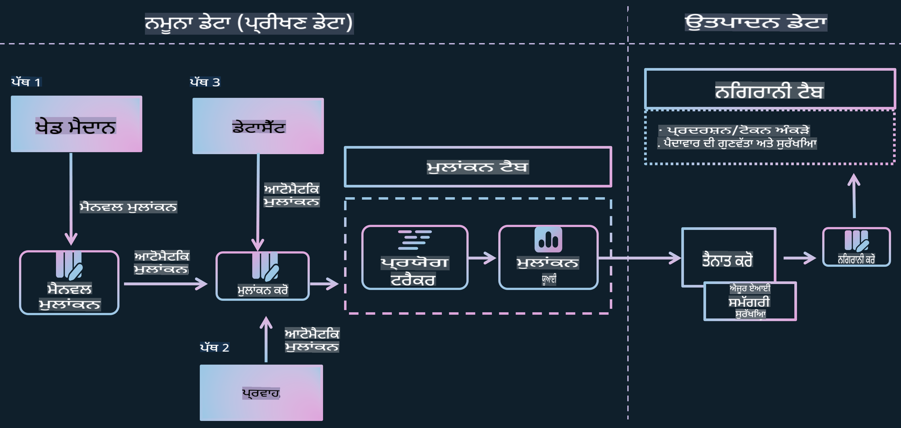

*ਚਿੱਤਰ ਸਰੋਤ: [ਜਨਰੇਟਿਵ AI ਐਪਲੀਕੇਸ਼ਨਾਂ ਦਾ ਮੁਲਾਂਕਨ](https://learn.microsoft.com/azure/ai-studio/concepts/evaluation-approach-gen-ai?wt.mc_id%3Dstudentamb_279723)*

> [!NOTE]
>
> ਵਧੇਰੇ ਵੇਰਵੇ ਅਤੇ Phi-3 / Phi-3.5 ਬਾਰੇ ਵਾਧੂ ਸਰੋਤਾਂ ਨੂੰ ਖੋਜਣ ਲਈ, ਕਿਰਪਾ ਕਰਕੇ [Phi-3CookBook](https://github.com/microsoft/Phi-3CookBook?wt.mc_id=studentamb_279723) ਵੇਖੋ।

### ਜ਼ਰੂਰੀ ਪੂਰਕ

- [Python](https://www.python.org/downloads)
- [Azure subscription](https://azure.microsoft.com/free?wt.mc_id=studentamb_279723)
- [Visual Studio Code](https://code.visualstudio.com)
- Fine-tuned Phi-3 / Phi-3.5 ਮਾਡਲ

### ਸਮਗਰੀ ਦੀ ਸੂਚੀ

1. [**ਦ੍ਰਿਸ਼ 1: Azure AI Foundry ਦੇ Prompt flow ਮੁਲਾਂਕਨ ਦਾ ਪਰਿਚਯ**](../../../../../../md/02.Application/01.TextAndChat/Phi3)

    - [ਸੁਰੱਖਿਆ ਮੁਲਾਂਕਨ ਦਾ ਪਰਿਚਯ](../../../../../../md/02.Application/01.TextAndChat/Phi3)
    - [ਪ੍ਰਦਰਸ਼ਨ ਮੁਲਾਂਕਨ ਦਾ ਪਰਿਚਯ](../../../../../../md/02.Application/01.TextAndChat/Phi3)

1. [**ਦ੍ਰਿਸ਼ 2: Azure AI Foundry ਵਿੱਚ Phi-3 / Phi-3.5 ਮਾਡਲ ਦਾ ਮੁਲਾਂਕਨ**](../../../../../../md/02.Application/01.TextAndChat/Phi3)

    - [ਸ਼ੁਰੂ ਕਰਨ ਤੋਂ ਪਹਿਲਾਂ](../../../../../../md/02.Application/01.TextAndChat/Phi3)
    - [Phi-3 / Phi-3.5 ਮਾਡਲ ਦਾ ਮੁਲਾਂਕਨ ਕਰਨ ਲਈ Azure OpenAI ਤੈਅ ਕਰੋ](../../../../../../md/02.Application/01.TextAndChat/Phi3)
    - [Azure AI Foundry ਦੇ Prompt flow ਮੁਲਾਂਕਨ ਦੀ ਵਰਤੋਂ ਕਰਕੇ Fine-tuned Phi-3 / Phi-3.5 ਮਾਡਲ ਦਾ ਮੁਲਾਂਕਨ ਕਰੋ](../../../../../../md/02.Application/01.TextAndChat/Phi3)

1. [ਸ਼ਾਬਾਸ਼!](../../../../../../md/02.Application/01.TextAndChat/Phi3)

## **ਦ੍ਰਿਸ਼ 1: Azure AI Foundry ਦੇ Prompt flow ਮੁਲਾਂਕਨ ਦਾ ਪਰਿਚਯ**

### ਸੁਰੱਖਿਆ ਮੁਲਾਂਕਨ ਦਾ ਪਰਿਚਯ

ਤੁਹਾਡੇ AI ਮਾਡਲ ਨੂੰ ਨੈਤਿਕ ਅਤੇ ਸੁਰੱਖਿਅਤ ਬਣਾਉਣ ਲਈ, ਇਸ ਨੂੰ ਮਾਈਕਰੋਸਾਫਟ ਦੀਆਂ ਜ਼ਿੰਮੇਵਾਰ AI ਨੀਤੀਆਂ ਦੇ ਖ਼ਿਲਾਫ਼ ਮੁਲਾਂਕਨ ਕਰਨਾ ਬਹੁਤ ਜ਼ਰੂਰੀ ਹੈ। Azure AI Foundry ਵਿੱਚ, ਸੁਰੱਖਿਆ ਮੁਲਾਂਕਨ ਤੁਹਾਨੂੰ ਮਾਡਲ ਦੀ ਜੇਲਬਰੇਕ ਹਮਲਿਆਂ ਦੇ ਪ੍ਰਤੀ ਸੰਵੇਦਨਸ਼ੀਲਤਾ ਅਤੇ ਹਾਨਿਕਾਰਕ ਸਮੱਗਰੀ ਪੈਦਾ ਕਰਨ ਦੀ ਸੰਭਾਵਨਾ ਦਾ ਮੁਲਾਂਕਨ ਕਰਨ ਦੀ ਆਗਿਆ ਦਿੰਦਾ ਹੈ, ਜੋ ਸਿੱਧੇ ਤੌਰ 'ਤੇ ਇਨ੍ਹਾਂ ਨੀਤੀਆਂ ਨਾਲ ਸੰਬੰਧਿਤ ਹੈ।

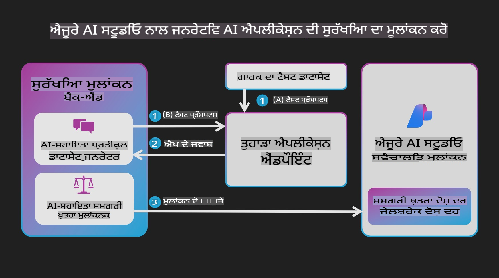

*ਚਿੱਤਰ ਸਰੋਤ: [ਜਨਰੇਟਿਵ AI ਐਪਲੀਕੇਸ਼ਨਾਂ ਦਾ ਮੁਲਾਂਕਨ](https://learn.microsoft.com/azure/ai-studio/concepts/evaluation-approach-gen-ai?wt.mc_id%3Dstudentamb_279723)*

#### ਮਾਈਕਰੋਸਾਫਟ ਦੀਆਂ ਜ਼ਿੰਮੇਵਾਰ AI ਨੀਤੀਆਂ

ਤਕਨੀਕੀ ਕਦਮਾਂ ਦੀ ਸ਼ੁਰੂਆਤ ਕਰਨ ਤੋਂ ਪਹਿਲਾਂ, ਮਾਈਕਰੋਸਾਫਟ ਦੀਆਂ ਜ਼ਿੰਮੇਵਾਰ AI ਨੀਤੀਆਂ ਨੂੰ ਸਮਝਣਾ ਮਹੱਤਵਪੂਰਨ ਹੈ। ਇਹ ਨੈਤਿਕ ਫਰੇਮਵਰਕ AI ਸਿਸਟਮਾਂ ਦੀ ਜ਼ਿੰਮੇਵਾਰ ਵਿਕਾਸ, ਤੈਨਾਤੀ, ਅਤੇ ਸੰਗਠਨ ਲਈ ਰਾਹਦਾਰੀ ਦੇਣ ਲਈ ਤਿਆਰ ਕੀਤਾ ਗਿਆ ਹੈ। ਇਹ ਨੀਤੀਆਂ ਇਹ ਯਕੀਨੀ ਬਣਾਉਣ ਲਈ ਮਾਰਗਦਰਸ਼ਨ ਕਰਦੀਆਂ ਹਨ ਕਿ AI ਤਕਨੀਕਾਂ ਨੂੰ ਇਨਸਾਫ਼ੀ, ਪਾਰਦਰਸ਼ੀ ਅਤੇ ਸ਼ਾਮਿਲ ਢੰਗ ਨਾਲ ਬਣਾਇਆ ਗਿਆ ਹੈ। ਇਹ ਨੀਤੀਆਂ AI ਮਾਡਲਾਂ ਦੀ ਸੁਰੱਖਿਆ ਦਾ ਮੁਲਾਂਕਨ ਕਰਨ ਦਾ ਆਧਾਰ ਹਨ।

ਮਾਈਕਰੋਸਾਫਟ ਦੀਆਂ ਜ਼ਿੰਮੇਵਾਰ AI ਨੀਤੀਆਂ ਵਿੱਚ ਸ਼ਾਮਲ ਹਨ:

- **ਇਨਸਾਫ਼ ਅਤੇ ਸ਼ਾਮਿਲਤਾ**: AI ਸਿਸਟਮਾਂ ਨੂੰ ਹਰ ਕਿਸੇ ਨਾਲ ਇਨਸਾਫ਼ੀ ਵਿਹਾਰ ਕਰਨਾ ਚਾਹੀਦਾ ਹੈ ਅਤੇ ਸਮਾਨ ਹਾਲਾਤ ਵਾਲੇ ਸਮੂਹਾਂ ਨੂੰ ਵੱਖ-ਵੱਖ ਢੰਗ ਨਾਲ ਪ੍ਰਭਾਵਿਤ ਕਰਨ ਤੋਂ ਬਚਣਾ ਚਾਹੀਦਾ ਹੈ। ਉਦਾਹਰਣ ਲਈ, ਜਦੋਂ AI ਸਿਸਟਮ ਚਿਕਿਤਸਾ ਇਲਾਜ, ਰਣਨੀਤੀਆਂ ਜਾਂ ਰੁਜ਼ਗਾਰ ਦੇ ਫੈਸਲੇ ਦਿੰਦੇ ਹਨ, ਤਾਂ ਉਹ ਸਮਾਨ ਹਾਲਾਤ ਵਾਲੇ ਲੋਕਾਂ ਨੂੰ ਇੱਕੋ ਜਿਹੇ ਸੁਝਾਅ ਦਿੰਦੇ ਹੋਣ।

- **ਭਰੋਸੇਯੋਗਤਾ ਅਤੇ ਸੁਰੱਖਿਆ**: ਵਿਸ਼ਵਾਸ ਬਣਾਉਣ ਲਈ, ਇਹ ਬਹੁਤ ਮਹੱਤਵਪੂਰਨ ਹੈ ਕਿ AI ਸਿਸਟਮ ਭਰੋਸੇਯੋਗ, ਸੁਰੱਖਿਅਤ ਅਤੇ ਲਗਾਤਾਰ ਚੱਲਦੇ ਹਨ। ਇਹ ਸਿਸਟਮ ਅਣਪਛਾਤੇ ਹਾਲਾਤਾਂ ਨੂੰ ਸੁਰੱਖਿਅਤ ਤਰੀਕੇ ਨਾਲ ਸੰਭਾਲ ਸਕਣ ਅਤੇ ਹਾਨਿਕਾਰਕ ਮੈਨਿਪੂਲੇਸ਼ਨ ਤੋਂ ਬਚ ਸਕਣ। 

- **ਪਾਰਦਰਸ਼ਤਾ**: ਜਦੋਂ AI ਸਿਸਟਮ ਲੋਕਾਂ ਦੀ ਜ਼ਿੰਦਗੀ 'ਤੇ ਵੱਡੇ ਪ੍ਰਭਾਵ ਪਾਉਣ ਵਾਲੇ ਫੈਸਲੇ ਕਰਨ ਵਿੱਚ ਮਦਦ ਕਰਦੇ ਹਨ, ਤਾਂ ਇਹ ਮਹੱਤਵਪੂਰਨ ਹੈ ਕਿ ਲੋਕ ਇਹ ਸਮਝ ਸਕਣ ਕਿ ਇਹ ਫੈਸਲੇ ਕਿਵੇਂ ਕੀਤੇ ਗਏ।

- **ਨਿੱਜਤਾ ਅਤੇ ਸੁਰੱਖਿਆ**: AI ਦੇ ਵਧਦੇ ਹੋਏ ਉਪਯੋਗ ਨਾਲ, ਨਿੱਜਤਾ ਦੀ ਰੱਖਿਆ ਅਤੇ ਵਿਅਕਤੀਗਤ ਅਤੇ ਕਾਰੋਬਾਰੀ ਜਾਣਕਾਰੀ ਦੀ ਸੁਰੱਖਿਆ ਬਹੁਤ ਮਹੱਤਵਪੂਰਨ ਹੋ ਗਈ ਹੈ। AI ਦੇ ਨਾਲ, ਡਾਟਾ ਦੀ ਪਹੁੰਚ ਇਹ ਯਕੀਨੀ ਬਣਾਉਣ ਲਈ ਜ਼ਰੂਰੀ ਹੈ ਕਿ ਸਹੀ ਅਤੇ ਜਾਣਕਾਰੀ-ਅਧਾਰਿਤ ਪੇਸ਼ਗੋਈਆਂ ਕੀਤੀਆਂ ਜਾ ਸਕਣ।

- **ਜਵਾਬਦੇਹੀ**: ਜੋ ਲੋਕ AI ਸਿਸਟਮਾਂ ਨੂੰ ਡਿਜ਼ਾਈਨ ਅਤੇ ਤੈਨਾਤ ਕਰਦੇ ਹਨ, ਉਹ ਆਪਣੇ ਸਿਸਟਮਾਂ ਦੇ ਕੰਮ ਕਰਨ ਦੇ ਤਰੀਕੇ ਲਈ ਜਵਾਬਦੇਹ ਹੋਣੇ ਚਾਹੀਦੇ ਹਨ।


*ਚਿੱਤਰ ਸਰੋਤ: [ਜ਼ਿੰਮੇਵਾਰ AI ਕੀ ਹੈ?](https://learn.microsoft.com/azure/machine-learning/concept-responsible-ai?view=azureml-api-2&viewFallbackFrom=azureml-api-2%253fwt.mc_id%3Dstudentamb_279723)*

> [!NOTE]
> ਮਾਈਕਰੋਸਾਫਟ ਦੀਆਂ ਜ਼ਿੰਮੇਵਾਰ AI ਨੀਤੀਆਂ ਬਾਰੇ ਵਧੇਰੇ ਜਾਣਕਾਰੀ ਲਈ, ਕਿਰਪਾ ਕਰਕੇ [ਜ਼ਿੰਮੇਵਾਰ AI ਕੀ ਹੈ?](https://learn.microsoft.com/azure/machine-learning/concept-responsible-ai?view=azureml-api-2?wt.mc_id=studentamb_279723) ਵੇਖੋ।

#### ਸੁਰੱਖਿਆ ਮਾਪਦੰਡ

ਇਸ ਟਿਊਟੋਰਿਅਲ ਵਿੱਚ, ਤੁਸੀਂ Azure AI Foundry ਦੇ ਸੁਰੱਖਿਆ ਮਾਪਦੰਡਾਂ ਦੀ ਵਰਤੋਂ ਕਰਕੇ Fine-tuned Phi-3 ਮਾਡਲ ਦੀ ਸੁਰੱਖਿਆ ਦਾ ਮੁਲਾਂਕਨ ਕਰੋਗੇ। ਇਹ ਮਾਪਦੰਡ ਤੁਹਾਨੂੰ ਮਾਡਲ ਦੀ ਹਾਨਿਕਾਰਕ ਸਮੱਗਰੀ ਪੈਦਾ ਕਰਨ ਦੀ ਸੰਭਾਵਨਾ ਅਤੇ ਜੇਲਬਰੇਕ ਹਮਲਿਆਂ ਦੇ ਪ੍ਰਤੀ ਸੰਵੇਦਨਸ਼ੀਲਤਾ ਦਾ ਮੁਲਾਂਕਨ ਕਰਨ ਵਿੱਚ ਮਦਦ ਕਰਦੇ ਹਨ। ਸੁਰੱਖਿਆ ਮਾਪਦੰਡਾਂ ਵਿੱਚ ਸ਼ਾਮਲ ਹਨ:

- **ਆਤਮ-ਹਾਨੀ ਸੰਬੰਧਤ ਸਮੱਗਰੀ**: ਇਹ ਮੁਲਾਂਕਨ ਕਰਦਾ ਹੈ ਕਿ ਮਾਡਲ ਦਾ ਆਤਮ-ਹਾਨੀ ਸੰਬੰਧਤ ਸਮੱਗਰੀ ਪੈਦਾ ਕਰਨ ਦੀ ਸੰਭਾਵਨਾ ਹੈ ਜਾਂ ਨਹੀਂ।
- **ਘ੍ਰਿਣਤ ਅਤੇ ਅਨਇਨਸਾਫ਼ੀ ਸਮੱਗਰੀ**: ਇਹ ਮੁਲਾਂਕਨ ਕਰਦਾ ਹੈ ਕਿ ਮਾਡਲ ਦਾ ਘ੍ਰਿਣਤ ਜਾਂ ਅਨਇਨਸਾਫ਼ੀ ਸਮੱਗਰੀ ਪੈਦਾ ਕਰਨ ਦੀ ਸੰਭਾਵਨਾ ਹੈ ਜਾਂ ਨਹੀਂ।
- **ਹਿੰਸਕ ਸਮੱਗਰੀ**: ਇਹ ਮੁਲਾਂਕਨ ਕਰਦਾ ਹੈ ਕਿ ਮਾਡਲ ਦਾ ਹਿੰਸਕ ਸਮੱਗਰੀ ਪੈਦਾ ਕਰਨ ਦੀ ਸੰਭਾਵਨਾ ਹੈ ਜਾਂ ਨਹੀਂ।
- **ਜਨਾਂਗਿਕ ਸਮੱਗਰੀ**: ਇਹ ਮੁਲਾਂਕਨ ਕਰਦਾ ਹੈ ਕਿ ਮਾਡਲ ਦਾ ਅਣਉਚਿਤ ਜਨਾਂਗਿਕ ਸਮੱਗਰੀ ਪੈਦਾ ਕਰਨ ਦੀ ਸੰਭਾਵਨਾ ਹੈ ਜਾਂ ਨਹੀਂ।

ਇਹ ਪਹਲੂਆਂ ਦਾ ਮੁਲਾਂਕਨ ਇਹ ਯਕੀਨੀ ਬਣਾਉਣ ਲਈ ਕੀਤਾ ਜਾਂਦਾ ਹੈ ਕਿ AI ਮਾਡਲ ਹਾਨਿਕਾਰਕ ਜਾਂ ਨਰਾਸ਼ਾਜਨਕ ਸਮੱਗਰੀ ਪੈਦਾ ਨਾ ਕਰੇ ਅਤੇ ਸਮਾਜਿਕ ਮੁੱਲਾਂ ਅਤੇ ਨਿਯਮਕ ਮਿਆਰਾਂ ਨਾਲ ਮੇਲ ਖਾਏ।

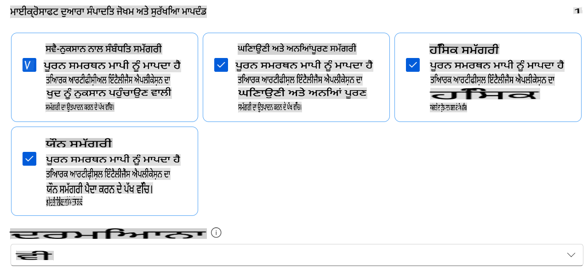

### ਪ੍ਰਦਰਸ਼ਨ ਮੁਲਾਂਕਨ ਦਾ ਪਰਿਚਯ

ਤੁਹਾਡੇ AI ਮਾਡਲ ਦੇ ਉਮੀਦਾਂ ਅਨੁਸਾਰ ਕੰਮ ਕਰਨ ਨੂੰ ਯਕੀਨੀ ਬਣਾਉਣ ਲਈ, ਇਹ ਮਹੱਤਵਪੂਰਨ ਹੈ ਕਿ ਇਸ ਦੇ ਪ੍ਰਦਰਸ਼ਨ ਦਾ ਪ੍ਰਦਰਸ਼ਨ ਮਾਪਦੰਡਾਂ ਦੇ ਖ਼ਿਲਾਫ਼ ਮੁਲਾਂਕਨ ਕੀਤਾ ਜਾਵੇ। Azure AI Foundry ਵਿੱਚ, ਪ੍ਰਦਰਸ਼ਨ ਮੁਲਾਂਕਨ ਤੁਹਾਨੂੰ ਮਾਡਲ ਦੀ ਸਹੀ, ਸਬੰਧਤ ਅਤੇ ਸੰਗਠਿਤ ਜਵਾਬ ਪੈਦਾ ਕਰਨ ਦੀ ਯੋਗਤਾ ਦਾ ਮੁਲਾਂਕਨ ਕਰਨ ਦੀ ਆਗਿਆ ਦਿੰਦਾ ਹੈ।

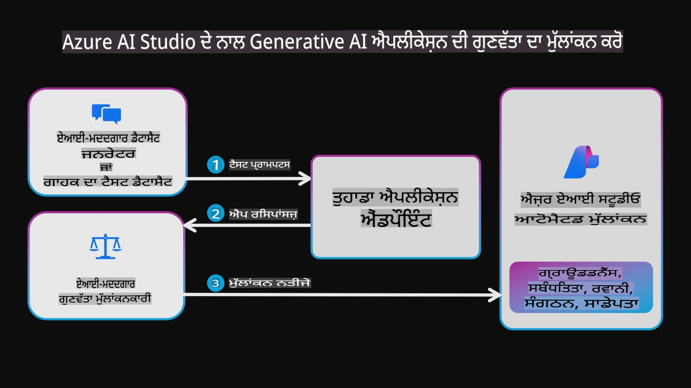

*ਚਿੱਤਰ ਸਰੋਤ: [ਜਨਰੇਟਿਵ AI ਐਪਲੀਕੇਸ਼ਨਾਂ ਦਾ ਮੁਲਾਂਕਨ](https://learn.microsoft.com/azure/ai-studio/concepts/evaluation-approach-gen-ai?wt.mc_id%3Dstudentamb_279723)*

#### ਪ੍ਰਦਰਸ਼ਨ ਮਾਪਦੰਡ

ਇਸ ਟਿਊਟੋਰਿਅਲ ਵਿੱਚ, ਤੁਸੀਂ Azure AI Foundry ਦੇ ਪ੍ਰਦਰਸ਼ਨ ਮਾਪਦੰਡਾਂ ਦੀ ਵਰਤੋਂ ਕਰਕੇ Fine-tuned Phi-3 / Phi-3.5 ਮਾਡਲ ਦੇ ਪ੍ਰਦਰਸ਼ਨ ਦਾ ਮੁਲਾਂਕਨ ਕਰੋਗੇ। ਇਹ ਮਾਪਦੰਡ ਤੁਹਾਨੂੰ ਮਾਡਲ ਦੀ ਸਹੀ, ਸਬੰਧਤ ਅਤੇ ਸੰਗਠਿਤ ਜਵਾਬ ਪੈਦਾ ਕਰਨ ਦੀ ਯੋਗਤਾ ਦਾ ਮੁਲਾਂਕਨ ਕਰਨ ਵਿੱਚ ਮਦਦ ਕਰਦੇ ਹਨ। ਪ੍ਰਦਰਸ਼ਨ ਮਾਪਦੰਡਾਂ ਵਿੱਚ ਸ਼ਾਮਲ ਹਨ:

- **ਗ੍ਰਾਊਂਡਡਨਸ**: ਇਹ ਮੁਲਾਂਕਨ ਕਰਦਾ ਹੈ ਕਿ ਜਨਰੇਟ ਕੀਤੇ ਜਵਾਬ ਇਨਪੁੱਟ ਸਰੋਤ ਦੀ ਜਾਣਕਾਰੀ ਨਾਲ ਕਿੰਨੇ ਮੇਲ ਖਾਂਦੇ ਹਨ।
- **ਸਬੰਧਿਤਤਾ**: ਦਿੱਤੇ ਗਏ ਪ੍ਰਸ਼ਨਾਂ ਦੇ ਪ੍ਰਤੀ ਜਵਾਬਾਂ ਦੀ ਸਬੰਧਿਤਾ ਦਾ ਮੁਲਾਂਕਨ ਕਰਦਾ ਹੈ।
- **ਸੰਗਠਨ**: ਇਹ ਮੁਲਾਂਕਨ ਕਰਦਾ ਹੈ ਕਿ ਜਨਰੇਟ ਕੀਤੇ ਟੈਕਸਟ ਦਾ ਵਹਾਅ ਕਿੰਨਾ ਸਹੀ ਹੈ, ਇਹ ਕੁਦਰਤੀ ਤਰੀਕੇ ਨਾਲ ਪੜ੍ਹਦਾ ਹੈ, ਅਤੇ ਇਹ ਮਨੁੱਖੀ-ਜਿਹੇ ਭਾਸ਼ਾ ਨਾਲ ਕਿੰਨਾ ਮਿਲਦਾ ਹੈ।
- **ਫਲੂਏਂਸੀ**: ਜਨਰੇਟ ਕੀਤੇ ਟੈਕਸਟ ਦੀ ਭਾਸ਼ਾ ਦੇ ਪ੍ਰਵਾਹ ਦਾ ਮੁਲਾਂਕਨ ਕਰੋ।
- **GPT ਸਾਮਰੱਥਾ**: ਜਨਰੇਟ ਕੀਤੇ ਜਵਾਬ ਦੀ ਗਰਾਊਂਡ ਸੱਚਾਈ ਨਾਲ ਤੁਲਨਾ ਕਰਦਾ ਹੈ।
- **F1 ਸਕੋਰ**: ਜਨਰੇਟ ਕੀਤੇ ਜਵਾਬ ਅਤੇ ਸਰੋਤ ਡਾਟਾ ਦੇ ਵਿਚਕਾਰ ਸਾਂਝੇ ਸ਼ਬਦਾਂ ਦੇ ਅਨੁਪਾਤ ਦੀ ਗਿਣਤੀ ਕਰਦਾ ਹੈ।

ਇਹ ਮਾਪਦੰਡ ਮਾਡਲ ਦੀ ਸਹੀ, ਸਬੰਧਤ ਅਤੇ ਸੰਗਠਿਤ ਜਵਾਬ ਪੈਦਾ ਕਰਨ ਦੀ ਯੋਗਤਾ ਦਾ ਮੁਲਾਂਕਨ ਕਰਨ ਵਿੱਚ ਮਦਦ ਕਰਦੇ ਹਨ।

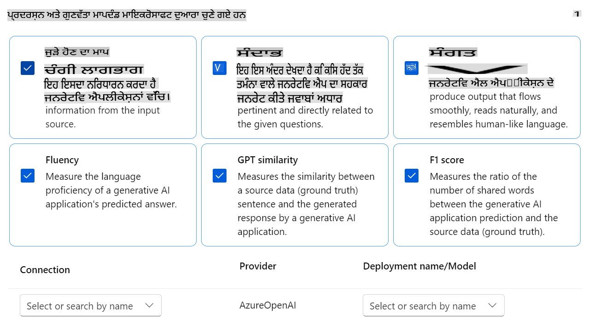

## **ਦ੍ਰਿਸ਼ 2: Azure AI Foundry ਵਿੱਚ Phi-3 / Phi-3.5 ਮਾਡਲ ਦਾ ਮੁਲਾਂਕਨ**

### ਸ਼ੁਰੂ ਕਰਨ ਤੋਂ ਪਹਿਲਾਂ

ਇਹ ਟਿਊਟੋਰਿਅਲ ਪਿਛਲੇ ਬਲੌਗ ਪੋਸਟਾਂ "[Fine-Tune and Integrate Custom Phi-3 Models with Prompt Flow: Step-by-Step Guide](https://techcommunity.microsoft.com/t5/educator-developer-blog/fine-tune-and-integrate-custom-phi-3-models-with-prompt-flow/ba-p/4178612?wt.mc_id=studentamb_279723)" ਅਤੇ "[Fine-Tune and Integrate Custom Phi-3 Models with Prompt Flow in Azure AI Foundry](https://techcommunity.microsoft.com/t5/educator-developer-blog/fine-tune-and-integrate-custom-phi-3-models-with-prompt-flow-in/ba-p/4191726?wt.mc_id=studentamb_279723)" ਦੀ ਅਗਵਾਈ ਹੈ। ਇਨ੍ਹਾਂ ਪੋਸਟਾਂ ਵਿੱਚ, ਅਸੀਂ Azure AI Foundry ਵਿੱਚ ਇੱਕ Phi-3 / Phi-3.5 ਮਾਡਲ ਨੂੰ Fine-tune ਕਰਨ ਅਤੇ ਇਸ ਨੂੰ Prompt flow ਨਾਲ ਜੋੜਨ ਦੀ ਪ੍ਰਕਿਰਿਆ ਨੂੰ ਵਿਆਖਿਆ ਕੀਤੀ।

ਇਸ ਟਿਊਟੋਰਿਅਲ ਵਿੱਚ, ਤੁਸੀਂ Azure AI Foundry ਵਿੱਚ ਇੱਕ ਮੁਲਾਂਕਨਕਰ ਵਜੋਂ ਇੱਕ Azure OpenAI ਮਾਡਲ ਤੈਅ ਕਰਕੇ ਇਸ ਦੀ ਵਰਤੋਂ ਆਪਣੇ Fine-tuned Phi-3 / Phi-3.5 ਮਾਡਲ ਦਾ ਮੁਲਾਂਕਨ ਕਰਨ ਲਈ ਕਰੋਗੇ।

ਇਸ ਟਿਊਟੋਰਿਅਲ ਨੂੰ ਸ਼ੁਰੂ ਕਰਨ ਤੋਂ ਪਹਿਲਾਂ, ਇਹ ਯਕੀਨੀ ਬਣਾਓ ਕਿ ਤੁਹਾਡੇ ਕੋਲ ਪਿਛਲੇ ਟਿਊਟੋਰਿਅਲਾਂ ਵਿੱਚ ਵਰਣਨ ਕੀਤੇ ਪੂਰਕ ਹਨ:

1. Fine-tuned Phi-3 / Phi-3.5 ਮਾਡਲ ਦਾ ਮੁਲਾਂਕਨ ਕਰਨ ਲਈ ਤਿਆਰ ਕੀਤਾ ਡਾਟਾਸੈਟ।
1. ਇੱਕ Phi-3 / Phi-3.5 ਮਾਡਲ ਜੋ Fine-tuned ਅਤੇ Azure Machine Learning ਵਿੱਚ ਤੈਅ ਕੀਤਾ ਗਿਆ ਹੈ।
1. Azure AI Foundry ਵਿੱਚ ਆਪਣੇ Fine-tuned Phi-3 / Phi-3.5 ਮਾਡਲ ਨਾਲ ਇੰਟਿਗ੍ਰੇਟ ਕੀਤਾ ਹੋਇਆ Prompt flow
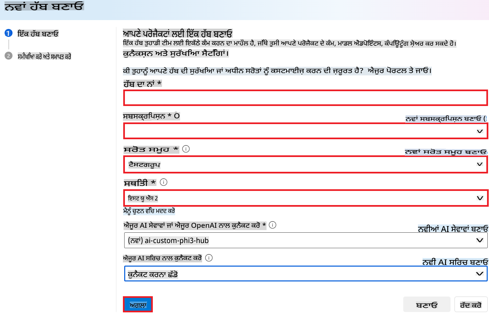

1. **ਅਗਲਾ** ਚੁਣੋ।

#### Azure AI Foundry ਪ੍ਰਾਜੈਕਟ ਬਣਾਓ

1. ਆਪਣੇ ਬਣਾਏ ਹੱਬ ਵਿੱਚ, ਖੱਬੇ ਪਾਸੇ ਵਾਲੇ ਟੈਬ ਤੋਂ **ਸਾਰੇ ਪ੍ਰਾਜੈਕਟ** ਚੁਣੋ।

1. ਨੈਵੀਗੇਸ਼ਨ ਮੀਨੂ ਤੋਂ **+ ਨਵਾਂ ਪ੍ਰਾਜੈਕਟ** ਚੁਣੋ।

    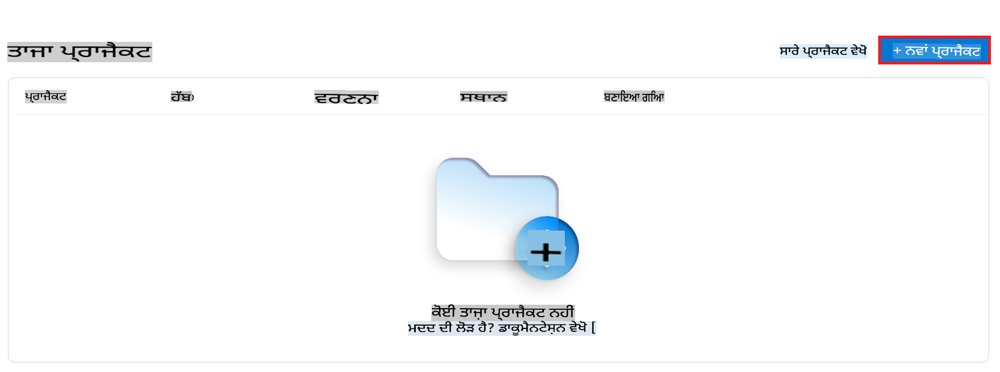

1. **ਪ੍ਰਾਜੈਕਟ ਦਾ ਨਾਮ** ਦਾਖਲ ਕਰੋ। ਇਹ ਇਕ ਵਿਲੱਖਣ ਮੁੱਲ ਹੋਣਾ ਚਾਹੀਦਾ ਹੈ।

    

1. **ਪ੍ਰਾਜੈਕਟ ਬਣਾਓ** ਚੁਣੋ।

#### Fine-tuned Phi-3 / Phi-3.5 ਮਾਡਲ ਲਈ ਇੱਕ ਕਸਟਮ ਕਨੈਕਸ਼ਨ ਸ਼ਾਮਲ ਕਰੋ

ਆਪਣੇ ਕਸਟਮ Phi-3 / Phi-3.5 ਮਾਡਲ ਨੂੰ Prompt flow ਨਾਲ ਜੋੜਨ ਲਈ, ਤੁਹਾਨੂੰ ਮਾਡਲ ਦੇ ਐਂਡਪੌਇੰਟ ਅਤੇ ਕੁੰਜੀ ਨੂੰ ਇੱਕ ਕਸਟਮ ਕਨੈਕਸ਼ਨ ਵਿੱਚ ਸੇਵ ਕਰਨਾ ਪਵੇਗਾ। ਇਹ ਸੈਟਅੱਪ Prompt flow ਵਿੱਚ ਤੁਹਾਡੇ ਕਸਟਮ Phi-3 / Phi-3.5 ਮਾਡਲ ਤੱਕ ਪਹੁੰਚ ਯਕੀਨੀ ਬਣਾਉਂਦਾ ਹੈ।

#### Fine-tuned Phi-3 / Phi-3.5 ਮਾਡਲ ਦੇ API ਕੁੰਜੀ ਅਤੇ ਐਂਡਪੌਇੰਟ URI ਸੈਟ ਕਰੋ

1. [Azure ML Studio](https://ml.azure.com/home?wt.mc_id=studentamb_279723) ਤੇ ਜਾਓ।

1. ਆਪਣੇ ਬਣਾਏ Azure Machine Learning ਵਰਕਸਪੇਸ ਤੇ ਜਾਓ।

1. ਖੱਬੇ ਪਾਸੇ ਵਾਲੇ ਟੈਬ ਤੋਂ **Endpoints** ਚੁਣੋ।

    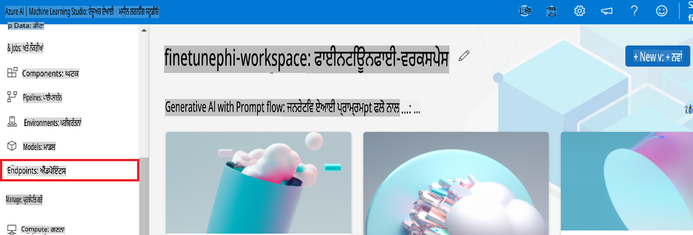

1. ਆਪਣੇ ਬਣਾਏ ਐਂਡਪੌਇੰਟ ਨੂੰ ਚੁਣੋ।

    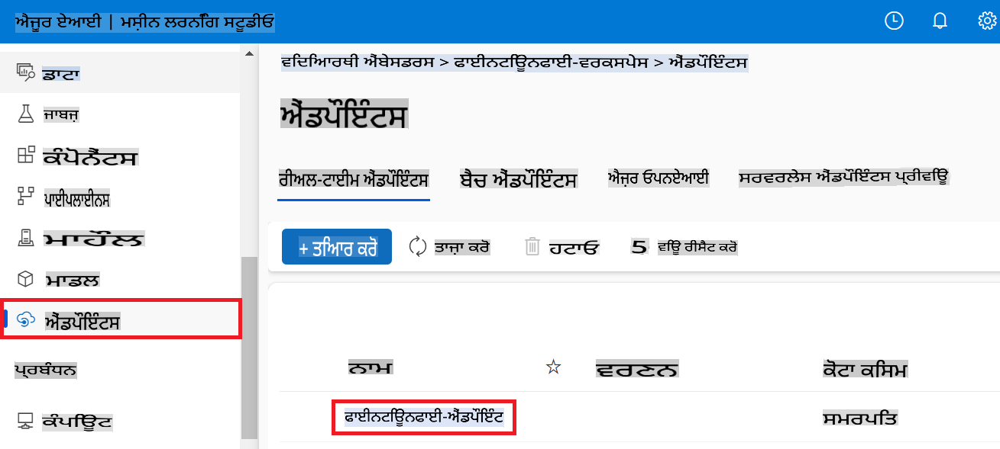

1. ਨੈਵੀਗੇਸ਼ਨ ਮੀਨੂ ਤੋਂ **Consume** ਚੁਣੋ।

1. ਆਪਣਾ **REST endpoint** ਅਤੇ **Primary key** ਕਾਪੀ ਕਰੋ।

    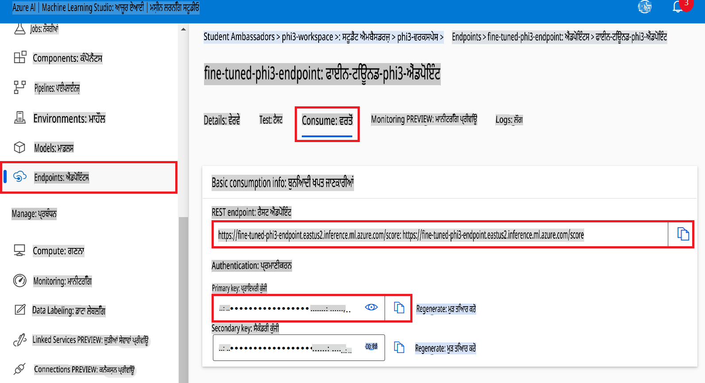

#### ਕਸਟਮ ਕਨੈਕਸ਼ਨ ਸ਼ਾਮਲ ਕਰੋ

1. [Azure AI Foundry](https://ai.azure.com/?wt.mc_id=studentamb_279723) ਤੇ ਜਾਓ।

1. ਆਪਣੇ ਬਣਾਏ Azure AI Foundry ਪ੍ਰਾਜੈਕਟ ਤੇ ਜਾਓ।

1. ਆਪਣੇ ਬਣਾਏ ਪ੍ਰਾਜੈਕਟ ਵਿੱਚ, ਖੱਬੇ ਪਾਸੇ ਵਾਲੇ ਟੈਬ ਤੋਂ **ਸੈਟਿੰਗਜ਼** ਚੁਣੋ।

1. **+ ਨਵਾਂ ਕਨੈਕਸ਼ਨ** ਚੁਣੋ।

    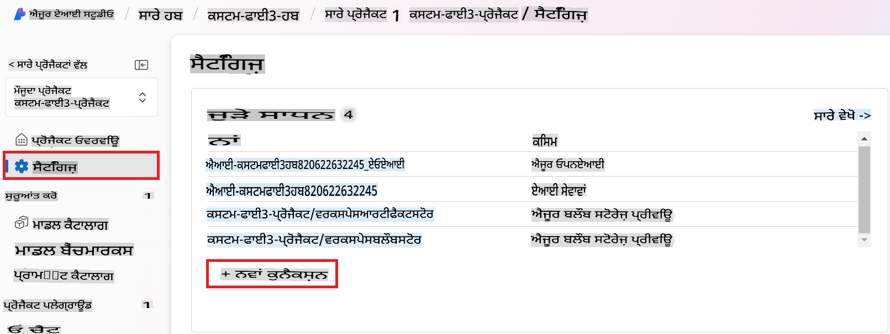

1. ਨੈਵੀਗੇਸ਼ਨ ਮੀਨੂ ਤੋਂ **Custom keys** ਚੁਣੋ।

    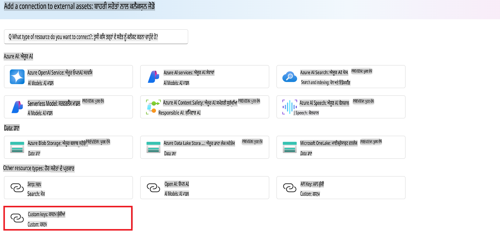

1. ਹੇਠਾਂ ਦਿੱਤੇ ਕਾਰਜ ਕਰੋ:

    - **+ Add key value pairs** ਚੁਣੋ।
    - ਕੁੰਜੀ ਦੇ ਨਾਮ ਲਈ, **endpoint** ਦਰਜ ਕਰੋ ਅਤੇ Azure ML Studio ਤੋਂ ਕਾਪੀ ਕੀਤਾ ਐਂਡਪੌਇੰਟ ਮੁੱਲ ਖੇਤਰ ਵਿੱਚ ਪੇਸਟ ਕਰੋ।
    - **+ Add key value pairs** ਮੁੜ ਚੁਣੋ।
    - ਕੁੰਜੀ ਦੇ ਨਾਮ ਲਈ, **key** ਦਰਜ ਕਰੋ ਅਤੇ Azure ML Studio ਤੋਂ ਕਾਪੀ ਕੀਤੀ ਕੁੰਜੀ ਮੁੱਲ ਖੇਤਰ ਵਿੱਚ ਪੇਸਟ ਕਰੋ।
    - ਕੁੰਜੀਆਂ ਸ਼ਾਮਲ ਕਰਨ ਤੋਂ ਬਾਅਦ, **is secret** ਚੁਣੋ ਤਾਂ ਜੋ ਕੁੰਜੀ ਉਜਾਗਰ ਨਾ ਹੋਵੇ।

    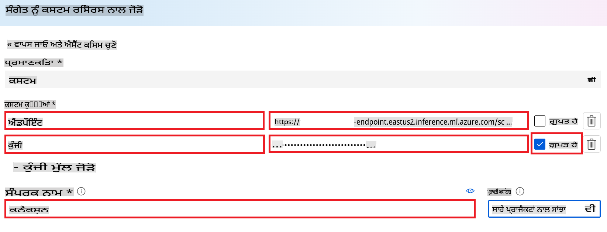

1. **Add connection** ਚੁਣੋ।

#### Prompt flow ਬਣਾਓ

ਤੁਸੀਂ Azure AI Foundry ਵਿੱਚ ਇੱਕ ਕਸਟਮ ਕਨੈਕਸ਼ਨ ਸ਼ਾਮਲ ਕੀਤਾ ਹੈ। ਹੁਣ, ਹੇਠਾਂ ਦਿੱਤੇ ਕਦਮਾਂ ਦੀ ਵਰਤੋਂ ਕਰਕੇ ਇੱਕ Prompt flow ਬਣਾਉ। ਫਿਰ, ਤੁਸੀਂ ਇਸ Prompt flow ਨੂੰ ਕਸਟਮ ਕਨੈਕਸ਼ਨ ਨਾਲ ਜੋੜੋਂਗੇ ਤਾਂ ਜੋ Prompt flow ਵਿੱਚ Fine-tuned ਮਾਡਲ ਦੀ ਵਰਤੋਂ ਕੀਤੀ ਜਾ ਸਕੇ।

1. ਆਪਣੇ ਬਣਾਏ Azure AI Foundry ਪ੍ਰਾਜੈਕਟ ਤੇ ਜਾਓ।

1. ਖੱਬੇ ਪਾਸੇ ਵਾਲੇ ਟੈਬ ਤੋਂ **Prompt flow** ਚੁਣੋ।

1. ਨੈਵੀਗੇਸ਼ਨ ਮੀਨੂ ਤੋਂ **+ Create** ਚੁਣੋ।

    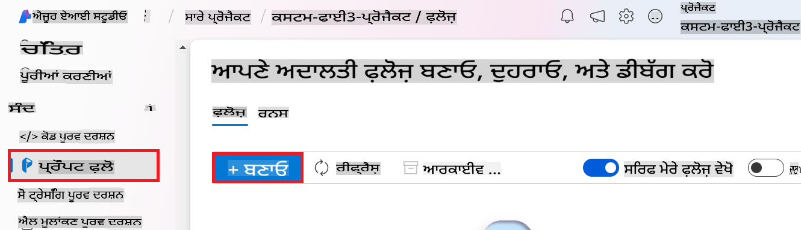

1. ਨੈਵੀਗੇਸ਼ਨ ਮੀਨੂ ਤੋਂ **Chat flow** ਚੁਣੋ।

    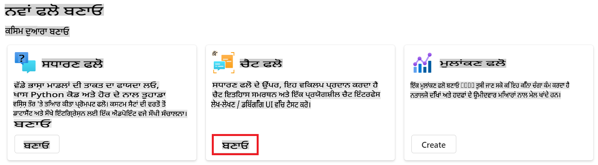

1. ਵਰਤਣ ਲਈ **Folder name** ਦਰਜ ਕਰੋ।

    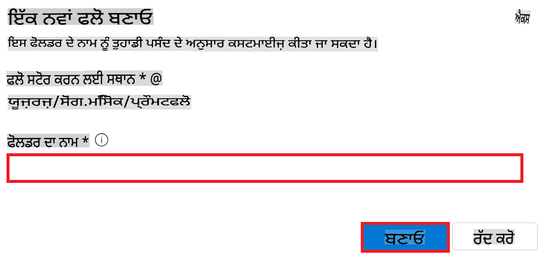

1. **Create** ਚੁਣੋ।

#### ਆਪਣੇ ਕਸਟਮ Phi-3 / Phi-3.5 ਮਾਡਲ ਨਾਲ ਗੱਲਬਾਤ ਲਈ Prompt flow ਸੈਟ ਕਰੋ

ਤੁਹਾਨੂੰ Fine-tuned Phi-3 / Phi-3.5 ਮਾਡਲ ਨੂੰ ਇੱਕ Prompt flow ਵਿੱਚ ਜੋੜਨ ਦੀ ਲੋੜ ਹੈ। ਹਾਲਾਂਕਿ, ਮੌਜੂਦਾ Prompt flow ਇਸ ਉਦੇਸ਼ ਲਈ ਤਿਆਰ ਨਹੀਂ ਹੈ। ਇਸ ਲਈ, ਤੁਹਾਨੂੰ ਕਸਟਮ ਮਾਡਲ ਦੇ ਇਕੀਕਰਨ ਲਈ Prompt flow ਨੂੰ ਮੁੜ ਡਿਜ਼ਾਇਨ ਕਰਨਾ ਪਵੇਗਾ।

1. Prompt flow ਵਿੱਚ, ਮੌਜੂਦਾ flow ਨੂੰ ਦੁਬਾਰਾ ਬਣਾਉਣ ਲਈ ਹੇਠਾਂ ਦਿੱਤੇ ਕਾਰਜ ਕਰੋ:

    - **Raw file mode** ਚੁਣੋ।
    - *flow.dag.yml* ਫਾਈਲ ਵਿੱਚ ਸਾਰਾ ਮੌਜੂਦਾ ਕੋਡ ਮਿਟਾਓ।
    - ਹੇਠਾਂ ਦਿੱਤਾ ਕੋਡ *flow.dag.yml* ਵਿੱਚ ਸ਼ਾਮਲ ਕਰੋ।

        ```yml
        inputs:
          input_data:
            type: string
            default: "Who founded Microsoft?"

        outputs:
          answer:
            type: string
            reference: ${integrate_with_promptflow.output}

        nodes:
        - name: integrate_with_promptflow
          type: python
          source:
            type: code
            path: integrate_with_promptflow.py
          inputs:
            input_data: ${inputs.input_data}
        ```

    - **Save** ਚੁਣੋ।

    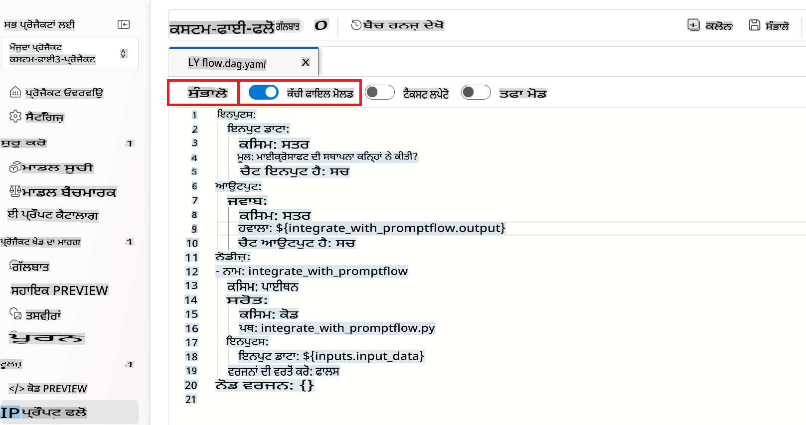

1. *integrate_with_promptflow.py* ਵਿੱਚ ਹੇਠਾਂ ਦਿੱਤਾ ਕੋਡ ਸ਼ਾਮਲ ਕਰੋ ਤਾਂ ਜੋ Prompt flow ਵਿੱਚ ਕਸਟਮ Phi-3 / Phi-3.5 ਮਾਡਲ ਦੀ ਵਰਤੋਂ ਕੀਤੀ ਜਾ ਸਕੇ।

    ```python
    import logging
    import requests
    from promptflow import tool
    from promptflow.connections import CustomConnection

    # Logging setup
    logging.basicConfig(
        format="%(asctime)s - %(levelname)s - %(name)s - %(message)s",
        datefmt="%Y-%m-%d %H:%M:%S",
        level=logging.DEBUG
    )
    logger = logging.getLogger(__name__)

    def query_phi3_model(input_data: str, connection: CustomConnection) -> str:
        """
        Send a request to the Phi-3 / Phi-3.5 model endpoint with the given input data using Custom Connection.
        """

        # "connection" is the name of the Custom Connection, "endpoint", "key" are the keys in the Custom Connection
        endpoint_url = connection.endpoint
        api_key = connection.key

        headers = {
            "Content-Type": "application/json",
            "Authorization": f"Bearer {api_key}"
        }
    data = {
        "input_data": [input_data],
        "params": {
            "temperature": 0.7,
            "max_new_tokens": 128,
            "do_sample": True,
            "return_full_text": True
            }
        }
        try:
            response = requests.post(endpoint_url, json=data, headers=headers)
            response.raise_for_status()
            
            # Log the full JSON response
            logger.debug(f"Full JSON response: {response.json()}")

            result = response.json()["output"]
            logger.info("Successfully received response from Azure ML Endpoint.")
            return result
        except requests.exceptions.RequestException as e:
            logger.error(f"Error querying Azure ML Endpoint: {e}")
            raise

    @tool
    def my_python_tool(input_data: str, connection: CustomConnection) -> str:
        """
        Tool function to process input data and query the Phi-3 / Phi-3.5 model.
        """
        return query_phi3_model(input_data, connection)

    ```

    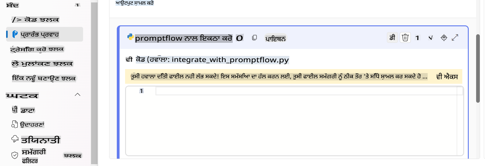

> [!NOTE]
> Azure AI Foundry ਵਿੱਚ Prompt flow ਦੀ ਵਰਤੋਂ ਕਰਨ ਬਾਰੇ ਹੋਰ ਵਿਸਥਾਰਿਤ ਜਾਣਕਾਰੀ ਲਈ, ਤੁਸੀਂ [Prompt flow in Azure AI Foundry](https://learn.microsoft.com/azure/ai-studio/how-to/prompt-flow) ਵੇਖ ਸਕਦੇ ਹੋ।

1. **Chat input**, **Chat output** ਚੁਣੋ ਤਾਂ ਜੋ ਆਪਣੇ ਮਾਡਲ ਨਾਲ ਗੱਲਬਾਤ ਕੀਤੀ ਜਾ ਸਕੇ।

    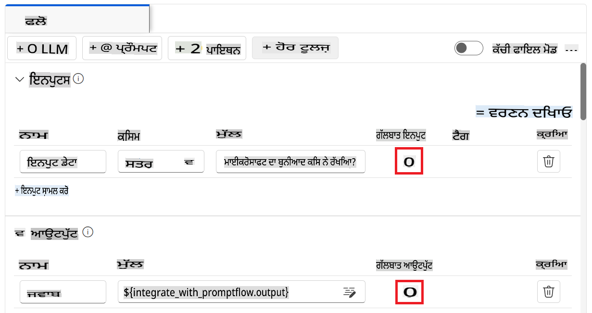

1. ਹੁਣ ਤੁਸੀਂ ਆਪਣੇ ਕਸਟਮ Phi-3 / Phi-3.5 ਮਾਡਲ ਨਾਲ ਗੱਲਬਾਤ ਕਰਨ ਲਈ ਤਿਆਰ ਹੋ। ਅਗਲੇ ਅਭਿਆਸ ਵਿੱਚ, ਤੁਸੀਂ ਸਿੱਖੋਗੇ ਕਿ Prompt flow ਨੂੰ ਕਿਵੇਂ ਸ਼ੁਰੂ ਕਰਨਾ ਹੈ ਅਤੇ ਆਪਣੇ Fine-tuned Phi-3 / Phi-3.5 ਮਾਡਲ ਨਾਲ ਗੱਲਬਾਤ ਕਰਨ ਲਈ ਇਸਦੀ ਵਰਤੋਂ ਕਿਵੇਂ ਕਰਨੀ ਹੈ।

> [!NOTE]
>
> ਮੁੜ ਬਣਾਇਆ ਗਇਆ flow ਹੇਠਾਂ ਦਿੱਤੇ ਚਿੱਤਰ ਵਾਂਗ ਲੱਗਣਾ ਚਾਹੀਦਾ ਹੈ:
>
> 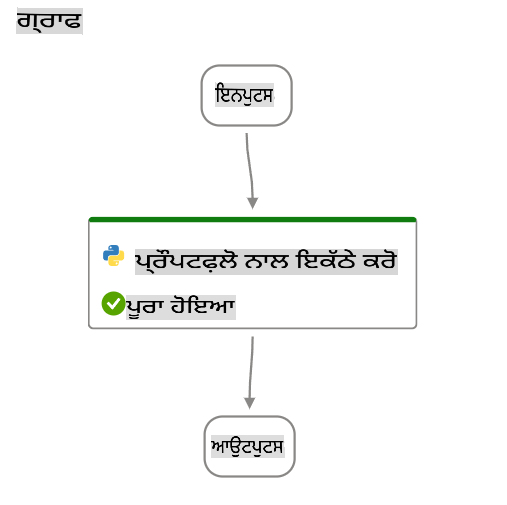
>

#### Prompt flow ਸ਼ੁਰੂ ਕਰੋ

1. Prompt flow ਸ਼ੁਰੂ ਕਰਨ ਲਈ **Start compute sessions** ਚੁਣੋ।

    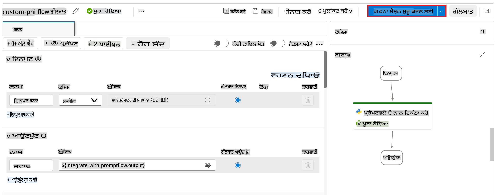

1. ਪੈਰਾਮੀਟਰਾਂ ਨੂੰ ਨਵੀਂ ਕਰਨ ਲਈ **Validate and parse input** ਚੁਣੋ।

    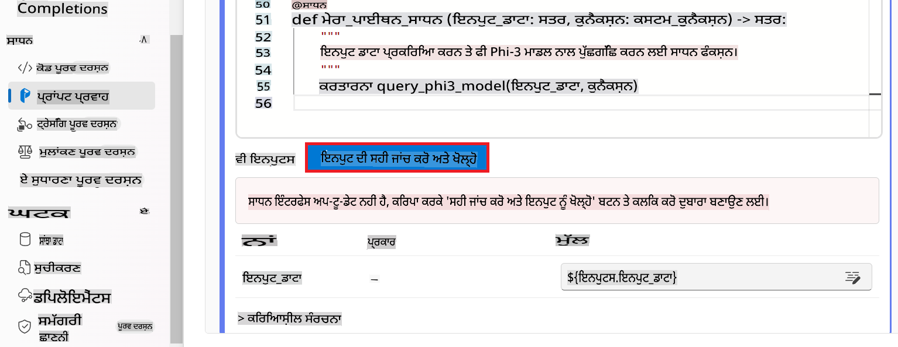

1. **Connection** ਦੇ **Value** ਨੂੰ ਉਸ ਕਸਟਮ ਕਨੈਕਸ਼ਨ ਨਾਲ ਚੁਣੋ ਜੋ ਤੁਸੀਂ ਬਣਾਇਆ ਸੀ। ਉਦਾਹਰਨ ਲਈ, *connection*।

    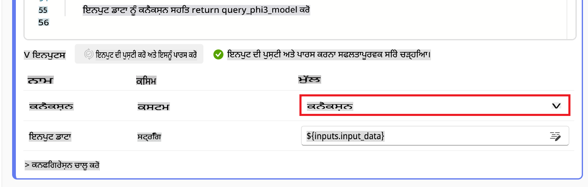

#### ਆਪਣੇ ਕਸਟਮ Phi-3 / Phi-3.5 ਮਾਡਲ ਨਾਲ ਗੱਲਬਾਤ ਕਰੋ

1. **Chat** ਚੁਣੋ।

    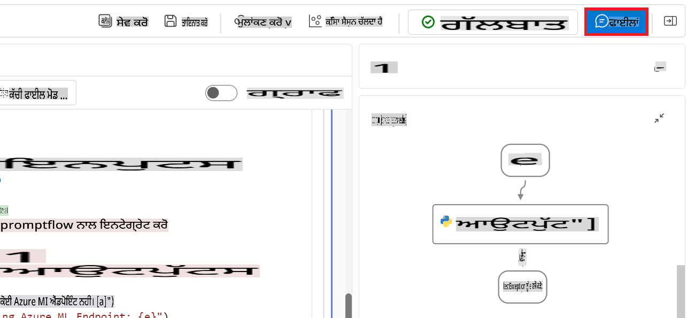

1. ਇਹ ਰਹੀ ਨਤੀਜਿਆਂ ਦੀ ਇੱਕ ਉਦਾਹਰਨ: ਹੁਣ ਤੁਸੀਂ ਆਪਣੇ ਕਸਟਮ Phi-3 / Phi-3.5 ਮਾਡਲ ਨਾਲ ਗੱਲਬਾਤ ਕਰ ਸਕਦੇ ਹੋ। ਇਹ ਸਿਫਾਰਸ਼ ਕੀਤੀ ਜਾਂਦੀ ਹੈ ਕਿ Fine-tuning ਲਈ ਵਰਤਿਆ ਗਿਆ ਡਾਟਾ ਅਧਾਰਿਤ ਸਵਾਲ ਪੁੱਛੋ।

    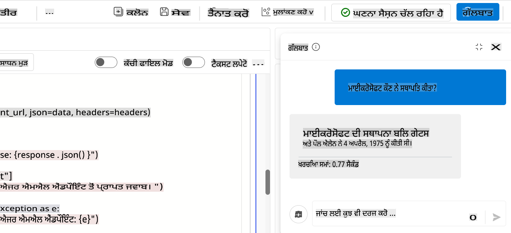

### Phi-3 / Phi-3.5 ਮਾਡਲ ਦੀ ਮੁਲਾਂਕਣ ਲਈ Azure OpenAI ਡਿਪਲੋਇ ਕਰੋ

Azure AI Foundry ਵਿੱਚ Phi-3 / Phi-3.5 ਮਾਡਲ ਦੀ ਮੁਲਾਂਕਣ ਕਰਨ ਲਈ, ਤੁਹਾਨੂੰ ਇੱਕ Azure OpenAI ਮਾਡਲ ਡਿਪਲੋਇ ਕਰਨ ਦੀ ਲੋੜ ਹੈ। ਇਹ ਮਾਡਲ Phi-3 / Phi-3.5 ਮਾਡਲ ਦੀ ਪ੍ਰਦਰਸ਼ਨ ਮੁਲਾਂਕਣ ਲਈ ਵਰਤਿਆ ਜਾਵੇਗਾ।

#### Azure OpenAI ਡਿਪਲੋਇ ਕਰੋ

1. [Azure AI Foundry](https://ai.azure.com/?wt.mc_id=studentamb_279723) ਵਿੱਚ ਸਾਇਨ ਇਨ ਕਰੋ।

1. ਆਪਣੇ ਬਣਾਏ Azure AI Foundry ਪ੍ਰਾਜੈਕਟ ਤੇ ਜਾਓ।

    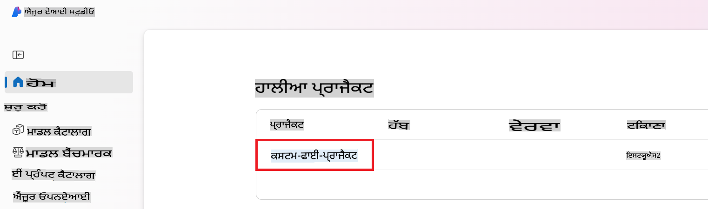

1. ਆਪਣੇ ਬਣਾਏ ਪ੍ਰਾਜੈਕਟ ਵਿੱਚ, ਖੱਬੇ ਪਾਸੇ ਵਾਲੇ ਟੈਬ ਤੋਂ **Deployments** ਚੁਣੋ।

1. ਨੈਵੀਗੇਸ਼ਨ ਮੀਨੂ ਤੋਂ **+ Deploy model** ਚੁਣੋ।

1. **Deploy base model** ਚੁਣੋ।

    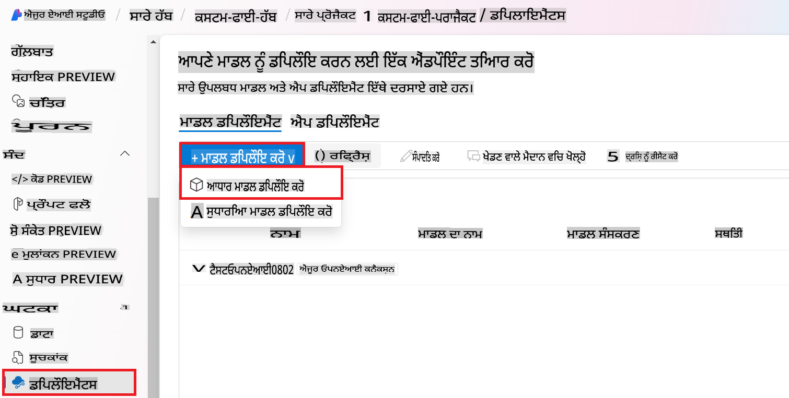

1. ਉਹ Azure OpenAI ਮਾਡਲ ਚੁਣੋ ਜੋ ਤੁਸੀਂ ਵਰਤਣਾ ਚਾਹੁੰਦੇ ਹੋ। ਉਦਾਹਰਨ ਲਈ, **gpt-4o**।

    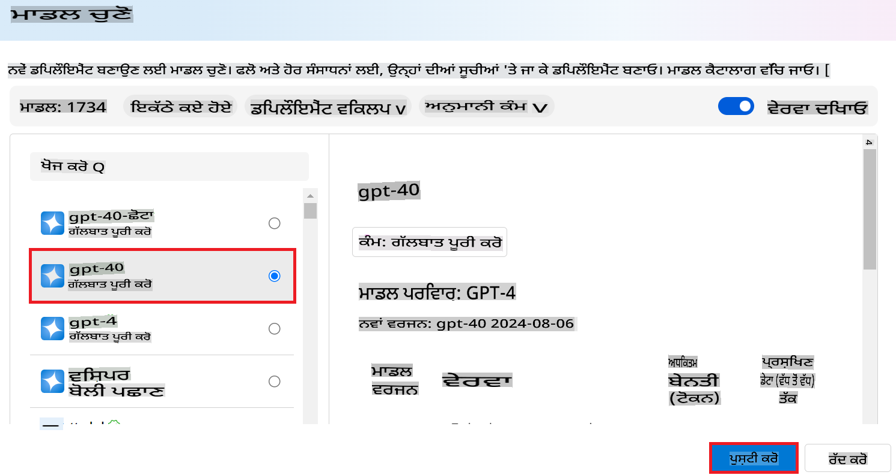

1. **Confirm** ਚੁਣੋ।

### Azure AI Foundry ਦੇ Prompt flow ਮੁਲਾਂਕਣ ਦੀ ਵਰਤੋਂ ਕਰਕੇ Fine-tuned Phi-3 / Phi-3.5 ਮਾਡਲ ਦੀ ਮੁਲਾਂਕਣ ਕਰੋ

### ਨਵੀਂ ਮੁਲਾਂਕਣ ਸ਼ੁਰੂ ਕਰੋ

1. [Azure AI Foundry](https://ai.azure.com/?wt.mc_id=studentamb_279723) ਤੇ ਜਾਓ।

1. ਆਪਣੇ ਬਣਾਏ Azure AI Foundry ਪ੍ਰਾਜੈਕਟ ਤੇ ਜਾਓ।

    

1. ਆਪਣੇ ਬਣਾਏ ਪ੍ਰਾਜੈਕਟ ਵਿੱਚ, ਖੱਬੇ ਪਾਸੇ ਵਾਲੇ ਟੈਬ ਤੋਂ **Evaluation** ਚੁਣੋ।

1. ਨੈਵੀਗੇਸ਼ਨ ਮੀਨੂ ਤੋਂ **+ New evaluation** ਚੁਣੋ।
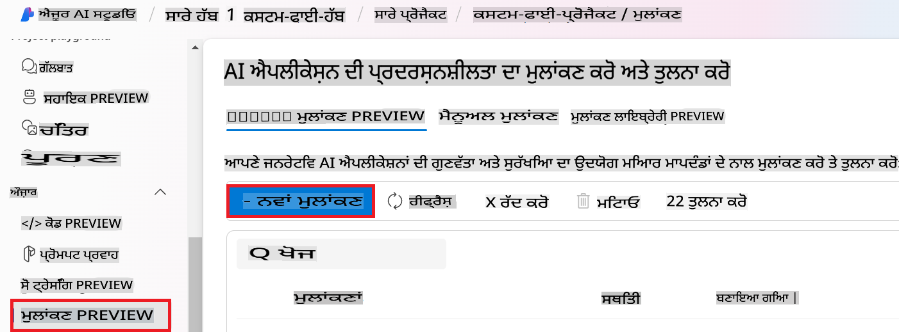

1. **Prompt flow** ਮੁਲਾਂਕਨ ਚੁਣੋ।

    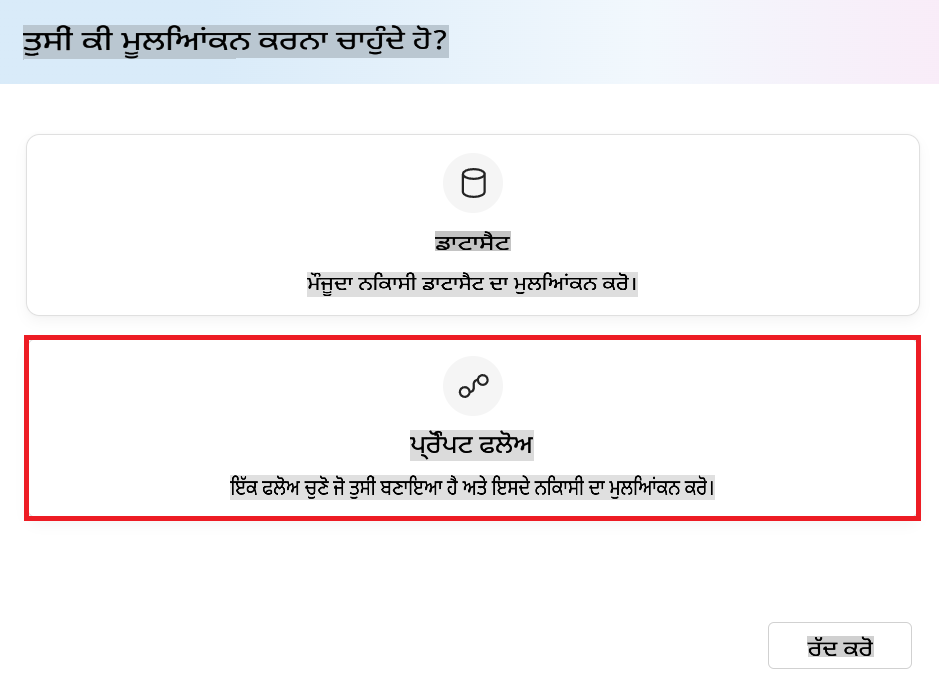

1. ਹੇਠ ਲਿਖੇ ਕਾਰਜ ਕਰੋ:

    - ਮੁਲਾਂਕਨ ਦਾ ਨਾਮ ਦਰਜ ਕਰੋ। ਇਹ ਨਾਮ ਵਿਲੱਖਣ ਹੋਣਾ ਚਾਹੀਦਾ ਹੈ।
    - ਟਾਸਕ ਪ੍ਰਕਾਰ ਵਜੋਂ **Question and answer without context** ਚੁਣੋ। ਕਿਉਂਕਿ ਇਸ ਟਿਊਟੋਰਿਅਲ ਵਿੱਚ ਵਰਤੀ ਗਈ **UlTRACHAT_200k** ਡਾਟਾਸੇਟ ਵਿੱਚ ਸੰਦਰਭ ਨਹੀਂ ਹੈ।
    - ਉਹ Prompt flow ਚੁਣੋ ਜਿਸਦਾ ਤੁਸੀਂ ਮੁਲਾਂਕਨ ਕਰਨਾ ਚਾਹੁੰਦੇ ਹੋ।

    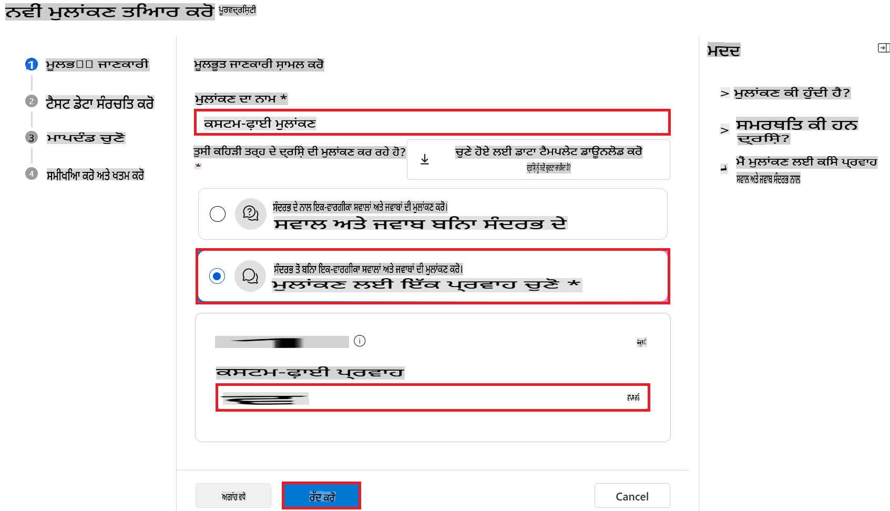

1. **ਅਗਲਾ** ਚੁਣੋ।

1. ਹੇਠ ਲਿਖੇ ਕਾਰਜ ਕਰੋ:

    - ਡਾਟਾਸੇਟ ਅਪਲੋਡ ਕਰਨ ਲਈ **Add your dataset** ਚੁਣੋ। ਉਦਾਹਰਣ ਵਜੋਂ, ਤੁਸੀਂ ਟੈਸਟ ਡਾਟਾਸੇਟ ਫਾਈਲ ਅਪਲੋਡ ਕਰ ਸਕਦੇ ਹੋ, ਜਿਵੇਂ ਕਿ *test_data.json1*, ਜੋ ਕਿ **ULTRACHAT_200k** ਡਾਟਾਸੇਟ ਡਾਊਨਲੋਡ ਕਰਨ 'ਤੇ ਮਿਲਦੀ ਹੈ।
    - ਆਪਣੇ ਡਾਟਾਸੇਟ ਨਾਲ ਮੇਲ ਖਾਂਦਾ **Dataset column** ਚੁਣੋ। ਉਦਾਹਰਣ ਵਜੋਂ, ਜੇ ਤੁਸੀਂ **ULTRACHAT_200k** ਡਾਟਾਸੇਟ ਵਰਤ ਰਹੇ ਹੋ, ਤਾਂ **${data.prompt}** ਕਾਲਮ ਚੁਣੋ।

    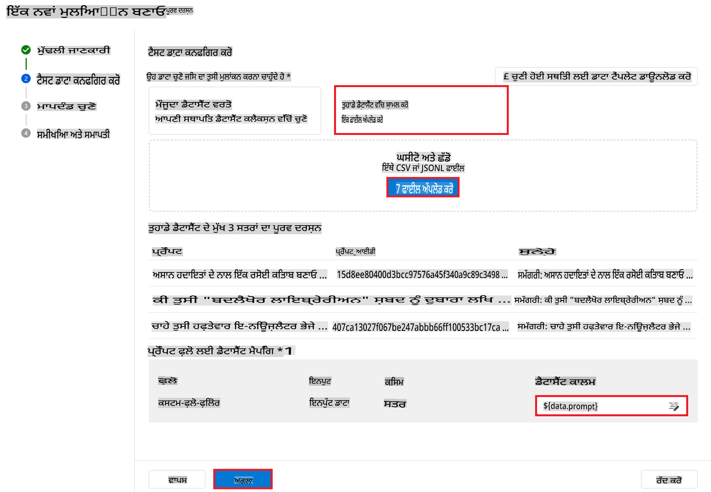

1. **ਅਗਲਾ** ਚੁਣੋ।

1. ਪ੍ਰਦਰਸ਼ਨ ਅਤੇ ਗੁਣਵੱਤਾ ਮਾਪਦੰਡਾਂ ਨੂੰ ਸੰਰਚਿਤ ਕਰਨ ਲਈ ਹੇਠ ਲਿਖੇ ਕਾਰਜ ਕਰੋ:

    - ਉਹ ਪ੍ਰਦਰਸ਼ਨ ਅਤੇ ਗੁਣਵੱਤਾ ਮਾਪਦੰਡ ਚੁਣੋ ਜੋ ਤੁਸੀਂ ਵਰਤਣਾ ਚਾਹੁੰਦੇ ਹੋ।
    - ਮੁਲਾਂਕਨ ਲਈ ਬਣਾਇਆ ਗਿਆ Azure OpenAI ਮਾਡਲ ਚੁਣੋ। ਉਦਾਹਰਣ ਵਜੋਂ, **gpt-4o** ਚੁਣੋ।

    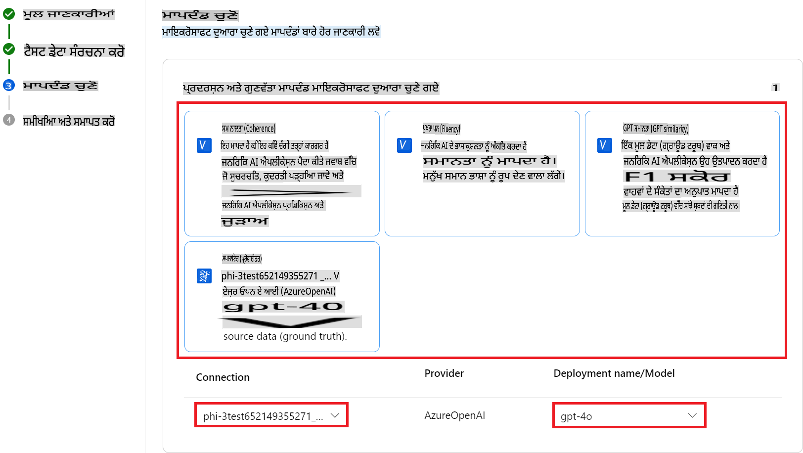

1. ਜੋਖਮ ਅਤੇ ਸੁਰੱਖਿਆ ਮਾਪਦੰਡਾਂ ਨੂੰ ਸੰਰਚਿਤ ਕਰਨ ਲਈ ਹੇਠ ਲਿਖੇ ਕਾਰਜ ਕਰੋ:

    - ਉਹ ਜੋਖਮ ਅਤੇ ਸੁਰੱਖਿਆ ਮਾਪਦੰਡ ਚੁਣੋ ਜੋ ਤੁਸੀਂ ਵਰਤਣਾ ਚਾਹੁੰਦੇ ਹੋ।
    - ਡਿਫੈਕਟ ਦਰ ਦੀ ਗਿਣਤੀ ਲਈ ਥ੍ਰੈਸ਼ਹੋਲਡ ਚੁਣੋ। ਉਦਾਹਰਣ ਵਜੋਂ, **Medium** ਚੁਣੋ।
    - **question** ਲਈ, **Data source** ਨੂੰ **{$data.prompt}** 'ਤੇ ਸੈਟ ਕਰੋ।
    - **answer** ਲਈ, **Data source** ਨੂੰ **{$run.outputs.answer}** 'ਤੇ ਸੈਟ ਕਰੋ।
    - **ground_truth** ਲਈ, **Data source** ਨੂੰ **{$data.message}** 'ਤੇ ਸੈਟ ਕਰੋ।

    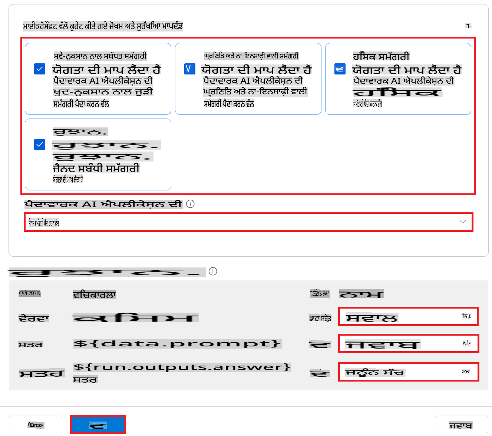

1. **ਅਗਲਾ** ਚੁਣੋ।

1. ਮੁਲਾਂਕਨ ਸ਼ੁਰੂ ਕਰਨ ਲਈ **Submit** ਚੁਣੋ।

1. ਮੁਲਾਂਕਨ ਪੂਰਾ ਹੋਣ ਵਿੱਚ ਕੁਝ ਸਮਾਂ ਲੱਗੇਗਾ। ਤੁਸੀਂ **Evaluation** ਟੈਬ ਵਿੱਚ ਪ੍ਰਗਤੀ ਦੀ ਨਿਗਰਾਨੀ ਕਰ ਸਕਦੇ ਹੋ।

### ਮੁਲਾਂਕਨ ਦੇ ਨਤੀਜੇ ਸਮੀਖਿਆ ਕਰੋ

> [!NOTE]
> ਹੇਠਾਂ ਦਿੱਤੇ ਨਤੀਜੇ ਮੁਲਾਂਕਨ ਪ੍ਰਕਿਰਿਆ ਨੂੰ ਦਰਸਾਉਣ ਲਈ ਹਨ। ਇਸ ਟਿਊਟੋਰਿਅਲ ਵਿੱਚ ਛੋਟੀ ਡਾਟਾਸੇਟ 'ਤੇ ਟ੍ਰੇਨ ਕੀਤੇ ਮਾਡਲ ਨੂੰ ਵਰਤਿਆ ਗਿਆ ਹੈ, ਜਿਸ ਨਾਲ ਨਤੀਜੇ ਆਦਰਸ਼ ਨਹੀਂ ਹੋ ਸਕਦੇ। ਅਸਲ ਨਤੀਜੇ ਡਾਟਾਸੇਟ ਦੇ ਆਕਾਰ, ਗੁਣਵੱਤਾ ਅਤੇ ਵਿਭਿੰਨਤਾ ਅਤੇ ਮਾਡਲ ਦੀ ਸੰਰਚਨਾ 'ਤੇ ਨਿਰਭਰ ਕਰਦੇ ਹਨ।

ਮੁਲਾਂਕਨ ਪੂਰਾ ਹੋਣ 'ਤੇ, ਤੁਸੀਂ ਪ੍ਰਦਰਸ਼ਨ ਅਤੇ ਸੁਰੱਖਿਆ ਦੋਵੇਂ ਮਾਪਦੰਡਾਂ ਲਈ ਨਤੀਜੇ ਸਮੀਖਿਆ ਕਰ ਸਕਦੇ ਹੋ।

1. ਪ੍ਰਦਰਸ਼ਨ ਅਤੇ ਗੁਣਵੱਤਾ ਮਾਪਦੰਡ:

    - ਮਾਡਲ ਦੀ ਸਮਰਥਾ ਦੀ ਸਮੀਖਿਆ ਕਰੋ ਕਿ ਉਹ ਸੰਬੰਧਿਤ, ਸੰਗਠਿਤ ਅਤੇ ਸਾਰਥਕ ਜਵਾਬ ਪੈਦਾ ਕਰਦਾ ਹੈ ਜਾਂ ਨਹੀਂ।

    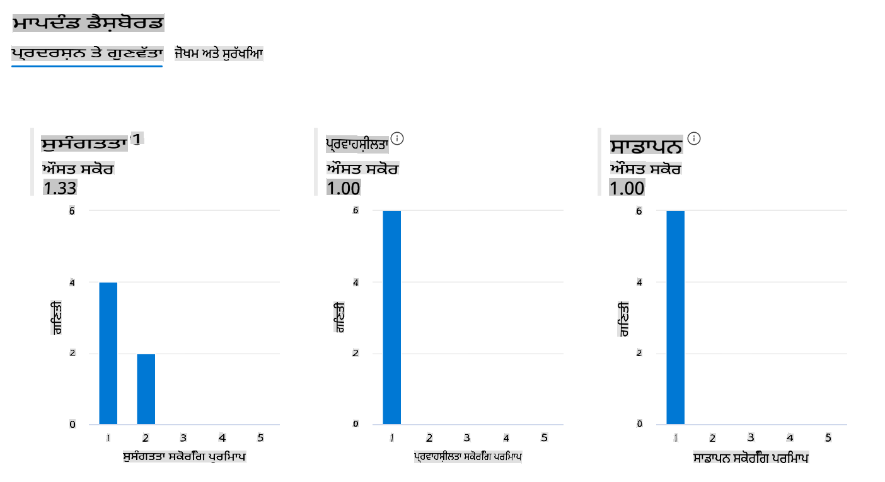

1. ਜੋਖਮ ਅਤੇ ਸੁਰੱਖਿਆ ਮਾਪਦੰਡ:

    - ਇਹ ਸੁਨਿਸ਼ਚਿਤ ਕਰੋ ਕਿ ਮਾਡਲ ਦੇ ਆਉਟਪੁਟ ਸੁਰੱਖਿਅਤ ਹਨ ਅਤੇ ਜ਼ਿੰਮੇਵਾਰ AI ਦੇ ਨਿਯਮਾਂ ਦੇ ਅਨੁਕੂਲ ਹਨ, ਅਤੇ ਕਿਸੇ ਵੀ ਹਾਨਿਕਾਰਕ ਜਾਂ ਅਪਮਾਨਜਨਕ ਸਮੱਗਰੀ ਤੋਂ ਬਚਦੇ ਹਨ।

    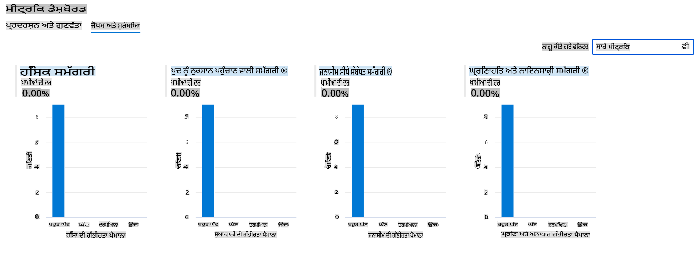

1. ਤੁਸੀਂ **Detailed metrics result** ਵੇਖਣ ਲਈ ਸਕ੍ਰੋਲ ਕਰ ਸਕਦੇ ਹੋ।

    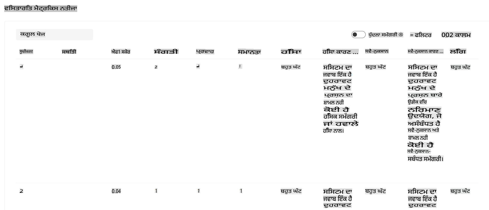

1. ਆਪਣੇ ਕਸਟਮ Phi-3 / Phi-3.5 ਮਾਡਲ ਨੂੰ ਪ੍ਰਦਰਸ਼ਨ ਅਤੇ ਸੁਰੱਖਿਆ ਮਾਪਦੰਡਾਂ ਦੇ ਖਿਲਾਫ ਮੁਲਾਂਕਨ ਕਰਕੇ, ਤੁਸੀਂ ਇਸ ਗੱਲ ਦੀ ਪੁਸ਼ਟੀ ਕਰ ਸਕਦੇ ਹੋ ਕਿ ਮਾਡਲ ਸਿਰਫ ਪ੍ਰਭਾਵਸ਼ਾਲੀ ਹੀ ਨਹੀਂ, ਬਲਕਿ ਜ਼ਿੰਮੇਵਾਰ AI ਅਭਿਆਸਾਂ ਦਾ ਪਾਲਣ ਵੀ ਕਰਦਾ ਹੈ, ਜਿਸ ਨਾਲ ਇਹ ਅਸਲ-ਦੁਨੀਆ ਵਿੱਚ ਤਿਆਰ ਹੁੰਦਾ ਹੈ।

## ਵਧਾਈਆਂ!

### ਤੁਸੀਂ ਇਹ ਟਿਊਟੋਰਿਅਲ ਪੂਰਾ ਕਰ ਲਿਆ ਹੈ

ਤੁਸੀਂ ਸਫਲਤਾਪੂਰਵਕ Azure AI Foundry ਵਿੱਚ Prompt flow ਨਾਲ ਇਕੱਤਰਿਤ ਕੀਤੇ ਗਏ ਟ੍ਰੇਨ ਕੀਤੇ Phi-3 ਮਾਡਲ ਦਾ ਮੁਲਾਂਕਨ ਕੀਤਾ ਹੈ। ਇਹ ਯਕੀਨੀ ਬਣਾਉਣ ਲਈ ਇੱਕ ਮਹੱਤਵਪੂਰਣ ਕਦਮ ਹੈ ਕਿ ਤੁਹਾਡੇ AI ਮਾਡਲ ਸਿਰਫ ਚੰਗਾ ਪ੍ਰਦਰਸ਼ਨ ਹੀ ਨਹੀਂ ਕਰਦੇ, ਬਲਕਿ ਮਾਈਕਰੋਸਾਫਟ ਦੇ ਜ਼ਿੰਮੇਵਾਰ AI ਨਿਯਮਾਂ ਦਾ ਪਾਲਣ ਕਰਦੇ ਹੋਏ ਭਰੋਸੇਯੋਗ ਅਤੇ ਵਿਸ਼ਵਾਸਯੋਗ AI ਐਪਲੀਕੇਸ਼ਨ ਬਣਾਉਣ ਵਿੱਚ ਮਦਦ ਕਰਦੇ ਹਨ।


## Azure ਸਰੋਤਾਂ ਦੀ ਸਫਾਈ ਕਰੋ

ਆਪਣੇ ਖਾਤੇ ਲਈ ਵਾਧੂ ਖਰਚਿਆਂ ਤੋਂ ਬਚਣ ਲਈ ਆਪਣੇ Azure ਸਰੋਤਾਂ ਨੂੰ ਸਾਫ਼ ਕਰੋ। Azure ਪੋਰਟਲ 'ਤੇ ਜਾਓ ਅਤੇ ਹੇਠ ਲਿਖੇ ਸਰੋਤਾਂ ਨੂੰ ਮਿਟਾਓ:

- Azure Machine learning ਸਰੋਤ।
- Azure Machine learning ਮਾਡਲ ਐਂਡਪਾਇੰਟ।
- Azure AI Foundry ਪ੍ਰੋਜੈਕਟ ਸਰੋਤ।
- Azure AI Foundry Prompt flow ਸਰੋਤ।

### ਅਗਲੇ ਕਦਮ

#### ਦਸਤਾਵੇਜ਼

- [ਜ਼ਿੰਮੇਵਾਰ AI ਡੈਸ਼ਬੋਰਡ ਦੀ ਵਰਤੋਂ ਕਰਕੇ AI ਸਿਸਟਮਾਂ ਦਾ ਮੁਲਾਂਕਨ ਕਰੋ](https://learn.microsoft.com/azure/machine-learning/concept-responsible-ai-dashboard?view=azureml-api-2&source=recommendations?wt.mc_id=studentamb_279723)
- [ਜਨਰੇਟਿਵ AI ਲਈ ਮੁਲਾਂਕਨ ਅਤੇ ਨਿਗਰਾਨੀ ਮਾਪਦੰਡ](https://learn.microsoft.com/azure/ai-studio/concepts/evaluation-metrics-built-in?tabs=definition?wt.mc_id=studentamb_279723)
- [Azure AI Foundry ਦਸਤਾਵੇਜ਼](https://learn.microsoft.com/azure/ai-studio/?wt.mc_id=studentamb_279723)
- [Prompt flow ਦਸਤਾਵੇਜ਼](https://microsoft.github.io/promptflow/?wt.mc_id=studentamb_279723)

#### ਟ੍ਰੇਨਿੰਗ ਸਮੱਗਰੀ

- [ਮਾਈਕਰੋਸਾਫਟ ਦੇ ਜ਼ਿੰਮੇਵਾਰ AI ਪਹੁੰਚ ਦਾ ਪਰਿਚਯ](https://learn.microsoft.com/training/modules/introduction-to-microsofts-responsible-ai-approach/?source=recommendations?wt.mc_id=studentamb_279723)
- [Azure AI Foundry ਦਾ ਪਰਿਚਯ](https://learn.microsoft.com/training/modules/introduction-to-azure-ai-studio/?wt.mc_id=studentamb_279723)

### ਸੰਦਰਭ

- [ਜ਼ਿੰਮੇਵਾਰ AI ਕੀ ਹੈ?](https://learn.microsoft.com/azure/machine-learning/concept-responsible-ai?view=azureml-api-2?wt.mc_id=studentamb_279723)
- [ਜਨਰੇਟਿਵ AI ਐਪਲੀਕੇਸ਼ਨਾਂ ਲਈ Azure AI ਵਿੱਚ ਨਵੇਂ ਟੂਲਾਂ ਦੀ ਘੋਸ਼ਣਾ](https://azure.microsoft.com/blog/announcing-new-tools-in-azure-ai-to-help-you-build-more-secure-and-trustworthy-generative-ai-applications/?wt.mc_id=studentamb_279723)
- [ਜਨਰੇਟਿਵ AI ਐਪਲੀਕੇਸ਼ਨਾਂ ਦਾ ਮੁਲਾਂਕਨ](https://learn.microsoft.com/azure/ai-studio/concepts/evaluation-approach-gen-ai?wt.mc_id%3Dstudentamb_279723)

**ਅਸਵੀਕਰਤੀ**:  
ਇਹ ਦਸਤਾਵੇਜ਼ ਮਸ਼ੀਨ ਅਧਾਰਿਤ AI ਅਨੁਵਾਦ ਸੇਵਾਵਾਂ ਦੀ ਵਰਤੋਂ ਕਰਕੇ ਅਨੁਵਾਦ ਕੀਤਾ ਗਿਆ ਹੈ। ਅਸੀਂ ਸਹੀਤਾ ਲਈ ਯਤਨਸ਼ੀਲ ਹਾਂ, ਪਰ ਕਿਰਪਾ ਕਰਕੇ ਧਿਆਨ ਦਿਓ ਕਿ ਸਵੈਚਾਲਿਤ ਅਨੁਵਾਦਾਂ ਵਿੱਚ ਗਲਤੀਆਂ ਜਾਂ ਅਸੁੱਤੀਆਂ ਹੋ ਸਕਦੀਆਂ ਹਨ। ਇਸ ਦੀ ਮੂਲ ਭਾਸ਼ਾ ਵਿੱਚ ਮੌਜੂਦ ਅਸਲ ਦਸਤਾਵੇਜ਼ ਨੂੰ ਪ੍ਰਮਾਣਿਕ ਸਰੋਤ ਮੰਨਿਆ ਜਾਣਾ ਚਾਹੀਦਾ ਹੈ। ਮਹੱਤਵਪੂਰਨ ਜਾਣਕਾਰੀ ਲਈ, ਪੇਸ਼ੇਵਰ ਮਾਨਵ ਅਨੁਵਾਦ ਦੀ ਸਿਫਾਰਿਸ਼ ਕੀਤੀ ਜਾਂਦੀ ਹੈ। ਇਸ ਅਨੁਵਾਦ ਦੀ ਵਰਤੋਂ ਤੋਂ ਪੈਦਾ ਹੋਣ ਵਾਲੀਆਂ ਕਿਸੇ ਵੀ ਗਲਤ ਫਹਿਮੀਆਂ ਜਾਂ ਗਲਤ ਵਿਆਖਿਆਵਾਂ ਲਈ ਅਸੀਂ ਜ਼ਿੰਮੇਵਾਰ ਨਹੀਂ ਹਾਂ।