# ਫਾਈਨ-ਟਿਊਨ ਅਤੇ ਕਸਟਮ Phi-3 ਮਾਡਲਾਂ ਨੂੰ Prompt Flow ਨਾਲ ਇੰਟੀਗ੍ਰੇਟ ਕਰੋ

ਇਹ ਐਂਡ-ਟੂ-ਐਂਡ (E2E) ਨਮੂਨਾ ਮਾਇਕਰੋਸਾਫਟ ਟੈਕ ਕਮਿਊਨਿਟੀ ਦੀ ਗਾਈਡ "[ਫਾਈਨ-ਟਿਊਨ ਅਤੇ ਕਸਟਮ Phi-3 ਮਾਡਲਾਂ ਨੂੰ Prompt Flow ਨਾਲ ਇੰਟੀਗ੍ਰੇਟ ਕਰੋ: ਕਦਮ-ਦਰ-ਕਦਮ ਗਾਈਡ](https://techcommunity.microsoft.com/t5/educator-developer-blog/fine-tune-and-integrate-custom-phi-3-models-with-prompt-flow/ba-p/4178612?WT.mc_id=aiml-137032-kinfeylo)" 'ਤੇ ਅਧਾਰਿਤ ਹੈ। ਇਸ ਵਿੱਚ ਕਸਟਮ Phi-3 ਮਾਡਲਾਂ ਨੂੰ ਫਾਈਨ-ਟਿਊਨ, ਡਿਪਲੋਇੰਗ ਅਤੇ ਇੰਟੀਗ੍ਰੇਟ ਕਰਨ ਦੀ ਪ੍ਰਕਿਰਿਆ ਦਰਸਾਈ ਗਈ ਹੈ।

## ਓਵਰਵਿਊ

ਇਸ E2E ਨਮੂਨੇ ਵਿੱਚ, ਤੁਸੀਂ ਸਿੱਖੋਗੇ ਕਿ Phi-3 ਮਾਡਲ ਨੂੰ ਕਿਵੇਂ ਫਾਈਨ-ਟਿਊਨ ਕਰਨਾ ਹੈ ਅਤੇ ਇਸਨੂੰ Prompt Flow ਨਾਲ ਕਿਵੇਂ ਇੰਟੀਗ੍ਰੇਟ ਕਰਨਾ ਹੈ। Azure Machine Learning ਅਤੇ Prompt Flow ਦੀ ਵਰਤੋਂ ਕਰਕੇ, ਤੁਸੀਂ ਕਸਟਮ AI ਮਾਡਲਾਂ ਨੂੰ ਡਿਪਲੋਇ ਕਰਨ ਅਤੇ ਵਰਤਣ ਲਈ ਇੱਕ ਵਰਕਫਲੋ ਸਥਾਪਤ ਕਰੋਗੇ। ਇਹ E2E ਨਮੂਨਾ ਤਿੰਨ ਸਥਿਤੀਆਂ ਵਿੱਚ ਵੰਡਿਆ ਗਿਆ ਹੈ:

**ਸਥਿਤੀ 1: Azure ਸਰੋਤ ਸੈਟਅਪ ਕਰੋ ਅਤੇ ਫਾਈਨ-ਟਿਊਨਿੰਗ ਲਈ ਤਿਆਰੀ ਕਰੋ**

**ਸਥਿਤੀ 2: Phi-3 ਮਾਡਲ ਨੂੰ ਫਾਈਨ-ਟਿਊਨ ਕਰੋ ਅਤੇ Azure Machine Learning Studio ਵਿੱਚ ਡਿਪਲੋਇ ਕਰੋ**

**ਸਥਿਤੀ 3: Prompt Flow ਨਾਲ ਇੰਟੀਗ੍ਰੇਟ ਕਰੋ ਅਤੇ ਆਪਣੇ ਕਸਟਮ ਮਾਡਲ ਨਾਲ ਗੱਲਬਾਤ ਕਰੋ**

ਇਹ E2E ਨਮੂਨੇ ਦਾ ਓਵਰਵਿਊ ਹੇਠਾਂ ਦਿੱਤਾ ਗਿਆ ਹੈ।

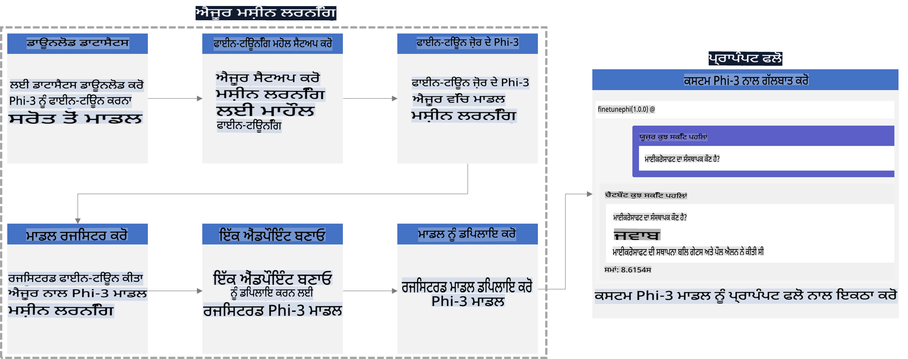

### ਸੂਚੀ

1. **[ਸਥਿਤੀ 1: Azure ਸਰੋਤ ਸੈਟਅਪ ਕਰੋ ਅਤੇ ਫਾਈਨ-ਟਿਊਨਿੰਗ ਲਈ ਤਿਆਰੀ ਕਰੋ](../../../../../../md/02.Application/01.TextAndChat/Phi3)**
    - [Azure Machine Learning ਵਰਕਸਪੇਸ ਬਣਾਓ](../../../../../../md/02.Application/01.TextAndChat/Phi3)
    - [Azure ਸਬਸਕ੍ਰਿਪਸ਼ਨ ਵਿੱਚ GPU ਕੋਟਾ ਦੀ ਬੇਨਤੀ ਕਰੋ](../../../../../../md/02.Application/01.TextAndChat/Phi3)
    - [ਰੋਲ ਅਸਾਈਨਮੈਂਟ ਜੋੜੋ](../../../../../../md/02.Application/01.TextAndChat/Phi3)
    - [ਪ੍ਰੋਜੈਕਟ ਸੈਟਅਪ ਕਰੋ](../../../../../../md/02.Application/01.TextAndChat/Phi3)
    - [ਫਾਈਨ-ਟਿਊਨਿੰਗ ਲਈ ਡੇਟਾਸੈਟ ਤਿਆਰ ਕਰੋ](../../../../../../md/02.Application/01.TextAndChat/Phi3)

1. **[ਸਥਿਤੀ 2: Phi-3 ਮਾਡਲ ਨੂੰ ਫਾਈਨ-ਟਿਊਨ ਕਰੋ ਅਤੇ Azure Machine Learning Studio ਵਿੱਚ ਡਿਪਲੋਇ ਕਰੋ](../../../../../../md/02.Application/01.TextAndChat/Phi3)**
    - [Azure CLI ਸੈਟਅਪ ਕਰੋ](../../../../../../md/02.Application/01.TextAndChat/Phi3)
    - [Phi-3 ਮਾਡਲ ਨੂੰ ਫਾਈਨ-ਟਿਊਨ ਕਰੋ](../../../../../../md/02.Application/01.TextAndChat/Phi3)
    - [ਫਾਈਨ-ਟਿਊਨ ਮਾਡਲ ਨੂੰ ਡਿਪਲੋਇ ਕਰੋ](../../../../../../md/02.Application/01.TextAndChat/Phi3)

1. **[ਸਥਿਤੀ 3: Prompt Flow ਨਾਲ ਇੰਟੀਗ੍ਰੇਟ ਕਰੋ ਅਤੇ ਆਪਣੇ ਕਸਟਮ ਮਾਡਲ ਨਾਲ ਗੱਲਬਾਤ ਕਰੋ](../../../../../../md/02.Application/01.TextAndChat/Phi3)**
    - [ਕਸਟਮ Phi-3 ਮਾਡਲ ਨੂੰ Prompt Flow ਨਾਲ ਇੰਟੀਗ੍ਰੇਟ ਕਰੋ](../../../../../../md/02.Application/01.TextAndChat/Phi3)
    - [ਆਪਣੇ ਕਸਟਮ ਮਾਡਲ ਨਾਲ ਗੱਲਬਾਤ ਕਰੋ](../../../../../../md/02.Application/01.TextAndChat/Phi3)

## ਸਥਿਤੀ 1: Azure ਸਰੋਤ ਸੈਟਅਪ ਕਰੋ ਅਤੇ ਫਾਈਨ-ਟਿਊਨਿੰਗ ਲਈ ਤਿਆਰੀ ਕਰੋ

### Azure Machine Learning ਵਰਕਸਪੇਸ ਬਣਾਓ

1. ਪੋਰਟਲ ਪੇਜ ਦੇ ਉੱਪਰਲੇ **ਸਰਚ ਬਾਰ** ਵਿੱਚ *azure machine learning* ਟਾਈਪ ਕਰੋ ਅਤੇ ਦਿਖਾਈ ਦੇ ਰਹੇ ਵਿਕਲਪਾਂ ਵਿੱਚੋਂ **Azure Machine Learning** ਚੁਣੋ।

    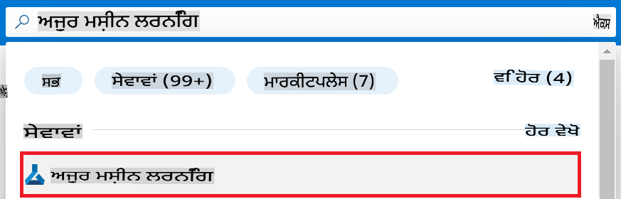

1. ਨੇਵੀਗੇਸ਼ਨ ਮੀਨੂ ਤੋਂ **+ Create** ਚੁਣੋ।

1. ਨੇਵੀਗੇਸ਼ਨ ਮੀਨੂ ਤੋਂ **New workspace** ਚੁਣੋ।

    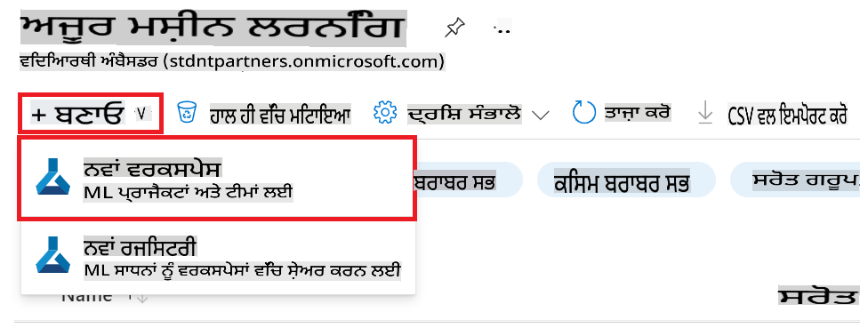

1. ਹੇਠਾਂ ਦਿੱਤੇ ਕੰਮ ਕਰੋ:

    - ਆਪਣੀ Azure **ਸਬਸਕ੍ਰਿਪਸ਼ਨ** ਚੁਣੋ।
    - ਵਰਤਣ ਲਈ **Resource group** ਚੁਣੋ (ਲੋੜ ਪਏ ਤਾਂ ਨਵਾਂ ਬਣਾਓ)।
    - **Workspace Name** ਦਾਖਲ ਕਰੋ। ਇਹ ਇੱਕ ਯੂਨੀਕ ਮੁੱਲ ਹੋਣਾ ਚਾਹੀਦਾ ਹੈ।
    - **Region** ਚੁਣੋ ਜੋ ਤੁਸੀਂ ਵਰਤਣਾ ਚਾਹੁੰਦੇ ਹੋ।
    - ਵਰਤਣ ਲਈ **Storage account** ਚੁਣੋ (ਲੋੜ ਪਏ ਤਾਂ ਨਵਾਂ ਬਣਾਓ)।
    - ਵਰਤਣ ਲਈ **Key vault** ਚੁਣੋ (ਲੋੜ ਪਏ ਤਾਂ ਨਵਾਂ ਬਣਾਓ)।
    - ਵਰਤਣ ਲਈ **Application insights** ਚੁਣੋ (ਲੋੜ ਪਏ ਤਾਂ ਨਵਾਂ ਬਣਾਓ)।
    - ਵਰਤਣ ਲਈ **Container registry** ਚੁਣੋ (ਲੋੜ ਪਏ ਤਾਂ ਨਵਾਂ ਬਣਾਓ)।

    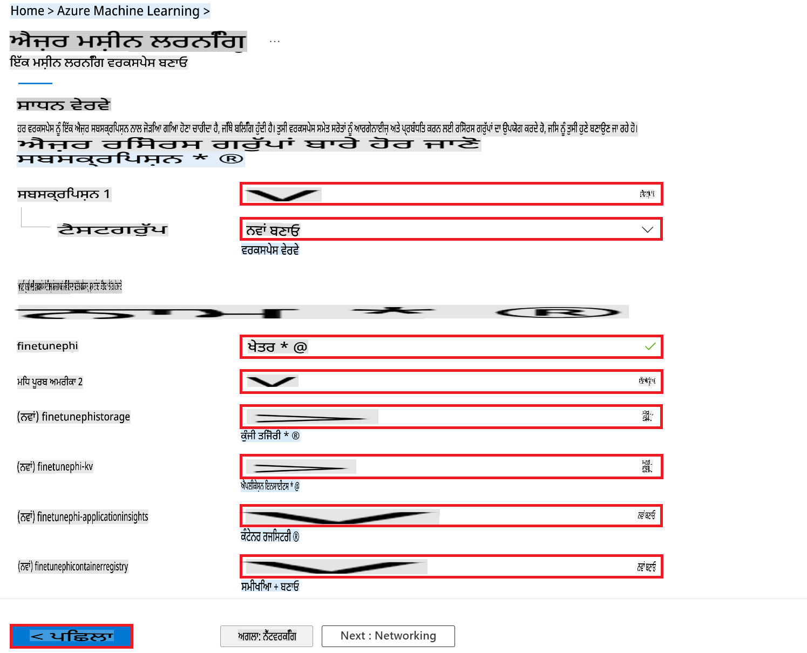

1. **Review + Create** ਚੁਣੋ।

1. **Create** ਚੁਣੋ।

### Azure ਸਬਸਕ੍ਰਿਪਸ਼ਨ ਵਿੱਚ GPU ਕੋਟਾ ਦੀ ਬੇਨਤੀ ਕਰੋ

ਇਸ E2E ਨਮੂਨੇ ਵਿੱਚ, ਤੁਸੀਂ ਫਾਈਨ-ਟਿਊਨਿੰਗ ਲਈ *Standard_NC24ads_A100_v4 GPU* ਦੀ ਵਰਤੋਂ ਕਰੋਗੇ, ਜਿਸ ਲਈ ਕੋਟਾ ਦੀ ਬੇਨਤੀ ਲੋੜੀਂਦੀ ਹੈ, ਅਤੇ ਡਿਪਲੋਇਮੈਂਟ ਲਈ *Standard_E4s_v3* CPU ਦੀ ਵਰਤੋਂ ਕਰੋਗੇ, ਜਿਸ ਲਈ ਕੋਟਾ ਦੀ ਬੇਨਤੀ ਲੋੜੀਂਦੀ ਨਹੀਂ ਹੈ।

> [!NOTE]
>
> ਸਿਰਫ ਪੇ-ਅਜ-ਯੂ-ਗੋ ਸਬਸਕ੍ਰਿਪਸ਼ਨ (ਸਧਾਰਨ ਸਬਸਕ੍ਰਿਪਸ਼ਨ ਕਿਸਮ) GPU ਅਲੋਕੇਸ਼ਨ ਲਈ ਯੋਗ ਹਨ; ਫਾਇਦੇ ਵਾਲੀਆਂ ਸਬਸਕ੍ਰਿਪਸ਼ਨਾਂ ਨੂੰ ਇਸ ਵੇਲੇ ਸਹਾਇਕ ਨਹੀਂ ਕੀਤਾ ਗਿਆ।
>
> ਜਿਹੜੇ ਵਿਦਿਆਰਥੀ ਸਬਸਕ੍ਰਿਪਸ਼ਨ ਵਰਤ ਰਹੇ ਹਨ ਜਾਂ ਜਲਦੀ ਨਾਲ ਫਾਈਨ-ਟਿਊਨਿੰਗ ਅਤੇ ਡਿਪਲੋਇਮੈਂਟ ਪ੍ਰਕਿਰਿਆ ਨੂੰ ਟੈਸਟ ਕਰਨਾ ਚਾਹੁੰਦੇ ਹਨ, ਉਹਨਾਂ ਲਈ ਇਹ ਟਿਊਟੋਰਿਅਲ ਨਿਊਨਤਮ ਡੇਟਾਸੈਟ ਨਾਲ CPU ਦੀ ਵਰਤੋਂ ਕਰਕੇ ਫਾਈਨ-ਟਿਊਨਿੰਗ ਲਈ ਦਿਸ਼ਾ-ਨਿਰਦੇਸ਼ ਪ੍ਰਦਾਨ ਕਰਦਾ ਹੈ। ਹਾਲਾਂਕਿ, ਇਹ ਮਹੱਤਵਪੂਰਨ ਹੈ ਕਿ ਵੱਡੇ ਡੇਟਾਸੈਟ ਨਾਲ GPU ਦੀ ਵਰਤੋਂ ਕਰਨ 'ਤੇ ਫਾਈਨ-ਟਿਊਨਿੰਗ ਦੇ ਨਤੀਜੇ ਕਾਫੀ ਬਿਹਤਰ ਹੁੰਦੇ ਹਨ।

1. [Azure ML Studio](https://ml.azure.com/home?wt.mc_id=studentamb_279723) 'ਤੇ ਜਾਓ।

1. *Standard NCADSA100v4 Family* ਕੋਟਾ ਦੀ ਬੇਨਤੀ ਕਰਨ ਲਈ ਹੇਠਾਂ ਦਿੱਤੇ ਕੰਮ ਕਰੋ:

    - ਖੱਬੇ ਪਾਸੇ ਦੇ ਟੈਬ ਤੋਂ **Quota** ਚੁਣੋ।
    - ਵਰਤਣ ਲਈ **Virtual machine family** ਚੁਣੋ। ਉਦਾਹਰਣ ਲਈ, **Standard NCADSA100v4 Family Cluster Dedicated vCPUs** ਚੁਣੋ, ਜਿਸ ਵਿੱਚ *Standard_NC24ads_A100_v4* GPU ਸ਼ਾਮਲ ਹੈ।
    - ਨੇਵੀਗੇਸ਼ਨ ਮੀਨੂ ਤੋਂ **Request quota** ਚੁਣੋ।

        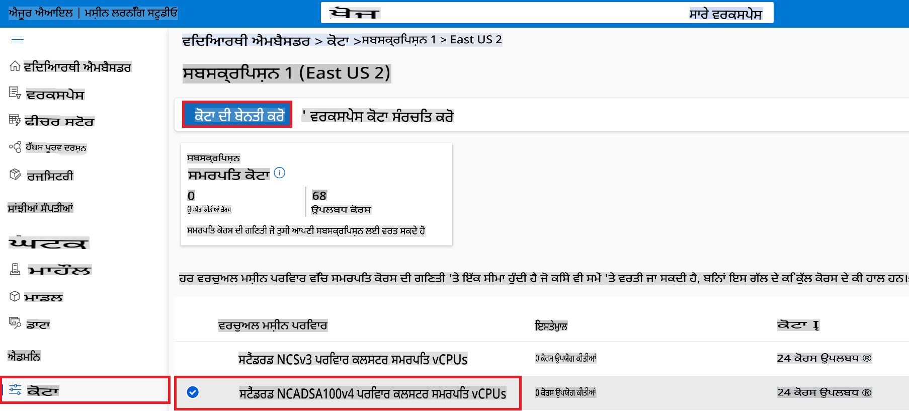

    - Request quota ਪੇਜ ਵਿੱਚ, ਵਰਤਣ ਲਈ **New cores limit** ਦਾਖਲ ਕਰੋ। ਉਦਾਹਰਣ ਲਈ, 24।
    - Request quota ਪੇਜ ਵਿੱਚ, GPU ਕੋਟਾ ਦੀ ਬੇਨਤੀ ਕਰਨ ਲਈ **Submit** ਚੁਣੋ।

> [!NOTE]
> ਆਪਣੀ ਲੋੜਾਂ ਦੇ ਅਨੁਸਾਰ GPU ਜਾਂ CPU ਚੁਣਨ ਲਈ, [Sizes for Virtual Machines in Azure](https://learn.microsoft.com/azure/virtual-machines/sizes/overview?tabs=breakdownseries%2Cgeneralsizelist%2Ccomputesizelist%2Cmemorysizelist%2Cstoragesizelist%2Cgpusizelist%2Cfpgasizelist%2Chpcsizelist) ਦਸਤਾਵੇਜ਼ ਨੂੰ ਦੇਖੋ।

### ਰੋਲ ਅਸਾਈਨਮੈਂਟ ਜੋੜੋ

ਫਾਈਨ-ਟਿਊਨ ਅਤੇ ਮਾਡਲਾਂ ਨੂੰ ਡਿਪਲੋਇ ਕਰਨ ਲਈ, ਤੁਹਾਨੂੰ ਪਹਿਲਾਂ ਇੱਕ User Assigned Managed Identity (UAI) ਬਣਾਉਣੀ ਪਵੇਗੀ ਅਤੇ ਇਸਨੂੰ ਠੀਕ ਅਧਿਕਾਰ ਸੌਂਪਣੇ ਪੈਣਗੇ। ਡਿਪਲੋਇਮੈਂਟ ਦੌਰਾਨ ਪ੍ਰਮਾਣਿਕਤਾ ਲਈ ਇਸ UAI ਦੀ ਵਰਤੋਂ ਕੀਤੀ ਜਾਵੇਗੀ।

#### User Assigned Managed Identity (UAI) ਬਣਾਓ

1. ਪੋਰਟਲ ਪੇਜ ਦੇ ਉੱਪਰਲੇ **ਸਰਚ ਬਾਰ** ਵਿੱਚ *managed identities* ਟਾਈਪ ਕਰੋ ਅਤੇ ਦਿਖਾਈ ਦੇ ਰਹੇ ਵਿਕਲਪਾਂ ਵਿੱਚੋਂ **Managed Identities** ਚੁਣੋ।

    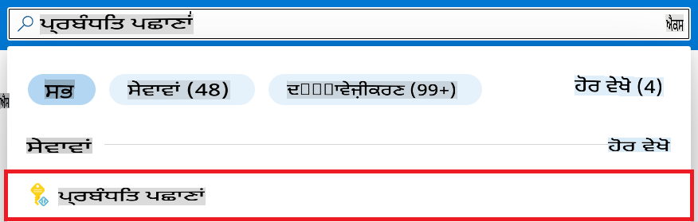

1. **+ Create** ਚੁਣੋ।

    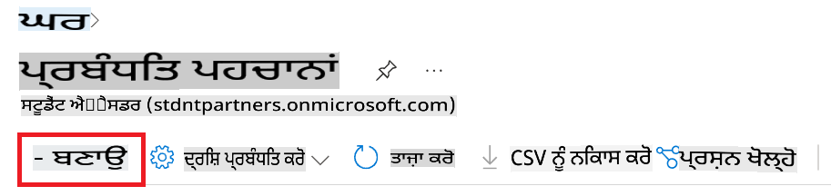

1. ਹੇਠਾਂ ਦਿੱਤੇ ਕੰਮ ਕਰੋ:

    - ਆਪਣੀ Azure **ਸਬਸਕ੍ਰਿਪਸ਼ਨ** ਚੁਣੋ।
    - ਵਰਤਣ ਲਈ **Resource group** ਚੁਣੋ (ਲੋੜ ਪਏ ਤਾਂ ਨਵਾਂ ਬਣਾਓ)।
    - **Region** ਚੁਣੋ ਜੋ ਤੁਸੀਂ ਵਰਤਣਾ ਚਾਹੁੰਦੇ ਹੋ।
    - **Name** ਦਾਖਲ ਕਰੋ। ਇਹ ਇੱਕ ਯੂਨੀਕ ਮੁੱਲ ਹੋਣਾ ਚਾਹੀਦਾ ਹੈ।

1. **Review + create** ਚੁਣੋ।

1. **+ Create** ਚੁਣੋ।

#### Managed Identity ਲਈ Contributor ਰੋਲ ਅਸਾਈਨਮੈਂਟ ਜੋੜੋ

1. ਤੁਹਾਡੇ ਦੁਆਰਾ ਬਣਾਈ ਗਈ Managed Identity ਸਰੋਤ ਤੇ ਜਾਓ।

1. ਖੱਬੇ ਪਾਸੇ ਦੇ ਟੈਬ ਤੋਂ **Azure role assignments** ਚੁਣੋ।

1. ਨੇਵੀਗੇਸ਼ਨ ਮੀਨੂ ਤੋਂ **+Add role assignment** ਚੁਣੋ।

1. Add role assignment ਪੇਜ ਵਿੱਚ, ਹੇਠਾਂ ਦਿੱਤੇ ਕੰਮ ਕਰੋ:
    - **Scope** ਨੂੰ **Resource group** ਚੁਣੋ।
    - ਆਪਣੀ Azure **ਸਬਸਕ੍ਰਿਪਸ਼ਨ** ਚੁਣੋ।
    - ਵਰਤਣ ਲਈ **Resource group** ਚੁਣੋ।
    - **Role** ਨੂੰ **Contributor** ਚੁਣੋ।

    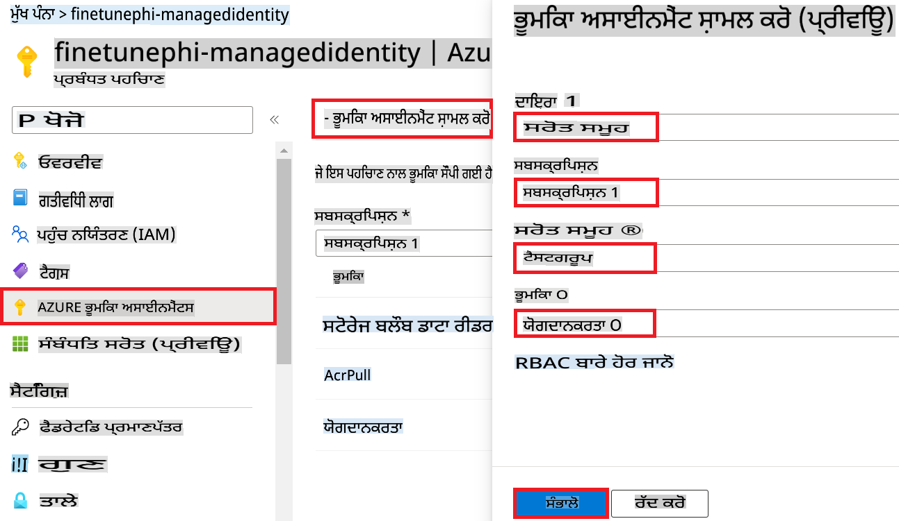

1. **Save** ਚੁਣੋ।

#### Managed Identity ਲਈ Storage Blob Data Reader ਰੋਲ ਅਸਾਈਨਮੈਂਟ ਜੋੜੋ

1. ਪੋਰਟਲ ਪੇਜ ਦੇ ਉੱਪਰਲੇ **ਸਰਚ ਬਾਰ** ਵਿੱਚ *storage accounts* ਟਾਈਪ ਕਰੋ ਅਤੇ ਦਿਖਾਈ ਦੇ ਰਹੇ ਵਿਕਲਪਾਂ ਵਿੱਚੋਂ **Storage accounts** ਚੁਣੋ।

    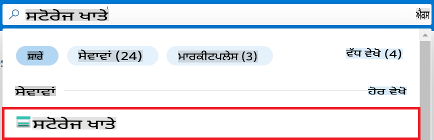

1. Azure Machine Learning ਵਰਕਸਪੇਸ ਨਾਲ ਸੰਬੰਧਤ ਸਟੋਰੇਜ ਅਕਾਊਂਟ ਚੁਣੋ। ਉਦਾਹਰਣ ਲਈ, *finetunephistorage*।

1. Add role assignment ਪੇਜ ਤੇ ਜਾਣ ਲਈ ਹੇਠਾਂ ਦਿੱਤੇ ਕੰਮ ਕਰੋ:

    - ਤੁਸੀਂ ਬਣਾਇਆ Azure Storage ਅਕਾਊਂਟ ਤੇ ਜਾਓ।
    - ਖੱਬੇ ਪਾਸੇ ਦੇ ਟੈਬ ਤੋਂ **Access Control (IAM)** ਚੁਣੋ।
    - ਨੇਵੀਗੇਸ਼ਨ ਮੀਨੂ ਤੋਂ **+ Add** ਚੁਣੋ।
    - ਨੇਵੀਗੇਸ਼ਨ ਮੀਨੂ ਤੋਂ **Add role assignment** ਚੁਣੋ।

    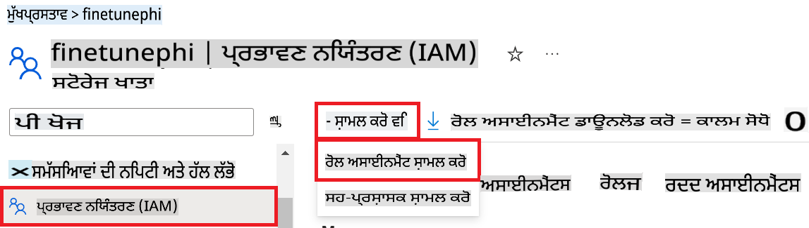

1. Add role assignment ਪੇਜ ਵਿੱਚ, ਹੇਠਾਂ ਦਿੱਤੇ ਕੰਮ ਕਰੋ:

    - **Role** ਪੇਜ ਵਿੱਚ, **Storage Blob Data Reader** ਲਿਖੋ ਅਤੇ ਦਿਖਾਈ ਦੇ ਰਹੇ ਵਿਕਲਪਾਂ ਵਿੱਚੋਂ **Storage Blob Data Reader** ਚੁਣੋ।
    - **Role** ਪੇਜ ਵਿੱਚ, **Next** ਚੁਣੋ।
    - **Members** ਪੇਜ ਵਿੱਚ, **Assign access to** **Managed identity** ਚੁਣੋ।
    - **Members** ਪੇਜ ਵਿੱਚ, **+ Select members** ਚੁਣੋ।
    - **Select managed identities** ਪੇਜ ਵਿੱਚ, ਆਪਣੀ Azure **ਸਬਸਕ੍ਰਿਪਸ਼ਨ** ਚੁਣੋ।
    - **Select managed identities** ਪੇਜ ਵਿੱਚ, **Managed identity** ਚੁਣੋ।
    - **Select managed identities** ਪੇਜ ਵਿੱਚ, ਤੁਸੀਂ ਬਣਾਇਆ Managed Identity ਚੁਣੋ। ਉਦਾਹਰਣ ਲਈ, *finetunephi-managedidentity*।
    - **Select managed identities** ਪੇਜ ਵਿੱਚ, **Select** ਚੁਣੋ।

    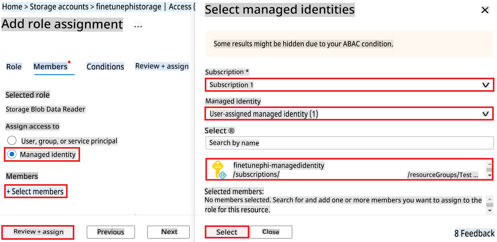

1. **Review + assign** ਚੁਣੋ।

#### Managed Identity ਲਈ AcrPull ਰੋਲ ਅਸਾਈਨਮੈਂਟ ਜੋੜੋ

1. ਪੋਰਟਲ ਪੇਜ ਦੇ ਉੱਪਰਲੇ **ਸਰਚ ਬਾਰ** ਵਿੱਚ *container registries* ਟਾਈਪ ਕਰੋ ਅਤੇ ਦਿਖਾਈ ਦੇ ਰਹੇ ਵਿਕਲਪਾਂ ਵਿੱਚੋਂ **Container registries** ਚੁਣੋ।

    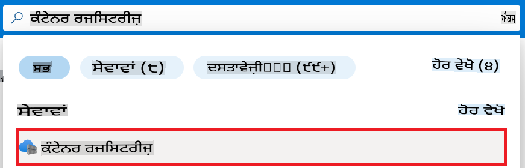

1. Azure Machine Learning ਵਰਕਸਪੇਸ ਨਾਲ ਸੰਬੰਧਤ ਕੰਟੇਨਰ ਰਜਿਸਟਰੀ ਚੁਣੋ। ਉਦਾਹਰਣ ਲਈ, *finetunephicontainerregistries*।

1. Add role assignment ਪੇਜ ਤੇ ਜਾਣ ਲਈ ਹੇਠਾਂ ਦਿੱਤੇ ਕੰਮ ਕਰੋ:

    - ਖੱਬੇ ਪਾਸੇ ਦੇ ਟੈਬ ਤੋਂ **Access Control (IAM)** ਚੁਣੋ।
    - ਨੇਵੀਗੇਸ਼ਨ ਮੀਨੂ ਤੋਂ **+ Add** ਚੁਣੋ।
    - ਨੇਵੀਗੇਸ਼ਨ ਮੀਨੂ ਤੋਂ **Add role assignment** ਚੁਣੋ।

1. Add role assignment ਪੇਜ ਵਿੱਚ, ਹੇਠਾਂ ਦਿੱਤੇ ਕੰਮ ਕਰੋ:

    - **Role** ਪੇਜ ਵਿੱਚ, **AcrPull** ਲਿਖੋ ਅਤੇ ਦਿਖਾਈ ਦੇ ਰਹੇ ਵਿਕਲਪਾਂ ਵਿੱਚੋਂ **AcrPull** ਚੁਣੋ।
    - **Role** ਪੇਜ ਵਿੱਚ, **Next** ਚੁਣੋ।
    - **Members** ਪੇਜ ਵਿੱਚ, **Assign access to** **Managed identity** ਚੁਣੋ।
    - **Members** ਪੇਜ ਵਿੱਚ, **+ Select members** ਚੁਣੋ।
    - **Select managed identities** ਪੇਜ ਵਿੱਚ, ਆਪਣੀ Azure **ਸਬਸਕ੍ਰਿਪਸ਼ਨ** ਚੁਣੋ।
    - **Select managed identities** ਪੇਜ ਵਿੱਚ, **Managed identity** ਚੁਣੋ।
    - **Select managed identities** ਪੇਜ ਵਿੱਚ, ਤੁਸੀਂ ਬਣਾਇਆ Managed Identity ਚੁਣੋ। ਉਦਾਹਰਣ ਲਈ, *finetunephi-managedidentity*।
    - **Select managed identities** ਪੇਜ ਵਿੱਚ, **Select** ਚੁਣੋ।
    - **Review + assign** ਚੁਣੋ।

### ਪ੍ਰੋਜੈਕਟ ਸੈਟਅਪ ਕਰੋ

ਹੁਣ, ਤੁਸੀਂ ਇੱਕ ਫੋਲਡਰ ਬਣਾਉਗੇ ਅਤੇ ਇੱਕ ਵਰਚੁਅਲ ਐਨਵਾਇਰਨਮੈਂਟ ਸੈਟਅਪ ਕਰੋਗੇ, ਤਾਂ ਜੋ ਇੱਕ ਪ੍ਰੋਗਰਾਮ ਵਿਕਸਿਤ ਕੀਤਾ ਜਾ ਸਕੇ ਜੋ ਯੂਜ਼ਰ ਨਾਲ ਇੰਟਰੈਕਟ ਕਰੇ ਅਤੇ Azure Cosmos DB ਵਿੱਚ ਸਟੋਰ ਕੀਤੀ ਗਈ ਚੈਟ ਹਿਸਟਰੀ ਨੂੰ ਆਪਣੀ ਰਿਸਪਾਂਸ ਦੇਣ ਲਈ ਵਰਤੇ।

#### ਇੱਕ ਫੋਲਡਰ ਬਣਾਓ

1. ਟਰਮੀਨਲ ਖੋਲ੍ਹੋ ਅਤੇ *finetune-phi* ਨਾਂ ਦਾ ਫੋਲਡਰ ਬਣਾਉਣ ਲਈ ਹੇਠਾਂ ਦਿੱਤਾ ਕਮਾਂਡ ਦਾਖਲ ਕਰੋ।

    @@
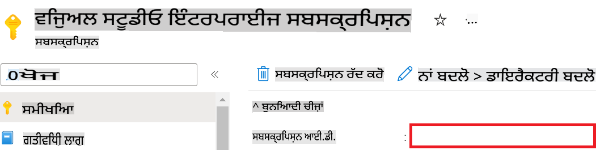

1. Azure Workspace Name ਸ਼ਾਮਲ ਕਰਨ ਲਈ ਹੇਠਾਂ ਦਿੱਤੇ ਕਦਮ ਕਰੋ:

    - ਉਸ Azure Machine Learning ਰਿਸੋਸ ਤੇ ਜਾਓ ਜੋ ਤੁਸੀਂ ਬਣਾਇਆ ਸੀ।
    - ਆਪਣੇ ਖਾਤੇ ਦਾ ਨਾਮ ਕਾਪੀ ਕਰੋ ਅਤੇ ਇਸਨੂੰ *config.py* ਫਾਈਲ ਵਿੱਚ ਪੇਸਟ ਕਰੋ।

    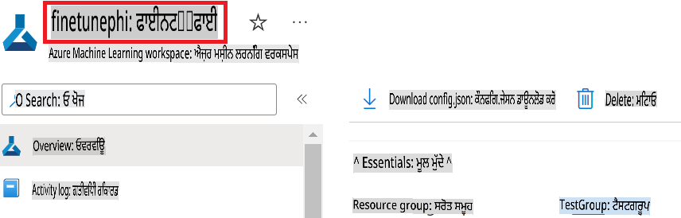

1. Azure Resource Group Name ਸ਼ਾਮਲ ਕਰਨ ਲਈ ਹੇਠਾਂ ਦਿੱਤੇ ਕਦਮ ਕਰੋ:

    - ਉਸ Azure Machine Learning ਰਿਸੋਸ ਤੇ ਜਾਓ ਜੋ ਤੁਸੀਂ ਬਣਾਇਆ ਸੀ।
    - ਆਪਣੇ Azure Resource Group Name ਨੂੰ ਕਾਪੀ ਕਰੋ ਅਤੇ ਇਸਨੂੰ *config.py* ਫਾਈਲ ਵਿੱਚ ਪੇਸਟ ਕਰੋ।

    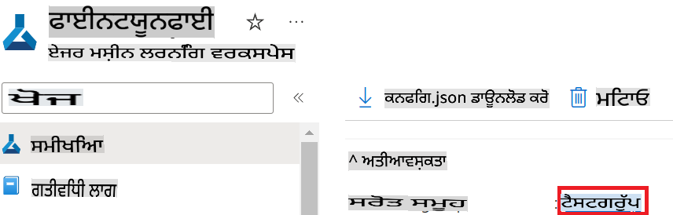

2. Azure Managed Identity Name ਸ਼ਾਮਲ ਕਰਨ ਲਈ ਹੇਠਾਂ ਦਿੱਤੇ ਕਦਮ ਕਰੋ:

    - ਉਸ Managed Identities ਰਿਸੋਸ ਤੇ ਜਾਓ ਜੋ ਤੁਸੀਂ ਬਣਾਇਆ ਸੀ।
    - ਆਪਣੇ Azure Managed Identity Name ਨੂੰ ਕਾਪੀ ਕਰੋ ਅਤੇ ਇਸਨੂੰ *config.py* ਫਾਈਲ ਵਿੱਚ ਪੇਸਟ ਕਰੋ।

    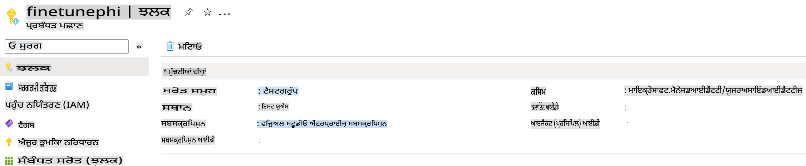

### ਫਾਈਨ-ਟਿਊਨਿੰਗ ਲਈ ਡਾਟਾਸੈਟ ਤਿਆਰ ਕਰੋ

ਇਸ ਐਕਸਰਸਾਈਜ਼ ਵਿੱਚ, ਤੁਸੀਂ *download_dataset.py* ਫਾਈਲ ਚਲਾਉਣਗੇ ਤਾਂ ਜੋ *ULTRACHAT_200k* ਡਾਟਾਸੈਟ ਨੂੰ ਆਪਣੇ ਲੋਕਲ ਇਨਵਾਇਰਨਮੈਂਟ ਵਿੱਚ ਡਾਊਨਲੋਡ ਕੀਤਾ ਜਾ ਸਕੇ। ਫਿਰ ਤੁਸੀਂ ਇਸ ਡਾਟਾਸੈਟ ਨੂੰ Phi-3 ਮਾਡਲ ਨੂੰ Azure Machine Learning ਵਿੱਚ ਫਾਈਨ-ਟਿਊਨ ਕਰਨ ਲਈ ਵਰਤੋਂਗੇ।

#### *download_dataset.py* ਵਰਤ ਕੇ ਡਾਟਾਸੈਟ ਡਾਊਨਲੋਡ ਕਰੋ

1. Visual Studio Code ਵਿੱਚ *download_dataset.py* ਫਾਈਲ ਖੋਲ੍ਹੋ।

1. ਹੇਠਾਂ ਦਿੱਤਾ ਕੋਡ *download_dataset.py* ਵਿੱਚ ਸ਼ਾਮਲ ਕਰੋ।

    ```python
    import json
    import os
    from datasets import load_dataset
    from config import (
        TRAIN_DATA_PATH,
        TEST_DATA_PATH)

    def load_and_split_dataset(dataset_name, config_name, split_ratio):
        """
        Load and split a dataset.
        """
        # Load the dataset with the specified name, configuration, and split ratio
        dataset = load_dataset(dataset_name, config_name, split=split_ratio)
        print(f"Original dataset size: {len(dataset)}")
        
        # Split the dataset into train and test sets (80% train, 20% test)
        split_dataset = dataset.train_test_split(test_size=0.2)
        print(f"Train dataset size: {len(split_dataset['train'])}")
        print(f"Test dataset size: {len(split_dataset['test'])}")
        
        return split_dataset

    def save_dataset_to_jsonl(dataset, filepath):
        """
        Save a dataset to a JSONL file.
        """
        # Create the directory if it does not exist
        os.makedirs(os.path.dirname(filepath), exist_ok=True)
        
        # Open the file in write mode
        with open(filepath, 'w', encoding='utf-8') as f:
            # Iterate over each record in the dataset
            for record in dataset:
                # Dump the record as a JSON object and write it to the file
                json.dump(record, f)
                # Write a newline character to separate records
                f.write('\n')
        
        print(f"Dataset saved to {filepath}")

    def main():
        """
        Main function to load, split, and save the dataset.
        """
        # Load and split the ULTRACHAT_200k dataset with a specific configuration and split ratio
        dataset = load_and_split_dataset("HuggingFaceH4/ultrachat_200k", 'default', 'train_sft[:1%]')
        
        # Extract the train and test datasets from the split
        train_dataset = dataset['train']
        test_dataset = dataset['test']

        # Save the train dataset to a JSONL file
        save_dataset_to_jsonl(train_dataset, TRAIN_DATA_PATH)
        
        # Save the test dataset to a separate JSONL file
        save_dataset_to_jsonl(test_dataset, TEST_DATA_PATH)

    if __name__ == "__main__":
        main()

    ```

> [!TIP]
>
> **ਕਮ ਡਾਟਾਸੈਟ ਨਾਲ CPU ਵਰਤ ਕੇ ਫਾਈਨ-ਟਿਊਨਿੰਗ ਲਈ ਮਾਰਗਦਰਸ਼ਨ**
>
> ਜੇ ਤੁਸੀਂ ਫਾਈਨ-ਟਿਊਨਿੰਗ ਲਈ CPU ਵਰਤਣਾ ਚਾਹੁੰਦੇ ਹੋ, ਤਾਂ ਇਹ ਪਹੁੰਚ Visual Studio Enterprise Subscription ਵਰਗੀਆਂ ਸਬਸਕ੍ਰਿਪਸ਼ਨ ਲਾਭਾਂ ਵਾਲਿਆਂ ਲਈ ਜਾਂ ਫਾਈਨ-ਟਿਊਨਿੰਗ ਅਤੇ ਡਿਪਲੋਇਮੈਂਟ ਪ੍ਰਕਿਰਿਆ ਨੂੰ ਤੇਜ਼ੀ ਨਾਲ ਟੈਸਟ ਕਰਨ ਲਈ ਆਦਰਸ਼ ਹੈ।
>
> `dataset = load_and_split_dataset("HuggingFaceH4/ultrachat_200k", 'default', 'train_sft[:1%]')` with `dataset = load_and_split_dataset("HuggingFaceH4/ultrachat_200k", 'default', 'train_sft[:10]')` ਨੂੰ ਬਦਲੋ।
>

1. ਟਰਮੀਨਲ ਵਿੱਚ ਹੇਠਾਂ ਦਿੱਤਾ ਕਮਾਂਡ ਟਾਈਪ ਕਰੋ ਤਾਂ ਜੋ ਸਕ੍ਰਿਪਟ ਚਲਾਈ ਜਾ ਸਕੇ ਅਤੇ ਡਾਟਾਸੈਟ ਨੂੰ ਤੁਹਾਡੇ ਲੋਕਲ ਇਨਵਾਇਰਨਮੈਂਟ ਵਿੱਚ ਡਾਊਨਲੋਡ ਕੀਤਾ ਜਾ ਸਕੇ।

    ```console
    python download_data.py
    ```

1. ਇਹ ਪੱਕਾ ਕਰੋ ਕਿ ਡਾਟਾਸੈਟ ਤੁਹਾਡੇ ਲੋਕਲ *finetune-phi/data* ਡਾਇਰੈਕਟਰੀ ਵਿੱਚ ਸਫਲਤਾਪੂਰਵਕ ਸੇਵ ਕੀਤੇ ਗਏ ਹਨ।

> [!NOTE]
>
> **ਡਾਟਾਸੈਟ ਦਾ ਆਕਾਰ ਅਤੇ ਫਾਈਨ-ਟਿਊਨਿੰਗ ਦਾ ਸਮਾਂ**
>
> ਇਸ E2E ਸੈਂਪਲ ਵਿੱਚ, ਤੁਸੀਂ ਸਿਰਫ 1% ਡਾਟਾਸੈਟ (`train_sft[:1%]`) ਵਰਤਦੇ ਹੋ। ਇਹ ਡਾਟੇ ਦੀ ਮਾਤਰਾ ਨੂੰ ਕਾਫ਼ੀ ਘਟਾ ਦਿੰਦਾ ਹੈ, ਅਪਲੋਡ ਅਤੇ ਫਾਈਨ-ਟਿਊਨਿੰਗ ਪ੍ਰਕਿਰਿਆ ਦੋਵਾਂ ਨੂੰ ਤੇਜ਼ ਕਰਦਾ ਹੈ। ਤੁਸੀਂ ਟ੍ਰੇਨਿੰਗ ਦੇ ਸਮੇਂ ਅਤੇ ਮਾਡਲ ਦੀ ਕਾਰਗੁਜ਼ਾਰੀ ਵਿੱਚ ਸੰਤੁਲਨ ਲੱਭਣ ਲਈ ਪ੍ਰਤੀਸ਼ਤ ਬਦਲ ਸਕਦੇ ਹੋ। ਛੋਟੀ ਸਬਸੈਟ ਵਰਤਣ ਨਾਲ ਸਮਾਂ ਘਟਦਾ ਹੈ, ਜਿਸ ਨਾਲ ਇਹ ਪ੍ਰਕਿਰਿਆ ਸੈਂਪਲ ਲਈ ਆਸਾਨ ਬਣਦੀ ਹੈ।

## ਸценਾਰਿਓ 2: Phi-3 ਮਾਡਲ ਨੂੰ ਫਾਈਨ-ਟਿਊਨ ਕਰੋ ਅਤੇ Azure Machine Learning Studio ਵਿੱਚ ਡਿਪਲੋਇ ਕਰੋ

### Azure CLI ਸੈਟ ਅੱਪ ਕਰੋ

ਤੁਹਾਨੂੰ ਆਪਣੇ ਇਨਵਾਇਰਨਮੈਂਟ ਨੂੰ ਪ੍ਰਮਾਣਿਕ ਕਰਨ ਲਈ Azure CLI ਸੈਟ ਅੱਪ ਕਰਨ ਦੀ ਲੋੜ ਹੈ। Azure CLI ਤੁਹਾਨੂੰ ਕਮਾਂਡ ਲਾਈਨ ਤੋਂ ਸਿੱਧੇ Azure ਰਿਸੋਰਸ ਮੈਨੇਜ ਕਰਨ ਦੀ ਆਗਿਆ ਦਿੰਦਾ ਹੈ ਅਤੇ Azure Machine Learning ਨੂੰ ਇਨ੍ਹਾਂ ਰਿਸੋਰਸਾਂ ਤੱਕ ਪਹੁੰਚ ਪ੍ਰਦਾਨ ਕਰਨ ਲਈ ਜ਼ਰੂਰੀ ਪ੍ਰਮਾਣ ਪੱਤਰ ਪ੍ਰਦਾਨ ਕਰਦਾ ਹੈ। ਸ਼ੁਰੂਆਤ ਕਰਨ ਲਈ [Azure CLI](https://learn.microsoft.com/cli/azure/install-azure-cli) ਇੰਸਟਾਲ ਕਰੋ।

1. ਟਰਮੀਨਲ ਵਿੰਡੋ ਖੋਲ੍ਹੋ ਅਤੇ ਹੇਠਾਂ ਦਿੱਤਾ ਕਮਾਂਡ ਟਾਈਪ ਕਰੋ ਤਾਂ ਜੋ ਆਪਣੇ Azure ਖਾਤੇ ਵਿੱਚ ਲਾਗਿਨ ਕੀਤਾ ਜਾ ਸਕੇ।

    ```console
    az login
    ```

1. ਆਪਣੇ ਵਰਤਣ ਲਈ Azure ਖਾਤਾ ਚੁਣੋ।

1. ਆਪਣੇ ਵਰਤਣ ਲਈ Azure ਸਬਸਕ੍ਰਿਪਸ਼ਨ ਚੁਣੋ।

    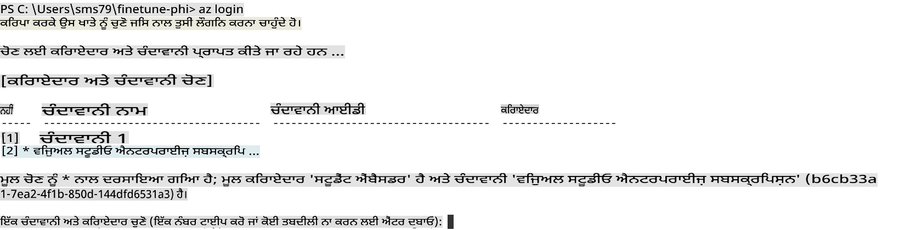

> [!TIP]
>
> ਜੇ ਤੁਹਾਨੂੰ Azure ਵਿੱਚ ਸਾਈਨ-ਇਨ ਕਰਨ ਵਿੱਚ ਮੁਸ਼ਕਲ ਹੋ ਰਹੀ ਹੈ, ਤਾਂ ਡਿਵਾਈਸ ਕੋਡ ਵਰਤਣ ਦੀ ਕੋਸ਼ਿਸ਼ ਕਰੋ। ਟਰਮੀਨਲ ਵਿੰਡੋ ਖੋਲ੍ਹੋ ਅਤੇ ਹੇਠਾਂ ਦਿੱਤਾ ਕਮਾਂਡ ਟਾਈਪ ਕਰੋ:
>
> ```console
> az login --use-device-code
> ```
>

### Phi-3 ਮਾਡਲ ਨੂੰ ਫਾਈਨ-ਟਿਊਨ ਕਰੋ

ਇਸ ਐਕਸਰਸਾਈਜ਼ ਵਿੱਚ, ਤੁਸੀਂ ਦਿੱਤੇ ਗਏ ਡਾਟਾਸੈਟ ਦੀ ਵਰਤੋਂ ਕਰਕੇ Phi-3 ਮਾਡਲ ਨੂੰ ਫਾਈਨ-ਟਿਊਨ ਕਰੋਗੇ। ਪਹਿਲਾਂ, ਤੁਸੀਂ *fine_tune.py* ਫਾਈਲ ਵਿੱਚ ਫਾਈਨ-ਟਿਊਨਿੰਗ ਪ੍ਰਕਿਰਿਆ ਨੂੰ ਪਰਿਭਾਸ਼ਿਤ ਕਰੋਗੇ। ਫਿਰ, ਤੁਸੀਂ Azure Machine Learning ਇਨਵਾਇਰਨਮੈਂਟ ਨੂੰ ਕਾਨਫ਼ਿਗਰ ਕਰਕੇ *setup_ml.py* ਫਾਈਲ ਚਲਾ ਕੇ ਫਾਈਨ-ਟਿਊਨਿੰਗ ਪ੍ਰਕਿਰਿਆ ਸ਼ੁਰੂ ਕਰੋਗੇ। 

*setup_ml.py* ਚਲਾਉਣ ਨਾਲ, ਤੁਸੀਂ Azure Machine Learning ਇਨਵਾਇਰਨਮੈਂਟ ਵਿੱਚ ਫਾਈਨ-ਟਿਊਨਿੰਗ ਪ੍ਰਕਿਰਿਆ ਚਲਾਉਣਗੇ।

#### *fine_tune.py* ਫਾਈਲ ਵਿੱਚ ਕੋਡ ਸ਼ਾਮਲ ਕਰੋ

1. *finetuning_dir* ਫੋਲਡਰ ਵਿੱਚ ਜਾਓ ਅਤੇ Visual Studio Code ਵਿੱਚ *fine_tune.py* ਫਾਈਲ ਖੋਲ੍ਹੋ।

1. ਹੇਠਾਂ ਦਿੱਤਾ ਕੋਡ *fine_tune.py* ਵਿੱਚ ਸ਼ਾਮਲ ਕਰੋ।

    ```python
    import argparse
    import sys
    import logging
    import os
    from datasets import load_dataset
    import torch
    import mlflow
    from transformers import AutoModelForCausalLM, AutoTokenizer, TrainingArguments
    from trl import SFTTrainer

    # To avoid the INVALID_PARAMETER_VALUE error in MLflow, disable MLflow integration
    os.environ["DISABLE_MLFLOW_INTEGRATION"] = "True"

    # Logging setup
    logging.basicConfig(
        format="%(asctime)s - %(levelname)s - %(name)s - %(message)s",
        datefmt="%Y-%m-%d %H:%M:%S",
        handlers=[logging.StreamHandler(sys.stdout)],
        level=logging.WARNING
    )
    logger = logging.getLogger(__name__)

    def initialize_model_and_tokenizer(model_name, model_kwargs):
        """
        Initialize the model and tokenizer with the given pretrained model name and arguments.
        """
        model = AutoModelForCausalLM.from_pretrained(model_name, **model_kwargs)
        tokenizer = AutoTokenizer.from_pretrained(model_name)
        tokenizer.model_max_length = 2048
        tokenizer.pad_token = tokenizer.unk_token
        tokenizer.pad_token_id = tokenizer.convert_tokens_to_ids(tokenizer.pad_token)
        tokenizer.padding_side = 'right'
        return model, tokenizer

    def apply_chat_template(example, tokenizer):
        """
        Apply a chat template to tokenize messages in the example.
        """
        messages = example["messages"]
        if messages[0]["role"] != "system":
            messages.insert(0, {"role": "system", "content": ""})
        example["text"] = tokenizer.apply_chat_template(
            messages, tokenize=False, add_generation_prompt=False
        )
        return example

    def load_and_preprocess_data(train_filepath, test_filepath, tokenizer):
        """
        Load and preprocess the dataset.
        """
        train_dataset = load_dataset('json', data_files=train_filepath, split='train')
        test_dataset = load_dataset('json', data_files=test_filepath, split='train')
        column_names = list(train_dataset.features)

        train_dataset = train_dataset.map(
            apply_chat_template,
            fn_kwargs={"tokenizer": tokenizer},
            num_proc=10,
            remove_columns=column_names,
            desc="Applying chat template to train dataset",
        )

        test_dataset = test_dataset.map(
            apply_chat_template,
            fn_kwargs={"tokenizer": tokenizer},
            num_proc=10,
            remove_columns=column_names,
            desc="Applying chat template to test dataset",
        )

        return train_dataset, test_dataset

    def train_and_evaluate_model(train_dataset, test_dataset, model, tokenizer, output_dir):
        """
        Train and evaluate the model.
        """
        training_args = TrainingArguments(
            bf16=True,
            do_eval=True,
            output_dir=output_dir,
            eval_strategy="epoch",
            learning_rate=5.0e-06,
            logging_steps=20,
            lr_scheduler_type="cosine",
            num_train_epochs=3,
            overwrite_output_dir=True,
            per_device_eval_batch_size=4,
            per_device_train_batch_size=4,
            remove_unused_columns=True,
            save_steps=500,
            seed=0,
            gradient_checkpointing=True,
            gradient_accumulation_steps=1,
            warmup_ratio=0.2,
        )

        trainer = SFTTrainer(
            model=model,
            args=training_args,
            train_dataset=train_dataset,
            eval_dataset=test_dataset,
            max_seq_length=2048,
            dataset_text_field="text",
            tokenizer=tokenizer,
            packing=True
        )

        train_result = trainer.train()
        trainer.log_metrics("train", train_result.metrics)

        mlflow.transformers.log_model(
            transformers_model={"model": trainer.model, "tokenizer": tokenizer},
            artifact_path=output_dir,
        )

        tokenizer.padding_side = 'left'
        eval_metrics = trainer.evaluate()
        eval_metrics["eval_samples"] = len(test_dataset)
        trainer.log_metrics("eval", eval_metrics)

    def main(train_file, eval_file, model_output_dir):
        """
        Main function to fine-tune the model.
        """
        model_kwargs = {
            "use_cache": False,
            "trust_remote_code": True,
            "torch_dtype": torch.bfloat16,
            "device_map": None,
            "attn_implementation": "eager"
        }

        # pretrained_model_name = "microsoft/Phi-3-mini-4k-instruct"
        pretrained_model_name = "microsoft/Phi-3.5-mini-instruct"

        with mlflow.start_run():
            model, tokenizer = initialize_model_and_tokenizer(pretrained_model_name, model_kwargs)
            train_dataset, test_dataset = load_and_preprocess_data(train_file, eval_file, tokenizer)
            train_and_evaluate_model(train_dataset, test_dataset, model, tokenizer, model_output_dir)

    if __name__ == "__main__":
        parser = argparse.ArgumentParser()
        parser.add_argument("--train-file", type=str, required=True, help="Path to the training data")
        parser.add_argument("--eval-file", type=str, required=True, help="Path to the evaluation data")
        parser.add_argument("--model_output_dir", type=str, required=True, help="Directory to save the fine-tuned model")
        args = parser.parse_args()
        main(args.train_file, args.eval_file, args.model_output_dir)

    ```

1. *fine_tune.py* ਫਾਈਲ ਨੂੰ ਸੇਵ ਕਰੋ ਅਤੇ ਬੰਦ ਕਰੋ।

> [!TIP]
> **ਤੁਸੀਂ Phi-3.5 ਮਾਡਲ ਨੂੰ ਵੀ ਫਾਈਨ-ਟਿਊਨ ਕਰ ਸਕਦੇ ਹੋ**
>
> *fine_tune.py* ਫਾਈਲ ਵਿੱਚ, ਤੁਸੀਂ `pretrained_model_name` from `"microsoft/Phi-3-mini-4k-instruct"` to any model you want to fine-tune. For example, if you change it to `"microsoft/Phi-3.5-mini-instruct"`, you'll be using the Phi-3.5-mini-instruct model for fine-tuning. To find and use the model name you prefer, visit [Hugging Face](https://huggingface.co/), search for the model you're interested in, and then copy and paste its name into the `pretrained_model_name` ਫੀਲਡ ਨੂੰ ਬਦਲ ਸਕਦੇ ਹੋ।
>
> :::image type="content" source="../../imgs/03/FineTuning-PromptFlow/finetunephi3.5.png" alt-text="Phi-3.5 ਨੂੰ ਫਾਈਨ-ਟਿਊਨ ਕਰੋ।":::
>

#### *setup_ml.py* ਫਾਈਲ ਵਿੱਚ ਕੋਡ ਸ਼ਾਮਲ ਕਰੋ

1. Visual Studio Code ਵਿੱਚ *setup_ml.py* ਫਾਈਲ ਖੋਲ੍ਹੋ।

1. ਹੇਠਾਂ ਦਿੱਤਾ ਕੋਡ *setup_ml.py* ਵਿੱਚ ਸ਼ਾਮਲ ਕਰੋ।

    ```python
    import logging
    from azure.ai.ml import MLClient, command, Input
    from azure.ai.ml.entities import Environment, AmlCompute
    from azure.identity import AzureCliCredential
    from config import (
        AZURE_SUBSCRIPTION_ID,
        AZURE_RESOURCE_GROUP_NAME,
        AZURE_ML_WORKSPACE_NAME,
        TRAIN_DATA_PATH,
        TEST_DATA_PATH
    )

    # Constants

    # Uncomment the following lines to use a CPU instance for training
    # COMPUTE_INSTANCE_TYPE = "Standard_E16s_v3" # cpu
    # COMPUTE_NAME = "cpu-e16s-v3"
    # DOCKER_IMAGE_NAME = "mcr.microsoft.com/azureml/openmpi4.1.0-ubuntu20.04:latest"

    # Uncomment the following lines to use a GPU instance for training
    COMPUTE_INSTANCE_TYPE = "Standard_NC24ads_A100_v4"
    COMPUTE_NAME = "gpu-nc24s-a100-v4"
    DOCKER_IMAGE_NAME = "mcr.microsoft.com/azureml/curated/acft-hf-nlp-gpu:59"

    CONDA_FILE = "conda.yml"
    LOCATION = "eastus2" # Replace with the location of your compute cluster
    FINETUNING_DIR = "./finetuning_dir" # Path to the fine-tuning script
    TRAINING_ENV_NAME = "phi-3-training-environment" # Name of the training environment
    MODEL_OUTPUT_DIR = "./model_output" # Path to the model output directory in azure ml

    # Logging setup to track the process
    logger = logging.getLogger(__name__)
    logging.basicConfig(
        format="%(asctime)s - %(levelname)s - %(name)s - %(message)s",
        datefmt="%Y-%m-%d %H:%M:%S",
        level=logging.WARNING
    )

    def get_ml_client():
        """
        Initialize the ML Client using Azure CLI credentials.
        """
        credential = AzureCliCredential()
        return MLClient(credential, AZURE_SUBSCRIPTION_ID, AZURE_RESOURCE_GROUP_NAME, AZURE_ML_WORKSPACE_NAME)

    def create_or_get_environment(ml_client):
        """
        Create or update the training environment in Azure ML.
        """
        env = Environment(
            image=DOCKER_IMAGE_NAME,  # Docker image for the environment
            conda_file=CONDA_FILE,  # Conda environment file
            name=TRAINING_ENV_NAME,  # Name of the environment
        )
        return ml_client.environments.create_or_update(env)

    def create_or_get_compute_cluster(ml_client, compute_name, COMPUTE_INSTANCE_TYPE, location):
        """
        Create or update the compute cluster in Azure ML.
        """
        try:
            compute_cluster = ml_client.compute.get(compute_name)
            logger.info(f"Compute cluster '{compute_name}' already exists. Reusing it for the current run.")
        except Exception:
            logger.info(f"Compute cluster '{compute_name}' does not exist. Creating a new one with size {COMPUTE_INSTANCE_TYPE}.")
            compute_cluster = AmlCompute(
                name=compute_name,
                size=COMPUTE_INSTANCE_TYPE,
                location=location,
                tier="Dedicated",  # Tier of the compute cluster
                min_instances=0,  # Minimum number of instances
                max_instances=1  # Maximum number of instances
            )
            ml_client.compute.begin_create_or_update(compute_cluster).wait()  # Wait for the cluster to be created
        return compute_cluster

    def create_fine_tuning_job(env, compute_name):
        """
        Set up the fine-tuning job in Azure ML.
        """
        return command(
            code=FINETUNING_DIR,  # Path to fine_tune.py
            command=(
                "python fine_tune.py "
                "--train-file ${{inputs.train_file}} "
                "--eval-file ${{inputs.eval_file}} "
                "--model_output_dir ${{inputs.model_output}}"
            ),
            environment=env,  # Training environment
            compute=compute_name,  # Compute cluster to use
            inputs={
                "train_file": Input(type="uri_file", path=TRAIN_DATA_PATH),  # Path to the training data file
                "eval_file": Input(type="uri_file", path=TEST_DATA_PATH),  # Path to the evaluation data file
                "model_output": MODEL_OUTPUT_DIR
            }
        )

    def main():
        """
        Main function to set up and run the fine-tuning job in Azure ML.
        """
        # Initialize ML Client
        ml_client = get_ml_client()

        # Create Environment
        env = create_or_get_environment(ml_client)
        
        # Create or get existing compute cluster
        create_or_get_compute_cluster(ml_client, COMPUTE_NAME, COMPUTE_INSTANCE_TYPE, LOCATION)

        # Create and Submit Fine-Tuning Job
        job = create_fine_tuning_job(env, COMPUTE_NAME)
        returned_job = ml_client.jobs.create_or_update(job)  # Submit the job
        ml_client.jobs.stream(returned_job.name)  # Stream the job logs
        
        # Capture the job name
        job_name = returned_job.name
        print(f"Job name: {job_name}")

    if __name__ == "__main__":
        main()

    ```

1. `COMPUTE_INSTANCE_TYPE`, `COMPUTE_NAME`, and `LOCATION` ਨੂੰ ਆਪਣੇ ਵਿਸ਼ੇਸ਼ ਵੇਰਵਿਆਂ ਨਾਲ ਬਦਲੋ।

    ```python
   # Uncomment the following lines to use a GPU instance for training
    COMPUTE_INSTANCE_TYPE = "Standard_NC24ads_A100_v4"
    COMPUTE_NAME = "gpu-nc24s-a100-v4"
    ...
    LOCATION = "eastus2" # Replace with the location of your compute cluster
    ```

> [!TIP]
>
> **ਕਮ ਡਾਟਾਸੈਟ ਨਾਲ CPU ਵਰਤ ਕੇ ਫਾਈਨ-ਟਿਊਨਿੰਗ ਲਈ ਮਾਰਗਦਰਸ਼ਨ**
>
> ਜੇ ਤੁਸੀਂ ਫਾਈਨ-ਟਿਊਨਿੰਗ ਲਈ CPU ਵਰਤਣਾ ਚਾਹੁੰਦੇ ਹੋ, ਤਾਂ ਇਹ ਪਹੁੰਚ Visual Studio Enterprise Subscription ਵਰਗੀਆਂ ਸਬਸਕ੍ਰਿਪਸ਼ਨ ਲਾਭਾਂ ਵਾਲਿਆਂ ਲਈ ਜਾਂ ਫਾਈਨ-ਟਿਊਨਿੰਗ ਅਤੇ ਡਿਪਲੋਇਮੈਂਟ ਪ੍ਰਕਿਰਿਆ ਨੂੰ ਤੇਜ਼ੀ ਨਾਲ ਟੈਸਟ ਕਰਨ ਲਈ ਆਦਰਸ਼ ਹੈ।
>
> 1. *setup_ml* ਫਾਈਲ ਖੋਲ੍ਹੋ।
> 1. `COMPUTE_INSTANCE_TYPE`, `COMPUTE_NAME`, and `DOCKER_IMAGE_NAME` with the following. If you do not have access to *Standard_E16s_v3*, you can use an equivalent CPU instance or request a new quota.
> 1. Replace `LOCATION` ਨੂੰ ਆਪਣੇ ਵਿਸ਼ੇਸ਼ ਵੇਰਵਿਆਂ ਨਾਲ ਬਦਲੋ।
>
>    ```python
>    # Uncomment the following lines to use a CPU instance for training
>    COMPUTE_INSTANCE_TYPE = "Standard_E16s_v3" # cpu
>    COMPUTE_NAME = "cpu-e16s-v3"
>    DOCKER_IMAGE_NAME = "mcr.microsoft.com/azureml/openmpi4.1.0-ubuntu20.04:latest"
>    LOCATION = "eastus2" # Replace with the location of your compute cluster
>    ```
>

1. *setup_ml.py* ਸਕ੍ਰਿਪਟ ਚਲਾਉਣ ਲਈ ਹੇਠਾਂ ਦਿੱਤਾ ਕਮਾਂਡ ਟਾਈਪ ਕਰੋ ਅਤੇ Azure Machine Learning ਵਿੱਚ ਫਾਈਨ-ਟਿਊਨਿੰਗ ਪ੍ਰਕਿਰਿਆ ਸ਼ੁਰੂ ਕਰੋ।

    ```python
    python setup_ml.py
    ```

1. ਇਸ ਐਕਸਰਸਾਈਜ਼ ਵਿੱਚ, ਤੁਸੀਂ Azure Machine Learning ਦੀ ਵਰਤੋਂ ਕਰਕੇ ਸਫਲਤਾਪੂਰਵਕ Phi-3 ਮਾਡਲ ਨੂੰ ਫਾਈਨ-ਟਿਊਨ ਕੀਤਾ। *setup_ml.py* ਸਕ੍ਰਿਪਟ ਚਲਾਉਣ ਦੁਆਰਾ, ਤੁਸੀਂ Azure Machine Learning ਇਨਵਾਇਰਨਮੈਂਟ ਸੈਟਅੱਪ ਕੀਤਾ ਅਤੇ *fine_tune.py* ਫਾਈਲ ਵਿੱਚ ਪਰਿਭਾਸ਼ਿਤ ਫਾਈਨ-ਟਿਊਨਿੰਗ ਪ੍ਰਕਿਰਿਆ ਸ਼ੁਰੂ ਕੀਤੀ। ਕਿਰਪਾ ਕਰਕੇ ਨੋਟ ਕਰੋ ਕਿ ਫਾਈਨ-ਟਿਊਨਿੰਗ ਪ੍ਰਕਿਰਿਆ ਵਿੱਚ ਕਾਫ਼ੀ ਸਮਾਂ ਲੱਗ ਸਕਦਾ ਹੈ। `python setup_ml.py` command, you need to wait for the process to complete. You can monitor the status of the fine-tuning job by following the link provided in the terminal to the Azure Machine Learning portal.

    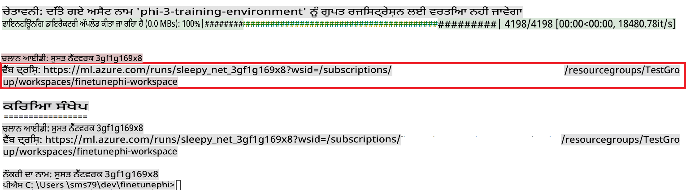

### Deploy the fine-tuned model

To integrate the fine-tuned Phi-3 model with Prompt Flow, you need to deploy the model to make it accessible for real-time inference. This process involves registering the model, creating an online endpoint, and deploying the model.

#### Set the model name, endpoint name, and deployment name for deployment

1. Open *config.py* file.

1. Replace `AZURE_MODEL_NAME = "your_fine_tuned_model_name"` with the desired name for your model.

1. Replace `AZURE_ENDPOINT_NAME = "your_fine_tuned_model_endpoint_name"` with the desired name for your endpoint.

1. Replace `AZURE_DEPLOYMENT_NAME = "your_fine_tuned_model_deployment_name"` ਚਲਾਉਣ ਤੋਂ ਬਾਅਦ, ਆਪਣੀ ਡਿਪਲੋਇਮੈਂਟ ਲਈ ਚਾਹੀਦਾ ਨਾਮ ਦਿੱਤੇ।

#### *deploy_model.py* ਫਾਈਲ ਵਿੱਚ ਕੋਡ ਸ਼ਾਮਲ ਕਰੋ

*deploy_model.py* ਫਾਈਲ ਚਲਾਉਣਾ ਪੂਰੀ ਡਿਪਲੋਇਮੈਂਟ ਪ੍ਰਕਿਰਿਆ ਨੂੰ ਆਟੋਮੇਟ ਕਰਦਾ ਹੈ। ਇਹ ਮਾਡਲ ਨੂੰ ਰਜਿਸਟਰ ਕਰਦਾ ਹੈ, ਇੱਕ ਐਂਡਪੋਇੰਟ ਬਣਾਉਂਦਾ ਹੈ, ਅਤੇ *config.py* ਫਾਈਲ ਵਿੱਚ ਦਿੱਤੀਆਂ ਸੈਟਿੰਗਾਂ ਦੇ ਅਧਾਰ 'ਤੇ ਡਿਪਲੋਇਮੈਂਟ ਨੂੰ ਚਲਾਉਂਦਾ ਹੈ, ਜਿਸ ਵਿੱਚ ਮਾਡਲ ਦਾ ਨਾਮ, ਐਂਡਪੋਇੰਟ ਨਾਮ, ਅਤੇ ਡਿਪਲੋਇਮੈਂਟ ਨਾਮ ਸ਼ਾਮਲ ਹਨ।

1. Visual Studio Code ਵਿੱਚ *deploy_model.py* ਫਾਈਲ ਖੋਲ੍ਹੋ।

1. ਹੇਠਾਂ ਦਿੱਤਾ ਕੋਡ *deploy_model.py* ਵਿੱਚ ਸ਼ਾਮਲ ਕਰੋ।

    ```python
    import logging
    from azure.identity import AzureCliCredential
    from azure.ai.ml import MLClient
    from azure.ai.ml.entities import Model, ProbeSettings, ManagedOnlineEndpoint, ManagedOnlineDeployment, IdentityConfiguration, ManagedIdentityConfiguration, OnlineRequestSettings
    from azure.ai.ml.constants import AssetTypes

    # Configuration imports
    from config import (
        AZURE_SUBSCRIPTION_ID,
        AZURE_RESOURCE_GROUP_NAME,
        AZURE_ML_WORKSPACE_NAME,
        AZURE_MANAGED_IDENTITY_RESOURCE_ID,
        AZURE_MANAGED_IDENTITY_CLIENT_ID,
        AZURE_MODEL_NAME,
        AZURE_ENDPOINT_NAME,
        AZURE_DEPLOYMENT_NAME
    )

    # Constants
    JOB_NAME = "your-job-name"
    COMPUTE_INSTANCE_TYPE = "Standard_E4s_v3"

    deployment_env_vars = {
        "SUBSCRIPTION_ID": AZURE_SUBSCRIPTION_ID,
        "RESOURCE_GROUP_NAME": AZURE_RESOURCE_GROUP_NAME,
        "UAI_CLIENT_ID": AZURE_MANAGED_IDENTITY_CLIENT_ID,
    }

    # Logging setup
    logging.basicConfig(
        format="%(asctime)s - %(levelname)s - %(name)s - %(message)s",
        datefmt="%Y-%m-%d %H:%M:%S",
        level=logging.DEBUG
    )
    logger = logging.getLogger(__name__)

    def get_ml_client():
        """Initialize and return the ML Client."""
        credential = AzureCliCredential()
        return MLClient(credential, AZURE_SUBSCRIPTION_ID, AZURE_RESOURCE_GROUP_NAME, AZURE_ML_WORKSPACE_NAME)

    def register_model(ml_client, model_name, job_name):
        """Register a new model."""
        model_path = f"azureml://jobs/{job_name}/outputs/artifacts/paths/model_output"
        logger.info(f"Registering model {model_name} from job {job_name} at path {model_path}.")
        run_model = Model(
            path=model_path,
            name=model_name,
            description="Model created from run.",
            type=AssetTypes.MLFLOW_MODEL,
        )
        model = ml_client.models.create_or_update(run_model)
        logger.info(f"Registered model ID: {model.id}")
        return model

    def delete_existing_endpoint(ml_client, endpoint_name):
        """Delete existing endpoint if it exists."""
        try:
            endpoint_result = ml_client.online_endpoints.get(name=endpoint_name)
            logger.info(f"Deleting existing endpoint {endpoint_name}.")
            ml_client.online_endpoints.begin_delete(name=endpoint_name).result()
            logger.info(f"Deleted existing endpoint {endpoint_name}.")
        except Exception as e:
            logger.info(f"No existing endpoint {endpoint_name} found to delete: {e}")

    def create_or_update_endpoint(ml_client, endpoint_name, description=""):
        """Create or update an endpoint."""
        delete_existing_endpoint(ml_client, endpoint_name)
        logger.info(f"Creating new endpoint {endpoint_name}.")
        endpoint = ManagedOnlineEndpoint(
            name=endpoint_name,
            description=description,
            identity=IdentityConfiguration(
                type="user_assigned",
                user_assigned_identities=[ManagedIdentityConfiguration(resource_id=AZURE_MANAGED_IDENTITY_RESOURCE_ID)]
            )
        )
        endpoint_result = ml_client.online_endpoints.begin_create_or_update(endpoint).result()
        logger.info(f"Created new endpoint {endpoint_name}.")
        return endpoint_result

    def create_or_update_deployment(ml_client, endpoint_name, deployment_name, model):
        """Create or update a deployment."""

        logger.info(f"Creating deployment {deployment_name} for endpoint {endpoint_name}.")
        deployment = ManagedOnlineDeployment(
            name=deployment_name,
            endpoint_name=endpoint_name,
            model=model.id,
            instance_type=COMPUTE_INSTANCE_TYPE,
            instance_count=1,
            environment_variables=deployment_env_vars,
            request_settings=OnlineRequestSettings(
                max_concurrent_requests_per_instance=3,
                request_timeout_ms=180000,
                max_queue_wait_ms=120000
            ),
            liveness_probe=ProbeSettings(
                failure_threshold=30,
                success_threshold=1,
                period=100,
                initial_delay=500,
            ),
            readiness_probe=ProbeSettings(
                failure_threshold=30,
                success_threshold=1,
                period=100,
                initial_delay=500,
            ),
        )
        deployment_result = ml_client.online_deployments.begin_create_or_update(deployment).result()
        logger.info(f"Created deployment {deployment.name} for endpoint {endpoint_name}.")
        return deployment_result

    def set_traffic_to_deployment(ml_client, endpoint_name, deployment_name):
        """Set traffic to the specified deployment."""
        try:
            # Fetch the current endpoint details
            endpoint = ml_client.online_endpoints.get(name=endpoint_name)
            
            # Log the current traffic allocation for debugging
            logger.info(f"Current traffic allocation: {endpoint.traffic}")
            
            # Set the traffic allocation for the deployment
            endpoint.traffic = {deployment_name: 100}
            
            # Update the endpoint with the new traffic allocation
            endpoint_poller = ml_client.online_endpoints.begin_create_or_update(endpoint)
            updated_endpoint = endpoint_poller.result()
            
            # Log the updated traffic allocation for debugging
            logger.info(f"Updated traffic allocation: {updated_endpoint.traffic}")
            logger.info(f"Set traffic to deployment {deployment_name} at endpoint {endpoint_name}.")
            return updated_endpoint
        except Exception as e:
            # Log any errors that occur during the process
            logger.error(f"Failed to set traffic to deployment: {e}")
            raise


    def main():
        ml_client = get_ml_client()

        registered_model = register_model(ml_client, AZURE_MODEL_NAME, JOB_NAME)
        logger.info(f"Registered model ID: {registered_model.id}")

        endpoint = create_or_update_endpoint(ml_client, AZURE_ENDPOINT_NAME, "Endpoint for finetuned Phi-3 model")
        logger.info(f"Endpoint {AZURE_ENDPOINT_NAME} is ready.")

        try:
            deployment = create_or_update_deployment(ml_client, AZURE_ENDPOINT_NAME, AZURE_DEPLOYMENT_NAME, registered_model)
            logger.info(f"Deployment {AZURE_DEPLOYMENT_NAME} is created for endpoint {AZURE_ENDPOINT_NAME}.")

            set_traffic_to_deployment(ml_client, AZURE_ENDPOINT_NAME, AZURE_DEPLOYMENT_NAME)
            logger.info(f"Traffic is set to deployment {AZURE_DEPLOYMENT_NAME} at endpoint {AZURE_ENDPOINT_NAME}.")
        except Exception as e:
            logger.error(f"Failed to create or update deployment: {e}")

    if __name__ == "__main__":
        main()

    ```

1. `JOB_NAME`:

    - Navigate to Azure Machine Learning resource that you created.
    - Select **Studio web URL** to open the Azure Machine Learning workspace.
    - Select **Jobs** from the left side tab.
    - Select the experiment for fine-tuning. For example, *finetunephi*.
    - Select the job that you created.
    - Copy and paste your job Name into the `JOB_NAME = "your-job-name"` in *deploy_model.py* file.

1. Replace `COMPUTE_INSTANCE_TYPE` ਨਾਲ ਆਪਣੇ ਵਿਸ਼ੇਸ਼ ਵੇਰਵੇ ਸ਼ਾਮਲ ਕਰੋ।

1. *deploy_model.py* ਸਕ੍ਰਿਪਟ ਚਲਾਉਣ ਲਈ ਹੇਠਾਂ ਦਿੱਤਾ ਕਮਾਂਡ ਟਾਈਪ ਕਰੋ ਅਤੇ Azure Machine Learning ਵਿੱਚ ਡਿਪਲੋਇਮੈਂਟ ਪ੍ਰਕਿਰਿਆ ਸ਼ੁਰੂ ਕਰੋ।

    ```python
    python deploy_model.py
    ```

> [!WARNING]
> ਆਪਣੇ ਖਾਤੇ ਵਿੱਚ ਵਾਧੂ ਖਰਚੇ ਤੋਂ ਬਚਣ ਲਈ, ਇਹ ਯਕੀਨੀ ਬਣਾਓ ਕਿ ਬਣਾਏ ਗਏ ਐਂਡਪੋਇੰਟ ਨੂੰ Azure Machine Learning ਵਰਕਸਪੇਸ ਵਿੱਚ ਹਟਾ ਦਿੱਤਾ ਗਿਆ ਹੈ।
>

#### Azure Machine Learning ਵਰਕਸਪੇਸ ਵਿੱਚ ਡਿਪਲੋਇਮੈਂਟ ਸਥਿਤੀ ਚੈਕ ਕਰੋ

1. [Azure ML Studio](https://ml.azure.com/home?wt.mc_id=studentamb_279723) ਵੇਖੋ।

1. ਉਸ Azure Machine Learning ਵਰਕਸਪੇਸ ਤੇ ਜਾਓ ਜੋ ਤੁਸੀਂ ਬਣਾਇਆ ਸੀ।

1. **Studio web URL** ਨੂੰ ਚੁਣੋ ਤਾਂ ਜੋ Azure Machine Learning ਵਰਕਸਪੇਸ ਖੋਲ੍ਹ ਸਕੋ।

1. ਖੱਬੇ ਪਾਸੇ ਵਾਲੀ ਟੈਬ ਵਿੱਚੋਂ **Endpoints** ਚੁਣੋ।

    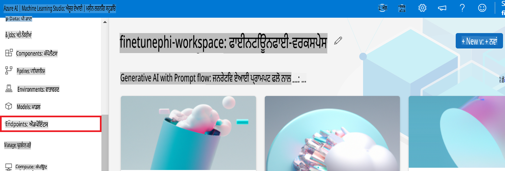

2. ਉਸ ਐਂਡਪੋਇੰਟ ਨੂੰ ਚੁਣੋ ਜੋ ਤੁਸੀਂ ਬਣਾਇਆ ਸੀ।

    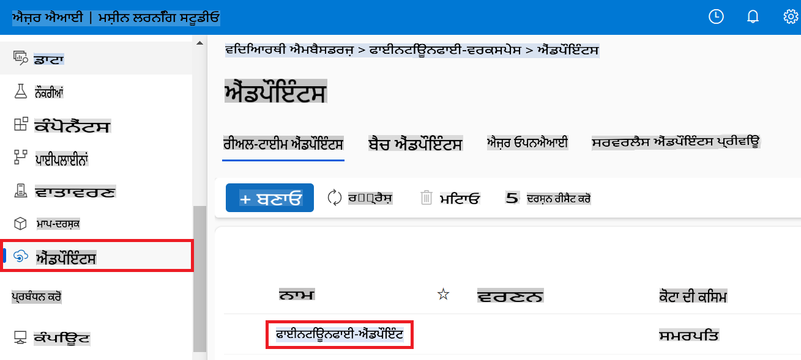

3. ਇਸ ਪੰਨੇ 'ਤੇ, ਤੁਸੀਂ ਡਿਪਲੋਇਮੈਂਟ ਪ੍ਰਕਿਰਿਆ ਦੌਰਾਨ ਬਣਾਏ ਗਏ ਐਂਡਪੋਇੰਟਸ ਨੂੰ ਮੈਨੇਜ ਕਰ ਸਕਦੇ ਹੋ।

## ਸценਾਰਿਓ 3: Prompt flow ਨਾਲ ਇੰਟੀਗ੍ਰੇਟ ਕਰੋ ਅਤੇ ਆਪਣੇ ਕਸਟਮ ਮਾਡਲ ਨਾਲ ਗੱਲਬਾਤ ਕਰੋ

### ਕਸਟਮ Phi-3 ਮਾਡਲ ਨੂੰ Prompt flow ਨਾਲ ਇੰਟੀਗ੍ਰੇਟ ਕਰੋ

ਸਫਲਤਾਪੂਰਵਕ ਆਪਣੇ ਫਾਈਨ-ਟਿਊਨ ਮਾਡਲ ਨੂੰ ਡਿਪਲੋਇ ਕਰਨ ਤੋਂ ਬਾਅਦ, ਹੁਣ ਤੁਸੀਂ ਇਸਨੂੰ ਰੀਅਲ-ਟਾਈਮ ਐਪਲੀਕੇਸ਼ਨ ਵਿੱਚ ਵਰਤਣ ਲਈ Prompt flow ਨਾਲ ਇੰਟੀਗ੍ਰੇਟ ਕਰ ਸਕਦੇ ਹੋ, ਜੋ ਤੁਹਾਡੇ ਕਸਟਮ Phi-3 ਮਾਡਲ ਨਾਲ ਵੱਖ-ਵੱਖ ਇੰਟਰਐਕਟਿਵ ਕੰਮਾਂ ਨੂੰ ਸਮਰਥਿਤ ਕਰਦਾ ਹੈ।

#### ਫਾਈਨ-ਟਿਊਨ Phi-3 ਮਾਡਲ ਦੇ api key ਅਤੇ endpoint uri ਸੈਟ ਕਰੋ

1. ਉਸ Azure Machine Learning ਵਰਕਸਪੇਸ ਤੇ ਜਾਓ ਜੋ ਤੁਸੀਂ ਬਣਾਇਆ ਸੀ।
1. ਖੱਬੇ ਪਾਸੇ ਵਾਲੀ ਟੈਬ ਵਿੱਚੋਂ **Endpoints** ਚੁਣੋ।
1. ਉਸ ਐਂਡਪੋਇੰਟ ਨੂੰ ਚੁਣੋ ਜੋ ਤੁਸੀਂ ਬਣਾਇਆ ਸੀ।
1. ਨੈਵੀਗੇਸ਼ਨ ਮੇਨੂ ਵਿੱਚੋਂ **Consume** ਚੁਣੋ।
1. ਆਪਣਾ **REST endpoint** ਕਾਪੀ ਕਰੋ ਅਤੇ ਇਸਨੂੰ *config.py* ਫਾਈਲ ਵਿੱਚ ਪੇਸਟ ਕਰੋ, `AZURE_ML_ENDPOINT = "your_fine_tuned_model_endpoint_uri"` with your **REST endpoint**.
1. Copy and paste your **Primary key** into the *config.py* file, replacing `AZURE_ML_API_KEY = "your_fine_tuned_model_api_key"` ਨੂੰ ਆਪਣੇ **Primary key** ਨਾਲ ਬਦਲੋ।

    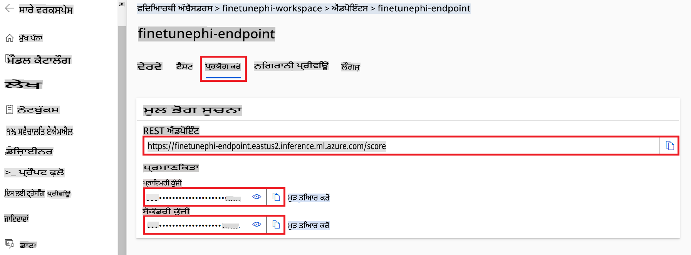

#### *flow.dag.yml* ਫਾਈਲ ਵਿੱਚ ਕੋਡ ਸ਼ਾਮਲ ਕਰੋ

1. Visual Studio Code ਵਿੱਚ *flow.dag.yml* ਫਾਈਲ ਖੋਲ੍ਹੋ।

1. ਹੇਠਾਂ ਦਿੱਤਾ ਕੋਡ *flow.dag.yml* ਵਿੱਚ ਸ਼ਾਮਲ ਕਰੋ।

    ```yml
    inputs:
      input_data:
        type: string
        default: "Who founded Microsoft?"

    outputs:
      answer:
        type: string
        reference: ${integrate_with_promptflow.output}

    nodes:
    - name: integrate_with_promptflow
      type: python
      source:
        type: code
        path: integrate_with_promptflow.py
      inputs:
        input_data: ${inputs.input_data}
    ```

#### *integrate_with_promptflow.py* ਫਾਈਲ ਵਿੱਚ ਕੋਡ ਸ਼ਾਮਲ ਕਰੋ

1. Visual Studio Code ਵਿੱਚ *integrate_with_promptflow.py* ਫਾਈਲ ਖੋਲ੍ਹੋ।

1. ਹੇਠਾਂ ਦਿੱਤਾ ਕੋਡ *integrate_with_promptflow.py* ਵਿੱਚ ਸ਼ਾਮਲ ਕਰੋ।

    ```python
    import logging
    import requests
    from promptflow.core import tool
    import asyncio
    import platform
    from config import (
        AZURE_ML_ENDPOINT,
        AZURE_ML_API_KEY
    )

    # Logging setup
    logging.basicConfig(
        format="%(asctime)s - %(levelname)s - %(name)s - %(message)s",
        datefmt="%Y-%m-%d %H:%M:%S",
        level=logging.DEBUG
    )
    logger = logging.getLogger(__name__)

    def query_azml_endpoint(input_data: list, endpoint_url: str, api_key: str) -> str:
        """
        Send a request to the Azure ML endpoint with the given input data.
        """
        headers = {
            "Content-Type": "application/json",
            "Authorization": f"Bearer {api_key}"
        }
        data = {
            "input_data": [input_data],
            "params": {
                "temperature": 0.7,
                "max_new_tokens": 128,
                "do_sample": True,
                "return_full_text": True
            }
        }
        try:
            response = requests.post(endpoint_url, json=data, headers=headers)
            response.raise_for_status()
            result = response.json()[0]
            logger.info("Successfully received response from Azure ML Endpoint.")
            return result
        except requests.exceptions.RequestException as e:
            logger.error(f"Error querying Azure ML Endpoint: {e}")
            raise

    def setup_asyncio_policy():
        """
        Setup asyncio event loop policy for Windows.
        """
        if platform.system() == 'Windows':
            asyncio.set_event_loop_policy(asyncio.WindowsSelectorEventLoopPolicy())
            logger.info("Set Windows asyncio event loop policy.")

    @tool
    def my_python_tool(input_data: str) -> str:
        """
        Tool function to process input data and query the Azure ML endpoint.
        """
        setup_asyncio_policy()
        return query_azml_endpoint(input_data, AZURE_ML_ENDPOINT, AZURE_ML_API_KEY)

    ```

### ਆਪਣੇ ਕਸਟਮ ਮਾਡਲ ਨਾਲ ਗੱਲਬਾਤ ਕਰੋ

1. *deploy_model.py* ਸਕ੍ਰਿਪਟ ਚਲਾਉਣ ਲਈ ਹੇਠਾਂ ਦਿੱਤਾ ਕਮਾਂਡ ਟਾਈਪ ਕਰੋ ਅਤੇ Azure Machine Learning ਵਿੱਚ ਡਿਪਲੋਇਮੈਂਟ ਪ੍ਰਕਿਰਿਆ ਸ਼ੁਰੂ ਕਰੋ।

    ```python
    pf flow serve --source ./ --port 8080 --host localhost
    ```

1. Here's an example of the results: ਹੁਣ ਤੁਸੀਂ ਆਪਣੇ ਕਸਟਮ Phi-3 ਮਾਡਲ ਨਾਲ ਗੱਲਬਾਤ ਕਰ ਸਕਦੇ ਹੋ। ਇਹ ਸਿਫਾਰਸ਼ ਕੀਤੀ ਜਾਂਦੀ ਹੈ ਕਿ ਫਾਈਨ-ਟਿਊਨਿੰਗ ਲਈ ਵਰਤੇ ਗਏ ਡਾਟੇ ਦੇ ਅਧਾਰ ਤੇ ਸਵਾਲ ਪੁੱਛੇ ਜਾਣ।

    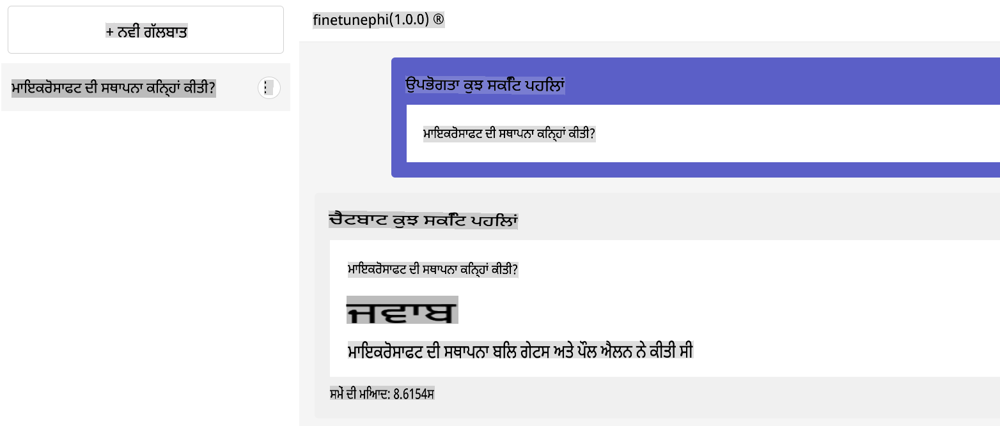

**ਅਸਵੀਕਤੀ**:  
ਇਹ ਦਸਤਾਵੇਜ਼ ਮਸ਼ੀਨ ਅਧਾਰਿਤ AI ਅਨੁਵਾਦ ਸੇਵਾਵਾਂ ਦੀ ਵਰਤੋਂ ਕਰਕੇ ਅਨੁਵਾਦਿਤ ਕੀਤਾ ਗਿਆ ਹੈ। ਜਦੋਂ ਕਿ ਅਸੀਂ ਸਹੀ ਹੋਣ ਦਾ ਯਤਨ ਕਰਦੇ ਹਾਂ, ਕਿਰਪਾ ਕਰਕੇ ਧਿਆਨ ਦਿਓ ਕਿ ਸਵੈਚਾਲਿਤ ਅਨੁਵਾਦਾਂ ਵਿੱਚ ਗਲਤੀਆਂ ਜਾਂ ਅਸੁੱਤਰ ਹੋ ਸਕਦੇ ਹਨ। ਇਸ ਦੀ ਮੂਲ ਭਾਸ਼ਾ ਵਿੱਚ ਮੌਜੂਦ ਅਸਲ ਦਸਤਾਵੇਜ਼ ਨੂੰ ਅਧਿਕਾਰਤ ਸਰੋਤ ਮੰਨਿਆ ਜਾਣਾ ਚਾਹੀਦਾ ਹੈ। ਮਹੱਤਵਪੂਰਨ ਜਾਣਕਾਰੀ ਲਈ, ਪੇਸ਼ੇਵਰ ਮਨੁੱਖੀ ਅਨੁਵਾਦ ਦੀ ਸਿਫਾਰਸ਼ ਕੀਤੀ ਜਾਂਦੀ ਹੈ। ਇਸ ਅਨੁਵਾਦ ਦੇ ਉਪਯੋਗ ਤੋਂ ਪੈਦਾ ਹੋਣ ਵਾਲੇ ਕਿਸੇ ਵੀ ਗਲਤਫਹਮੀਆਂ ਜਾਂ ਗਲਤ ਵਿਆਖਿਆਵਾਂ ਲਈ ਅਸੀਂ ਜ਼ਿੰਮੇਵਾਰ ਨਹੀਂ ਹਾਂ।