# ਫਾਈਨ-ਟਿਊਨ ਅਤੇ Azure AI Foundry ਵਿੱਚ Prompt Flow ਨਾਲ ਕਸਟਮ Phi-3 ਮਾਡਲਾਂ ਨੂੰ ਇੰਟੀਗ੍ਰੇਟ ਕਰੋ

ਇਹ ਏਂਡ-ਟੂ-ਏਂਡ (E2E) ਸੈਂਪਲ ਮਾਇਕਰੋਸਾਫਟ ਟੈਕ ਕਮਿਊਨਿਟੀ ਦੇ ਗਾਈਡ "[Fine-Tune and Integrate Custom Phi-3 Models with Prompt Flow in Azure AI Foundry](https://techcommunity.microsoft.com/t5/educator-developer-blog/fine-tune-and-integrate-custom-phi-3-models-with-prompt-flow-in/ba-p/4191726?WT.mc_id=aiml-137032-kinfeylo)" 'ਤੇ ਆਧਾਰਿਤ ਹੈ। ਇਹ ਸੈਂਪਲ ਕਸਟਮ Phi-3 ਮਾਡਲਾਂ ਨੂੰ ਫਾਈਨ-ਟਿਊਨ, ਡਿਪਲੋਇੰਗ ਅਤੇ ਇੰਟੀਗ੍ਰੇਟ ਕਰਨ ਦੇ ਪ੍ਰਕਿਰਿਆਵਾਂ ਦੀ ਜਾਣਕਾਰੀ ਦਿੰਦਾ ਹੈ।  
E2E ਸੈਂਪਲ "[Fine-Tune and Integrate Custom Phi-3 Models with Prompt Flow](./E2E_Phi-3-FineTuning_PromptFlow_Integration.md)" ਤੋਂ ਵੱਖ, ਜੋ ਕਿ ਕੋਡ ਨੂੰ ਲੋਕਲ ਰਨ ਕਰਨ ਵਿੱਚ ਸ਼ਾਮਲ ਸੀ, ਇਹ ਟਿਊਟੋਰੀਅਲ ਸਿਰਫ਼ Azure AI / ML Studio ਵਿੱਚ ਮਾਡਲ ਨੂੰ ਫਾਈਨ-ਟਿਊਨ ਅਤੇ ਇੰਟੀਗ੍ਰੇਟ ਕਰਨ 'ਤੇ ਧਿਆਨ ਕੇਂਦਰਿਤ ਕਰਦਾ ਹੈ।

## ਝਲਕ

ਇਸ E2E ਸੈਂਪਲ ਵਿੱਚ, ਤੁਸੀਂ ਸਿੱਖੋਗੇ ਕਿ ਕਿਵੇਂ Phi-3 ਮਾਡਲ ਨੂੰ ਫਾਈਨ-ਟਿਊਨ ਕਰਨਾ ਹੈ ਅਤੇ ਇਸਨੂੰ Azure AI Foundry ਵਿੱਚ Prompt Flow ਨਾਲ ਇੰਟੀਗ੍ਰੇਟ ਕਰਨਾ ਹੈ। Azure AI / ML Studio ਦੀ ਵਰਤੋਂ ਕਰਕੇ, ਤੁਸੀਂ ਕਸਟਮ AI ਮਾਡਲਾਂ ਨੂੰ ਡਿਪਲੋਇੰਗ ਅਤੇ ਵਰਤਣ ਲਈ ਇੱਕ ਵਰਕਫਲੋ ਸਥਾਪਤ ਕਰੋਗੇ। ਇਹ E2E ਸੈਂਪਲ ਤਿੰਨ ਸਨੇਰੀਓਜ਼ ਵਿੱਚ ਵੰਡਿਆ ਗਿਆ ਹੈ:

**ਸਨੇਰੀਓ 1: Azure ਰਿਸੋਸਿਸ ਸੈਟਅੱਪ ਕਰੋ ਅਤੇ ਫਾਈਨ-ਟਿਊਨਿੰਗ ਲਈ ਤਿਆਰ ਕਰੋ**  
**ਸਨੇਰੀਓ 2: Phi-3 ਮਾਡਲ ਨੂੰ ਫਾਈਨ-ਟਿਊਨ ਕਰੋ ਅਤੇ Azure Machine Learning Studio ਵਿੱਚ ਡਿਪਲੋਇ ਕਰੋ**  
**ਸਨੇਰੀਓ 3: Prompt Flow ਨਾਲ ਇੰਟੀਗ੍ਰੇਟ ਕਰੋ ਅਤੇ ਆਪਣੇ ਕਸਟਮ ਮਾਡਲ ਨਾਲ ਗੱਲਬਾਤ ਕਰੋ**

ਇਸ E2E ਸੈਂਪਲ ਦੀ ਝਲਕ ਹੇਠ ਦਿੱਤੀ ਹੈ।

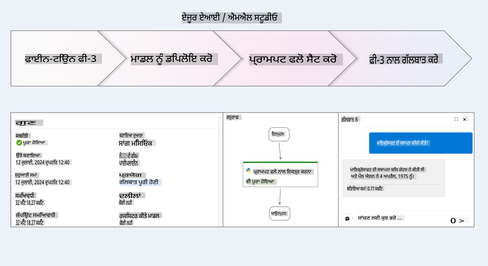

### ਸੂਚੀ

1. **[ਸਨੇਰੀਓ 1: Azure ਰਿਸੋਸਿਸ ਸੈਟਅੱਪ ਕਰੋ ਅਤੇ ਫਾਈਨ-ਟਿਊਨਿੰਗ ਲਈ ਤਿਆਰ ਕਰੋ](../../../../../../md/02.Application/01.TextAndChat/Phi3)**  
    - [Azure Machine Learning ਵਰਕਸਪੇਸ ਬਣਾਓ](../../../../../../md/02.Application/01.TextAndChat/Phi3)  
    - [Azure Subscription ਵਿੱਚ GPU ਕੋਟਾ ਦੀ ਅਰਜ਼ੀ ਦਿਓ](../../../../../../md/02.Application/01.TextAndChat/Phi3)  
    - [ਰੋਲ ਅਸਾਈਨਮੈਂਟ ਸ਼ਾਮਲ ਕਰੋ](../../../../../../md/02.Application/01.TextAndChat/Phi3)  
    - [ਪ੍ਰੋਜੈਕਟ ਸੈਟਅੱਪ ਕਰੋ](../../../../../../md/02.Application/01.TextAndChat/Phi3)  
    - [ਫਾਈਨ-ਟਿਊਨਿੰਗ ਲਈ ਡੇਟਾਸੈਟ ਤਿਆਰ ਕਰੋ](../../../../../../md/02.Application/01.TextAndChat/Phi3)  

1. **[ਸਨੇਰੀਓ 2: Phi-3 ਮਾਡਲ ਨੂੰ ਫਾਈਨ-ਟਿਊਨ ਕਰੋ ਅਤੇ Azure Machine Learning Studio ਵਿੱਚ ਡਿਪਲੋਇ ਕਰੋ](../../../../../../md/02.Application/01.TextAndChat/Phi3)**  
    - [Phi-3 ਮਾਡਲ ਨੂੰ ਫਾਈਨ-ਟਿਊਨ ਕਰੋ](../../../../../../md/02.Application/01.TextAndChat/Phi3)  
    - [ਫਾਈਨ-ਟਿਊਨਡ Phi-3 ਮਾਡਲ ਨੂੰ ਡਿਪਲੋਇ ਕਰੋ](../../../../../../md/02.Application/01.TextAndChat/Phi3)  

1. **[ਸਨੇਰੀਓ 3: Prompt Flow ਨਾਲ ਇੰਟੀਗ੍ਰੇਟ ਕਰੋ ਅਤੇ ਆਪਣੇ ਕਸਟਮ ਮਾਡਲ ਨਾਲ ਗੱਲਬਾਤ ਕਰੋ](../../../../../../md/02.Application/01.TextAndChat/Phi3)**  
    - [ਕਸਟਮ Phi-3 ਮਾਡਲ ਨੂੰ Prompt Flow ਨਾਲ ਇੰਟੀਗ੍ਰੇਟ ਕਰੋ](../../../../../../md/02.Application/01.TextAndChat/Phi3)  
    - [ਆਪਣੇ ਕਸਟਮ Phi-3 ਮਾਡਲ ਨਾਲ ਗੱਲਬਾਤ ਕਰੋ](../../../../../../md/02.Application/01.TextAndChat/Phi3)  

---

## ਸਨੇਰੀਓ 1: Azure ਰਿਸੋਸਿਸ ਸੈਟਅੱਪ ਕਰੋ ਅਤੇ ਫਾਈਨ-ਟਿਊਨਿੰਗ ਲਈ ਤਿਆਰ ਕਰੋ

### Azure Machine Learning ਵਰਕਸਪੇਸ ਬਣਾਓ

1. ਪੋਰਟਲ ਪੇਜ ਦੇ ਉੱਪਰਲੇ **ਸਰਚ ਬਾਰ** ਵਿੱਚ *azure machine learning* ਲਿਖੋ ਅਤੇ ਜੋ ਵਿਕਲਪ ਨਜ਼ਰ ਆਉਣ ਉਹ ਵਿੱਚੋਂ **Azure Machine Learning** ਚੁਣੋ।  

    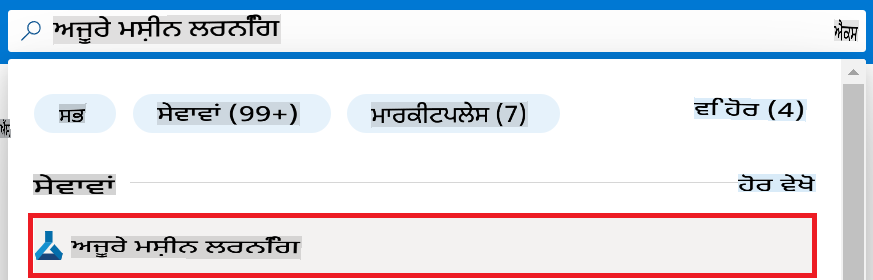

2. ਨੈਵੀਗੇਸ਼ਨ ਮੇਨੂ ਵਿੱਚੋਂ **+ Create** ਚੁਣੋ।  

3. ਨੈਵੀਗੇਸ਼ਨ ਮੇਨੂ ਵਿੱਚੋਂ **New workspace** ਚੁਣੋ।  

    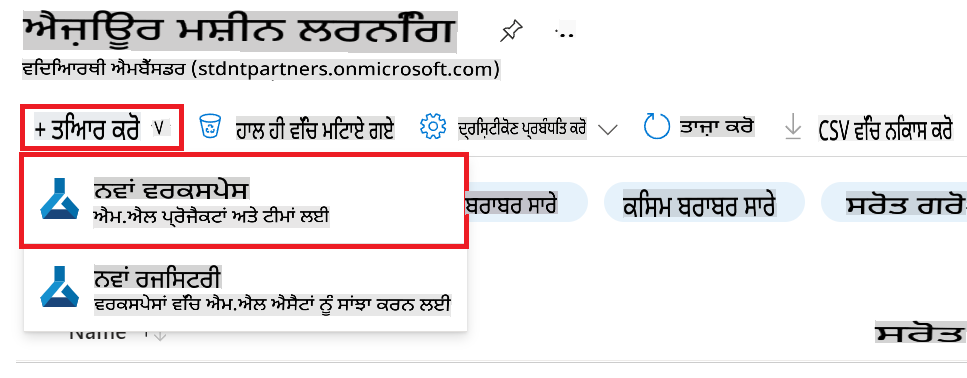

4. ਹੇਠ ਲਿਖੇ ਕੰਮ ਕਰੋ:  

    - ਆਪਣੀ Azure **Subscription** ਚੁਣੋ।  
    - ਵਰਤਣ ਲਈ **Resource group** ਚੁਣੋ (ਲੋੜ ਪੈਣ ਤੇ ਨਵਾਂ ਬਣਾਓ)।  
    - **Workspace Name** ਦਰਜ ਕਰੋ। ਇਹ ਵਿਲੱਖਣ ਹੋਣਾ ਚਾਹੀਦਾ ਹੈ।  
    - ਵਰਤਣ ਲਈ **Region** ਚੁਣੋ।  
    - ਵਰਤਣ ਲਈ **Storage account** ਚੁਣੋ (ਲੋੜ ਪੈਣ ਤੇ ਨਵਾਂ ਬਣਾਓ)।  
    - ਵਰਤਣ ਲਈ **Key vault** ਚੁਣੋ (ਲੋੜ ਪੈਣ ਤੇ ਨਵਾਂ ਬਣਾਓ)।  
    - ਵਰਤਣ ਲਈ **Application insights** ਚੁਣੋ (ਲੋੜ ਪੈਣ ਤੇ ਨਵਾਂ ਬਣਾਓ)।  
    - ਵਰਤਣ ਲਈ **Container registry** ਚੁਣੋ (ਲੋੜ ਪੈਣ ਤੇ ਨਵਾਂ ਬਣਾਓ)।  

    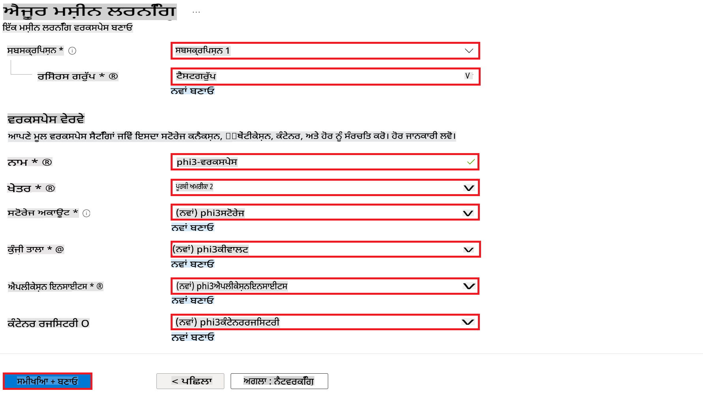

5. **Review + Create** ਚੁਣੋ।  

6. **Create** ਚੁਣੋ।  

---

### Azure Subscription ਵਿੱਚ GPU ਕੋਟਾ ਦੀ ਅਰਜ਼ੀ ਦਿਓ

ਇਸ ਟਿਊਟੋਰੀਅਲ ਵਿੱਚ, ਤੁਸੀਂ GPU ਦੀ ਵਰਤੋਂ ਕਰਕੇ Phi-3 ਮਾਡਲ ਨੂੰ ਫਾਈਨ-ਟਿਊਨ ਅਤੇ ਡਿਪਲੋਇ ਕਰਨਾ ਸਿੱਖੋਗੇ। ਫਾਈਨ-ਟਿਊਨਿੰਗ ਲਈ, ਤੁਸੀਂ *Standard_NC24ads_A100_v4* GPU ਦੀ ਵਰਤੋਂ ਕਰੋਗੇ, ਜਿਸ ਲਈ ਕੋਟਾ ਅਰਜ਼ੀ ਦੀ ਲੋੜ ਹੈ। ਡਿਪਲੋਇਮੈਂਟ ਲਈ, ਤੁਸੀਂ *Standard_NC6s_v3* GPU ਦੀ ਵਰਤੋਂ ਕਰੋਗੇ, ਜਿਸ ਲਈ ਵੀ ਕੋਟਾ ਅਰਜ਼ੀ ਦੀ ਲੋੜ ਹੈ।

> [!NOTE]  
> ਸਿਰਫ਼ Pay-As-You-Go ਸਬਸਕ੍ਰਿਪਸ਼ਨ (ਸਧਾਰਣ ਸਬਸਕ੍ਰਿਪਸ਼ਨ ਕਿਸਮ) GPU ਅਲੋਕੇਸ਼ਨ ਲਈ ਯੋਗ ਹਨ; ਲਾਭ ਸਬਸਕ੍ਰਿਪਸ਼ਨ ਹਾਲੇ ਸਹਾਇਕ ਨਹੀਂ ਹਨ।  

1. [Azure ML Studio](https://ml.azure.com/home?wt.mc_id=studentamb_279723) 'ਤੇ ਜਾਓ।  

1. *Standard NCADSA100v4 Family* ਕੋਟਾ ਦੀ ਅਰਜ਼ੀ ਦੇਣ ਲਈ ਹੇਠ ਲਿਖੇ ਕੰਮ ਕਰੋ:  

    - ਖੱਬੇ ਪਾਸੇ ਟੈਬ ਵਿੱਚੋਂ **Quota** ਚੁਣੋ।  
    - ਵਰਤਣ ਲਈ **Virtual machine family** ਚੁਣੋ। ਉਦਾਹਰਨ ਲਈ, **Standard NCADSA100v4 Family Cluster Dedicated vCPUs** ਚੁਣੋ, ਜਿਸ ਵਿੱਚ *Standard_NC24ads_A100_v4* GPU ਸ਼ਾਮਲ ਹੈ।  
    - ਨੈਵੀਗੇਸ਼ਨ ਮੇਨੂ ਵਿੱਚੋਂ **Request quota** ਚੁਣੋ।  

        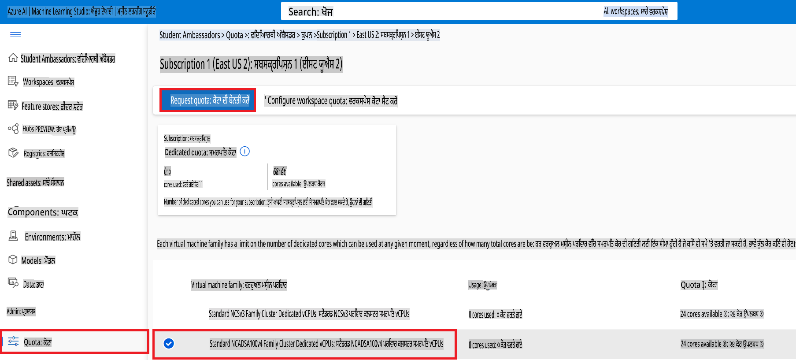

    - **Request quota** ਪੇਜ ਵਿੱਚ, ਵਰਤਣ ਲਈ **New cores limit** ਦਰਜ ਕਰੋ। ਉਦਾਹਰਨ ਲਈ, 24।  
    - **Request quota** ਪੇਜ ਵਿੱਚ, GPU ਕੋਟਾ ਦੀ ਅਰਜ਼ੀ ਦੇਣ ਲਈ **Submit** ਚੁਣੋ।  

1. *Standard NCSv3 Family* ਕੋਟਾ ਦੀ ਅਰਜ਼ੀ ਦੇਣ ਲਈ ਹੇਠ ਲਿਖੇ ਕੰਮ ਕਰੋ:  

    - ਖੱਬੇ ਪਾਸੇ ਟੈਬ ਵਿੱਚੋਂ **Quota** ਚੁਣੋ।  
    - ਵਰਤਣ ਲਈ **Virtual machine family** ਚੁਣੋ। ਉਦਾਹਰਨ ਲਈ, **Standard NCSv3 Family Cluster Dedicated vCPUs** ਚੁਣੋ, ਜਿਸ ਵਿੱਚ *Standard_NC6s_v3* GPU ਸ਼ਾਮਲ ਹੈ।  
    - ਨੈਵੀਗੇਸ਼ਨ ਮੇਨੂ ਵਿੱਚੋਂ **Request quota** ਚੁਣੋ।  
    - **Request quota** ਪੇਜ ਵਿੱਚ, ਵਰਤਣ ਲਈ **New cores limit** ਦਰਜ ਕਰੋ। ਉਦਾਹਰਨ ਲਈ, 24।  
    - **Request quota** ਪੇਜ ਵਿੱਚ, GPU ਕੋਟਾ ਦੀ ਅਰਜ਼ੀ ਦੇਣ ਲਈ **Submit** ਚੁਣੋ।  

---

### ਰੋਲ ਅਸਾਈਨਮੈਂਟ ਸ਼ਾਮਲ ਕਰੋ

ਮਾਡਲਾਂ ਨੂੰ ਫਾਈਨ-ਟਿਊਨ ਅਤੇ ਡਿਪਲੋਇ ਕਰਨ ਲਈ, ਤੁਹਾਨੂੰ ਪਹਿਲਾਂ ਇੱਕ User Assigned Managed Identity (UAI) ਬਣਾਉਣੀ ਹੋਵੇਗੀ ਅਤੇ ਇਸਨੂੰ ਸਹੀ ਅਧਿਕਾਰਾਂ ਦੇ ਨਾਲ ਅਸਾਈਨ ਕਰਨਾ ਹੋਵੇਗਾ। ਇਹ UAI ਡਿਪਲੋਇਮੈਂਟ ਦੌਰਾਨ ਪ੍ਰਮਾਣਿਕਤਾ ਲਈ ਵਰਤੀ ਜਾਵੇਗੀ।  

#### User Assigned Managed Identity (UAI) ਬਣਾਓ

1. ਪੋਰਟਲ ਪੇਜ ਦੇ ਉੱਪਰਲੇ **ਸਰਚ ਬਾਰ** ਵਿੱਚ *managed identities* ਲਿਖੋ ਅਤੇ **Managed Identities** ਚੁਣੋ।  

    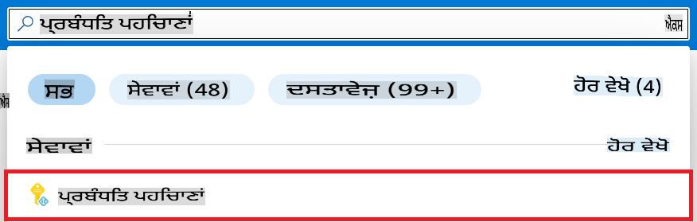

1. **+ Create** ਚੁਣੋ।  

    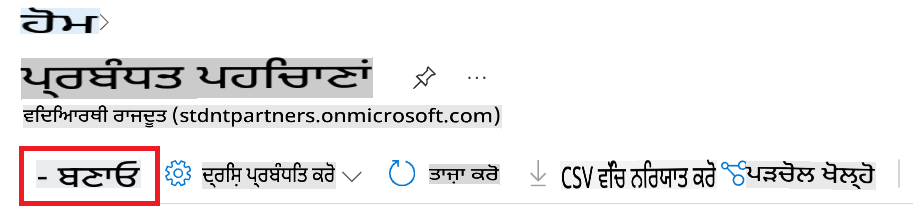

1. ਹੇਠ ਲਿਖੇ ਕੰਮ ਕਰੋ:  

    - ਆਪਣੀ Azure **Subscription** ਚੁਣੋ।  
    - ਵਰਤਣ ਲਈ **Resource group** ਚੁਣੋ।  
    - ਵਰਤਣ ਲਈ **Region** ਚੁਣੋ।  
    - **Name** ਦਰਜ ਕਰੋ। ਇਹ ਵਿਲੱਖਣ ਹੋਣਾ ਚਾਹੀਦਾ ਹੈ।  

    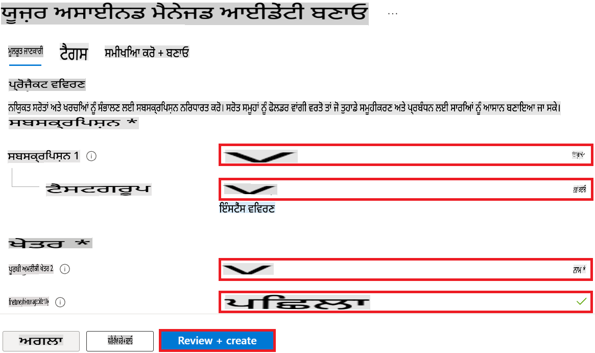

1. **Review + create** ਚੁਣੋ।  

1. **+ Create** ਚੁਣੋ।  

#### Managed Identity ਨੂੰ Contributor ਰੋਲ ਅਸਾਈਨ ਕਰੋ

1. ਉਸ Managed Identity ਰਿਸੋਰਸ ਤੇ ਜਾਓ ਜੋ ਤੁਸੀਂ ਬਣਾਇਆ ਹੈ।  

1. ਖੱਬੇ ਪਾਸੇ ਟੈਬ ਵਿੱਚੋਂ **Azure role assignments** ਚੁਣੋ।  

1. ਨੈਵੀਗੇਸ਼ਨ ਮੇਨੂ ਵਿੱਚੋਂ **+Add role assignment** ਚੁਣੋ।  

1. **Add role assignment** ਪੇਜ ਵਿੱਚ ਹੇਠ ਲਿਖੇ ਕੰਮ ਕਰੋ:  
    - **Scope** ਨੂੰ **Resource group** ਤੇ ਸੈਟ ਕਰੋ।  
    - ਆਪਣੀ Azure **Subscription** ਚੁਣੋ।  
    - ਵਰਤਣ ਲਈ **Resource group** ਚੁਣੋ।  
    - **Role** ਨੂੰ **Contributor** ਤੇ ਸੈਟ ਕਰੋ।  

    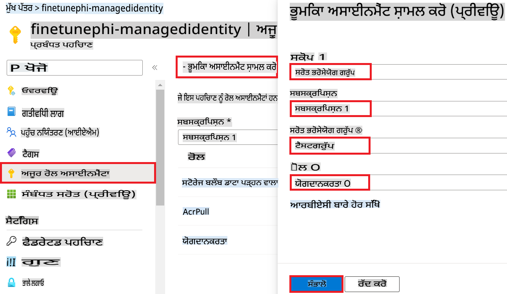

2. **Save** ਚੁਣੋ।  

#### Managed Identity ਨੂੰ Storage Blob Data Reader ਰੋਲ ਅਸਾਈਨ ਕਰੋ

1. **ਸਰਚ ਬਾਰ** ਵਿੱਚ *storage accounts* ਲਿਖੋ ਅਤੇ **Storage accounts** ਚੁਣੋ।  

    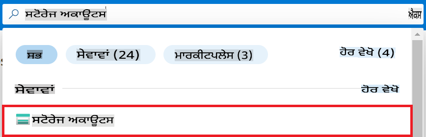

1. ਉਸ Storage Account ਨੂੰ ਚੁਣੋ ਜੋ Azure Machine Learning ਵਰਕਸਪੇਸ ਨਾਲ ਜੁੜਿਆ ਹੋਇਆ ਹੈ। ਉਦਾਹਰਨ ਲਈ, *finetunephistorage*।  

1. **Add role assignment** ਪੇਜ ਤੇ ਜਾਣ ਲਈ ਹੇਠ ਲਿਖੇ ਕੰਮ ਕਰੋ:  

    - ਉਸ Storage Account ਤੇ ਜਾਓ ਜੋ ਤੁਸੀਂ ਬਣਾਇਆ ਹੈ।  
    - ਖੱਬੇ ਪਾਸੇ ਟੈਬ ਵਿੱਚੋਂ **Access Control (IAM)** ਚੁਣੋ।  
    - ਨੈਵੀਗੇਸ਼ਨ ਮੇਨੂ ਵਿੱਚੋਂ **+ Add** ਚੁਣੋ।  
    - **Add role assignment** ਚੁਣੋ।  

    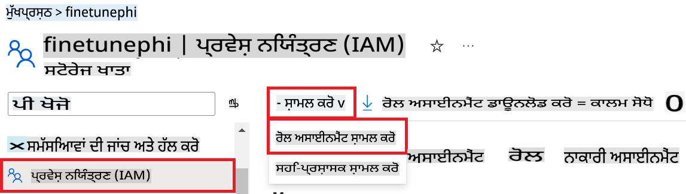

1. **Add role assignment** ਪੇਜ ਵਿੱਚ ਹੇਠ ਲਿਖੇ ਕੰਮ ਕਰੋ:  

    - **Role** ਪੇਜ ਵਿੱਚ, **Storage Blob Data Reader** ਲਿਖੋ ਅਤੇ ਵਿਕਲਪਾਂ ਵਿੱਚੋਂ **Storage Blob Data Reader** ਚੁਣੋ।  
    - **Role** ਪੇਜ ਵਿੱਚ **Next** ਚੁਣੋ।  
    - **Members** ਪੇਜ ਵਿੱਚ **Assign access to** ਨੂੰ **Managed identity** ਤੇ ਸੈਟ ਕਰੋ।  
    - **Members** ਪੇਜ ਵਿੱਚ **+ Select members** ਚੁਣੋ।  
    - **Select managed identities** ਪੇਜ ਵਿੱਚ ਆਪਣੀ Azure **Subscription** ਚੁਣੋ।  
    - **Managed identity** ਨੂੰ **Manage Identity** ਤੇ ਸੈਟ ਕਰੋ।  
    - ਉਹ Managed Identity ਚੁਣੋ ਜੋ ਤੁਸੀਂ ਬਣਾਇਆ ਹੈ। ਉਦਾਹਰਨ ਲਈ, *finetunephi-managedidentity*।  
    - **Select** ਚੁਣੋ।  

    

1. **Review + assign** ਚੁਣੋ।  

#### Managed Identity ਨੂੰ AcrPull ਰੋਲ ਅਸਾਈਨ ਕਰੋ

1. **ਸਰਚ ਬਾਰ** ਵਿੱਚ *container registries* ਲਿਖੋ ਅਤੇ **Container registries** ਚੁਣੋ।  

    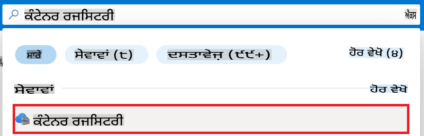

1. ਉਹ Container Registry ਚੁਣੋ ਜੋ Azure Machine Learning ਵਰਕਸਪੇਸ ਨਾਲ ਜੁੜਿਆ ਹੋਇਆ ਹੈ। ਉਦਾਹਰਨ ਲਈ, *finetunephicontainerregistry*।  

1. **Add role assignment** ਪੇਜ ਤੇ ਜਾਣ ਲਈ ਹੇਠ ਲਿਖੇ ਕੰਮ ਕਰੋ:  

    - ਖੱਬੇ ਪਾਸੇ ਟੈਬ ਵਿੱਚੋਂ **Access Control (IAM)** ਚੁਣੋ।  
    - **+ Add** ਚੁਣੋ।  
    - **Add role assignment** ਚੁਣੋ।  

1. **Add role assignment** ਪੇਜ ਵਿੱਚ ਹੇਠ ਲਿਖੇ ਕੰਮ ਕਰੋ:  

    - **Role** ਪੇਜ ਵਿੱਚ **AcrPull** ਲਿਖੋ ਅਤੇ ਵਿਕਲਪਾਂ ਵਿੱਚੋਂ **AcrPull** ਚੁਣੋ।  
    - **Role** ਪੇਜ ਵਿੱਚ **Next** ਚੁਣੋ।  
    - **Members** ਪੇਜ ਵਿੱਚ **Assign access to** ਨੂੰ **Managed identity** ਤੇ ਸੈਟ ਕਰੋ।  
    - **Members** ਪੇਜ ਵਿੱਚ **+ Select members** ਚੁਣੋ।  
    - **Select managed identities** ਪੇਜ ਵਿੱਚ ਆਪਣੀ Azure **Subscription** ਚੁਣੋ।  
    - **Managed identity** ਨੂੰ **Manage Identity** ਤੇ ਸੈਟ ਕਰੋ।  
    - ਉਹ Managed Identity ਚੁਣੋ ਜੋ ਤੁਸੀਂ ਬਣਾਇਆ ਹੈ। ਉਦਾਹਰਨ ਲਈ, *finetunephi-managedidentity*।  
    - **Select** ਚੁਣੋ।  
    - **Review + assign** ਚੁਣੋ।  

---

### ਪ੍ਰੋਜੈਕਟ ਸੈਟਅੱਪ ਕਰੋ

ਫਾਈਨ-ਟਿਊਨਿੰਗ ਲਈ ਲੋੜੀਂਦੇ ਡੇਟਾਸੈਟ ਡਾਊਨਲੋਡ ਕਰਨ ਲਈ, ਤੁਸੀਂ ਇੱਕ ਲੋਕਲ ਪਰਿਵੇਸ਼ ਸੈਟਅੱਪ ਕਰੋਗੇ।  

ਇਸ ਅਭਿਆਸ ਵਿੱਚ, ਤੁਸੀਂ:  
- ਕੰਮ ਕਰਨ ਲਈ ਇੱਕ ਫੋਲਡਰ ਬਣਾਓਗੇ।  
- ਇੱਕ ਵਰਚੁਅਲ ਪਰਿਵੇਸ਼ ਬਣਾਓਗੇ।  
- ਲੋੜੀਂਦੇ ਪੈਕੇਜ ਇੰਸਟਾਲ ਕਰੋਗੇ।  
- ਡੇਟਾਸੈਟ ਡਾਊਨਲੋਡ ਕਰਨ ਲਈ ਇੱਕ *download_dataset.py* ਫਾਈਲ ਬਣਾਓਗੇ।  

#### ਕੰਮ ਕਰਨ ਲਈ ਇੱਕ ਫੋਲਡਰ ਬਣਾਓ

1. ਟਰਮੀਨਲ ਵਿੱਚ ਹੇਠ ਲਿਖਿਆ ਕਮਾਂਡ ਦਿਉ ਕਿ *finetune-phi* ਨਾਂ ਦਾ ਫੋਲਡਰ ਬਣਾਇਆ ਜ
1. [Azure ML Studio](https://ml.azure.com/home?wt.mc_id=studentamb_279723) ਤੇ ਜਾਓ।

1. ਖਬਜੇ ਵਾਲੇ ਪਾਸੇ ਤੋਂ **Compute** ਚੁਣੋ।

1. ਨੇਵੀਗੇਸ਼ਨ ਮੈਨੂ ਵਿੱਚੋਂ **Compute clusters** ਚੁਣੋ।

1. **+ New** ਚੁਣੋ।

    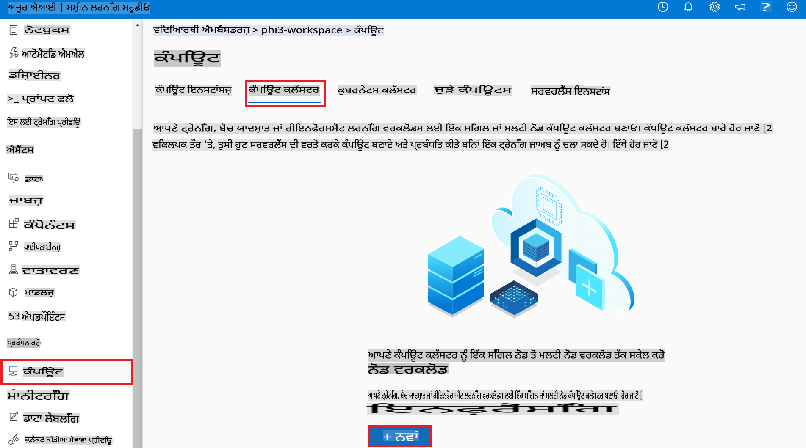

1. ਹੇਠਾਂ ਦਿੱਤੇ ਕੰਮ ਕਰੋ:

    - ਉਹ **Region** ਚੁਣੋ ਜਿਸਨੂੰ ਤੁਸੀਂ ਵਰਤਣਾ ਚਾਹੁੰਦੇ ਹੋ।
    - **Virtual machine tier** ਨੂੰ **Dedicated** 'ਤੇ ਸੈੱਟ ਕਰੋ।
    - **Virtual machine type** ਨੂੰ **GPU** 'ਤੇ ਸੈੱਟ ਕਰੋ।
    - **Virtual machine size** ਫਿਲਟਰ ਨੂੰ **Select from all options** 'ਤੇ ਸੈੱਟ ਕਰੋ।
    - **Virtual machine size** ਨੂੰ **Standard_NC24ads_A100_v4** 'ਤੇ ਸੈੱਟ ਕਰੋ।

    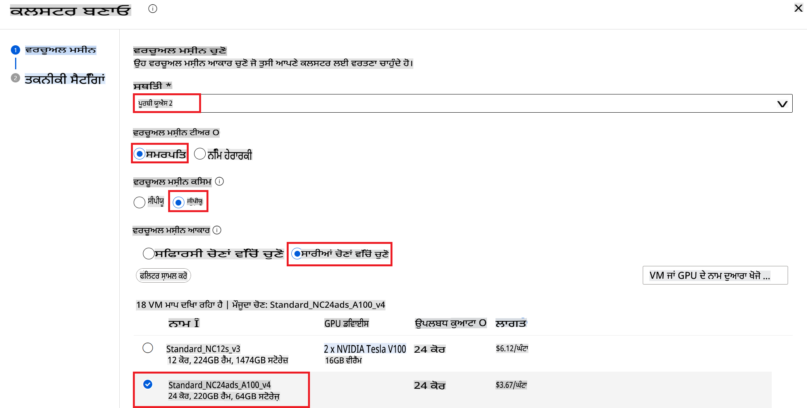

1. **Next** ਚੁਣੋ।

1. ਹੇਠਾਂ ਦਿੱਤੇ ਕੰਮ ਕਰੋ:

    - **Compute name** ਦਰਜ ਕਰੋ। ਇਹ ਇੱਕ ਯੂਨੀਕ ਮੁੱਲ ਹੋਣਾ ਚਾਹੀਦਾ ਹੈ।
    - **Minimum number of nodes** ਨੂੰ **0** 'ਤੇ ਸੈੱਟ ਕਰੋ।
    - **Maximum number of nodes** ਨੂੰ **1** 'ਤੇ ਸੈੱਟ ਕਰੋ।
    - **Idle seconds before scale down** ਨੂੰ **120** 'ਤੇ ਸੈੱਟ ਕਰੋ।

    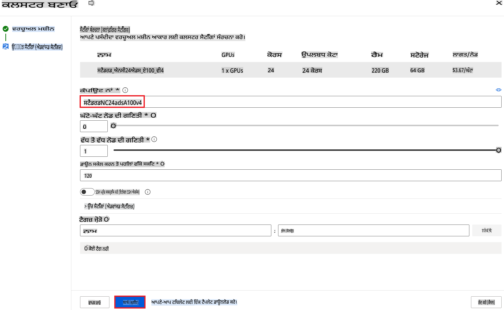

1. **Create** ਚੁਣੋ।

#### Phi-3 ਮਾਡਲ ਨੂੰ Fine-tune ਕਰੋ

1. [Azure ML Studio](https://ml.azure.com/home?wt.mc_id=studentamb_279723) ਤੇ ਜਾਓ।

1. ਉਹ Azure Machine Learning ਵਰਕਸਪੇਸ ਚੁਣੋ ਜੋ ਤੁਸੀਂ ਬਣਾਇਆ ਸੀ।

    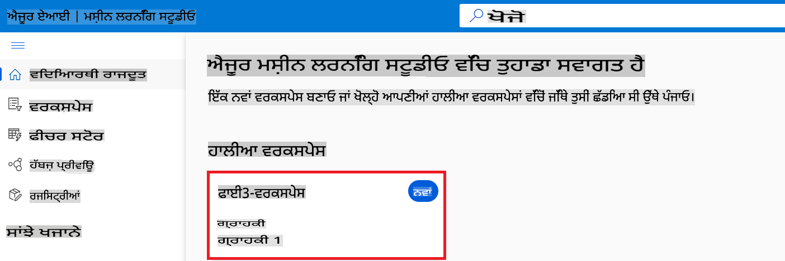

1. ਹੇਠਾਂ ਦਿੱਤੇ ਕੰਮ ਕਰੋ:

    - ਖਬਜੇ ਵਾਲੇ ਪਾਸੇ ਤੋਂ **Model catalog** ਚੁਣੋ।
    - **search bar** ਵਿੱਚ *phi-3-mini-4k* ਲਿਖੋ ਅਤੇ ਜੋ ਵਿਕਲਪ ਆਉਂਦੇ ਹਨ ਉਹਨਾਂ ਵਿੱਚੋਂ **Phi-3-mini-4k-instruct** ਚੁਣੋ।

    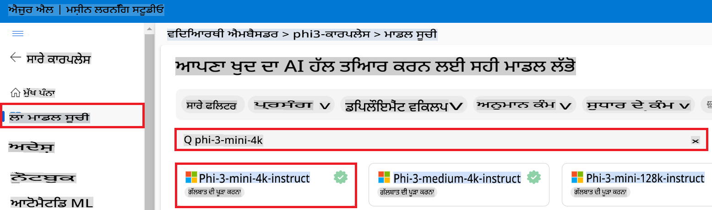

1. ਨੇਵੀਗੇਸ਼ਨ ਮੈਨੂ ਵਿੱਚੋਂ **Fine-tune** ਚੁਣੋ।

    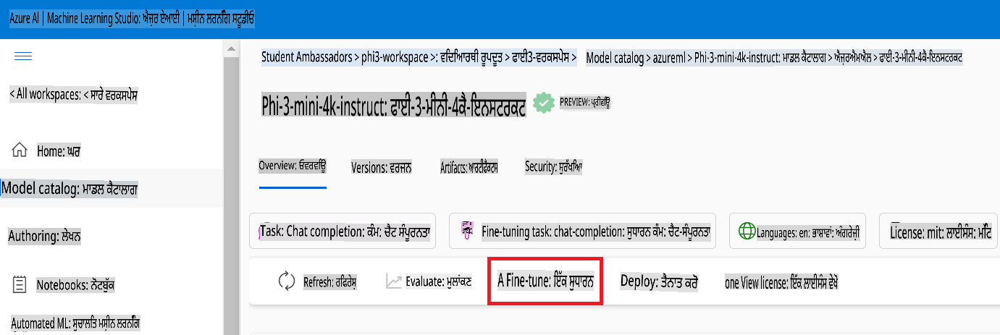

1. ਹੇਠਾਂ ਦਿੱਤੇ ਕੰਮ ਕਰੋ:

    - **Select task type** ਨੂੰ **Chat completion** 'ਤੇ ਸੈੱਟ ਕਰੋ।
    - **+ Select data** ਚੁਣੋ ਅਤੇ **Training data** ਅਪਲੋਡ ਕਰੋ।
    - Validation data ਅਪਲੋਡ ਕਿਸਮ ਨੂੰ **Provide different validation data** 'ਤੇ ਸੈੱਟ ਕਰੋ।
    - **+ Select data** ਚੁਣੋ ਅਤੇ **Validation data** ਅਪਲੋਡ ਕਰੋ।

    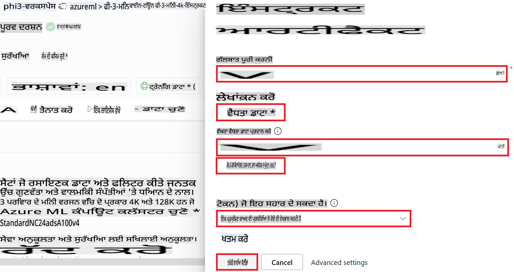

    > [!TIP]
    >
    > ਤੁਸੀਂ **Advanced settings** ਚੁਣ ਕੇ **learning_rate** ਅਤੇ **lr_scheduler_type** ਵਰਗੀਆਂ ਕਨਫਿਗਰੇਸ਼ਨਜ਼ ਨੂੰ ਕਸਟਮਾਈਜ਼ ਕਰ ਸਕਦੇ ਹੋ ਤਾਂ ਜੋ Fine-tuning ਪ੍ਰਕਿਰਿਆ ਨੂੰ ਆਪਣੇ ਖਾਸ ਜ਼ਰੂਰਤਾਂ ਅਨੁਸਾਰ ਅਨੁਕੂਲਿਤ ਕੀਤਾ ਜਾ ਸਕੇ।

1. **Finish** ਚੁਣੋ।

1. ਇਸ ਅਭਿਆਸ ਵਿੱਚ, ਤੁਸੀਂ Azure Machine Learning ਦੀ ਵਰਤੋਂ ਕਰਕੇ ਸਫਲਤਾਪੂਰਵਕ Phi-3 ਮਾਡਲ ਨੂੰ Fine-tune ਕੀਤਾ। ਕਿਰਪਾ ਕਰਕੇ ਧਿਆਨ ਦਿਓ ਕਿ Fine-tuning ਪ੍ਰਕਿਰਿਆ ਨੂੰ ਪੂਰਾ ਹੋਣ ਵਿੱਚ ਕਾਫ਼ੀ ਸਮਾਂ ਲੱਗ ਸਕਦਾ ਹੈ। Fine-tuning ਜੌਬ ਚਲਾਉਣ ਤੋਂ ਬਾਅਦ, ਤੁਹਾਨੂੰ ਇਸ ਦੇ ਪੂਰਾ ਹੋਣ ਦੀ ਉਡੀਕ ਕਰਨੀ ਪਵੇਗੀ। ਤੁਸੀਂ ਆਪਣੇ Azure Machine Learning ਵਰਕਸਪੇਸ ਦੇ ਖਬਜੇ ਪਾਸੇ **Jobs** ਟੈਬ 'ਤੇ ਜਾ ਕੇ Fine-tuning ਜੌਬ ਦੀ ਸਥਿਤੀ ਨੂੰ ਮਾਨੀਟਰ ਕਰ ਸਕਦੇ ਹੋ। ਅਗਲੇ ਸੈਸ਼ਨ ਵਿੱਚ, ਤੁਸੀਂ Fine-tuned ਮਾਡਲ ਨੂੰ ਡਿਪਲੋਅ ਕਰੋਗੇ ਅਤੇ ਇਸਨੂੰ Prompt flow ਨਾਲ ਇੰਟੀਗਰੇਟ ਕਰੋਗੇ।

    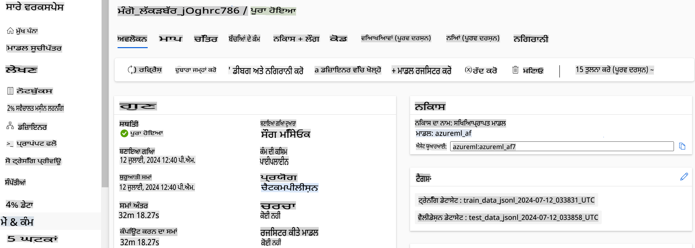

### Fine-tuned Phi-3 ਮਾਡਲ ਨੂੰ ਡਿਪਲੋਅ ਕਰੋ

Prompt flow ਨਾਲ Fine-tuned Phi-3 ਮਾਡਲ ਨੂੰ ਇੰਟੀਗਰੇਟ ਕਰਨ ਲਈ, ਤੁਹਾਨੂੰ ਮਾਡਲ ਨੂੰ ਡਿਪਲੋਅ ਕਰਨਾ ਪਵੇਗਾ ਤਾਂ ਜੋ ਇਹ ਰੀਅਲ-ਟਾਈਮ ਇੰਫਰੈਂਸ ਲਈ ਉਪਲਬਧ ਹੋਵੇ। ਇਸ ਪ੍ਰਕਿਰਿਆ ਵਿੱਚ ਮਾਡਲ ਨੂੰ ਰਜਿਸਟਰ ਕਰਨਾ, ਇੱਕ ਆਨਲਾਈਨ ਐਂਡਪੋਇੰਟ ਬਣਾਉਣਾ, ਅਤੇ ਮਾਡਲ ਨੂੰ ਡਿਪਲੋਅ ਕਰਨਾ ਸ਼ਾਮਲ ਹੈ।

ਇਸ ਅਭਿਆਸ ਵਿੱਚ, ਤੁਸੀਂ:

- Fine-tuned ਮਾਡਲ ਨੂੰ Azure Machine Learning ਵਰਕਸਪੇਸ ਵਿੱਚ ਰਜਿਸਟਰ ਕਰੋਗੇ।
- ਇੱਕ ਆਨਲਾਈਨ ਐਂਡਪੋਇੰਟ ਬਣਾਓ।
- ਰਜਿਸਟਰ ਕੀਤੇ Fine-tuned Phi-3 ਮਾਡਲ ਨੂੰ ਡਿਪਲੋਅ ਕਰੋ।

#### Fine-tuned ਮਾਡਲ ਰਜਿਸਟਰ ਕਰੋ

1. [Azure ML Studio](https://ml.azure.com/home?wt.mc_id=studentamb_279723) ਤੇ ਜਾਓ।

1. ਉਹ Azure Machine Learning ਵਰਕਸਪੇਸ ਚੁਣੋ ਜੋ ਤੁਸੀਂ ਬਣਾਇਆ ਸੀ।

    

1. ਖਬਜੇ ਪਾਸੇ ਤੋਂ **Models** ਚੁਣੋ।  
1. **+ Register** ਚੁਣੋ।  
1. **From a job output** ਚੁਣੋ।

    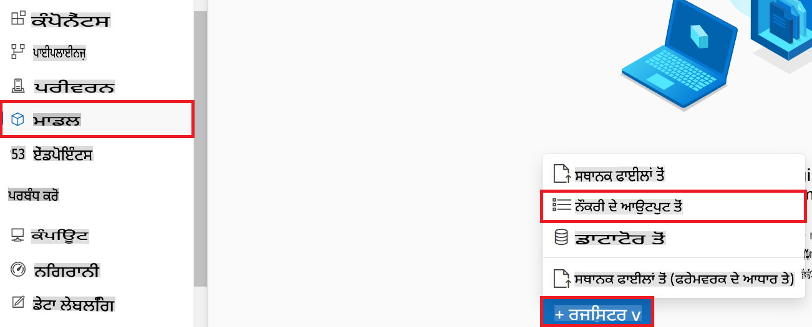

1. ਉਹ ਜੌਬ ਚੁਣੋ ਜੋ ਤੁਸੀਂ ਬਣਾਇਆ ਸੀ।

    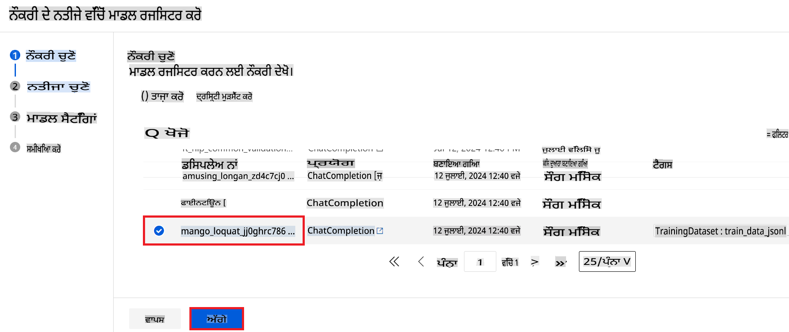

1. **Next** ਚੁਣੋ।

1. **Model type** ਨੂੰ **MLflow** 'ਤੇ ਸੈੱਟ ਕਰੋ।

1. ਯਕੀਨੀ ਬਣਾਓ ਕਿ **Job output** ਚੁਣਿਆ ਗਿਆ ਹੈ; ਇਹ ਆਪਣੇ ਆਪ ਚੁਣਿਆ ਹੋਣਾ ਚਾਹੀਦਾ ਹੈ।

    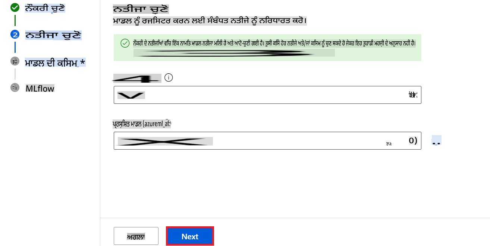

2. **Next** ਚੁਣੋ।

3. **Register** ਚੁਣੋ।

    

4. ਤੁਸੀਂ ਆਪਣੇ ਰਜਿਸਟਰ ਕੀਤੇ ਮਾਡਲ ਨੂੰ ਖਬਜੇ ਪਾਸੇ **Models** ਮੈਨੂ ਵਿੱਚ ਜਾ ਕੇ ਦੇਖ ਸਕਦੇ ਹੋ।

    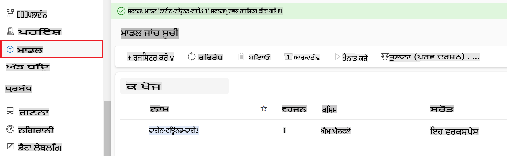

#### Fine-tuned ਮਾਡਲ ਡਿਪਲੋਅ ਕਰੋ

1. ਉਸ Azure Machine Learning ਵਰਕਸਪੇਸ ਤੇ ਜਾਓ ਜੋ ਤੁਸੀਂ ਬਣਾਇਆ ਸੀ।

1. ਖਬਜੇ ਪਾਸੇ ਤੋਂ **Endpoints** ਚੁਣੋ।

1. ਨੇਵੀਗੇਸ਼ਨ ਮੈਨੂ ਵਿੱਚੋਂ **Real-time endpoints** ਚੁਣੋ।

    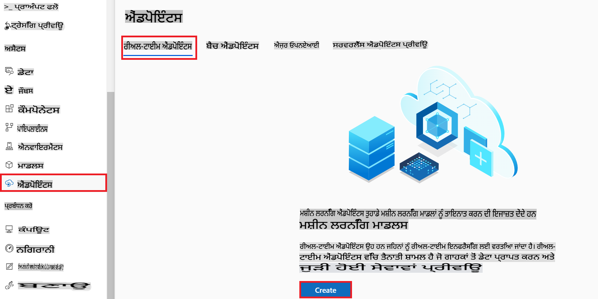

1. **Create** ਚੁਣੋ।

1. ਰਜਿਸਟਰ ਕੀਤੇ ਮਾਡਲ ਨੂੰ ਚੁਣੋ ਜੋ ਤੁਸੀਂ ਬਣਾਇਆ ਸੀ।

    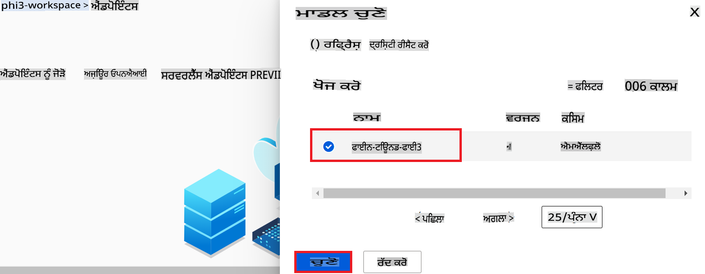

1. **Select** ਚੁਣੋ।

1. ਹੇਠਾਂ ਦਿੱਤੇ ਕੰਮ ਕਰੋ:

    - **Virtual machine** ਨੂੰ *Standard_NC6s_v3* 'ਤੇ ਸੈੱਟ ਕਰੋ।
    - **Instance count** ਨੂੰ ਚੁਣੋ ਜੋ ਤੁਸੀਂ ਵਰਤਣਾ ਚਾਹੁੰਦੇ ਹੋ। ਉਦਾਹਰਣ ਲਈ, *1*।
    - **Endpoint** ਨੂੰ **New** 'ਤੇ ਸੈੱਟ ਕਰੋ ਤਾਂ ਜੋ ਨਵਾਂ ਐਂਡਪੋਇੰਟ ਬਣਾਇਆ ਜਾ ਸਕੇ।
    - **Endpoint name** ਦਰਜ ਕਰੋ। ਇਹ ਇੱਕ ਯੂਨੀਕ ਮੁੱਲ ਹੋਣਾ ਚਾਹੀਦਾ ਹੈ।
    - **Deployment name** ਦਰਜ ਕਰੋ। ਇਹ ਇੱਕ ਯੂਨੀਕ ਮੁੱਲ ਹੋਣਾ ਚਾਹੀਦਾ ਹੈ।

    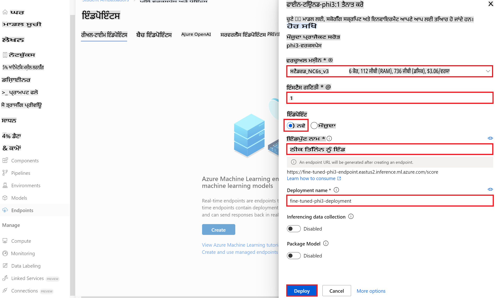

1. **Deploy** ਚੁਣੋ।

> [!WARNING]
> ਆਪਣੇ ਖਾਤੇ 'ਤੇ ਵਾਧੂ ਖਰਚਿਆਂ ਤੋਂ ਬਚਣ ਲਈ, ਯਕੀਨੀ ਬਣਾਓ ਕਿ ਤੁਸੀਂ ਬਣਾਇਆ ਐਂਡਪੋਇੰਟ Azure Machine Learning ਵਰਕਸਪੇਸ ਵਿੱਚ ਹਟਾ ਦਿੰਦੇ ਹੋ।
>

#### Azure Machine Learning ਵਰਕਸਪੇਸ ਵਿੱਚ ਡਿਪਲੋਇਮੈਂਟ ਸਥਿਤੀ ਦੀ ਜਾਂਚ ਕਰੋ

1. ਉਸ Azure Machine Learning ਵਰਕਸਪੇਸ ਤੇ ਜਾਓ ਜੋ ਤੁਸੀਂ ਬਣਾਇਆ ਸੀ।

1. ਖਬਜੇ ਪਾਸੇ ਤੋਂ **Endpoints** ਚੁਣੋ।

1. ਉਹ ਐਂਡਪੋਇੰਟ ਚੁਣੋ ਜੋ ਤੁਸੀਂ ਬਣਾਇਆ ਸੀ।

    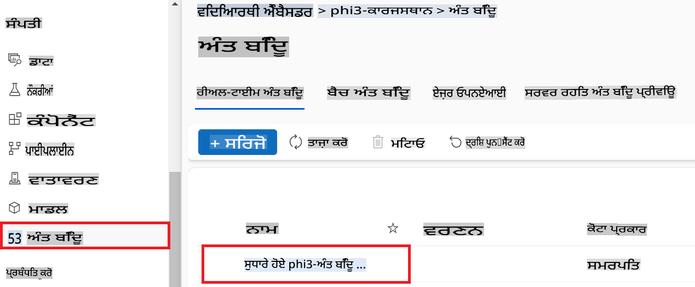

1. ਇਸ ਪੇਜ 'ਤੇ, ਤੁਸੀਂ ਡਿਪਲੋਇਮੈਂਟ ਪ੍ਰਕਿਰਿਆ ਦੌਰਾਨ ਐਂਡਪੋਇੰਟਸ ਨੂੰ ਮੈਨੇਜ ਕਰ ਸਕਦੇ ਹੋ।

> [!NOTE]
> ਜਦੋਂ ਡਿਪਲੋਇਮੈਂਟ ਪੂਰਾ ਹੋ ਜਾਵੇ, ਯਕੀਨੀ ਬਣਾਓ ਕਿ **Live traffic** ਨੂੰ **100%** 'ਤੇ ਸੈੱਟ ਕੀਤਾ ਗਿਆ ਹੈ। ਜੇਕਰ ਇਹ ਨਹੀਂ ਹੈ, ਤਾਂ **Update traffic** ਚੁਣੋ ਅਤੇ ਟ੍ਰੈਫਿਕ ਸੈਟਿੰਗ ਨੂੰ ਅਪਡੇਟ ਕਰੋ। ਧਿਆਨ ਦਿਓ ਕਿ ਜੇਕਰ ਟ੍ਰੈਫਿਕ **0%** 'ਤੇ ਸੈੱਟ ਹੈ, ਤਾਂ ਤੁਸੀਂ ਮਾਡਲ ਦੀ ਜਾਂਚ ਨਹੀਂ ਕਰ ਸਕਦੇ।
>
> 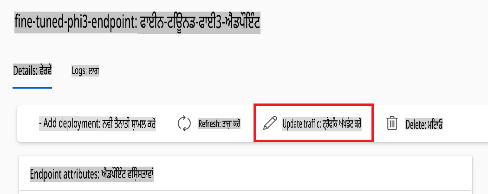
> 

## ਸਨਾਰਿਓ 3: Prompt flow ਨਾਲ ਇੰਟੀਗਰੇਟ ਕਰੋ ਅਤੇ ਆਪਣੇ ਕਸਟਮ ਮਾਡਲ ਨਾਲ ਗੱਲਬਾਤ ਕਰੋ

### ਕਸਟਮ Phi-3 ਮਾਡਲ ਨੂੰ Prompt flow ਨਾਲ ਇੰਟੀਗਰੇਟ ਕਰੋ

ਆਪਣਾ Fine-tuned ਮਾਡਲ ਸਫਲਤਾਪੂਰਵਕ ਡਿਪਲੋਅ ਕਰਨ ਤੋਂ ਬਾਅਦ, ਹੁਣ ਤੁਸੀਂ ਇਸਨੂੰ Prompt Flow ਨਾਲ ਇੰਟੀਗਰੇਟ ਕਰ ਸਕਦੇ ਹੋ ਤਾਂ ਜੋ ਆਪਣੇ ਮਾਡਲ ਨੂੰ ਰੀਅਲ-ਟਾਈਮ ਐਪਲੀਕੇਸ਼ਨਜ਼ ਵਿੱਚ ਵਰਤਿਆ ਜਾ ਸਕੇ, ਅਤੇ ਆਪਣੇ ਕਸਟਮ Phi-3 ਮਾਡਲ ਨਾਲ ਵੱਖ-ਵੱਖ ਇੰਟਰਐਕਟਿਵ ਕੰਮ ਕੀਤੇ ਜਾ ਸਕਣ।

ਇਸ ਅਭਿਆਸ ਵਿੱਚ, ਤੁਸੀਂ:

- Azure AI Foundry Hub ਬਣਾਓ।
- Azure AI Foundry ਪ੍ਰੋਜੈਕਟ ਬਣਾਓ।
- Prompt flow ਬਣਾਓ।
- Fine-tuned Phi-3 ਮਾਡਲ ਲਈ ਇੱਕ ਕਸਟਮ ਕਨੈਕਸ਼ਨ ਸ਼ਾਮਲ ਕਰੋ।
- Prompt flow ਸੈਟ ਕਰੋ ਤਾਂ ਜੋ ਆਪਣੇ ਕਸਟਮ Phi-3 ਮਾਡਲ ਨਾਲ ਗੱਲਬਾਤ ਕੀਤੀ ਜਾ ਸਕੇ।

> [!NOTE]
> ਤੁਸੀਂ Azure ML Studio ਦੀ ਵਰਤੋਂ ਕਰਕੇ ਵੀ Prompt flow ਨਾਲ ਇੰਟੀਗਰੇਟ ਕਰ ਸਕਦੇ ਹੋ। ਇੱਕੋ ਜਿਹੀ ਇੰਟੀਗਰੇਸ਼ਨ ਪ੍ਰਕਿਰਿਆ Azure ML Studio 'ਤੇ ਲਾਗੂ ਕੀਤੀ ਜਾ ਸਕਦੀ ਹੈ।

#### Azure AI Foundry Hub ਬਣਾਓ

ਤੁਹਾਨੂੰ ਪ੍ਰੋਜੈਕਟ ਬਣਾਉਣ ਤੋਂ ਪਹਿਲਾਂ ਇੱਕ Hub ਬਣਾਉਣ ਦੀ ਲੋੜ ਹੈ। ਇੱਕ Hub ਰਿਸੋਰਸ ਗਰੁੱਪ ਵਾਂਗ ਕੰਮ ਕਰਦਾ ਹੈ, ਜੋ ਤੁਹਾਨੂੰ Azure AI Foundry ਵਿੱਚ ਕਈ ਪ੍ਰੋਜੈਕਟਾਂ ਨੂੰ ਆਯੋਜਿਤ ਅਤੇ ਪ੍ਰਬੰਧਿਤ ਕਰਨ ਦੀ ਆਗਿਆ ਦਿੰਦਾ ਹੈ।

1. [Azure AI Foundry](https://ai.azure.com/?WT.mc_id=aiml-137032-kinfeylo) ਤੇ ਜਾਓ।

1. ਖਬਜੇ ਪਾਸੇ **All hubs** ਚੁਣੋ।

1. ਨੇਵੀਗੇਸ਼ਨ ਮੈਨੂ ਵਿੱਚੋਂ **+ New hub** ਚੁਣੋ।

    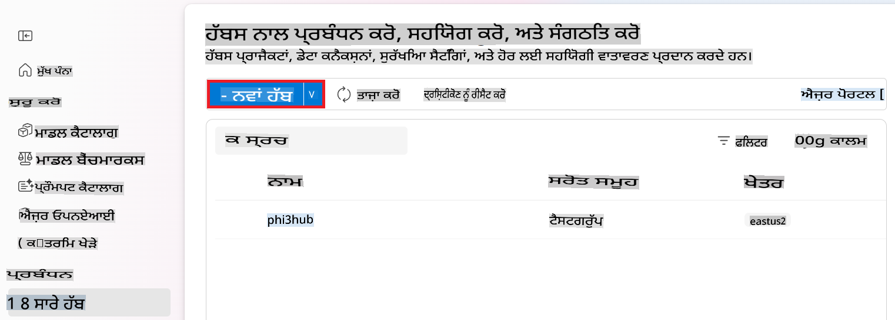

1. ਹੇਠਾਂ ਦਿੱਤੇ ਕੰਮ ਕਰੋ:

    - **Hub name** ਦਰਜ ਕਰੋ। ਇਹ ਇੱਕ ਯੂਨੀਕ ਮੁੱਲ ਹੋਣਾ ਚਾਹੀਦਾ ਹੈ।
    - ਆਪਣੀ Azure **Subscription** ਚੁਣੋ।
    - ਵਰਤਣ ਲਈ **Resource group** ਚੁਣੋ (ਲੋੜ ਪੈਣ 'ਤੇ ਨਵਾਂ ਬਣਾਓ)।
    - ਉਹ **Location** ਚੁਣੋ ਜੋ ਤੁਸੀਂ ਵਰਤਣਾ ਚਾਹੁੰਦੇ ਹੋ।
    - **Connect Azure AI Services** ਚੁਣੋ (ਲੋੜ ਪੈਣ 'ਤੇ ਨਵਾਂ ਬਣਾਓ)।
    - **Connect Azure AI Search** ਨੂੰ **Skip connecting** 'ਤੇ ਸੈੱਟ ਕਰੋ।

    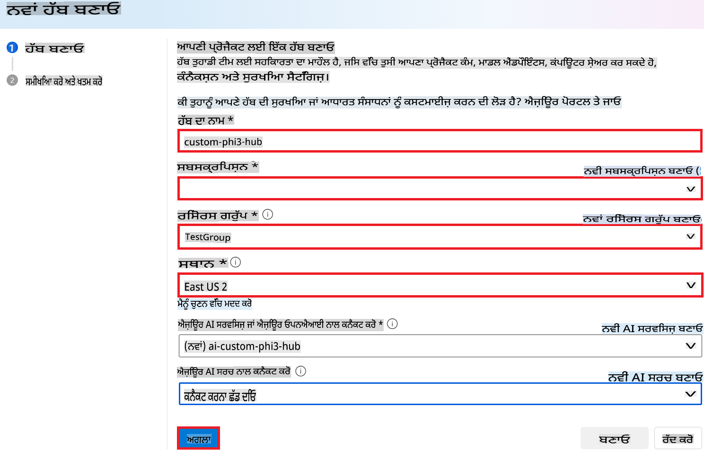

1. **Next** ਚੁਣੋ।

#### Azure AI Foundry ਪ੍ਰੋਜੈਕਟ ਬਣਾਓ

1. ਉਸ Hub ਵਿੱਚ ਜੋ ਤੁਸੀਂ ਬਣਾਇਆ ਸੀ, ਖਬਜੇ ਪਾਸੇ **All projects** ਚੁਣੋ।

1. ਨੇਵੀਗੇਸ਼ਨ ਮੈਨੂ ਵਿੱਚੋਂ **+ New project** ਚੁਣੋ।

    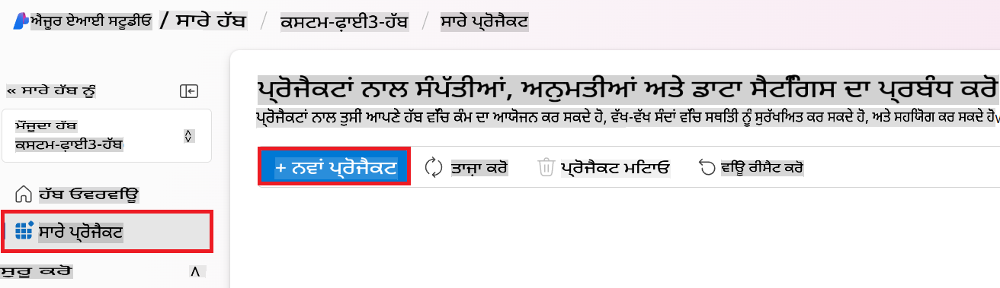

1. **Project name** ਦਰਜ ਕਰੋ। ਇਹ ਇੱਕ ਯੂਨੀਕ ਮੁੱਲ ਹੋਣਾ ਚਾਹੀਦਾ ਹੈ।

    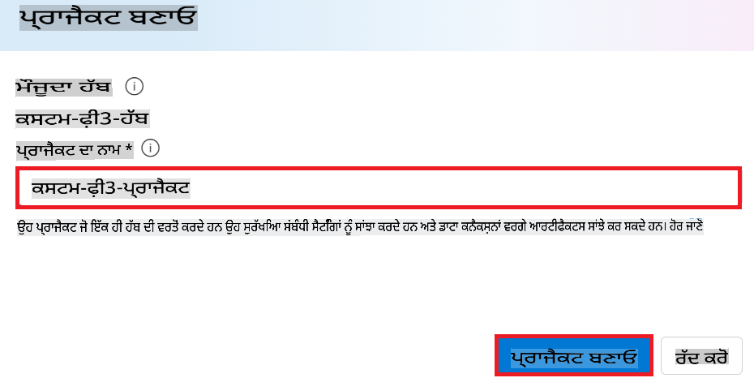

1. **Create a project** ਚੁਣੋ।

#### Fine-tuned Phi-3 ਮਾਡਲ ਲਈ ਕਸਟਮ ਕਨੈਕਸ਼ਨ ਸ਼ਾਮਲ ਕਰੋ

ਆਪਣੇ ਕਸਟਮ Phi-3 ਮਾਡਲ ਨੂੰ Prompt flow ਨਾਲ ਇੰਟੀਗਰੇਟ ਕਰਨ ਲਈ, ਤੁਹਾਨੂੰ ਮਾਡਲ ਦੇ ਐਂਡਪੋਇੰਟ ਅਤੇ ਕੁੰਜੀ ਨੂੰ ਇੱਕ ਕਸਟਮ ਕਨੈਕਸ਼ਨ ਵਿੱਚ ਸੇਵ ਕਰਨ ਦੀ ਲੋੜ ਹੈ। ਇਹ ਸੈਟਅਪ ਯਕੀਨੀ ਬਣਾਉਂਦਾ ਹੈ ਕਿ Prompt flow ਵਿੱਚ ਤੁਹਾਡੇ ਕਸਟਮ Phi-3 ਮਾਡਲ ਤੱਕ ਪਹੁੰਚ ਹੋਵੇ।

#### Fine-tuned Phi-3 ਮਾਡਲ ਦੇ api key ਅਤੇ endpoint uri ਸੈੱਟ ਕਰੋ

1. [Azure ML Studio](https://ml.azure.com/home?WT.mc_id=aiml-137032-kinfeylo) ਤੇ ਜਾਓ।

1. ਉਸ Azure Machine Learning ਵਰਕਸਪੇਸ ਤੇ ਜਾਓ ਜੋ ਤੁਸੀਂ ਬਣਾਇਆ ਸੀ।

1. ਖਬਜੇ ਪਾਸੇ **Endpoints** ਚੁਣੋ।

    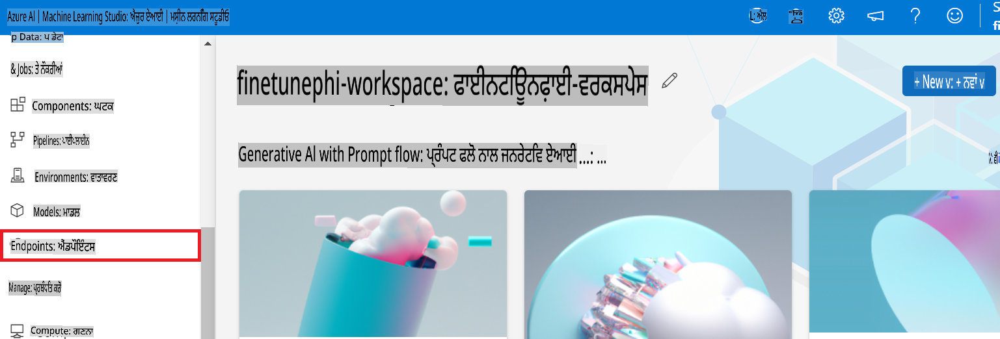

1. ਉਹ ਐਂਡਪੋਇੰਟ ਚੁਣੋ ਜੋ ਤੁਸੀਂ ਬਣਾਇਆ ਸੀ।

    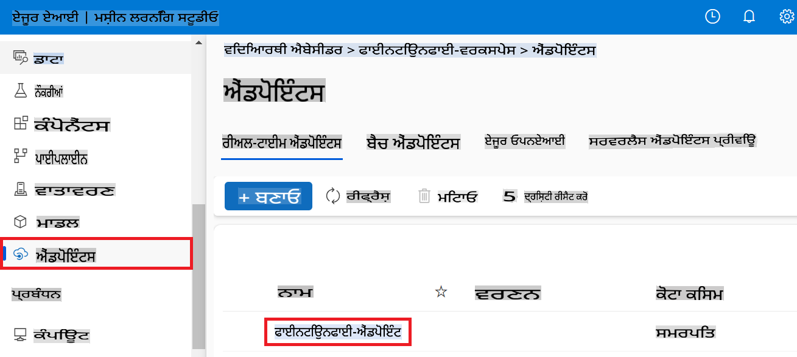

1. ਨੇਵੀਗੇਸ਼ਨ ਮੈਨੂ ਵਿੱਚੋਂ **Consume** ਚੁਣੋ।

1. ਆਪਣਾ **REST endpoint** ਅਤੇ **Primary key** ਕਾਪੀ ਕਰੋ।
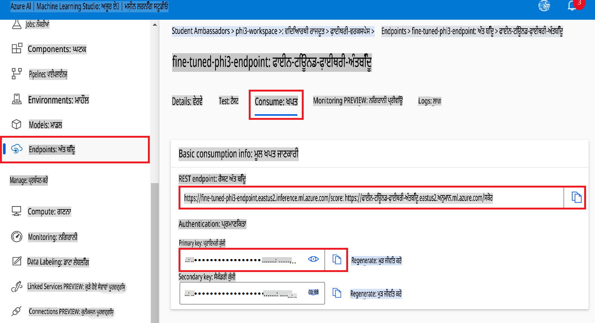

#### ਕਸਟਮ ਕਨੈਕਸ਼ਨ ਸ਼ਾਮਲ ਕਰੋ

1. [Azure AI Foundry](https://ai.azure.com/?WT.mc_id=aiml-137032-kinfeylo) 'ਤੇ ਜਾਓ।

1. ਉਸ Azure AI Foundry ਪ੍ਰੋਜੈਕਟ ਤੇ ਜਾਓ ਜੋ ਤੁਸੀਂ ਬਣਾਇਆ ਹੈ।

1. ਉਸ ਪ੍ਰੋਜੈਕਟ ਵਿੱਚ ਜੋ ਤੁਸੀਂ ਬਣਾਇਆ ਹੈ, ਖੱਬੇ ਪਾਸੇ ਦੇ ਟੈਬ ਵਿੱਚੋਂ **Settings** ਚੁਣੋ।

1. **+ New connection** ਚੁਣੋ।

    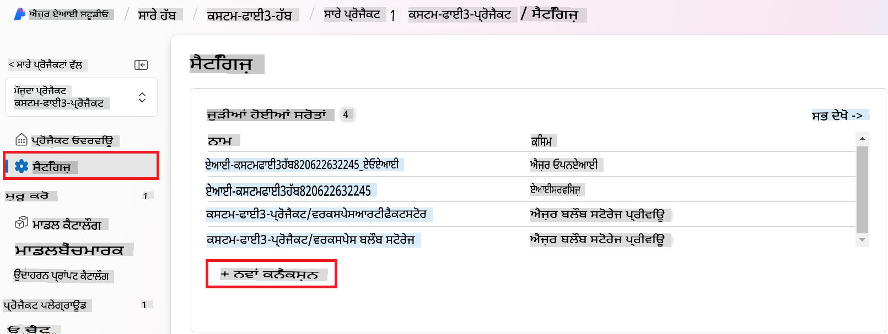

1. ਨੈਵੀਗੇਸ਼ਨ ਮੀਨੂ ਵਿੱਚੋਂ **Custom keys** ਚੁਣੋ।

    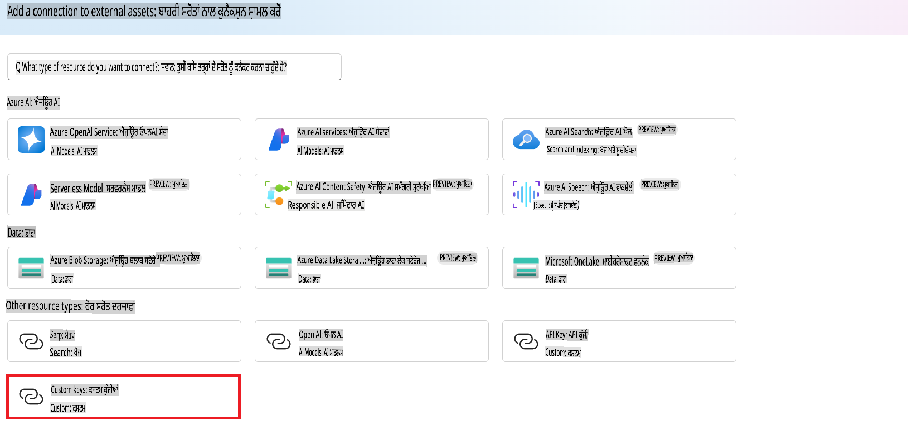

1. ਹੇਠਾਂ ਦਿੱਤੇ ਕੰਮ ਕਰੋ:

    - **+ Add key value pairs** ਚੁਣੋ।
    - ਕੁੰਜੀ ਦਾ ਨਾਮ **endpoint** ਦਿਓ ਅਤੇ Azure ML Studio ਤੋਂ ਕਾਪੀ ਕੀਤਾ ਐਂਡਪੌਇੰਟ ਮੁੱਲ ਖੇਤਰ ਵਿੱਚ ਪੇਸਟ ਕਰੋ।
    - ਮੁੜ **+ Add key value pairs** ਚੁਣੋ।
    - ਕੁੰਜੀ ਦਾ ਨਾਮ **key** ਦਿਓ ਅਤੇ Azure ML Studio ਤੋਂ ਕਾਪੀ ਕੀਤਾ ਕੁੰਜੀ ਮੁੱਲ ਖੇਤਰ ਵਿੱਚ ਪੇਸਟ ਕਰੋ।
    - ਕੁੰਜੀਆਂ ਸ਼ਾਮਲ ਕਰਨ ਤੋਂ ਬਾਅਦ, **is secret** ਚੁਣੋ ਤਾਂ ਜੋ ਕੁੰਜੀ ਨੂੰ ਉਘਾ ਨਾ ਕੀਤਾ ਜਾਵੇ।

    

1. **Add connection** ਚੁਣੋ।

#### ਪ੍ਰਾਂਪਟ ਫਲੋ ਬਣਾਓ

ਤੁਸੀਂ Azure AI Foundry ਵਿੱਚ ਇੱਕ ਕਸਟਮ ਕਨੈਕਸ਼ਨ ਸ਼ਾਮਲ ਕਰ ਲਿਆ ਹੈ। ਹੁਣ, ਆਓ ਹੇਠਾਂ ਦਿੱਤੀਆਂ ਕਦਮਾਂ ਦੀ ਵਰਤੋਂ ਕਰਕੇ ਇੱਕ ਪ੍ਰਾਂਪਟ ਫਲੋ ਬਣਾਈਏ। ਫਿਰ, ਤੁਸੀਂ ਇਸ ਪ੍ਰਾਂਪਟ ਫਲੋ ਨੂੰ ਕਸਟਮ ਕਨੈਕਸ਼ਨ ਨਾਲ ਜੋੜੋਗੇ ਤਾਂ ਜੋ ਤੁਸੀਂ ਪ੍ਰਾਂਪਟ ਫਲੋ ਦੇ ਅੰਦਰ ਫਾਈਨ-ਟਿਊਨ ਮਾਡਲ ਦੀ ਵਰਤੋਂ ਕਰ ਸਕੋ।

1. ਉਸ Azure AI Foundry ਪ੍ਰੋਜੈਕਟ ਤੇ ਜਾਓ ਜੋ ਤੁਸੀਂ ਬਣਾਇਆ ਹੈ।

1. ਖੱਬੇ ਪਾਸੇ ਦੇ ਟੈਬ ਵਿੱਚੋਂ **Prompt flow** ਚੁਣੋ।

1. ਨੈਵੀਗੇਸ਼ਨ ਮੀਨੂ ਵਿੱਚੋਂ **+ Create** ਚੁਣੋ।

    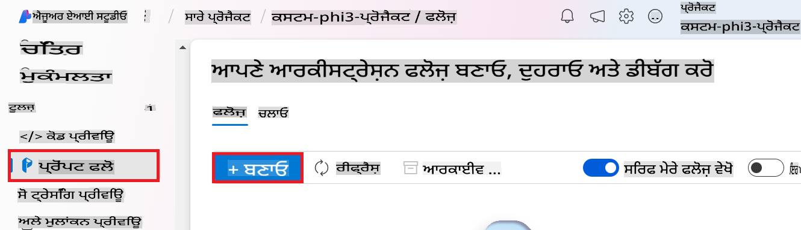

1. ਨੈਵੀਗੇਸ਼ਨ ਮੀਨੂ ਵਿੱਚੋਂ **Chat flow** ਚੁਣੋ।

    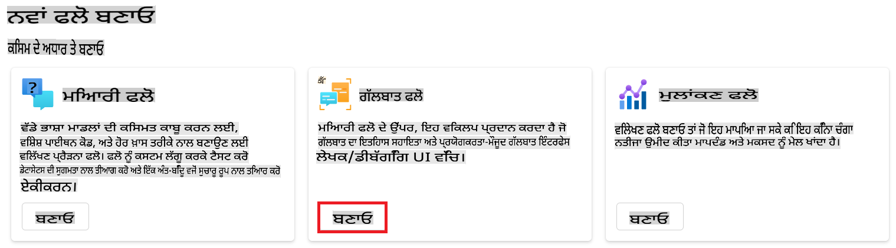

1. ਵਰਤਣ ਲਈ **Folder name** ਦਾਖਲ ਕਰੋ।

    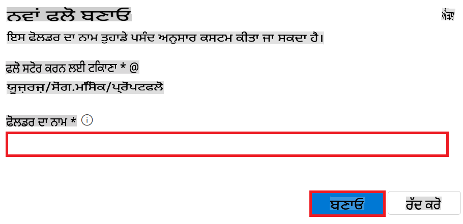

2. **Create** ਚੁਣੋ।

#### ਆਪਣੇ ਕਸਟਮ Phi-3 ਮਾਡਲ ਨਾਲ ਗੱਲਬਾਤ ਲਈ ਪ੍ਰਾਂਪਟ ਫਲੋ ਸੈਟਅੱਪ ਕਰੋ

ਤੁਹਾਨੂੰ ਪ੍ਰਾਂਪਟ ਫਲੋ ਵਿੱਚ ਫਾਈਨ-ਟਿਊਨ ਕੀਤਾ Phi-3 ਮਾਡਲ ਸ਼ਾਮਲ ਕਰਨਾ ਹੈ। ਹਾਲਾਂਕਿ, ਮੌਜੂਦਾ ਪ੍ਰਾਂਪਟ ਫਲੋ ਇਸ ਉਦੇਸ਼ ਲਈ ਡਿਜ਼ਾਈਨ ਨਹੀਂ ਕੀਤਾ ਗਿਆ ਹੈ। ਇਸ ਲਈ, ਤੁਹਾਨੂੰ ਕਸਟਮ ਮਾਡਲ ਦੇ ਇਕੀਕਰਨ ਲਈ ਪ੍ਰਾਂਪਟ ਫਲੋ ਨੂੰ ਮੁੜ ਡਿਜ਼ਾਈਨ ਕਰਨਾ ਪਵੇਗਾ।

1. ਪ੍ਰਾਂਪਟ ਫਲੋ ਵਿੱਚ, ਮੌਜੂਦਾ ਫਲੋ ਨੂੰ ਮੁੜ ਬਣਾਉਣ ਲਈ ਹੇਠਾਂ ਦਿੱਤੇ ਕੰਮ ਕਰੋ:

    - **Raw file mode** ਚੁਣੋ।
    - *flow.dag.yml* ਫਾਇਲ ਵਿੱਚ ਸਾਰੇ ਮੌਜੂਦਾ ਕੋਡ ਨੂੰ ਮਿਟਾਓ।
    - ਹੇਠਾਂ ਦਿੱਤਾ ਕੋਡ *flow.dag.yml* ਫਾਇਲ ਵਿੱਚ ਸ਼ਾਮਲ ਕਰੋ।

        ```yml
        inputs:
          input_data:
            type: string
            default: "Who founded Microsoft?"

        outputs:
          answer:
            type: string
            reference: ${integrate_with_promptflow.output}

        nodes:
        - name: integrate_with_promptflow
          type: python
          source:
            type: code
            path: integrate_with_promptflow.py
          inputs:
            input_data: ${inputs.input_data}
        ```

    - **Save** ਚੁਣੋ।

    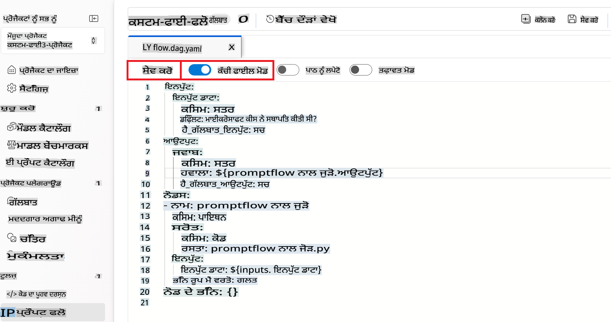

1. *integrate_with_promptflow.py* ਫਾਇਲ ਵਿੱਚ ਹੇਠਾਂ ਦਿੱਤਾ ਕੋਡ ਸ਼ਾਮਲ ਕਰੋ ਤਾਂ ਜੋ ਪ੍ਰਾਂਪਟ ਫਲੋ ਵਿੱਚ ਕਸਟਮ Phi-3 ਮਾਡਲ ਦੀ ਵਰਤੋਂ ਕੀਤੀ ਜਾ ਸਕੇ।

    ```python
    import logging
    import requests
    from promptflow import tool
    from promptflow.connections import CustomConnection

    # Logging setup
    logging.basicConfig(
        format="%(asctime)s - %(levelname)s - %(name)s - %(message)s",
        datefmt="%Y-%m-%d %H:%M:%S",
        level=logging.DEBUG
    )
    logger = logging.getLogger(__name__)

    def query_phi3_model(input_data: str, connection: CustomConnection) -> str:
        """
        Send a request to the Phi-3 model endpoint with the given input data using Custom Connection.
        """

        # "connection" is the name of the Custom Connection, "endpoint", "key" are the keys in the Custom Connection
        endpoint_url = connection.endpoint
        api_key = connection.key

        headers = {
            "Content-Type": "application/json",
            "Authorization": f"Bearer {api_key}"
        }
        data = {
            "input_data": {
                "input_string": [
                    {"role": "user", "content": input_data}
                ],
                "parameters": {
                    "temperature": 0.7,
                    "max_new_tokens": 128
                }
            }
        }
        try:
            response = requests.post(endpoint_url, json=data, headers=headers)
            response.raise_for_status()
            
            # Log the full JSON response
            logger.debug(f"Full JSON response: {response.json()}")

            result = response.json()["output"]
            logger.info("Successfully received response from Azure ML Endpoint.")
            return result
        except requests.exceptions.RequestException as e:
            logger.error(f"Error querying Azure ML Endpoint: {e}")
            raise

    @tool
    def my_python_tool(input_data: str, connection: CustomConnection) -> str:
        """
        Tool function to process input data and query the Phi-3 model.
        """
        return query_phi3_model(input_data, connection)

    ```

    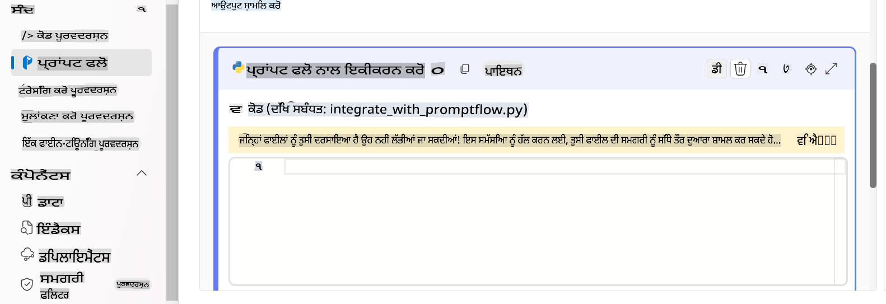

> [!NOTE]
> Azure AI Foundry ਵਿੱਚ ਪ੍ਰਾਂਪਟ ਫਲੋ ਦੀ ਵਰਤੋਂ ਬਾਰੇ ਹੋਰ ਵਿਸਥਾਰਤ ਜਾਣਕਾਰੀ ਲਈ, ਤੁਸੀਂ [Prompt flow in Azure AI Foundry](https://learn.microsoft.com/azure/ai-studio/how-to/prompt-flow) ਨੂੰ ਵੇਖ ਸਕਦੇ ਹੋ।

1. **Chat input**, **Chat output** ਚੁਣੋ ਤਾਂ ਜੋ ਆਪਣੇ ਮਾਡਲ ਨਾਲ ਗੱਲਬਾਤ ਕਰਨ ਦੀ ਸਮਰਥਾ ਮਿਲੇ।

    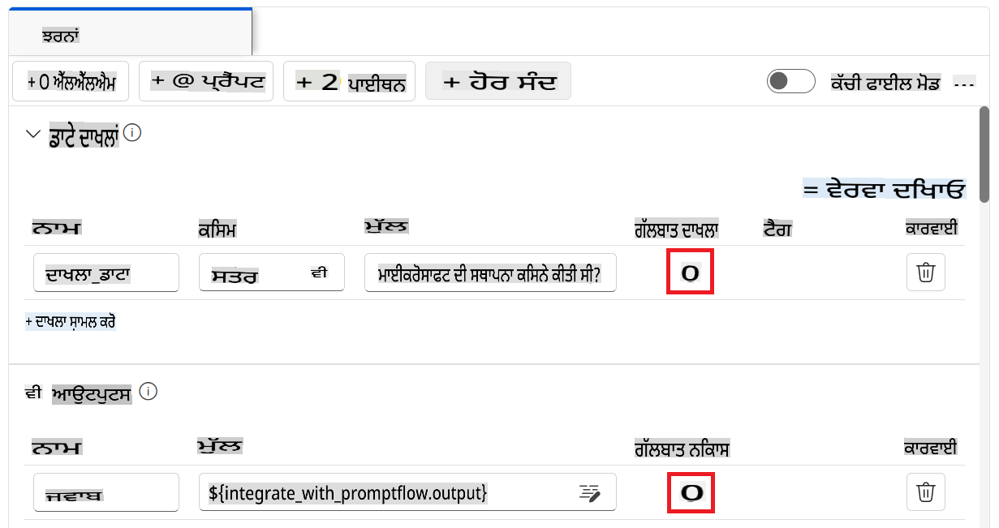

1. ਹੁਣ ਤੁਸੀਂ ਆਪਣੇ ਕਸਟਮ Phi-3 ਮਾਡਲ ਨਾਲ ਗੱਲਬਾਤ ਕਰਨ ਲਈ ਤਿਆਰ ਹੋ। ਅਗਲੇ ਅਭਿਆਸ ਵਿੱਚ, ਤੁਸੀਂ ਸਿੱਖੋਗੇ ਕਿ ਪ੍ਰਾਂਪਟ ਫਲੋ ਨੂੰ ਸ਼ੁਰੂ ਕਰਕੇ ਆਪਣੇ ਫਾਈਨ-ਟਿਊਨ ਕੀਤੇ Phi-3 ਮਾਡਲ ਨਾਲ ਗੱਲਬਾਤ ਕਿਵੇਂ ਕਰਨੀ ਹੈ।

> [!NOTE]
>
> ਮੁੜ ਬਣਾਇਆ ਫਲੋ ਹੇਠਾਂ ਦਿੱਤੇ ਚਿੱਤਰ ਵਾਂਗ ਲੱਗਣਾ ਚਾਹੀਦਾ ਹੈ:
>
> 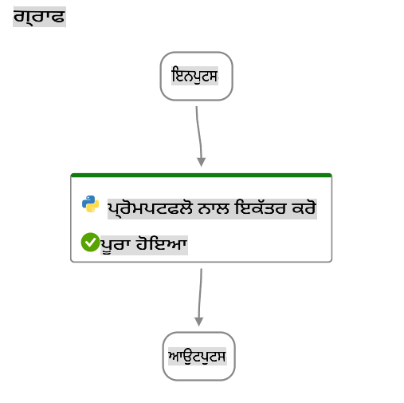
>

### ਆਪਣੇ ਕਸਟਮ Phi-3 ਮਾਡਲ ਨਾਲ ਗੱਲਬਾਤ ਕਰੋ

ਹੁਣ ਜਦੋਂ ਤੁਸੀਂ ਆਪਣੇ ਕਸਟਮ Phi-3 ਮਾਡਲ ਨੂੰ ਫਾਈਨ-ਟਿਊਨ ਅਤੇ ਪ੍ਰਾਂਪਟ ਫਲੋ ਨਾਲ ਇਕਰੂਪਿਤ ਕਰ ਲਿਆ ਹੈ, ਤੁਸੀਂ ਇਸ ਨਾਲ ਗੱਲਬਾਤ ਕਰਨ ਦੀ ਸ਼ੁਰੂਆਤ ਕਰਨ ਲਈ ਤਿਆਰ ਹੋ। ਇਹ ਅਭਿਆਸ ਤੁਹਾਨੂੰ ਪ੍ਰਾਂਪਟ ਫਲੋ ਦੀ ਵਰਤੋਂ ਕਰਕੇ ਆਪਣੇ ਮਾਡਲ ਨਾਲ ਗੱਲਬਾਤ ਕਰਨ ਦੀ ਪ੍ਰਕਿਰਿਆ ਸੈਟਅੱਪ ਕਰਨ ਅਤੇ ਸ਼ੁਰੂ ਕਰਨ ਵਿੱਚ ਮਦਦ ਕਰੇਗਾ। ਇਨ੍ਹਾਂ ਕਦਮਾਂ ਦੀ ਪਾਲਣਾ ਕਰਕੇ, ਤੁਸੀਂ ਆਪਣੇ ਫਾਈਨ-ਟਿਊਨ ਕੀਤੇ Phi-3 ਮਾਡਲ ਦੀ ਸਮਰਥਾਵਾਂ ਨੂੰ ਵੱਖ-ਵੱਖ ਕੰਮਾਂ ਅਤੇ ਗੱਲਬਾਤਾਂ ਲਈ ਪੂਰੀ ਤਰ੍ਹਾਂ ਵਰਤ ਸਕਦੇ ਹੋ।

- ਪ੍ਰਾਂਪਟ ਫਲੋ ਦੀ ਵਰਤੋਂ ਕਰਕੇ ਆਪਣੇ ਕਸਟਮ Phi-3 ਮਾਡਲ ਨਾਲ ਗੱਲਬਾਤ ਕਰੋ।

#### ਪ੍ਰਾਂਪਟ ਫਲੋ ਸ਼ੁਰੂ ਕਰੋ

1. ਪ੍ਰਾਂਪਟ ਫਲੋ ਸ਼ੁਰੂ ਕਰਨ ਲਈ **Start compute sessions** ਚੁਣੋ।

    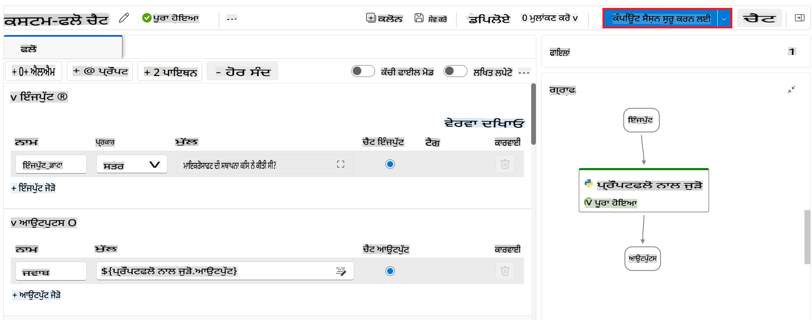

1. ਪੈਰਾਮੀਟਰ ਨਵੀਨਤਾ ਲਈ **Validate and parse input** ਚੁਣੋ।

    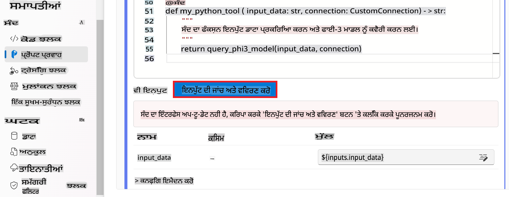

1. **connection** ਦੇ **Value** ਨੂੰ ਕਸਟਮ ਕਨੈਕਸ਼ਨ ਲਈ ਚੁਣੋ ਜੋ ਤੁਸੀਂ ਬਣਾਇਆ ਸੀ। ਉਦਾਹਰਨ ਲਈ, *connection*।

    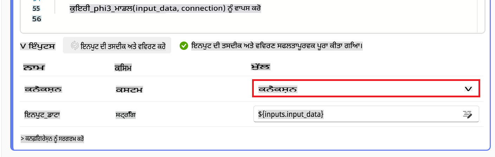

#### ਆਪਣੇ ਕਸਟਮ ਮਾਡਲ ਨਾਲ ਗੱਲਬਾਤ ਕਰੋ

1. **Chat** ਚੁਣੋ।

    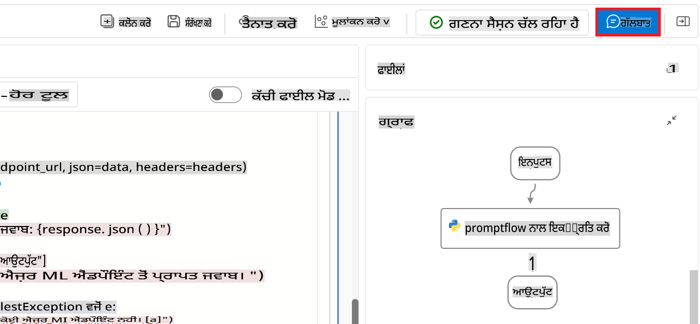

1. ਇੱਥੇ ਨਤੀਜਿਆਂ ਦਾ ਇੱਕ ਉਦਾਹਰਣ ਹੈ: ਹੁਣ ਤੁਸੀਂ ਆਪਣੇ ਕਸਟਮ Phi-3 ਮਾਡਲ ਨਾਲ ਗੱਲਬਾਤ ਕਰ ਸਕਦੇ ਹੋ। ਇਹ ਸਿਫਾਰਸ਼ ਕੀਤੀ ਜਾਂਦੀ ਹੈ ਕਿ ਤੁਸੀਂ ਫਾਈਨ-ਟਿਊਨ ਲਈ ਵਰਤੇ ਡਾਟਾ ਦੇ ਆਧਾਰ 'ਤੇ ਸਵਾਲ ਪੁੱਛੋ।

    

**ਅਸਵੀਕਰਨ**:  
ਇਹ ਦਸਤਾਵੇਜ਼ ਮਸ਼ੀਨ-ਆਧਾਰਿਤ AI ਅਨੁਵਾਦ ਸੇਵਾਵਾਂ ਦੀ ਵਰਤੋਂ ਕਰਕੇ ਅਨੁਵਾਦ ਕੀਤਾ ਗਿਆ ਹੈ। ਜਦੋਂ ਕਿ ਅਸੀਂ ਸਹੀ ਹੋਣ ਲਈ ਯਤਨਸ਼ੀਲ ਹਾਂ, ਕਿਰਪਾ ਕਰਕੇ ਧਿਆਨ ਵਿੱਚ ਰੱਖੋ ਕਿ ਸਵੈਚਾਲਿਤ ਅਨੁਵਾਦਾਂ ਵਿੱਚ ਗਲਤੀਆਂ ਜਾਂ ਅਸੁਚੱਜੇਪਣ ਹੋ ਸਕਦੇ ਹਨ। ਮੂਲ ਦਸਤਾਵੇਜ਼ ਨੂੰ ਇਸਦੀ ਮੂਲ ਭਾਸ਼ਾ ਵਿੱਚ ਅਧਿਕਾਰਤ ਸਰੋਤ ਮੰਨਿਆ ਜਾਣਾ ਚਾਹੀਦਾ ਹੈ। ਮਹੱਤਵਪੂਰਨ ਜਾਣਕਾਰੀ ਲਈ, ਪੇਸ਼ੇਵਰ ਮਨੁੱਖੀ ਅਨੁਵਾਦ ਦੀ ਸਿਫਾਰਸ਼ ਕੀਤੀ ਜਾਂਦੀ ਹੈ। ਅਸੀਂ ਇਸ ਅਨੁਵਾਦ ਦੀ ਵਰਤੋਂ ਤੋਂ ਪੈਦਾ ਹੋਈ ਕਿਸੇ ਵੀ ਗਲਤਫਹਮੀ ਜਾਂ ਗਲਤ ਵਿਆਖਿਆ ਲਈ ਜ਼ਿੰਮੇਵਾਰ ਨਹੀਂ ਹਾਂ।