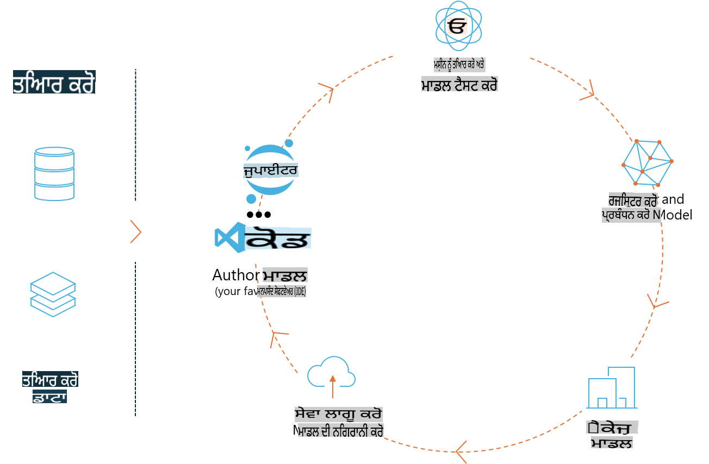
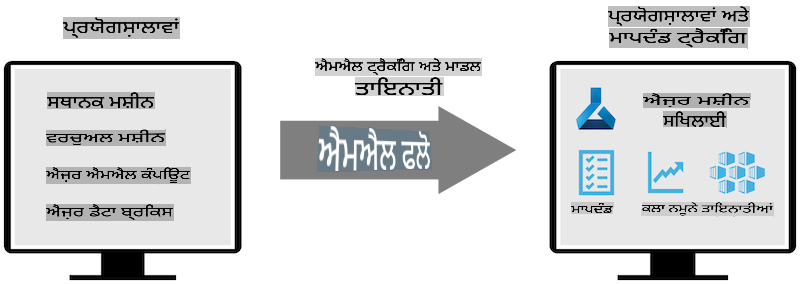
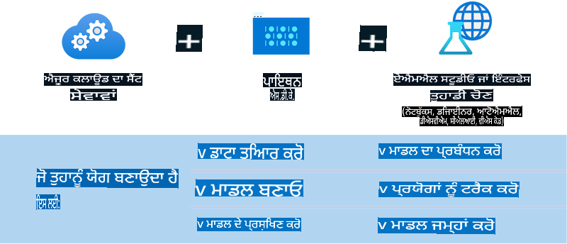

# MLflow

[MLflow](https://mlflow.org/) ਇੱਕ ਖੁੱਲ੍ਹਾ-ਸਰੋਤ ਪਲੇਟਫਾਰਮ ਹੈ ਜੋ ਮਸ਼ੀਨ ਲਰਨਿੰਗ ਲਾਈਫਸਾਈਕਲ ਦੇ ਅੰਤ-ਤੱਕ ਪ੍ਰਬੰਧਨ ਲਈ ਡਿਜ਼ਾਈਨ ਕੀਤਾ ਗਿਆ ਹੈ।



MLFlow ਮਸ਼ੀਨ ਲਰਨਿੰਗ ਲਾਈਫਸਾਈਕਲ ਨੂੰ ਪ੍ਰਬੰਧਿਤ ਕਰਨ ਲਈ ਵਰਤਿਆ ਜਾਂਦਾ ਹੈ, ਜਿਸ ਵਿੱਚ ਪ੍ਰਯੋਗ, ਦੁਹਰਾਅਯੋਗਤਾ, ਡਿਪਲੋਇਮੈਂਟ ਅਤੇ ਕੇਂਦਰੀ ਮਾਡਲ ਰਜਿਸਟਰੀ ਸ਼ਾਮਲ ਹਨ। ਇਸ ਸਮੇਂ MLFlow ਚਾਰ ਮੁੱਖ ਭਾਗ ਪ੍ਰਦਾਨ ਕਰਦਾ ਹੈ:

- **MLflow Tracking:** ਪ੍ਰਯੋਗਾਂ, ਕੋਡ, ਡਾਟਾ ਕੰਫਿਗ ਅਤੇ ਨਤੀਜਿਆਂ ਨੂੰ ਰਿਕਾਰਡ ਅਤੇ ਪੁੱਛਗਿੱਛ ਕਰਨ ਲਈ।
- **MLflow Projects:** ਡਾਟਾ ਸਾਇੰਸ ਕੋਡ ਨੂੰ ਇੱਕ ਫਾਰਮੈਟ ਵਿੱਚ ਪੈਕੇਜ ਕਰਨ ਲਈ, ਤਾਂ ਜੋ ਕਿਸੇ ਵੀ ਪਲੇਟਫਾਰਮ 'ਤੇ ਚਲਾਇਆ ਜਾ ਸਕੇ।
- **Mlflow Models:** ਮਸ਼ੀਨ ਲਰਨਿੰਗ ਮਾਡਲਾਂ ਨੂੰ ਵੱਖ-ਵੱਖ ਸਰਵਿੰਗ ਮਾਹੌਲਾਂ ਵਿੱਚ ਡਿਪਲੋਇ ਕਰਨ ਲਈ।
- **Model Registry:** ਮਾਡਲਾਂ ਨੂੰ ਕੇਂਦਰੀ ਰਿਪੋਜ਼ਟਰੀ ਵਿੱਚ ਸਟੋਰ, ਐਨੋਟੇਟ ਅਤੇ ਪ੍ਰਬੰਧਿਤ ਕਰਨ ਲਈ।

ਇਹ ਪ੍ਰਯੋਗਾਂ ਨੂੰ ਟਰੈਕ ਕਰਨ, ਕੋਡ ਨੂੰ ਦੁਹਰਾਅਯੋਗ ਚਲਾਉਣ ਵਿੱਚ ਪੈਕੇਜ ਕਰਨ ਅਤੇ ਮਾਡਲਾਂ ਨੂੰ ਸਾਂਝਾ ਕਰਨ ਅਤੇ ਡਿਪਲੋਇ ਕਰਨ ਦੀ ਸਮਰਥਾ ਰੱਖਦਾ ਹੈ। MLFlow Databricks ਵਿੱਚ ਇਕਿੱਠਾ ਕੀਤਾ ਗਿਆ ਹੈ ਅਤੇ ਵੱਖ-ਵੱਖ ML ਲਾਇਬ੍ਰੇਰੀਆਂ ਨੂੰ ਸਪੋਰਟ ਕਰਦਾ ਹੈ, ਜਿਸ ਨਾਲ ਇਹ ਲਾਇਬ੍ਰੇਰੀ-ਅਗਨੌਸਟਿਕ ਬਣਦਾ ਹੈ। ਇਸਨੂੰ ਕਿਸੇ ਵੀ ਮਸ਼ੀਨ ਲਰਨਿੰਗ ਲਾਇਬ੍ਰੇਰੀ ਅਤੇ ਕਿਸੇ ਵੀ ਪ੍ਰੋਗ੍ਰਾਮਿੰਗ ਭਾਸ਼ਾ ਨਾਲ ਵਰਤਿਆ ਜਾ ਸਕਦਾ ਹੈ, ਕਿਉਂਕਿ ਇਹ ਸਹੂਲਤ ਲਈ REST API ਅਤੇ CLI ਪ੍ਰਦਾਨ ਕਰਦਾ ਹੈ।



MLFlow ਦੀਆਂ ਮੁੱਖ ਵਿਸ਼ੇਸ਼ਤਾਵਾਂ ਵਿੱਚ ਸ਼ਾਮਲ ਹਨ:

- **Experiment Tracking:** ਪੈਰਾਮੀਟਰਾਂ ਅਤੇ ਨਤੀਜਿਆਂ ਨੂੰ ਰਿਕਾਰਡ ਅਤੇ ਤੁਲਨਾ ਕਰਨ ਲਈ।
- **Model Management:** ਮਾਡਲਾਂ ਨੂੰ ਵੱਖ-ਵੱਖ ਸਰਵਿੰਗ ਅਤੇ ਇਨਫਰੈਂਸ ਪਲੇਟਫਾਰਮਾਂ 'ਤੇ ਡਿਪਲੋਇ ਕਰਨ ਲਈ।
- **Model Registry:** MLflow ਮਾਡਲਾਂ ਦੇ ਲਾਈਫਸਾਈਕਲ ਨੂੰ ਸਾਂਝੇ ਤੌਰ 'ਤੇ ਪ੍ਰਬੰਧਿਤ ਕਰਨ ਲਈ, ਜਿਸ ਵਿੱਚ ਵਰਜਨਿੰਗ ਅਤੇ ਐਨੋਟੇਸ਼ਨ ਸ਼ਾਮਲ ਹਨ।
- **Projects:** ML ਕੋਡ ਨੂੰ ਸਾਂਝੇ ਕਰਨ ਜਾਂ ਪ੍ਰੋਡਕਸ਼ਨ ਲਈ ਪੈਕੇਜ ਕਰਨ ਲਈ।

MLFlow MLOps ਲੂਪ ਨੂੰ ਵੀ ਸਪੋਰਟ ਕਰਦਾ ਹੈ, ਜਿਸ ਵਿੱਚ ਡਾਟਾ ਤਿਆਰ ਕਰਨਾ, ਮਾਡਲਾਂ ਨੂੰ ਰਜਿਸਟਰ ਅਤੇ ਪ੍ਰਬੰਧਿਤ ਕਰਨਾ, ਮਾਡਲਾਂ ਨੂੰ ਐਗਜ਼ਿਕਿਊਸ਼ਨ ਲਈ ਪੈਕੇਜ ਕਰਨਾ, ਸੇਵਾਵਾਂ ਨੂੰ ਡਿਪਲੋਇ ਕਰਨਾ ਅਤੇ ਮਾਡਲਾਂ ਨੂੰ ਮਾਨੀਟਰ ਕਰਨਾ ਸ਼ਾਮਲ ਹੈ। ਇਹ ਪ੍ਰੋਟੋਟਾਈਪ ਤੋਂ ਪ੍ਰੋਡਕਸ਼ਨ ਵਰਕਫਲੋਅ ਵਿੱਚ ਜਾਣ ਦੀ ਪ੍ਰਕਿਰਿਆ ਨੂੰ ਸਧਾਰਨ ਬਣਾਉਣ ਦਾ ਉਦੇਸ਼ ਰੱਖਦਾ ਹੈ, ਖਾਸ ਤੌਰ 'ਤੇ ਕਲਾਉਡ ਅਤੇ ਐਜ ਮਾਹੌਲਾਂ ਵਿੱਚ।

## E2E ਸਨੇਰੀਓ - ਇੱਕ ਵ੍ਰੈਪਰ ਬਣਾਉਣਾ ਅਤੇ Phi-3 ਨੂੰ MLFlow ਮਾਡਲ ਵਜੋਂ ਵਰਤਣਾ

ਇਸ E2E ਨਮੂਨੇ ਵਿੱਚ ਅਸੀਂ ਦੋ ਵੱਖਰੇ ਪਹੁੰਚਾਂ ਦਿਖਾਵਾਂਗੇ ਕਿ ਕਿਵੇਂ ਇੱਕ ਵ੍ਰੈਪਰ ਨੂੰ Phi-3 ਛੋਟੇ ਭਾਸ਼ਾ ਮਾਡਲ (SLM) 'ਤੇ ਬਣਾਇਆ ਜਾ ਸਕਦਾ ਹੈ ਅਤੇ ਫਿਰ ਇਸਨੂੰ MLFlow ਮਾਡਲ ਵਜੋਂ ਸਥਾਨਕ ਤੌਰ 'ਤੇ ਜਾਂ ਕਲਾਉਡ ਵਿੱਚ ਚਲਾਇਆ ਜਾ ਸਕਦਾ ਹੈ, ਉਦਾਹਰਣ ਲਈ, Azure Machine Learning ਵਰਕਸਪੇਸ ਵਿੱਚ।



| ਪ੍ਰਾਜੈਕਟ | ਵੇਰਵਾ | ਸਥਿਤੀ |
| ------------ | ----------- | -------- |
| Transformer Pipeline | ਜੇਕਰ ਤੁਸੀਂ MLFlow ਦੇ ਪ੍ਰਯੋਗਾਤਮਕ ਟ੍ਰਾਂਸਫਾਰਮਰ ਫਲੇਵਰ ਨਾਲ HuggingFace ਮਾਡਲ ਵਰਤਣਾ ਚਾਹੁੰਦੇ ਹੋ, ਤਾਂ ਟ੍ਰਾਂਸਫਾਰਮਰ ਪਾਈਪਲਾਈਨ ਇੱਕ ਵ੍ਰੈਪਰ ਬਣਾਉਣ ਦਾ ਸਭ ਤੋਂ ਆਸਾਨ ਵਿਕਲਪ ਹੈ। | [**TransformerPipeline.ipynb**](../../../../../../code/06.E2E/E2E_Phi-3-MLflow_TransformerPipeline.ipynb) |
| Custom Python Wrapper | ਜਦੋਂ ਇਹ ਲਿਖਿਆ ਗਿਆ ਸੀ, ਟ੍ਰਾਂਸਫਾਰਮਰ ਪਾਈਪਲਾਈਨ HuggingFace ਮਾਡਲਾਂ ਲਈ ONNX ਫਾਰਮੈਟ ਵਿੱਚ MLFlow ਵ੍ਰੈਪਰ ਜਨਰੇਸ਼ਨ ਨੂੰ ਸਪੋਰਟ ਨਹੀਂ ਕਰਦਾ ਸੀ, ਭਾਵੇਂ ਪ੍ਰਯੋਗਾਤਮਕ optimum Python ਪੈਕੇਜ ਦੀ ਵਰਤੋਂ ਕੀਤੀ ਜਾਵੇ। ਅਜਿਹੇ ਕੇਸਾਂ ਲਈ, ਤੁਸੀਂ MLFlow ਮੋਡ ਲਈ ਆਪਣਾ ਕਸਟਮ Python ਵ੍ਰੈਪਰ ਬਣਾਉਣ ਦੇ ਯੋਗ ਹੋ। | [**CustomPythonWrapper.ipynb**](../../../../../../code/06.E2E/E2E_Phi-3-MLflow_CustomPythonWrapper.ipynb) |

## ਪ੍ਰਾਜੈਕਟ: Transformer Pipeline

1. ਤੁਹਾਨੂੰ MLFlow ਅਤੇ HuggingFace ਦੇ ਲਾਇਬ੍ਰੇਰੀਆਂ ਦੀ ਲੋੜ ਹੋਵੇਗੀ:

    ``` Python
    import mlflow
    import transformers
    ```

2. ਅਗਲੇ ਕਦਮ ਵਿੱਚ, ਤੁਸੀਂ HuggingFace ਰਜਿਸਟਰੀ ਵਿੱਚ ਟਾਰਗੇਟ Phi-3 ਮਾਡਲ ਦਾ ਹਵਾਲਾ ਦੇ ਕੇ ਇੱਕ ਟ੍ਰਾਂਸਫਾਰਮਰ ਪਾਈਪਲਾਈਨ ਸ਼ੁਰੂ ਕਰ ਸਕਦੇ ਹੋ। _Phi-3-mini-4k-instruct_ ਦੇ ਮਾਡਲ ਕਾਰਡ ਤੋਂ ਦੇਖਿਆ ਜਾ ਸਕਦਾ ਹੈ ਕਿ ਇਸਦਾ ਟਾਸਕ "Text Generation" ਕਿਸਮ ਦਾ ਹੈ:

    ``` Python
    pipeline = transformers.pipeline(
        task = "text-generation",
        model = "microsoft/Phi-3-mini-4k-instruct"
    )
    ```

3. ਹੁਣ ਤੁਸੀਂ ਆਪਣੇ Phi-3 ਮਾਡਲ ਦੇ ਟ੍ਰਾਂਸਫਾਰਮਰ ਪਾਈਪਲਾਈਨ ਨੂੰ MLFlow ਫਾਰਮੈਟ ਵਿੱਚ ਸੇਵ ਕਰ ਸਕਦੇ ਹੋ ਅਤੇ ਹੋਰ ਜਾਣਕਾਰੀ ਜਿਵੇਂ ਕਿ ਟਾਰਗੇਟ ਆਰਟੀਫੈਕਟ ਪਾਥ, ਖਾਸ ਮਾਡਲ ਕਨਫਿਗਰੇਸ਼ਨ ਸੈਟਿੰਗ ਅਤੇ ਇਨਫਰੈਂਸ API ਕਿਸਮ ਪ੍ਰਦਾਨ ਕਰ ਸਕਦੇ ਹੋ:

    ``` Python
    model_info = mlflow.transformers.log_model(
        transformers_model = pipeline,
        artifact_path = "phi3-mlflow-model",
        model_config = model_config,
        task = "llm/v1/chat"
    )
    ```

## ਪ੍ਰਾਜੈਕਟ: Custom Python Wrapper

1. ਇੱਥੇ ਅਸੀਂ Microsoft ਦੇ [ONNX Runtime generate() API](https://github.com/microsoft/onnxruntime-genai) ਦੀ ਵਰਤੋਂ ਕਰ ਸਕਦੇ ਹਾਂ ONNX ਮਾਡਲ ਦੇ ਇਨਫਰੈਂਸ ਅਤੇ ਟੋਕਨ ਐਨਕੋਡਿੰਗ/ਡੀਕੋਡਿੰਗ ਲਈ। ਤੁਹਾਨੂੰ ਆਪਣੇ ਟਾਰਗੇਟ ਕੰਪਿਊਟ ਲਈ _onnxruntime_genai_ ਪੈਕੇਜ ਚੁਣਨਾ ਪਵੇਗਾ, ਹੇਠਾਂ ਦਿੱਤੇ ਉਦਾਹਰਣ ਵਿੱਚ CPU ਨੂੰ ਟਾਰਗੇਟ ਕੀਤਾ ਗਿਆ ਹੈ:

    ``` Python
    import mlflow
    from mlflow.models import infer_signature
    import onnxruntime_genai as og
    ```

1. ਸਾਡੀ ਕਸਟਮ ਕਲਾਸ ਦੋ ਵਿਧੀਆਂ ਨੂੰ ਲਾਗੂ ਕਰਦੀ ਹੈ: _load_context()_ ਜਿਸ ਨਾਲ **ONNX ਮਾਡਲ** ਦਾ ਸ਼ੁਰੂਆਤ ਕੀਤਾ ਜਾਂਦਾ ਹੈ Phi-3 Mini 4K Instruct, **generator parameters** ਅਤੇ **tokenizer**; ਅਤੇ _predict()_ ਜੋ ਦਿੱਤੇ ਗਏ ਪ੍ਰਾਂਪਟ ਲਈ ਆਉਟਪੁੱਟ ਟੋਕਨ ਜਨਰੇਟ ਕਰਦਾ ਹੈ:

    ``` Python
    class Phi3Model(mlflow.pyfunc.PythonModel):
        def load_context(self, context):
            # Retrieving model from the artifacts
            model_path = context.artifacts["phi3-mini-onnx"]
            model_options = {
                 "max_length": 300,
                 "temperature": 0.2,         
            }
        
            # Defining the model
            self.phi3_model = og.Model(model_path)
            self.params = og.GeneratorParams(self.phi3_model)
            self.params.set_search_options(**model_options)
            
            # Defining the tokenizer
            self.tokenizer = og.Tokenizer(self.phi3_model)
    
        def predict(self, context, model_input):
            # Retrieving prompt from the input
            prompt = model_input["prompt"][0]
            self.params.input_ids = self.tokenizer.encode(prompt)
    
            # Generating the model's response
            response = self.phi3_model.generate(self.params)
    
            return self.tokenizer.decode(response[0][len(self.params.input_ids):])
    ```

1. ਹੁਣ ਤੁਸੀਂ _mlflow.pyfunc.log_model()_ ਫੰਕਸ਼ਨ ਦੀ ਵਰਤੋਂ ਕਰਕੇ Phi-3 ਮਾਡਲ ਲਈ ਇੱਕ ਕਸਟਮ Python ਵ੍ਰੈਪਰ (pickle ਫਾਰਮੈਟ ਵਿੱਚ), ਮੂਲ ONNX ਮਾਡਲ ਅਤੇ ਲੋੜੀਂਦੇ ਡਿਪੈਂਡੇੰਸੀਜ਼ ਦੇ ਨਾਲ ਜਨਰੇਟ ਕਰ ਸਕਦੇ ਹੋ:

    ``` Python
    model_info = mlflow.pyfunc.log_model(
        artifact_path = artifact_path,
        python_model = Phi3Model(),
        artifacts = {
            "phi3-mini-onnx": "cpu_and_mobile/cpu-int4-rtn-block-32-acc-level-4",
        },
        input_example = input_example,
        signature = infer_signature(input_example, ["Run"]),
        extra_pip_requirements = ["torch", "onnxruntime_genai", "numpy"],
    )
    ```

## MLFlow ਮਾਡਲਾਂ ਦੇ ਜਨਰੇਟ ਕੀਤੇ ਸਿਗਨੇਚਰ

1. ਉਪਰਲੇ Transformer Pipeline ਪ੍ਰਾਜੈਕਟ ਦੇ ਕਦਮ 3 ਵਿੱਚ, ਅਸੀਂ MLFlow ਮਾਡਲ ਦਾ ਟਾਸਕ "_llm/v1/chat_" ਤੇ ਸੈਟ ਕੀਤਾ। ਅਜਿਹੀ ਨਿਰਦੇਸ਼ਨਾ ਮਾਡਲ ਦਾ API ਵ੍ਰੈਪਰ ਜਨਰੇਟ ਕਰਦੀ ਹੈ, ਜੋ ਕਿ OpenAI ਦੇ Chat API ਨਾਲ ਅਨੁਕੂਲ ਹੁੰਦਾ ਹੈ, ਜਿਵੇਂ ਹੇਠਾਂ ਦਿਖਾਇਆ ਗਿਆ ਹੈ:

    ``` Python
    {inputs: 
      ['messages': Array({content: string (required), name: string (optional), role: string (required)}) (required), 'temperature': double (optional), 'max_tokens': long (optional), 'stop': Array(string) (optional), 'n': long (optional), 'stream': boolean (optional)],
    outputs: 
      ['id': string (required), 'object': string (required), 'created': long (required), 'model': string (required), 'choices': Array({finish_reason: string (required), index: long (required), message: {content: string (required), name: string (optional), role: string (required)} (required)}) (required), 'usage': {completion_tokens: long (required), prompt_tokens: long (required), total_tokens: long (required)} (required)],
    params: 
      None}
    ```

1. ਇਸਦੇ ਨਤੀਜੇ ਵਜੋਂ, ਤੁਸੀਂ ਹੇਠਾਂ ਦਿੱਤੇ ਫਾਰਮੈਟ ਵਿੱਚ ਆਪਣਾ ਪ੍ਰਾਂਪਟ ਸਬਮਿਟ ਕਰ ਸਕਦੇ ਹੋ:

    ``` Python
    messages = [{"role": "user", "content": "What is the capital of Spain?"}]
    ```

1. ਫਿਰ, OpenAI API ਨਾਲ ਅਨੁਕੂਲ ਪੋਸਟ-ਪ੍ਰੋਸੈਸਿੰਗ ਵਰਤੋਂ ਕਰੋ, ਜਿਵੇਂ ਕਿ _response[0][‘choices’][0][‘message’][‘content’]_, ਆਪਣੇ ਆਉਟਪੁੱਟ ਨੂੰ ਹੇਠਾਂ ਦਿੱਤੇ ਜਿਵੇਂ ਸੁੰਦਰ ਬਣਾਉਣ ਲਈ:

    ``` JSON
    Question: What is the capital of Spain?
    
    Answer: The capital of Spain is Madrid. It is the largest city in Spain and serves as the political, economic, and cultural center of the country. Madrid is located in the center of the Iberian Peninsula and is known for its rich history, art, and architecture, including the Royal Palace, the Prado Museum, and the Plaza Mayor.
    
    Usage: {'prompt_tokens': 11, 'completion_tokens': 73, 'total_tokens': 84}
    ```

1. ਉਪਰਲੇ Custom Python Wrapper ਪ੍ਰਾਜੈਕਟ ਦੇ ਕਦਮ 3 ਵਿੱਚ, ਅਸੀਂ MLFlow ਪੈਕੇਜ ਨੂੰ ਦਿੱਤੇ ਗਏ ਇਨਪੁੱਟ ਉਦਾਹਰਣ ਤੋਂ ਮਾਡਲ ਦੇ ਸਿਗਨੇਚਰ ਨੂੰ ਜਨਰੇਟ ਕਰਨ ਦੀ ਆਗਿਆ ਦਿੰਦੇ ਹਾਂ। ਸਾਡੇ MLFlow ਵ੍ਰੈਪਰ ਦਾ ਸਿਗਨੇਚਰ ਇਸ ਤਰ੍ਹਾਂ ਲੱਗੇਗਾ:

    ``` Python
    {inputs: 
      ['prompt': string (required)],
    outputs: 
      [string (required)],
    params: 
      None}
    ```

1. ਇਸ ਲਈ, ਸਾਡੇ ਪ੍ਰਾਂਪਟ ਵਿੱਚ "prompt" ਡਿਕਸ਼ਨਰੀ ਕੁੰਜੀ ਸ਼ਾਮਲ ਹੋਣੀ ਚਾਹੀਦੀ ਹੈ, ਹੇਠਾਂ ਦਿੱਤੇ ਜਿਵੇਂ:

    ``` Python
    {"prompt": "<|system|>You are a stand-up comedian.<|end|><|user|>Tell me a joke about atom<|end|><|assistant|>",}
    ```

1. ਮਾਡਲ ਦਾ ਆਉਟਪੁੱਟ ਫਿਰ ਸਟਰਿੰਗ ਫਾਰਮੈਟ ਵਿੱਚ ਪ੍ਰਦਾਨ ਕੀਤਾ ਜਾਵੇਗਾ:

    ``` JSON
    Alright, here's a little atom-related joke for you!
    
    Why don't electrons ever play hide and seek with protons?
    
    Because good luck finding them when they're always "sharing" their electrons!
    
    Remember, this is all in good fun, and we're just having a little atomic-level humor!
    ```

**ਅਸਵੀਕਾਰਣਾ**:  
ਇਹ ਦਸਤਾਵੇਜ਼ ਮਸ਼ੀਨ-ਆਧਾਰਿਤ AI ਅਨੁਵਾਦ ਸੇਵਾਵਾਂ ਦੀ ਵਰਤੋਂ ਕਰਕੇ ਅਨੁਵਾਦਿਤ ਕੀਤਾ ਗਿਆ ਹੈ। ਜਦੋਂ ਕਿ ਅਸੀਂ ਸਹੀ ਹੋਣ ਲਈ ਯਤਨਸ਼ੀਲ ਹਾਂ, ਕਿਰਪਾ ਕਰਕੇ ਧਿਆਨ ਦਿਓ ਕਿ ਸਵੈਚਾਲਿਤ ਅਨੁਵਾਦਾਂ ਵਿੱਚ ਗਲਤੀਆਂ ਜਾਂ ਅਸੁਚੱਜੇਪਣ ਹੋ ਸਕਦੇ ਹਨ। ਮੂਲ ਦਸਤਾਵੇਜ਼ ਨੂੰ ਇਸਦੀ ਮੂਲ ਭਾਸ਼ਾ ਵਿੱਚ ਅਧਿਕਾਰਕ ਸਰੋਤ ਮੰਨਿਆ ਜਾਣਾ ਚਾਹੀਦਾ ਹੈ। ਮਹੱਤਵਪੂਰਨ ਜਾਣਕਾਰੀ ਲਈ, ਪੇਸ਼ੇਵਰ ਮਨੁੱਖੀ ਅਨੁਵਾਦ ਦੀ ਸਿਫਾਰਸ਼ ਕੀਤੀ ਜਾਂਦੀ ਹੈ। ਇਸ ਅਨੁਵਾਦ ਦੀ ਵਰਤੋਂ ਤੋਂ ਪੈਦਾ ਹੋਣ ਵਾਲੇ ਕਿਸੇ ਵੀ ਗਲਤਫਹਿਮੀ ਜਾਂ ਗਲਤ ਵਿਆਖਿਆ ਲਈ ਅਸੀਂ ਜ਼ਿੰਮੇਵਾਰ ਨਹੀਂ ਹਾਂ।