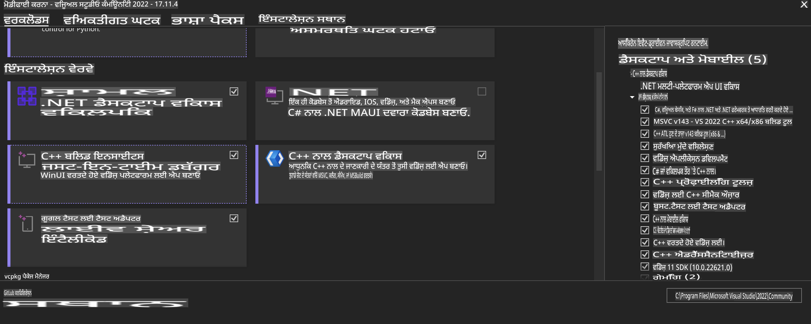
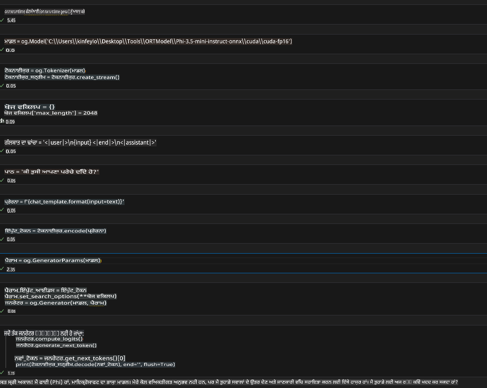
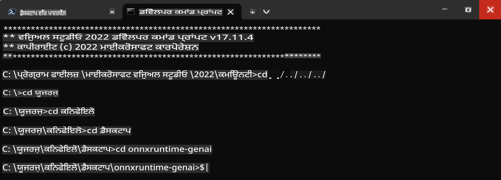

# **OnnxRuntime GenAI Windows GPU ਲਈ ਦਿਸ਼ਾ-ਨਿਰਦੇਸ਼**

ਇਹ ਦਿਸ਼ਾ-ਨਿਰਦੇਸ਼ Windows 'ਤੇ GPUs ਨਾਲ ONNX Runtime (ORT) ਨੂੰ ਸੈੱਟਅਪ ਕਰਨ ਅਤੇ ਇਸਤੇਮਾਲ ਕਰਨ ਦੇ ਕਦਮ ਪ੍ਰਦਾਨ ਕਰਦਾ ਹੈ। ਇਹ ਤੁਹਾਨੂੰ ਆਪਣੇ ਮਾਡਲਾਂ ਲਈ GPU ਐਕਸੀਲੇਰੇਸ਼ਨ ਦਾ ਫਾਇਦਾ ਲੈਣ, ਪ੍ਰਦਰਸ਼ਨ ਅਤੇ ਕੁਸ਼ਲਤਾ ਵਿੱਚ ਸੁਧਾਰ ਕਰਨ ਵਿੱਚ ਮਦਦ ਕਰਦਾ ਹੈ।

ਇਸ ਦਸਤਾਵੇਜ਼ ਵਿੱਚ ਇਹ ਹਦਾਇਤਾਂ ਦਿੱਤੀਆਂ ਗਈਆਂ ਹਨ:

- ਪਰਿਵੇਸ਼ ਸੈੱਟਅਪ: CUDA, cuDNN ਅਤੇ ONNX Runtime ਵਰਗੀਆਂ ਲੋੜੀਂਦੀਆਂ ਡਿਪੈਂਡੇਸੀਜ਼ ਨੂੰ ਇੰਸਟਾਲ ਕਰਨ ਦੇ ਨਿਰਦੇਸ਼।
- ਸੰਰਚਨਾ: GPU ਸਰੋਤਾਂ ਨੂੰ ਪ੍ਰਭਾਵਸ਼ਾਲੀ ਤਰੀਕੇ ਨਾਲ ਵਰਤਣ ਲਈ ਪਰਿਵੇਸ਼ ਅਤੇ ONNX Runtime ਨੂੰ ਕਿਵੇਂ ਸੰਰਚਿਤ ਕਰਨਾ ਹੈ।
- ਆਪਟੀਮਾਈਜ਼ੇਸ਼ਨ ਟਿੱਪਸ: ਵਧੀਆ ਪ੍ਰਦਰਸ਼ਨ ਲਈ ਆਪਣੇ GPU ਸੈਟਿੰਗਾਂ ਨੂੰ ਕਿਵੇਂ ਸੁਧਾਰਣਾ ਹੈ।

### **1. Python 3.10.x /3.11.8**

   ***ਨੋਟ*** Python env ਲਈ [miniforge](https://github.com/conda-forge/miniforge/releases/latest/download/Miniforge3-Windows-x86_64.exe) ਦੀ ਸਿਫਾਰਿਸ਼ ਕੀਤੀ ਜਾਂਦੀ ਹੈ।

   ```bash

   conda create -n pydev python==3.11.8

   conda activate pydev

   ```

   ***ਯਾਦ ਦਿਵਾਉਣਾ*** ਜੇ ਤੁਸੀਂ ਪਹਿਲਾਂ ਹੀ ਕੋਈ Python ONNX ਲਾਇਬ੍ਰੇਰੀ ਇੰਸਟਾਲ ਕੀਤੀ ਹੈ, ਤਾਂ ਕਿਰਪਾ ਕਰਕੇ ਇਸਨੂੰ ਅਣਇੰਸਟਾਲ ਕਰੋ।

### **2. CMake ਨੂੰ winget ਨਾਲ ਇੰਸਟਾਲ ਕਰੋ**


   ```bash

   winget install -e --id Kitware.CMake

   ```

### **3. Visual Studio 2022 - Desktop Development with C++ ਇੰਸਟਾਲ ਕਰੋ**

   ***ਨੋਟ*** ਜੇ ਤੁਸੀਂ ਕੰਪਾਇਲ ਨਹੀਂ ਕਰਨਾ ਚਾਹੁੰਦੇ ਤਾਂ ਤੁਸੀਂ ਇਸ ਕਦਮ ਨੂੰ ਛੱਡ ਸਕਦੇ ਹੋ।




### **4. NVIDIA Driver ਇੰਸਟਾਲ ਕਰੋ**

1. **NVIDIA GPU Driver**  [https://www.nvidia.com/en-us/drivers/](https://www.nvidia.com/en-us/drivers/)

2. **NVIDIA CUDA 12.4** [https://developer.nvidia.com/cuda-12-4-0-download-archive](https://developer.nvidia.com/cuda-12-4-0-download-archive)

3. **NVIDIA CUDNN 9.4**  [https://developer.nvidia.com/cudnn-downloads](https://developer.nvidia.com/cudnn-downloads)

***ਯਾਦ ਦਿਵਾਉਣਾ*** ਇੰਸਟਾਲੇਸ਼ਨ ਦੌਰਾਨ ਡਿਫਾਲਟ ਸੈਟਿੰਗਾਂ ਦੀ ਵਰਤੋਂ ਕਰੋ।

### **5. NVIDIA Env ਸੈੱਟ ਕਰੋ**

NVIDIA CUDNN 9.4 ਦੇ lib, bin, include ਫਾਈਲਾਂ ਨੂੰ NVIDIA CUDA 12.4 ਦੇ lib, bin, include ਵਿੱਚ ਕਾਪੀ ਕਰੋ।

- *'C:\Program Files\NVIDIA\CUDNN\v9.4\bin\12.6'* ਦੀਆਂ ਫਾਈਲਾਂ ਨੂੰ *'C:\Program Files\NVIDIA GPU Computing Toolkit\CUDA\v12.4\bin'* ਵਿੱਚ ਕਾਪੀ ਕਰੋ।

- *'C:\Program Files\NVIDIA\CUDNN\v9.4\include\12.6'* ਦੀਆਂ ਫਾਈਲਾਂ ਨੂੰ *'C:\Program Files\NVIDIA GPU Computing Toolkit\CUDA\v12.4\include'* ਵਿੱਚ ਕਾਪੀ ਕਰੋ।

- *'C:\Program Files\NVIDIA\CUDNN\v9.4\lib\12.6'* ਦੀਆਂ ਫਾਈਲਾਂ ਨੂੰ *'C:\Program Files\NVIDIA GPU Computing Toolkit\CUDA\v12.4\lib\x64'* ਵਿੱਚ ਕਾਪੀ ਕਰੋ।


### **6. Phi-3.5-mini-instruct-onnx ਡਾਊਨਲੋਡ ਕਰੋ**


   ```bash

   winget install -e --id Git.Git

   winget install -e --id GitHub.GitLFS

   git lfs install

   git clone https://huggingface.co/microsoft/Phi-3.5-mini-instruct-onnx

   ```

### **7. InferencePhi35Instruct.ipynb ਚਲਾਓ**

   [Notebook](../../../../../../code/09.UpdateSamples/Aug/ortgpu-phi35-instruct.ipynb) ਖੋਲ੍ਹੋ ਅਤੇ ਐਕਜ਼ਿਕਿਊਟ ਕਰੋ। 





### **8. ORT GenAI GPU ਕੰਪਾਇਲ ਕਰੋ**


   ***ਨੋਟ*** 
   
   1. ਕਿਰਪਾ ਕਰਕੇ ਸਭ ONNX, ONNXRuntime ਅਤੇ ONNXRuntime-GenAI ਲਾਇਬ੍ਰੇਰੀਜ਼ ਨੂੰ ਪਹਿਲਾਂ ਅਣਇੰਸਟਾਲ ਕਰੋ।

   
   ```bash

   pip list 
   
   ```

   ਫਿਰ ਸਾਰੀਆਂ ONNXRuntime ਲਾਇਬ੍ਰੇਰੀਜ਼ ਨੂੰ ਅਣਇੰਸਟਾਲ ਕਰੋ, ਉਦਾਹਰਨ ਲਈ:


   ```bash

   pip uninstall onnxruntime

   pip uninstall onnxruntime-genai

   pip uninstall onnxruntume-genai-cuda
   
   ```

   2. Visual Studio Extension ਸਪੋਰਟ ਚੈੱਕ ਕਰੋ।

   ਚੈੱਕ ਕਰੋ ਕਿ C:\Program Files\NVIDIA GPU Computing Toolkit\CUDA\v12.4\extras ਵਿੱਚ C:\Program Files\NVIDIA GPU Computing Toolkit\CUDA\v12.4\extras\visual_studio_integration ਮੌਜੂਦ ਹੈ ਜਾਂ ਨਹੀਂ। 
   
   ਜੇ ਨਾ ਹੋਵੇ ਤਾਂ ਹੋਰ CUDA ਟੂਲਕਿਟ ਡਰਾਈਵਰ ਫੋਲਡਰਜ਼ ਚੈੱਕ ਕਰੋ ਅਤੇ visual_studio_integration ਫੋਲਡਰ ਅਤੇ ਇਸ ਦੀ ਸਮੱਗਰੀ ਨੂੰ C:\Program Files\NVIDIA GPU Computing Toolkit\CUDA\v12.4\extras\visual_studio_integration ਵਿੱਚ ਕਾਪੀ ਕਰੋ।


   - ਜੇ ਤੁਸੀਂ ਕੰਪਾਇਲ ਨਹੀਂ ਕਰਨਾ ਚਾਹੁੰਦੇ ਤਾਂ ਤੁਸੀਂ ਇਸ ਕਦਮ ਨੂੰ ਛੱਡ ਸਕਦੇ ਹੋ।


   ```bash

   git clone https://github.com/microsoft/onnxruntime-genai

   ```

   - ਡਾਊਨਲੋਡ ਕਰੋ [https://github.com/microsoft/onnxruntime/releases/download/v1.19.2/onnxruntime-win-x64-gpu-1.19.2.zip](https://github.com/microsoft/onnxruntime/releases/download/v1.19.2/onnxruntime-win-x64-gpu-1.19.2.zip)

   - onnxruntime-win-x64-gpu-1.19.2.zip ਨੂੰ ਅਨਜ਼ਿਪ ਕਰੋ, ਇਸਨੂੰ **ort** ਨਾਮ ਦੇਵੋ ਅਤੇ ort ਫੋਲਡਰ ਨੂੰ onnxruntime-genai ਵਿੱਚ ਕਾਪੀ ਕਰੋ।

   - Windows Terminal ਦੀ ਵਰਤੋਂ ਕਰਕੇ, Deveopler Command Prompt for VS 2022 'ਤੇ ਜਾਓ ਅਤੇ onnxruntime-genai ਵਿੱਚ ਜਾਓ।



   - ਆਪਣੇ Python env ਨਾਲ ਇਸਨੂੰ ਕੰਪਾਇਲ ਕਰੋ। 

   
   ```bash

   cd onnxruntime-genai

   python build.py --use_cuda  --cuda_home "C:\Program Files\NVIDIA GPU Computing Toolkit\CUDA\v12.4" --config Release
 

   cd build/Windows/Release/Wheel

   pip install .whl

   ```

**ਅਸਵੀਕਰਤੀ**:  
ਇਹ ਦਸਤਾਵੇਜ਼ ਮਸ਼ੀਨ ਅਧਾਰਿਤ AI ਅਨੁਵਾਦ ਸੇਵਾਵਾਂ ਦੀ ਵਰਤੋਂ ਕਰਕੇ ਅਨੁਵਾਦ ਕੀਤਾ ਗਿਆ ਹੈ। ਜਦੋਂ ਕਿ ਅਸੀਂ ਸਹੀ ਹੋਣ ਦਾ ਯਤਨ ਕਰਦੇ ਹਾਂ, ਕਿਰਪਾ ਕਰਕੇ ਧਿਆਨ ਰੱਖੋ ਕਿ ਸਵੈਚਾਲਿਤ ਅਨੁਵਾਦਾਂ ਵਿੱਚ ਗਲਤੀਆਂ ਜਾਂ ਅਸੁਹੀਤੀਆਂ ਹੋ ਸਕਦੀਆਂ ਹਨ। ਮੂਲ ਦਸਤਾਵੇਜ਼ ਨੂੰ ਇਸ ਦੀ ਮੂਲ ਭਾਸ਼ਾ ਵਿੱਚ ਅਧਿਕਾਰਕ ਸਰੋਤ ਮੰਨਿਆ ਜਾਣਾ ਚਾਹੀਦਾ ਹੈ। ਮਹੱਤਵਪੂਰਨ ਜਾਣਕਾਰੀ ਲਈ, ਪੇਸ਼ੇਵਰ ਮਨੁੱਖੀ ਅਨੁਵਾਦ ਦੀ ਸਿਫਾਰਸ਼ ਕੀਤੀ ਜਾਂਦੀ ਹੈ। ਅਸੀਂ ਇਸ ਅਨੁਵਾਦ ਦੇ ਉਪਯੋਗ ਤੋਂ ਪੈਦਾ ਹੋਈਆਂ ਕਿਸੇ ਵੀ ਗਲਤਫਹਿਮੀਆਂ ਜਾਂ ਗਲਤ ਵਿਆਖਿਆਵਾਂ ਲਈ ਜ਼ਿੰਮੇਵਾਰ ਨਹੀਂ ਹਾਂ।