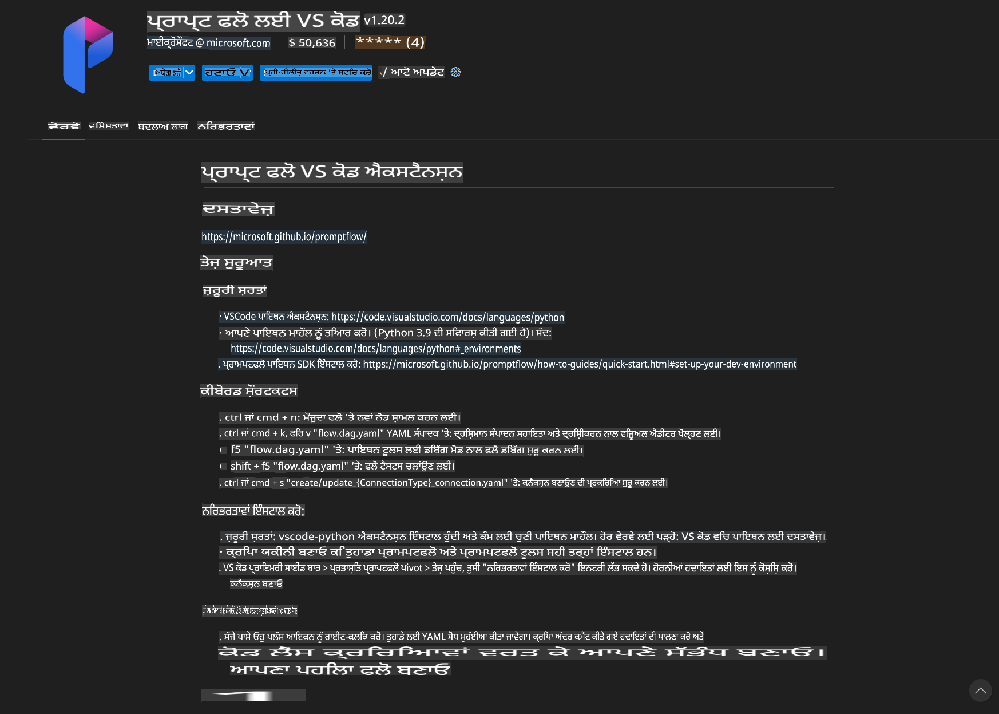
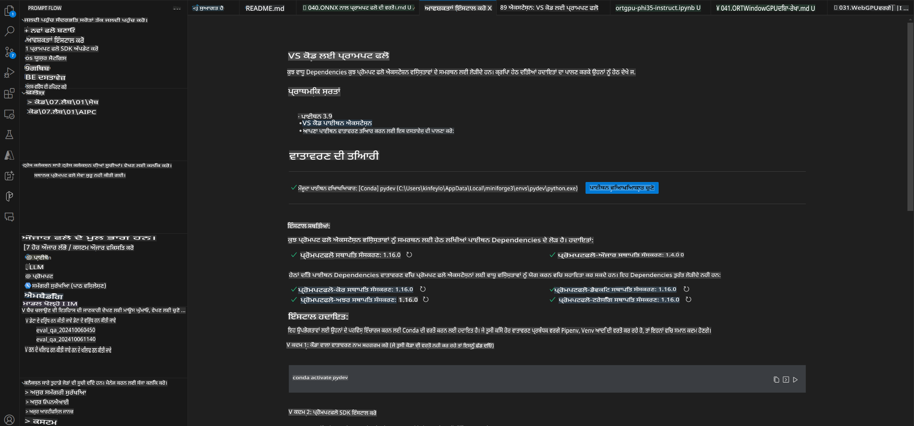
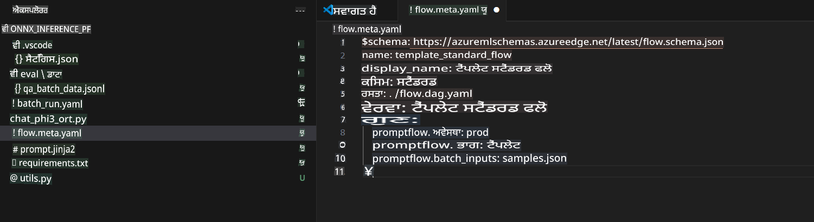
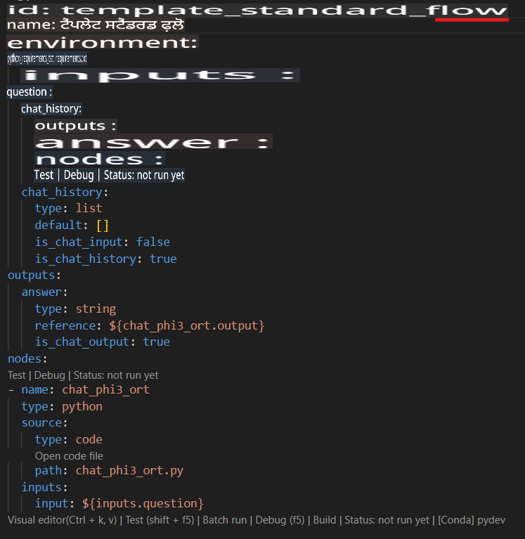
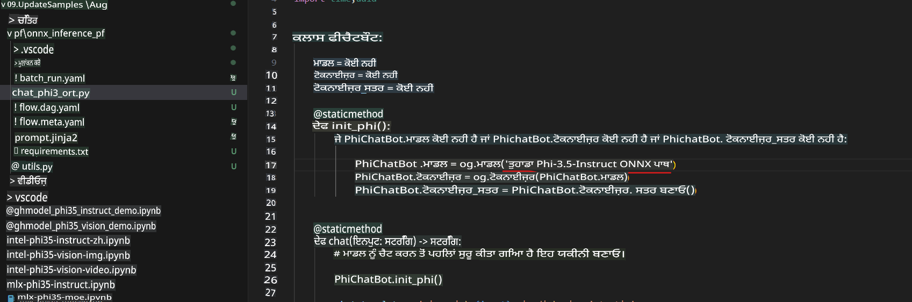
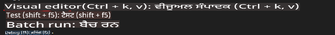
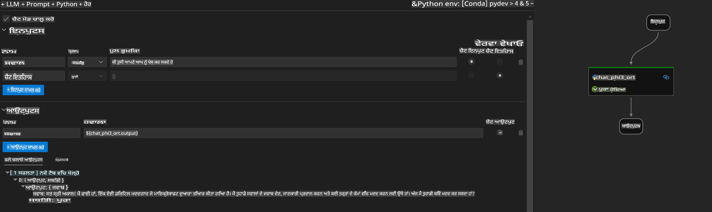
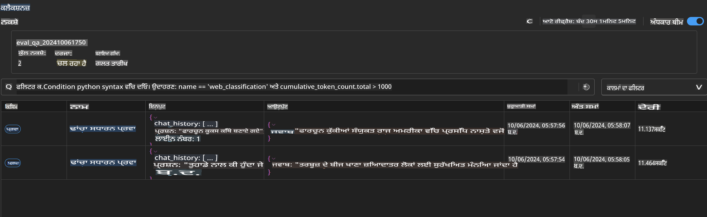

# Windows GPU ਦੀ ਵਰਤੋਂ ਕਰਕੇ Phi-3.5-Instruct ONNX ਨਾਲ Prompt Flow ਹੱਲ ਬਣਾਉਣਾ

ਹੇਠਾਂ ਦਿੱਤਾ ਦਸਤਾਵੇਜ਼ ਇਹ ਦਰਸਾਉਣ ਲਈ ਇੱਕ ਉਦਾਹਰਣ ਹੈ ਕਿ ONNX (Open Neural Network Exchange) ਦੀ ਮਦਦ ਨਾਲ PromptFlow ਦੀ ਵਰਤੋਂ ਕਰਕੇ Phi-3 ਮਾਡਲਾਂ ਅਧਾਰਿਤ AI ਐਪਲੀਕੇਸ਼ਨ ਕਿਵੇਂ ਵਿਕਸਿਤ ਕੀਤੇ ਜਾ ਸਕਦੇ ਹਨ।

PromptFlow ਇੱਕ ਵਿਕਾਸ ਟੂਲਸ ਦਾ ਸੈੱਟ ਹੈ ਜੋ LLM (Large Language Model) ਅਧਾਰਿਤ AI ਐਪਲੀਕੇਸ਼ਨ ਦੇ ਆਰੰਭ ਤੋਂ ਲੈ ਕੇ ਪ੍ਰੋਟੋਟਾਈਪਿੰਗ, ਟੈਸਟਿੰਗ, ਅਤੇ ਮੁਲਾਂਕਣ ਤੱਕ ਦੇ ਪੂਰੇ ਵਿਕਾਸ ਚੱਕਰ ਨੂੰ ਸਧਾਰਨ ਬਣਾਉਣ ਲਈ ਤਿਆਰ ਕੀਤਾ ਗਿਆ ਹੈ।

PromptFlow ਨੂੰ ONNX ਨਾਲ ਜੋੜ ਕੇ ਵਿਕਾਸਕਾਰ ਇਹ ਕਰ ਸਕਦੇ ਹਨ:

- **ਮਾਡਲ ਪ੍ਰਦਰਸ਼ਨ ਵਿੱਚ ਸੁਧਾਰ**: ONNX ਦੀ ਵਰਤੋਂ ਕਰਕੇ ਮਾਡਲ ਦੀ ਕਾਰਗੁਜ਼ਾਰੀ ਅਤੇ ਡਿਪਲੌਇਮੈਂਟ ਨੂੰ ਪ੍ਰਭਾਵਸ਼ਾਲੀ ਬਣਾਓ।
- **ਵਿਕਾਸ ਨੂੰ ਸਧਾਰਨ ਬਣਾਓ**: Workflow ਨੂੰ ਮੈਨੇਜ ਕਰਨ ਅਤੇ ਦੁਹਰਾਏ ਜਾਣ ਵਾਲੇ ਕੰਮਾਂ ਨੂੰ ਆਟੋਮੇਟ ਕਰਨ ਲਈ PromptFlow ਦੀ ਵਰਤੋਂ ਕਰੋ।
- **ਸਹਿਯੋਗ ਨੂੰ ਵਧਾਓ**: ਟੀਮ ਦੇ ਮੈਂਬਰਾਂ ਵਿਚਕਾਰ ਚੰਗੇ ਸਹਿਯੋਗ ਲਈ ਇੱਕ ਇਕਰੂਪ ਵਿਕਾਸ ਮਾਹੌਲ ਪ੍ਰਦਾਨ ਕਰੋ।

**Prompt flow** ਇੱਕ ਵਿਕਾਸ ਟੂਲਸ ਦਾ ਸੈੱਟ ਹੈ ਜੋ LLM ਅਧਾਰਿਤ AI ਐਪਲੀਕੇਸ਼ਨ ਦੇ ਪੂਰੇ ਵਿਕਾਸ ਚੱਕਰ ਨੂੰ ਸਧਾਰਨ ਬਣਾਉਣ ਲਈ ਬਣਾਇਆ ਗਿਆ ਹੈ। ਇਹ ਪ੍ਰੋਟੋਟਾਈਪਿੰਗ, ਟੈਸਟਿੰਗ, ਮੁਲਾਂਕਣ ਤੋਂ ਲੈ ਕੇ ਉਤਪਾਦਨ ਡਿਪਲੌਇਮੈਂਟ ਅਤੇ ਮਾਨੀਟਰਿੰਗ ਤੱਕ ਦੀ ਪ੍ਰਕਿਰਿਆ ਨੂੰ ਆਸਾਨ ਬਣਾਉਂਦਾ ਹੈ। ਇਹ ਪ੍ਰੰਪਟ ਇੰਜੀਨੀਅਰਿੰਗ ਨੂੰ ਬਹੁਤ ਆਸਾਨ ਬਣਾਉਂਦਾ ਹੈ ਅਤੇ ਤੁਹਾਨੂੰ ਉਤਪਾਦਨ ਗੁਣਵੱਤਾ ਵਾਲੀਆਂ LLM ਐਪਸ ਬਣਾਉਣ ਯੋਗ ਬਣਾਉਂਦਾ ਹੈ।

Prompt flow ਨੂੰ OpenAI, Azure OpenAI Service, ਅਤੇ ਕਸਟਮਾਈਜ਼ੇਬਲ ਮਾਡਲਾਂ (Huggingface, ਸਥਾਨਕ LLM/SLM) ਨਾਲ ਜੋੜਿਆ ਜਾ ਸਕਦਾ ਹੈ। ਅਸੀਂ ਉਮੀਦ ਕਰਦੇ ਹਾਂ ਕਿ Phi-3.5 ਦੇ quantized ONNX ਮਾਡਲ ਨੂੰ ਸਥਾਨਕ ਐਪਲੀਕੇਸ਼ਨ ਵਿੱਚ ਡਿਪਲੌਇ ਕਰਾਂਗੇ। Prompt flow ਸਾਨੂੰ ਆਪਣੇ ਕਾਰੋਬਾਰ ਦੀ ਬਿਹਤਰ ਯੋਜਨਾ ਬਣਾਉਣ ਅਤੇ Phi-3.5 ਦੇ ਆਧਾਰ 'ਤੇ ਸਥਾਨਕ ਹੱਲ ਪੂਰੇ ਕਰਨ ਵਿੱਚ ਮਦਦ ਕਰ ਸਕਦਾ ਹੈ। ਇਸ ਉਦਾਹਰਣ ਵਿੱਚ, ਅਸੀਂ Windows GPU ਦੇ ਆਧਾਰ 'ਤੇ ONNX Runtime GenAI Library ਨੂੰ ਵਰਤ ਕੇ Prompt flow ਹੱਲ ਪੂਰਾ ਕਰਾਂਗੇ।

## **ਸਥਾਪਨਾ**

### **Windows GPU ਲਈ ONNX Runtime GenAI**

Windows GPU ਲਈ ONNX Runtime GenAI ਸੈੱਟ ਕਰਨ ਲਈ ਇਸ ਮਾਰਗਦਰਸ਼ਨ ਨੂੰ ਪੜ੍ਹੋ [ਇੱਥੇ ਕਲਿੱਕ ਕਰੋ](./ORTWindowGPUGuideline.md)

### **VSCode ਵਿੱਚ Prompt flow ਸੈਟਅੱਪ ਕਰੋ**

1. Prompt flow VS Code Extension ਇੰਸਟਾਲ ਕਰੋ



2. Prompt flow VS Code Extension ਇੰਸਟਾਲ ਕਰਨ ਤੋਂ ਬਾਅਦ, ਐਕਸਟੈਂਸ਼ਨ 'ਤੇ ਕਲਿੱਕ ਕਰੋ ਅਤੇ **Installation dependencies** ਚੁਣੋ। ਇਸ ਮਾਰਗਦਰਸ਼ਨ ਨੂੰ ਫੋਲੋ ਕਰਕੇ ਆਪਣੇ env ਵਿੱਚ Prompt flow SDK ਇੰਸਟਾਲ ਕਰੋ।



3. [Sample Code](../../../../../../code/09.UpdateSamples/Aug/pf/onnx_inference_pf) ਡਾਊਨਲੋਡ ਕਰੋ ਅਤੇ ਇਸ ਸੈਂਪਲ ਨੂੰ VS Code ਵਿੱਚ ਖੋਲ੍ਹੋ।



4. **flow.dag.yaml** ਖੋਲ੍ਹੋ ਅਤੇ ਆਪਣਾ Python env ਚੁਣੋ।



   **chat_phi3_ort.py** ਖੋਲ੍ਹੋ ਅਤੇ ਆਪਣੀ Phi-3.5-instruct ONNX ਮਾਡਲ ਲੋਕੇਸ਼ਨ ਬਦਲੋ।



5. ਆਪਣੇ Prompt flow ਨੂੰ ਟੈਸਟ ਕਰਨ ਲਈ ਚਲਾਓ।

**flow.dag.yaml** ਖੋਲ੍ਹੋ ਅਤੇ ਵਿਜੁਅਲ ਐਡੀਟਰ 'ਤੇ ਕਲਿੱਕ ਕਰੋ।



ਇਸ 'ਤੇ ਕਲਿੱਕ ਕਰਨ ਤੋਂ ਬਾਅਦ, ਇਸ ਨੂੰ ਚਲਾਓ ਅਤੇ ਟੈਸਟ ਕਰੋ।



1. ਤੁਸੀਂ ਟਰਮੀਨਲ ਵਿੱਚ ਬੈਚ ਚਲਾ ਸਕਦੇ ਹੋ ਅਤੇ ਹੋਰ ਨਤੀਜੇ ਚੈੱਕ ਕਰ ਸਕਦੇ ਹੋ।

```bash

pf run create --file batch_run.yaml --stream --name 'Your eval qa name'    

```

ਤੁਸੀਂ ਆਪਣੇ ਡਿਫੌਲਟ ਬਰਾਊਜ਼ਰ ਵਿੱਚ ਨਤੀਜੇ ਦੇਖ ਸਕਦੇ ਹੋ।



**ਅਸਵੀਕਤੀ**:  
ਇਹ ਦਸਤਾਵੇਜ਼ ਮਸ਼ੀਨ-ਅਧਾਰਿਤ AI ਅਨੁਵਾਦ ਸੇਵਾਵਾਂ ਦੀ ਵਰਤੋਂ ਕਰਕੇ ਅਨੁਵਾਦ ਕੀਤਾ ਗਿਆ ਹੈ। ਜਦੋਂ ਕਿ ਅਸੀਂ ਸਹੀ ਹੋਣ ਲਈ ਯਤਨਸ਼ੀਲ ਹਾਂ, ਕਿਰਪਾ ਕਰਕੇ ਧਿਆਨ ਦਿਓ ਕਿ ਆਟੋਮੇਟਿਕ ਅਨੁਵਾਦਾਂ ਵਿੱਚ ਗਲਤੀਆਂ ਜਾਂ ਅਸੁਣਨਤਾਵਾਂ ਹੋ ਸਕਦੀਆਂ ਹਨ। ਇਸ ਦੀ ਮੂਲ ਭਾਸ਼ਾ ਵਿੱਚ ਲਿਖਿਆ ਦਸਤਾਵੇਜ਼ ਪ੍ਰਮਾਣਿਕ ਸਰੋਤ ਮੰਨਿਆ ਜਾਣਾ ਚਾਹੀਦਾ ਹੈ। ਮਹੱਤਵਪੂਰਨ ਜਾਣਕਾਰੀ ਲਈ, ਪੇਸ਼ੇਵਰ ਮਨੁੱਖੀ ਅਨੁਵਾਦ ਦੀ ਸਿਫਾਰਸ਼ ਕੀਤੀ ਜਾਂਦੀ ਹੈ। ਅਸੀਂ ਇਸ ਅਨੁਵਾਦ ਦੀ ਵਰਤੋਂ ਤੋਂ ਪੈਦਾ ਹੋਣ ਵਾਲੀਆਂ ਕਿਸੇ ਵੀ ਗਲਤਫਹਿਮੀਆਂ ਜਾਂ ਗਲਤ ਵਿਆਖਿਆਵਾਂ ਲਈ ਜ਼ਿੰਮੇਵਾਰ ਨਹੀਂ ਹਾਂ।