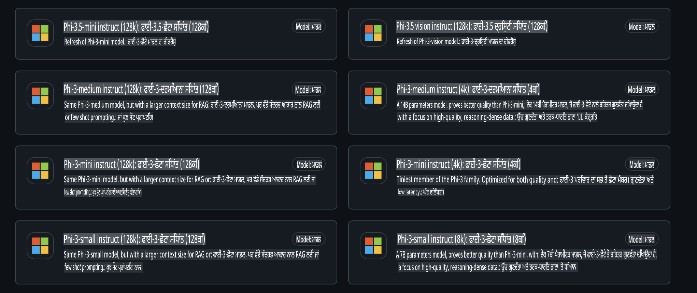
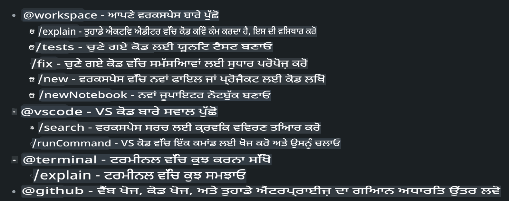
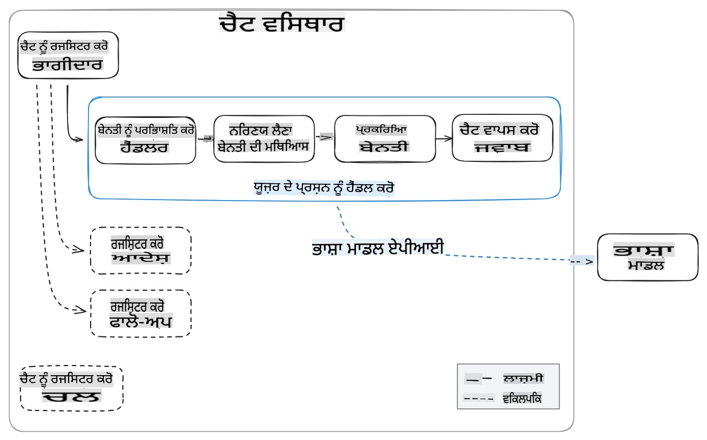
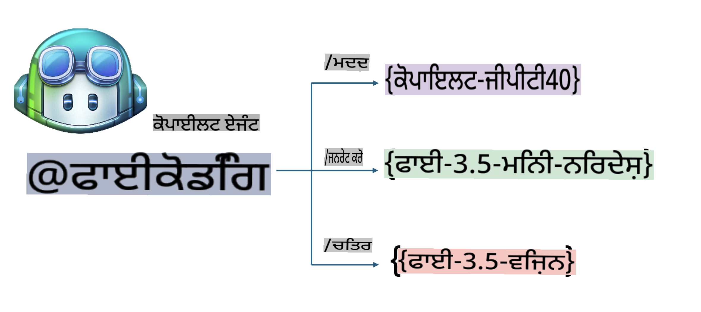
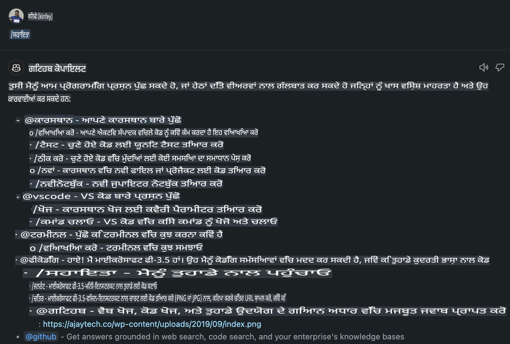
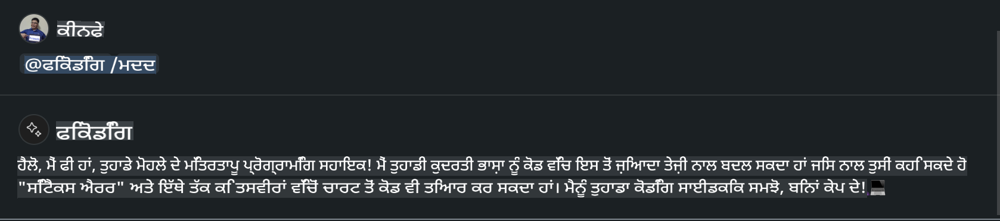
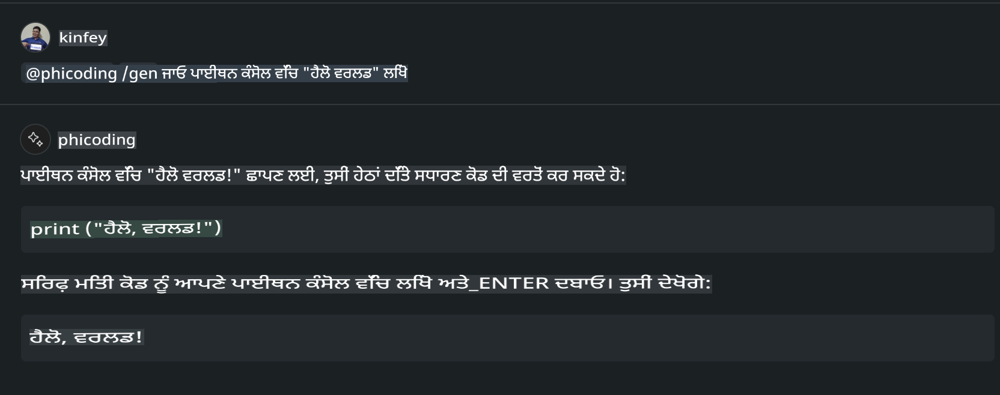
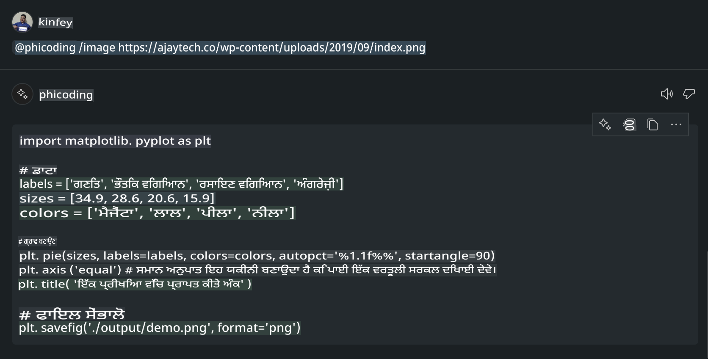

# **ਵਿਜੁਅਲ ਸਟੂਡੀਓ ਕੋਡ ਚੈਟ ਕੋਪਾਇਲਟ ਏਜੰਟ ਨੂੰ GitHub ਮਾਡਲਸ ਦੇ Phi-3.5 ਨਾਲ ਬਣਾਓ**

ਕੀ ਤੁਸੀਂ ਵਿਜੁਅਲ ਸਟੂਡੀਓ ਕੋਡ ਕੋਪਾਇਲਟ ਵਰਤ ਰਹੇ ਹੋ? ਖਾਸ ਤੌਰ 'ਤੇ ਚੈਟ ਵਿੱਚ, ਤੁਸੀਂ ਪ੍ਰਾਜੈਕਟ ਬਣਾਉਣ, ਲਿਖਣ ਅਤੇ ਰੱਖ-ਰਖਾਅ ਕਰਨ ਦੀ ਸਮਰੱਥਾ ਨੂੰ ਸੁਧਾਰਨ ਲਈ ਵੱਖ-ਵੱਖ ਏਜੰਟਾਂ ਦੀ ਵਰਤੋਂ ਕਰ ਸਕਦੇ ਹੋ। ਵਿਜੁਅਲ ਸਟੂਡੀਓ ਕੋਡ ਇੱਕ API ਪ੍ਰਦਾਨ ਕਰਦਾ ਹੈ ਜੋ ਕੰਪਨੀਆਂ ਅਤੇ ਵਿਅਕਤੀਆਂ ਨੂੰ ਆਪਣੇ ਕਾਰੋਬਾਰ ਦੇ ਅਨੁਸਾਰ ਵੱਖ-ਵੱਖ ਖੇਤਰਾਂ ਵਿੱਚ ਆਪਣੀਆਂ ਸਮਰੱਥਾਵਾਂ ਦਾ ਵਿਸਤਾਰ ਕਰਨ ਲਈ ਵੱਖ-ਵੱਖ ਏਜੰਟ ਬਣਾਉਣ ਦੀ ਆਗਿਆ ਦਿੰਦਾ ਹੈ। ਇਸ ਲੇਖ ਵਿੱਚ, ਅਸੀਂ GitHub ਮਾਡਲਸ ਦੇ **Phi-3.5-mini-instruct (128k)** ਅਤੇ **Phi-3.5-vision-instruct (128k)** 'ਤੇ ਧਿਆਨ ਕੇਂਦਰਿਤ ਕਰਾਂਗੇ ਤਾਂ ਜੋ ਤੁਸੀਂ ਆਪਣਾ ਵਿਜੁਅਲ ਸਟੂਡੀਓ ਕੋਡ ਏਜੰਟ ਬਣਾਉਣ।

## **GitHub ਮਾਡਲਸ ਦੇ Phi-3.5 ਬਾਰੇ**

ਸਾਨੂੰ ਪਤਾ ਹੈ ਕਿ Phi-3/3.5 ਪਰਿਵਾਰ ਦੇ Phi-3.5-mini-instruct ਵਿੱਚ ਕੋਡ ਨੂੰ ਸਮਝਣ ਅਤੇ ਜਨਰੇਟ ਕਰਨ ਦੀ ਮਜ਼ਬੂਤ ਸਮਰੱਥਾ ਹੈ ਅਤੇ ਇਹ Gemma-2-9b ਅਤੇ Mistral-Nemo-12B-instruct-2407 ਨਾਲੋਂ ਬਿਹਤਰ ਹੈ।


ਨਵੇਂ GitHub ਮਾਡਲਸ ਪਹਿਲਾਂ ਹੀ **Phi-3.5-mini-instruct (128k)** ਅਤੇ **Phi-3.5-vision-instruct (128k)** ਮਾਡਲਾਂ ਤੱਕ ਪਹੁੰਚ ਪ੍ਰਦਾਨ ਕਰਦੇ ਹਨ। ਡਿਵੈਲਪਰ ਇਨ੍ਹਾਂ ਤੱਕ OpenAI SDK, Azure AI Inference SDK, ਅਤੇ REST API ਰਾਹੀਂ ਪਹੁੰਚ ਸਕਦੇ ਹਨ।



***ਨੋਟ:*** ਇੱਥੇ Azure AI Inference SDK ਦੀ ਵਰਤੋਂ ਕਰਨ ਦੀ ਸਿਫਾਰਸ਼ ਕੀਤੀ ਜਾਂਦੀ ਹੈ, ਕਿਉਂਕਿ ਇਹ ਉਤਪਾਦਨ ਵਾਤਾਵਰਣ ਵਿੱਚ Azure Model Catalog ਦੇ ਨਾਲ ਬਿਹਤਰ ਤਰੀਕੇ ਨਾਲ ਸਵਿੱਚ ਕਰ ਸਕਦਾ ਹੈ।

ਹੇਠਾਂ **Phi-3.5-mini-instruct (128k)** ਅਤੇ **Phi-3.5-vision-instruct (128k)** ਦੇ ਕੋਡ ਜਨਰੇਸ਼ਨ ਸਥਿਤੀ ਵਿੱਚ GitHub ਮਾਡਲਸ ਨਾਲ ਜੁੜਨ ਦੇ ਨਤੀਜੇ ਹਨ, ਅਤੇ ਹੇਠਾਂ ਦਿੱਤੇ ਉਦਾਹਰਣਾਂ ਲਈ ਤਿਆਰੀ ਵੀ ਕੀਤੀ ਗਈ ਹੈ।

**ਡੈਮੋ: GitHub ਮਾਡਲਸ Phi-3.5-mini-instruct (128k) ਪ੍ਰਾਮਪਟ ਤੋਂ ਕੋਡ ਜਨਰੇਟ ਕਰਦਾ ਹੈ** ([ਇਸ ਲਿੰਕ 'ਤੇ ਕਲਿੱਕ ਕਰੋ](../../../../../../code/09.UpdateSamples/Aug/ghmodel_phi35_instruct_demo.ipynb))

**ਡੈਮੋ: GitHub ਮਾਡਲਸ Phi-3.5-vision-instruct (128k) ਚਿੱਤਰ ਤੋਂ ਕੋਡ ਜਨਰੇਟ ਕਰਦਾ ਹੈ** ([ਇਸ ਲਿੰਕ 'ਤੇ ਕਲਿੱਕ ਕਰੋ](../../../../../../code/09.UpdateSamples/Aug/ghmodel_phi35_vision_demo.ipynb))

## **GitHub Copilot ਚੈਟ ਏਜੰਟ ਬਾਰੇ**

GitHub Copilot ਚੈਟ ਏਜੰਟ ਵੱਖ-ਵੱਖ ਪ੍ਰਾਜੈਕਟ ਸਥਿਤੀਆਂ ਵਿੱਚ ਕੋਡ ਦੇ ਅਧਾਰ 'ਤੇ ਵੱਖ-ਵੱਖ ਕੰਮ ਪੂਰੇ ਕਰ ਸਕਦਾ ਹੈ। ਸਿਸਟਮ ਵਿੱਚ ਚਾਰ ਏਜੰਟ ਹਨ: workspace, github, terminal, vscode



ਏਜੰਟ ਦੇ ਨਾਮ ਨੂੰ ‘@’ ਦੇ ਨਾਲ ਜੋੜ ਕੇ, ਤੁਸੀਂ ਸਬੰਧਤ ਕੰਮ ਨੂੰ ਜਲਦੀ ਪੂਰਾ ਕਰ ਸਕਦੇ ਹੋ। ਉਦਯੋਗਾਂ ਲਈ, ਜੇਕਰ ਤੁਸੀਂ ਆਪਣੀ ਕਾਰੋਬਾਰ ਨਾਲ ਜੁੜੀ ਸਮੱਗਰੀ ਜਿਵੇਂ ਕਿ ਲੋੜਾਂ, ਕੋਡਿੰਗ, ਟੈਸਟ ਨਿਰਦੇਸ਼, ਅਤੇ ਰਿਲੀਜ਼ ਸ਼ਾਮਲ ਕਰਦੇ ਹੋ, ਤਾਂ ਤੁਸੀਂ GitHub Copilot ਦੇ ਆਧਾਰ 'ਤੇ ਹੋਰ ਮਜ਼ਬੂਤ ​​ਪ੍ਰਾਈਵੇਟ ਕਾਰੋਬਾਰੀ ਫੰਕਸ਼ਨ ਪ੍ਰਾਪਤ ਕਰ ਸਕਦੇ ਹੋ।

ਵਿਜੁਅਲ ਸਟੂਡੀਓ ਕੋਡ ਚੈਟ ਏਜੰਟ ਨੇ ਹੁਣ ਅਧਿਕਾਰਕ ਤੌਰ 'ਤੇ ਆਪਣਾ API ਜਾਰੀ ਕਰ ਦਿੱਤਾ ਹੈ, ਜੋ ਕਿ ਉਦਯੋਗਾਂ ਜਾਂ ਉਦਯੋਗਿਕ ਡਿਵੈਲਪਰਾਂ ਨੂੰ ਵੱਖ-ਵੱਖ ਸੌਫਟਵੇਅਰ ਬਿਜ਼ਨਸ ਇਕੋਸਿਸਟਮ ਦੇ ਅਧਾਰ 'ਤੇ ਏਜੰਟਾਂ ਨੂੰ ਵਿਕਸਿਤ ਕਰਨ ਦੀ ਆਗਿਆ ਦਿੰਦਾ ਹੈ। ਵਿਜੁਅਲ ਸਟੂਡੀਓ ਕੋਡ ਐਕਸਟੈਂਸ਼ਨ ਡਿਵੈਲਪਮੈਂਟ ਦੇ ਵਿਕਾਸ ਦੇ ਤਰੀਕੇ ਦੇ ਅਧਾਰ 'ਤੇ, ਤੁਸੀਂ ਵਿਜੁਅਲ ਸਟੂਡੀਓ ਕੋਡ ਚੈਟ ਏਜੰਟ API ਦੇ ਇੰਟਰਫੇਸ ਤੱਕ ਆਸਾਨੀ ਨਾਲ ਪਹੁੰਚ ਕਰ ਸਕਦੇ ਹੋ। ਅਸੀਂ ਇਸ ਪ੍ਰਕਿਰਿਆ ਦੇ ਅਧਾਰ 'ਤੇ ਵਿਕਾਸ ਕਰ ਸਕਦੇ ਹਾਂ।



ਵਿਕਾਸ ਸਥਿਤੀ ਤੀਜੀ-ਪੱਖੀ ਮਾਡਲ APIs (ਜਿਵੇਂ ਕਿ GitHub ਮਾਡਲਸ, Azure Model Catalog, ਅਤੇ ਖੁਦ-ਨਿਰਮਿਤ ਸੇਵਾਵਾਂ ਜੋ ਖੁੱਲ੍ਹੇ ਸਰੋਤ ਮਾਡਲਾਂ 'ਤੇ ਆਧਾਰਿਤ ਹਨ) ਤੱਕ ਪਹੁੰਚ ਦਾ ਸਮਰਥਨ ਕਰ ਸਕਦੀ ਹੈ ਅਤੇ GitHub Copilot ਦੁਆਰਾ ਪ੍ਰਦਾਨ ਕੀਤੇ gpt-35-turbo, gpt-4, ਅਤੇ gpt-4o ਮਾਡਲਾਂ ਦੀ ਵਰਤੋਂ ਵੀ ਕਰ ਸਕਦੀ ਹੈ।

## **Phi-3.5 ਦੇ ਆਧਾਰ 'ਤੇ @phicoding ਏਜੰਟ ਸ਼ਾਮਲ ਕਰੋ**

ਅਸੀਂ Phi-3.5 ਦੀ ਪ੍ਰੋਗਰਾਮਿੰਗ ਸਮਰੱਥਾ ਨੂੰ ਇੱਕਠਾ ਕਰਨ ਦੀ ਕੋਸ਼ਿਸ਼ ਕਰਦੇ ਹਾਂ ਤਾਂ ਜੋ ਕੋਡ ਲਿਖਣ, ਚਿੱਤਰ ਜਨਰੇਸ਼ਨ ਕੋਡ ਅਤੇ ਹੋਰ ਕੰਮ ਪੂਰੇ ਕੀਤੇ ਜਾ ਸਕਣ। Phi-3.5 ਦੇ ਆਸਪਾਸ ਬਣਾਇਆ ਗਿਆ ਇੱਕ ਏਜੰਟ ਪੂਰਾ ਕਰੋ - @PHI, ਹੇਠਾਂ ਕੁਝ ਫੰਕਸ਼ਨ ਹਨ:

1. **@phicoding /help** ਕਮਾਂਡ ਰਾਹੀਂ GitHub Copilot ਦੁਆਰਾ ਪ੍ਰਦਾਨ ਕੀਤੇ gpt-4o ਦੇ ਆਧਾਰ 'ਤੇ ਇੱਕ ਸਵੈ-ਪਰਚੇ ਜਨਰੇਟ ਕਰੋ।

2. **@phicoding /gen** ਕਮਾਂਡ ਰਾਹੀਂ **Phi-3.5-mini-instruct (128k)** ਦੇ ਆਧਾਰ 'ਤੇ ਵੱਖ-ਵੱਖ ਪ੍ਰੋਗਰਾਮਿੰਗ ਭਾਸ਼ਾਵਾਂ ਲਈ ਕੋਡ ਜਨਰੇਟ ਕਰੋ।

3. **@phicoding /image** ਕਮਾਂਡ ਰਾਹੀਂ **Phi-3.5-vision-instruct (128k)** ਅਤੇ ਚਿੱਤਰ ਪੂਰਨਤਾ ਦੇ ਆਧਾਰ 'ਤੇ ਕੋਡ ਜਨਰੇਟ ਕਰੋ।



## **ਸੰਬੰਧਿਤ ਕਦਮ**

1. npm ਦੀ ਵਰਤੋਂ ਕਰਕੇ ਵਿਜੁਅਲ ਸਟੂਡੀਓ ਕੋਡ ਐਕਸਟੈਂਸ਼ਨ ਵਿਕਾਸ ਸਮਰਥਨ ਇੰਸਟਾਲ ਕਰੋ।

```bash

npm install --global yo generator-code 

```  
2. ਇੱਕ ਵਿਜੁਅਲ ਸਟੂਡੀਓ ਕੋਡ ਐਕਸਟੈਂਸ਼ਨ ਪਲਗਇਨ ਬਣਾਓ (Typescript ਵਿਕਾਸ ਮੋਡ ਦੀ ਵਰਤੋਂ ਕਰਦੇ ਹੋਏ, ਜਿਸਦਾ ਨਾਮ phiext ਹੈ)।

```bash

yo code 

```  

3. ਬਣਾਏ ਗਏ ਪ੍ਰਾਜੈਕਟ ਨੂੰ ਖੋਲ੍ਹੋ ਅਤੇ package.json ਵਿੱਚ ਸੋਧ ਕਰੋ। ਇੱਥੇ ਸਬੰਧਿਤ ਨਿਰਦੇਸ਼ ਅਤੇ ਸੰਰਚਨਾਵਾਂ ਹਨ, ਅਤੇ GitHub ਮਾਡਲਸ ਦੀ ਸੰਰਚਨਾ ਵੀ ਹੈ। ਧਿਆਨ ਦਿਓ ਕਿ ਤੁਹਾਨੂੰ ਇੱਥੇ ਆਪਣੇ GitHub ਮਾਡਲਸ ਟੋਕਨ ਨੂੰ ਸ਼ਾਮਲ ਕਰਨ ਦੀ ਲੋੜ ਹੈ।

```json

{
  "name": "phiext",
  "displayName": "phiext",
  "description": "",
  "version": "0.0.1",
  "engines": {
    "vscode": "^1.93.0"
  },
  "categories": [
    "AI",
    "Chat"
  ],
  "activationEvents": [],
  "enabledApiProposals": [
      "chatVariableResolver"
  ],
  "main": "./dist/extension.js",
  "contributes": {
    "chatParticipants": [
        {
            "id": "chat.phicoding",
            "name": "phicoding",
            "description": "Hey! I am Microsoft Phi-3.5, She can help me with coding problems, such as generation code with your natural language, or even generation code about chart from images. Just ask me anything!",
            "isSticky": true,
            "commands": [
                {
                    "name": "help",
                    "description": "Introduce myself to you"
                },
                {
                    "name": "gen",
                    "description": "Generate code for you with Microsoft Phi-3.5-mini-instruct"
                },
                {
                    "name": "image",
                    "description": "Generate code for chart from image(png or jpg) with Microsoft Phi-3.5-vision-instruct, please add image url like this : https://ajaytech.co/wp-content/uploads/2019/09/index.png"
                }
            ]
        }
    ],
    "commands": [
        {
            "command": "phicoding.namesInEditor",
            "title": "Use Microsoft Phi 3.5 in Editor"
        }
    ],
    "configuration": {
      "type": "object",
      "title": "githubmodels",
      "properties": {
        "githubmodels.endpoint": {
          "type": "string",
          "default": "https://models.inference.ai.azure.com",
          "description": "Your GitHub Models Endpoint",
          "order": 0
        },
        "githubmodels.api_key": {
          "type": "string",
          "default": "Your GitHub Models Token",
          "description": "Your GitHub Models Token",
          "order": 1
        },
        "githubmodels.phi35instruct": {
          "type": "string",
          "default": "Phi-3.5-mini-instruct",
          "description": "Your Phi-35-Instruct Model",
          "order": 2
        },
        "githubmodels.phi35vision": {
          "type": "string",
          "default": "Phi-3.5-vision-instruct",
          "description": "Your Phi-35-Vision Model",
          "order": 3
        }
      }
    }
  },
  "scripts": {
    "vscode:prepublish": "npm run package",
    "compile": "webpack",
    "watch": "webpack --watch",
    "package": "webpack --mode production --devtool hidden-source-map",
    "compile-tests": "tsc -p . --outDir out",
    "watch-tests": "tsc -p . -w --outDir out",
    "pretest": "npm run compile-tests && npm run compile && npm run lint",
    "lint": "eslint src",
    "test": "vscode-test"
  },
  "devDependencies": {
    "@types/vscode": "^1.93.0",
    "@types/mocha": "^10.0.7",
    "@types/node": "20.x",
    "@typescript-eslint/eslint-plugin": "^8.3.0",
    "@typescript-eslint/parser": "^8.3.0",
    "eslint": "^9.9.1",
    "typescript": "^5.5.4",
    "ts-loader": "^9.5.1",
    "webpack": "^5.94.0",
    "webpack-cli": "^5.1.4",
    "@vscode/test-cli": "^0.0.10",
    "@vscode/test-electron": "^2.4.1"
  },
  "dependencies": {
    "@types/node-fetch": "^2.6.11",
    "node-fetch": "^3.3.2",
    "@azure-rest/ai-inference": "latest",
    "@azure/core-auth": "latest",
    "@azure/core-sse": "latest"
  }
}


```  

4. src/extension.ts ਵਿੱਚ ਸੋਧ ਕਰੋ।

```typescript

// The module 'vscode' contains the VS Code extensibility API
// Import the module and reference it with the alias vscode in your code below
import * as vscode from 'vscode';
import ModelClient from "@azure-rest/ai-inference";
import { AzureKeyCredential } from "@azure/core-auth";


interface IPhiChatResult extends vscode.ChatResult {
    metadata: {
        command: string;
    };
}


const MODEL_SELECTOR: vscode.LanguageModelChatSelector = { vendor: 'copilot', family: 'gpt-4o' };

function isValidImageUrl(url: string): boolean {
    const regex = /^(https?:\/\/.*\.(?:png|jpg))$/i;
    return regex.test(url);
}
  

// This method is called when your extension is activated
// Your extension is activated the very first time the command is executed
export function activate(context: vscode.ExtensionContext) {

    const codinghandler: vscode.ChatRequestHandler = async (request: vscode.ChatRequest, context: vscode.ChatContext, stream: vscode.ChatResponseStream, token: vscode.CancellationToken): Promise<IPhiChatResult> => {


        const config : any = vscode.workspace.getConfiguration('githubmodels');
        const endPoint: string = config.get('endpoint');
        const apiKey: string = config.get('api_key');
        const phi35instruct: string = config.get('phi35instruct');
        const phi35vision: string = config.get('phi35vision');
        
        if (request.command === 'help') {

            const content = "Welcome to Coding assistant with Microsoft Phi-3.5"; 
            stream.progress(content);


            try {
                const [model] = await vscode.lm.selectChatModels(MODEL_SELECTOR);
                if (model) {
                    const messages = [
                        vscode.LanguageModelChatMessage.User("Please help me express this content in a humorous way: I am a programming assistant who can help you convert natural language into code and generate code based on the charts in the images. output format like this : Hey I am Phi ......")
                    ];
                    const chatResponse = await model.sendRequest(messages, {}, token);
                    for await (const fragment of chatResponse.text) {
                        stream.markdown(fragment);
                    }
                }
            } catch(err) {
                console.log(err);
            }


            return { metadata: { command: 'help' } };

        }

        
        if (request.command === 'gen') {

            const content = "Welcome to use phi-3.5 to generate code";

            stream.progress(content);

            const client = new ModelClient(endPoint, new AzureKeyCredential(apiKey));

            const response = await client.path("/chat/completions").post({
              body: {
                messages: [
                  { role:"system", content: "You are a coding assistant.Help answer all code generation questions." },
                  { role:"user", content: request.prompt }
                ],
                model: phi35instruct,
                temperature: 0.4,
                max_tokens: 1000,
                top_p: 1.
              }
            });

            stream.markdown(response.body.choices[0].message.content);

            return { metadata: { command: 'gen' } };

        }


        
        if (request.command === 'image') {


            const content = "Welcome to use phi-3.5 to generate code from image(png or jpg),image url like this:https://ajaytech.co/wp-content/uploads/2019/09/index.png";

            stream.progress(content);

            if (!isValidImageUrl(request.prompt)) {
                stream.markdown('Please provide a valid image URL');
                return { metadata: { command: 'image' } };
            }
            else
            {

                const client = new ModelClient(endPoint, new AzureKeyCredential(apiKey));
    
                const response = await client.path("/chat/completions").post({
                    body: {
                      messages: [
                        { role: "system", content: "You are a helpful assistant that describes images in details." },
                        { role: "user", content: [
                            { type: "text", text: "Please generate code according to the chart in the picture according to the following requirements\n1. Keep all information in the chart, including data and text\n2. Do not generate additional information that is not included in the chart\n3. Please extract data from the picture, do not generate it from csv\n4. Please save the regenerated chart as a chart and save it to ./output/demo.png"},
                            { type: "image_url", image_url: {url: request.prompt}
                            }
                          ]
                        }
                      ],
                      model: phi35vision,
                      temperature: 0.4,
                      max_tokens: 2048,
                      top_p: 1.
                    }
                  });
    
                
                stream.markdown(response.body.choices[0].message.content);
    
                return { metadata: { command: 'image' } };
            }


        }


        return { metadata: { command: '' } };
    };


    const phi_ext = vscode.chat.createChatParticipant("chat.phicoding", codinghandler);

    phi_ext.iconPath = new vscode.ThemeIcon('sparkle');


    phi_ext.followupProvider = {
        provideFollowups(result: IPhiChatResult, context: vscode.ChatContext, token: vscode.CancellationToken) {
            return [{
                prompt: 'Let us coding with Phi-3.5 😋😋😋😋',
                label: vscode.l10n.t('Enjoy coding with Phi-3.5'),
                command: 'help'
            } satisfies vscode.ChatFollowup];
        }
    };

    context.subscriptions.push(phi_ext);
}

// This method is called when your extension is deactivated
export function deactivate() {}


```  

6. ਚਲਾਓ

***/help***  

  

***@phicoding /help***  

  

***@phicoding /gen***  

  

***@phicoding /image***  

  

ਤੁਸੀਂ ਨਮੂਨਾ ਕੋਡ ਡਾਊਨਲੋਡ ਕਰ ਸਕਦੇ ਹੋ: [ਕਲਿੱਕ ਕਰੋ](../../../../../../code/09.UpdateSamples/Aug/vscode)  

## **ਸਰੋਤ**

1. GitHub ਮਾਡਲਸ ਲਈ ਸਾਈਨ ਅਪ ਕਰੋ [https://gh.io/models](https://gh.io/models)  

2. ਵਿਜੁਅਲ ਸਟੂਡੀਓ ਕੋਡ ਐਕਸਟੈਂਸ਼ਨ ਵਿਕਾਸ ਬਾਰੇ ਸਿੱਖੋ [https://code.visualstudio.com/api/get-started/your-first-extension](https://code.visualstudio.com/api/get-started/your-first-extension)  

3. ਵਿਜੁਅਲ ਸਟੂਡੀਓ ਕੋਡ ਕੋਪਾਇਲਟ ਚੈਟ API ਬਾਰੇ ਸਿੱਖੋ [https://code.visualstudio.com/api/extension-guides/chat](https://code.visualstudio.com/api/extension-guides/chat)  

**ਅਸਵੀਕਾਰਨਾ**:  
ਇਹ ਦਸਤਾਵੇਜ਼ ਮਸ਼ੀਨ-ਆਧਾਰਿਤ AI ਅਨੁਵਾਦ ਸੇਵਾਵਾਂ ਦੀ ਵਰਤੋਂ ਕਰਕੇ ਅਨੁਵਾਦਿਤ ਕੀਤਾ ਗਿਆ ਹੈ। ਜਦੋਂ ਕਿ ਅਸੀਂ ਸਹੀ ਹੋਣ ਦੀ ਪੂਰੀ ਕੋਸ਼ਿਸ਼ ਕਰਦੇ ਹਾਂ, ਕਿਰਪਾ ਕਰਕੇ ਧਿਆਨ ਵਿੱਚ ਰੱਖੋ ਕਿ ਆਟੋਮੇਟਿਕ ਅਨੁਵਾਦਾਂ ਵਿੱਚ ਗਲਤੀਆਂ ਜਾਂ ਅਸੁਚੱਜੇ ਤੱਥ ਹੋ ਸਕਦੇ ਹਨ। ਮੂਲ ਦਸਤਾਵੇਜ਼ ਨੂੰ ਉਸਦੀ ਮੂਲ ਭਾਸ਼ਾ ਵਿੱਚ ਪ੍ਰਮਾਣਿਕ ਸਰੋਤ ਮੰਨਿਆ ਜਾਣਾ ਚਾਹੀਦਾ ਹੈ। ਮਹੱਤਵਪੂਰਨ ਜਾਣਕਾਰੀ ਲਈ, ਪੇਸ਼ੇਵਰ ਮਨੁੱਖੀ ਅਨੁਵਾਦ ਦੀ ਸਿਫਾਰਸ਼ ਕੀਤੀ ਜਾਂਦੀ ਹੈ। ਅਸੀਂ ਇਸ ਅਨੁਵਾਦ ਦੀ ਵਰਤੋਂ ਤੋਂ ਪੈਦਾ ਹੋਣ ਵਾਲੀਆਂ ਕਿਸੇ ਵੀ ਗਲਤਫਹਮੀਆਂ ਜਾਂ ਗਲਤ ਵਿਆਖਿਆਵਾਂ ਲਈ ਜ਼ਿੰਮੇਵਾਰ ਨਹੀਂ ਹਾਂ।