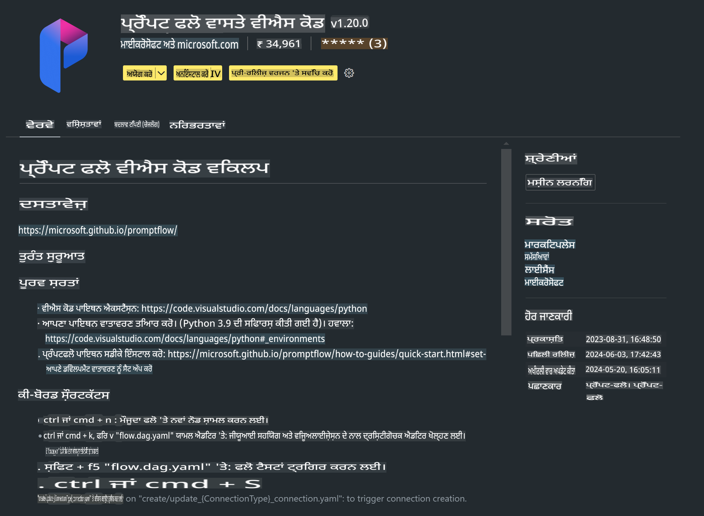

# **ਲੈਬ 0 - ਇੰਸਟਾਲੇਸ਼ਨ**

ਜਦੋਂ ਅਸੀਂ ਲੈਬ ਵਿੱਚ ਦਾਖਲ ਹੁੰਦੇ ਹਾਂ, ਸਾਨੂੰ ਸੰਬੰਧਤ ਵਾਤਾਵਰਣ ਕਾਨਫਿਗਰ ਕਰਨਾ ਪੈਂਦਾ ਹੈ:

### **1. Python 3.11+**

ਤੁਹਾਡੇ Python ਵਾਤਾਵਰਣ ਨੂੰ ਕਾਨਫਿਗਰ ਕਰਨ ਲਈ miniforge ਦੀ ਸਿਫਾਰਸ਼ ਕੀਤੀ ਜਾਂਦੀ ਹੈ।

Miniforge ਨੂੰ ਕਾਨਫਿਗਰ ਕਰਨ ਲਈ, ਕਿਰਪਾ ਕਰਕੇ ਇਸ ਨੂੰ ਵੇਖੋ: [https://github.com/conda-forge/miniforge](https://github.com/conda-forge/miniforge)

Miniforge ਕਾਨਫਿਗਰ ਕਰਨ ਤੋਂ ਬਾਅਦ, Power Shell ਵਿੱਚ ਹੇਠਾਂ ਦਿੱਤਾ ਕਮਾਂਡ ਚਲਾਓ:

```bash

conda create -n pyenv python==3.11.8 -y

conda activate pyenv

```

### **2. Prompt flow SDK ਇੰਸਟਾਲ ਕਰੋ**

ਲੈਬ 1 ਵਿੱਚ, ਅਸੀਂ Prompt flow ਦੀ ਵਰਤੋਂ ਕਰਦੇ ਹਾਂ, ਇਸ ਲਈ ਤੁਹਾਨੂੰ Prompt flow SDK ਕਾਨਫਿਗਰ ਕਰਨ ਦੀ ਲੋੜ ਹੈ।

```bash

pip install promptflow --upgrade

```

ਤੁਸੀਂ ਇਸ ਕਮਾਂਡ ਨਾਲ promptflow sdk ਚੈੱਕ ਕਰ ਸਕਦੇ ਹੋ:

```bash

pf --version

```

### **3. Visual Studio Code Prompt flow Extension ਇੰਸਟਾਲ ਕਰੋ**



### **4. Intel NPU ਐਕਸਲੇਰੇਸ਼ਨ ਲਾਇਬ੍ਰੇਰੀ**

Intel ਦੇ ਨਵੇਂ ਜਨਰੇਸ਼ਨ ਪ੍ਰੋਸੈਸਰ NPU ਨੂੰ ਸਪੋਰਟ ਕਰਦੇ ਹਨ। ਜੇਕਰ ਤੁਸੀਂ NPU ਦੀ ਵਰਤੋਂ ਕਰਕੇ LLMs / SLMs ਨੂੰ ਲੋਕਲ ਰਣ ਕਰਨਾ ਚਾਹੁੰਦੇ ਹੋ, ਤਾਂ ਤੁਸੀਂ ***Intel NPU Acceleration Library*** ਦੀ ਵਰਤੋਂ ਕਰ ਸਕਦੇ ਹੋ। ਜੇਕਰ ਤੁਸੀਂ ਹੋਰ ਜਾਣਕਾਰੀ ਪ੍ਰਾਪਤ ਕਰਨਾ ਚਾਹੁੰਦੇ ਹੋ, ਤਾਂ ਤੁਸੀਂ ਇਸ ਨੂੰ ਪੜ੍ਹ ਸਕਦੇ ਹੋ: [https://github.com/microsoft/PhiCookBook/blob/main/md/01.Introduction/03/AIPC_Inference.md](https://github.com/microsoft/PhiCookBook/blob/main/md/01.Introduction/03/AIPC_Inference.md)।

Intel NPU Acceleration Library ਨੂੰ bash ਵਿੱਚ ਇੰਸਟਾਲ ਕਰੋ:

```bash

pip install intel-npu-acceleration-library

```

***ਨੋਟ***: ਕਿਰਪਾ ਕਰਕੇ ਧਿਆਨ ਦਿਓ ਕਿ ਇਹ ਲਾਇਬ੍ਰੇਰੀ ***4.40.2*** ਵਰਜਨ ਦੇ transformers ਨੂੰ ਸਪੋਰਟ ਕਰਦੀ ਹੈ, ਕਿਰਪਾ ਕਰਕੇ ਵਰਜਨ ਦੀ ਪੁਸ਼ਟੀ ਕਰੋ।

### **5. ਹੋਰ Python ਲਾਇਬ੍ਰੇਰੀਆਂ**

requirements.txt ਬਣਾਓ ਅਤੇ ਇਸ ਸਮੱਗਰੀ ਨੂੰ ਸ਼ਾਮਲ ਕਰੋ:

```txt

notebook
numpy 
scipy 
scikit-learn 
matplotlib 
pandas 
pillow 
graphviz

```

### **6. NVM ਇੰਸਟਾਲ ਕਰੋ**

Powershell ਵਿੱਚ nvm ਇੰਸਟਾਲ ਕਰੋ:

```bash

winget install -e --id CoreyButler.NVMforWindows

```

nodejs 18.20 ਇੰਸਟਾਲ ਕਰੋ:

```bash

nvm install 18.20.0

nvm use 18.20.0

```

### **7. Visual Studio Code Development Support ਇੰਸਟਾਲ ਕਰੋ**

```bash

npm install --global yo generator-code

```

ਮੁਬਾਰਕਾਂ! ਤੁਸੀਂ SDK ਨੂੰ ਸਫਲਤਾਪੂਰਵਕ ਕਾਨਫਿਗਰ ਕਰ ਲਿਆ ਹੈ। ਹੁਣ ਅਗਲੇ ਪ੍ਰੈਕਟਿਕਲ ਕਦਮਾਂ ਵੱਲ ਵਧੋ।

**ਅਸਵੀਕਤੀ**:  
ਇਹ ਦਸਤਾਵੇਜ਼ ਮਸ਼ੀਨ ਅਧਾਰਿਤ AI ਅਨੁਵਾਦ ਸੇਵਾਵਾਂ ਦੀ ਵਰਤੋਂ ਕਰਕੇ ਅਨੁਵਾਦ ਕੀਤਾ ਗਿਆ ਹੈ। ਜਦੋਂ ਕਿ ਅਸੀਂ ਸਹੀ ਹੋਣ ਦੀ ਕੋਸ਼ਿਸ਼ ਕਰਦੇ ਹਾਂ, ਕਿਰਪਾ ਕਰਕੇ ਧਿਆਨ ਵਿੱਚ ਰੱਖੋ ਕਿ ਆਟੋਮੈਟਿਕ ਅਨੁਵਾਦਾਂ ਵਿੱਚ ਗਲਤੀਆਂ ਜਾਂ ਅਸੁੱਤਰ ਹੋ ਸਕਦੇ ਹਨ। ਮੂਲ ਦਸਤਾਵੇਜ਼, ਜੋ ਇਸਦੀ ਮੂਲ ਭਾਸ਼ਾ ਵਿੱਚ ਹੈ, ਨੂੰ ਅਧਿਕਾਰਤ ਸਰੋਤ ਮੰਨਿਆ ਜਾਣਾ ਚਾਹੀਦਾ ਹੈ। ਮਹੱਤਵਪੂਰਨ ਜਾਣਕਾਰੀ ਲਈ, ਪੇਸ਼ੇਵਰ ਮਨੁੱਖੀ ਅਨੁਵਾਦ ਦੀ ਸਿਫਾਰਿਸ਼ ਕੀਤੀ ਜਾਂਦੀ ਹੈ। ਇਸ ਅਨੁਵਾਦ ਦੇ ਉਪਯੋਗ ਤੋਂ ਪੈਦਾ ਹੋਣ ਵਾਲੀਆਂ ਕੋਈ ਵੀ ਗਲਤਫਹਮੀਆਂ ਜਾਂ ਗਲਤ ਵਿਆਖਿਆਵਾਂ ਲਈ ਅਸੀਂ ਜ਼ਿੰਮੇਵਾਰ ਨਹੀਂ ਹਾਂ।