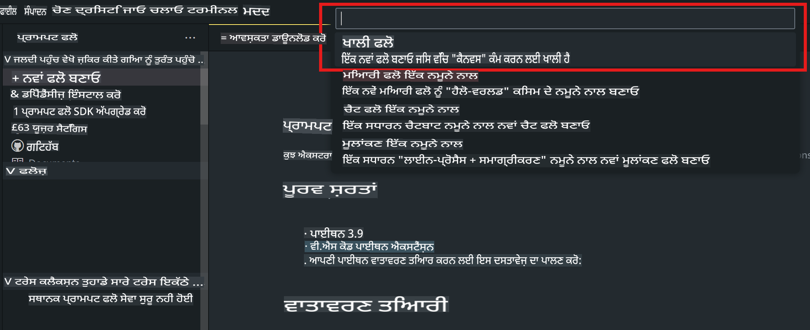
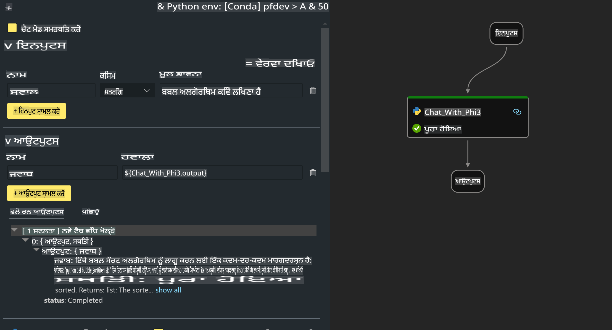

# **ਲੈਬ 2 - AIPC ਵਿੱਚ Phi-3-mini ਨਾਲ ਪ੍ਰੌਮਪਟ ਫਲੋ ਚਲਾਉਣਾ**

## **ਪ੍ਰੌਮਪਟ ਫਲੋ ਕੀ ਹੈ**

ਪ੍ਰੌਮਪਟ ਫਲੋ ਇੱਕ ਡਿਵੈਲਪਮੈਂਟ ਟੂਲਸ ਦਾ ਸੈੱਟ ਹੈ ਜੋ LLM-ਅਧਾਰਿਤ AI ਐਪਲੀਕੇਸ਼ਨਜ਼ ਦੇ ਵਿਕਾਸ ਚੱਕਰ ਨੂੰ ਆਸਾਨ ਬਣਾਉਂਦਾ ਹੈ। ਇਹ ਆਈਡੀਏਸ਼ਨ, ਪ੍ਰੋਟੋਟਾਈਪਿੰਗ, ਟੈਸਟਿੰਗ, ਮੁਲਾਂਕਣ ਤੋਂ ਲੈ ਕੇ ਪ੍ਰੋਡਕਸ਼ਨ ਡਿਪਲੌਇਮੈਂਟ ਅਤੇ ਮਾਨੀਟਰਿੰਗ ਤੱਕ ਦੇ ਕੰਮਾਂ ਨੂੰ ਸਧਾਰਨ ਕਰਦਾ ਹੈ। ਇਸ ਨਾਲ ਪ੍ਰੌਮਪਟ ਇੰਜੀਨੀਅਰਿੰਗ ਬਹੁਤ ਆਸਾਨ ਹੋ ਜਾਂਦੀ ਹੈ ਅਤੇ ਤੁਸੀਂ ਉੱਚ ਗੁਣਵੱਤਾ ਵਾਲੀਆਂ LLM ਐਪਸ ਬਣਾ ਸਕਦੇ ਹੋ।

ਪ੍ਰੌਮਪਟ ਫਲੋ ਨਾਲ ਤੁਸੀਂ ਇਹ ਕਰ ਸਕਦੇ ਹੋ:

- LLMs, ਪ੍ਰੌਮਪਟਸ, Python ਕੋਡ ਅਤੇ ਹੋਰ ਟੂਲਸ ਨੂੰ ਇੱਕ ਕਾਰਗਰ ਵਰਕਫਲੋ ਵਿੱਚ ਜੋੜ ਕੇ ਫਲੋ ਬਣਾਉਣਾ।

- ਆਪਣੇ ਫਲੋਜ਼ ਨੂੰ ਡਿਬੱਗ ਅਤੇ ਦੋਹਰਾਉਣਾ, ਖਾਸ ਕਰਕੇ LLMs ਨਾਲ ਇੰਟਰੈਕਸ਼ਨ ਨੂੰ ਆਸਾਨੀ ਨਾਲ ਸੰਭਾਲਣਾ।

- ਵੱਡੇ ਡੇਟਾਸੈੱਟਸ ਨਾਲ ਗੁਣਵੱਤਾ ਅਤੇ ਪ੍ਰਦਰਸ਼ਨ ਮਾਪਦੰਡਾਂ ਦੀ ਗਿਣਤੀ ਕਰਕੇ ਆਪਣੇ ਫਲੋਜ਼ ਦਾ ਮੁਲਾਂਕਣ ਕਰਨਾ।

- ਆਪਣੇ CI/CD ਸਿਸਟਮ ਵਿੱਚ ਟੈਸਟਿੰਗ ਅਤੇ ਮੁਲਾਂਕਣ ਨੂੰ ਸ਼ਾਮਲ ਕਰਕੇ ਆਪਣੇ ਫਲੋ ਦੀ ਗੁਣਵੱਤਾ ਯਕੀਨੀ ਬਣਾਉਣਾ।

- ਆਪਣੇ ਫਲੋਜ਼ ਨੂੰ ਤੁਹਾਡੇ ਚੁਣੇ ਸਰਵਿੰਗ ਪਲੇਟਫਾਰਮ ਤੇ ਡਿਪਲੌਇ ਕਰਨਾ ਜਾਂ ਆਪਣੇ ਐਪ ਦੀ ਕੋਡ ਬੇਸ ਵਿੱਚ ਆਸਾਨੀ ਨਾਲ ਸ਼ਾਮਲ ਕਰਨਾ।

- (ਵਿਕਲਪਿਕ ਪਰ ਬਹੁਤ ਸਿਫਾਰਸ਼ੀ) Azure AI ਵਿੱਚ ਪ੍ਰੌਮਪਟ ਫਲੋ ਦੇ ਕਲਾਉਡ ਵਰਜਨ ਦਾ ਫਾਇਦਾ ਲੈ ਕੇ ਆਪਣੀ ਟੀਮ ਨਾਲ ਸਹਿਯੋਗ ਕਰਨਾ।  

## **AIPC ਕੀ ਹੈ**

AI PC ਵਿੱਚ ਇੱਕ CPU, GPU ਅਤੇ NPU ਹੁੰਦੇ ਹਨ, ਜੋ ਹਰ ਇੱਕ ਵਿੱਚ ਖਾਸ AI ਤੇਜ਼ੀ ਦੀਆਂ ਯੋਗਤਾਵਾਂ ਹੁੰਦੀਆਂ ਹਨ। NPU, ਜਾਂ ਨਿਊਰਲ ਪ੍ਰੋਸੈਸਿੰਗ ਯੂਨਿਟ, ਇੱਕ ਵਿਸ਼ੇਸ਼ ਐਕਸੀਲੇਟਰ ਹੈ ਜੋ ਕਲਾਉਡ 'ਤੇ ਡੇਟਾ ਭੇਜਣ ਦੀ ਬਜਾਏ ਤੁਹਾਡੇ PC 'ਤੇ ਹੀ ਕ੍ਰਿਤਰਿਮ ਬੁੱਧੀ (AI) ਅਤੇ ਮਸ਼ੀਨ ਲਰਨਿੰਗ (ML) ਕੰਮਾਂ ਨੂੰ ਸੰਭਾਲਦਾ ਹੈ। GPU ਅਤੇ CPU ਵੀ ਇਹ ਕੰਮ ਕਰ ਸਕਦੇ ਹਨ, ਪਰ NPU ਖਾਸ ਤੌਰ 'ਤੇ ਘੱਟ ਪਾਵਰ ਵਾਲੀਆਂ AI ਗਿਣਤੀਆਂ ਲਈ ਬਹੁਤ ਵਧੀਆ ਹੈ। AI PC ਸਾਡੇ ਕੰਪਿਊਟਰਾਂ ਦੇ ਕੰਮ ਕਰਨ ਦੇ ਤਰੀਕੇ ਵਿੱਚ ਇੱਕ ਮੂਲ ਬਦਲਾਅ ਦਰਸਾਉਂਦਾ ਹੈ। ਇਹ ਕਿਸੇ ਅਜਿਹੀ ਸਮੱਸਿਆ ਦਾ ਹੱਲ ਨਹੀਂ ਹੈ ਜੋ ਪਹਿਲਾਂ ਮੌਜੂਦ ਨਹੀਂ ਸੀ, ਪਰ ਇਹ ਹਰ ਰੋਜ਼ ਦੇ ਕੰਪਿਊਟਰ ਉਪਯੋਗਾਂ ਲਈ ਵੱਡਾ ਸੁਧਾਰ ਦਾ ਵਾਅਦਾ ਕਰਦਾ ਹੈ।

ਇਹ ਕਿਵੇਂ ਕੰਮ ਕਰਦਾ ਹੈ? ਜਨਰੇਟਿਵ AI ਅਤੇ ਵੱਡੇ ਭਾਸ਼ਾ ਮਾਡਲਾਂ (LLMs) ਦੇ ਮੁਕਾਬਲੇ, ਜੋ ਜਨਤਕ ਡੇਟਾ ਦੇ ਵੱਡੇ ਪੱਧਰ 'ਤੇ ਟ੍ਰੇਨ ਕੀਤੇ ਜਾਂਦੇ ਹਨ, ਤੁਹਾਡੇ PC 'ਤੇ ਹੋਣ ਵਾਲਾ AI ਹਰ ਪੱਧਰ ਤੇ ਜਿਆਦਾ ਪਹੁੰਚਯੋਗ ਹੈ। ਇਹ ਸੰਕਲਪ ਆਸਾਨ ਹੈ, ਅਤੇ ਕਿਉਂਕਿ ਇਹ ਤੁਹਾਡੇ ਡੇਟਾ 'ਤੇ ਟ੍ਰੇਨ ਕੀਤਾ ਗਿਆ ਹੈ, ਬਿਨਾਂ ਕਲਾਉਡ ਨੂੰ ਪਹੁੰਚ ਕਰਨ ਦੀ ਲੋੜ, ਇਸ ਦੇ ਫਾਇਦੇ ਵੱਡੇ ਦਰਸ਼ਕਾਂ ਲਈ ਜਿਆਦਾ ਤੁਰੰਤ ਅਪੀਲ ਵਾਲੇ ਹਨ।

ਨਿਕਟ ਭਵਿੱਖ ਵਿੱਚ, AI PC ਦੁਨੀਆ ਵਿੱਚ ਨਿੱਜੀ ਸਹਾਇਕਾਂ ਅਤੇ ਛੋਟੇ AI ਮਾਡਲਾਂ ਸ਼ਾਮਲ ਹਨ, ਜੋ ਤੁਹਾਡੇ PC 'ਤੇ ਹੀ ਚਲਦੇ ਹਨ, ਤੁਹਾਡੇ ਡੇਟਾ ਦੀ ਵਰਤੋਂ ਕਰਦੇ ਹੋਏ ਨਿੱਜੀ, ਪ੍ਰਾਈਵੇਟ, ਅਤੇ ਜਿਆਦਾ ਸੁਰੱਖਿਅਤ AI ਸੁਧਾਰ ਪ੍ਰਦਾਨ ਕਰਦੇ ਹਨ। ਇਹ ਉਹ ਕੰਮ ਆਸਾਨ ਬਣਾਉਣ ਲਈ ਹਨ ਜੋ ਤੁਸੀਂ ਹਰ ਰੋਜ਼ ਕਰਦੇ ਹੋ – ਮੀਟਿੰਗ ਮਿੰਟਸ ਲੈਣਾ, ਫੈਂਟਸੀ ਫੁੱਟਬਾਲ ਲੀਗ ਦਾ ਪ੍ਰਬੰਧਨ ਕਰਨਾ, ਫੋਟੋ ਅਤੇ ਵੀਡੀਓ ਐਡਿਟਿੰਗ ਲਈ ਸੁਧਾਰਾਂ ਨੂੰ ਆਟੋਮੇਟ ਕਰਨਾ, ਜਾਂ ਪਰਿਵਾਰਕ ਮੁਲਾਕਾਤ ਲਈ ਸਫਰ ਦਾ ਸ਼ਡਿਊਲ ਬਣਾਉਣਾ।

## **AIPC 'ਤੇ ਜਨਰੇਸ਼ਨ ਕੋਡ ਫਲੋਜ਼ ਬਣਾਉਣਾ**

***ਨੋਟ***: ਜੇਕਰ ਤੁਸੀਂ ਵਾਤਾਵਰਣ ਦੀ ਇੰਸਟਾਲੇਸ਼ਨ ਪੂਰੀ ਨਹੀਂ ਕੀਤੀ, ਤਾਂ ਕਿਰਪਾ ਕਰਕੇ [ਲੈਬ 0 - ਇੰਸਟਾਲੇਸ਼ਨ](./01.Installations.md) 'ਤੇ ਜਾਓ।

1. Visual Studio Code ਵਿੱਚ ਪ੍ਰੌਮਪਟ ਫਲੋ ਐਕਸਟੈਂਸ਼ਨ ਖੋਲ੍ਹੋ ਅਤੇ ਇੱਕ ਖਾਲੀ ਫਲੋ ਪ੍ਰੋਜੈਕਟ ਬਣਾਓ।



2. Inputs ਅਤੇ Outputs ਪੈਰਾਮੀਟਰ ਜੋੜੋ ਅਤੇ Python ਕੋਡ ਨੂੰ ਨਵੇਂ ਫਲੋ ਵਜੋਂ ਸ਼ਾਮਲ ਕਰੋ।



ਤੁਸੀਂ ਆਪਣੇ ਫਲੋ ਨੂੰ ਬਣਾਉਣ ਲਈ ਇਸ ਰਚਨਾ (flow.dag.yaml) ਦਾ ਹਵਾਲਾ ਲੈ ਸਕਦੇ ਹੋ:

```yaml

inputs:
  question:
    type: string
    default: how to write Bubble Algorithm
outputs:
  answer:
    type: string
    reference: ${Chat_With_Phi3.output}
nodes:
- name: Chat_With_Phi3
  type: python
  source:
    type: code
    path: Chat_With_Phi3.py
  inputs:
    question: ${inputs.question}


```

3. ***Chat_With_Phi3.py*** ਵਿੱਚ ਕੋਡ ਸ਼ਾਮਲ ਕਰੋ।

```python


from promptflow.core import tool

# import torch
from transformers import AutoTokenizer, pipeline,TextStreamer
import intel_npu_acceleration_library as npu_lib

import warnings

import asyncio
import platform

class Phi3CodeAgent:
    
    model = None
    tokenizer = None
    text_streamer = None
    
    model_id = "microsoft/Phi-3-mini-4k-instruct"

    @staticmethod
    def init_phi3():
        
        if Phi3CodeAgent.model is None or Phi3CodeAgent.tokenizer is None or Phi3CodeAgent.text_streamer is None:
            Phi3CodeAgent.model = npu_lib.NPUModelForCausalLM.from_pretrained(
                                    Phi3CodeAgent.model_id,
                                    torch_dtype="auto",
                                    dtype=npu_lib.int4,
                                    trust_remote_code=True
                                )
            Phi3CodeAgent.tokenizer = AutoTokenizer.from_pretrained(Phi3CodeAgent.model_id)
            Phi3CodeAgent.text_streamer = TextStreamer(Phi3CodeAgent.tokenizer, skip_prompt=True)

    

    @staticmethod
    def chat_with_phi3(prompt):
        
        Phi3CodeAgent.init_phi3()

        messages = "<|system|>You are a AI Python coding assistant. Please help me to generate code in Python.The answer only genertated Python code, but any comments and instructions do not need to be generated<|end|><|user|>" + prompt +"<|end|><|assistant|>"


        generation_args = {
            "max_new_tokens": 1024,
            "return_full_text": False,
            "temperature": 0.3,
            "do_sample": False,
            "streamer": Phi3CodeAgent.text_streamer,
        }

        pipe = pipeline(
            "text-generation",
            model=Phi3CodeAgent.model,
            tokenizer=Phi3CodeAgent.tokenizer,
            # **generation_args
        )

        result = ''

        with warnings.catch_warnings():
            warnings.simplefilter("ignore")
            response = pipe(messages, **generation_args)
            result =response[0]['generated_text']
            return result


@tool
def my_python_tool(question: str) -> str:
    if platform.system() == 'Windows':
        asyncio.set_event_loop_policy(asyncio.WindowsSelectorEventLoopPolicy())
    return Phi3CodeAgent.chat_with_phi3(question)


```

4. ਤੁਸੀਂ ਜਨਰੇਸ਼ਨ ਕੋਡ ਠੀਕ ਹੈ ਜਾਂ ਨਹੀਂ, ਇਹ ਚੈੱਕ ਕਰਨ ਲਈ Debug ਜਾਂ Run ਤੋਂ ਫਲੋ ਦੀ ਟੈਸਟਿੰਗ ਕਰ ਸਕਦੇ ਹੋ।


5. ਟਰਮਿਨਲ ਵਿੱਚ ਵਿਕਾਸ API ਵਜੋਂ ਫਲੋ ਚਲਾਓ।

```

pf flow serve --source ./ --port 8080 --host localhost   

```

ਤੁਸੀਂ ਇਸਨੂੰ Postman / Thunder Client ਵਿੱਚ ਟੈਸਟ ਕਰ ਸਕਦੇ ਹੋ।

### **ਨੋਟ**

1. ਪਹਿਲੀ ਵਾਰ ਚਲਾਉਣ ਵਿੱਚ ਬਹੁਤ ਸਮਾਂ ਲੱਗਦਾ ਹੈ। Hugging Face CLI ਤੋਂ phi-3 ਮਾਡਲ ਡਾਊਨਲੋਡ ਕਰਨ ਦੀ ਸਿਫਾਰਸ਼ ਕੀਤੀ ਜਾਂਦੀ ਹੈ।

2. Intel NPU ਦੀ ਸੀਮਤ ਗਣਨਾ ਸਮਰੱਥਾ ਦੇ ਕਾਰਨ, Phi-3-mini-4k-instruct ਦੀ ਵਰਤੋਂ ਕਰਨ ਦੀ ਸਿਫਾਰਸ਼ ਕੀਤੀ ਜਾਂਦੀ ਹੈ।

3. ਅਸੀਂ Intel NPU ਐਕਸੀਲੇਰੇਸ਼ਨ ਦੀ ਵਰਤੋਂ ਕਰਕੇ INT4 ਕਨਵਰਜ਼ਨ ਨੂੰ ਕਵਾਂਟਾਈਜ਼ ਕਰਦੇ ਹਾਂ, ਪਰ ਜੇਕਰ ਤੁਸੀਂ ਸੇਵਾ ਨੂੰ ਮੁੜ ਚਲਾਉਂਦੇ ਹੋ, ਤਾਂ ਕੈਸ਼ ਅਤੇ nc_workshop ਫੋਲਡਰ ਨੂੰ ਮਿਟਾਉਣਾ ਲਾਜ਼ਮੀ ਹੈ।

## **ਸਰੋਤ**

1. ਪ੍ਰੌਮਪਟਫਲੋ ਸਿੱਖੋ [https://microsoft.github.io/promptflow/](https://microsoft.github.io/promptflow/)

2. Intel NPU ਐਕਸੀਲੇਰੇਸ਼ਨ ਸਿੱਖੋ [https://github.com/intel/intel-npu-acceleration-library](https://github.com/intel/intel-npu-acceleration-library)

3. ਨਮੂਨਾ ਕੋਡ ਡਾਊਨਲੋਡ ਕਰੋ [ਲੋਕਲ NPU ਏਜੰਟ ਨਮੂਨਾ ਕੋਡ](../../../../../../../../../code/07.Lab/01/AIPC)

**ਅਸਵੀਕਾਰ:**
ਇਹ ਦਸਤਾਵੇਜ਼ ਮਸ਼ੀਨ-ਅਧਾਰਿਤ AI ਅਨੁਵਾਦ ਸੇਵਾਵਾਂ ਦੀ ਵਰਤੋਂ ਕਰਕੇ ਅਨੁਵਾਦਿਤ ਕੀਤਾ ਗਿਆ ਹੈ। ਜਦੋਂ ਕਿ ਅਸੀਂ ਸਹੀ ਹੋਣ ਦੀ ਕੋਸ਼ਿਸ਼ ਕਰਦੇ ਹਾਂ, ਕਿਰਪਾ ਕਰਕੇ ਧਿਆਨ ਦਿਓ ਕਿ ਆਟੋਮੈਟਿਕ ਅਨੁਵਾਦਾਂ ਵਿੱਚ ਗਲਤੀਆਂ ਜਾਂ ਅਸੁੱਤਰ ਹੋ ਸਕਦੇ ਹਨ। ਮੂਲ ਦਸਤਾਵੇਜ਼, ਜੋ ਇਸਦੀ ਮੂਲ ਭਾਸ਼ਾ ਵਿੱਚ ਹੈ, ਨੂੰ ਅਧਿਕਾਰਕ ਸਰੋਤ ਮੰਨਿਆ ਜਾਣਾ ਚਾਹੀਦਾ ਹੈ। ਮਹੱਤਵਪੂਰਨ ਜਾਣਕਾਰੀ ਲਈ, ਪੇਸ਼ੇਵਰ ਮਾਨਵ ਅਨੁਵਾਦ ਦੀ ਸਿਫਾਰਸ਼ ਕੀਤੀ ਜਾਂਦੀ ਹੈ। ਅਸੀਂ ਇਸ ਅਨੁਵਾਦ ਦੀ ਵਰਤੋਂ ਤੋਂ ਪੈਦਾ ਹੋਣ ਵਾਲੇ ਕਿਸੇ ਵੀ ਗਲਤ ਫਹਿਮੀਆਂ ਜਾਂ ਗਲਤ ਵਿਆਖਿਆਵਾਂ ਲਈ ਜ਼ਿੰਮੇਵਾਰ ਨਹੀਂ ਹਾਂ।