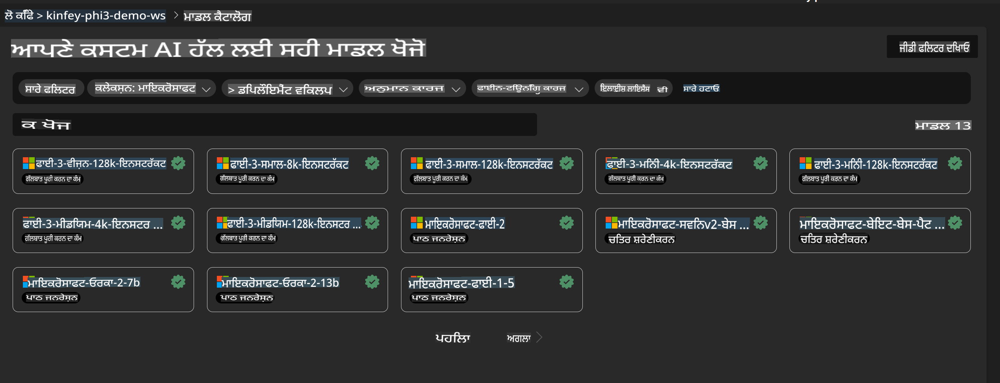
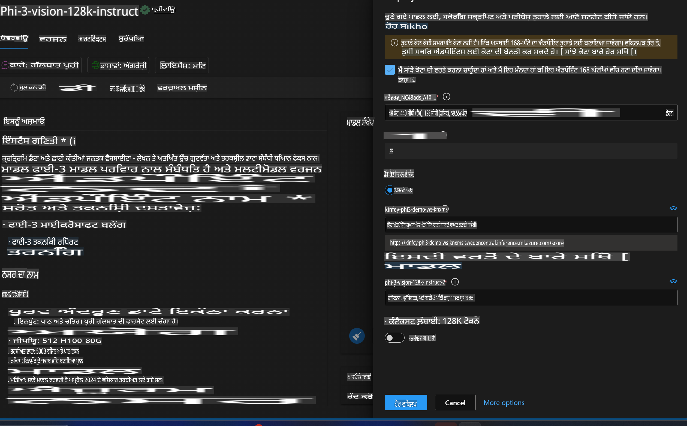
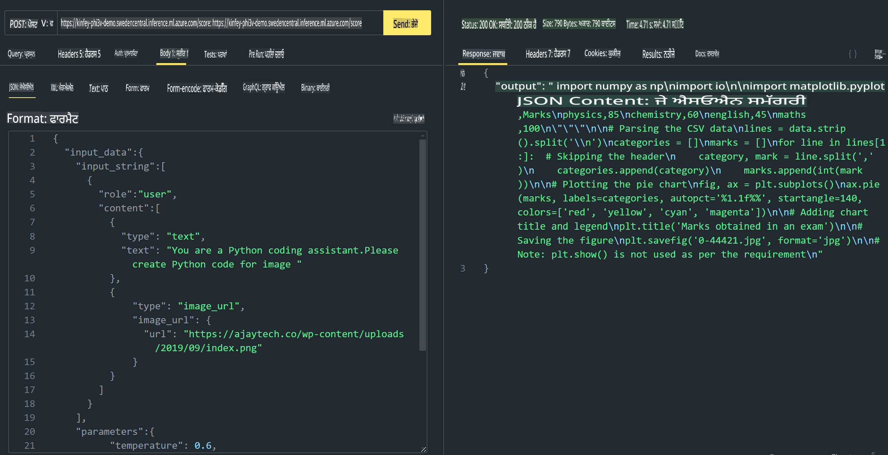

# **ਲੈਬ 3 - Azure Machine Learning Service 'ਤੇ Phi-3-Vision ਤਾਇਨਾਤ ਕਰੋ**

ਅਸੀਂ NPU ਦੀ ਵਰਤੋਂ ਕਰਕੇ ਸਥਾਨਕ ਕੋਡ ਦੀ ਉਤਪਾਦਨ ਤਾਇਨਾਤੀ ਨੂੰ ਪੂਰਾ ਕਰਦੇ ਹਾਂ, ਅਤੇ ਫਿਰ ਅਸੀਂ PHI-3-VISION ਦੀ ਸਮਰੱਥਾ ਨੂੰ ਪੇਸ਼ ਕਰਨ ਲਈ ਇਸਨੂੰ ਸ਼ਾਮਲ ਕਰਨ ਦੀ ਯੋਜਨਾ ਬਣਾਉਂਦੇ ਹਾਂ ਤਾਂ ਜੋ ਤਸਵੀਰਾਂ ਤੋਂ ਕੋਡ ਬਣਾਇਆ ਜਾ ਸਕੇ।

ਇਸ ਜਾਣਕਾਰੀ ਵਿੱਚ, ਅਸੀਂ ਤੇਜ਼ੀ ਨਾਲ Azure Machine Learning Service ਵਿੱਚ ਇੱਕ Model As Service Phi-3 Vision ਸੇਵਾ ਬਣਾਉਣ ਦੇ ਯੋਗ ਹੋਵਾਂਗੇ।

***ਨੋਟ***: Phi-3 Vision ਨੂੰ ਸਮੱਗਰੀ ਜਲਦੀ ਬਣਾਉਣ ਲਈ ਗਣਨਾ ਦੀ ਸ਼ਕਤੀ ਦੀ ਲੋੜ ਹੈ। ਸਾਨੂੰ ਇਸਨੂੰ ਹਾਸਲ ਕਰਨ ਲਈ ਕਲਾਉਡ ਕੰਪਿਊਟਿੰਗ ਦੀ ਸ਼ਕਤੀ ਦੀ ਲੋੜ ਹੋਵੇਗੀ।


### **1. Azure Machine Learning Service ਬਣਾਓ**

ਸਾਨੂੰ Azure ਪੋਰਟਲ ਵਿੱਚ ਇੱਕ Azure Machine Learning Service ਬਣਾਉਣ ਦੀ ਲੋੜ ਹੈ। ਜੇ ਤੁਸੀਂ ਸਿੱਖਣਾ ਚਾਹੁੰਦੇ ਹੋ ਕਿ ਕਿਵੇਂ, ਤਾਂ ਕਿਰਪਾ ਕਰਕੇ ਇਸ ਲਿੰਕ 'ਤੇ ਜਾਓ [https://learn.microsoft.com/azure/machine-learning/quickstart-create-resources?view=azureml-api-2](https://learn.microsoft.com/azure/machine-learning/quickstart-create-resources?view=azureml-api-2)


### **2. Azure Machine Learning Service ਵਿੱਚ Phi-3 Vision ਚੁਣੋ**




### **3. Phi-3-Vision ਨੂੰ Azure 'ਤੇ ਤਾਇਨਾਤ ਕਰੋ**





### **4. Postman ਵਿੱਚ Endpoint ਦਾ ਟੈਸਟ ਕਰੋ**





***ਨੋਟ***

1. ਭੇਜੇ ਜਾਣ ਵਾਲੇ ਪੈਰਾਮੀਟਰਾਂ ਵਿੱਚ Authorization, azureml-model-deployment, ਅਤੇ Content-Type ਸ਼ਾਮਲ ਹੋਣੇ ਚਾਹੀਦੇ ਹਨ। ਤੁਹਾਨੂੰ ਤਾਇਨਾਤੀ ਜਾਣਕਾਰੀ ਦੀ ਜਾਂਚ ਕਰਨੀ ਪਵੇਗੀ ਤਾਂ ਜੋ ਇਹ ਪ੍ਰਾਪਤ ਕੀਤਾ ਜਾ ਸਕੇ।

2. ਪੈਰਾਮੀਟਰ ਭੇਜਣ ਲਈ, Phi-3-Vision ਨੂੰ ਇੱਕ ਤਸਵੀਰ ਲਿੰਕ ਭੇਜਣ ਦੀ ਲੋੜ ਹੈ। ਕਿਰਪਾ ਕਰਕੇ GPT-4-Vision ਦੀ ਪদ্ধਤੀ ਦੇ ਹਵਾਲੇ ਨਾਲ ਪੈਰਾਮੀਟਰ ਭੇਜੋ, ਉਦਾਹਰਣ ਵਜੋਂ:

```json

{
  "input_data":{
    "input_string":[
      {
        "role":"user",
        "content":[ 
          {
            "type": "text",
            "text": "You are a Python coding assistant.Please create Python code for image "
          },
          {
              "type": "image_url",
              "image_url": {
                "url": "https://ajaytech.co/wp-content/uploads/2019/09/index.png"
              }
          }
        ]
      }
    ],
    "parameters":{
          "temperature": 0.6,
          "top_p": 0.9,
          "do_sample": false,
          "max_new_tokens": 2048
    }
  }
}

```

3. Post ਮੈਥਡ ਦੀ ਵਰਤੋਂ ਕਰਕੇ **/score** ਨੂੰ ਕਾਲ ਕਰੋ

**ਮੁਬਾਰਕਾਂ**! ਤੁਸੀਂ ਤੇਜ਼ PHI-3-VISION ਤਾਇਨਾਤੀ ਪੂਰੀ ਕਰ ਲਈ ਹੈ ਅਤੇ ਦੇਖਿਆ ਕਿ ਕਿਵੇਂ ਤਸਵੀਰਾਂ ਦੀ ਵਰਤੋਂ ਕਰਕੇ ਕੋਡ ਬਣਾਇਆ ਜਾ ਸਕਦਾ ਹੈ। ਅਗਲੇ ਪੜਾਅ ਵਿੱਚ, ਅਸੀਂ NPU ਅਤੇ ਕਲਾਉਡ ਨੂੰ ਜੋੜ ਕੇ ਐਪਲੀਕੇਸ਼ਨ ਬਣਾਉਣਗੇ।

**ਅਸਵੀਕਰਤੀ**:  
ਇਹ ਦਸਤਾਵੇਜ਼ ਮਸ਼ੀਨ-ਅਧਾਰਿਤ AI ਅਨੁਵਾਦ ਸੇਵਾਵਾਂ ਦੀ ਵਰਤੋਂ ਕਰਕੇ ਅਨੁਵਾਦਿਤ ਕੀਤਾ ਗਿਆ ਹੈ। ਜਦੋਂ ਕਿ ਅਸੀਂ ਸਹੀ ਹੋਣ ਦੀ ਕੋਸ਼ਿਸ਼ ਕਰਦੇ ਹਾਂ, ਕਿਰਪਾ ਕਰਕੇ ਧਿਆਨ ਦਿਓ ਕਿ ਸਵੈਚਾਲਿਤ ਅਨੁਵਾਦਾਂ ਵਿੱਚ ਗਲਤੀਆਂ ਜਾਂ ਅਸੁਚੱਜੇ ਪਾਸੇ ਹੋ ਸਕਦੇ ਹਨ। ਇਸਦੀ ਮੂਲ ਭਾਸ਼ਾ ਵਿੱਚ ਮੌਜੂਦ ਮੂਲ ਦਸਤਾਵੇਜ਼ ਨੂੰ ਅਧਿਕਾਰਕ ਸਰੋਤ ਮੰਨਿਆ ਜਾਣਾ ਚਾਹੀਦਾ ਹੈ। ਮਹੱਤਵਪੂਰਨ ਜਾਣਕਾਰੀ ਲਈ, ਪੇਸ਼ੇਵਰ ਮਨੁੱਖੀ ਅਨੁਵਾਦ ਦੀ ਸਿਫਾਰਿਸ਼ ਕੀਤੀ ਜਾਂਦੀ ਹੈ। ਇਸ ਅਨੁਵਾਦ ਦੇ ਪ੍ਰਯੋਗ ਤੋਂ ਪੈਦਾ ਹੋਣ ਵਾਲੇ ਕਿਸੇ ਵੀ ਗਲਤਫਹਿਮੀ ਜਾਂ ਗਲਤ ਵਿਆਖਿਆ ਲਈ ਅਸੀਂ ਜ਼ਿੰਮੇਵਾਰ ਨਹੀਂ ਹਾਂ।